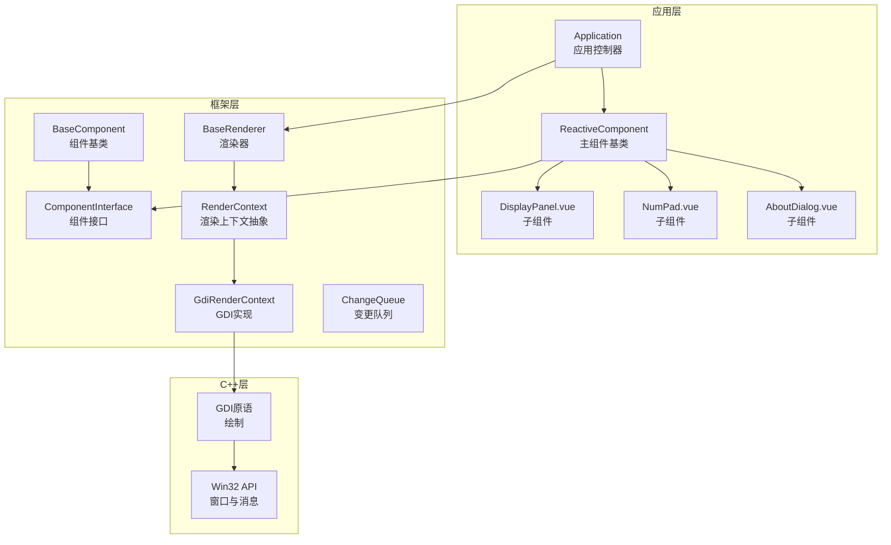
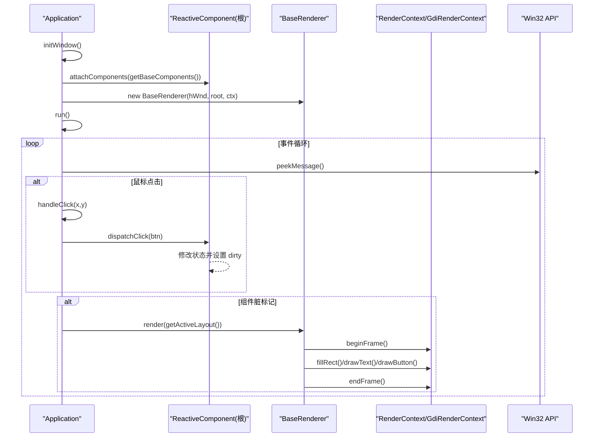
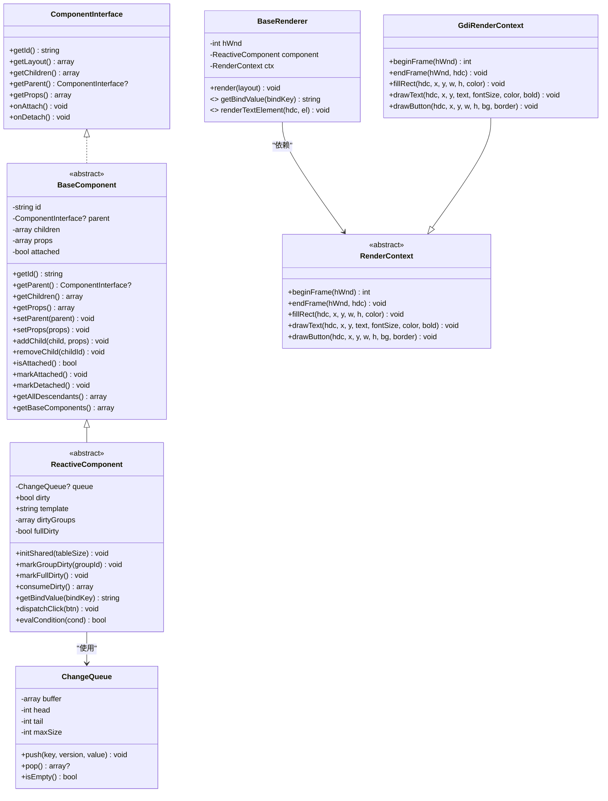
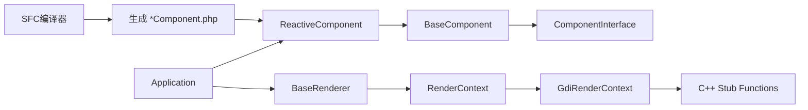

# API参考文档

<cite>
**本文档引用的文件**
- [framework/BaseComponent.php](file://framework/BaseComponent.php)
- [framework/ReactiveComponent.php](file://framework/ReactiveComponent.php)
- [framework/interfaces/ComponentInterface.php](file://framework/interfaces/ComponentInterface.php)
- [framework/BaseRenderer.php](file://framework/BaseRenderer.php)
- [framework/ChangeQueue.php](file://framework/ChangeQueue.php)
- [framework/rendering/RenderContext.php](file://framework/rendering/RenderContext.php)
- [framework/rendering/GdiRenderContext.php](file://framework/rendering/GdiRenderContext.php)
- [apps/calculator/App.vue](file://apps/calculator/App.vue)
- [apps/calculator/components/DisplayPanel.vue](file://apps/calculator/components/DisplayPanel.vue)
- [apps/calculator/components/NumPad.vue](file://apps/calculator/components/NumPad.vue)
- [apps/calculator/components/AboutDialog.vue](file://apps/calculator/components/AboutDialog.vue)
- [apps/calculator/Application.php](file://apps/calculator/Application.php)
- [framework/sfc-compiler.php](file://framework/sfc-compiler.php)
- [cpp/vue_calc.cc](file://cpp/vue_calc.cc)
- [stub/vue_calc.stub.php](file://stub/vue_calc.stub.php)
</cite>

## 目录
1. [简介](#简介)
2. [项目结构](#项目结构)
3. [核心组件](#核心组件)
4. [架构总览](#架构总览)
5. [详细组件分析](#详细组件分析)
6. [依赖分析](#依赖分析)
7. [性能考虑](#性能考虑)
8. [故障排除指南](#故障排除指南)
9. [结论](#结论)
10. [附录](#附录)

## 简介
本文件为VueCalc框架的完整API参考文档，面向开发者提供组件接口、基类方法与属性的权威规范，涵盖Calculator应用示例中的组件与渲染管线。文档包含：
- 接口与类的定义、参数与返回值说明
- 方法功能、调用时机与注意事项
- 组件继承关系与类层次结构
- 配置项与默认行为
- 最佳实践与常见陷阱
- 与C++层Win32 API的互操作说明

## 项目结构
VueCalc采用“SFC编译器 + 组件基类 + 渲染器 + 应用控制器”的分层架构。核心目录与职责如下：
- framework：框架核心（组件基类、渲染上下文、渲染器、变更队列）
- apps/calculator：示例应用（主组件与子组件、应用控制器）
- cpp：Win32 API封装（GDI绘制原语）
- stub：C++函数的PHP层声明
- docs：技术文档与规划

图表来源
- [apps/calculator/Application.php:15-36](file://apps/calculator/Application.php#L15-L36)
- [framework/BaseComponent.php:16-36](file://framework/BaseComponent.php#L16-L36)
- [framework/ReactiveComponent.php:14-35](file://framework/ReactiveComponent.php#L14-L35)
- [framework/BaseRenderer.php:15-26](file://framework/BaseRenderer.php#L15-L26)
- [framework/rendering/RenderContext.php:13-29](file://framework/rendering/RenderContext.php#L13-L29)
- [framework/rendering/GdiRenderContext.php:11-37](file://framework/rendering/GdiRenderContext.php#L11-L37)
- [cpp/vue_calc.cc:36-84](file://cpp/vue_calc.cc#L36-L84)

章节来源
- [apps/calculator/Application.php:15-36](file://apps/calculator/Application.php#L15-L36)
- [framework/BaseComponent.php:16-36](file://framework/BaseComponent.php#L16-L36)
- [framework/ReactiveComponent.php:14-35](file://framework/ReactiveComponent.php#L14-L35)
- [framework/BaseRenderer.php:15-26](file://framework/BaseRenderer.php#L15-L26)
- [framework/rendering/RenderContext.php:13-29](file://framework/rendering/RenderContext.php#L13-L29)
- [framework/rendering/GdiRenderContext.php:11-37](file://framework/rendering/GdiRenderContext.php#L11-L37)
- [cpp/vue_calc.cc:36-84](file://cpp/vue_calc.cc#L36-L84)

## 核心组件
本节梳理框架中的核心接口与类，明确其职责、方法签名与使用要点。

- ComponentInterface（组件接口）
  - 职责：定义组件树结构、生命周期与布局数据获取的统一契约
  - 关键方法
    - getId(): string
    - getLayout(): array
    - getChildren(): array
    - getParent(): ?ComponentInterface
    - getProps(): array
    - onAttach(): void
    - onDetach(): void
  - 注意事项
    - AOT兼容：显式返回类型，避免类型推断问题
    - 组件树管理：父/子引用与属性映射由具体实现负责

- BaseComponent（组件基类）
  - 职责：提供组件树基础能力（父子引用、子组件管理、属性配置、挂载状态）
  - 关键方法
    - getId(): string
    - getParent(): ?ComponentInterface
    - getChildren(): array
    - getProps(): array
    - setParent(ComponentInterface): void
    - setProps(array): void
    - addChild(ComponentInterface, array): void
    - removeChild(string): void
    - isAttached(): bool
    - markAttached(): void
    - markDetached(): void
    - getAllDescendants(): array
    - getBaseComponents(): array
  - 抽象方法（子类实现）
    - getLayout(): array
    - onAttach(): void
    - onDetach(): void
  - AOT兼容要点
    - 遍历关联数组使用array_keys()+for循环
    - 使用(strval)与(array)保证类型安全

- ReactiveComponent（响应式组件基类）
  - 职责：在BaseComponent基础上提供响应式状态管理（脏标记、组级脏标记、全量脏标记）
  - 关键属性
    - dirty: bool（是否需要重绘）
    - template: string（模板文件路径，可选）
    - dirtyGroups: array（组级脏标记集合）
    - fullDirty: bool（是否需要全量重绘）
  - 关键方法
    - initShared(int): void（初始化共享资源，如变更队列）
    - markGroupDirty(string): void
    - markFullDirty(): void
    - consumeDirty(): array（消费脏状态，返回full与groups）
    - getBindValue(string): string（绑定值获取）
    - dispatchClick(array): void（按钮点击处理）
    - evalCondition(array): bool（条件求值）
  - AOT兼容要点
    - 去除魔术方法，改为直接属性+手动脏标记

- BaseRenderer（渲染器）
  - 职责：两阶段分层渲染（确定最高活跃层 -> 分层绘制），调用渲染上下文执行绘制
  - 关键方法
    - render(array): void（接收预处理布局数据）
  - 渲染流程
    - 阶段1：扫描elements/buttons，确定最大层
    - 阶段2：按层从0到max逐层绘制，按钮在最高层优先
  - AOT兼容要点
    - 遍历使用array_keys()+for循环
    - 对嵌套数组进行(array)类型转换

- RenderContext（渲染上下文抽象）
  - 职责：后端无关的绘制接口抽象
  - 关键方法
    - beginFrame(int): int
    - endFrame(int, int): void
    - fillRect(int, int, int, int, int): void
    - drawText(int, int, int, string, int, int, int): void
    - drawButton(int, int, int, int, int, int): void

- GdiRenderContext（GDI实现）
  - 职责：Win32 GDI后端实现，委托C++层stub函数
  - 关键方法
    - beginFrame(int): int
    - endFrame(int, int): void
    - fillRect(int, int, int, int, int): void
    - drawText(int, int, int, string, int, int, int): void
    - drawButton(int, int, int, int, int, int): void

- ChangeQueue（变更队列）
  - 职责：环形缓冲实现的变更通知队列
  - 关键方法
    - push(string, int, $value): void
    - pop(): ?array
    - isEmpty(): bool

章节来源
- [framework/interfaces/ComponentInterface.php:13-52](file://framework/interfaces/ComponentInterface.php#L13-L52)
- [framework/BaseComponent.php:16-177](file://framework/BaseComponent.php#L16-L177)
- [framework/ReactiveComponent.php:14-90](file://framework/ReactiveComponent.php#L14-L90)
- [framework/BaseRenderer.php:15-197](file://framework/BaseRenderer.php#L15-L197)
- [framework/rendering/RenderContext.php:13-29](file://framework/rendering/RenderContext.php#L13-L29)
- [framework/rendering/GdiRenderContext.php:11-37](file://framework/rendering/GdiRenderContext.php#L11-L37)
- [framework/ChangeQueue.php:11-57](file://framework/ChangeQueue.php#L11-L57)

## 架构总览
下图展示从应用启动到渲染与事件处理的完整流程，以及各组件间的交互关系。

图表来源
- [apps/calculator/Application.php:51-76](file://apps/calculator/Application.php#L51-L76)
- [apps/calculator/Application.php:205-263](file://apps/calculator/Application.php#L205-L263)
- [framework/BaseRenderer.php:98-196](file://framework/BaseRenderer.php#L98-L196)
- [framework/rendering/GdiRenderContext.php:13-36](file://framework/rendering/GdiRenderContext.php#L13-L36)
- [cpp/vue_calc.cc:70-84](file://cpp/vue_calc.cc#L70-L84)

## 详细组件分析

### 组件接口与类层次结构

图表来源
- [framework/interfaces/ComponentInterface.php:13-52](file://framework/interfaces/ComponentInterface.php#L13-L52)
- [framework/BaseComponent.php:16-177](file://framework/BaseComponent.php#L16-L177)
- [framework/ReactiveComponent.php:14-90](file://framework/ReactiveComponent.php#L14-L90)
- [framework/BaseRenderer.php:15-197](file://framework/BaseRenderer.php#L15-L197)
- [framework/rendering/RenderContext.php:13-29](file://framework/rendering/RenderContext.php#L13-L29)
- [framework/rendering/GdiRenderContext.php:11-37](file://framework/rendering/GdiRenderContext.php#L11-L37)
- [framework/ChangeQueue.php:11-57](file://framework/ChangeQueue.php#L11-L57)

章节来源
- [framework/interfaces/ComponentInterface.php:13-52](file://framework/interfaces/ComponentInterface.php#L13-L52)
- [framework/BaseComponent.php:16-177](file://framework/BaseComponent.php#L16-L177)
- [framework/ReactiveComponent.php:14-90](file://framework/ReactiveComponent.php#L14-L90)
- [framework/BaseRenderer.php:15-197](file://framework/BaseRenderer.php#L15-L197)
- [framework/rendering/RenderContext.php:13-29](file://framework/rendering/RenderContext.php#L13-L29)
- [framework/rendering/GdiRenderContext.php:11-37](file://framework/rendering/GdiRenderContext.php#L11-L37)
- [framework/ChangeQueue.php:11-57](file://framework/ChangeQueue.php#L11-L57)

### 应用控制器 Application API
- 职责
  - 窗口初始化与显示
  - 组件树挂载与卸载
  - 事件循环与点击分发
  - 布局收集与渲染调度
- 关键方法
  - registerRootComponent(ReactiveComponent): void
  - initWindow(): bool
  - getActiveComponents(): array
  - getActiveLayout(): array
  - run(): void
  - detachComponent(string): void
- 事件处理
  - handleClick(int, int): void（分层命中测试，逆序从最高层测试）
  - dispatchClick(array): void（转发到根组件）

章节来源
- [apps/calculator/Application.php:15-322](file://apps/calculator/Application.php#L15-L322)

### 渲染器 BaseRenderer API
- render(array layout): void
  - 参数
    - layout: 预处理后的布局数据，包含elements与buttons数组
  - 流程
    - 消费脏状态（consumeDirty）
    - beginFrame -> 绘制 -> endFrame
    - 两阶段分层渲染：先确定最大层，再按层绘制
  - 注意
    - AOT安全：使用array_keys()+for循环遍历
    - 条件字段必须为数组，否则跳过

章节来源
- [framework/BaseRenderer.php:98-196](file://framework/BaseRenderer.php#L98-L196)

### 渲染上下文 RenderContext 与 GdiRenderContext
- RenderContext
  - beginFrame(int): int
  - endFrame(int, int): void
  - fillRect(int, int, int, int, int): void
  - drawText(int, int, int, string, int, int, int): void
  - drawButton(int, int, int, int, int, int): void
- GdiRenderContext
  - 委托C++层stub函数实现具体绘制

章节来源
- [framework/rendering/RenderContext.php:13-29](file://framework/rendering/RenderContext.php#L13-L29)
- [framework/rendering/GdiRenderContext.php:11-37](file://framework/rendering/GdiRenderContext.php#L11-L37)
- [stub/vue_calc.stub.php:12-24](file://stub/vue_calc.stub.php#L12-L24)
- [cpp/vue_calc.cc:90-157](file://cpp/vue_calc.cc#L90-L157)

### 响应式组件 ReactiveComponent API
- 属性
  - dirty: bool（脏标记）
  - template: string（模板路径，可选）
  - dirtyGroups: array（组级脏标记）
  - fullDirty: bool（全量脏标记）
- 方法
  - initShared(int): void
  - markGroupDirty(string): void
  - markFullDirty(): void
  - consumeDirty(): array
  - getBindValue(string): string
  - dispatchClick(array): void
  - evalCondition(array): bool

章节来源
- [framework/ReactiveComponent.php:14-90](file://framework/ReactiveComponent.php#L14-L90)

### 组件基类 BaseComponent API
- 属性
  - id: string
  - parent: ?ComponentInterface
  - children: array
  - props: array
  - attached: bool
- 方法
  - getId(): string
  - getParent(): ?ComponentInterface
  - getChildren(): array
  - getProps(): array
  - setParent(ComponentInterface): void
  - setProps(array): void
  - addChild(ComponentInterface, array): void
  - removeChild(string): void
  - isAttached(): bool
  - markAttached(): void
  - markDetached(): void
  - getAllDescendants(): array
  - getBaseComponents(): array
  - getLayout(): array（抽象）
  - onAttach(): void（抽象）
  - onDetach(): void（抽象）

章节来源
- [framework/BaseComponent.php:16-177](file://framework/BaseComponent.php#L16-L177)

### 计算器应用组件与交互
- 主组件 App.vue
  - 属性
    - display: string（显示值）
    - expression: string（表达式）
    - operand1: string（第一个操作数）
    - operator: string（当前运算符）
    - newInput: bool（是否开始新输入）
    - hasDecimal: bool（是否已输入小数点）
    - showDialog: bool（对话框状态）
    - dialogTitle/dialogContent/dialogVersion/closeHint: string（对话框文本）
  - 方法
    - reset(): void
    - inputDigit(string): void
    - inputDecimal(): void
    - inputOperator(string): void
    - calculate(): void
    - backspace(): void
    - handleButton(string): void
    - toggleAboutDialog(): void
- 子组件
  - DisplayPanel.vue：显示面板
  - NumPad.vue：数字键盘
  - AboutDialog.vue：关于对话框

章节来源
- [apps/calculator/App.vue:25-194](file://apps/calculator/App.vue#L25-L194)
- [apps/calculator/components/DisplayPanel.vue:1-12](file://apps/calculator/components/DisplayPanel.vue#L1-L12)
- [apps/calculator/components/NumPad.vue:1-37](file://apps/calculator/components/NumPad.vue#L1-L37)
- [apps/calculator/components/AboutDialog.vue:1-37](file://apps/calculator/components/AboutDialog.vue#L1-L37)

### SFC编译器与生成物
- 功能
  - 从.vue文件提取template/script/style块
  - 解析组件引用、样式映射、模板AST
  - 生成组件类（*.php），包含getLayout()/dispatchClick()/evalCondition()等
  - 生成根组件registerChildren()/getBaseComponents()
- 输出
  - *Component.php（组件类）
  - AOT校验通过后写入文件

章节来源
- [framework/sfc-compiler.php:1-819](file://framework/sfc-compiler.php#L1-L819)

### C++层Win32 API与互操作
- 函数族（PHP层以vue_开头，C++层以php_vue_开头）
  - 窗口管理：vue_window_create()/vue_window_show()/vue_quit_requested()/vue_peek_message()
  - GDI绘制：vue_begin_paint()/vue_end_paint()/vue_fill_rect()/vue_draw_text()/vue_draw_button()
- 作用
  - Application通过这些函数与Win32交互
  - GdiRenderContext委托C++层stub函数完成绘制

章节来源
- [stub/vue_calc.stub.php:12-24](file://stub/vue_calc.stub.php#L12-L24)
- [cpp/vue_calc.cc:36-84](file://cpp/vue_calc.cc#L36-L84)
- [cpp/vue_calc.cc:90-157](file://cpp/vue_calc.cc#L90-L157)

## 依赖分析
- 组件树依赖
  - ReactiveComponent继承BaseComponent，实现ComponentInterface
  - Application持有根组件与渲染器，负责事件循环与布局收集
- 渲染依赖
  - BaseRenderer依赖RenderContext；GdiRenderContext实现具体绘制
  - 绘制原语委托C++层stub函数
- 编译依赖
  - SFC编译器生成组件类，注入getBindValue/dispatchClick/evalCondition等方法

图表来源
- [apps/calculator/Application.php:15-36](file://apps/calculator/Application.php#L15-L36)
- [framework/BaseComponent.php:16-36](file://framework/BaseComponent.php#L16-L36)
- [framework/ReactiveComponent.php:14-35](file://framework/ReactiveComponent.php#L14-L35)
- [framework/BaseRenderer.php:15-26](file://framework/BaseRenderer.php#L15-L26)
- [framework/rendering/RenderContext.php:13-29](file://framework/rendering/RenderContext.php#L13-L29)
- [framework/rendering/GdiRenderContext.php:11-37](file://framework/rendering/GdiRenderContext.php#L11-L37)
- [framework/sfc-compiler.php:513-581](file://framework/sfc-compiler.php#L513-L581)
- [stub/vue_calc.stub.php:12-24](file://stub/vue_calc.stub.php#L12-L24)
- [cpp/vue_calc.cc:36-84](file://cpp/vue_calc.cc#L36-L84)

章节来源
- [apps/calculator/Application.php:15-36](file://apps/calculator/Application.php#L15-L36)
- [framework/BaseComponent.php:16-36](file://framework/BaseComponent.php#L16-L36)
- [framework/ReactiveComponent.php:14-35](file://framework/ReactiveComponent.php#L14-L35)
- [framework/BaseRenderer.php:15-26](file://framework/BaseRenderer.php#L15-L26)
- [framework/rendering/RenderContext.php:13-29](file://framework/rendering/RenderContext.php#L13-L29)
- [framework/rendering/GdiRenderContext.php:11-37](file://framework/rendering/GdiRenderContext.php#L11-L37)
- [framework/sfc-compiler.php:513-581](file://framework/sfc-compiler.php#L513-L581)
- [stub/vue_calc.stub.php:12-24](file://stub/vue_calc.stub.php#L12-L24)
- [cpp/vue_calc.cc:36-84](file://cpp/vue_calc.cc#L36-L84)

## 性能考虑
- 渲染性能
  - 两阶段分层渲染减少不必要的绘制，优先绘制最高层按钮
  - 文本元素根据长度动态调整字号，避免溢出与过度绘制
- 内存与类型安全（AOT）
  - 遍历关联数组使用array_keys()+for循环，避免foreach类型推断问题
  - 对嵌套数组使用(array)类型转换，确保后续访问安全
- 事件循环
  - 使用usleep(16ms)控制约60FPS，平衡流畅度与CPU占用
- 脏标记驱动
  - 仅在dirty为true时触发渲染，降低无效重绘

## 故障排除指南
- 渲染异常
  - 症状：渲染崩溃或无输出
  - 排查：确认layout中elements/buttons字段为数组；检查condition字段类型
  - 参考：BaseRenderer中对condition与数组类型的保护
- 点击未响应
  - 症状：点击无效果
  - 排查：确认按钮在最高活跃层；检查evalCondition返回值；确认dispatchClick正确转发
- 窗口创建失败
  - 症状：initWindow返回false
  - 排查：检查窗口创建参数与Win32 API返回值；查看错误输出
- AOT校验失败
  - 症状：生成文件未写入
  - 排查：根据AOT验证报告修正生成代码；确保类型注解与接口契约一致

章节来源
- [framework/BaseRenderer.php:112-136](file://framework/BaseRenderer.php#L112-L136)
- [apps/calculator/Application.php:223-239](file://apps/calculator/Application.php#L223-L239)
- [apps/calculator/Application.php:59-62](file://apps/calculator/Application.php#L59-L62)
- [framework/sfc-compiler.php:586-597](file://framework/sfc-compiler.php#L586-L597)

## 结论
VueCalc框架通过清晰的接口与分层设计，实现了从SFC模板到组件类的自动化生成，并以响应式状态与脏标记驱动高效渲染。配合C++层Win32 API封装，形成稳定、可维护且具备AOT兼容性的桌面应用框架。开发者可基于本API参考文档快速构建与扩展组件，遵循最佳实践与注意事项，获得可靠的开发体验。

## 附录

### API使用最佳实践
- 组件开发
  - 明确声明业务属性并在修改后设置dirty
  - 使用getBindValue按绑定键返回对应值
  - 在dispatchClick中根据handler映射调用相应方法
- 布局与渲染
  - 合理使用layer与condition，避免复杂条件导致命中测试开销过大
  - 文本对齐与容器尺寸配合使用，确保布局稳定
- 事件处理
  - 在事件循环中捕获异常，避免中断渲染循环
  - 点击命中测试从最高层逆序进行，保证覆盖层优先响应

### 常见陷阱与规避
- foreach类型推断问题
  - 规避：遍历关联数组时使用array_keys()+for循环
- 嵌套数组类型丢失
  - 规避：对返回的嵌套数组使用(array)类型转换
- 条件字段类型不匹配
  - 规避：确保condition为数组，否则跳过该元素/按钮
- 窗口与消息处理
  - 规避：正确处理WM_QUIT与退出标志，避免资源泄漏