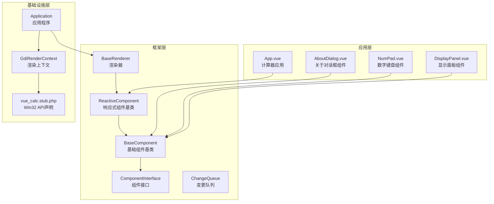
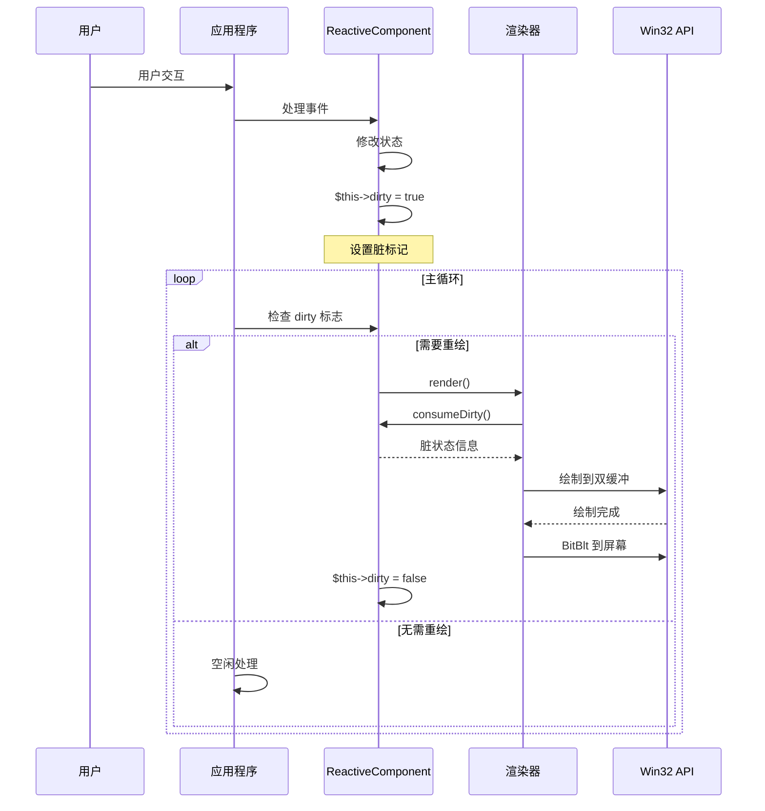
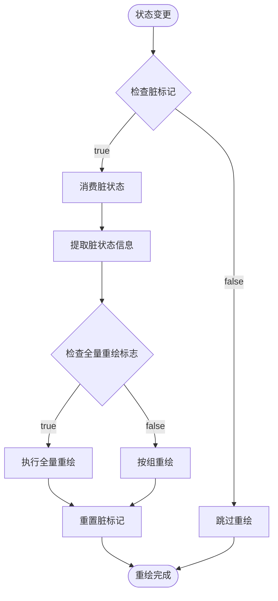
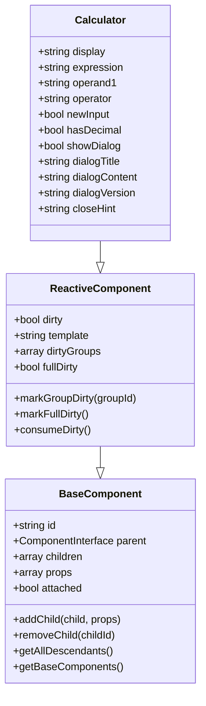
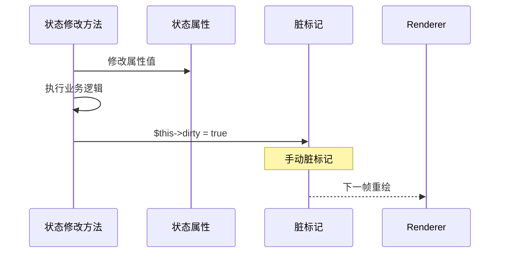
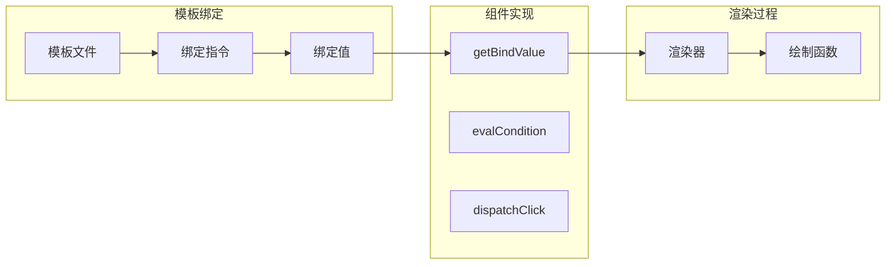
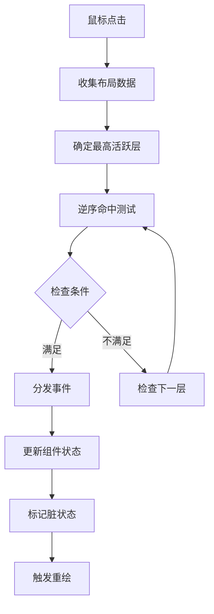
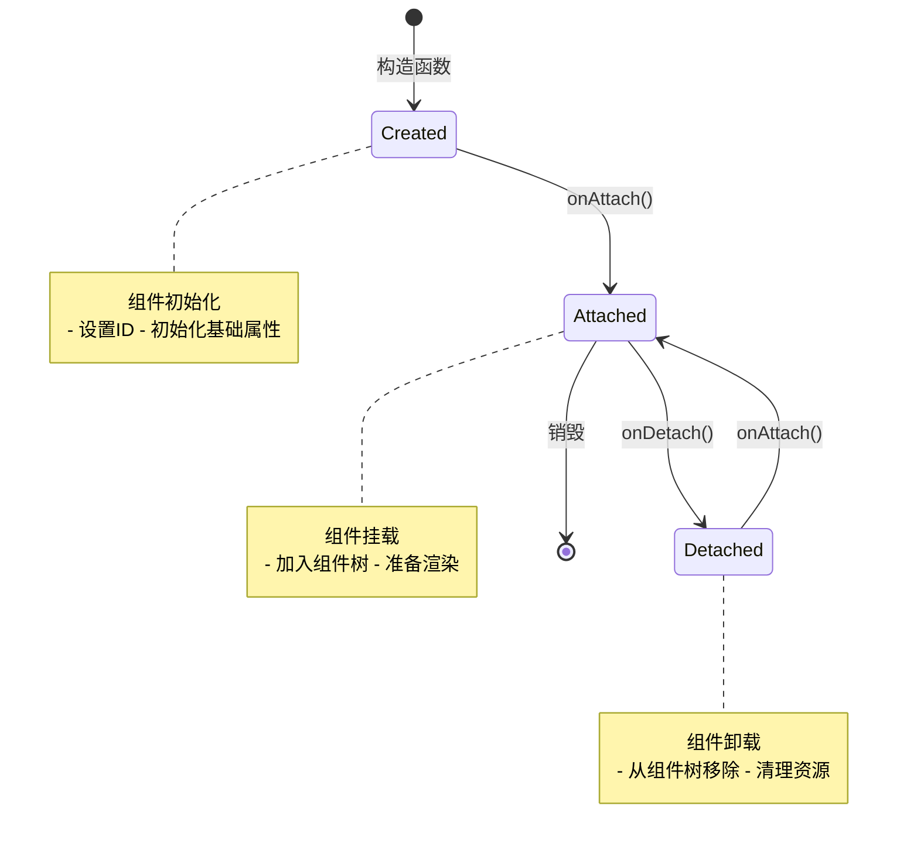
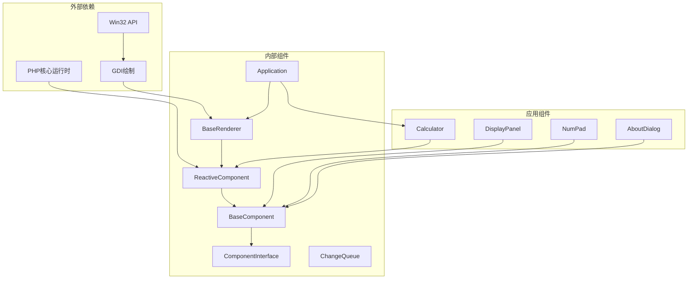
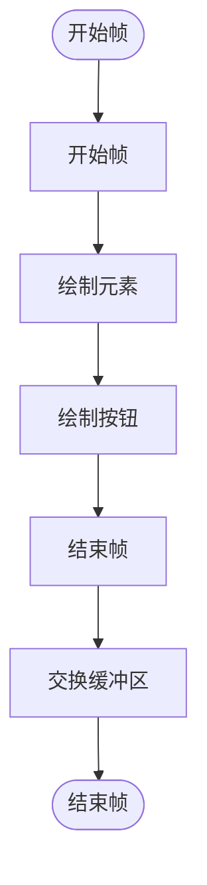

# 响应式组件API

<cite>
**本文档引用的文件**
- [ReactiveComponent.php](file://framework/ReactiveComponent.php)
- [BaseComponent.php](file://framework/BaseComponent.php)
- [ComponentInterface.php](file://framework/interfaces/ComponentInterface.php)
- [ChangeQueue.php](file://framework/ChangeQueue.php)
- [BaseRenderer.php](file://framework/BaseRenderer.php)
- [App.vue](file://apps/calculator/App.vue)
- [DisplayPanel.vue](file://apps/calculator/components/DisplayPanel.vue)
- [Application.php](file://apps/calculator/Application.php)
- [开发经验与教训.md](file://docs/开发经验与教训.md)
- [VueCalc技术文档_v1.html](file://docs/VueCalc技术文档_v1.html)
- [vue_calc.stub.php](file://stub/vue_calc.stub.php)
</cite>

## 目录
1. [简介](#简介)
2. [项目结构](#项目结构)
3. [核心组件](#核心组件)
4. [架构概览](#架构概览)
5. [详细组件分析](#详细组件分析)
6. [依赖关系分析](#依赖关系分析)
7. [性能考虑](#性能考虑)
8. [故障排除指南](#故障排除指南)
9. [结论](#结论)
10. [附录](#附录)

## 简介

ReactiveComponent是VueCalc框架中的响应式组件基类，专门为AOT（Ahead-of-Time）编译环境设计。该组件系统采用"手动脏标记"机制，通过显式的状态变更通知来实现高效的UI更新。与传统Vue.js的自动响应式不同，ReactiveComponent要求开发者在修改状态后手动调用脏标记，这种设计确保了在AOT编译环境下的稳定性和可靠性。

该系统的核心特点包括：
- **AOT兼容性**：完全兼容AOT编译，避免使用魔术方法和反射
- **手动脏标记**：每个状态变更都需要显式标记
- **分组脏标记**：支持按组别的精细化更新
- **全量重绘控制**：支持首帧和强制刷新机制
- **双缓冲渲染**：使用GDI双缓冲技术避免闪烁

## 项目结构

VueCalc框架采用分层架构设计，ReactiveComponent位于框架的核心层：



**图表来源**
- [ReactiveComponent.php:1-90](file://framework/ReactiveComponent.php#L1-L90)
- [BaseComponent.php:1-177](file://framework/BaseComponent.php#L1-L177)
- [ComponentInterface.php:1-52](file://framework/interfaces/ComponentInterface.php#L1-L52)

**章节来源**
- [ReactiveComponent.php:1-90](file://framework/ReactiveComponent.php#L1-L90)
- [BaseComponent.php:1-177](file://framework/BaseComponent.php#L1-L177)
- [ComponentInterface.php:1-52](file://framework/interfaces/ComponentInterface.php#L1-L52)

## 核心组件

### ReactiveComponent类

ReactiveComponent是整个响应式系统的核心，继承自BaseComponent，提供了完整的响应式状态管理能力。

#### 主要属性

| 属性名 | 类型 | 默认值 | 描述 |
|--------|------|--------|------|
| `$dirty` | `bool` | `false` | 脏标记，指示组件是否需要重绘 |
| `$template` | `string` | `''` | 模板文件路径（可选） |
| `$dirtyGroups` | `array` | `[]` | 分组级别的脏标记追踪 |
| `$fullDirty` | `bool` | `true` | 是否需要全量重绘（首帧/强制刷新） |

#### 核心方法

##### 构造函数
```php
public function __construct(?string $componentId = null)
```
- 初始化组件ID，默认使用类名
- 调用父类构造函数进行基础初始化

##### 初始化共享资源
```php
public function initShared(int $tableSize = 10240): void
```
- 初始化全局变更队列
- 为组件树提供共享的变更通知机制

##### 分组脏标记
```php
public function markGroupDirty(string $groupId): void
```
- 标记特定分组为脏状态
- 自动同时设置全局脏标记

##### 全量脏标记
```php
public function markFullDirty(): void
```
- 标记需要全量重绘
- 设置全量重绘标志和全局脏标记

##### 消费脏状态
```php
public function consumeDirty(): array
```
- 消费当前脏状态信息
- 返回包含全量重绘标志和分组信息的数组
- 重置内部脏标记状态

**章节来源**
- [ReactiveComponent.php:14-90](file://framework/ReactiveComponent.php#L14-L90)

### BaseComponent类

BaseComponent提供组件树结构的基础实现，支持父子组件引用和子组件管理。

#### 组件树管理

| 方法 | 参数 | 返回值 | 描述 |
|------|------|--------|------|
| `addChild()` | `ComponentInterface $child, array $props = []` | `void` | 添加子组件并设置父引用 |
| `removeChild()` | `string $childId` | `void` | 移除指定子组件 |
| `getAllDescendants()` | `无` | `array` | 获取所有后代组件（深度优先） |
| `getBaseComponents()` | `无` | `array` | 获取初始组件树（包含自身和所有后代） |

#### 生命周期管理

| 方法 | 参数 | 返回值 | 描述 |
|------|------|--------|------|
| `markAttached()` | `无` | `void` | 标记组件已挂载 |
| `markDetached()` | `无` | `void` | 标记组件已卸载 |
| `isAttached()` | `无` | `bool` | 检查组件是否已挂载 |

**章节来源**
- [BaseComponent.php:16-177](file://framework/BaseComponent.php#L16-L177)

### ComponentInterface接口

ComponentInterface定义了所有组件必须实现的核心方法，确保组件的一致性。

#### 必需方法

| 方法 | 参数 | 返回值 | 描述 |
|------|------|--------|------|
| `getId()` | `无` | `string` | 获取组件唯一标识 |
| `getLayout()` | `无` | `array` | 获取组件布局数据 |
| `getChildren()` | `无` | `array` | 获取子组件列表 |
| `getParent()` | `无` | `?ComponentInterface` | 获取父组件引用 |
| `getProps()` | `无` | `array` | 获取组件配置属性 |
| `onAttach()` | `无` | `void` | 组件挂载回调 |
| `onDetach()` | `无` | `void` | 组件卸载回调 |

**章节来源**
- [ComponentInterface.php:13-52](file://framework/interfaces/ComponentInterface.php#L13-L52)

## 架构概览

VueCalc的响应式系统采用"事件驱动 + 脏标记"的设计模式，实现了高效的UI更新机制。



**图表来源**
- [ReactiveComponent.php:57-64](file://framework/ReactiveComponent.php#L57-L64)
- [BaseRenderer.php:98-197](file://framework/BaseRenderer.php#L98-L197)
- [Application.php:250-263](file://apps/calculator/Application.php#L250-L263)

### 脏标记算法实现

脏标记算法是响应式系统的核心，实现了精确的状态变更检测和最小化重绘。



**图表来源**
- [ReactiveComponent.php:42-64](file://framework/ReactiveComponent.php#L42-L64)
- [BaseRenderer.php:100-101](file://framework/BaseRenderer.php#L100-L101)

**章节来源**
- [ReactiveComponent.php:42-64](file://framework/ReactiveComponent.php#L42-L64)
- [BaseRenderer.php:98-197](file://framework/BaseRenderer.php#L98-L197)

## 详细组件分析

### 响应式属性声明

在ReactiveComponent中，响应式属性采用显式声明的方式，每个属性都是公共的无类型属性。

#### 属性声明模式



**图表来源**
- [App.vue:27-52](file://apps/calculator/App.vue#L27-L52)
- [ReactiveComponent.php:14-30](file://framework/ReactiveComponent.php#L14-L30)
- [BaseComponent.php:16-36](file://framework/BaseComponent.php#L16-L36)

#### 状态变更检测机制

状态变更检测通过手动脏标记实现，每个修改状态的方法都需要显式调用脏标记：



**图表来源**
- [App.vue:66-79](file://apps/calculator/App.vue#L66-L79)
- [App.vue:168-186](file://apps/calculator/App.vue#L168-L186)

**章节来源**
- [App.vue:27-52](file://apps/calculator/App.vue#L27-L52)
- [App.vue:66-79](file://apps/calculator/App.vue#L66-L79)
- [App.vue:168-186](file://apps/calculator/App.vue#L168-L186)

### 数据绑定和事件处理

#### 数据绑定机制

ReactiveComponent通过模板系统实现双向数据绑定：



**图表来源**
- [ReactiveComponent.php:68-90](file://framework/ReactiveComponent.php#L68-L90)
- [BaseRenderer.php:28-32](file://framework/BaseRenderer.php#L28-L32)

#### 事件处理流程

事件处理采用分层命中测试机制：



**图表来源**
- [BaseRenderer.php:125-136](file://framework/BaseRenderer.php#L125-L136)
- [Application.php:269-287](file://apps/calculator/Application.php#L269-L287)

**章节来源**
- [ReactiveComponent.php:68-90](file://framework/ReactiveComponent.php#L68-L90)
- [BaseRenderer.php:28-32](file://framework/BaseRenderer.php#L28-L32)
- [Application.php:269-287](file://apps/calculator/Application.php#L269-L287)

### 生命周期管理

ReactiveComponent的生命周期管理遵循标准的组件生命周期模式：



**图表来源**
- [BaseComponent.php:118-129](file://framework/BaseComponent.php#L118-L129)
- [BaseComponent.php:172-177](file://framework/BaseComponent.php#L172-L177)

**章节来源**
- [BaseComponent.php:118-129](file://framework/BaseComponent.php#L118-L129)
- [BaseComponent.php:172-177](file://framework/BaseComponent.php#L172-L177)

## 依赖关系分析

### 组件间依赖



**图表来源**
- [ReactiveComponent.php:14-17](file://framework/ReactiveComponent.php#L14-L17)
- [BaseRenderer.php:15-26](file://framework/BaseRenderer.php#L15-L26)
- [vue_calc.stub.php:12-24](file://stub/vue_calc.stub.php#L12-L24)

### 性能依赖

| 依赖项 | 影响程度 | 优化建议 |
|--------|----------|----------|
| PHP核心运行时 | 高 | 使用AOT编译优化 |
| Win32 API | 高 | 使用双缓冲避免闪烁 |
| GDI绘制 | 中 | 优化绘制顺序 |
| 反射机制 | 低 | 避免使用反射 |
| 魔术方法 | 低 | 避免使用魔术方法 |

**章节来源**
- [vue_calc.stub.php:12-24](file://stub/vue_calc.stub.php#L12-L24)
- [ReactiveComponent.php:14-17](file://framework/ReactiveComponent.php#L14-L17)

## 性能考虑

### 脏标记优化策略

#### 1. 分组脏标记
通过`markGroupDirty()`方法实现精细化更新，避免全量重绘：

```php
// 示例：仅更新显示面板
$this->markGroupDirty('display');
```

#### 2. 全量重绘控制
`markFullDirty()`用于首帧渲染和强制刷新场景：

```php
// 首次渲染或强制刷新
$this->markFullDirty();
```

#### 3. 渲染批处理
渲染器采用双缓冲技术，避免闪烁并提高性能：



**图表来源**
- [BaseRenderer.php:103-195](file://framework/BaseRenderer.php#L103-L195)

### 内存管理优化

#### 1. 环形缓冲队列
ChangeQueue使用固定大小的环形缓冲区，避免内存泄漏：

```php
class ChangeQueue {
    private array $buffer = [];
    private int $head = 0;
    private int $tail = 0;
    private int $maxSize = 4096; // 固定大小
}
```

#### 2. 组件树优化
使用数组索引而非对象引用，减少内存占用：

```php
protected array $children = []; // 使用关联数组
```

**章节来源**
- [ChangeQueue.php:11-57](file://framework/ChangeQueue.php#L11-L57)
- [BaseComponent.php:24-25](file://framework/BaseComponent.php#L24-L25)

## 故障排除指南

### 常见问题及解决方案

#### 1. 脏标记未设置
**问题**：状态变更后UI不更新
**解决方案**：确保每个状态修改方法末尾都有`$this->dirty = true`

#### 2. AOT编译错误
**问题**：使用`__get/__set`导致编译错误
**解决方案**：使用显式属性声明和手动脏标记

#### 3. 内存泄漏
**问题**：组件销毁后资源未释放
**解决方案**：正确实现`onDetach()`方法清理资源

#### 4. 渲染性能问题
**问题**：频繁重绘导致CPU占用过高
**解决方案**：使用分组脏标记和全量重绘控制

**章节来源**
- [开发经验与教训.md:188-213](file://docs/开发经验与教训.md#L188-L213)
- [VueCalc技术文档_v1.html:444-447](file://docs/VueCalc技术文档_v1.html#L444-L447)

### 调试技巧

#### 1. 脏标记调试
```php
// 在关键位置添加调试输出
echo "Dirty flag: " . ($this->dirty ? 'true' : 'false') . "\n";
```

#### 2. 组件树调试
```php
// 查看组件树结构
foreach ($this->getAllDescendants() as $descendant) {
    echo "Component: " . $descendant->getId() . "\n";
}
```

#### 3. 渲染调试
```php
// 检查渲染状态
$dirtyInfo = $this->consumeDirty();
echo "Full dirty: " . ($dirtyInfo['full'] ? 'true' : 'false') . "\n";
```

## 结论

ReactiveComponent响应式组件系统通过精心设计的架构，在AOT编译环境下实现了高效、可靠的UI更新机制。其核心优势包括：

1. **AOT兼容性**：完全避免使用魔术方法和反射，确保编译稳定性
2. **手动控制**：显式的脏标记机制提供了精确的控制能力
3. **性能优化**：分组脏标记和全量重绘控制实现了高效的渲染
4. **架构清晰**：分层设计使得系统易于理解和维护

该系统为开发者提供了一个可靠的响应式UI组件开发框架，特别适合需要AOT编译的应用场景。通过遵循本文档的最佳实践，开发者可以构建高性能、稳定的响应式界面。

## 附录

### API参考表

#### ReactiveComponent核心API

| 方法 | 参数 | 返回值 | 描述 |
|------|------|--------|------|
| `__construct()` | `?string $componentId` | `void` | 构造函数 |
| `initShared()` | `int $tableSize` | `void` | 初始化共享资源 |
| `markGroupDirty()` | `string $groupId` | `void` | 标记分组脏状态 |
| `markFullDirty()` | `无` | `void` | 标记全量重绘 |
| `consumeDirty()` | `无` | `array` | 消费脏状态信息 |
| `getBindValue()` | `string $bindKey` | `string` | 获取绑定值 |
| `dispatchClick()` | `array $btn` | `void` | 处理按钮点击 |
| `evalCondition()` | `array $cond` | `bool` | 求值条件表达式 |

#### 状态管理最佳实践

1. **属性声明**：使用`public`无类型属性
2. **脏标记**：每个状态修改后调用`$this->dirty = true`
3. **分组管理**：合理使用分组脏标记
4. **生命周期**：正确实现生命周期回调方法
5. **资源清理**：在`onDetach()`中清理资源