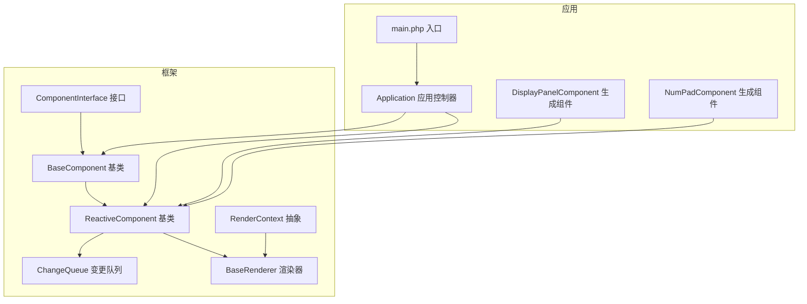
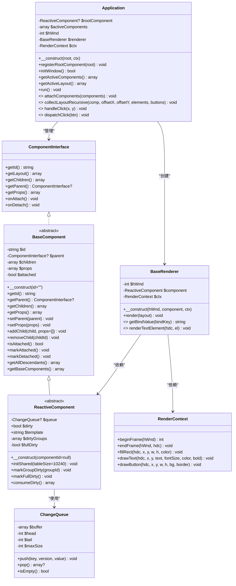
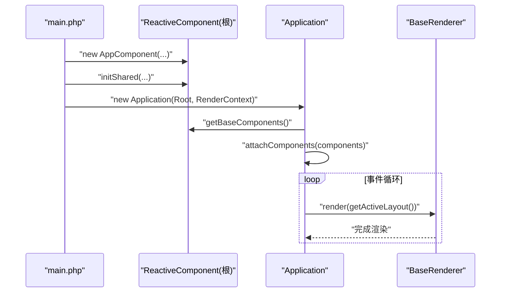
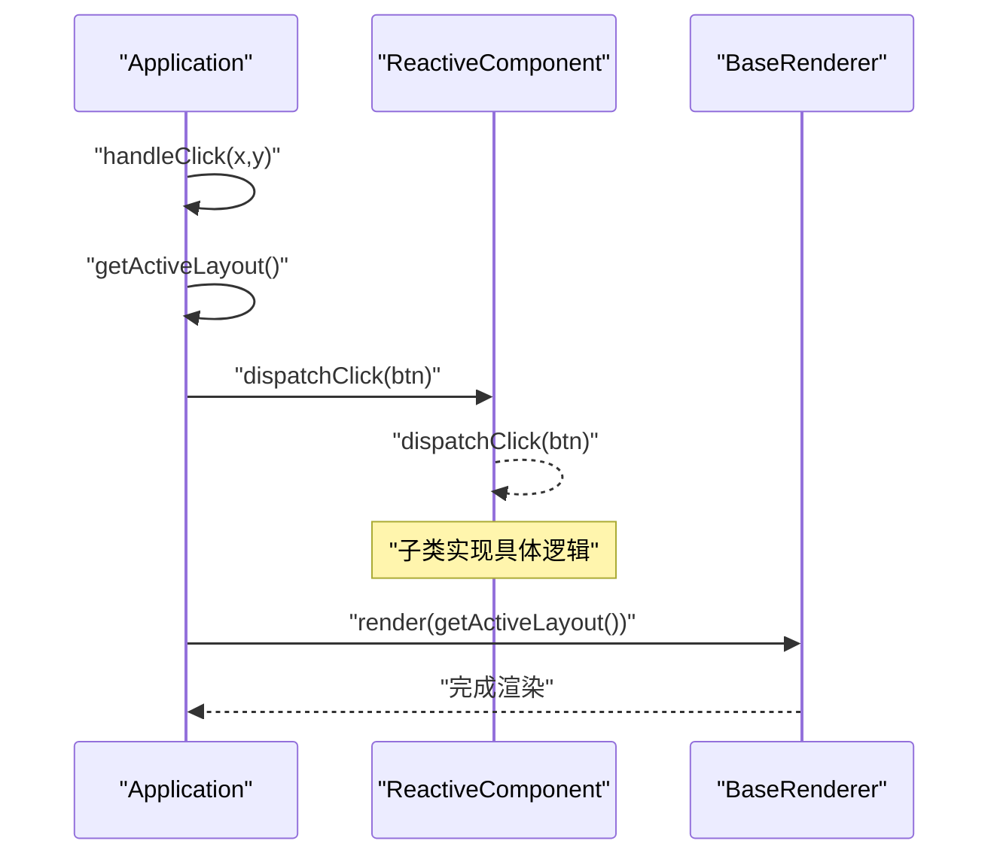
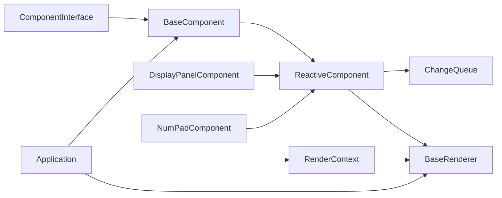
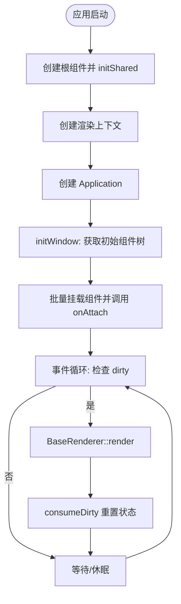

# 基础组件API

<cite>
**本文引用的文件**
- [framework/BaseComponent.php](file://framework/BaseComponent.php)
- [framework/interfaces/ComponentInterface.php](file://framework/interfaces/ComponentInterface.php)
- [framework/ReactiveComponent.php](file://framework/ReactiveComponent.php)
- [framework/ChangeQueue.php](file://framework/ChangeQueue.php)
- [framework/BaseRenderer.php](file://framework/BaseRenderer.php)
- [framework/rendering/RenderContext.php](file://framework/rendering/RenderContext.php)
- [apps/calculator/Application.php](file://apps/calculator/Application.php)
- [apps/calculator/main.php](file://apps/calculator/main.php)
- [apps/calculator/gen/DisplayPanelComponent.php](file://apps/calculator/gen/DisplayPanelComponent.php)
- [apps/calculator/gen/NumPadComponent.php](file://apps/calculator/gen/NumPadComponent.php)
</cite>

## 目录
1. [简介](#简介)
2. [项目结构](#项目结构)
3. [核心组件](#核心组件)
4. [架构总览](#架构总览)
5. [详细组件分析](#详细组件分析)
6. [依赖分析](#依赖分析)
7. [性能考虑](#性能考虑)
8. [故障排查指南](#故障排查指南)
9. [结论](#结论)
10. [附录](#附录)

## 简介
本文件为 BaseComponent 基类的完整API文档，覆盖其作为组件树基础实现的职责：组件标识、父子关系、子组件管理、属性配置、挂载/卸载状态、后代遍历与初始组件树提取。同时说明 BaseComponent 如何实现 ComponentInterface 接口，并阐述 ReactiveComponent 在其之上提供的响应式状态与变更队列能力。文档还给出组件初始化、挂载、卸载的完整流程，以及继承与扩展的最佳实践。

## 项目结构
- 框架层
  - BaseComponent：组件树与生命周期的基础实现，实现 ComponentInterface
  - ComponentInterface：组件核心契约定义
  - ReactiveComponent：在 BaseComponent 上扩展响应式状态与变更队列
  - ChangeQueue：环形缓冲变更队列
  - BaseRenderer：渲染调度与两阶段分层渲染
  - RenderContext：渲染后端抽象
- 应用层
  - Application：窗口初始化、组件树挂载、事件循环、布局收集与点击分发
  - main.php：应用入口，负责创建根组件、渲染上下文、Application 并启动事件循环
  - 生成组件：DisplayPanelComponent、NumPadComponent 等，展示如何继承 ReactiveComponent 并实现具体布局与交互

图表来源
- [framework/BaseComponent.php:16-177](file://framework/BaseComponent.php#L16-L177)
- [framework/interfaces/ComponentInterface.php:13-52](file://framework/interfaces/ComponentInterface.php#L13-L52)
- [framework/ReactiveComponent.php:14-90](file://framework/ReactiveComponent.php#L14-L90)
- [framework/ChangeQueue.php:11-57](file://framework/ChangeQueue.php#L11-L57)
- [framework/BaseRenderer.php:15-197](file://framework/BaseRenderer.php#L15-L197)
- [framework/rendering/RenderContext.php:13-30](file://framework/rendering/RenderContext.php#L13-L30)
- [apps/calculator/Application.php:15-322](file://apps/calculator/Application.php#L15-L322)
- [apps/calculator/main.php:19-48](file://apps/calculator/main.php#L19-L48)
- [apps/calculator/gen/DisplayPanelComponent.php:11-84](file://apps/calculator/gen/DisplayPanelComponent.php#L11-L84)
- [apps/calculator/gen/NumPadComponent.php:11-338](file://apps/calculator/gen/NumPadComponent.php#L11-L338)

章节来源
- [framework/BaseComponent.php:16-177](file://framework/BaseComponent.php#L16-L177)
- [framework/interfaces/ComponentInterface.php:13-52](file://framework/interfaces/ComponentInterface.php#L13-L52)
- [apps/calculator/Application.php:15-322](file://apps/calculator/Application.php#L15-L322)
- [apps/calculator/main.php:19-48](file://apps/calculator/main.php#L19-L48)

## 核心组件
- BaseComponent
  - 实现 ComponentInterface 的基础组件树与生命周期管理
  - 关键字段：$id、$parent、$children、$props、$attached
  - 关键方法：getId、getParent、getChildren、getProps、setParent、setProps、addChild、removeChild、isAttached、markAttached、markDetached、getAllDescendants、getBaseComponents；抽象方法：getLayout、onAttach、onDetach
- ComponentInterface
  - 组件契约：getId、getLayout、getChildren、getParent、getProps、onAttach、onDetach
- ReactiveComponent
  - 继承 BaseComponent，增加响应式状态：$dirty、$template、$dirtyGroups、$fullDirty
  - 新增方法：initShared、markGroupDirty、markFullDirty、consumeDirty；抽象方法：getBindValue、dispatchClick、evalCondition
- ChangeQueue
  - 环形缓冲队列，支持 push/pop/isEmpty
- BaseRenderer
  - 两阶段分层渲染：先确定最高活跃层，再按层渲染元素与按钮
  - 从组件消费 dirty 状态，按条件过滤与层信息进行渲染
- RenderContext
  - 渲染后端抽象：beginFrame、endFrame、fillRect、drawText、drawButton
- Application
  - 窗口初始化、批量挂载组件、收集布局并应用偏移、事件循环与点击分发
- 生成组件示例
  - DisplayPanelComponent、NumPadComponent：继承 ReactiveComponent，实现 getLayout、getBindValue、dispatchClick、evalCondition

章节来源
- [framework/BaseComponent.php:16-177](file://framework/BaseComponent.php#L16-L177)
- [framework/interfaces/ComponentInterface.php:13-52](file://framework/interfaces/ComponentInterface.php#L13-L52)
- [framework/ReactiveComponent.php:14-90](file://framework/ReactiveComponent.php#L14-L90)
- [framework/ChangeQueue.php:11-57](file://framework/ChangeQueue.php#L11-L57)
- [framework/BaseRenderer.php:15-197](file://framework/BaseRenderer.php#L15-L197)
- [framework/rendering/RenderContext.php:13-30](file://framework/rendering/RenderContext.php#L13-L30)
- [apps/calculator/Application.php:15-322](file://apps/calculator/Application.php#L15-L322)
- [apps/calculator/gen/DisplayPanelComponent.php:11-84](file://apps/calculator/gen/DisplayPanelComponent.php#L11-L84)
- [apps/calculator/gen/NumPadComponent.php:11-338](file://apps/calculator/gen/NumPadComponent.php#L11-L338)

## 架构总览
BaseComponent 作为组件树的基础设施，向上实现 ComponentInterface，向下被 ReactiveComponent 扩展以支持响应式状态与渲染。Application 负责应用生命周期与事件循环，BaseRenderer 负责渲染调度，RenderContext 抽象后端绘制。生成组件通过继承 ReactiveComponent 实现具体布局与交互。

图表来源
- [framework/BaseComponent.php:16-177](file://framework/BaseComponent.php#L16-L177)
- [framework/interfaces/ComponentInterface.php:13-52](file://framework/interfaces/ComponentInterface.php#L13-L52)
- [framework/ReactiveComponent.php:14-90](file://framework/ReactiveComponent.php#L14-L90)
- [framework/ChangeQueue.php:11-57](file://framework/ChangeQueue.php#L11-L57)
- [framework/BaseRenderer.php:15-197](file://framework/BaseRenderer.php#L15-L197)
- [framework/rendering/RenderContext.php:13-30](file://framework/rendering/RenderContext.php#L13-L30)
- [apps/calculator/Application.php:15-322](file://apps/calculator/Application.php#L15-L322)

## 详细组件分析

### BaseComponent 基类 API
- 组件标识与属性
  - getId：返回组件唯一标识
  - getProps/setProps：读取/设置组件属性（如偏移 x/y 等）
- 父子关系与子组件管理
  - getParent/setParent：获取/设置父组件引用
  - getChildren：返回子组件映射（id => ComponentInterface）
  - addChild：添加子组件并建立父子关系，可选传入 props
  - removeChild：移除子组件并触发 onDetach
- 生命周期与挂载状态
  - isAttached：检查组件是否已挂载
  - markAttached/markDetached：由 Application 标记挂载/卸载状态
- 组件树遍历与初始组件树
  - getAllDescendants：深度优先收集所有后代
  - getBaseComponents：返回包含自身与所有后代的初始组件树（用于 Application 初始化挂载）

章节来源
- [framework/BaseComponent.php:33-177](file://framework/BaseComponent.php#L33-L177)
- [framework/interfaces/ComponentInterface.php:13-52](file://framework/interfaces/ComponentInterface.php#L13-L52)

### BaseComponent 与 ComponentInterface 的关系
- BaseComponent 显式实现 ComponentInterface 的所有方法
- BaseComponent 通过受保护字段维护组件树与状态，提供便捷的 addChild/removeChild 等工具方法
- 子类需实现抽象方法：getLayout、onAttach、onDetach

章节来源
- [framework/BaseComponent.php:16-177](file://framework/BaseComponent.php#L16-L177)
- [framework/interfaces/ComponentInterface.php:13-52](file://framework/interfaces/ComponentInterface.php#L13-L52)

### ReactiveComponent 响应式扩展
- 状态与变更
  - $dirty：脏标记，指示是否需要重绘
  - $dirtyGroups/$fullDirty：分组级与全量重绘标记
  - initShared：初始化共享变更队列
  - markGroupDirty/markFullDirty/consumeDirty：变更追踪与消费
- 与渲染协作
  - BaseRenderer 在每帧开始消费组件的 dirty 状态，决定是否重新渲染
- 与 BaseComponent 的关系
  - 继承 BaseComponent，复用组件树与生命周期管理
  - 子类需实现 getBindValue、dispatchClick、evalCondition

章节来源
- [framework/ReactiveComponent.php:14-90](file://framework/ReactiveComponent.php#L14-L90)
- [framework/BaseRenderer.php:98-197](file://framework/BaseRenderer.php#L98-L197)
- [framework/ChangeQueue.php:11-57](file://framework/ChangeQueue.php#L11-L57)

### 组件初始化、挂载与卸载流程
- 初始化
  - main.php 创建根组件（例如 AppComponent），调用 initShared 初始化共享资源
  - 创建渲染上下文（如 GdiRenderContext），构造 Application
- 挂载
  - Application::initWindow 调用 root->getBaseComponents 获取初始组件树
  - Application::attachComponents 将组件加入活跃列表并依次调用 onAttach
- 运行与渲染
  - Application::run 进入事件循环，根据 rootComponent->dirty 决定是否调用 BaseRenderer::render
  - BaseRenderer::render 两阶段分层渲染，先确定最高活跃层，再逐层渲染元素与按钮
- 卸载
  - Application::detachComponent 从活跃列表移除组件并调用 onDetach

图表来源
- [apps/calculator/main.php:19-48](file://apps/calculator/main.php#L19-L48)
- [apps/calculator/Application.php:51-91](file://apps/calculator/Application.php#L51-L91)
- [framework/BaseRenderer.php:98-197](file://framework/BaseRenderer.php#L98-L197)

章节来源
- [apps/calculator/main.php:19-48](file://apps/calculator/main.php#L19-L48)
- [apps/calculator/Application.php:51-91](file://apps/calculator/Application.php#L51-L91)
- [framework/BaseRenderer.php:98-197](file://framework/BaseRenderer.php#L98-L197)

### 组件状态管理与父子关系维护
- 状态管理
  - ReactiveComponent 维护 $dirty、$dirtyGroups、$fullDirty，并通过 consumeDirty 在渲染后重置
  - BaseRenderer 在每帧开始消费 dirty 信息，决定渲染范围
- 父子关系
  - addChild 自动设置 child->setParent(this)，并可选设置 child->setProps(props)
  - removeChild 调用 child->onDetach 后从 children 中移除
  - getAllDescendants 使用深度优先遍历收集后代，适合构建初始组件树或调试

章节来源
- [framework/BaseComponent.php:84-105](file://framework/BaseComponent.php#L84-L105)
- [framework/BaseComponent.php:137-154](file://framework/BaseComponent.php#L137-L154)
- [framework/ReactiveComponent.php:57-64](file://framework/ReactiveComponent.php#L57-L64)
- [framework/BaseRenderer.php:100-101](file://framework/BaseRenderer.php#L100-L101)

### 事件处理机制
- 点击分发
  - Application::handleClick 收集布局中的按钮，按层进行命中测试
  - 命中后调用 Application::dispatchClick，最终分发到根组件的 dispatchClick
- 条件渲染
  - BaseRenderer::render 与 Application::collectLayoutRecursive 在渲染前评估条件表达式
  - ReactiveComponent::evalCondition 由子类实现，用于判断元素/按钮是否可见

图表来源
- [apps/calculator/Application.php:269-321](file://apps/calculator/Application.php#L269-L321)
- [framework/BaseRenderer.php:98-197](file://framework/BaseRenderer.php#L98-L197)
- [framework/ReactiveComponent.php:81-89](file://framework/ReactiveComponent.php#L81-L89)

章节来源
- [apps/calculator/Application.php:269-321](file://apps/calculator/Application.php#L269-L321)
- [framework/BaseRenderer.php:98-197](file://framework/BaseRenderer.php#L98-L197)
- [framework/ReactiveComponent.php:81-89](file://framework/ReactiveComponent.php#L81-L89)

### 继承与扩展最佳实践
- 继承 BaseComponent
  - 必须实现 getLayout 返回布局数据（elements/buttons）
  - 必须实现 onAttach/onDetach 完成挂载/卸载时的资源准备与清理
  - 使用 addChild/removeChild 维护子组件树，确保 setParent 与 setProps 正确传递
- 继承 ReactiveComponent
  - 声明业务状态属性，并在修改后调用 $this->dirty = true 或更高粒度的 markGroupDirty/markFullDirty
  - 实现 getBindValue、dispatchClick、evalCondition 以支持渲染与交互
  - 在 initShared 中初始化共享资源（如 ChangeQueue）
- 生成组件参考
  - DisplayPanelComponent、NumPadComponent 展示了最小化实现：空布局、空点击处理、恒真条件
  - NumPadComponent 展示了按钮布局与 handler 分发模式

章节来源
- [framework/BaseComponent.php:172-177](file://framework/BaseComponent.php#L172-L177)
- [framework/ReactiveComponent.php:31-35](file://framework/ReactiveComponent.php#L31-L35)
- [framework/ReactiveComponent.php:66-90](file://framework/ReactiveComponent.php#L66-L90)
- [apps/calculator/gen/DisplayPanelComponent.php:18-84](file://apps/calculator/gen/DisplayPanelComponent.php#L18-L84)
- [apps/calculator/gen/NumPadComponent.php:18-338](file://apps/calculator/gen/NumPadComponent.php#L18-L338)

## 依赖分析
- BaseComponent 依赖 ComponentInterface
- ReactiveComponent 依赖 BaseComponent、ChangeQueue
- BaseRenderer 依赖 ReactiveComponent、RenderContext
- Application 依赖 BaseComponent、BaseRenderer、RenderContext
- 生成组件依赖 ReactiveComponent

图表来源
- [framework/BaseComponent.php:16-177](file://framework/BaseComponent.php#L16-L177)
- [framework/interfaces/ComponentInterface.php:13-52](file://framework/interfaces/ComponentInterface.php#L13-L52)
- [framework/ReactiveComponent.php:14-90](file://framework/ReactiveComponent.php#L14-L90)
- [framework/ChangeQueue.php:11-57](file://framework/ChangeQueue.php#L11-L57)
- [framework/BaseRenderer.php:15-197](file://framework/BaseRenderer.php#L15-L197)
- [framework/rendering/RenderContext.php:13-30](file://framework/rendering/RenderContext.php#L13-L30)
- [apps/calculator/Application.php:15-322](file://apps/calculator/Application.php#L15-L322)
- [apps/calculator/gen/DisplayPanelComponent.php:11-84](file://apps/calculator/gen/DisplayPanelComponent.php#L11-L84)
- [apps/calculator/gen/NumPadComponent.php:11-338](file://apps/calculator/gen/NumPadComponent.php#L11-L338)

章节来源
- [framework/BaseComponent.php:16-177](file://framework/BaseComponent.php#L16-L177)
- [framework/ReactiveComponent.php:14-90](file://framework/ReactiveComponent.php#L14-L90)
- [framework/BaseRenderer.php:15-197](file://framework/BaseRenderer.php#L15-L197)
- [apps/calculator/Application.php:15-322](file://apps/calculator/Application.php#L15-L322)

## 性能考虑
- AOT 兼容性
  - 遍历关联数组时使用 array_keys() + for 循环，避免 foreach 的类型推断问题
  - 对返回的嵌套数组使用 (array) 类型转换，确保后续安全访问
- 渲染优化
  - 两阶段分层渲染：先确定最高活跃层，再按层渲染，减少无效绘制
  - 条件表达式在渲染前评估，避免渲染不可见元素
- 变更驱动
  - 仅在 $dirty 为 true 时触发渲染，降低 CPU/GPU 占用
  - 分组级 dirty 追踪，支持局部重绘

章节来源
- [framework/BaseComponent.php:11-15](file://framework/BaseComponent.php#L11-L15)
- [apps/calculator/Application.php:184-200](file://apps/calculator/Application.php#L184-L200)
- [framework/BaseRenderer.php:96-136](file://framework/BaseRenderer.php#L96-L136)
- [framework/ReactiveComponent.php:42-64](file://framework/ReactiveComponent.php#L42-L64)

## 故障排查指南
- 组件未显示
  - 检查 getLayout 是否返回有效的 elements/buttons
  - 确认 Application::getActiveLayout 是否正确收集并应用偏移
- 点击无响应
  - 检查按钮的 layer、condition、handler 是否正确
  - 确认 ReactiveComponent::dispatchClick 是否实现对应 handler
- 渲染异常
  - 检查 $dirty 状态是否被正确设置与消费
  - 确认 evalCondition 返回值符合预期
- 卸载异常
  - 确保 removeChild 后 onDetach 已被调用
  - 检查 Application::detachComponent 是否从活跃列表移除

章节来源
- [apps/calculator/Application.php:114-200](file://apps/calculator/Application.php#L114-L200)
- [framework/BaseRenderer.php:98-197](file://framework/BaseRenderer.php#L98-L197)
- [framework/BaseComponent.php:99-105](file://framework/BaseComponent.php#L99-L105)
- [framework/ReactiveComponent.php:57-64](file://framework/ReactiveComponent.php#L57-L64)

## 结论
BaseComponent 为组件树与生命周期提供了稳定的基础实现，ReactiveComponent 在此基础上引入响应式状态与变更队列，配合 Application 的事件循环与 BaseRenderer 的两阶段渲染，形成完整的数据驱动渲染体系。遵循本文的继承与扩展实践，可快速构建高性能、可维护的组件化应用。

## 附录
- 关键流程图：组件初始化、挂载与渲染

图表来源
- [apps/calculator/main.php:19-48](file://apps/calculator/main.php#L19-L48)
- [apps/calculator/Application.php:51-91](file://apps/calculator/Application.php#L51-L91)
- [framework/BaseRenderer.php:98-197](file://framework/BaseRenderer.php#L98-L197)
- [framework/ReactiveComponent.php:57-64](file://framework/ReactiveComponent.php#L57-L64)