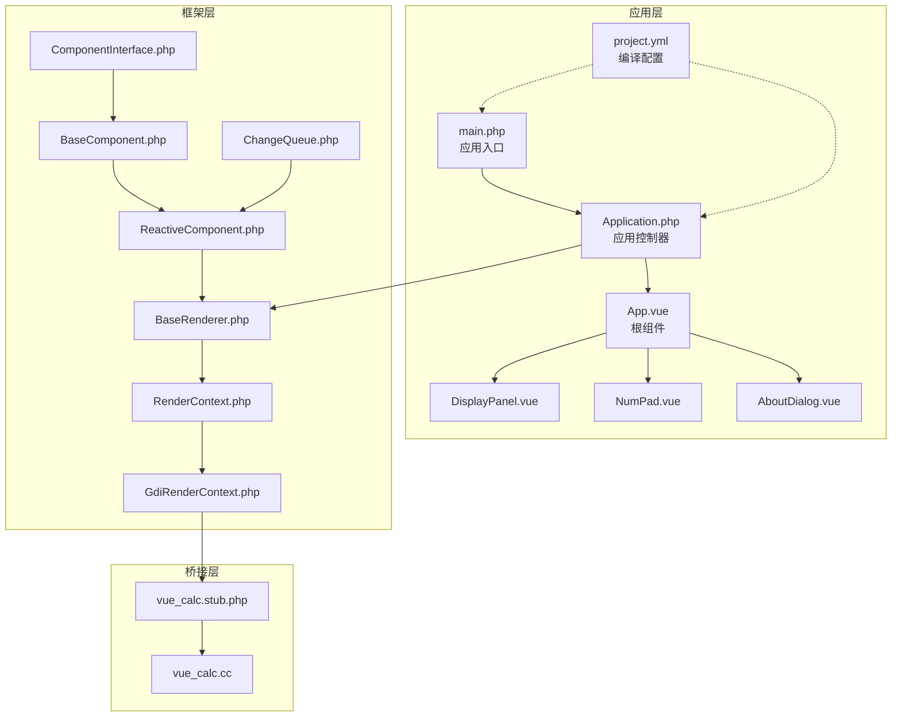
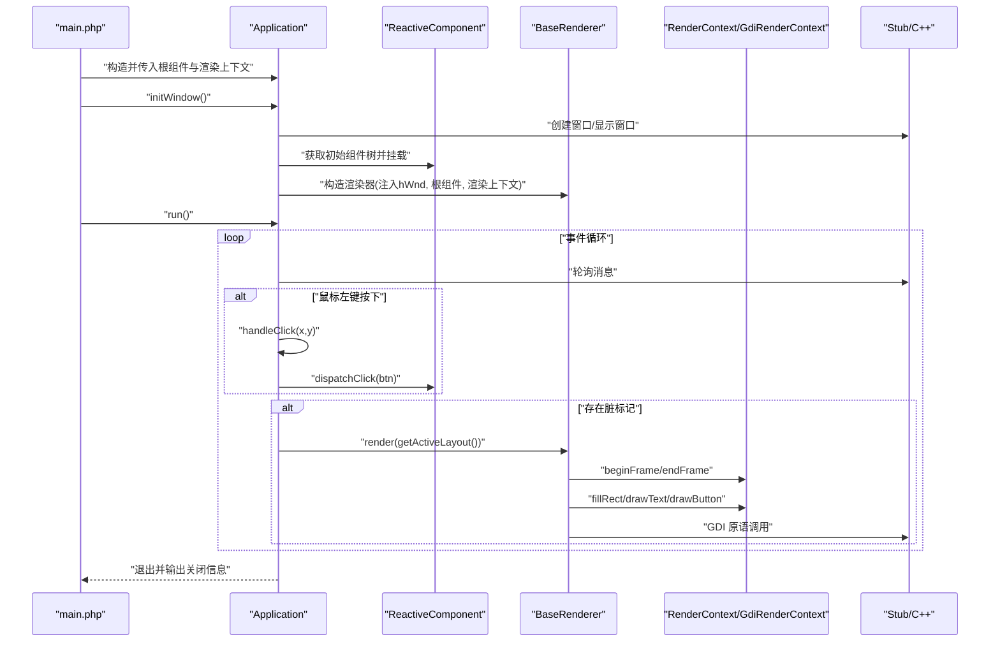
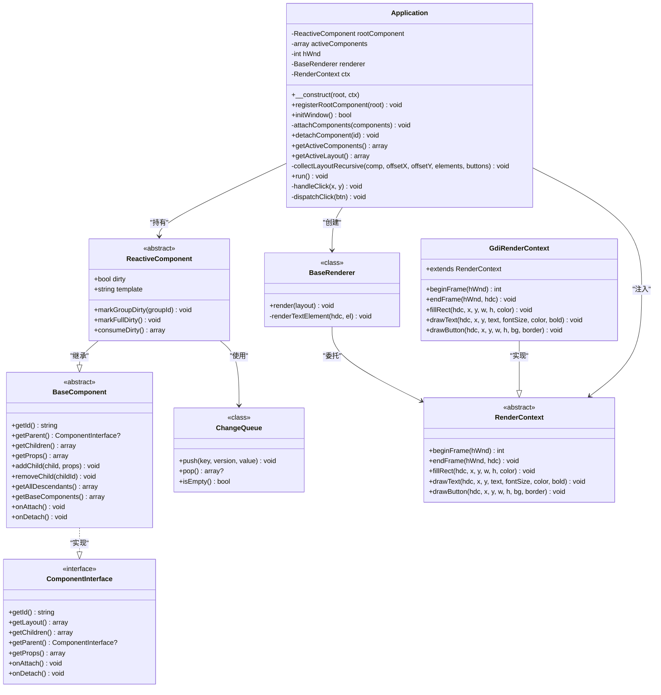
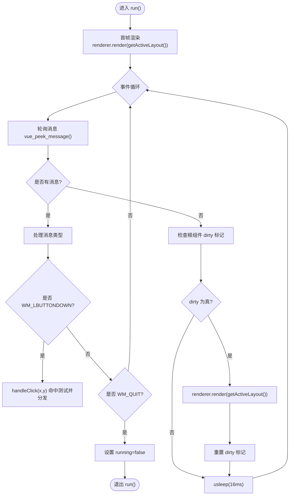
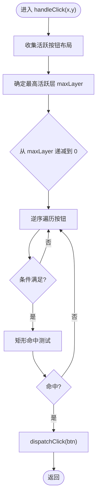
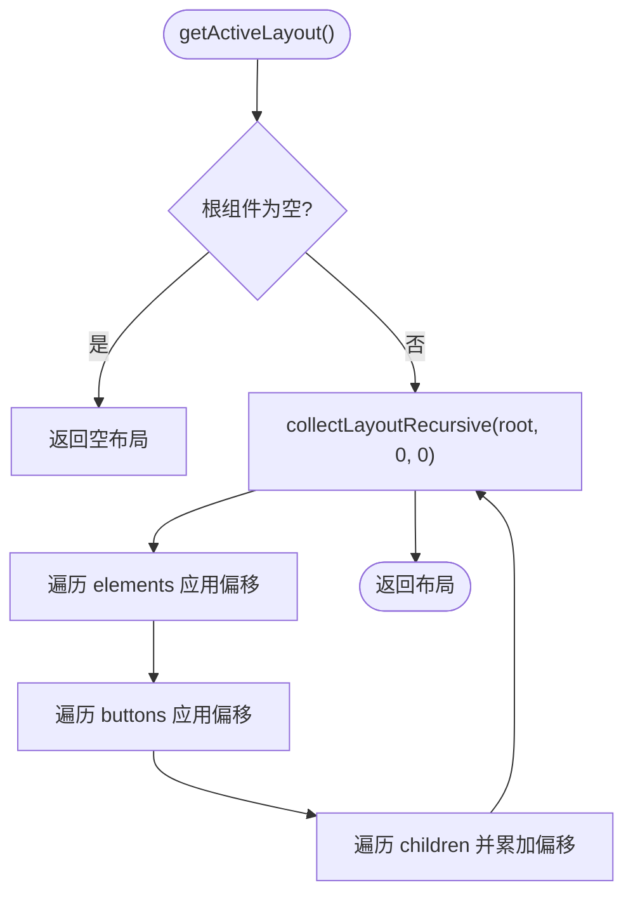
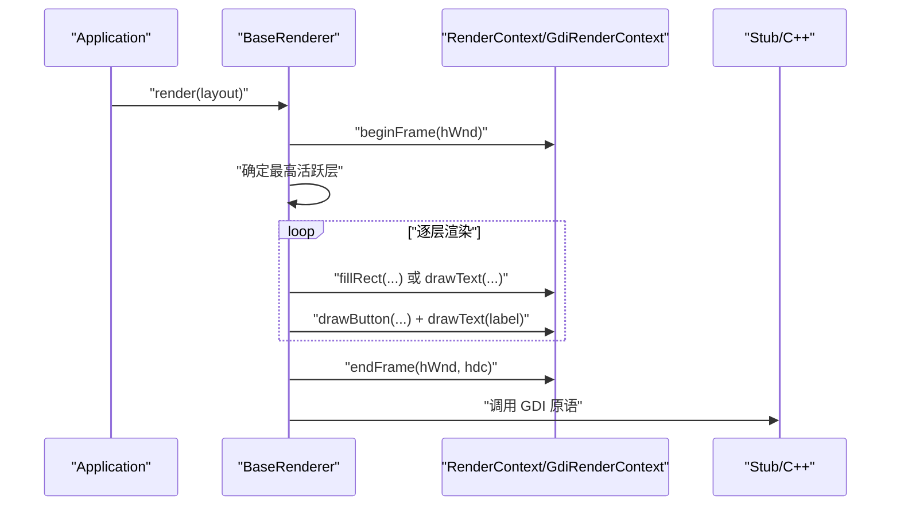
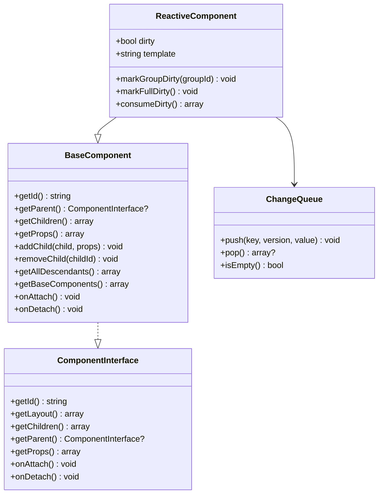
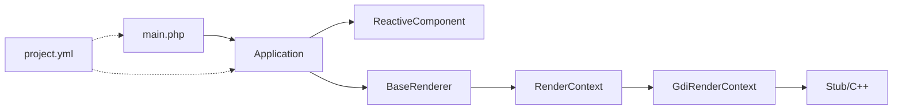

# 应用程序API

<cite>
**本文引用的文件**
- [Application.php](file://apps/calculator/Application.php)
- [main.php](file://apps/calculator/main.php)
- [BaseComponent.php](file://framework/BaseComponent.php)
- [ReactiveComponent.php](file://framework/ReactiveComponent.php)
- [ComponentInterface.php](file://framework/interfaces/ComponentInterface.php)
- [RenderContext.php](file://framework/rendering/RenderContext.php)
- [GdiRenderContext.php](file://framework/rendering/GdiRenderContext.php)
- [BaseRenderer.php](file://framework/BaseRenderer.php)
- [ChangeQueue.php](file://framework/ChangeQueue.php)
- [App.vue](file://apps/calculator/App.vue)
- [DisplayPanel.vue](file://apps/calculator/components/DisplayPanel.vue)
- [NumPad.vue](file://apps/calculator/components/NumPad.vue)
- [AboutDialog.vue](file://apps/calculator/components/AboutDialog.vue)
- [project.yml](file://apps/calculator/project.yml)
- [vue_calc.stub.php](file://stub/vue_calc.stub.php)
- [vue_calc.cc](file://cpp/vue_calc.cc)
</cite>

## 目录
1. [简介](#简介)
2. [项目结构](#项目结构)
3. [核心组件](#核心组件)
4. [架构总览](#架构总览)
5. [详细组件分析](#详细组件分析)
6. [依赖关系分析](#依赖关系分析)
7. [性能考量](#性能考量)
8. [故障排查指南](#故障排查指南)
9. [结论](#结论)
10. [附录](#附录)

## 简介
本文件为 Application 应用程序类的完整API文档，面向希望基于 SFC（单文件组件）数据驱动架构开发桌面应用的开发者。文档覆盖以下主题：
- Application 类的公共方法与职责边界：窗口管理、事件循环控制、组件树管理、布局收集与渲染调度
- 应用启动、运行与关闭的完整生命周期
- 窗口创建、消息处理、渲染调度的具体实现细节
- 应用配置选项、启动参数与运行时行为
- 扩展点与自定义选项的使用方法，帮助开发者快速创建与定制应用程序

## 项目结构
本项目采用“应用层 + 框架层”的分层组织方式：
- 应用层（apps/calculator）：包含入口文件、Application 控制器、组件与项目配置
- 框架层（framework）：提供组件基类、渲染抽象、渲染器与渲染上下文等通用能力
- C++/Stub 层（cpp、stub）：提供 Win32 窗口与 GDI 绘制的底层桥接

**图表来源**
- [main.php:19-48](file://apps/calculator/main.php#L19-L48)
- [Application.php:32-76](file://apps/calculator/Application.php#L32-L76)
- [App.vue:1-203](file://apps/calculator/App.vue#L1-L203)
- [DisplayPanel.vue:1-12](file://apps/calculator/components/DisplayPanel.vue#L1-L12)
- [NumPad.vue:1-37](file://apps/calculator/components/NumPad.vue#L1-L37)
- [AboutDialog.vue:1-36](file://apps/calculator/components/AboutDialog.vue#L1-L36)
- [project.yml:12-27](file://apps/calculator/project.yml#L12-L27)
- [BaseComponent.php:16-177](file://framework/BaseComponent.php#L16-L177)
- [ReactiveComponent.php:14-90](file://framework/ReactiveComponent.php#L14-L90)
- [ComponentInterface.php:13-52](file://framework/interfaces/ComponentInterface.php#L13-L52)
- [RenderContext.php:13-30](file://framework/rendering/RenderContext.php#L13-L30)
- [GdiRenderContext.php:11-38](file://framework/rendering/GdiRenderContext.php#L11-L38)
- [BaseRenderer.php:15-197](file://framework/BaseRenderer.php#L15-L197)
- [ChangeQueue.php:11-57](file://framework/ChangeQueue.php#L11-L57)
- [vue_calc.stub.php:12-23](file://stub/vue_calc.stub.php#L12-L23)
- [vue_calc.cc:45-90](file://cpp/vue_calc.cc#L45-L90)

**章节来源**
- [project.yml:12-27](file://apps/calculator/project.yml#L12-L27)
- [main.php:19-48](file://apps/calculator/main.php#L19-L48)

## 核心组件
本节聚焦 Application 类及其协作组件，梳理其职责与交互关系。

- Application：应用控制器，负责窗口初始化、事件循环、点击分发、组件树挂载与渲染调度
- ReactiveComponent：响应式组件基类，提供脏标记与变更组管理，驱动渲染器按需重绘
- BaseComponent：组件基类，提供组件树结构、父子关系与初始组件树收集
- ComponentInterface：组件接口，约束组件必须实现的方法
- BaseRenderer：渲染器，执行两阶段分层渲染（确定最高活跃层、按层渲染）
- RenderContext/GdiRenderContext：渲染上下文抽象与 Win32 GDI 实现
- ChangeQueue：变更通知队列，支持响应式状态变更的异步传播
- Stub/C++：Win32 窗口与 GDI 绘制的桥接层

**章节来源**
- [Application.php:15-36](file://apps/calculator/Application.php#L15-L36)
- [ReactiveComponent.php:14-90](file://framework/ReactiveComponent.php#L14-L90)
- [BaseComponent.php:16-177](file://framework/BaseComponent.php#L16-L177)
- [ComponentInterface.php:13-52](file://framework/interfaces/ComponentInterface.php#L13-L52)
- [BaseRenderer.php:15-197](file://framework/BaseRenderer.php#L15-L197)
- [RenderContext.php:13-30](file://framework/rendering/RenderContext.php#L13-L30)
- [GdiRenderContext.php:11-38](file://framework/rendering/GdiRenderContext.php#L11-L38)
- [ChangeQueue.php:11-57](file://framework/ChangeQueue.php#L11-L57)

## 架构总览
Application 作为应用控制器，串联了组件树、渲染器与底层 Win32/GDI 桥接层，形成“数据驱动 + 分层渲染”的事件循环体系。

**图表来源**
- [main.php:39-44](file://apps/calculator/main.php#L39-L44)
- [Application.php:51-76](file://apps/calculator/Application.php#L51-L76)
- [Application.php:205-263](file://apps/calculator/Application.php#L205-L263)
- [BaseRenderer.php:98-196](file://framework/BaseRenderer.php#L98-L196)
- [GdiRenderContext.php:13-36](file://framework/rendering/GdiRenderContext.php#L13-L36)
- [vue_calc.stub.php:13-23](file://stub/vue_calc.stub.php#L13-L23)
- [vue_calc.cc:45-90](file://cpp/vue_calc.cc#L45-L90)

## 详细组件分析

### Application 类 API 详解
Application 是应用生命周期与事件循环的核心控制器，提供以下公共方法与职责：

- 构造与注册
  - 构造函数：接收根组件与渲染上下文，保存为实例成员
  - registerRootComponent：在应用创建后注册根组件（v6 M2）

- 窗口管理
  - initWindow：创建窗口、显示窗口、挂载初始组件树、创建渲染器并返回布尔结果

- 组件树管理
  - attachComponents：批量将组件加入活跃列表，并触发 onAttach 生命周期
  - detachComponent：根据组件 ID 卸载组件并触发 onDetach
  - getActiveComponents：返回活跃组件映射（id -> ComponentInterface）

- 布局与渲染
  - getActiveLayout：遍历组件树，收集元素与按钮布局，应用累积偏移，返回预处理后的布局数据
  - collectLayoutRecursive：递归遍历组件树，累加 props 中的 x/y 偏移，修正容器坐标，收集元素与按钮

- 事件循环与消息处理
  - run：主事件循环，渲染首帧，轮询消息；处理鼠标左键点击与 WM_QUIT；按脏标记驱动重绘；每帧休眠约 16ms
  - handleClick：分层命中测试（先确定最高活跃层，再逆序从最高层向下测试），命中后分发到根组件
  - dispatchClick：将按钮数据转发给根组件进行业务处理

- AOT 兼容性要点
  - 遍历关联数组使用 array_keys() + for 循环，避免 foreach 的类型推断问题
  - 使用 (array) 类型转换确保返回数组的引用与类型安全

**图表来源**
- [Application.php:15-322](file://apps/calculator/Application.php#L15-L322)
- [ReactiveComponent.php:14-90](file://framework/ReactiveComponent.php#L14-L90)
- [BaseComponent.php:16-177](file://framework/BaseComponent.php#L16-L177)
- [ComponentInterface.php:13-52](file://framework/interfaces/ComponentInterface.php#L13-L52)
- [BaseRenderer.php:15-197](file://framework/BaseRenderer.php#L15-L197)
- [RenderContext.php:13-30](file://framework/rendering/RenderContext.php#L13-L30)
- [GdiRenderContext.php:11-38](file://framework/rendering/GdiRenderContext.php#L11-L38)
- [ChangeQueue.php:11-57](file://framework/ChangeQueue.php#L11-L57)

**章节来源**
- [Application.php:32-322](file://apps/calculator/Application.php#L32-L322)

### Application.run 事件循环流程
Application.run 是应用事件循环的核心，负责：
- 首帧渲染：调用渲染器渲染一次布局
- 消息轮询：持续检查消息队列，处理鼠标左键按下与 WM_QUIT
- 脏标记驱动重绘：当根组件标记 dirty 时，重新收集布局并渲染
- 退出条件：检测退出请求或收到 WM_QUIT 时停止循环

**图表来源**
- [Application.php:205-263](file://apps/calculator/Application.php#L205-L263)
- [BaseRenderer.php:98-196](file://framework/BaseRenderer.php#L98-L196)
- [vue_calc.stub.php:16](file://stub/vue_calc.stub.php#L16)

**章节来源**
- [Application.php:205-263](file://apps/calculator/Application.php#L205-L263)

### Application.handleClick 命中测试算法
Application.handleClick 实现了“分层命中测试”：
- 阶段一：扫描所有按钮，确定最高活跃层（考虑条件表达式）
- 阶段二：从最高层向下逆序遍历，命中即分发到根组件

**图表来源**
- [Application.php:269-321](file://apps/calculator/Application.php#L269-L321)

**章节来源**
- [Application.php:269-321](file://apps/calculator/Application.php#L269-L321)

### 布局收集与偏移应用
Application.getActiveLayout 与 collectLayoutRecursive 负责：
- 遍历组件树，收集 elements 与 buttons
- 对每个元素/按钮应用累积偏移（props 中的 x/y），并修正容器坐标
- 返回预处理后的布局数据，供渲染器直接使用

**图表来源**
- [Application.php:120-200](file://apps/calculator/Application.php#L120-L200)

**章节来源**
- [Application.php:120-200](file://apps/calculator/Application.php#L120-L200)

### 渲染器与渲染上下文
BaseRenderer.render 执行两阶段分层渲染：
- 阶段一：扫描 elements/buttons，确定最高活跃层
- 阶段二：按层渲染，先元素后按钮；元素支持 rect/text，按钮绘制背景与边框并绘制居中文字

**图表来源**
- [BaseRenderer.php:98-196](file://framework/BaseRenderer.php#L98-L196)
- [GdiRenderContext.php:13-36](file://framework/rendering/GdiRenderContext.php#L13-L36)
- [vue_calc.stub.php:19-23](file://stub/vue_calc.stub.php#L19-L23)

**章节来源**
- [BaseRenderer.php:98-196](file://framework/BaseRenderer.php#L98-L196)

### 组件模型与生命周期
- ComponentInterface：定义组件必须实现的接口方法
- BaseComponent：提供组件树结构、父子关系、初始组件树收集与后代遍历
- ReactiveComponent：在 BaseComponent 基础上增加脏标记、变更组与变更队列支持
- ChangeQueue：环形缓冲队列，支持响应式状态变更的异步传播

**图表来源**
- [ComponentInterface.php:13-52](file://framework/interfaces/ComponentInterface.php#L13-L52)
- [BaseComponent.php:16-177](file://framework/BaseComponent.php#L16-L177)
- [ReactiveComponent.php:14-90](file://framework/ReactiveComponent.php#L14-L90)
- [ChangeQueue.php:11-57](file://framework/ChangeQueue.php#L11-L57)

**章节来源**
- [ComponentInterface.php:13-52](file://framework/interfaces/ComponentInterface.php#L13-L52)
- [BaseComponent.php:16-177](file://framework/BaseComponent.php#L16-L177)
- [ReactiveComponent.php:14-90](file://framework/ReactiveComponent.php#L14-L90)
- [ChangeQueue.php:11-57](file://framework/ChangeQueue.php#L11-L57)

## 依赖关系分析
- 应用入口 main.php 依赖 Application、根组件与渲染上下文
- Application 依赖 ReactiveComponent、BaseRenderer、RenderContext/GdiRenderContext
- 渲染器依赖 RenderContext 抽象，具体由 GdiRenderContext 实现
- Stub/C++ 提供 Win32 窗口与 GDI 绘制的底层能力
- 项目配置 project.yml 指定编译源码与组件映射

**图表来源**
- [main.php:39-44](file://apps/calculator/main.php#L39-L44)
- [Application.php:51-76](file://apps/calculator/Application.php#L51-L76)
- [BaseRenderer.php:98-196](file://framework/BaseRenderer.php#L98-L196)
- [GdiRenderContext.php:13-36](file://framework/rendering/GdiRenderContext.php#L13-L36)
- [project.yml:12-27](file://apps/calculator/project.yml#L12-L27)

**章节来源**
- [project.yml:12-27](file://apps/calculator/project.yml#L12-L27)
- [main.php:39-44](file://apps/calculator/main.php#L39-L44)

## 性能考量
- 渲染频率：事件循环中每帧休眠约 16ms，目标约为 60 FPS
- 脏标记驱动：仅在组件状态变更后重绘，减少不必要的渲染开销
- AOT 兼容：使用 array_keys() + for 循环与 (array) 类型转换，避免 foreach 的类型推断问题，提升编译稳定性
- 分层渲染：先确定最高活跃层，再按层渲染，降低无效绘制成本

[本节为通用性能建议，不直接分析具体文件]

## 故障排查指南
- 窗口创建失败
  - 现象：initWindow 返回 false 并输出错误信息
  - 排查：确认窗口创建与显示调用是否成功，检查 Stub/C++ 层实现
  - 参考路径：[Application.php:51-76](file://apps/calculator/Application.php#L51-L76)，[vue_calc.stub.php:13](file://stub/vue_calc.stub.php#L13)，[vue_calc.cc:49-56](file://cpp/vue_calc.cc#L49-L56)

- 点击无响应
  - 现象：鼠标点击未触发 dispatchClick
  - 排查：确认消息轮询与 WM_LBUTTONDOWN 分支是否执行；检查命中测试与条件表达式
  - 参考路径：[Application.php:214-239](file://apps/calculator/Application.php#L214-L239)，[Application.php:269-321](file://apps/calculator/Application.php#L269-L321)

- 渲染异常
  - 现象：渲染过程中抛出异常或画面不更新
  - 排查：检查脏标记是否正确消费，确认渲染器分层逻辑与条件表达式
  - 参考路径：[Application.php:248-257](file://apps/calculator/Application.php#L248-L257)，[BaseRenderer.php:98-196](file://framework/BaseRenderer.php#L98-L196)

**章节来源**
- [Application.php:51-76](file://apps/calculator/Application.php#L51-L76)
- [Application.php:214-239](file://apps/calculator/Application.php#L214-L239)
- [Application.php:248-257](file://apps/calculator/Application.php#L248-L257)
- [BaseRenderer.php:98-196](file://framework/BaseRenderer.php#L98-L196)
- [vue_calc.stub.php:13-23](file://stub/vue_calc.stub.php#L13-L23)
- [vue_calc.cc:49-56](file://cpp/vue_calc.cc#L49-L56)

## 结论
Application 类通过清晰的职责划分与数据驱动的渲染机制，实现了从窗口创建、事件循环到渲染调度的完整生命周期管理。结合 ReactiveComponent 的脏标记与 BaseRenderer 的分层渲染，应用能够在保证 AOT 兼容性的前提下，高效地响应用户交互并更新界面。开发者可通过扩展组件树、自定义渲染上下文与优化布局数据格式，进一步定制应用程序的行为与表现。

[本节为总结性内容，不直接分析具体文件]

## 附录

### 应用启动与关闭生命周期
- 启动：main.php 创建根组件、渲染上下文与 Application，初始化窗口并启动事件循环
- 运行：事件循环持续处理消息、响应点击、按脏标记驱动渲染
- 关闭：收到 WM_QUIT 或退出请求后停止循环并输出关闭信息

**章节来源**
- [main.php:19-48](file://apps/calculator/main.php#L19-L48)
- [Application.php:51-76](file://apps/calculator/Application.php#L51-L76)
- [Application.php:205-263](file://apps/calculator/Application.php#L205-L263)

### 应用配置与启动参数
- 项目配置：project.yml 指定编译源码、组件映射与构建模式
- 窗口参数：initWindow 中使用常量定义窗口标题、宽度与高度
- 事件常量：main.php 中定义 SW_SHOW、WM_LBUTTONDOWN、WM_QUIT 等常量

**章节来源**
- [project.yml:12-27](file://apps/calculator/project.yml#L12-L27)
- [main.php:14-17](file://apps/calculator/main.php#L14-L17)
- [Application.php:53-57](file://apps/calculator/Application.php#L53-L57)

### 自定义与扩展指南
- 自定义窗口配置：建议将窗口标题、宽度、高度提取为配置函数，便于统一管理
- 事件常量集中化：将 SW_SHOW、WM_LBUTTONDOWN、WM_QUIT 等常量集中到统一文件
- 布局数据格式规范：制定显式的布局数据字段、类型与默认值规范，避免隐式约定导致的无声失败

**章节来源**
- [vue_calc.stub.php:13-23](file://stub/vue_calc.stub.php#L13-L23)
- [vue_calc.cc:45-90](file://cpp/vue_calc.cc#L45-L90)