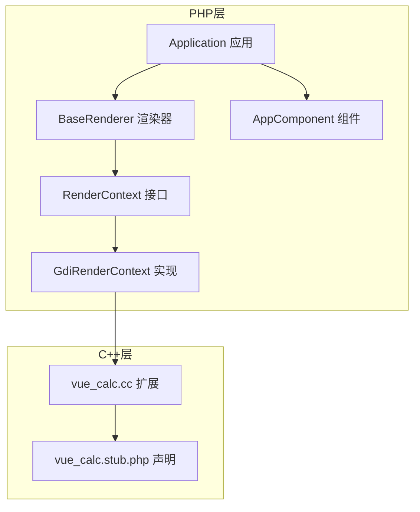
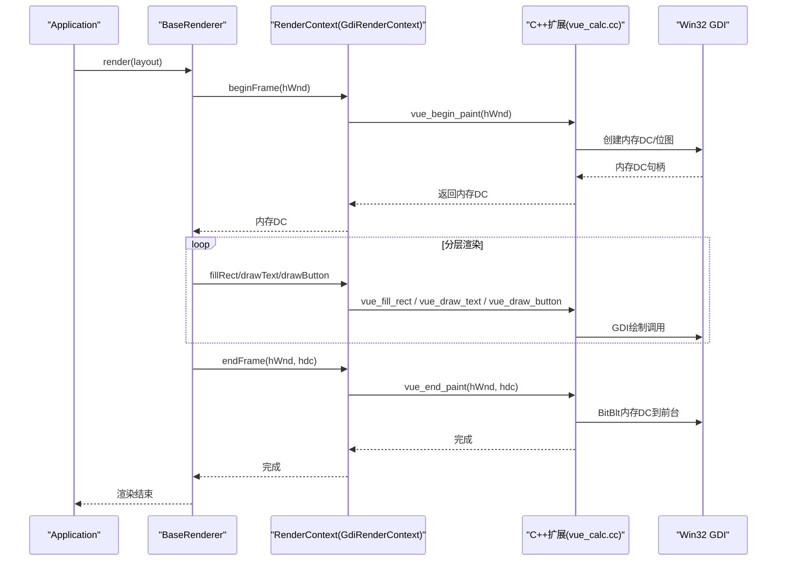
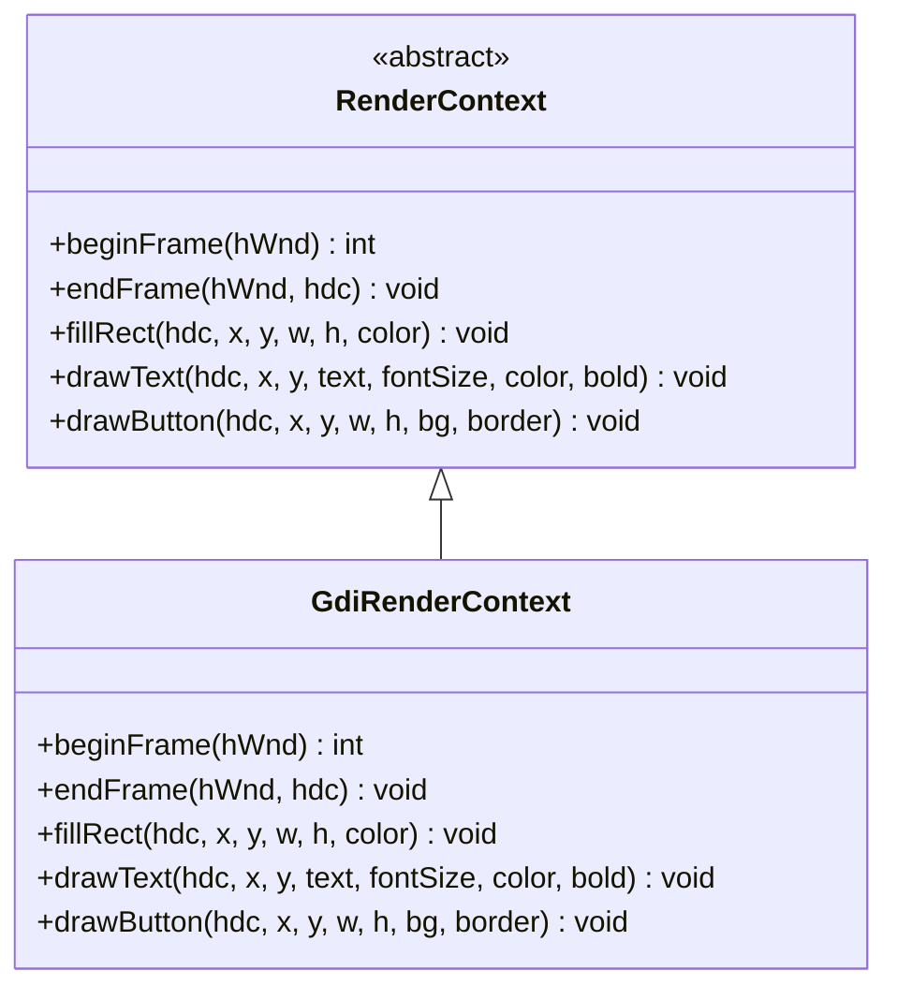
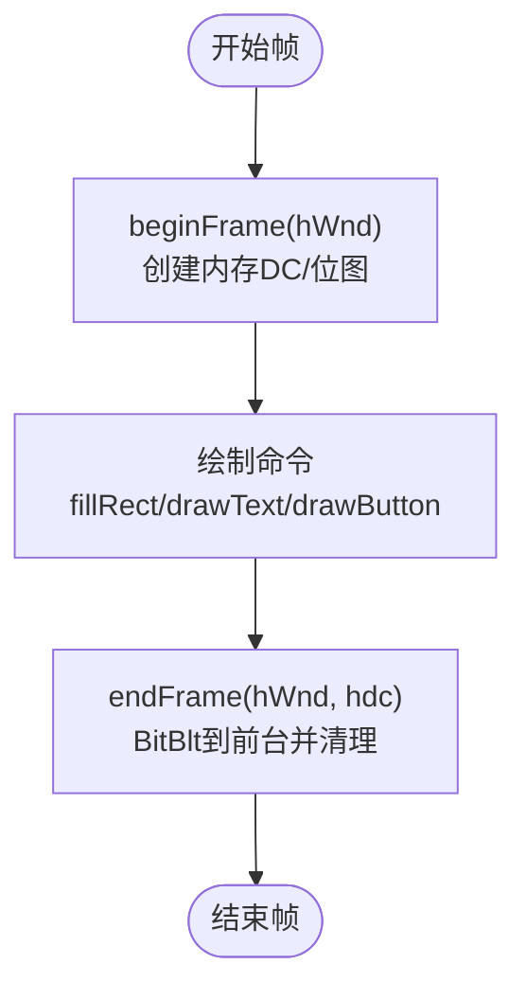
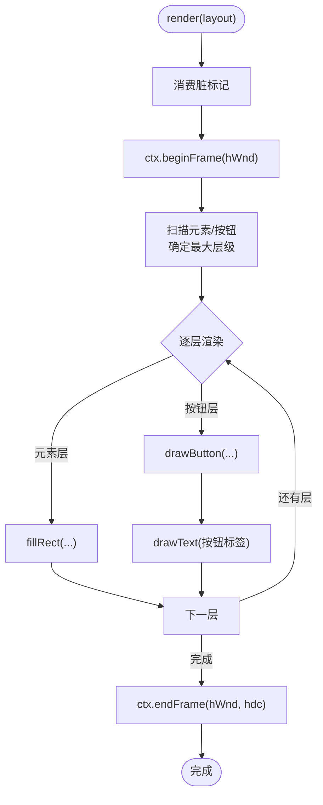
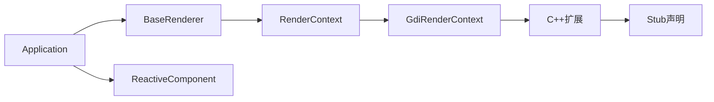

# 渲染上下文API

<cite>
**本文档引用的文件**
- [framework/rendering/RenderContext.php](file://framework/rendering/RenderContext.php)
- [framework/rendering/GdiRenderContext.php](file://framework/rendering/GdiRenderContext.php)
- [framework/BaseRenderer.php](file://framework/BaseRenderer.php)
- [framework/ReactiveComponent.php](file://framework/ReactiveComponent.php)
- [framework/BaseComponent.php](file://framework/BaseComponent.php)
- [framework/interfaces/ComponentInterface.php](file://framework/interfaces/ComponentInterface.php)
- [apps/calculator/Application.php](file://apps/calculator/Application.php)
- [apps/calculator/main.php](file://apps/calculator/main.php)
- [apps/calculator/gen/AppComponent.php](file://apps/calculator/gen/AppComponent.php)
- [cpp/vue_calc.cc](file://cpp/vue_calc.cc)
- [stub/vue_calc.stub.php](file://stub/vue_calc.stub.php)
</cite>

## 目录
1. [简介](#简介)
2. [项目结构](#项目结构)
3. [核心组件](#核心组件)
4. [架构总览](#架构总览)
5. [详细组件分析](#详细组件分析)
6. [依赖关系分析](#依赖关系分析)
7. [性能考虑](#性能考虑)
8. [故障排除指南](#故障排除指南)
9. [结论](#结论)
10. [附录](#附录)

## 简介
本文件面向开发者，系统性地记录渲染上下文相关API，重点覆盖：
- RenderContext 接口的设计理念与职责边界
- GdiRenderContext 的具体实现与GDI后端细节
- 渲染命令的数据结构与绘制流程
- GDI坐标系统、颜色管理、字体渲染等实现要点
- 性能优化、内存管理与错误处理策略
- 如何基于 RenderContext 接口扩展自定义渲染后端

目标是帮助开发者快速理解并高效使用渲染上下文API，同时为后续扩展其他渲染后端（如Skia/OpenGL/Web Canvas）提供清晰的实现指引。

## 项目结构
渲染上下文相关的核心代码分布在以下模块：
- 接口与实现：framework/rendering/RenderContext.php、framework/rendering/GdiRenderContext.php
- 渲染器：framework/BaseRenderer.php
- 组件体系：framework/ReactiveComponent.php、framework/BaseComponent.php、framework/interfaces/ComponentInterface.php
- 应用入口与集成：apps/calculator/Application.php、apps/calculator/main.php、apps/calculator/gen/AppComponent.php
- C++扩展与Stub：cpp/vue_calc.cc、stub/vue_calc.stub.php

图表来源
- [framework/rendering/RenderContext.php:1-30](file://framework/rendering/RenderContext.php#L1-L30)
- [framework/rendering/GdiRenderContext.php:1-38](file://framework/rendering/GdiRenderContext.php#L1-L38)
- [framework/BaseRenderer.php:1-197](file://framework/BaseRenderer.php#L1-L197)
- [apps/calculator/Application.php:1-322](file://apps/calculator/Application.php#L1-L322)
- [apps/calculator/gen/AppComponent.php:1-200](file://apps/calculator/gen/AppComponent.php#L1-L200)
- [cpp/vue_calc.cc:1-157](file://cpp/vue_calc.cc#L1-L157)
- [stub/vue_calc.stub.php:1-24](file://stub/vue_calc.stub.php#L1-L24)

章节来源
- [framework/rendering/RenderContext.php:1-30](file://framework/rendering/RenderContext.php#L1-L30)
- [framework/rendering/GdiRenderContext.php:1-38](file://framework/rendering/GdiRenderContext.php#L1-L38)
- [framework/BaseRenderer.php:1-197](file://framework/BaseRenderer.php#L1-L197)
- [apps/calculator/Application.php:1-322](file://apps/calculator/Application.php#L1-L322)
- [apps/calculator/main.php:1-48](file://apps/calculator/main.php#L1-L48)
- [apps/calculator/gen/AppComponent.php:1-200](file://apps/calculator/gen/AppComponent.php#L1-L200)
- [cpp/vue_calc.cc:1-157](file://cpp/vue_calc.cc#L1-L157)
- [stub/vue_calc.stub.php:1-24](file://stub/vue_calc.stub.php#L1-L24)

## 核心组件
本节聚焦渲染上下文API的核心接口与实现，以及它们在渲染流水线中的角色。

- RenderContext 抽象接口
  - 职责：定义与后端无关的渲染抽象，提供帧生命周期与基础绘制原语
  - 关键方法：
    - beginFrame(hWnd): 返回后台DC句柄
    - endFrame(hWnd, hdc): 提交后台DC到前台
    - fillRect(hdc, x, y, w, h, color): 填充矩形
    - drawText(hdc, x, y, text, fontSize, color, bold): 绘制文本
    - drawButton(hdc, x, y, w, h, bg, border): 绘制按钮（背景+边框）

- GdiRenderContext 具体实现
  - 职责：将抽象接口映射到Win32 GDI原语，通过C++扩展函数完成实际绘制
  - 实现要点：
    - beginFrame 调用 vue_begin_paint，返回内存DC
    - endFrame 调用 vue_end_paint，将内存DC内容blit到前台
    - fillRect/drawText/drawButton 分别委托给对应的C++函数

- BaseRenderer 渲染器
  - 职责：根据布局数据进行两阶段分层渲染，调度 RenderContext 执行绘制
  - 关键流程：
    - 计算最大层级，按层从低到高渲染
    - 元素层：rect/text；按钮层：先绘制按钮，再绘制按钮内文本
    - 文本对齐：支持左/右/居中，动态字号调整

- ReactiveComponent 组件
  - 职责：响应式状态管理，提供脏标记与条件求值，供渲染器判断是否重绘
  - 关键字段：dirty、fullDirty、dirtyGroups
  - 关键方法：getBindValue、dispatchClick、evalCondition

章节来源
- [framework/rendering/RenderContext.php:13-29](file://framework/rendering/RenderContext.php#L13-L29)
- [framework/rendering/GdiRenderContext.php:11-37](file://framework/rendering/GdiRenderContext.php#L11-L37)
- [framework/BaseRenderer.php:15-197](file://framework/BaseRenderer.php#L15-L197)
- [framework/ReactiveComponent.php:14-90](file://framework/ReactiveComponent.php#L14-L90)

## 架构总览
渲染上下文在整体架构中的位置如下：

图表来源
- [apps/calculator/Application.php:205-263](file://apps/calculator/Application.php#L205-L263)
- [framework/BaseRenderer.php:98-196](file://framework/BaseRenderer.php#L98-L196)
- [framework/rendering/GdiRenderContext.php:13-36](file://framework/rendering/GdiRenderContext.php#L13-L36)
- [cpp/vue_calc.cc:90-117](file://cpp/vue_calc.cc#L90-L117)
- [stub/vue_calc.stub.php:18-23](file://stub/vue_calc.stub.php#L18-L23)

## 详细组件分析

### RenderContext 接口
- 设计意图
  - 通过抽象接口隔离后端差异，便于未来扩展Skia/OpenGL/Web Canvas等
  - 保持AOT兼容性，采用抽象类+extends模式
- 方法语义
  - beginFrame/endFrame：双缓冲帧管理，确保画面无撕裂
  - fillRect：矩形填充，颜色以RGB整数表示
  - drawText：文本绘制，支持字号、粗体、颜色
  - drawButton：复合绘制，先填充背景，再绘制边框

图表来源
- [framework/rendering/RenderContext.php:13-29](file://framework/rendering/RenderContext.php#L13-L29)
- [framework/rendering/GdiRenderContext.php:11-37](file://framework/rendering/GdiRenderContext.php#L11-L37)

章节来源
- [framework/rendering/RenderContext.php:13-29](file://framework/rendering/RenderContext.php#L13-L29)

### GdiRenderContext 实现
- 委托模式
  - 所有绘制方法均委托给C++扩展函数，保持实现简洁
- 双缓冲流程
  - beginFrame：创建内存DC与兼容位图，返回内存DC句柄
  - endFrame：将内存DC内容一次性blit到前台，释放资源
- 绘制原语
  - fillRect：创建纯色画刷，调用FillRect
  - drawText：设置文本颜色与背景模式，创建字体，调用TextOutA
  - drawButton：先填充背景，再绘制边框

图表来源
- [framework/rendering/GdiRenderContext.php:13-36](file://framework/rendering/GdiRenderContext.php#L13-L36)
- [cpp/vue_calc.cc:90-117](file://cpp/vue_calc.cc#L90-L117)
- [cpp/vue_calc.cc:119-156](file://cpp/vue_calc.cc#L119-L156)

章节来源
- [framework/rendering/GdiRenderContext.php:11-37](file://framework/rendering/GdiRenderContext.php#L11-L37)
- [cpp/vue_calc.cc:90-156](file://cpp/vue_calc.cc#L90-L156)
- [stub/vue_calc.stub.php:18-23](file://stub/vue_calc.stub.php#L18-L23)

### BaseRenderer 渲染器
- 两阶段分层渲染
  - Phase 1：扫描元素与按钮，确定最大层级
  - Phase 2：按层从低到高渲染，确保遮挡关系正确
- 文本对齐与动态字号
  - 支持 left/right/center 对齐
  - 根据文本长度动态调整字号，避免溢出
- 按钮渲染
  - 先绘制按钮背景与边框，再在中心绘制标签文本

图表来源
- [framework/BaseRenderer.php:98-196](file://framework/BaseRenderer.php#L98-L196)

章节来源
- [framework/BaseRenderer.php:98-196](file://framework/BaseRenderer.php#L98-L196)

### ReactiveComponent 组件
- 脏标记与全量重绘
  - dirty：是否需要重绘
  - fullDirty：是否需要全量重绘
  - dirtyGroups：按组追踪脏状态
- 条件渲染
  - evalCondition：根据条件数组进行布尔判定
- 绑定值与点击分发
  - getBindValue：用于文本渲染的动态值
  - dispatchClick：处理按钮点击事件

章节来源
- [framework/ReactiveComponent.php:14-90](file://framework/ReactiveComponent.php#L14-L90)

### 应用集成与入口
- Application
  - 窗口初始化与消息循环
  - 仅在组件状态变更时触发渲染
  - 点击事件的分层命中测试
- main
  - 创建根组件、渲染上下文与应用实例
  - 启动主事件循环

章节来源
- [apps/calculator/Application.php:32-76](file://apps/calculator/Application.php#L32-L76)
- [apps/calculator/Application.php:205-263](file://apps/calculator/Application.php#L205-L263)
- [apps/calculator/main.php:19-48](file://apps/calculator/main.php#L19-L48)

## 依赖关系分析
- 接口与实现
  - GdiRenderContext 实现 RenderContext 接口
- 渲染器与上下文
  - BaseRenderer 依赖 RenderContext 执行绘制
- 组件与渲染器
  - BaseRenderer 读取 ReactiveComponent 的布局与脏状态
- 应用与渲染器
  - Application 负责在合适时机调用 BaseRenderer.render
- 后端扩展
  - GdiRenderContext 委托 C++ 扩展函数，C++ 层封装 Win32 GDI

图表来源
- [framework/rendering/RenderContext.php:13-29](file://framework/rendering/RenderContext.php#L13-L29)
- [framework/rendering/GdiRenderContext.php:11-37](file://framework/rendering/GdiRenderContext.php#L11-L37)
- [framework/BaseRenderer.php:15-26](file://framework/BaseRenderer.php#L15-L26)
- [apps/calculator/Application.php:26-36](file://apps/calculator/Application.php#L26-L36)
- [cpp/vue_calc.cc:1-157](file://cpp/vue_calc.cc#L1-L157)
- [stub/vue_calc.stub.php:1-24](file://stub/vue_calc.stub.php#L1-L24)

章节来源
- [framework/rendering/RenderContext.php:13-29](file://framework/rendering/RenderContext.php#L13-L29)
- [framework/rendering/GdiRenderContext.php:11-37](file://framework/rendering/GdiRenderContext.php#L11-L37)
- [framework/BaseRenderer.php:15-26](file://framework/BaseRenderer.php#L15-L26)
- [apps/calculator/Application.php:26-36](file://apps/calculator/Application.php#L26-L36)
- [cpp/vue_calc.cc:1-157](file://cpp/vue_calc.cc#L1-L157)
- [stub/vue_calc.stub.php:1-24](file://stub/vue_calc.stub.php#L1-L24)

## 性能考虑
- 双缓冲与批处理
  - 通过内存DC减少闪烁，一次性提交可降低上下文切换开销
- 分层渲染
  - 仅在必要层级进行绘制，避免重复绘制
- 文本渲染优化
  - 动态字号调整减少溢出与重排
  - 字体创建在C++层完成，避免频繁对象创建
- 脏标记驱动
  - 仅在组件状态变更时触发渲染，避免无效重绘
- 内存管理
  - C++层负责GDI对象的创建与销毁，确保资源及时释放
- 建议
  - 控制每帧绘制命令数量，避免过度绘制
  - 对高频文本更新采用缓存或增量更新策略
  - 在更高层引入命令缓冲与脏区域裁剪（可选）

[本节为通用性能建议，不直接分析具体文件]

## 故障排除指南
- 渲染无输出
  - 检查 beginFrame/endFrame 是否配对调用
  - 确认C++扩展函数可用且返回有效句柄
- 文本不显示或乱码
  - 检查字体创建与选择流程，确保字体资源释放
  - 确认颜色与背景模式设置正确
- 按钮绘制异常
  - 检查背景刷与画笔对象的创建与选择顺序
  - 确认Rectangle调用的坐标范围
- 错误处理
  - Application.run 中捕获渲染异常并打印堆栈
  - ReactiveComponent 中的脏标记与条件求值异常需定位到具体组件

章节来源
- [apps/calculator/Application.php:248-257](file://apps/calculator/Application.php#L248-L257)
- [framework/BaseRenderer.php:150-191](file://framework/BaseRenderer.php#L150-L191)
- [cpp/vue_calc.cc:127-156](file://cpp/vue_calc.cc#L127-L156)

## 结论
渲染上下文API通过RenderContext接口实现了后端无关的抽象，GdiRenderContext提供了稳定的Win32 GDI实现，并与BaseRenderer、ReactiveComponent形成清晰的协作关系。该设计既满足当前需求，又为未来扩展其他渲染后端预留了空间。开发者可据此实现自定义渲染后端，遵循接口契约与资源管理规范，即可无缝接入现有渲染流水线。

[本节为总结性内容，不直接分析具体文件]

## 附录

### 绘制命令格式与数据结构
- 帧管理
  - beginFrame(hWnd): 返回内存DC句柄
  - endFrame(hWnd, hdc): 提交并清理
- 矩形填充
  - 参数：hdc, x, y, w, h, color(RGB整数)
- 文本绘制
  - 参数：hdc, x, y, text, fontSize, color(RGB整数), bold(0/1)
- 按钮绘制
  - 参数：hdc, x, y, w, h, bg(RGB整数), border(RGB整数)

章节来源
- [framework/rendering/RenderContext.php:15-29](file://framework/rendering/RenderContext.php#L15-L29)
- [framework/rendering/GdiRenderContext.php:13-36](file://framework/rendering/GdiRenderContext.php#L13-L36)
- [cpp/vue_calc.cc:119-156](file://cpp/vue_calc.cc#L119-L156)

### GDI坐标系统与颜色管理
- 坐标系统
  - 以窗口客户区左上角为原点，向右与向下为正方向
- 颜色管理
  - 颜色以RGB整数形式传入，C++层转换为COLORREF
- 字体渲染
  - 使用CreateFont创建字体，TextOutA输出文本，最后恢复旧字体并删除

章节来源
- [cpp/vue_calc.cc:127-139](file://cpp/vue_calc.cc#L127-L139)

### 自定义渲染后端实现指南
- 必要步骤
  - 新建类实现 RenderContext 接口
  - 实现 beginFrame/endFrame：管理后台缓冲
  - 实现 fillRect/drawText/drawButton：完成具体绘制
- 接口契约
  - 严格遵守参数类型与语义
  - 确保资源生命周期管理（创建/选择/恢复/销毁）
- 最佳实践
  - 将昂贵资源（字体、画刷、画笔）缓存复用
  - 在高层引入命令缓冲与脏区域裁剪
  - 保持与现有渲染器调用约定一致

章节来源
- [framework/rendering/RenderContext.php:13-29](file://framework/rendering/RenderContext.php#L13-L29)
- [framework/BaseRenderer.php:150-191](file://framework/BaseRenderer.php#L150-L191)