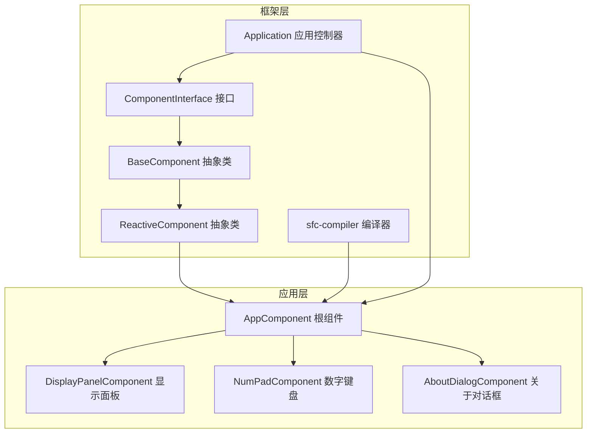
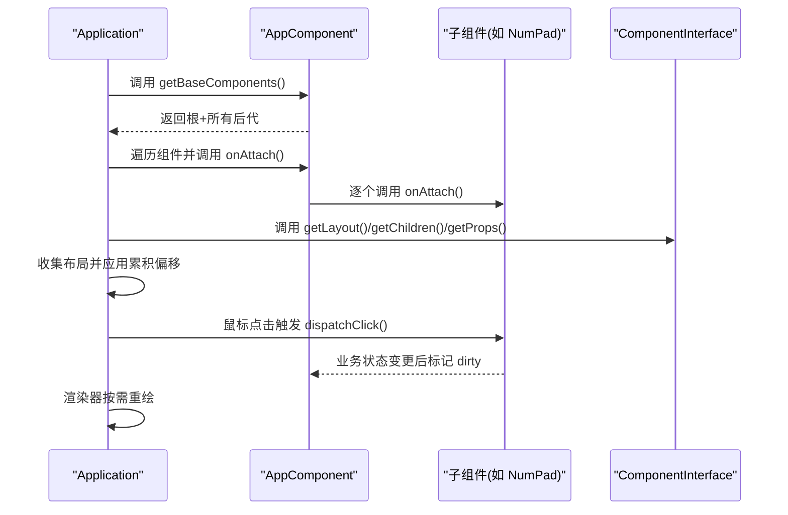
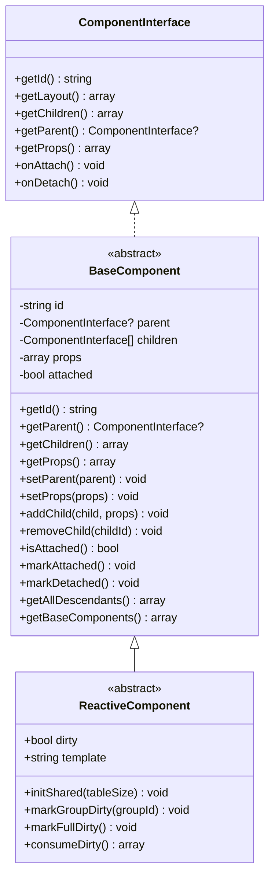
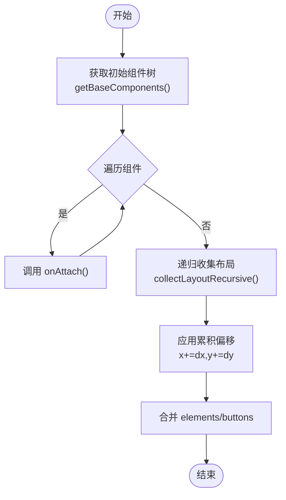
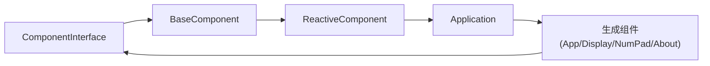

# 组件接口API

<cite>
**本文引用的文件**
- [ComponentInterface.php](file://framework/interfaces/ComponentInterface.php)
- [BaseComponent.php](file://framework/BaseComponent.php)
- [ReactiveComponent.php](file://framework/ReactiveComponent.php)
- [sfc-compiler.php](file://framework/sfc-compiler.php)
- [Application.php](file://apps/calculator/Application.php)
- [AppComponent.php](file://apps/calculator/gen/AppComponent.php)
- [DisplayPanelComponent.php](file://apps/calculator/gen/DisplayPanelComponent.php)
- [NumPadComponent.php](file://apps/calculator/gen/NumPadComponent.php)
- [AboutDialogComponent.php](file://apps/calculator/gen/AboutDialogComponent.php)
- [开发经验与教训_v2.md](file://docs/开发经验与教训_v2.md)
</cite>

## 目录
1. [简介](#简介)
2. [项目结构](#项目结构)
3. [核心组件](#核心组件)
4. [架构总览](#架构总览)
5. [详细组件分析](#详细组件分析)
6. [依赖关系分析](#依赖关系分析)
7. [性能考量](#性能考量)
8. [故障排查指南](#故障排查指南)
9. [结论](#结论)
10. [附录](#附录)

## 简介
本文件面向实现 ComponentInterface 接口的组件开发者，系统性地说明接口方法的签名、语义、返回值、使用场景与最佳实践，并结合框架中的具体实现与生成代码示例，帮助你在组件系统中正确接入生命周期、布局数据与组件树管理。同时提供 AOT 编译兼容性要点与实现自定义组件的完整指导。

## 项目结构
组件接口与实现位于框架层，典型组件由 SFC 编译器从模板生成，应用层通过 Application 管理组件树与渲染流程。

图表来源
- [ComponentInterface.php:13-52](file://framework/interfaces/ComponentInterface.php#L13-L52)
- [BaseComponent.php:16-177](file://framework/BaseComponent.php#L16-L177)
- [ReactiveComponent.php:14-90](file://framework/ReactiveComponent.php#L14-L90)
- [Application.php:15-322](file://apps/calculator/Application.php#L15-L322)
- [sfc-compiler.php:468-577](file://framework/sfc-compiler.php#L468-L577)
- [AppComponent.php:11-787](file://apps/calculator/gen/AppComponent.php#L11-L787)

章节来源
- [ComponentInterface.php:1-52](file://framework/interfaces/ComponentInterface.php#L1-L52)
- [BaseComponent.php:1-177](file://framework/BaseComponent.php#L1-L177)
- [ReactiveComponent.php:1-90](file://framework/ReactiveComponent.php#L1-L90)
- [Application.php:1-322](file://apps/calculator/Application.php#L1-L322)
- [sfc-compiler.php:468-577](file://framework/sfc-compiler.php#L468-L577)
- [AppComponent.php:1-787](file://apps/calculator/gen/AppComponent.php#L1-L787)

## 核心组件
- ComponentInterface：定义组件必须实现的核心契约，包括标识、布局、父子关系、属性与生命周期回调。
- BaseComponent：实现 ComponentInterface，提供组件树基础能力（父子引用、子组件集合、属性、挂载状态与后代遍历）。
- ReactiveComponent：继承 BaseComponent，增加响应式状态与脏标记机制，作为业务组件的基类。
- Application：应用入口，负责窗口初始化、组件挂载/卸载、布局收集与渲染调度。
- 生成组件：由 SFC 编译器根据模板生成，实现 getLayout()/onAttach()/onDetach() 等方法。

章节来源
- [ComponentInterface.php:13-52](file://framework/interfaces/ComponentInterface.php#L13-L52)
- [BaseComponent.php:16-177](file://framework/BaseComponent.php#L16-L177)
- [ReactiveComponent.php:14-90](file://framework/ReactiveComponent.php#L14-L90)
- [Application.php:15-322](file://apps/calculator/Application.php#L15-L322)

## 架构总览
组件接口在组件系统中的作用：
- 统一契约：保证所有组件具备一致的标识、布局、父子关系与生命周期行为。
- 生命周期管理：onAttach/onDetach 与 Application 的挂载/卸载流程配合，确保资源正确初始化与释放。
- 布局数据获取：getLayout 返回标准化的 elements/buttons 结构，便于应用层统一收集与偏移应用。
- 组件树管理：getChildren/getParent/getProps 提供组件树导航与动态偏移应用能力。

图表来源
- [Application.php:82-103](file://apps/calculator/Application.php#L82-L103)
- [Application.php:143-200](file://apps/calculator/Application.php#L143-L200)
- [AppComponent.php:684-701](file://apps/calculator/gen/AppComponent.php#L684-L701)
- [NumPadComponent.php:311-327](file://apps/calculator/gen/NumPadComponent.php#L311-L327)

## 详细组件分析

### ComponentInterface 接口方法详解
- getId(): string
  - 功能：返回组件唯一标识，用于应用层的组件索引与事件分发。
  - 参数：无
  - 返回：字符串标识
  - 使用场景：Application 挂载/卸载、事件命中测试、组件树遍历定位
  - 参考实现：BaseComponent::getId()

- getLayout(): array
  - 功能：返回组件布局数据，格式为 ['elements' => [...], 'buttons' => [...]]。元素包含几何、样式、条件与分组信息；按钮包含位置、尺寸、颜色、处理器与参数等。
  - 参数：无
  - 返回：标准布局数组
  - 使用场景：Application 收集布局、应用累积偏移、渲染器绘制
  - 参考实现：各生成组件的 getLayout()

- getChildren(): array
  - 功能：返回子组件列表（键为子组件 id，值为 ComponentInterface 实例）。
  - 参数：无
  - 返回：ComponentInterface[]（键控数组）
  - 使用场景：遍历子树、递归收集布局、动态偏移应用
  - 参考实现：BaseComponent::getChildren()

- getParent(): ?ComponentInterface
  - 功能：返回父组件引用或 null。
  - 参数：无
  - 返回：父组件或 null
  - 使用场景：组件树导航、事件冒泡、调试输出
  - 参考实现：BaseComponent::getParent()

- getProps(): array
  - 功能：返回组件配置属性（如 x/y 偏移、z-index、分组等）。
  - 参数：无
  - 返回：属性数组
  - 使用场景：应用累积偏移、条件渲染、分层控制
  - 参考实现：BaseComponent::getProps()

- onAttach(): void
  - 功能：组件挂载回调，用于初始化资源、订阅事件、启动定时器等。
  - 参数：无
  - 返回：无
  - 使用场景：Application 批量挂载时触发
  - 参考实现：生成组件的空实现或业务初始化

- onDetach(): void
  - 功能：组件卸载回调，用于释放资源、取消订阅、停止定时器等。
  - 参数：无
  - 返回：无
  - 使用场景：Application 卸载或切换页面时触发
  - 参考实现：生成组件的空实现或清理逻辑

章节来源
- [ComponentInterface.php:18-51](file://framework/interfaces/ComponentInterface.php#L18-L51)
- [BaseComponent.php:39-60](file://framework/BaseComponent.php#L39-L60)
- [BaseComponent.php:50-54](file://framework/BaseComponent.php#L50-L54)
- [BaseComponent.php:44-48](file://framework/BaseComponent.php#L44-L48)
- [BaseComponent.php:56-60](file://framework/BaseComponent.php#L56-L60)
- [BaseComponent.php:174-176](file://framework/BaseComponent.php#L174-L176)

### BaseComponent 基类实现要点
- 组件树管理：维护 $id、$parent、$children、$props，提供 addChild/removeChild/setParent/setProps 等方法。
- 生命周期：isAttached/markAttached/markDetached 管理挂载状态；getAllDescendants/getBaseComponents 支持遍历与初始化。
- AOT 兼容：使用 array_keys()+for 循环替代 foreach，strval() 确保字符串类型，(array) 类型转换保留数组引用。

图表来源
- [ComponentInterface.php:13-52](file://framework/interfaces/ComponentInterface.php#L13-L52)
- [BaseComponent.php:16-177](file://framework/BaseComponent.php#L16-L177)
- [ReactiveComponent.php:14-90](file://framework/ReactiveComponent.php#L14-L90)

章节来源
- [BaseComponent.php:16-177](file://framework/BaseComponent.php#L16-L177)
- [ReactiveComponent.php:14-90](file://framework/ReactiveComponent.php#L14-L90)

### Application 生命周期与布局收集
- 挂载：Application::attachComponents 遍历 getBaseComponents() 返回的组件列表，逐一调用 onAttach() 并加入活跃组件表。
- 卸载：detachComponent 根据 id 调用 onDetach() 并移除。
- 布局收集：collectLayoutRecursive 递归遍历组件树，应用累积偏移（x/y），合并 elements/buttons。
- 点击分发：根据层级与命中测试，调用根组件的 dispatchClick，再由业务组件处理。

图表来源
- [Application.php:82-91](file://apps/calculator/Application.php#L82-L91)
- [Application.php:143-200](file://apps/calculator/Application.php#L143-L200)
- [AppComponent.php:684-701](file://apps/calculator/gen/AppComponent.php#L684-L701)

章节来源
- [Application.php:82-103](file://apps/calculator/Application.php#L82-L103)
- [Application.php:143-200](file://apps/calculator/Application.php#L143-L200)

### 生成组件示例与实现模式
- AppComponent：根组件，定义业务状态与方法，生成 registerChildren() 注册子组件，实现 getLayout() 返回自身布局与按钮，以及 getBaseComponents() 供 Application 初始化。
- DisplayPanelComponent：子组件，实现 getLayout() 返回元素与按钮，空的 onAttach/onDetach。
- NumPadComponent：子组件，实现 getLayout() 返回大量按钮，实现 dispatchClick() 根据 handler 分发到业务方法。
- AboutDialogComponent：子组件，实现 getLayout() 返回对话框元素与按钮，实现 evalCondition() 支持条件渲染。

章节来源
- [AppComponent.php:194-670](file://apps/calculator/gen/AppComponent.php#L194-L670)
- [DisplayPanelComponent.php:18-60](file://apps/calculator/gen/DisplayPanelComponent.php#L18-L60)
- [NumPadComponent.php:18-304](file://apps/calculator/gen/NumPadComponent.php#L18-L304)
- [AboutDialogComponent.php:18-210](file://apps/calculator/gen/AboutDialogComponent.php#L18-L210)

### AOT 编译兼容性说明
- 接口与实现：接口定义 ComponentInterface，BaseComponent 实现该接口；确保 project.yml 中包含接口文件，避免“类实现不存在接口”的编译错误。
- 遍历与类型：AOT 环境下推荐使用 array_keys()+for 循环遍历关联数组，避免 foreach 的潜在类型推断问题。
- 字符串与数组：使用 strval() 确保字符串类型，使用 (array) 保持数组引用。
- 编译参数与最佳实践：遵循 AOT 文档中的参数与打包分发要求，确保运行时依赖库一致。

章节来源
- [开发经验与教训_v2.md:653-669](file://docs/开发经验与教训_v2.md#L653-L669)
- [BaseComponent.php:11-15](file://framework/BaseComponent.php#L11-L15)
- [Application.php:11-14](file://apps/calculator/Application.php#L11-L14)

## 依赖关系分析
- ComponentInterface 是所有组件的契约，BaseComponent 实现该接口并提供通用树管理能力；ReactiveComponent 继承 BaseComponent，增加响应式状态与脏标记。
- Application 依赖 ComponentInterface 进行组件树遍历、挂载/卸载与布局收集。
- 生成组件（如 AppComponent、DisplayPanelComponent 等）实现 getLayout()/onAttach()/onDetach()，并由 Application 管理其生命周期与渲染。

图表来源
- [ComponentInterface.php:13-52](file://framework/interfaces/ComponentInterface.php#L13-L52)
- [BaseComponent.php:16-177](file://framework/BaseComponent.php#L16-L177)
- [ReactiveComponent.php:14-90](file://framework/ReactiveComponent.php#L14-L90)
- [Application.php:15-322](file://apps/calculator/Application.php#L15-L322)
- [AppComponent.php:11-787](file://apps/calculator/gen/AppComponent.php#L11-L787)

章节来源
- [ComponentInterface.php:13-52](file://framework/interfaces/ComponentInterface.php#L13-L52)
- [BaseComponent.php:16-177](file://framework/BaseComponent.php#L16-L177)
- [ReactiveComponent.php:14-90](file://framework/ReactiveComponent.php#L14-L90)
- [Application.php:15-322](file://apps/calculator/Application.php#L15-L322)

## 性能考量
- 布局收集：使用 array_keys()+for 循环替代 foreach，降低类型推断开销。
- 脏标记：ReactiveComponent 的 $dirty/$fullDirty/$dirtyGroups 机制仅在状态变更时触发重绘，避免不必要的渲染。
- 层级命中测试：Application 在 handleClick 中先确定最高活跃层，再逆序命中测试，减少无效检测。

章节来源
- [BaseComponent.php:133-154](file://framework/BaseComponent.php#L133-L154)
- [ReactiveComponent.php:57-64](file://framework/ReactiveComponent.php#L57-L64)
- [Application.php:269-311](file://apps/calculator/Application.php#L269-L311)

## 故障排查指南
- AOT 编译找不到接口：检查 project.yml 的 sources 是否包含 ComponentInterface.php，确保编译器可见。
- 同一变量赋值不同类型：AOT 环境下避免在同一变量上赋值不同类型的对象，可通过直接传参或使用不同变量名规避。
- 生命周期未触发：确认 Application 是否调用了 attachComponents 与 detachComponent，以及组件是否实现了 onAttach/onDetach。

章节来源
- [开发经验与教训_v2.md:653-669](file://docs/开发经验与教训_v2.md#L653-L669)
- [Application.php:82-103](file://apps/calculator/Application.php#L82-L103)

## 结论
ComponentInterface 为组件系统提供了统一的契约与能力边界，结合 BaseComponent/ReactiveComponent 与 Application 的协作，实现了清晰的组件树管理、生命周期控制与高效渲染。遵循 AOT 兼容性最佳实践，可确保在静态编译环境下稳定运行。通过生成组件的实现模式，开发者可以快速扩展新的业务组件并融入现有体系。

## 附录
- 自定义组件实现步骤
  1) 新建类并继承 ReactiveComponent（或 BaseComponent，如无需响应式能力）
  2) 实现 getLayout() 返回 elements/buttons
  3) 实现 onAttach()/onDetach() 完成资源初始化与释放
  4) 如为根组件，实现 getBaseComponents() 或让编译器生成
  5) 在 Application 初始化时挂载组件树
- 参考实现路径
  - [BaseComponent::getId:39-42](file://framework/BaseComponent.php#L39-L42)
  - [BaseComponent::getChildren:51-54](file://framework/BaseComponent.php#L51-L54)
  - [BaseComponent::getParent:45-48](file://framework/BaseComponent.php#L45-L48)
  - [BaseComponent::getProps:57-60](file://framework/BaseComponent.php#L57-L60)
  - [ReactiveComponent::getBindValue:74-74](file://framework/ReactiveComponent.php#L74-L74)
  - [ReactiveComponent::dispatchClick:81-81](file://framework/ReactiveComponent.php#L81-L81)
  - [ReactiveComponent::evalCondition:89-89](file://framework/ReactiveComponent.php#L89-L89)
  - [生成组件示例:194-670](file://apps/calculator/gen/AppComponent.php#L194-L670)
  - [生成组件示例:18-60](file://apps/calculator/gen/DisplayPanelComponent.php#L18-L60)
  - [生成组件示例:18-304](file://apps/calculator/gen/NumPadComponent.php#L18-L304)
  - [生成组件示例:18-210](file://apps/calculator/gen/AboutDialogComponent.php#L18-L210)