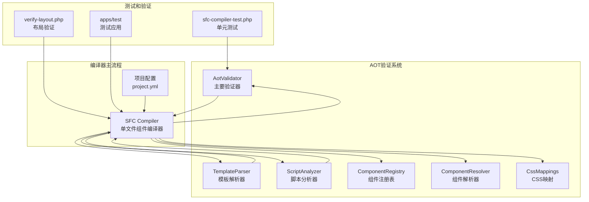
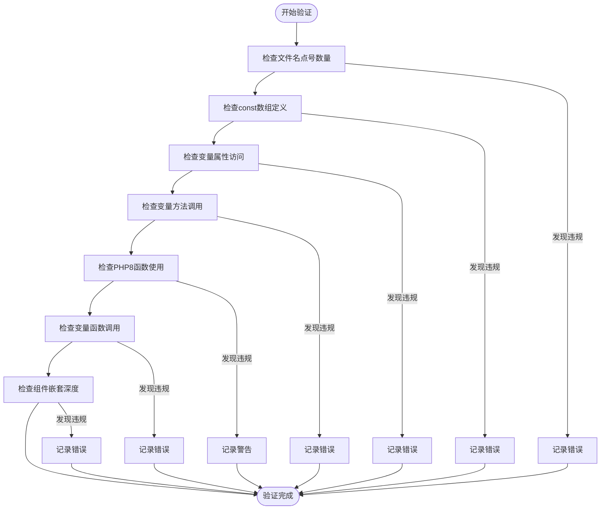
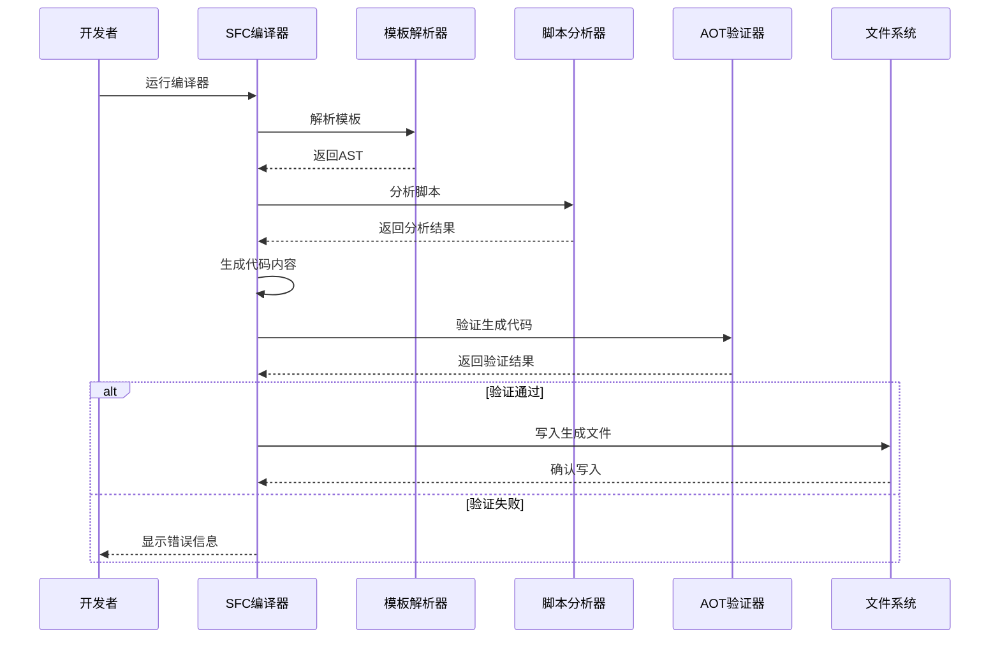
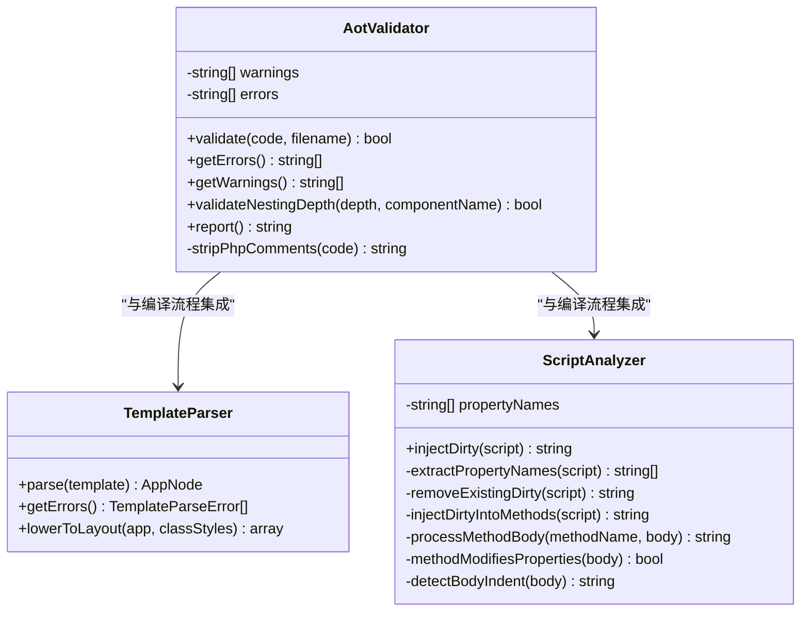
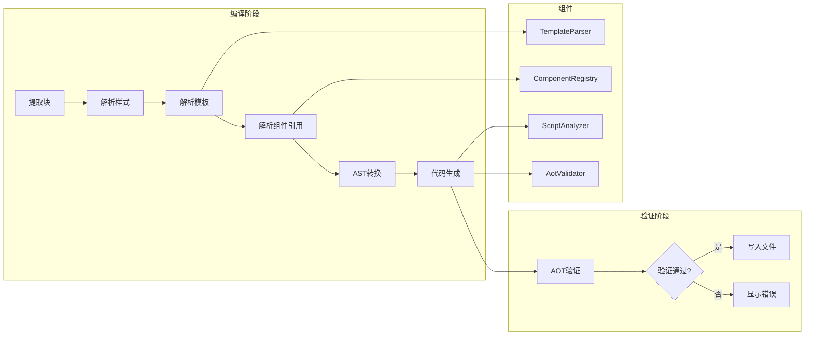
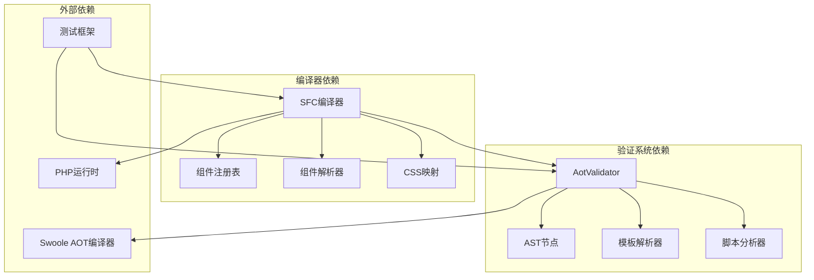

# AOT验证系统

<cite>
**本文档引用的文件**
- [aot-validator.php](file://framework/compiler/aot-validator.php)
- [sfc-compiler.php](file://framework/sfc-compiler.php)
- [template-parser.php](file://framework/compiler/template-parser.php)
- [ast-nodes.php](file://framework/compiler/ast-nodes.php)
- [script-analyzer.php](file://framework/compiler/script-analyzer.php)
- [component-registry.php](file://framework/compiler/component-registry.php)
- [component-resolver.php](file://framework/compiler/component-resolver.php)
- [css-mappings.php](file://framework/compiler/css-mappings.php)
- [main.php](file://apps/test/main.php)
- [hello.php](file://apps/test/hello.php)
- [project.yml](file://apps/calculator/project.yml)
- [sfc-compiler-test.php](file://tests/sfc-compiler-test.php)
- [verify-layout.php](file://tests/verify-layout.php)
</cite>

## 目录
1. [简介](#简介)
2. [项目结构](#项目结构)
3. [核心组件](#核心组件)
4. [架构概览](#架构概览)
5. [详细组件分析](#详细组件分析)
6. [依赖分析](#依赖分析)
7. [性能考虑](#性能考虑)
8. [故障排除指南](#故障排除指南)
9. [结论](#结论)

## 简介

AOT验证系统是VueCalc框架中用于确保生成代码与Swoole AOT编译器兼容性的关键组件。该系统在代码生成流程中执行预编译验证，通过检测潜在的编译器不兼容问题来保证生成的PHP代码能够在AOT环境中正确编译和运行。

系统的核心目标是：
- 验证生成的PHP代码符合Swoole AOT编译器的要求
- 检测可能导致编译失败或运行时错误的代码模式
- 提供详细的错误报告和修复建议
- 确保生成的代码在不同PHP版本间的兼容性

## 项目结构

AOT验证系统位于框架的compiler目录中，包含以下关键文件：



**图表来源**
- [aot-validator.php:1-207](file://framework/compiler/aot-validator.php#L1-L207)
- [sfc-compiler.php:1-819](file://framework/sfc-compiler.php#L1-L819)
- [template-parser.php:1-869](file://framework/compiler/template-parser.php#L1-L869)

**章节来源**
- [aot-validator.php:1-207](file://framework/compiler/aot-validator.php#L1-L207)
- [sfc-compiler.php:1-819](file://framework/sfc-compiler.php#L1-L819)

## 核心组件

### AotValidator - 主要验证器

AotValidator是验证系统的核心组件，负责执行所有AOT兼容性检查。它实现了7个主要验证规则：

1. **文件名点号检查** - 验证文件名中点号数量不超过1个
2. **常量数组检查** - 拒绝包含嵌套结构的const数组
3. **变量属性访问检查** - 拒绝$obj->$var形式的动态属性访问
4. **变量方法调用检查** - 拒绝$obj->$method()形式的动态方法调用
5. **PHP8函数兼容性检查** - 警告使用PHP8特有的函数
6. **变量函数调用检查** - 拒绝$fn()形式的动态函数调用
7. **组件嵌套深度检查** - 限制组件嵌套不超过1级

### 验证规则设计原理

验证规则基于Swoole AOT编译器的实际限制和已知问题设计：



**图表来源**
- [aot-validator.php:37-121](file://framework/compiler/aot-validator.php#L37-L121)

**章节来源**
- [aot-validator.php:18-121](file://framework/compiler/aot-validator.php#L18-L121)

## 架构概览

AOT验证系统在整个编译流程中扮演着关键的拦截器角色：



**图表来源**
- [sfc-compiler.php:584-597](file://framework/sfc-compiler.php#L584-L597)
- [aot-validator.php:37-121](file://framework/compiler/aot-validator.php#L37-L121)

**章节来源**
- [sfc-compiler.php:584-597](file://framework/sfc-compiler.php#L584-L597)

## 详细组件分析

### AotValidator类详细分析

AotValidator类采用面向对象设计，提供了清晰的验证接口：



**图表来源**
- [aot-validator.php:18-207](file://framework/compiler/aot-validator.php#L18-L207)
- [template-parser.php:61-869](file://framework/compiler/template-parser.php#L61-L869)
- [script-analyzer.php:15-281](file://framework/compiler/script-analyzer.php#L15-L281)

#### 验证规则实现细节

每个验证规则都有特定的实现策略：

**文件名验证规则**
- 检查文件名茎名中的点号数量
- 允许0-1个点号，超过1个点号将触发错误
- 用于确保AOT编译器能够正确生成C++符号

**常量数组验证规则**
- 使用正则表达式检测const关键字和数组字面量
- 拒绝包含嵌套数组的const定义
- 建议使用函数返回数组替代

**变量访问验证规则**
- 检测$obj->$var和$obj->$method()模式
- 这些动态访问模式在AOT编译器中不受支持
- 需要改写为显式的if/else或match语句

**PHP8函数兼容性**
- 监控str_contains、str_starts_with、str_ends_with等函数
- 这些函数在较老的PHP版本中不存在
- 提供替代方案建议

**章节来源**
- [aot-validator.php:37-121](file://framework/compiler/aot-validator.php#L37-L121)

### 编译器集成分析

SFC编译器与AOT验证器的集成体现了良好的模块化设计：



**图表来源**
- [sfc-compiler.php:262-601](file://framework/sfc-compiler.php#L262-L601)

**章节来源**
- [sfc-compiler.php:584-597](file://framework/sfc-compiler.php#L584-L597)

### 错误检测和报告机制

验证系统提供了多层次的错误检测和报告能力：

**错误分类**
- **致命错误**：阻止文件生成的问题
- **警告**：潜在兼容性问题，不影响编译
- **嵌套深度检查**：组件层次限制

**错误报告格式**
- 包含具体的错误描述
- 提供修复建议
- 格式化的CLI输出

**章节来源**
- [aot-validator.php:126-188](file://framework/compiler/aot-validator.php#L126-L188)

## 依赖分析

AOT验证系统与其他组件的依赖关系体现了清晰的分层架构：



**图表来源**
- [sfc-compiler.php:27-35](file://framework/sfc-compiler.php#L27-L35)
- [aot-validator.php:1-207](file://framework/compiler/aot-validator.php#L1-L207)

**章节来源**
- [sfc-compiler.php:27-35](file://framework/sfc-compiler.php#L27-L35)

## 性能考虑

AOT验证系统在设计时充分考虑了性能因素：

### 验证效率优化

**正则表达式优化**
- 使用高效的正则表达式模式进行代码扫描
- 避免重复的全局搜索操作
- 采用预编译的正则表达式模式

**内存使用优化**
- 验证过程中的内存占用最小化
- 及时清理临时数据结构
- 避免不必要的字符串复制

**早期失败策略**
- 发现第一个错误立即停止进一步检查
- 减少不必要的验证开销

### 编译时间影响

验证过程对整体编译时间的影响最小化：
- 验证操作的时间复杂度为O(n)，其中n为代码长度
- 并行验证多个文件的能力
- 缓存验证结果以避免重复计算

## 故障排除指南

### 常见验证错误及解决方案

**文件名点号过多错误**
```
错误: AOT: Filename 'Calculator.Layout.gen.php' has 2 dots in stem 'Calculator.Layout'. Max 1 allowed.
解决: 将文件名改为 'Calculator_Layout.gen.php' 或 'CalculatorLayout.gen.php'
```

**常量数组定义错误**
```
错误: AOT: const with array value detected.
解决: 将 const LAYOUT = [...] 改为 function getLayout() { return [...]; }
```

**变量属性访问错误**
```
错误: AOT: Variable property access detected ('$obj->$var').
解决: 将 $obj->$var 改为 if/else 或 match 语句
```

**变量方法调用错误**
```
错误: AOT: Variable method call detected ('$obj->$method()').
解决: 将 $obj->$method() 改为显式的方法调用
```

**PHP8函数兼容性警告**
```
警告: AOT: PHP8 function 'str_contains()' detected.
解决: 将 str_contains($haystack, $needle) 改为 strpos($haystack, $needle) !== false
```

**变量函数调用错误**
```
错误: AOT: Variable function call detected ('$fn()').
解决: 将 $fn() 改为 if/else 或 match 语句
```

**组件嵌套深度错误**
```
错误: AOT: Component nesting exceeds maximum depth (1 level).
解决: 简化组件层次结构，避免多级嵌套
```

### 诊断方法

**启用详细日志**
- 使用 --dump-ast 参数查看AST结构
- 检查模板解析错误列表
- 验证CSS样式映射结果

**代码审查清单**
- 检查所有动态访问模式
- 验证文件命名规范
- 确认PHP版本兼容性

**章节来源**
- [aot-validator.php:165-188](file://framework/compiler/aot-validator.php#L165-L188)
- [sfc-compiler-test.php:315-476](file://tests/sfc-compiler-test.php#L315-L476)

## 结论

AOT验证系统通过其精心设计的验证规则和高效的实现机制，为VueCalc框架提供了可靠的AOT编译器兼容性保障。系统的主要优势包括：

**设计优势**
- 清晰的验证规则分离和职责划分
- 高效的正则表达式匹配算法
- 完善的错误报告和修复建议

**实用性特点**
- 与编译器流程无缝集成
- 支持多种验证场景
- 提供详细的诊断信息

**扩展性考虑**
- 易于添加新的验证规则
- 模块化设计便于维护
- 良好的测试覆盖率

该系统有效地预防了常见的AOT编译器不兼容问题，确保生成的代码能够在目标环境中稳定运行，为开发者提供了可靠的质量保障。