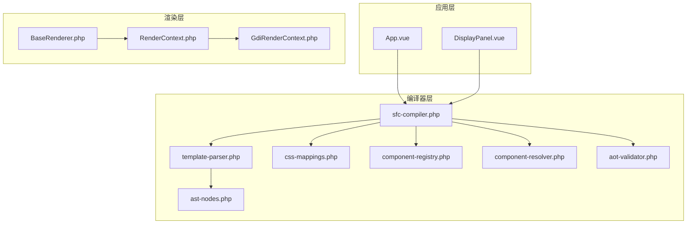
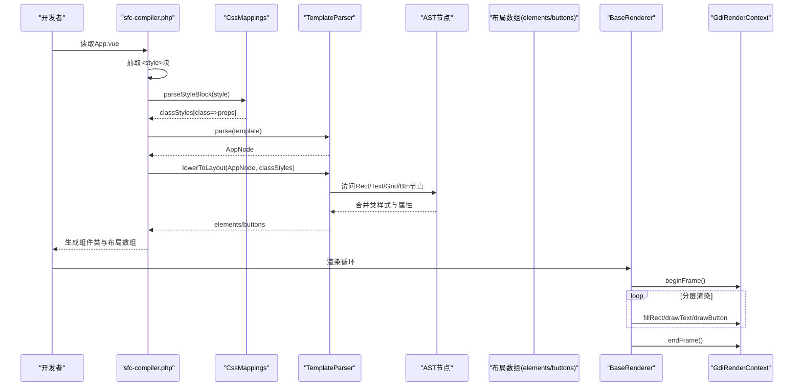
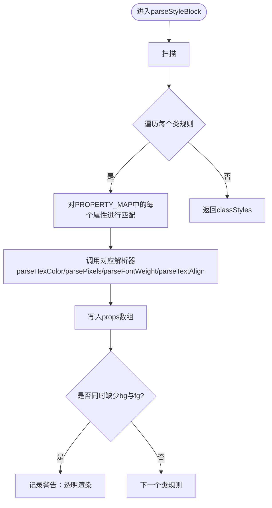
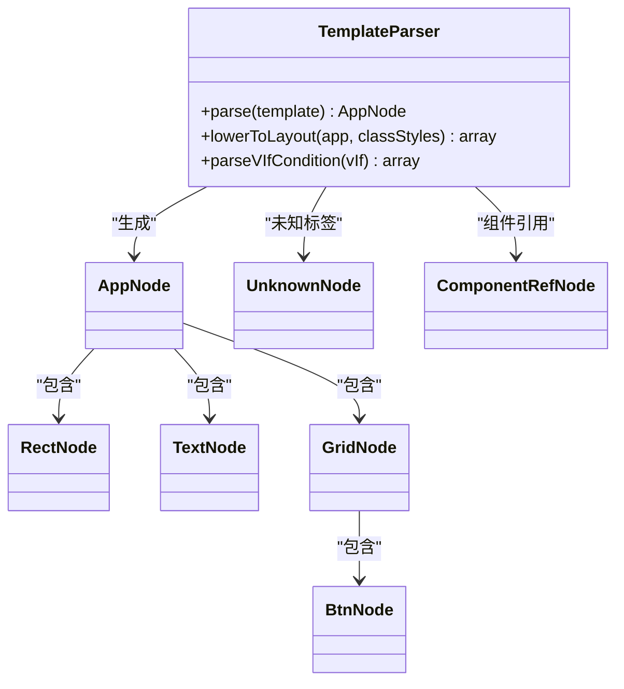
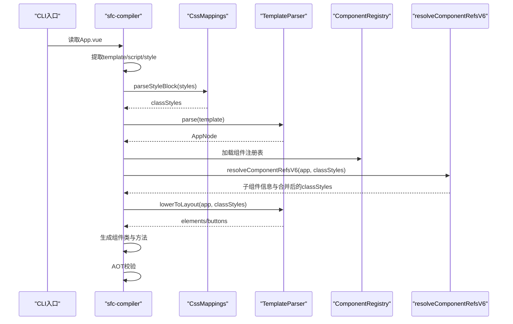
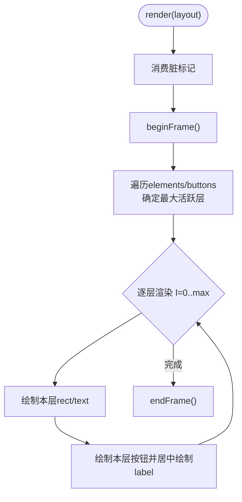
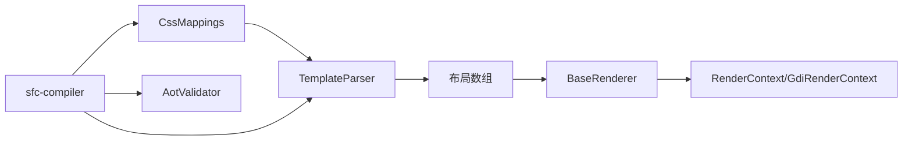

# CSS样式映射

<cite>
**本文引用的文件**
- [css-mappings.php](file://framework/compiler/css-mappings.php)
- [sfc-compiler.php](file://framework/sfc-compiler.php)
- [template-parser.php](file://framework/compiler/template-parser.php)
- [ast-nodes.php](file://framework/compiler/ast-nodes.php)
- [GdiRenderContext.php](file://framework/rendering/GdiRenderContext.php)
- [RenderContext.php](file://framework/rendering/RenderContext.php)
- [BaseRenderer.php](file://framework/BaseRenderer.php)
- [App.vue](file://apps/calculator/App.vue)
- [DisplayPanel.vue](file://apps/calculator/components/DisplayPanel.vue)
- [sfc-compiler-test.php](file://tests/sfc-compiler-test.php)
- [aot-validator.php](file://framework/compiler/aot-validator.php)
</cite>

## 目录
1. [简介](#简介)
2. [项目结构](#项目结构)
3. [核心组件](#核心组件)
4. [架构总览](#架构总览)
5. [详细组件分析](#详细组件分析)
6. [依赖关系分析](#依赖关系分析)
7. [性能考量](#性能考量)
8. [故障排查指南](#故障排查指南)
9. [结论](#结论)
10. [附录](#附录)

## 简介
本文件面向CSS样式映射系统，聚焦于Vue.js样式语法到GDI绘制属性的转换机制。内容涵盖：
- CSS类到渲染属性的映射规则与转换算法
- 样式解析器工作原理：CSS选择器解析、样式规则提取、属性值计算
- 样式系统架构：样式缓存、性能优化与内存管理
- 条件样式处理：v-if条件下的样式切换与动态样式应用
- 扩展能力：自定义样式属性与样式预处理器集成思路
- 调试技巧与性能优化建议

## 项目结构
该仓库采用“框架层 + 应用层”的组织方式：
- 框架层包含编译器、渲染器与通用组件，负责将Vue单文件组件编译为布局数组并渲染到GDI后端
- 应用层以计算器为例，展示如何在模板中使用CSS类并被编译器解析

图表来源
- [sfc-compiler.php:27-36](file://framework/sfc-compiler.php#L27-L36)
- [template-parser.php:16-18](file://framework/compiler/template-parser.php#L16-L18)
- [css-mappings.php:15-210](file://framework/compiler/css-mappings.php#L15-L210)
- [RenderContext.php:13-30](file://framework/rendering/RenderContext.php#L13-L30)
- [GdiRenderContext.php:11-38](file://framework/rendering/GdiRenderContext.php#L11-L38)
- [BaseRenderer.php:15-197](file://framework/BaseRenderer.php#L15-L197)

章节来源
- [sfc-compiler.php:27-36](file://framework/sfc-compiler.php#L27-L36)
- [template-parser.php:16-18](file://framework/compiler/template-parser.php#L16-L18)
- [css-mappings.php:15-210](file://framework/compiler/css-mappings.php#L15-L210)
- [RenderContext.php:13-30](file://framework/rendering/RenderContext.php#L13-L30)
- [GdiRenderContext.php:11-38](file://framework/rendering/GdiRenderContext.php#L11-L38)
- [BaseRenderer.php:15-197](file://framework/BaseRenderer.php#L15-L197)

## 核心组件
- CssMappings：CSS属性到GDI参数的映射表与解析器，负责将CSS类样式解析为布局输出所需的键值对
- TemplateParser：递归下降解析器，将模板字符串转为AST，并在降级阶段产出布局数组
- sfc-compiler：编译入口，串联样式解析、模板解析、组件解析与布局生成
- BaseRenderer：渲染调度器，按层渲染元素与按钮，支持条件判断
- RenderContext/GdiRenderContext：渲染上下文抽象与GDI具体实现

章节来源
- [css-mappings.php:15-210](file://framework/compiler/css-mappings.php#L15-L210)
- [template-parser.php:61-800](file://framework/compiler/template-parser.php#L61-L800)
- [sfc-compiler.php:27-819](file://framework/sfc-compiler.php#L27-L819)
- [BaseRenderer.php:15-197](file://framework/BaseRenderer.php#L15-L197)
- [RenderContext.php:13-30](file://framework/rendering/RenderContext.php#L13-L30)
- [GdiRenderContext.php:11-38](file://framework/rendering/GdiRenderContext.php#L11-L38)

## 架构总览
样式映射的端到端流程如下：
1. 编译期：sfc-compiler从.vue中抽取<style>块，交由CssMappings解析为类→属性映射
2. 模板期：TemplateParser将<template>解析为AST，在lowerToLayout阶段将类样式合并到布局元素
3. 运行期：BaseRenderer根据布局数组与条件表达式进行分层渲染，调用GdiRenderContext绘制

图表来源
- [sfc-compiler.php:296-351](file://framework/sfc-compiler.php#L296-L351)
- [template-parser.php:547-686](file://framework/compiler/template-parser.php#L547-L686)
- [BaseRenderer.php:98-196](file://framework/BaseRenderer.php#L98-L196)
- [GdiRenderContext.php:13-36](file://framework/rendering/GdiRenderContext.php#L13-L36)

## 详细组件分析

### CssMappings：CSS到GDI映射与解析
- 映射表：PROPERTY_MAP定义了CSS属性到输出键、解析器与默认值的三元组
- 解析器：
  - hexToBgr：支持#RGB与#RRGGBB，返回GDI COLORREF整数
  - borderColor：基于背景色轻微提亮生成边框色
  - parseStyleBlock：正则提取类规则，逐条匹配PROPERTY_MAP并调用对应解析器
  - resolveStyle：将类样式与内联覆盖合并
- 性能与内存：
  - 正则扫描一次提取所有类规则，时间复杂度O(N)（N为CSS字节数）
  - 内存占用主要为classStyles数组，按类名索引存储属性映射
- 错误处理：当类未设置背景或前景色时发出警告

图表来源
- [css-mappings.php:164-194](file://framework/compiler/css-mappings.php#L164-L194)

章节来源
- [css-mappings.php:15-210](file://framework/compiler/css-mappings.php#L15-L210)

### TemplateParser：模板解析与布局降级
- 词法与语法：
  - tokenize：识别标签、注释、文本等Token，跟踪行号
  - 递归下降解析：parseDocument/parseApp/parseElement等，支持rect/text/grid/btn与未知标签
- 降级阶段lowerToLayout：
  - 将AST节点映射为布局数组元素，合并类样式与内联属性
  - 收集绑定键、处理器映射、条件属性，用于后续代码生成
- v-if条件：
  - parseVIfCondition：支持prop、!prop、prop=='val'、prop!='val'
  - 在布局元素上附加condition字段，运行期由组件evalCondition评估

图表来源
- [template-parser.php:61-800](file://framework/compiler/template-parser.php#L61-L800)
- [ast-nodes.php:9-211](file://framework/compiler/ast-nodes.php#L9-L211)

章节来源
- [template-parser.php:61-800](file://framework/compiler/template-parser.php#L61-L800)
- [ast-nodes.php:9-211](file://framework/compiler/ast-nodes.php#L9-L211)

### sfc-compiler：编译入口与组件解析
- 步骤：
  - 提取template/script/style块
  - CssMappings.parseStyleBlock解析样式
  - TemplateParser.parse解析模板并lowerToLayout
  - 组件解析：resolveComponentRefsV6内联子组件样式与布局
  - 代码生成：注入脏标记、生成getBindValue/dispatchClick/evalCondition
  - AOT校验：aot-validator检查生成代码的AOT兼容性
- 组件内联：
  - 合并子组件样式到父级classStyles
  - 传播v-if到子组件内的元素
  - 应用坐标偏移与属性绑定

图表来源
- [sfc-compiler.php:261-351](file://framework/sfc-compiler.php#L261-L351)
- [sfc-compiler.php:95-192](file://framework/sfc-compiler.php#L95-L192)

章节来源
- [sfc-compiler.php:261-351](file://framework/sfc-compiler.php#L261-L351)
- [sfc-compiler.php:95-192](file://framework/sfc-compiler.php#L95-L192)

### BaseRenderer：条件样式与分层渲染
- 分层渲染：先确定最大活跃层，再按层顺序绘制，支持overlay叠加
- 条件渲染：对每个元素/按钮检查condition，调用组件evalCondition评估
- 文本对齐：支持left/right/center，结合容器宽度与字号计算实际x位置
- 调用GDI：fillRect/drawText/drawButton

图表来源
- [BaseRenderer.php:98-196](file://framework/BaseRenderer.php#L98-L196)

章节来源
- [BaseRenderer.php:98-196](file://framework/BaseRenderer.php#L98-L196)

### 应用示例：App.vue与DisplayPanel.vue
- App.vue定义了多个CSS类：app-bg、expr-text、display-text、btn-func等
- DisplayPanel.vue定义了display-bg与display-text
- 编译器会将这些类解析为布局元素的颜色、字号、粗细等属性

章节来源
- [App.vue:196-202](file://apps/calculator/App.vue#L196-L202)
- [DisplayPanel.vue:8-11](file://apps/calculator/components/DisplayPanel.vue#L8-L11)

## 依赖关系分析
- CssMappings依赖正则与静态解析器，耦合度低，便于扩展新属性
- TemplateParser依赖CssMappings输出的classStyles，形成编译期耦合
- BaseRenderer依赖组件提供的evalCondition与RenderContext接口，运行期解耦
- sfc-compiler作为编排者，协调各模块并进行AOT校验

图表来源
- [css-mappings.php:15-210](file://framework/compiler/css-mappings.php#L15-L210)
- [template-parser.php:547-686](file://framework/compiler/template-parser.php#L547-L686)
- [BaseRenderer.php:15-197](file://framework/BaseRenderer.php#L15-L197)
- [GdiRenderContext.php:11-38](file://framework/rendering/GdiRenderContext.php#L11-L38)
- [sfc-compiler.php:27-36](file://framework/sfc-compiler.php#L27-L36)
- [aot-validator.php:18-207](file://framework/compiler/aot-validator.php#L18-L207)

章节来源
- [css-mappings.php:15-210](file://framework/compiler/css-mappings.php#L15-L210)
- [template-parser.php:547-686](file://framework/compiler/template-parser.php#L547-L686)
- [BaseRenderer.php:15-197](file://framework/BaseRenderer.php#L15-L197)
- [GdiRenderContext.php:11-38](file://framework/rendering/GdiRenderContext.php#L11-L38)
- [sfc-compiler.php:27-36](file://framework/sfc-compiler.php#L27-L36)
- [aot-validator.php:18-207](file://framework/compiler/aot-validator.php#L18-L207)

## 性能考量
- 编译期
  - CssMappings使用正则一次性扫描，时间复杂度线性；classStyles为哈希表查找O(1)
  - TemplateParser的lowerToLayout遍历元素与按钮，整体O(N)，其中条件判断为O(1)
  - 组件内联时合并样式与传播v-if，避免运行期开销
- 运行期
  - BaseRenderer按层渲染，减少不必要的绘制
  - 文本对齐计算在渲染前完成，避免重复计算
- 内存
  - classStyles按类名索引，内存占用与类数量线性相关
  - 布局数组紧凑存储，适合AOT编译器优化

[本节为通用性能讨论，无需特定文件来源]

## 故障排查指南
- CSS类未生效
  - 检查类名是否与模板中class一致
  - 确认CssMappings.parseStyleBlock是否正确解析
  - 查看编译器输出的样式警告
- 文本不显示
  - 检查:text绑定是否为空
  - 确认字体大小与文本长度的关系导致的裁剪
- 按钮未渲染
  - 检查v-if条件是否为false
  - 确认按钮的handler与arg是否正确解析
- AOT编译失败
  - 使用aot-validator报告的问题逐项修正
  - 避免变量属性/方法访问、PHP8函数误用、文件名含多余点号等

章节来源
- [sfc-compiler-test.php:48-104](file://tests/sfc-compiler-test.php#L48-L104)
- [BaseRenderer.php:34-90](file://framework/BaseRenderer.php#L34-L90)
- [aot-validator.php:37-121](file://framework/compiler/aot-validator.php#L37-L121)

## 结论
该样式映射系统通过清晰的编译期解析与运行期渲染分离，实现了从Vue样式到GDI绘制属性的高效转换。CssMappings提供了可扩展的映射表与解析器，TemplateParser与sfc-compiler保证了模板到布局的稳定转换，BaseRenderer与GdiRenderContext确保了条件样式与分层渲染的正确执行。整体架构具备良好的扩展性与可维护性。

[本节为总结，无需特定文件来源]

## 附录

### CSS属性映射表（PROPERTY_MAP）
- background → bg（COLORREF）
- color → fg（COLORREF）
- font-size → fontSize（像素）
- font-weight → bold（0/1）
- border-radius/padding/margin/text-align（扩展支持）

章节来源
- [css-mappings.php:27-69](file://framework/compiler/css-mappings.php#L27-L69)

### v-if条件语法
- prop：真值检查
- !prop：假值检查
- prop=='val' / prop!='val'：相等/不等比较

章节来源
- [template-parser.php:765-781](file://framework/compiler/template-parser.php#L765-L781)

### 样式解析器扩展指南
- 新增CSS属性
  - 在PROPERTY_MAP中添加条目：['key','parser','default']
  - 实现对应的解析器函数（如parsePixels/parseTextAlign）
  - 在lowerToLayout中使用合并后的样式
- 预处理器集成
  - 在sfc-compiler中引入预处理步骤，将预处理后的CSS传入CssMappings.parseStyleBlock
  - 注意保持类名与模板一致

章节来源
- [css-mappings.php:15-210](file://framework/compiler/css-mappings.php#L15-L210)
- [sfc-compiler.php:296-301](file://framework/sfc-compiler.php#L296-L301)