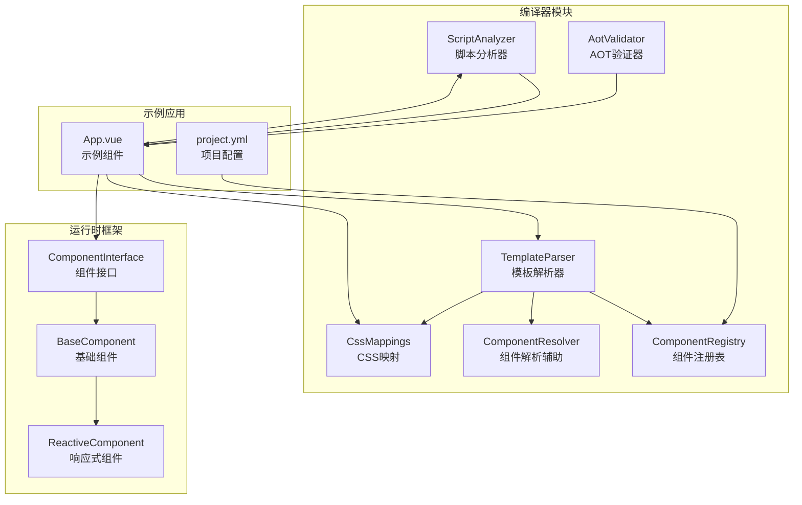
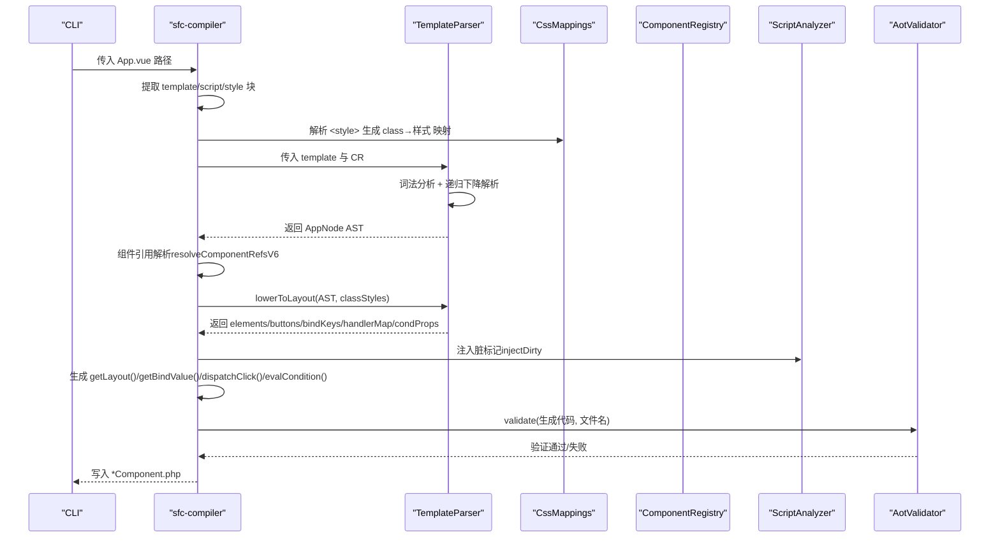
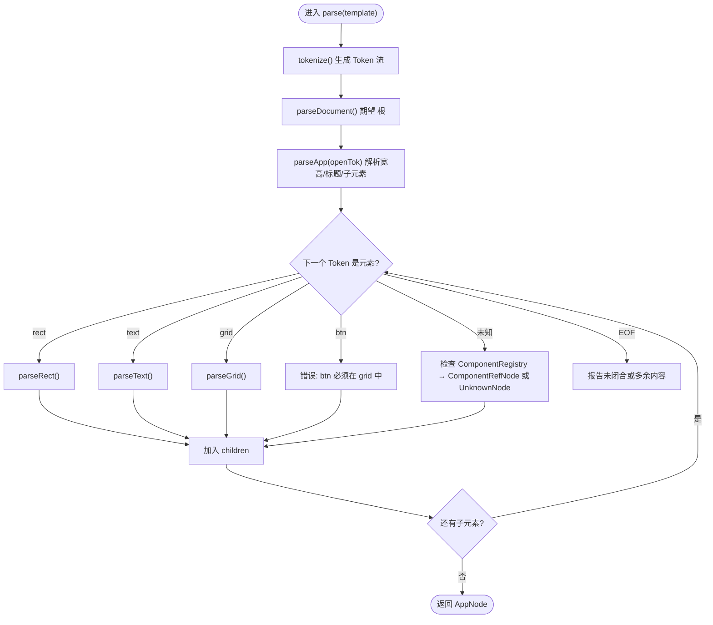
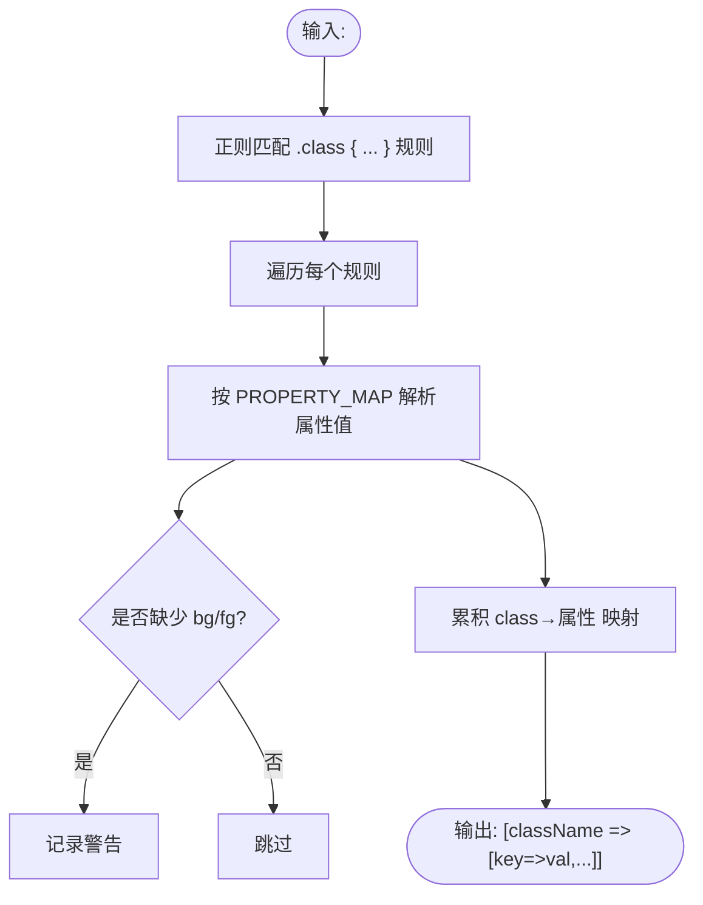
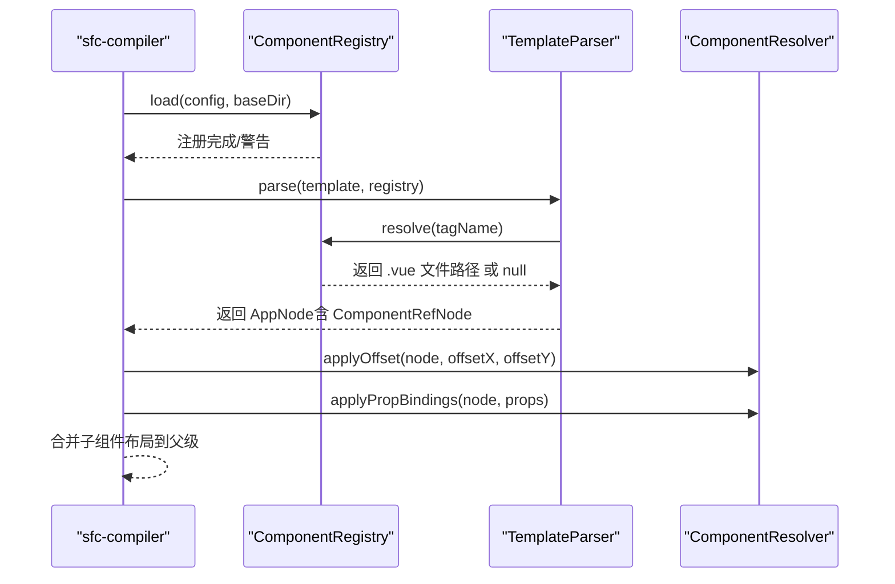
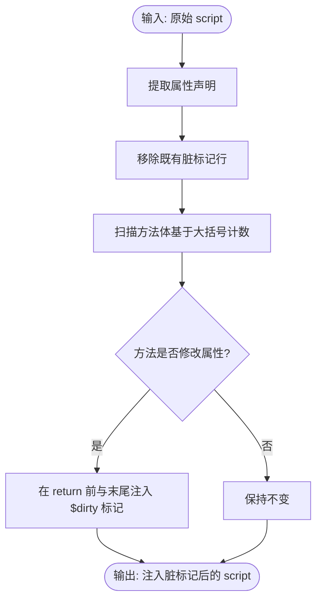
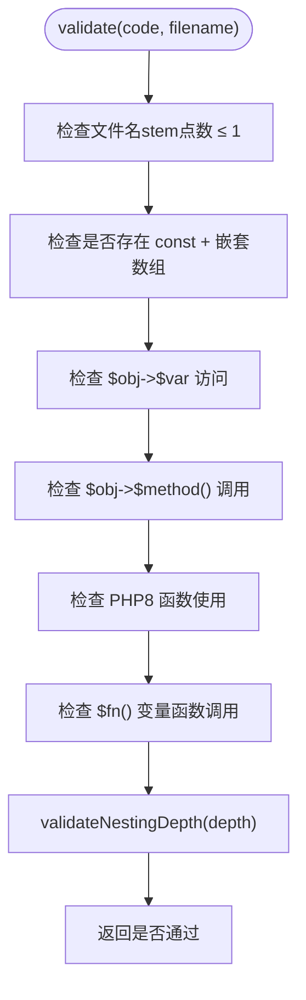
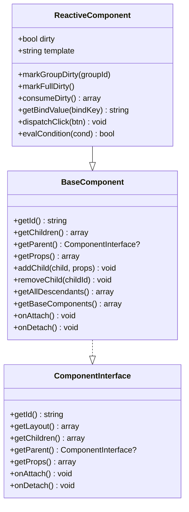
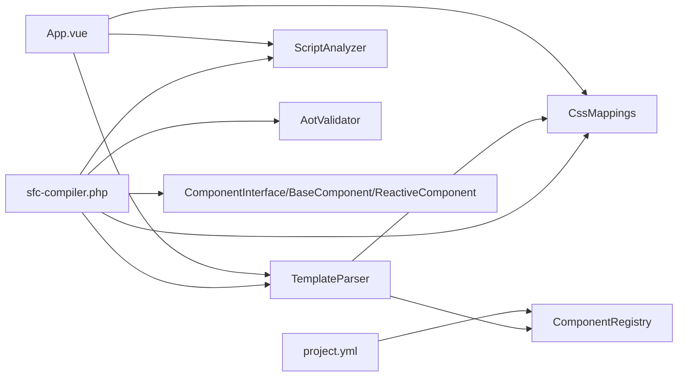

# SFC编译器技术

<cite>
**本文引用的文件**
- [sfc-compiler.php](file://framework/sfc-compiler.php)
- [template-parser.php](file://framework/compiler/template-parser.php)
- [aot-validator.php](file://framework/compiler/aot-validator.php)
- [component-registry.php](file://framework/compiler/component-registry.php)
- [css-mappings.php](file://framework/compiler/css-mappings.php)
- [script-analyzer.php](file://framework/compiler/script-analyzer.php)
- [component-resolver.php](file://framework/compiler/component-resolver.php)
- [ast-nodes.php](file://framework/compiler/ast-nodes.php)
- [App.vue](file://apps/calculator/App.vue)
- [project.yml](file://apps/calculator/project.yml)
- [ComponentInterface.php](file://framework/interfaces/ComponentInterface.php)
- [BaseComponent.php](file://framework/BaseComponent.php)
- [ReactiveComponent.php](file://framework/ReactiveComponent.php)
- [sfc-compiler-test.php](file://tests/sfc-compiler-test.php)
</cite>

## 目录
1. [简介](#简介)
2. [项目结构](#项目结构)
3. [核心组件](#核心组件)
4. [架构总览](#架构总览)
5. [详细组件分析](#详细组件分析)
6. [依赖分析](#依赖分析)
7. [性能考量](#性能考量)
8. [故障排除指南](#故障排除指南)
9. [结论](#结论)
10. [附录](#附录)

## 简介
本技术文档面向SFC（单文件组件）编译器，系统阐述从Vue风格模板语法到可执行代码的完整编译流程。重点覆盖：
- 模板解析器：递归下降解析、AST构建、指令解析（v-if、v-model等）、代码生成准备（lowerToLayout）
- CSS映射：将Vue样式语法映射为GDI绘制参数
- 组件注册与解析：组件标签到源文件的映射、组件引用解析与内联
- AOT验证器：生成代码的兼容性与安全性检查
- 代码生成：布局数组、事件分发、条件求值、脏标记注入
- 扩展点与自定义指令：节点类型扩展、指令解析扩展
- 性能优化与调试：编译期坐标计算、最小化运行时开销、调试输出

## 项目结构
整体采用“编译器模块 + 运行时框架 + 示例应用”的分层组织：
- 编译器模块：模板解析、CSS映射、组件注册、脚本分析、AOT验证、组件解析辅助
- 运行时框架：组件接口、基础组件、响应式组件、渲染上下文
- 示例应用：示例Vue组件与项目配置，展示编译器工作流

图表来源
- [sfc-compiler.php:27-36](file://framework/sfc-compiler.php#L27-L36)
- [template-parser.php:61-76](file://framework/compiler/template-parser.php#L61-L76)
- [css-mappings.php:15-210](file://framework/compiler/css-mappings.php#L15-L210)
- [component-registry.php:14-70](file://framework/compiler/component-registry.php#L14-L70)
- [script-analyzer.php:15-281](file://framework/compiler/script-analyzer.php#L15-L281)
- [aot-validator.php:18-207](file://framework/compiler/aot-validator.php#L18-L207)
- [component-resolver.php:9-62](file://framework/compiler/component-resolver.php#L9-L62)
- [ComponentInterface.php:13-52](file://framework/interfaces/ComponentInterface.php#L13-L52)
- [BaseComponent.php:16-177](file://framework/BaseComponent.php#L16-L177)
- [ReactiveComponent.php:14-90](file://framework/ReactiveComponent.php#L14-L90)
- [App.vue:1-203](file://apps/calculator/App.vue#L1-L203)
- [project.yml:29-34](file://apps/calculator/project.yml#L29-L34)

章节来源
- [sfc-compiler.php:27-36](file://framework/sfc-compiler.php#L27-L36)
- [App.vue:1-203](file://apps/calculator/App.vue#L1-L203)
- [project.yml:29-34](file://apps/calculator/project.yml#L29-L34)

## 核心组件
- 模板解析器（TemplateParser）：词法分析（Tokenize）→ 递归下降解析（Recursive Descent）→ AST构建；支持未知标签降级为UnknownNode；支持组件引用解析（ComponentRefNode）；支持v-if、v-model、@click等指令解析；最后将AST下推为布局数组（lowerToLayout）。
- CSS映射（CssMappings）：定义CSS属性到GDI参数的映射表（PROPERTY_MAP），解析<style>块，生成class→属性映射，并提供颜色、字号、粗细、对齐等解析器。
- 组件注册（ComponentRegistry）：从project.yml加载组件映射（tag→.vue路径），支持相对路径解析与存在性校验。
- 脚本分析（ScriptAnalyzer）：自动识别组件属性声明，移除手动脏标记，自动在状态修改方法中注入$dirty标记，减少手写样板。
- AOT验证器（AotValidator）：在写盘前对生成代码进行AOT兼容性检查，包括文件名约束、const数组限制、变量属性/方法访问、PHP8函数替换建议、变量函数调用等。
- 组件解析辅助（ComponentResolver）：提供applyOffset、applyPropBindings等工具，用于组件引用内联时的坐标偏移与属性绑定映射。
- AST节点（ast-nodes.php）：定义AppNode、RectNode、TextNode、GridNode、BtnNode、UnknownNode、ComponentRefNode等节点类型，统一携带行号、v-if、layer、groupId等元信息。
- 运行时组件（ComponentInterface/BaseComponent/ReactiveComponent）：定义组件接口、组件树管理、响应式脏标记与分组脏标记、布局数据获取等。

章节来源
- [template-parser.php:61-105](file://framework/compiler/template-parser.php#L61-L105)
- [css-mappings.php:15-210](file://framework/compiler/css-mappings.php#L15-L210)
- [component-registry.php:14-70](file://framework/compiler/component-registry.php#L14-L70)
- [script-analyzer.php:15-281](file://framework/compiler/script-analyzer.php#L15-L281)
- [aot-validator.php:18-207](file://framework/compiler/aot-validator.php#L18-L207)
- [component-resolver.php:9-62](file://framework/compiler/component-resolver.php#L9-L62)
- [ast-nodes.php:9-211](file://framework/compiler/ast-nodes.php#L9-L211)
- [ComponentInterface.php:13-52](file://framework/interfaces/ComponentInterface.php#L13-L52)
- [BaseComponent.php:16-177](file://framework/BaseComponent.php#L16-L177)
- [ReactiveComponent.php:14-90](file://framework/ReactiveComponent.php#L14-L90)

## 架构总览
编译器主流程（sfc-compiler.php）串联各模块，生成最终的组件类文件（*Component.php），并通过AOT验证器确保兼容性。

图表来源
- [sfc-compiler.php:261-601](file://framework/sfc-compiler.php#L261-L601)
- [template-parser.php:88-105](file://framework/compiler/template-parser.php#L88-L105)
- [css-mappings.php:164-194](file://framework/compiler/css-mappings.php#L164-L194)
- [component-registry.php:26-41](file://framework/compiler/component-registry.php#L26-L41)
- [script-analyzer.php:27-43](file://framework/compiler/script-analyzer.php#L27-L43)
- [aot-validator.php:37-121](file://framework/compiler/aot-validator.php#L37-L121)

## 详细组件分析

### 模板解析器（TemplateParser）
- 词法分析：识别标签（开放/闭合/自闭合）、注释、文本，维护行号。
- 递归下降解析：以<App>为根，解析rect/text/grid/btn或组件引用；未知标签生成UnknownNode并记录错误。
- 指令解析：
  - v-if：支持prop、!prop、prop=='val'、prop!='val'，解析为结构化条件数组。
  - v-model：与:bind互斥，隐式提升为:bind。
  - @click：支持无参与带参形式，拆分为handler与arg。
- 下推（lowerToLayout）：将AST转为布局数组，编译期计算网格按钮坐标，收集bindKeys、handlerMap、condProps，用于生成getBindValue、dispatchClick、evalCondition。

图表来源
- [template-parser.php:214-288](file://framework/compiler/template-parser.php#L214-L288)
- [template-parser.php:293-333](file://framework/compiler/template-parser.php#L293-L333)
- [template-parser.php:335-394](file://framework/compiler/template-parser.php#L335-L394)
- [template-parser.php:396-456](file://framework/compiler/template-parser.php#L396-L456)
- [template-parser.php:458-488](file://framework/compiler/template-parser.php#L458-L488)
- [template-parser.php:490-543](file://framework/compiler/template-parser.php#L490-L543)

章节来源
- [template-parser.php:61-105](file://framework/compiler/template-parser.php#L61-L105)
- [template-parser.php:547-686](file://framework/compiler/template-parser.php#L547-L686)
- [template-parser.php:755-781](file://framework/compiler/template-parser.php#L755-L781)

### CSS映射（CssMappings）
- PROPERTY_MAP：定义CSS属性到输出键（如bg/fg/fontSize/bold等）及解析器，默认值。
- hexToBgr：支持#RGB短码扩展，返回GDI COLORREF整数。
- borderColor：基于背景色轻微提亮生成边框色。
- parseStyleBlock：解析<style>块，提取class→属性映射，缺失前景/背景时发出警告。
- resolveStyle：合并class样式与内联覆盖。

图表来源
- [css-mappings.php:164-194](file://framework/compiler/css-mappings.php#L164-L194)
- [css-mappings.php:79-96](file://framework/compiler/css-mappings.php#L79-L96)
- [css-mappings.php:116-151](file://framework/compiler/css-mappings.php#L116-L151)

章节来源
- [css-mappings.php:15-210](file://framework/compiler/css-mappings.php#L15-L210)

### 组件注册与解析（ComponentRegistry + ComponentResolver）
- ComponentRegistry：从project.yml加载组件映射，支持相对路径解析与文件存在性校验，返回绝对路径或空。
- ComponentResolver：applyOffset将父组件的x/y偏移应用到子组件内元素；applyPropBindings将父组件的:prop绑定映射到子组件的:bind键。

图表来源
- [component-registry.php:26-41](file://framework/compiler/component-registry.php#L26-L41)
- [component-resolver.php:13-29](file://framework/compiler/component-resolver.php#L13-L29)
- [component-resolver.php:39-61](file://framework/compiler/component-resolver.php#L39-L61)

章节来源
- [component-registry.php:14-70](file://framework/compiler/component-registry.php#L14-L70)
- [component-resolver.php:9-62](file://framework/compiler/component-resolver.php#L9-L62)

### 脚本分析（ScriptAnalyzer）
- 自动提取组件属性声明（public string/int/bool/array $prop ...）
- 移除现有脏标记（$this->dirty = true;）
- 状态修改方法（非构造）自动注入脏标记：在每个return前与方法末尾注入

图表来源
- [script-analyzer.php:27-43](file://framework/compiler/script-analyzer.php#L27-L43)
- [script-analyzer.php:87-201](file://framework/compiler/script-analyzer.php#L87-L201)
- [script-analyzer.php:210-243](file://framework/compiler/script-analyzer.php#L210-L243)

章节来源
- [script-analyzer.php:15-281](file://framework/compiler/script-analyzer.php#L15-L281)

### AOT验证器（AotValidator）
- 文件名约束：文件名stem最多允许1个点，避免生成无效C++符号名。
- const数组限制：禁止const嵌套数组，推荐使用函数返回数组。
- 变量属性/方法访问：禁止$obj->$var、$obj->$method()，需显式分支。
- PHP8函数：检测str_contains等仅PHP8可用函数，建议替换为兼容写法。
- 变量函数调用：禁止$fn()，建议显式if/else或match。
- 嵌套深度：限制组件最大嵌套深度（v5仅1级，v6后续扩展）。

图表来源
- [aot-validator.php:37-121](file://framework/compiler/aot-validator.php#L37-L121)
- [aot-validator.php:151-160](file://framework/compiler/aot-validator.php#L151-L160)

章节来源
- [aot-validator.php:18-207](file://framework/compiler/aot-validator.php#L18-L207)

### 代码生成与运行时集成
- sfc-compiler根据lowerToLayout收集的信息，自动生成：
  - getLayout()：返回elements/buttons数组
  - getBindValue()：根据bindKeys生成分支
  - dispatchClick()：根据handlerMap生成分支
  - evalCondition()：根据condProps生成条件判断
  - registerChildren()/getBaseComponents()：根组件自动生成子组件注册与基础组件树
- 生成的组件类继承ReactiveComponent，实现接口约定的方法，配合运行时框架完成渲染与交互。

图表来源
- [ReactiveComponent.php:14-90](file://framework/ReactiveComponent.php#L14-L90)
- [BaseComponent.php:16-177](file://framework/BaseComponent.php#L16-L177)
- [ComponentInterface.php:13-52](file://framework/interfaces/ComponentInterface.php#L13-L52)

章节来源
- [sfc-compiler.php:362-581](file://framework/sfc-compiler.php#L362-L581)
- [ReactiveComponent.php:66-90](file://framework/ReactiveComponent.php#L66-L90)
- [BaseComponent.php:137-170](file://framework/BaseComponent.php#L137-L170)

## 依赖分析
- 模块耦合：
  - sfc-compiler.php依赖所有编译器模块与运行时接口，负责编排与生成。
  - TemplateParser依赖ComponentRegistry与CssMappings，用于组件解析与样式映射。
  - ScriptAnalyzer独立处理脚本块，与模板解析解耦。
  - AotValidator独立于生成逻辑，仅做静态检查。
- 外部依赖：
  - 项目配置（project.yml）驱动组件注册。
  - 示例组件（App.vue）演示模板语法与样式使用。

图表来源
- [sfc-compiler.php:27-36](file://framework/sfc-compiler.php#L27-L36)
- [template-parser.php:16-17](file://framework/compiler/template-parser.php#L16-L17)
- [component-registry.php:26-41](file://framework/compiler/component-registry.php#L26-L41)
- [css-mappings.php:164-194](file://framework/compiler/css-mappings.php#L164-L194)
- [script-analyzer.php:27-43](file://framework/compiler/script-analyzer.php#L27-L43)
- [aot-validator.php:37-121](file://framework/compiler/aot-validator.php#L37-L121)
- [ComponentInterface.php:13-52](file://framework/interfaces/ComponentInterface.php#L13-L52)
- [BaseComponent.php:16-177](file://framework/BaseComponent.php#L16-L177)
- [ReactiveComponent.php:14-90](file://framework/ReactiveComponent.php#L14-L90)
- [project.yml:29-34](file://apps/calculator/project.yml#L29-L34)
- [App.vue:1-203](file://apps/calculator/App.vue#L1-L203)

章节来源
- [sfc-compiler.php:27-36](file://framework/sfc-compiler.php#L27-L36)
- [template-parser.php:16-17](file://framework/compiler/template-parser.php#L16-L17)
- [component-registry.php:26-41](file://framework/compiler/component-registry.php#L26-L41)
- [css-mappings.php:164-194](file://framework/compiler/css-mappings.php#L164-L194)
- [script-analyzer.php:27-43](file://framework/compiler/script-analyzer.php#L27-L43)
- [aot-validator.php:37-121](file://framework/compiler/aot-validator.php#L37-L121)
- [ComponentInterface.php:13-52](file://framework/interfaces/ComponentInterface.php#L13-L52)
- [BaseComponent.php:16-177](file://framework/BaseComponent.php#L16-L177)
- [ReactiveComponent.php:14-90](file://framework/ReactiveComponent.php#L14-L90)
- [project.yml:29-34](file://apps/calculator/project.yml#L29-L34)
- [App.vue:1-203](file://apps/calculator/App.vue#L1-L203)

## 性能考量
- 编译期坐标计算：网格按钮在lowerToLayout阶段完成坐标计算，避免运行时重复计算。
- 最小化运行时开销：布局数组直接传递给渲染器；事件分发与条件判断通过生成的分支函数实现，避免反射与动态调度。
- 脏标记优化：分组脏标记与全量脏标记分离，减少不必要的重绘范围。
- AOT兼容性前置检查：在写盘前进行严格验证，避免运行时崩溃与类型推断失败。

[本节为通用指导，无需具体文件引用]

## 故障排除指南
- 模板解析错误：
  - 未知标签：解析器会生成UnknownNode并记录错误，检查是否拼写错误或未注册组件。
  - 缺少class属性：rect/text需要class，否则会报错。
  - btn不在grid内：仅grid允许子btn。
  - v-if语法：支持prop、!prop、prop=='val'、prop!='val'，请按规范书写。
- CSS映射警告：
  - 缺少background/color：可能导致透明渲染，建议补充。
- 组件解析问题：
  - 未在project.yml注册的组件标签：无法解析为ComponentRefNode，检查映射。
  - 嵌套层级超限：v5仅支持1级嵌套，多级嵌套将被拒绝。
- AOT验证失败：
  - 文件名含多个点：改为Calculator.php或Calculator_gen.php。
  - const嵌套数组：改为函数返回数组。
  - 变量属性/方法访问：改为显式分支。
  - PHP8函数：使用兼容写法（如strpos替代str_contains）。
  - 变量函数调用：改为显式if/else或match。
- 调试技巧：
  - 使用--dump-ast查看AST结构，定位解析问题。
  - 在模板中添加注释或占位元素，逐步缩小问题范围。
  - 单独运行tests/sfc-compiler-test.php验证关键功能。

章节来源
- [template-parser.php:783-786](file://framework/compiler/template-parser.php#L783-L786)
- [css-mappings.php:185-188](file://framework/compiler/css-mappings.php#L185-L188)
- [aot-validator.php:55-114](file://framework/compiler/aot-validator.php#L55-L114)
- [sfc-compiler-test.php:159-231](file://tests/sfc-compiler-test.php#L159-L231)

## 结论
该SFC编译器以模块化设计实现了从Vue风格模板到可执行组件类的完整链路。通过递归下降解析、CSS映射、组件注册与解析、脚本分析与AOT验证，确保生成代码的正确性与AOT兼容性。编译期的布局数组与事件/条件生成显著降低运行时开销。结合扩展点（节点类型、指令解析）与完善的调试手段，可满足桌面应用的高性能与可维护性需求。

[本节为总结，无需具体文件引用]

## 附录
- 示例应用：App.vue展示了典型模板语法（<app>、<rect>、<text>、<grid>、<btn>、组件引用、v-if、v-model），project.yml定义了组件注册映射。
- 测试用例：sfc-compiler-test.php覆盖CSS映射、模板解析、AST→布局、AOT验证、组件生态等关键场景，便于回归与扩展。

章节来源
- [App.vue:1-203](file://apps/calculator/App.vue#L1-L203)
- [project.yml:29-34](file://apps/calculator/project.yml#L29-L34)
- [sfc-compiler-test.php:1-626](file://tests/sfc-compiler-test.php#L1-L626)