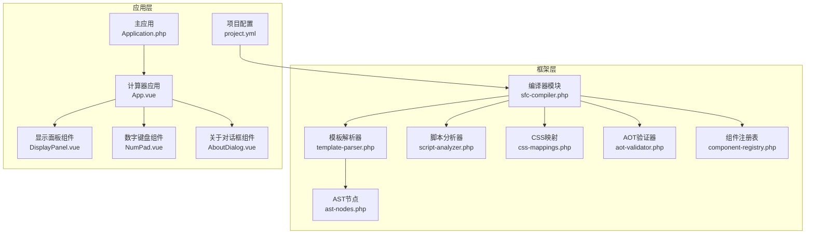
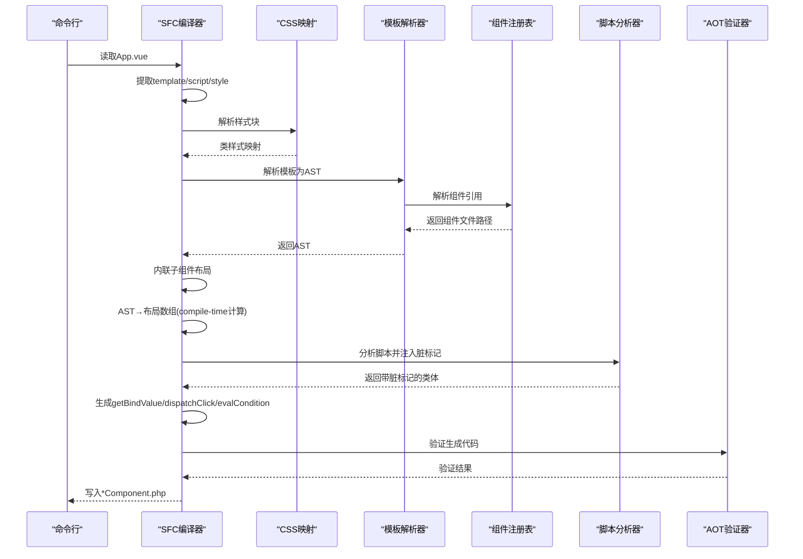
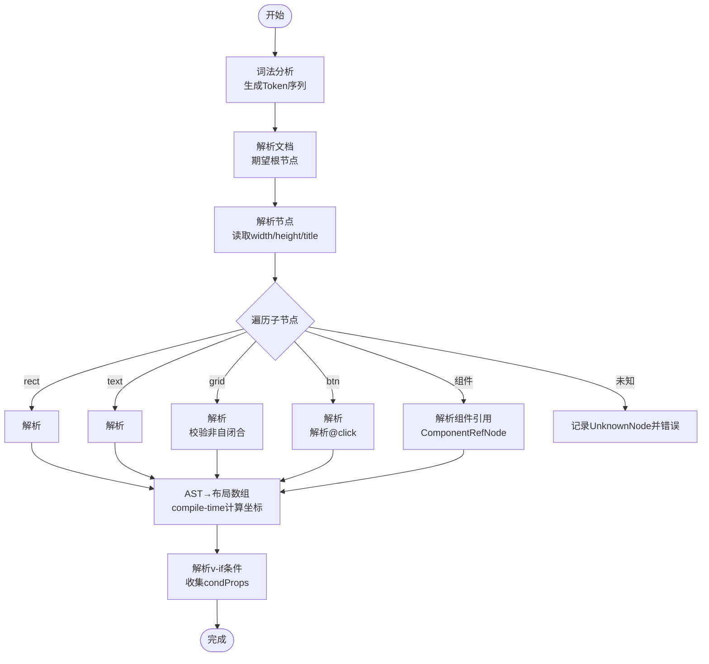
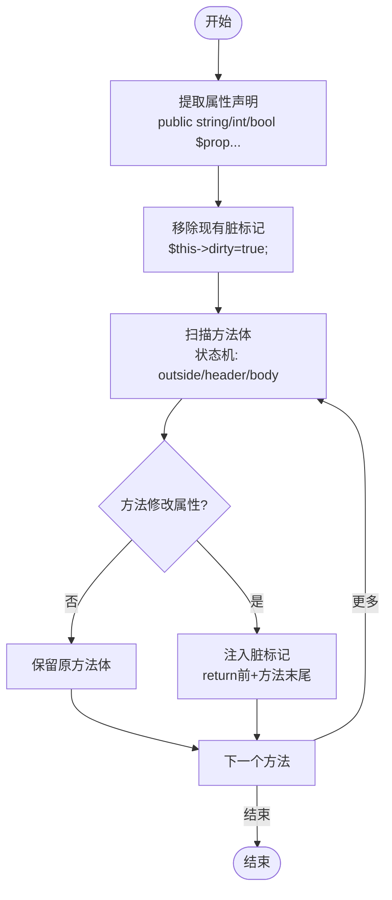
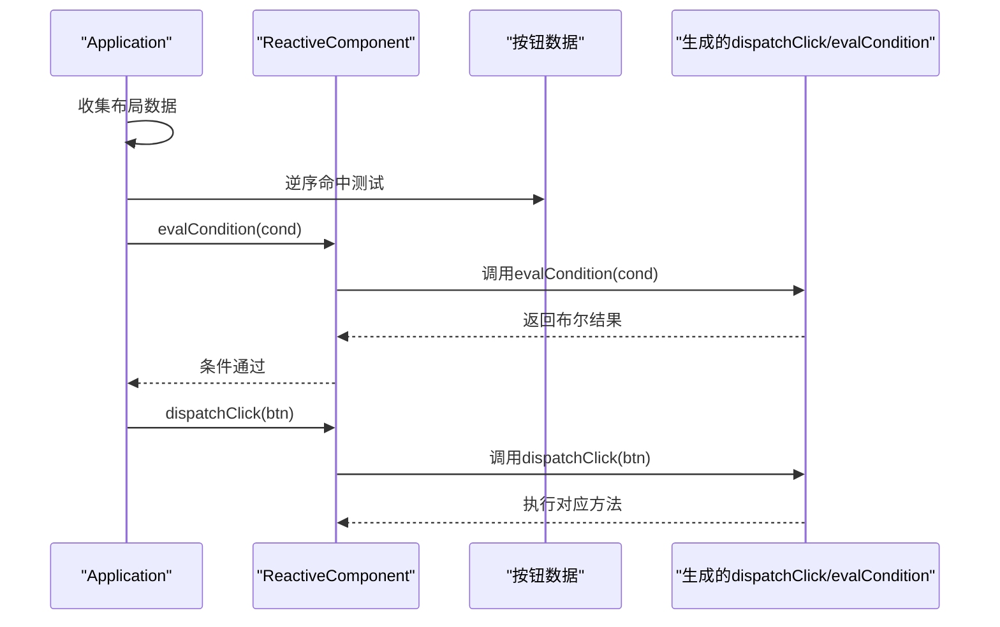
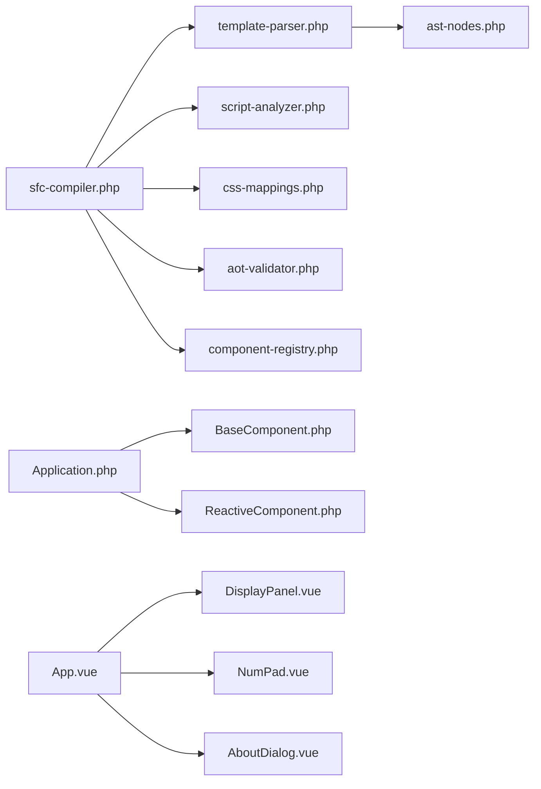

# 代码生成系统

<cite>
**本文档引用的文件**
- [framework/sfc-compiler.php](file://framework/sfc-compiler.php)
- [framework/compiler/script-analyzer.php](file://framework/compiler/script-analyzer.php)
- [framework/compiler/template-parser.php](file://framework/compiler/template-parser.php)
- [framework/compiler/ast-nodes.php](file://framework/compiler/ast-nodes.php)
- [framework/compiler/css-mappings.php](file://framework/compiler/css-mappings.php)
- [framework/compiler/aot-validator.php](file://framework/compiler/aot-validator.php)
- [framework/compiler/component-registry.php](file://framework/compiler/component-registry.php)
- [framework/BaseComponent.php](file://framework/BaseComponent.php)
- [framework/ReactiveComponent.php](file://framework/ReactiveComponent.php)
- [apps/calculator/App.vue](file://apps/calculator/App.vue)
- [apps/calculator/Application.php](file://apps/calculator/Application.php)
- [apps/calculator/components/DisplayPanel.vue](file://apps/calculator/components/DisplayPanel.vue)
- [apps/calculator/components/NumPad.vue](file://apps/calculator/components/NumPad.vue)
- [apps/calculator/components/AboutDialog.vue](file://apps/calculator/components/AboutDialog.vue)
- [apps/calculator/project.yml](file://apps/calculator/project.yml)
- [tests/sfc-compiler-test.php](file://tests/sfc-compiler-test.php)
</cite>

## 目录
1. [简介](#简介)
2. [项目结构](#项目结构)
3. [核心组件](#核心组件)
4. [架构总览](#架构总览)
5. [详细组件分析](#详细组件分析)
6. [依赖关系分析](#依赖关系分析)
7. [性能考虑](#性能考虑)
8. [故障排除指南](#故障排除指南)
9. [结论](#结论)
10. [附录](#附录)

## 简介
本代码生成系统将 Vue 风格的单文件组件（SFC）从模板（template）、脚本（script）和样式（style）块中提取并转换为可在 AOT（Ahead-of-Time）编译环境中运行的 PHP 组件类。系统通过递归下降解析器将模板解析为抽象语法树（AST），随后将 AST 降低为布局数组（layout arrays），并生成响应式组件类，自动注入脏标记、事件分发和条件属性求值逻辑。同时，系统内置 AOT 兼容性验证器，确保生成的代码满足 Swoole AOT 编译器的要求。

## 项目结构
该仓库采用按功能模块划分的组织方式：
- framework：编译器核心模块（解析器、分析器、映射表、验证器等）
- apps：示例应用与组件，展示如何使用生成的组件
- tests：单元测试与集成测试
- docs：技术文档与规划

**图表来源**
- [framework/sfc-compiler.php:1-819](file://framework/sfc-compiler.php#L1-L819)
- [framework/compiler/template-parser.php:1-869](file://framework/compiler/template-parser.php#L1-L869)
- [framework/compiler/script-analyzer.php:1-281](file://framework/compiler/script-analyzer.php#L1-L281)
- [framework/compiler/css-mappings.php:1-210](file://framework/compiler/css-mappings.php#L1-L210)
- [framework/compiler/aot-validator.php:1-207](file://framework/compiler/aot-validator.php#L1-L207)
- [framework/compiler/component-registry.php:1-70](file://framework/compiler/component-registry.php#L1-L70)
- [framework/compiler/ast-nodes.php:1-211](file://framework/compiler/ast-nodes.php#L1-L211)
- [apps/calculator/Application.php:1-322](file://apps/calculator/Application.php#L1-L322)
- [apps/calculator/App.vue:1-203](file://apps/calculator/App.vue#L1-L203)
- [apps/calculator/components/DisplayPanel.vue:1-12](file://apps/calculator/components/DisplayPanel.vue#L1-L12)
- [apps/calculator/components/NumPad.vue:1-37](file://apps/calculator/components/NumPad.vue#L1-L37)
- [apps/calculator/components/AboutDialog.vue:1-37](file://apps/calculator/components/AboutDialog.vue#L1-L37)
- [apps/calculator/project.yml:1-34](file://apps/calculator/project.yml#L1-L34)

**章节来源**
- [framework/sfc-compiler.php:1-819](file://framework/sfc-compiler.php#L1-L819)
- [apps/calculator/App.vue:1-203](file://apps/calculator/App.vue#L1-L203)

## 核心组件
- 模板解析器：将模板字符串解析为 AST，支持未知标签记录错误、组件引用解析、v-if 条件解析等。
- 脚本分析器：自动检测并注入脏标记，减少手动维护成本。
- CSS 映射：将 CSS 属性映射为渲染所需的 GDI 参数。
- AOT 验证器：在写入文件前进行 AOT 兼容性检查。
- 组件注册表：基于项目配置将自定义标签映射到 .vue 文件。
- 组件基类与响应式基类：提供组件树管理、生命周期钩子、脏标记与条件求值接口。

**章节来源**
- [framework/compiler/template-parser.php:1-869](file://framework/compiler/template-parser.php#L1-L869)
- [framework/compiler/script-analyzer.php:1-281](file://framework/compiler/script-analyzer.php#L1-L281)
- [framework/compiler/css-mappings.php:1-210](file://framework/compiler/css-mappings.php#L1-L210)
- [framework/compiler/aot-validator.php:1-207](file://framework/compiler/aot-validator.php#L1-L207)
- [framework/compiler/component-registry.php:1-70](file://framework/compiler/component-registry.php#L1-L70)
- [framework/BaseComponent.php:1-177](file://framework/BaseComponent.php#L1-L177)
- [framework/ReactiveComponent.php:1-90](file://framework/ReactiveComponent.php#L1-L90)

## 架构总览
系统工作流分为以下阶段：
1. 提取 .vue 文件中的 template、script、style 块
2. 解析样式为类样式映射
3. 递归下降解析模板为 AST
4. 解析组件引用，内联子组件布局
5. AST 降低为布局数组（compile-time 计算坐标、收集绑定键、处理器映射、条件属性）
6. 生成响应式组件类（自动注入脏标记、事件分发、条件求值）
7. AOT 验证通过后写入文件

**图表来源**
- [framework/sfc-compiler.php:260-601](file://framework/sfc-compiler.php#L260-L601)
- [framework/compiler/template-parser.php:88-105](file://framework/compiler/template-parser.php#L88-L105)
- [framework/compiler/css-mappings.php:164-194](file://framework/compiler/css-mappings.php#L164-L194)
- [framework/compiler/script-analyzer.php:27-43](file://framework/compiler/script-analyzer.php#L27-L43)
- [framework/compiler/aot-validator.php:37-121](file://framework/compiler/aot-validator.php#L37-L121)

## 详细组件分析

### 模板解析器（TemplateParser）
- 词法分析：识别标签、注释、文本等，保持行号信息
- 递归下降解析：解析 app/rect/text/grid/btn 等节点，支持未知标签与组件引用
- AST 降低：将 AST 转换为布局数组，进行 compile-time 坐标计算、收集绑定键、处理器映射与条件属性
- v-if 条件解析：支持 truthy/falsy/比较三种形式

**图表来源**
- [framework/compiler/template-parser.php:131-208](file://framework/compiler/template-parser.php#L131-L208)
- [framework/compiler/template-parser.php:214-488](file://framework/compiler/template-parser.php#L214-L488)
- [framework/compiler/template-parser.php:557-686](file://framework/compiler/template-parser.php#L557-L686)
- [framework/compiler/template-parser.php:765-781](file://framework/compiler/template-parser.php#L765-L781)

**章节来源**
- [framework/compiler/template-parser.php:1-869](file://framework/compiler/template-parser.php#L1-L869)
- [framework/compiler/ast-nodes.php:1-211](file://framework/compiler/ast-nodes.php#L1-L211)

### 脚本分析器（ScriptAnalyzer）
- 自动注入脏标记：扫描方法体，检测对响应式属性的赋值，自动在每个 return 与方法末尾注入脏标记
- 属性提取：从脚本中提取公开属性声明，作为脏标记注入的目标
- 方法边界识别：基于大括号计数与 header/body 状态机，准确分割方法体

**图表来源**
- [framework/compiler/script-analyzer.php:27-43](file://framework/compiler/script-analyzer.php#L27-L43)
- [framework/compiler/script-analyzer.php:87-201](file://framework/compiler/script-analyzer.php#L87-L201)
- [framework/compiler/script-analyzer.php:210-243](file://framework/compiler/script-analyzer.php#L210-L243)

**章节来源**
- [framework/compiler/script-analyzer.php:1-281](file://framework/compiler/script-analyzer.php#L1-L281)

### CSS 映射（CssMappings）
- 支持背景色、前景色、字号、字体粗细、边框半径、内边距、外边距、文本对齐等属性
- 提供颜色解析、边框色派生、像素值解析、字体粗细解析与文本对齐解析
- 解析样式块为类样式映射，供布局数组生成使用

**章节来源**
- [framework/compiler/css-mappings.php:1-210](file://framework/compiler/css-mappings.php#L1-L210)

### AOT 验证器（AotValidator）
- 文件名约束：限制文件名中点的数量，避免无效 C++ 符号
- 结构约束：禁止全局常量数组嵌套结构；禁止变量属性访问与变量方法调用
- 函数兼容性：警告 PHP8 新函数使用；禁止变量函数调用
- 嵌套深度：限制组件嵌套不超过一层

**章节来源**
- [framework/compiler/aot-validator.php:1-207](file://framework/compiler/aot-validator.php#L1-L207)

### 组件注册表（ComponentRegistry）
- 从项目配置加载组件映射，将自定义标签解析为绝对路径
- 提供解析与查询接口，支持未知标签回退为 UnknownNode

**章节来源**
- [framework/compiler/component-registry.php:1-70](file://framework/compiler/component-registry.php#L1-L70)
- [apps/calculator/project.yml:29-34](file://apps/calculator/project.yml#L29-L34)

### 组件基类与响应式基类
- BaseComponent：提供组件树结构、父子关系、子组件管理与初始组件树收集
- ReactiveComponent：继承 BaseComponent，提供脏标记、组级脏标记与条件求值接口

**章节来源**
- [framework/BaseComponent.php:1-177](file://framework/BaseComponent.php#L1-L177)
- [framework/ReactiveComponent.php:1-90](file://framework/ReactiveComponent.php#L1-L90)

### 事件分发与条件逻辑生成
- 事件分发：根据按钮的 handler 与 arg，生成 dispatchClick 分发逻辑
- 条件判断：根据 v-if 条件生成 evalCondition 求值逻辑，支持 truthy/falsy/比较
- 绑定值获取：根据绑定键生成 getBindValue 分发逻辑

**图表来源**
- [apps/calculator/Application.php:269-321](file://apps/calculator/Application.php#L269-L321)
- [framework/sfc-compiler.php:383-439](file://framework/sfc-compiler.php#L383-L439)

**章节来源**
- [apps/calculator/Application.php:1-322](file://apps/calculator/Application.php#L1-L322)
- [framework/sfc-compiler.php:360-581](file://framework/sfc-compiler.php#L360-L581)

### 示例应用与组件
- 主应用 App.vue：定义响应式属性与方法，包含多个子组件与按钮点击处理
- 子组件：显示面板、数字键盘、关于对话框，演示组件内联与覆盖层渲染
- 项目配置：声明组件注册表与源码路径

**章节来源**
- [apps/calculator/App.vue:1-203](file://apps/calculator/App.vue#L1-L203)
- [apps/calculator/components/DisplayPanel.vue:1-12](file://apps/calculator/components/DisplayPanel.vue#L1-L12)
- [apps/calculator/components/NumPad.vue:1-37](file://apps/calculator/components/NumPad.vue#L1-L37)
- [apps/calculator/components/AboutDialog.vue:1-37](file://apps/calculator/components/AboutDialog.vue#L1-L37)
- [apps/calculator/project.yml:1-34](file://apps/calculator/project.yml#L1-L34)

## 依赖关系分析
编译器模块之间的依赖关系如下：

**图表来源**
- [framework/sfc-compiler.php:27-35](file://framework/sfc-compiler.php#L27-L35)
- [framework/compiler/template-parser.php:16-17](file://framework/compiler/template-parser.php#L16-L17)
- [framework/compiler/script-analyzer.php:1-13](file://framework/compiler/script-analyzer.php#L1-L13)
- [framework/compiler/css-mappings.php:1-13](file://framework/compiler/css-mappings.php#L1-L13)
- [framework/compiler/aot-validator.php:1-16](file://framework/compiler/aot-validator.php#L1-L16)
- [framework/compiler/component-registry.php:1-12](file://framework/compiler/component-registry.php#L1-L12)
- [framework/compiler/ast-nodes.php:1-7](file://framework/compiler/ast-nodes.php#L1-L7)
- [apps/calculator/Application.php:1-14](file://apps/calculator/Application.php#L1-L14)
- [framework/BaseComponent.php:1-15](file://framework/BaseComponent.php#L1-L15)
- [framework/ReactiveComponent.php:1-13](file://framework/ReactiveComponent.php#L1-L13)

**章节来源**
- [framework/sfc-compiler.php:1-819](file://framework/sfc-compiler.php#L1-L819)
- [apps/calculator/Application.php:1-322](file://apps/calculator/Application.php#L1-L322)

## 性能考虑
- 编译时计算：布局数组在编译期完成坐标与尺寸计算，运行时只需应用偏移，降低运行时开销
- AOT 兼容：严格遵循 AOT 约束，避免运行时类型推断失败与符号生成问题
- 事件分发：生成的 dispatchClick 采用显式分支，避免变量函数调用导致的类型推断问题
- 条件求值：evalCondition 以属性名映射到具体属性，避免复杂表达式解析

[本节为通用指导，无需特定文件引用]

## 故障排除指南
- 模板解析错误：检查未知标签、缺少 class、grid 中的 btn 位置等，查看解析器错误输出
- AOT 验证失败：修正文件名中多余点号、移除变量属性/方法访问、替换 PHP8 函数、避免变量函数调用
- 组件注册失败：确认 project.yml 中组件映射路径正确且文件存在
- 事件未触发：检查按钮的 @click 语法与 handler 名称是否与生成的 dispatchClick 匹配

**章节来源**
- [framework/compiler/template-parser.php:783-786](file://framework/compiler/template-parser.php#L783-L786)
- [framework/compiler/aot-validator.php:37-121](file://framework/compiler/aot-validator.php#L37-L121)
- [tests/sfc-compiler-test.php:159-231](file://tests/sfc-compiler-test.php#L159-L231)

## 结论
该代码生成系统通过清晰的模块化设计，实现了从 Vue 风格模板到 AOT 友好 PHP 组件的完整转换链路。模板解析器负责结构化解析，脚本分析器自动化脏标记注入，CSS 映射提供渲染参数，AOT 验证器保障兼容性。最终生成的组件具备完善的事件分发与条件求值能力，配合应用层的事件循环与渲染器，形成高效稳定的桌面应用渲染管线。

[本节为总结，无需特定文件引用]

## 附录

### 代码生成质量控制机制
- 代码格式化：通过统一的类体拼装与缩进控制，保证生成代码的一致性
- 注释生成：在生成的类头添加版本与来源注释，便于追踪
- 版本兼容性检查：AOT 验证器覆盖文件命名、结构、函数与调用模式等多方面约束

**章节来源**
- [framework/sfc-compiler.php:513-581](file://framework/sfc-compiler.php#L513-L581)
- [framework/compiler/aot-validator.php:1-207](file://framework/compiler/aot-validator.php#L1-L207)

### 扩展点与自定义规则
- CSS 属性扩展：在 CssMappings::PROPERTY_MAP 中新增条目即可支持新的 CSS 属性
- 组件生态：通过 ComponentRegistry 与 project.yml 扩展自定义组件标签到 .vue 文件的映射
- 事件与条件：通过模板中的 @click 与 v-if 语义，结合生成器自动扩展 dispatchClick 与 evalCondition
- 嵌套组件：当前版本限制嵌套深度为一层，后续版本可进一步扩展

**章节来源**
- [framework/compiler/css-mappings.php:27-69](file://framework/compiler/css-mappings.php#L27-L69)
- [framework/compiler/component-registry.php:26-41](file://framework/compiler/component-registry.php#L26-L41)
- [framework/compiler/aot-validator.php:151-160](file://framework/compiler/aot-validator.php#L151-L160)