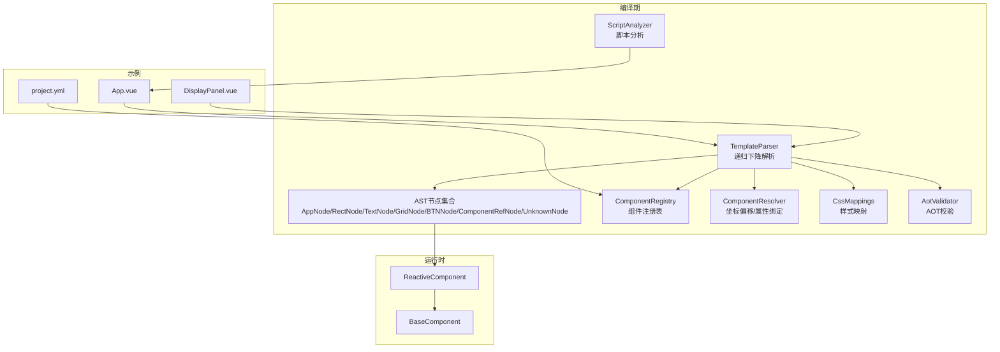
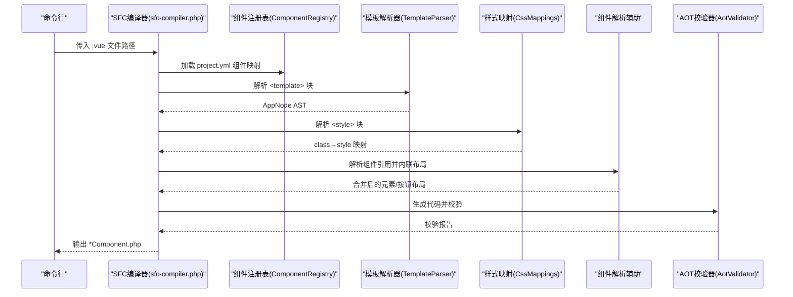
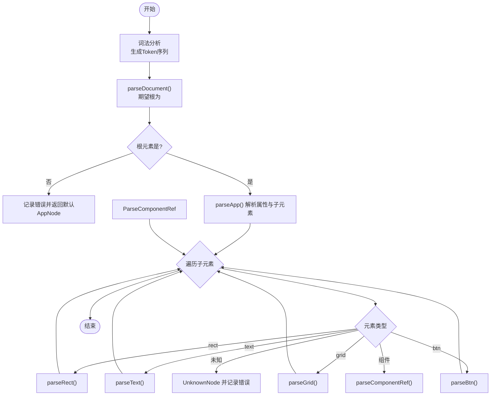
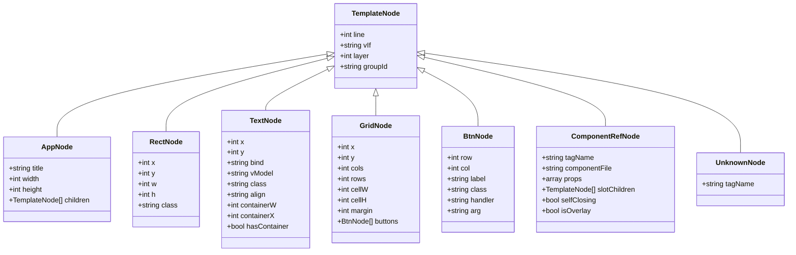
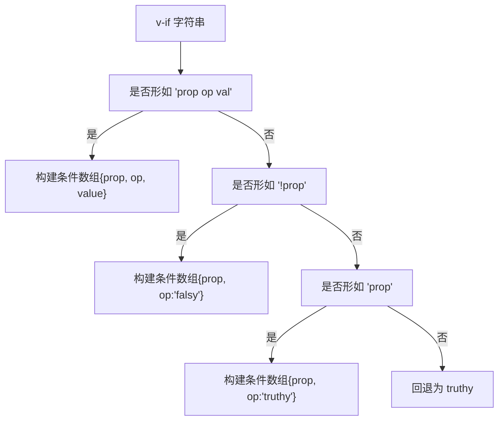
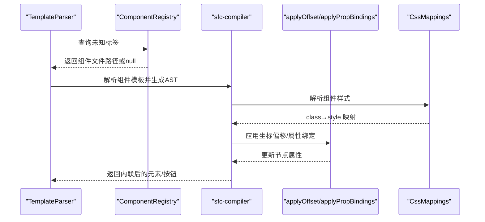
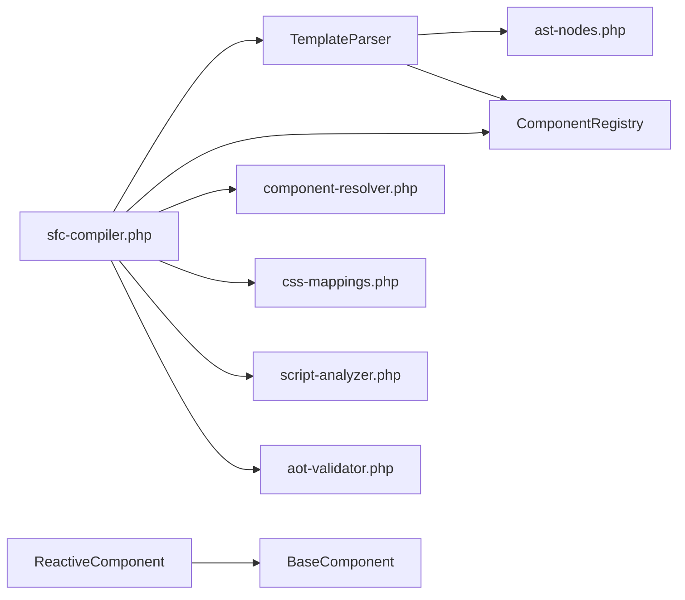

# 模板解析器

<cite>
**本文引用的文件**
- [template-parser.php](file://framework/compiler/template-parser.php)
- [ast-nodes.php](file://framework/compiler/ast-nodes.php)
- [sfc-compiler.php](file://framework/sfc-compiler.php)
- [css-mappings.php](file://framework/compiler/css-mappings.php)
- [component-registry.php](file://framework/compiler/component-registry.php)
- [component-resolver.php](file://framework/compiler/component-resolver.php)
- [script-analyzer.php](file://framework/compiler/script-analyzer.php)
- [aot-validator.php](file://framework/compiler/aot-validator.php)
- [BaseComponent.php](file://framework/BaseComponent.php)
- [ReactiveComponent.php](file://framework/ReactiveComponent.php)
- [App.vue](file://apps/calculator/App.vue)
- [DisplayPanel.vue](file://apps/calculator/components/DisplayPanel.vue)
- [project.yml](file://apps/calculator/project.yml)
</cite>

## 目录
1. [简介](#简介)
2. [项目结构](#项目结构)
3. [核心组件](#核心组件)
4. [架构总览](#架构总览)
5. [详细组件分析](#详细组件分析)
6. [依赖分析](#依赖分析)
7. [性能考量](#性能考量)
8. [故障排查指南](#故障排查指南)
9. [结论](#结论)
10. [附录](#附录)

## 简介
本文件面向Vue.js风格单文件组件（SFC）的模板解析器，系统性阐述基于递归下降解析算法的实现原理，覆盖词法分析、语法分析、AST节点模型、指令解析（如v-if、v-model、v-for、@click）、组件标签解析与嵌套处理、以及从AST到布局数组的“降级”（lowering/code generation prep）阶段。文档同时提供调试技巧（AST可视化、错误诊断）、扩展点与自定义指令支持指南，帮助开发者在保持AOT兼容性的前提下进行模板扩展与优化。

## 项目结构
该解析器位于框架的编译器子系统中，围绕以下模块协同工作：
- 词法分析与语法分析：TemplateParser（递归下降）
- AST节点模型：各类TemplateNode派生类
- 组件注册与解析：ComponentRegistry + 组件解析辅助
- 样式映射：CssMappings（CSS类到渲染属性）
- 脚本分析与自动脏标记注入：ScriptAnalyzer
- AOT验证：AotValidator
- 运行时组件基类：BaseComponent、ReactiveComponent
- 示例应用与组件：App.vue、DisplayPanel.vue、project.yml

图表来源
- [template-parser.php:61-105](file://framework/compiler/template-parser.php#L61-L105)
- [ast-nodes.php:9-27](file://framework/compiler/ast-nodes.php#L9-L27)
- [component-registry.php:14-70](file://framework/compiler/component-registry.php#L14-L70)
- [component-resolver.php:13-61](file://framework/compiler/component-resolver.php#L13-L61)
- [css-mappings.php:15-210](file://framework/compiler/css-mappings.php#L15-L210)
- [script-analyzer.php:15-281](file://framework/compiler/script-analyzer.php#L15-L281)
- [aot-validator.php:18-207](file://framework/compiler/aot-validator.php#L18-L207)
- [BaseComponent.php:16-177](file://framework/BaseComponent.php#L16-L177)
- [ReactiveComponent.php:14-90](file://framework/ReactiveComponent.php#L14-L90)
- [App.vue:1-203](file://apps/calculator/App.vue#L1-L203)
- [DisplayPanel.vue:1-12](file://apps/calculator/components/DisplayPanel.vue#L1-L12)
- [project.yml:31-34](file://apps/calculator/project.yml#L31-L34)

章节来源
- [template-parser.php:61-105](file://framework/compiler/template-parser.php#L61-L105)
- [ast-nodes.php:9-211](file://framework/compiler/ast-nodes.php#L9-L211)
- [sfc-compiler.php:27-36](file://framework/sfc-compiler.php#L27-L36)

## 核心组件
- 词法分析器（Tokenize）：将模板字符串切分为标记流，跟踪行号，识别注释、标签（开/闭/自闭合）与文本。
- 语法分析器（Recursive Descent）：以递归下降方式解析文档、根元素、子元素、组件引用、指令等。
- AST节点模型：统一抽象节点基类与具体节点类型，承载位置信息与指令语义。
- 降级/代码生成准备：将AST转换为布局数组，收集绑定键、处理器映射、条件属性，便于运行时快速渲染与事件分发。
- 组件注册与解析：通过project.yml将自定义标签映射到.vue源文件，编译期内联子组件布局。
- 样式映射：将CSS类属性映射为渲染所需的GDI参数。
- 脚本分析：自动注入脏标记，减少手写样板代码。
- AOT校验：保证生成的PHP代码满足AOT编译约束。

章节来源
- [template-parser.php:131-208](file://framework/compiler/template-parser.php#L131-L208)
- [template-parser.php:214-543](file://framework/compiler/template-parser.php#L214-L543)
- [ast-nodes.php:9-211](file://framework/compiler/ast-nodes.php#L9-L211)
- [sfc-compiler.php:308-351](file://framework/sfc-compiler.php#L308-L351)
- [css-mappings.php:164-194](file://framework/compiler/css-mappings.php#L164-L194)
- [script-analyzer.php:27-43](file://framework/compiler/script-analyzer.php#L27-L43)
- [aot-validator.php:37-121](file://framework/compiler/aot-validator.php#L37-L121)

## 架构总览
模板解析器采用“块提取→样式解析→模板解析→组件解析→降级→AOT校验→代码生成”的流水线式架构。TemplateParser负责词法与语法分析；ComponentRegistry与sfc-compiler的resolveComponentRefsV6负责组件解析与内联；CssMappings负责样式映射；ScriptAnalyzer负责脚本分析；AotValidator保证生成代码AOT兼容。

图表来源
- [sfc-compiler.php:262-601](file://framework/sfc-compiler.php#L262-L601)
- [template-parser.php:88-105](file://framework/compiler/template-parser.php#L88-L105)
- [css-mappings.php:164-194](file://framework/compiler/css-mappings.php#L164-L194)
- [aot-validator.php:37-121](file://framework/compiler/aot-validator.php#L37-L121)

## 详细组件分析

### 递归下降解析器（TemplateParser）
- 词法分析：逐字符扫描，识别注释、标签与文本，维护行号，输出Token序列。
- 语法分析：以parseDocument为入口，期望根元素为<app>，随后解析其子元素；对未知标签生成UnknownNode但不中断解析。
- 元素解析：支持rect、text、grid、btn；grid内部仅允许btn；btn的@click支持带参形式。
- 组件解析：通过ComponentRegistry判断自定义标签，解析组件引用（支持自闭合与带插槽内容），并记录v-if、overlay等语义。
- 指令解析：v-if条件字符串解析为结构化条件数组；v-model与:bind互斥且v-model隐含:bind；v-for未在当前版本实现。
- 降级：lowerToLayout将AST转为布局数组，收集bindKeys、handlerMap、condProps，用于生成运行时方法。

图表来源
- [template-parser.php:214-288](file://framework/compiler/template-parser.php#L214-L288)
- [template-parser.php:293-543](file://framework/compiler/template-parser.php#L293-L543)

章节来源
- [template-parser.php:131-208](file://framework/compiler/template-parser.php#L131-L208)
- [template-parser.php:214-543](file://framework/compiler/template-parser.php#L214-L543)
- [template-parser.php:557-686](file://framework/compiler/template-parser.php#L557-L686)

### AST节点模型与层次结构
- 抽象基类：TemplateNode，携带line、vIf、layer、groupId等通用属性。
- 具体节点：
  - AppNode：根节点，包含title、width、height与children。
  - RectNode：矩形元素，包含x/y/w/h/class及vIf。
  - TextNode：文本元素，包含x/y/bind/vModel/class/align/containerW/containerX及vIf。
  - GridNode：网格容器，包含x/y/cols/rows/cellW/cellH/margin与buttons。
  - BtnNode：按钮，包含row/col/label/class/handler/arg及vIf。
  - ComponentRefNode：组件引用，包含tagName/componentFile/props/slotChildren/selfClosing/isOverlay及vIf。
  - UnknownNode：未知标签占位，记录tagName与line。
- 层次关系：AppNode包含多种子节点；GridNode包含BtnNode；ComponentRefNode可包含子节点作为插槽内容。

图表来源
- [ast-nodes.php:9-211](file://framework/compiler/ast-nodes.php#L9-L211)

章节来源
- [ast-nodes.php:9-211](file://framework/compiler/ast-nodes.php#L9-L211)

### 指令解析与代码生成策略
- v-if：支持三种形式：prop名（truthy）、!prop名（falsy）、prop名比较（==或!=）。解析为结构化条件数组，用于生成evalCondition方法。
- v-model与:bind：二者互斥，v-model隐含:bind；未设置时记录错误；收集bindKeys用于生成getBindValue方法。
- @click：支持无参与带参形式（handler('arg')），生成dispatchClick方法的分支逻辑。
- v-for：当前版本未实现，保留扩展空间。
- 代码生成：根据bindKeys生成getBindValue分支；根据handlerMap生成dispatchClick分支；根据condProps生成evalCondition分支。

图表来源
- [template-parser.php:765-781](file://framework/compiler/template-parser.php#L765-L781)

章节来源
- [template-parser.php:345-356](file://framework/compiler/template-parser.php#L345-L356)
- [template-parser.php:367-393](file://framework/compiler/template-parser.php#L367-L393)
- [template-parser.php:467-487](file://framework/compiler/template-parser.php#L467-L487)
- [template-parser.php:765-781](file://framework/compiler/template-parser.php#L765-L781)
- [sfc-compiler.php:370-439](file://framework/sfc-compiler.php#L370-L439)

### 组件标签解析与嵌套处理
- 组件注册：通过project.yml加载组件映射，ComponentRegistry将自定义标签映射到绝对路径。
- 组件解析：TemplateParser在遇到未知标签时查询注册表，若命中则解析为ComponentRefNode；支持自闭合与带插槽内容两种形式。
- 内联与传播：sfc-compiler的resolveComponentRefsV6递归解析子组件模板，应用坐标偏移applyOffset、属性绑定applyPropBindings、v-if条件传播至子元素，必要时提升为overlay层。
- 限制：v6仅支持1级嵌套，超过限制会给出警告；overlay组件按顺序分配更高layer层级。

图表来源
- [template-parser.php:320-331](file://framework/compiler/template-parser.php#L320-L331)
- [template-parser.php:493-543](file://framework/compiler/template-parser.php#L493-L543)
- [sfc-compiler.php:95-192](file://framework/sfc-compiler.php#L95-L192)
- [component-resolver.php:13-61](file://framework/compiler/component-resolver.php#L13-L61)
- [css-mappings.php:164-194](file://framework/compiler/css-mappings.php#L164-L194)

章节来源
- [component-registry.php:26-52](file://framework/compiler/component-registry.php#L26-L52)
- [sfc-compiler.php:95-192](file://framework/sfc-compiler.php#L95-L192)
- [component-resolver.php:13-61](file://framework/compiler/component-resolver.php#L13-L61)

### 样式映射与布局降级
- 样式映射：CssMappings将CSS属性映射为渲染参数（颜色、字号、粗细、对齐等），并提供默认值与警告。
- 布局降级：TemplateParser的lowerToLayout将AST转为elements/buttons数组，收集bindKeys、handlerMap、condProps，用于生成运行时方法体。

章节来源
- [css-mappings.php:164-194](file://framework/compiler/css-mappings.php#L164-L194)
- [template-parser.php:557-686](file://framework/compiler/template-parser.php#L557-L686)

### 示例：App.vue与DisplayPanel.vue
- App.vue：根元素<app>，包含rect背景、两个子组件display-panel与num-pad、一个grid按钮、一个overlay组件about-dialog；使用v-if控制显示。
- DisplayPanel.vue：子组件，包含rect背景与text绑定值，展示在右侧。

章节来源
- [App.vue:1-203](file://apps/calculator/App.vue#L1-L203)
- [DisplayPanel.vue:1-12](file://apps/calculator/components/DisplayPanel.vue#L1-L12)
- [project.yml:31-34](file://apps/calculator/project.yml#L31-L34)

## 依赖分析
- TemplateParser依赖：
  - ast-nodes.php：AST节点类型
  - component-registry.php：组件注册表
  - css-mappings.php：样式映射（间接通过sfc-compiler）
- sfc-compiler依赖：
  - template-parser.php：模板解析
  - component-registry.php：组件注册
  - component-resolver.php：坐标偏移与属性绑定
  - css-mappings.php：样式解析
  - script-analyzer.php：脚本分析
  - aot-validator.php：AOT校验
- 运行时依赖：
  - BaseComponent、ReactiveComponent：组件树与响应式基类

图表来源
- [template-parser.php:16-17](file://framework/compiler/template-parser.php#L16-L17)
- [sfc-compiler.php:27-35](file://framework/sfc-compiler.php#L27-L35)
- [ReactiveComponent.php:14-90](file://framework/ReactiveComponent.php#L14-L90)
- [BaseComponent.php:16-177](file://framework/BaseComponent.php#L16-L177)

章节来源
- [template-parser.php:16-17](file://framework/compiler/template-parser.php#L16-L17)
- [sfc-compiler.php:27-35](file://framework/sfc-compiler.php#L27-L35)

## 性能考量
- 词法分析：线性扫描，时间复杂度O(n)，空间复杂度O(n)。
- 语法分析：递归下降，每个节点最多被访问一次，整体O(n)。
- 降级阶段：遍历AST生成布局数组，O(n)。
- 组件解析：对每个子组件递归解析模板，注意避免深层嵌套导致的重复解析成本。
- 建议：
  - 控制组件嵌套层级，遵循v6仅1级嵌套的设计。
  - 合理使用v-if条件，避免过多条件分支影响evalCondition性能。
  - 在样式中复用类名，减少重复解析与映射。

## 故障排查指南
- AST可视化：TemplateParser提供dumpAst方法，将AST转为JSON输出，便于调试。
- 错误收集：TemplateParser在解析过程中累积TemplateParseError，可通过getErrors获取。
- 常见问题：
  - 未知标签：解析器会生成UnknownNode并记录错误，检查project.yml中的组件映射是否正确。
  - 未闭合标签/注释：词法分析阶段会报告未闭合错误。
  - v-model与:bind冲突：二者互斥，需二选一。
  - 组件未解析：确认组件文件存在且路径正确，检查project.yml配置。
  - AOT校验失败：检查生成代码是否包含变量属性访问、变量方法调用、PHP8函数等禁用模式。

章节来源
- [template-parser.php:118-121](file://framework/compiler/template-parser.php#L118-L121)
- [template-parser.php:110-113](file://framework/compiler/template-parser.php#L110-L113)
- [template-parser.php:160-173](file://framework/compiler/template-parser.php#L160-L173)
- [aot-validator.php:37-121](file://framework/compiler/aot-validator.php#L37-L121)

## 结论
该模板解析器以递归下降为核心，结合组件注册、样式映射与AOT校验，形成从SFC到运行时组件的完整链路。通过清晰的AST节点模型与指令解析策略，实现了对常见模板语法的良好支持，并为扩展（如v-for、更多指令）预留了接口。建议在实践中严格遵循组件嵌套限制与AOT约束，配合AST可视化与错误诊断工具，持续优化模板结构与性能。

## 附录

### 模板语法扩展点与自定义指令支持指南
- 新增指令：
  - 在TemplateParser中新增解析分支（如parseVFor），在对应节点上添加字段并更新lowerToLayout生成逻辑。
  - 若涉及运行时行为，需在ReactiveComponent的抽象方法中补充相应实现（如evalCondition）。
- 自定义组件：
  - 在project.yml中注册新组件标签到.vue文件路径。
  - 在TemplateParser中保持现有ComponentRefNode处理逻辑不变，即可自动内联子组件布局。
- 样式扩展：
  - 在CssMappings::PROPERTY_MAP中增加新的CSS属性映射项，提供解析器与默认值。
- AOT兼容性：
  - 避免变量属性/方法访问、变量函数调用与PHP8函数；遵循AotValidator规则。

章节来源
- [template-parser.php:293-333](file://framework/compiler/template-parser.php#L293-L333)
- [template-parser.php:557-686](file://framework/compiler/template-parser.php#L557-L686)
- [css-mappings.php:27-69](file://framework/compiler/css-mappings.php#L27-L69)
- [aot-validator.php:37-121](file://framework/compiler/aot-validator.php#L37-L121)