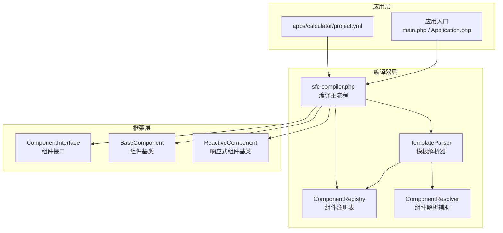
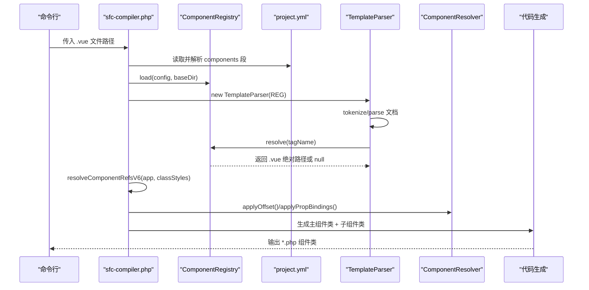
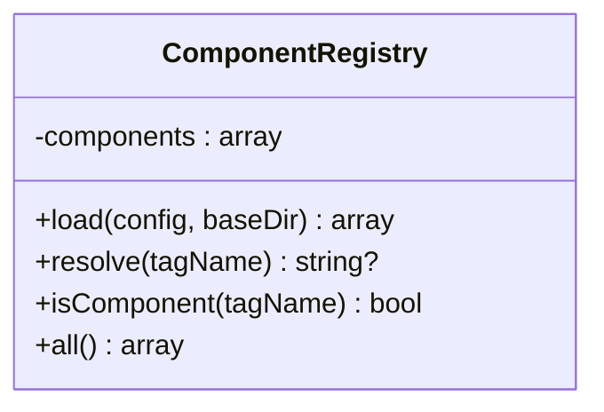
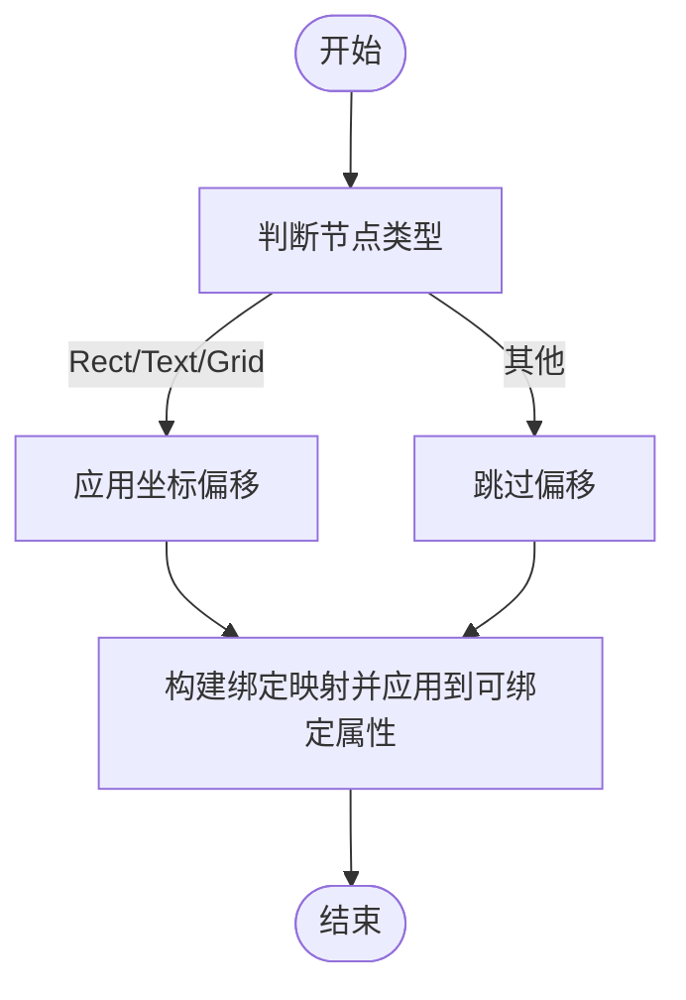
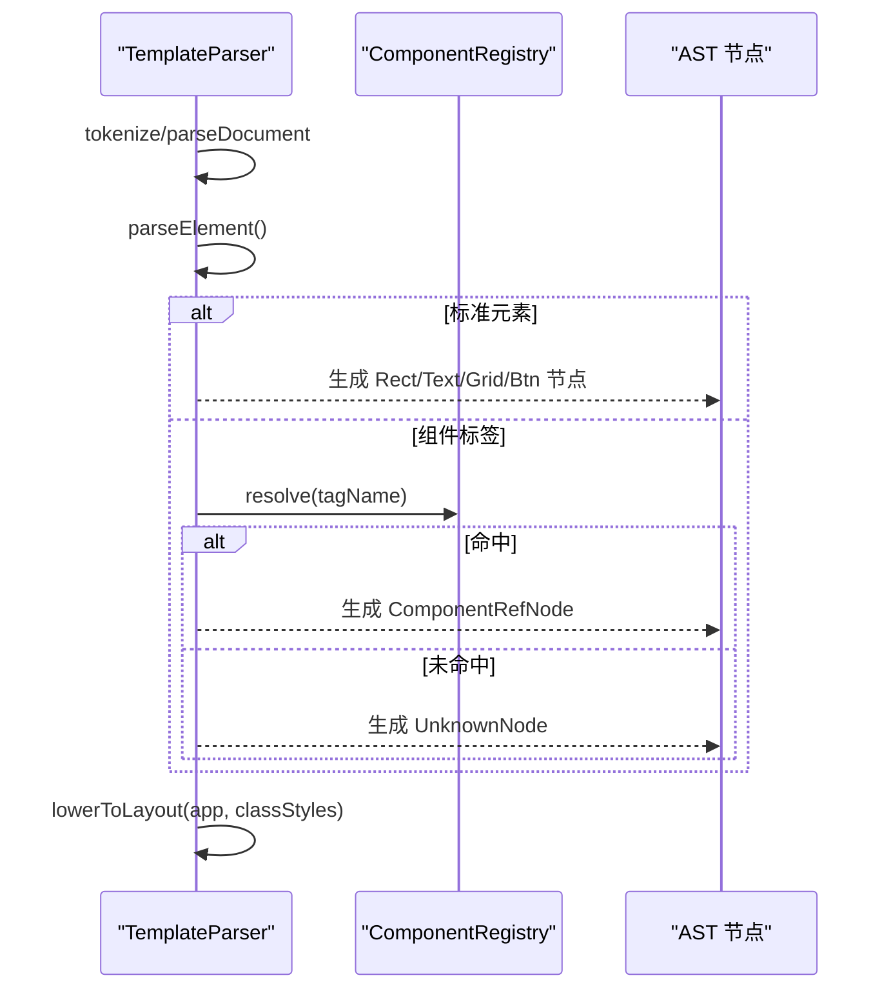
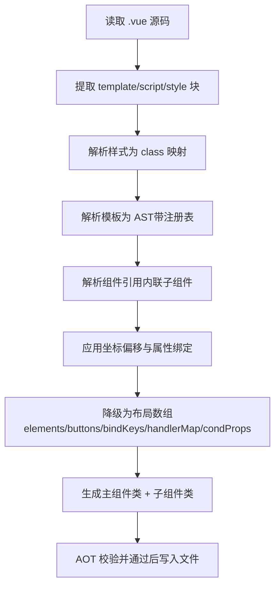
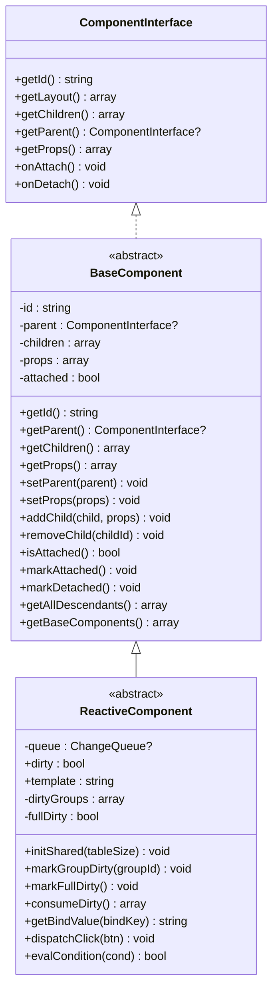
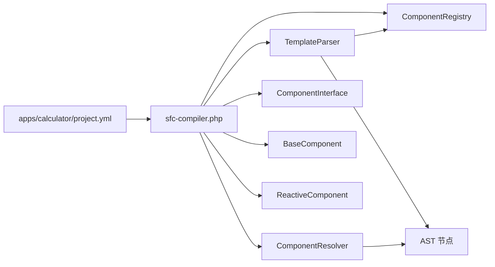

# 组件注册与解析

<cite>
**本文引用的文件**
- [framework/compiler/component-registry.php](file://framework/compiler/component-registry.php)
- [framework/compiler/component-resolver.php](file://framework/compiler/component-resolver.php)
- [framework/compiler/template-parser.php](file://framework/compiler/template-parser.php)
- [framework/sfc-compiler.php](file://framework/sfc-compiler.php)
- [framework/interfaces/ComponentInterface.php](file://framework/interfaces/ComponentInterface.php)
- [framework/BaseComponent.php](file://framework/BaseComponent.php)
- [framework/ReactiveComponent.php](file://framework/ReactiveComponent.php)
- [apps/calculator/project.yml](file://apps/calculator/project.yml)
- [apps/test/project.yml](file://apps/test/project.yml)
- [tests/sfc-compiler-test.php](file://tests/sfc-compiler-test.php)
</cite>

## 目录
1. [简介](#简介)
2. [项目结构](#项目结构)
3. [核心组件](#核心组件)
4. [架构总览](#架构总览)
5. [详细组件分析](#详细组件分析)
6. [依赖分析](#依赖分析)
7. [性能考虑](#性能考虑)
8. [故障排查指南](#故障排查指南)
9. [结论](#结论)
10. [附录](#附录)

## 简介
本文件系统性阐述组件注册与解析体系的设计与实现，覆盖以下主题：
- 组件注册表的管理机制：组件定义的加载、校验与存储策略
- 组件解析器的工作原理：组件引用的查找、依赖关系建立与循环依赖检测
- 组件配置文件（project.yml）的解析与处理：组件映射、路径解析与相对路径转换
- 组件继承与组合：父组件对子组件的控制与属性传递
- 扩展点：自定义组件类型的注册与组件工厂的实现思路
- 最佳实践与常见问题的解决方案

## 项目结构
该系统围绕“单文件组件（SFC）编译器”组织，核心位于 framework/compiler 目录，应用侧通过 project.yml 提供组件映射，编译器在运行期解析模板中的组件引用并生成目标组件类。

图表来源
- [framework/sfc-compiler.php:27-36](file://framework/sfc-compiler.php#L27-L36)
- [framework/compiler/component-registry.php:14-69](file://framework/compiler/component-registry.php#L14-L69)
- [framework/compiler/template-parser.php:61-76](file://framework/compiler/template-parser.php#L61-L76)
- [framework/interfaces/ComponentInterface.php:13-52](file://framework/interfaces/ComponentInterface.php#L13-L52)
- [framework/BaseComponent.php:16-177](file://framework/BaseComponent.php#L16-L177)
- [framework/ReactiveComponent.php:14-90](file://framework/ReactiveComponent.php#L14-L90)

章节来源
- [framework/sfc-compiler.php:27-36](file://framework/sfc-compiler.php#L27-L36)
- [apps/calculator/project.yml:29-34](file://apps/calculator/project.yml#L29-L34)

## 核心组件
- 组件注册表（ComponentRegistry）：负责从配置中加载组件映射，将自定义标签名解析为绝对 .vue 文件路径；提供查询与存在性判断。
- 组件解析器（ComponentResolver）：提供坐标偏移与属性绑定等解析辅助函数，用于在编译期将组件引用内联到布局数据。
- 模板解析器（TemplateParser）：递归下降解析模板，识别标准元素与组件引用节点；当存在注册表时，未知标签会尝试匹配组件映射。
- 编译主流程（sfc-compiler.php）：加载 project.yml 中的组件映射，解析模板 AST，解析组件引用，生成主组件与子组件类。
- 组件接口与基类：ComponentInterface 定义统一契约；BaseComponent 实现组件树结构与生命周期；ReactiveComponent 提供响应式状态与脏标记。

章节来源
- [framework/compiler/component-registry.php:14-69](file://framework/compiler/component-registry.php#L14-L69)
- [framework/compiler/component-resolver.php:13-61](file://framework/compiler/component-resolver.php#L13-L61)
- [framework/compiler/template-parser.php:61-76](file://framework/compiler/template-parser.php#L61-L76)
- [framework/sfc-compiler.php:38-89](file://framework/sfc-compiler.php#L38-L89)
- [framework/interfaces/ComponentInterface.php:13-52](file://framework/interfaces/ComponentInterface.php#L13-L52)
- [framework/BaseComponent.php:16-177](file://framework/BaseComponent.php#L16-L177)
- [framework/ReactiveComponent.php:14-90](file://framework/ReactiveComponent.php#L14-L90)

## 架构总览
下图展示从 project.yml 到模板解析、组件引用解析与最终代码生成的完整流程。

图表来源
- [framework/sfc-compiler.php:40-89](file://framework/sfc-compiler.php#L40-L89)
- [framework/compiler/component-registry.php:26-52](file://framework/compiler/component-registry.php#L26-L52)
- [framework/compiler/template-parser.php:320-333](file://framework/compiler/template-parser.php#L320-L333)
- [framework/compiler/component-resolver.php:13-61](file://framework/compiler/component-resolver.php#L13-L61)

## 详细组件分析

### 组件注册表（ComponentRegistry）
职责与行为
- 加载：从配置数组读取组件映射，基于应用目录进行相对路径转换与规范化，检查文件是否存在并记录告警。
- 查询：按标签名解析为 .vue 文件绝对路径；提供存在性判断与全量导出。
- 存储：内部以“标签名 → 绝对路径”的映射保存，便于模板解析阶段快速查找。

实现要点
- 路径处理：使用目录分隔符替换与 realpath 规范化，确保跨平台一致性与路径解析正确性。
- 健壮性：未找到文件时仅记录告警而不中断流程，便于后续编译阶段统一处理。

图表来源
- [framework/compiler/component-registry.php:14-69](file://framework/compiler/component-registry.php#L14-L69)

章节来源
- [framework/compiler/component-registry.php:26-69](file://framework/compiler/component-registry.php#L26-L69)

### 组件解析器（ComponentResolver）
职责与行为
- 坐标偏移：对模板节点（矩形、文本、网格）应用 x/y 偏移，支持网格按钮的坐标计算在更低阶段完成。
- 属性绑定：将父组件的 :prop="value" 映射到子节点的 :bind="key"，实现属性透传。

图表来源
- [framework/compiler/component-resolver.php:13-61](file://framework/compiler/component-resolver.php#L13-L61)

章节来源
- [framework/compiler/component-resolver.php:13-61](file://framework/compiler/component-resolver.php#L13-L61)

### 模板解析器（TemplateParser）
职责与行为
- 词法与语法：将模板字符串切分为令牌，递归下降解析为 AST；错误收集包含行号。
- 组件识别：当存在注册表时，未知标签将尝试通过 registry.resolve(tagName) 匹配组件；成功则生成 ComponentRefNode，否则生成 UnknownNode 并报告错误。
- 降级（Lowering）：将 AST 转换为布局数组（elements/buttons），收集绑定键、处理器映射与条件属性，为代码生成做准备。

关键流程
- 解析组件引用：parseComponentRef 读取属性（如 v-if、overlay）、解析插槽子节点，生成 ComponentRefNode。
- 降级为布局：lowerToLayout 遍历 AST，输出元素与按钮数据，收集 bindKeys、handlerMap、condProps。

图表来源
- [framework/compiler/template-parser.php:320-333](file://framework/compiler/template-parser.php#L320-L333)
- [framework/compiler/template-parser.php:490-543](file://framework/compiler/template-parser.php#L490-L543)
- [framework/compiler/template-parser.php:557-686](file://framework/compiler/template-parser.php#L557-L686)

章节来源
- [framework/compiler/template-parser.php:61-76](file://framework/compiler/template-parser.php#L61-L76)
- [framework/compiler/template-parser.php:320-333](file://framework/compiler/template-parser.php#L320-L333)
- [framework/compiler/template-parser.php:490-543](file://framework/compiler/template-parser.php#L490-L543)
- [framework/compiler/template-parser.php:557-686](file://framework/compiler/template-parser.php#L557-L686)

### 编译主流程（sfc-compiler.php）
职责与行为
- 从 project.yml 加载组件注册表：定位 components 段，提取映射并加载到注册表。
- 解析模板：使用带注册表的解析器生成 AST。
- 解析组件引用：resolveComponentRefsV6 内联子组件模板，应用坐标偏移与属性绑定，收集子组件信息用于生成 registerChildren。
- 生成代码：根据布局数组与收集的绑定键、处理器映射、条件属性自动生成 getLayout、getBindValue、dispatchClick、evalCondition 等方法；根组件额外生成 registerChildren 与 getBaseComponents。

图表来源
- [framework/sfc-compiler.php:262-358](file://framework/sfc-compiler.php#L262-L358)
- [framework/sfc-compiler.php:328-358](file://framework/sfc-compiler.php#L328-L358)
- [framework/sfc-compiler.php:359-581](file://framework/sfc-compiler.php#L359-L581)

章节来源
- [framework/sfc-compiler.php:38-89](file://framework/sfc-compiler.php#L38-L89)
- [framework/sfc-compiler.php:328-358](file://framework/sfc-compiler.php#L328-L358)
- [framework/sfc-compiler.php:359-581](file://framework/sfc-compiler.php#L359-L581)

### 组件接口与基类（ComponentInterface、BaseComponent、ReactiveComponent）
职责与行为
- ComponentInterface：定义组件的标识、布局、子组件、父组件、属性、生命周期等统一接口。
- BaseComponent：实现组件树结构（父子引用、子组件管理、属性设置、后代收集、初始组件树获取）。
- ReactiveComponent：在 BaseComponent 基础上增加响应式状态（脏标记、组级脏标记、全量脏标记）与共享变更队列，提供 getBindValue、dispatchClick、evalCondition 的抽象实现。

图表来源
- [framework/interfaces/ComponentInterface.php:13-52](file://framework/interfaces/ComponentInterface.php#L13-L52)
- [framework/BaseComponent.php:16-177](file://framework/BaseComponent.php#L16-L177)
- [framework/ReactiveComponent.php:14-90](file://framework/ReactiveComponent.php#L14-L90)

章节来源
- [framework/interfaces/ComponentInterface.php:13-52](file://framework/interfaces/ComponentInterface.php#L13-L52)
- [framework/BaseComponent.php:16-177](file://framework/BaseComponent.php#L16-L177)
- [framework/ReactiveComponent.php:14-90](file://framework/ReactiveComponent.php#L14-L90)

### 组件配置文件（project.yml）解析与处理
- 位置与作用：位于应用根目录，由编译器在运行期读取，用于加载组件注册表。
- 结构要点：
  - components 段：键为自定义标签名，值为相对路径（相对于 project.yml 所在目录）。
  - 路径解析：编译器读取 project.yml 后，使用其所在目录作为 baseDir，将 components 中的相对路径转换为绝对路径。
  - 相对路径转换：使用目录分隔符替换与 realpath 规范化，确保跨平台一致性。
- 示例映射：计算器应用中包含 display-panel、num-pad、about-dialog 三个组件映射。

章节来源
- [apps/calculator/project.yml:29-34](file://apps/calculator/project.yml#L29-L34)
- [framework/sfc-compiler.php:40-89](file://framework/sfc-compiler.php#L40-L89)
- [framework/compiler/component-registry.php:26-41](file://framework/compiler/component-registry.php#L26-L41)

### 组件继承与组合
- 继承：ReactiveComponent 继承 BaseComponent，扩展响应式能力；具体组件类继承 ReactiveComponent 并实现 getLayout、getBindValue、dispatchClick、evalCondition 等方法。
- 组合：BaseComponent 提供 addChild/removeChild/setProps 等方法，支持父子组件关系与属性传递；编译器在生成根组件时通过 registerChildren 直接将子组件加入树中。
- 属性传递：模板解析阶段通过 applyPropBindings 将父组件的 :prop="value" 映射到子节点的 :bind="key"，实现属性透传。

章节来源
- [framework/BaseComponent.php:84-105](file://framework/BaseComponent.php#L84-L105)
- [framework/sfc-compiler.php:456-466](file://framework/sfc-compiler.php#L456-L466)
- [framework/compiler/component-resolver.php:39-61](file://framework/compiler/component-resolver.php#L39-L61)

### 扩展点与自定义组件类型
- 自定义组件类型注册：通过 project.yml 的 components 段添加新的标签到 .vue 文件映射；编译器在运行期加载这些映射到 ComponentRegistry。
- 组件工厂：当前实现采用“标签 → 类名转换 → 直接实例化”的方式；若需工厂模式，可在编译器或运行时引入工厂函数，依据标签动态创建组件实例并注入属性。
- 接口与基类扩展：新增组件类型只需实现 ComponentInterface 或继承 BaseComponent/ReactiveComponent，保持统一的生命周期与树结构。

章节来源
- [framework/sfc-compiler.php:194-203](file://framework/sfc-compiler.php#L194-L203)
- [framework/interfaces/ComponentInterface.php:13-52](file://framework/interfaces/ComponentInterface.php#L13-L52)
- [framework/BaseComponent.php:16-177](file://framework/BaseComponent.php#L16-L177)
- [framework/ReactiveComponent.php:14-90](file://framework/ReactiveComponent.php#L14-L90)

## 依赖分析
组件间的依赖关系如下：

图表来源
- [framework/sfc-compiler.php:27-36](file://framework/sfc-compiler.php#L27-L36)
- [framework/compiler/template-parser.php:16-18](file://framework/compiler/template-parser.php#L16-L18)
- [framework/compiler/component-resolver.php:1-7](file://framework/compiler/component-resolver.php#L1-L7)

章节来源
- [framework/sfc-compiler.php:27-36](file://framework/sfc-compiler.php#L27-L36)
- [framework/compiler/template-parser.php:16-18](file://framework/compiler/template-parser.php#L16-L18)

## 性能考虑
- 注册表加载：路径规范化与文件存在性检查为 O(n) 操作，n 为组件数量；建议在应用启动时一次性加载并缓存。
- 模板解析：递归下降解析器避免正则回溯，复杂度与模板大小线性相关；建议减少不必要的深层嵌套。
- 组件引用解析：编译期一次性内联子组件模板，避免运行时查找；注意 v6 限制为 1 级嵌套，防止过度内联导致代码膨胀。
- 布局降级：遍历 AST 生成布局数组，时间复杂度 O(m)，m 为节点数；尽量减少冗余节点与重复样式解析。

## 故障排查指南
常见问题与定位
- 未知标签：模板解析器会生成 UnknownNode 并报告错误，检查 project.yml 中是否遗漏组件映射或拼写错误。
- 组件文件缺失：注册表加载时记录告警；确认 .vue 文件路径与权限。
- 组件嵌套超限：编译器警告“嵌套超过最大深度（1 级）”，请调整模板结构。
- v-if 条件解析：解析器支持多种形式，若条件无效将回退为真值判断；检查条件表达式格式。
- AOT 校验失败：生成的组件类需通过 AOT 校验，检查生成代码是否符合要求。

章节来源
- [framework/compiler/template-parser.php:320-333](file://framework/compiler/template-parser.php#L320-L333)
- [framework/sfc-compiler.php:104-107](file://framework/sfc-compiler.php#L104-L107)
- [framework/sfc-compiler.php:127-131](file://framework/sfc-compiler.php#L127-L131)
- [framework/sfc-compiler.php:586-597](file://framework/sfc-compiler.php#L586-L597)

## 结论
该组件注册与解析系统通过 project.yml 提供灵活的组件映射，结合 ComponentRegistry 与 TemplateParser 实现了从模板到布局数据的高效转换，并在编译期完成组件引用的内联与属性绑定。BaseComponent 与 ReactiveComponent 提供清晰的继承与组合模型，满足桌面应用的组件化需求。通过 AOT 校验与生成代码的自动化，系统在保证可维护性的同时兼顾性能与可移植性。

## 附录
- 测试用例覆盖：单元测试验证了组件注册表、模板解析、布局降级、组件引用解析等多个关键环节，可作为回归与集成测试的参考。
- 最佳实践：
  - 在 project.yml 中集中管理组件映射，避免硬编码路径。
  - 控制组件嵌套层级，遵循 v6 1 级限制。
  - 使用 :bind 与 :prop 实现属性透传，避免在模板中直接引用外部变量。
  - 为每个组件提供明确的 v-if 条件，便于运行时控制可见性。

章节来源
- [tests/sfc-compiler-test.php:483-504](file://tests/sfc-compiler-test.php#L483-L504)
- [tests/sfc-compiler-test.php:116-157](file://tests/sfc-compiler-test.php#L116-L157)
- [tests/sfc-compiler-test.php:238-260](file://tests/sfc-compiler-test.php#L238-L260)