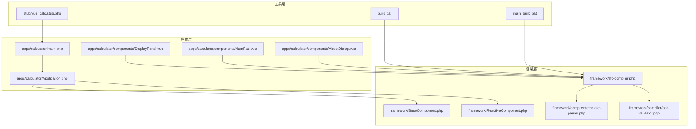
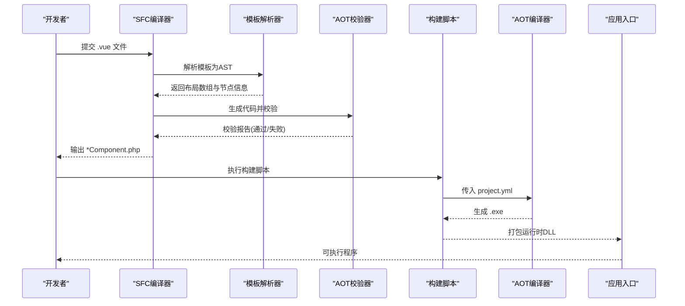
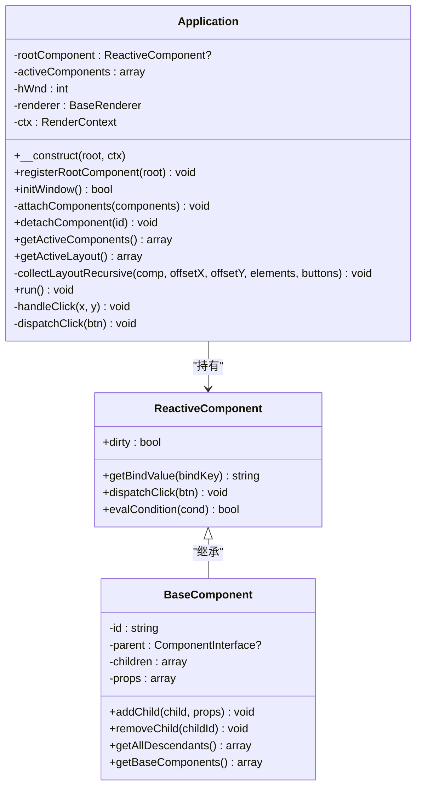
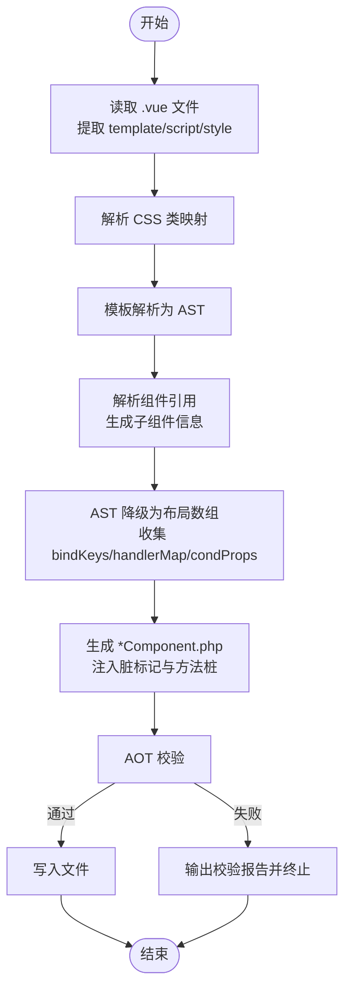
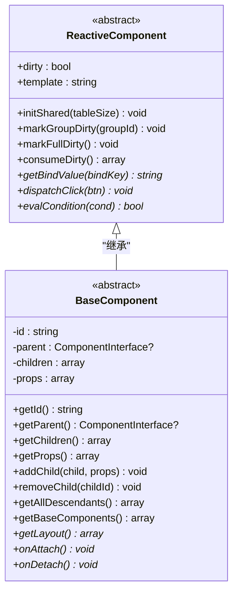
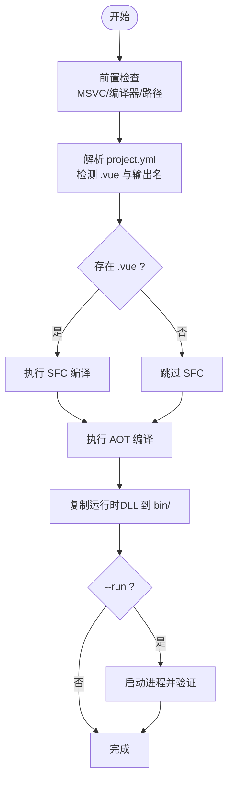
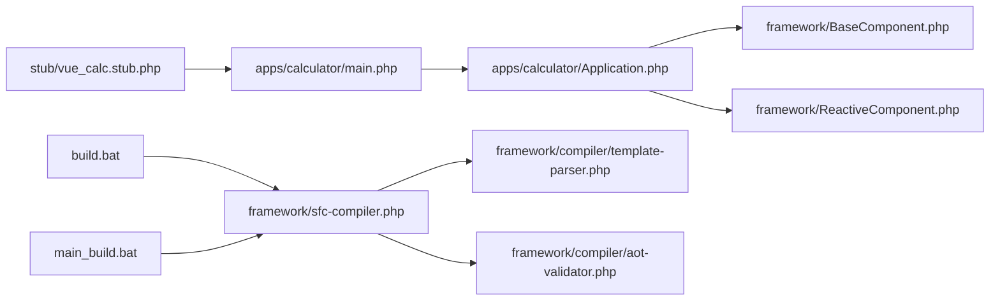

# 开发工具和资源

<cite>
**本文引用的文件**
- [apps/calculator/project.yml](file://apps/calculator/project.yml)
- [apps/test/project.yml](file://apps/test/project.yml)
- [stub/vue_calc.stub.php](file://stub/vue_calc.stub.php)
- [build.bat](file://build.bat)
- [main_build.bat](file://main_build.bat)
- [apps/calculator/main.php](file://apps/calculator/main.php)
- [apps/calculator/Application.php](file://apps/calculator/Application.php)
- [framework/sfc-compiler.php](file://framework/sfc-compiler.php)
- [framework/compiler/template-parser.php](file://framework/compiler/template-parser.php)
- [framework/compiler/aot-validator.php](file://framework/compiler/aot-validator.php)
- [apps/calculator/components/DisplayPanel.vue](file://apps/calculator/components/DisplayPanel.vue)
- [apps/calculator/components/NumPad.vue](file://apps/calculator/components/NumPad.vue)
- [apps/calculator/components/AboutDialog.vue](file://apps/calculator/components/AboutDialog.vue)
- [framework/BaseComponent.php](file://framework/BaseComponent.php)
- [framework/ReactiveComponent.php](file://framework/ReactiveComponent.php)
</cite>

## 目录
1. [简介](#简介)
2. [项目结构](#项目结构)
3. [核心组件](#核心组件)
4. [架构总览](#架构总览)
5. [详细组件分析](#详细组件分析)
6. [依赖关系分析](#依赖关系分析)
7. [性能考量](#性能考量)
8. [故障排除指南](#故障排除指南)
9. [结论](#结论)
10. [附录](#附录)

## 简介
本指南面向VueCalc项目的开发者，提供从开发环境配置、IDE设置、代码补全与调试工具，到PHP类型提示系统与stub文件的使用说明；涵盖编译错误诊断、运行时调试与性能分析方法；总结开发过程中的最佳实践（代码组织、命名规范、版本控制策略），并整理社区资源与学习材料链接，最后给出常见问题的解决方案。

## 项目结构
VueCalc采用“SFC（单文件组件）→ AOT（Ahead-of-Time）编译”的桌面应用开发模式。项目主要分为三层：
- 应用层：应用入口、应用控制器、组件集合
- 框架层：组件基类、渲染器、编译器模块
- 工具层：SFC编译器、AOT校验器、构建批处理脚本

**图表来源**
- [apps/calculator/main.php:1-48](file://apps/calculator/main.php#L1-L48)
- [apps/calculator/Application.php:1-322](file://apps/calculator/Application.php#L1-L322)
- [framework/BaseComponent.php:1-177](file://framework/BaseComponent.php#L1-L177)
- [framework/ReactiveComponent.php:1-90](file://framework/ReactiveComponent.php#L1-L90)
- [framework/sfc-compiler.php:1-819](file://framework/sfc-compiler.php#L1-L819)
- [framework/compiler/template-parser.php:1-869](file://framework/compiler/template-parser.php#L1-L869)
- [framework/compiler/aot-validator.php:1-207](file://framework/compiler/aot-validator.php#L1-L207)
- [build.bat:1-350](file://build.bat#L1-L350)
- [main_build.bat:1-404](file://main_build.bat#L1-L404)
- [stub/vue_calc.stub.php:1-24](file://stub/vue_calc.stub.php#L1-L24)

**章节来源**
- [apps/calculator/project.yml:1-34](file://apps/calculator/project.yml#L1-L34)
- [apps/test/project.yml:1-7](file://apps/test/project.yml#L1-L7)
- [build.bat:1-350](file://build.bat#L1-L350)
- [main_build.bat:1-404](file://main_build.bat#L1-L404)

## 核心组件
- 应用入口与控制器
  - 应用入口负责初始化根组件、渲染上下文与应用控制器，并启动事件循环
  - 应用控制器负责窗口初始化、事件循环、点击分发、组件树布局收集与渲染调度
- 组件基类与响应式基类
  - 组件基类提供组件树结构、父子关系与属性管理
  - 响应式基类提供脏标记与变更队列，支持按组与全量重绘
- SFC编译器与模板解析器
  - SFC编译器将Vue单文件组件转换为PHP组件类，生成布局数组与方法桩
  - 模板解析器采用递归下降解析，生成AST并降级为布局数组
- AOT校验器
  - 在生成代码阶段进行AOT兼容性检查，避免编译期与运行期问题
- Stub文件
  - 提供Win32 API的PHP类型提示，改善IDE补全与静态分析体验

**章节来源**
- [apps/calculator/main.php:1-48](file://apps/calculator/main.php#L1-L48)
- [apps/calculator/Application.php:1-322](file://apps/calculator/Application.php#L1-L322)
- [framework/BaseComponent.php:1-177](file://framework/BaseComponent.php#L1-L177)
- [framework/ReactiveComponent.php:1-90](file://framework/ReactiveComponent.php#L1-L90)
- [framework/sfc-compiler.php:1-819](file://framework/sfc-compiler.php#L1-L819)
- [framework/compiler/template-parser.php:1-869](file://framework/compiler/template-parser.php#L1-L869)
- [framework/compiler/aot-validator.php:1-207](file://framework/compiler/aot-validator.php#L1-L207)
- [stub/vue_calc.stub.php:1-24](file://stub/vue_calc.stub.php#L1-L24)

## 架构总览
下图展示了从Vue组件到可执行程序的完整流水线：SFC编译生成PHP组件类，AOT校验保证兼容性，构建脚本完成编译与打包，最终输出可执行文件与运行时依赖。

**图表来源**
- [framework/sfc-compiler.php:1-819](file://framework/sfc-compiler.php#L1-L819)
- [framework/compiler/template-parser.php:1-869](file://framework/compiler/template-parser.php#L1-L869)
- [framework/compiler/aot-validator.php:1-207](file://framework/compiler/aot-validator.php#L1-L207)
- [build.bat:1-350](file://build.bat#L1-L350)
- [main_build.bat:1-404](file://main_build.bat#L1-L404)
- [apps/calculator/project.yml:1-34](file://apps/calculator/project.yml#L1-L34)

## 详细组件分析

### 应用入口与控制器
- 入口职责
  - 初始化时区、创建根组件、初始化共享资源、创建渲染上下文与应用控制器
  - 初始化窗口并启动事件循环
- 控制器职责
  - 窗口生命周期管理、事件循环、点击命中测试与分发、布局数据收集与渲染调度
  - 组件树挂载与卸载、活跃组件列表维护

**图表来源**
- [apps/calculator/Application.php:1-322](file://apps/calculator/Application.php#L1-L322)
- [framework/BaseComponent.php:1-177](file://framework/BaseComponent.php#L1-L177)
- [framework/ReactiveComponent.php:1-90](file://framework/ReactiveComponent.php#L1-L90)

**章节来源**
- [apps/calculator/main.php:1-48](file://apps/calculator/main.php#L1-L48)
- [apps/calculator/Application.php:1-322](file://apps/calculator/Application.php#L1-L322)

### SFC编译器与模板解析器
- SFC编译器流程
  - 读取Vue文件，提取template/script/style块
  - 解析CSS类映射，解析模板为AST，解析组件引用并生成子组件
  - 生成布局数组、绑定键、处理器映射与条件属性
  - 自动注入脏标记、生成getBindValue/dispatchClick/evalCondition等方法
  - AOT校验通过后写入*Component.php
- 模板解析器
  - 词法分析与递归下降解析，支持rect/text/grid/btn与自定义组件标签
  - 将AST降级为布局数组，收集绑定键、处理器与条件属性
  - 报告解析错误并保留未知标签节点

**图表来源**
- [framework/sfc-compiler.php:1-819](file://framework/sfc-compiler.php#L1-L819)
- [framework/compiler/template-parser.php:1-869](file://framework/compiler/template-parser.php#L1-L869)
- [framework/compiler/aot-validator.php:1-207](file://framework/compiler/aot-validator.php#L1-L207)

**章节来源**
- [framework/sfc-compiler.php:1-819](file://framework/sfc-compiler.php#L1-L819)
- [framework/compiler/template-parser.php:1-869](file://framework/compiler/template-parser.php#L1-L869)
- [framework/compiler/aot-validator.php:1-207](file://framework/compiler/aot-validator.php#L1-L207)

### 组件基类与响应式基类
- 组件基类
  - 提供组件树结构、父子关系、属性管理与后代收集
  - AOT兼容：使用array_keys+for循环遍历关联数组，strval确保字符串类型
- 响应式基类
  - 提供脏标记与变更队列，支持按组与全量重绘
  - 子类需实现getBindValue/dispatchClick/evalCondition

**图表来源**
- [framework/BaseComponent.php:1-177](file://framework/BaseComponent.php#L1-L177)
- [framework/ReactiveComponent.php:1-90](file://framework/ReactiveComponent.php#L1-L90)

**章节来源**
- [framework/BaseComponent.php:1-177](file://framework/BaseComponent.php#L1-L177)
- [framework/ReactiveComponent.php:1-90](file://framework/ReactiveComponent.php#L1-L90)

### 构建与打包流程
- 单应用构建脚本
  - 检查MSVC环境、解析project.yml、执行SFC编译（如有.vue）、AOT编译、复制运行时DLL、可选运行验证
  - 详细的错误分类与常见原因提示
- 交互式构建编排器
  - 扫描apps/下的应用，列出可构建目标，统一执行构建管道

**图表来源**
- [build.bat:1-350](file://build.bat#L1-L350)
- [main_build.bat:1-404](file://main_build.bat#L1-L404)
- [apps/calculator/project.yml:1-34](file://apps/calculator/project.yml#L1-L34)

**章节来源**
- [build.bat:1-350](file://build.bat#L1-L350)
- [main_build.bat:1-404](file://main_build.bat#L1-L404)
- [apps/calculator/project.yml:1-34](file://apps/calculator/project.yml#L1-L34)

## 依赖关系分析
- 应用层对框架层的依赖
  - 应用入口依赖应用控制器与渲染上下文
  - 应用控制器依赖组件基类与渲染器接口
- 编译链路依赖
  - SFC编译器依赖模板解析器与AOT校验器
  - 模板解析器依赖组件注册表与AST节点定义
- 构建脚本对工具链的依赖
  - 依赖Swoole编译器、MSVC cl.exe、运行时DLL

**图表来源**
- [apps/calculator/main.php:1-48](file://apps/calculator/main.php#L1-L48)
- [apps/calculator/Application.php:1-322](file://apps/calculator/Application.php#L1-L322)
- [framework/BaseComponent.php:1-177](file://framework/BaseComponent.php#L1-L177)
- [framework/ReactiveComponent.php:1-90](file://framework/ReactiveComponent.php#L1-L90)
- [framework/sfc-compiler.php:1-819](file://framework/sfc-compiler.php#L1-L819)
- [framework/compiler/template-parser.php:1-869](file://framework/compiler/template-parser.php#L1-L869)
- [framework/compiler/aot-validator.php:1-207](file://framework/compiler/aot-validator.php#L1-L207)
- [build.bat:1-350](file://build.bat#L1-L350)
- [main_build.bat:1-404](file://main_build.bat#L1-L404)
- [stub/vue_calc.stub.php:1-24](file://stub/vue_calc.stub.php#L1-L24)

**章节来源**
- [apps/calculator/project.yml:1-34](file://apps/calculator/project.yml#L1-L34)
- [framework/sfc-compiler.php:1-819](file://framework/sfc-compiler.php#L1-L819)
- [framework/compiler/template-parser.php:1-869](file://framework/compiler/template-parser.php#L1-L869)
- [framework/compiler/aot-validator.php:1-207](file://framework/compiler/aot-validator.php#L1-L207)
- [build.bat:1-350](file://build.bat#L1-L350)
- [main_build.bat:1-404](file://main_build.bat#L1-L404)

## 性能考量
- 渲染优化
  - 使用脏标记驱动重绘，仅在状态变更后触发渲染，维持约60FPS
  - 支持按组与全量重绘，减少不必要的绘制开销
- 组件树遍历
  - AOT兼容遍历方式：array_keys+for循环，避免潜在的引用与类型问题
- 构建与打包
  - 构建脚本在AOT前后均检查MSVC可用性，避免中间步骤丢失环境导致失败
  - 打包阶段复制必要DLL，确保运行时完整性

**章节来源**
- [apps/calculator/Application.php:205-263](file://apps/calculator/Application.php#L205-L263)
- [framework/BaseComponent.php:137-154](file://framework/BaseComponent.php#L137-L154)
- [build.bat:215-232](file://build.bat#L215-L232)

## 故障排除指南
- 编译器未找到或环境缺失
  - 现象：找不到swoole_compile*目录、PHP CLI或swoole_compiler不存在、MSVC cl.exe不可用
  - 处理：确保编译器位于框架根或父目录；从Developer Command Prompt for VS运行；检查VCVARSALL路径
- SFC编译失败
  - 现象：缺少template/script/style块、模板解析错误、组件解析警告
  - 处理：检查.vue文件结构；使用--dump-ast查看AST；修复未知标签与属性
- AOT编译失败
  - 现象：顶层可执行语句、变量先用后定义、变量类型变化、文件名含特殊字符
  - 处理：将所有代码放入函数或类内部；确保变量有初始值；使用下划线替换多余点号；避免PHP8-only函数
- 打包失败
  - 现象：复制exe/DLL失败
  - 处理：检查权限与目标路径；确认php8embed.lib存在于编译器目录
- 运行时崩溃
  - 现象：进程启动后立即退出
  - 处理：使用--run选项验证；检查异常日志；确认窗口创建与消息循环逻辑

**章节来源**
- [build.bat:56-62](file://build.bat#L56-L62)
- [build.bat:100-107](file://build.bat#L100-L107)
- [build.bat:161-170](file://build.bat#L161-L170)
- [build.bat:253-277](file://build.bat#L253-L277)
- [build.bat:324-340](file://build.bat#L324-L340)
- [main_build.bat:48-54](file://main_build.bat#L48-L54)
- [main_build.bat:215-224](file://main_build.bat#L215-L224)
- [main_build.bat:307-331](file://main_build.bat#L307-L331)
- [framework/compiler/aot-validator.php:37-121](file://framework/compiler/aot-validator.php#L37-L121)

## 结论
VueCalc通过SFC与AOT的结合，实现了从Vue风格模板到高性能桌面应用的自动化流水线。借助Stub文件、完善的编译器与校验器、以及清晰的构建脚本，开发者可以高效地进行开发、调试与发布。遵循本文的工具配置、调试技巧与最佳实践，可显著提升开发效率与应用质量。

## 附录

### 开发环境配置与IDE建议
- IDE与插件
  - 推荐使用具备PHP语言服务器与符号索引能力的IDE（如PHPStorm、VS Code）
  - 启用PHP内置类型提示与静态分析功能
- 代码补全与类型提示
  - 将stub文件加入项目根目录或IDE的include路径，以获得Win32 API的类型提示
  - 在项目配置中启用native_types命名空间（框架侧已引入）

**章节来源**
- [stub/vue_calc.stub.php:1-24](file://stub/vue_calc.stub.php#L1-L24)
- [apps/calculator/Application.php:3-3](file://apps/calculator/Application.php#L3-L3)

### PHP类型提示系统与Stub文件
- 作用
  - 为C++桥接层的Win32 API提供PHP侧类型签名，增强IDE补全与静态分析
- 配置方法
  - 将stub文件放置于项目可访问路径
  - 在需要使用API的文件顶部引入命名空间或确保IDE索引可见

**章节来源**
- [stub/vue_calc.stub.php:1-24](file://stub/vue_calc.stub.php#L1-L24)

### 调试技巧与工具推荐
- 编译错误诊断
  - 使用--dump-ast查看模板解析AST，定位未知标签与属性问题
  - 关注AOT校验器报告，修复变量函数调用、变量属性访问等问题
- 运行时调试
  - 在应用控制器中捕获异常并打印堆栈，便于定位逻辑错误
  - 使用脏标记与日志配合，观察渲染触发时机
- 性能分析
  - 通过脏标记与按组重绘机制，减少不必要的绘制
  - 在事件循环中保持固定帧率，避免阻塞UI线程

**章节来源**
- [framework/sfc-compiler.php:227-230](file://framework/sfc-compiler.php#L227-L230)
- [apps/calculator/Application.php:227-232](file://apps/calculator/Application.php#L227-L232)
- [apps/calculator/Application.php:248-257](file://apps/calculator/Application.php#L248-L257)

### 开发最佳实践
- 代码组织
  - 将组件拆分为独立.vue文件，使用project.yml注册组件映射
  - 将应用入口与控制器分离，保持职责单一
- 命名规范
  - 组件类名采用驼峰命名，文件名使用下划线分隔
  - 变量与方法使用语义化名称，避免缩写
- 版本控制策略
  - 将源代码与生成文件分离（.vue与生成的*Component.php）
  - 在提交前运行AOT校验，确保生成代码符合AOT约束

**章节来源**
- [apps/calculator/project.yml:29-34](file://apps/calculator/project.yml#L29-L34)
- [framework/sfc-compiler.php:363-368](file://framework/sfc-compiler.php#L363-L368)
- [framework/compiler/aot-validator.php:44-59](file://framework/compiler/aot-validator.php#L44-L59)

### 社区资源与学习材料
- 相关文档与规划
  - VueCalc技术文档、技术规划文档、构建编译流程参考、对话存档等
- 相关技术
  - Swoole AOT编译器、Windows GDI绘制、递归下降解析、AST与布局数组

**章节来源**
- [apps/calculator/components/DisplayPanel.vue:1-12](file://apps/calculator/components/DisplayPanel.vue#L1-L12)
- [apps/calculator/components/NumPad.vue:1-37](file://apps/calculator/components/NumPad.vue#L1-L37)
- [apps/calculator/components/AboutDialog.vue:1-37](file://apps/calculator/components/AboutDialog.vue#L1-L37)