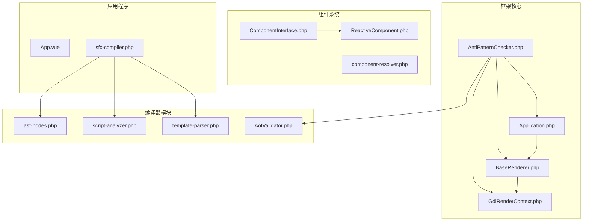
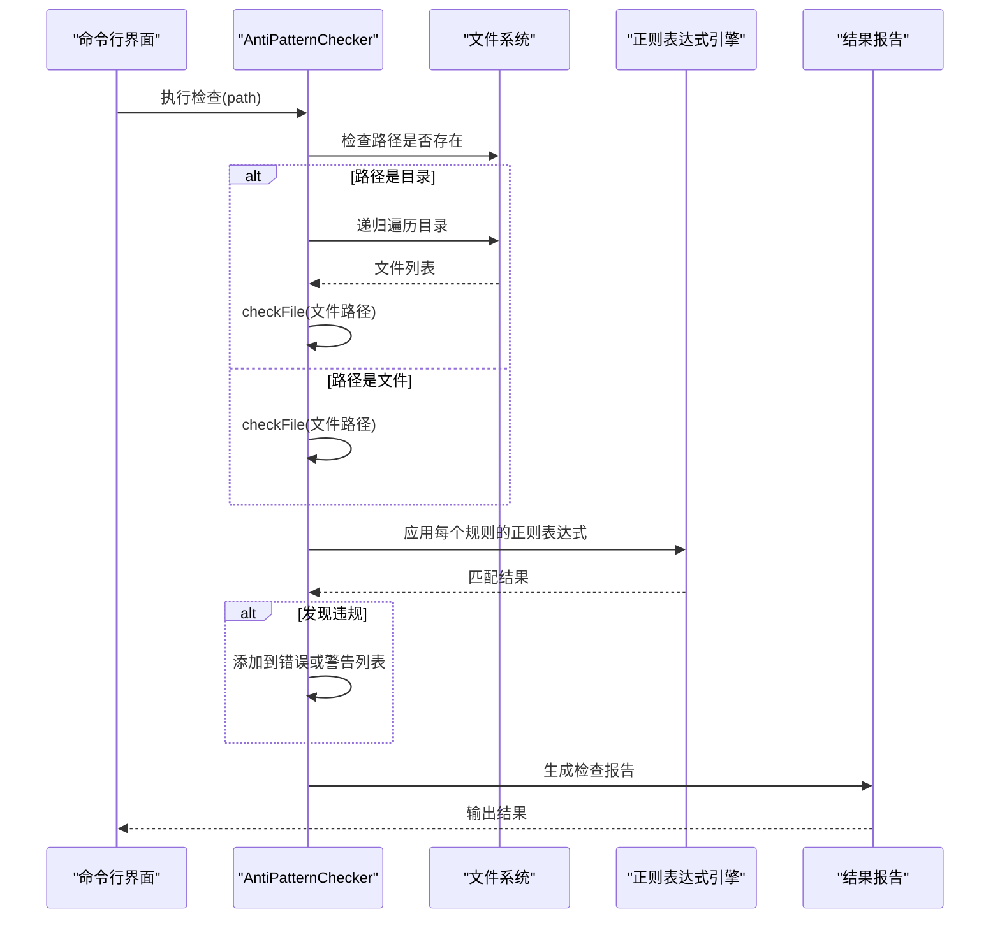
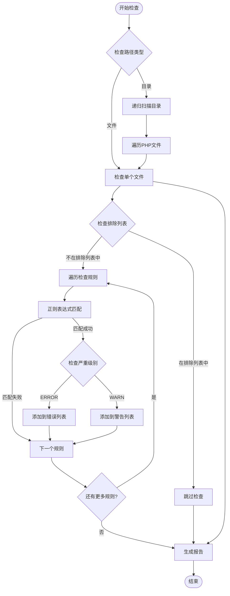
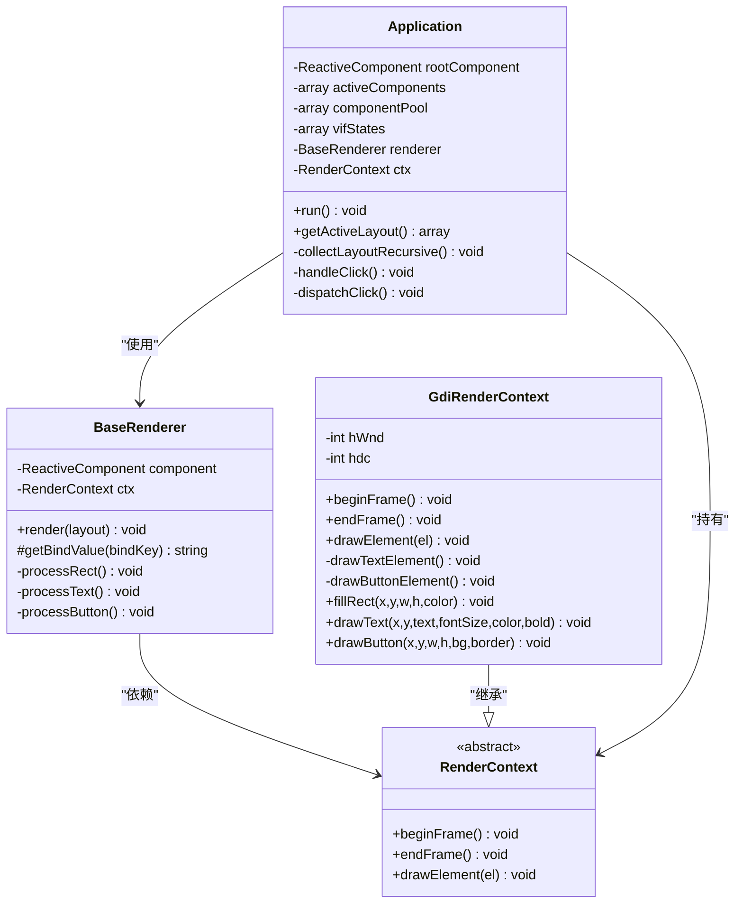
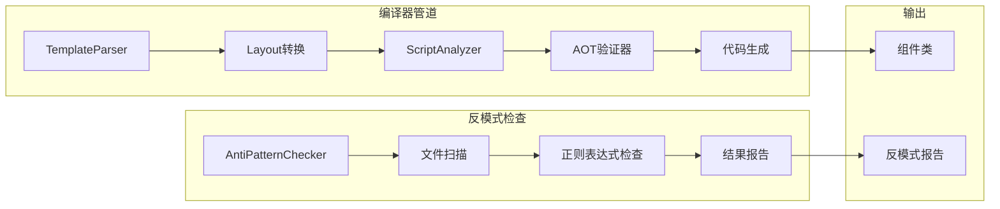
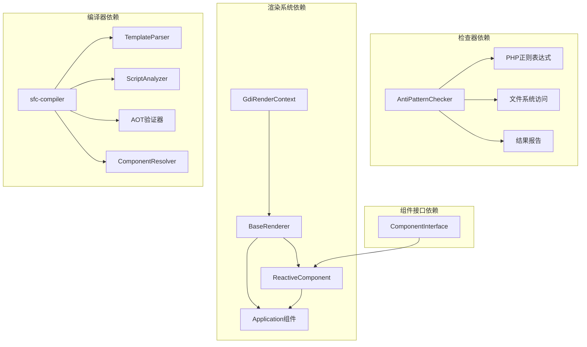

# 反模式检查器

<cite>
**本文档引用的文件**
- [AntiPatternChecker.php](file://framework/AntiPatternChecker.php)
- [GdiRenderContext.php](file://framework/rendering/GdiRenderContext.php)
- [BaseRenderer.php](file://framework/BaseRenderer.php)
- [Application.php](file://framework/Application.php)
- [aot-validator.php](file://framework/compiler/aot-validator.php)
- [template-parser.php](file://framework/compiler/template-parser.php)
- [script-analyzer.php](file://framework/compiler/script-analyzer.php)
- [ast-nodes.php](file://framework/compiler/ast-nodes.php)
- [component-resolver.php](file://framework/compiler/component-resolver.php)
- [sfc-compiler.php](file://framework/sfc-compiler.php)
- [ComponentInterface.php](file://framework/interfaces/ComponentInterface.php)
- [ReactiveComponent.php](file://framework/ReactiveComponent.php)
- [App.vue](file://apps/calculator/App.vue)
- [sfc-compiler-test.php](file://tests/sfc-compiler-test.php)
</cite>

## 目录
1. [简介](#简介)
2. [项目结构](#项目结构)
3. [核心组件](#核心组件)
4. [架构概览](#架构概览)
5. [详细组件分析](#详细组件分析)
6. [依赖分析](#依赖分析)
7. [性能考虑](#性能考虑)
8. [故障排除指南](#故障排除指南)
9. [结论](#结论)

## 简介

反模式检查器是一个专门设计的代码质量工具，用于检测和防止框架中的反模式实践。该工具通过静态代码分析来识别潜在的问题模式，确保代码符合最佳实践标准。

在VueCalc框架中，反模式检查器主要关注以下关键领域：

- **渲染上下文管理**：确保hWnd和hdc资源正确分配到适当的类中
- **C++函数调用规范**：防止业务代码直接调用底层C++函数
- **绘制方法设计**：确保绘制方法不接收不必要的参数
- **组件架构**：维护清晰的组件层次结构

## 项目结构



**图表来源**
- [AntiPatternChecker.php:1-188](file://framework/AntiPatternChecker.php#L1-L188)
- [Application.php:1-400](file://framework/Application.php#L1-L400)
- [BaseRenderer.php:1-129](file://framework/BaseRenderer.php#L1-L129)
- [GdiRenderContext.php:1-116](file://framework/rendering/GdiRenderContext.php#L1-L116)

## 核心组件

### AntiPatternChecker - 反模式检查器

AntiPatternChecker是整个系统的核心组件，负责执行静态代码分析以识别各种反模式。

**主要功能特性：**
- **多规则检查**：支持7种不同的检查规则
- **递归文件扫描**：自动遍历指定目录下的所有PHP文件
- **分类报告**：区分错误和警告级别
- **排除机制**：允许特定文件绕过某些检查规则

**检查规则概览：**

| 规则ID | 严重级别 | 检查内容 | 错误消息 |
|--------|----------|----------|----------|
| hwnd_in_app | ERROR | Application类不应持有hWnd属性 | Application不应持有hWnd属性，应由GdiRenderContext持有 |
| hwnd_in_renderer | ERROR | BaseRenderer类不应持有hWnd属性 | BaseRenderer不应持有hWnd属性，应由GdiRenderContext持有 |
| hdc_in_renderer | ERROR | BaseRenderer类不应持有hdc属性 | BaseRenderer不应持有hdc属性，应由GdiRenderContext持有 |
| hwnd_not_in_render_ctx | ERROR | GdiRenderContext必须持有hWnd属性 | GdiRenderContext必须持有$hWnd属性 |
| hdc_not_in_render_ctx | ERROR | GdiRenderContext必须持有hdc属性 | GdiRenderContext必须持有$hdc属性 |
| hdc_param_in_methods | WARN | 绘制方法不应接收hdc参数 | 绘制方法不应接收hdc参数，应由GdiRenderContext内部管理 |
| direct_cpp_call | ERROR | 业务代码不应直接调用vue_* C++函数 | 业务代码不应直接调用vue_* C++函数，应通过GdiRenderContext |

**章节来源**
- [AntiPatternChecker.php:17-179](file://framework/AntiPatternChecker.php#L17-L179)

### GdiRenderContext - GDI渲染上下文

GdiRenderContext是Win32 GDI后端的实现，负责管理窗口句柄和设备上下文。

**关键职责：**
- **资源管理**：持有hWnd和hdc资源
- **绘制接口**：提供统一的绘制方法
- **C++集成**：封装底层C++函数调用

**设计原则：**
- 所有绘制方法都不接受hdc参数
- 通过beginFrame和endFrame管理绘制周期
- 将C++函数调用封装在安全的接口后面

**章节来源**
- [GdiRenderContext.php:11-115](file://framework/rendering/GdiRenderContext.php#L11-L115)

### BaseRenderer - 基础渲染器

BaseRenderer负责数据预处理和绘制调度，专注于数据转换而非具体的绘制逻辑。

**核心功能：**
- **数据预处理**：解析绑定值、计算字体大小、处理对齐
- **分层渲染**：两阶段渲染流程
- **条件渲染**：支持v-if条件的元素渲染

**AOT兼容性：**
- 使用array_keys() + for循环避免关联数组遍历问题
- 使用(array)类型转换修复嵌套数组类型推断

**章节来源**
- [BaseRenderer.php:13-128](file://framework/BaseRenderer.php#L13-L128)

## 架构概览



**图表来源**
- [AntiPatternChecker.php:71-135](file://framework/AntiPatternChecker.php#L71-L135)

## 详细组件分析

### 反模式检查流程



**图表来源**
- [AntiPatternChecker.php:99-135](file://framework/AntiPatternChecker.php#L99-L135)

### 渲染架构分析



**图表来源**
- [Application.php:15-399](file://framework/Application.php#L15-L399)
- [BaseRenderer.php:13-128](file://framework/BaseRenderer.php#L13-L128)
- [GdiRenderContext.php:11-115](file://framework/rendering/GdiRenderContext.php#L11-L115)

**章节来源**
- [Application.php:35-329](file://framework/Application.php#L35-L329)
- [BaseRenderer.php:43-128](file://framework/BaseRenderer.php#L43-L128)

### 编译器集成分析



**图表来源**
- [sfc-compiler.php:300-575](file://framework/sfc-compiler.php#L300-L575)
- [AntiPatternChecker.php:71-135](file://framework/AntiPatternChecker.php#L71-L135)

**章节来源**
- [sfc-compiler.php:360-556](file://framework/sfc-compiler.php#L360-L556)

## 依赖分析

### 核心依赖关系



**图表来源**
- [AntiPatternChecker.php:83-135](file://framework/AntiPatternChecker.php#L83-L135)
- [sfc-compiler.php:27-35](file://framework/sfc-compiler.php#L27-L35)

### 规则依赖矩阵

| 规则ID | 依赖文件 | 依赖类型 | 说明 |
|--------|----------|----------|------|
| hwnd_in_app | Application.php | 类定义检查 | 检查Application类定义中是否包含hWnd属性 |
| hwnd_in_renderer | BaseRenderer.php | 类定义检查 | 检查BaseRenderer类定义中是否包含hWnd属性 |
| hdc_in_renderer | BaseRenderer.php | 类定义检查 | 检查BaseRenderer类定义中是否包含hdc属性 |
| hwnd_not_in_render_ctx | GdiRenderContext.php | 类定义检查 | 确保GdiRenderContext类定义包含hWnd属性 |
| hdc_not_in_render_ctx | GdiRenderContext.php | 类定义检查 | 确保GdiRenderContext类定义包含hdc属性 |
| hdc_param_in_methods | GdiRenderContext.php | 方法签名检查 | 检查绘制方法参数中是否包含hdc参数 |
| direct_cpp_call | GdiRenderContext.php | 函数调用检查 | 检查业务代码中是否直接调用vue_*函数 |

**章节来源**
- [AntiPatternChecker.php:20-56](file://framework/AntiPatternChecker.php#L20-L56)

## 性能考虑

### 检查器性能优化

1. **正则表达式优化**
   - 使用非贪婪匹配避免过度回溯
   - 编译正则表达式以提高重复使用效率
   - 避免复杂的嵌套捕获组

2. **文件扫描优化**
   - 使用RecursiveIteratorIterator进行高效的目录遍历
   - 仅处理PHP扩展名文件
   - 实现早期退出机制

3. **内存管理**
   - 分批处理文件内容而非一次性加载
   - 及时释放正则表达式匹配结果
   - 控制错误和警告列表的大小

### 渲染性能考虑

1. **AOT兼容性**
   - 避免foreach遍历关联数组导致的类型推断问题
   - 使用显式类型转换确保类型一致性
   - 优化数组操作减少运行时开销

2. **渲染优化**
   - 分层渲染减少不必要的绘制操作
   - 条件渲染避免无效的元素处理
   - 统一绘制接口减少分支判断

## 故障排除指南

### 常见反模式问题

**问题1：错误地在Application中持有hWnd**
```
错误示例：
class Application {
    private int $hWnd;  // ❌ 反模式
    ...
}

正确做法：
class Application {
    // ✅ 不持有hWnd，由GdiRenderContext持有
    ...
}
```

**问题2：直接调用C++函数**
```
错误示例：
class BusinessLogic {
    public function drawSomething() {
        vue_fill_rect($hdc, $x, $y, $w, $h, $color);  // ❌ 直接调用
    }
}

正确做法：
class BusinessLogic {
    public function drawSomething(RenderContext $ctx) {
        $ctx->fillRect($x, $y, $w, $h, $color);  // ✅ 通过上下文调用
    }
}
```

### 检查器使用指南

1. **基本使用**
   ```bash
   php framework/AntiPatternChecker.php /path/to/check
   ```

2. **检查特定文件**
   ```bash
   php framework/AntiPatternChecker.php framework/rendering/GdiRenderContext.php
   ```

3. **排除特定文件**
   - GdiRenderContext.php - 允许直接调用C++函数
   - vue_calc.cc - C++源文件，无需检查

### 调试技巧

1. **启用详细输出**
   - 检查器会显示每个发现的违规及其规则ID
   - 错误和警告分别列出，便于区分严重程度

2. **规则定制**
   - 可以根据项目需求调整正则表达式模式
   - 可以添加新的排除文件
   - 可以修改规则的严重级别

**章节来源**
- [AntiPatternChecker.php:140-179](file://framework/AntiPatternChecker.php#L140-L179)

## 结论

反模式检查器为VueCalc框架提供了重要的代码质量保障机制。通过静态分析和规则检查，它能够：

1. **预防架构问题**：确保渲染上下文资源正确分配
2. **维护设计原则**：防止业务代码直接访问底层实现细节
3. **提升代码一致性**：通过统一的检查规则确保代码风格一致
4. **支持AOT编译**：检查可能影响Ahead-of-Time编译的代码模式

该工具的设计充分考虑了性能和实用性，能够在大型代码库中高效运行，同时提供准确的违规检测和详细的报告信息。通过持续使用反模式检查器，开发团队可以保持代码质量，避免常见的架构陷阱，并确保框架的长期可维护性。

建议将反模式检查器集成到CI/CD流程中，作为代码审查的一部分，以确保新代码符合既定的设计原则和最佳实践。