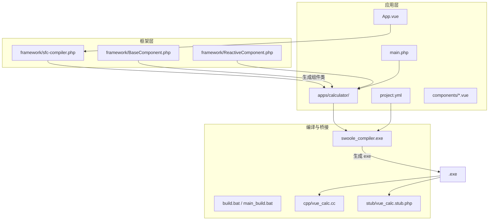
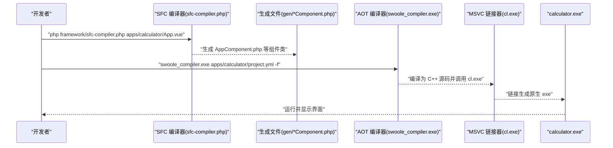
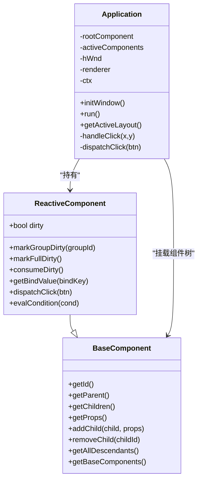
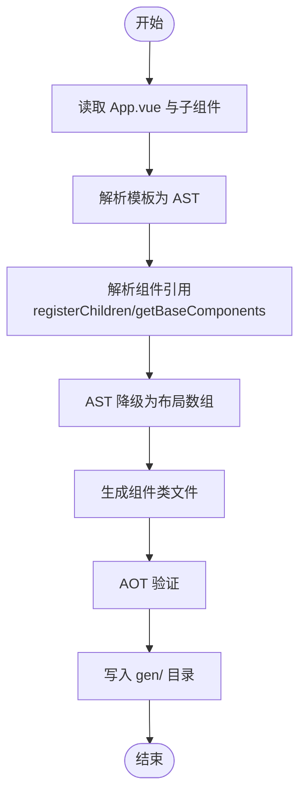
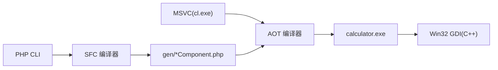

# 快速开始

<cite>
**本文引用的文件**
- [apps/calculator/project.yml](file://apps/calculator/project.yml)
- [apps/calculator/main.php](file://apps/calculator/main.php)
- [apps/calculator/Application.php](file://apps/calculator/Application.php)
- [apps/calculator/App.vue](file://apps/calculator/App.vue)
- [apps/calculator/components/DisplayPanel.vue](file://apps/calculator/components/DisplayPanel.vue)
- [apps/calculator/components/NumPad.vue](file://apps/calculator/components/NumPad.vue)
- [build.bat](file://build.bat)
- [main_build.bat](file://main_build.bat)
- [framework/sfc-compiler.php](file://framework/sfc-compiler.php)
- [framework/BaseComponent.php](file://framework/BaseComponent.php)
- [framework/ReactiveComponent.php](file://framework/ReactiveComponent.php)
- [docs/构建编译流程参考.md](file://docs/构建编译流程参考.md)
- [docs/开发经验与教训.md](file://docs/开发经验与教训.md)
- [apps/test/project.yml](file://apps/test/project.yml)
- [apps/test/main.php](file://apps/test/main.php)
</cite>

## 目录
1. [简介](#简介)
2. [项目结构](#项目结构)
3. [核心组件](#核心组件)
4. [架构总览](#架构总览)
5. [详细组件分析](#详细组件分析)
6. [依赖关系分析](#依赖关系分析)
7. [性能考虑](#性能考虑)
8. [故障排除指南](#故障排除指南)
9. [结论](#结论)
10. [附录](#附录)

## 简介
本指南面向首次接触 VueCalc 的开发者，帮助你在 Windows 环境下快速完成从零到可执行程序的全流程：安装必要的编译与运行环境、创建第一个 Hello World 示例、理解项目结构与基本概念、掌握构建与运行流程，并提供常见问题的解决方案。

## 项目结构
VueCalc 采用“SFC（单文件组件）预处理 + AOT 编译”的混合架构：
- 源代码以 .vue 单文件形式编写，包含模板、脚本与样式。
- 通过 SFC 编译器在编译前将 .vue 转换为组件类文件（*.php），这些文件随后被 AOT 编译器编译为原生 Windows exe。
- 应用入口与控制器位于 apps/<app>/ 目录，框架核心位于 framework/，C++ 桥接位于 cpp/ 与 stub/。

图示来源
- [apps/calculator/project.yml:1-34](file://apps/calculator/project.yml#L1-L34)
- [apps/calculator/main.php:1-48](file://apps/calculator/main.php#L1-L48)
- [framework/sfc-compiler.php:1-800](file://framework/sfc-compiler.php#L1-L800)
- [build.bat:1-350](file://build.bat#L1-L350)

章节来源
- [apps/calculator/project.yml:1-34](file://apps/calculator/project.yml#L1-L34)
- [apps/calculator/main.php:1-48](file://apps/calculator/main.php#L1-L48)
- [framework/sfc-compiler.php:1-800](file://framework/sfc-compiler.php#L1-L800)
- [build.bat:1-350](file://build.bat#L1-L350)

## 核心组件
- 应用入口与控制器：负责窗口初始化、事件循环、渲染调度与组件挂载。
- 组件基类与响应式基类：提供组件树管理、布局数据获取、脏标记与渲染协调。
- SFC 编译器：将 .vue 预处理为组件类文件，生成 getLayout()/dispatchClick()/evalCondition() 等方法。
- 构建脚本：封装 MSVC 环境准备、SFC 编译、AOT 编译、打包与可选运行验证。

章节来源
- [apps/calculator/Application.php:1-322](file://apps/calculator/Application.php#L1-L322)
- [framework/BaseComponent.php:1-177](file://framework/BaseComponent.php#L1-L177)
- [framework/ReactiveComponent.php:1-90](file://framework/ReactiveComponent.php#L1-L90)
- [framework/sfc-compiler.php:1-800](file://framework/sfc-compiler.php#L1-L800)

## 架构总览
下面的序列图展示了从源代码到可执行文件的完整流程：

图示来源
- [framework/sfc-compiler.php:1-800](file://framework/sfc-compiler.php#L1-L800)
- [apps/calculator/project.yml:1-34](file://apps/calculator/project.yml#L1-L34)
- [build.bat:252-270](file://build.bat#L252-L270)

章节来源
- [framework/sfc-compiler.php:1-800](file://framework/sfc-compiler.php#L1-L800)
- [apps/calculator/project.yml:1-34](file://apps/calculator/project.yml#L1-L34)
- [build.bat:252-270](file://build.bat#L252-L270)

## 详细组件分析

### 应用入口与控制器（Application）
- 职责：创建窗口、挂载组件树、维护事件循环、根据脏标记触发渲染。
- 关键流程：initWindow() 创建窗口并挂载根组件；run() 中消息轮询与渲染；handleClick() 命中测试与点击分发。
- AOT 兼容性：使用 array_keys()+for 遍历、(array) 类型转换、避免魔术方法与动态特性。

图示来源
- [apps/calculator/Application.php:1-322](file://apps/calculator/Application.php#L1-L322)
- [framework/BaseComponent.php:1-177](file://framework/BaseComponent.php#L1-L177)
- [framework/ReactiveComponent.php:1-90](file://framework/ReactiveComponent.php#L1-L90)

章节来源
- [apps/calculator/Application.php:1-322](file://apps/calculator/Application.php#L1-L322)

### SFC 编译器（framework/sfc-compiler.php）
- 职责：解析 .vue，提取模板/脚本/样式，解析组件引用，生成组件类文件与布局数据。
- 输出：AppComponent.php、子组件类文件、constants.php（窗口尺寸常量）。
- AOT 兼容性：生成 getLayout()/dispatchClick()/evalCondition()，避免魔术方法与动态特性。

图示来源
- [framework/sfc-compiler.php:260-600](file://framework/sfc-compiler.php#L260-L600)

章节来源
- [framework/sfc-compiler.php:1-800](file://framework/sfc-compiler.php#L1-L800)

### 项目配置（apps/calculator/project.yml）
- sources：声明应用入口、框架运行时、生成文件与 C++ 桥接文件。
- components：建立自定义标签到 .vue 文件的映射，供编译器解析。

章节来源
- [apps/calculator/project.yml:1-34](file://apps/calculator/project.yml#L1-L34)

### Hello World 示例（基于 test 应用）
- test 应用提供了一个最小可构建示例，包含 project.yml 与 main.php，适合验证环境与构建流程。
- 你可以参考该结构快速创建自己的第一个应用。

章节来源
- [apps/test/project.yml:1-7](file://apps/test/project.yml#L1-L7)
- [apps/test/main.php:1-811](file://apps/test/main.php#L1-L811)

## 依赖关系分析
- 环境依赖：MSVC（cl.exe）、Swoole Compiler、PHP CLI、运行时 DLL（php8ts.dll、phpx.dll）。
- 项目依赖：应用层依赖框架层组件类与渲染上下文；AOT 编译器依赖 MSVC 链接器；C++ 桥接层提供 Win32 GDI 能力。

图示来源
- [build.bat:140-172](file://build.bat#L140-L172)
- [build.bat:226-232](file://build.bat#L226-L232)
- [main_build.bat:28-63](file://main_build.bat#L28-L63)

章节来源
- [build.bat:140-172](file://build.bat#L140-L172)
- [build.bat:226-232](file://build.bat#L226-L232)
- [main_build.bat:28-63](file://main_build.bat#L28-L63)

## 性能考虑
- 事件循环：消息队列清空后统一渲染，避免频繁重绘；固定约 60 FPS 节奏。
- 布局收集：递归遍历组件树并应用偏移，尽量减少不必要的计算。
- AOT 优势：编译期确定布局与方法，运行时开销低，无需解释器。

章节来源
- [apps/calculator/Application.php:205-263](file://apps/calculator/Application.php#L205-L263)
- [framework/sfc-compiler.php:344-357](file://framework/sfc-compiler.php#L344-L357)

## 故障排除指南
- MSVC 环境未初始化
  - 现象：cl.exe 未找到。
  - 处理：确保通过“Developer Command Prompt for VS”运行脚本，或手动执行 vcvarsall.bat x64。
- AOT 编译失败
  - 现象：顶层出现 require_once、变量先用后定义、变量类型改变、文件名含点号等。
  - 处理：移除顶层 require、确保变量先赋初值、保持类型一致、文件名仅使用字母、数字、下划线。
- 运行时崩溃
  - 现象：控制台无输出或立即退出。
  - 处理：设置 project.yml 中 no-console: false，启用控制台输出；在关键路径包裹 try-catch 并打印堆栈。
- 组件未注册或布局为空
  - 现象：按钮点击无响应或界面空白。
  - 处理：确认 project.yml 的 components 映射正确；检查根组件的 registerChildren()/getBaseComponents() 生成是否正确。

章节来源
- [docs/构建编译流程参考.md:207-231](file://docs/构建编译流程参考.md#L207-L231)
- [docs/开发经验与教训.md:291-308](file://docs/开发经验与教训.md#L291-L308)
- [apps/calculator/project.yml:29-34](file://apps/calculator/project.yml#L29-L34)

## 结论
通过本指南，你已经了解了 VueCalc 的整体架构、项目结构与构建流程。建议从 test 应用入手，验证环境与构建脚本，再逐步迁移到你的第一个 VueCalc 应用。遵循 AOT 兼容性规则与调试策略，可以显著降低开发与排错成本。

## 附录

### 环境搭建步骤
- 安装 Microsoft Visual Studio（包含 C++ 桌面开发工作负载）。
- 准备 Swoole Compiler（包含 php.exe、swoole_compiler.exe、php8ts.dll、phpx.dll）。
- 准备 PHP CLI（用于运行 SFC 编译器）。
- 确保 cl.exe 可用：通过“Developer Command Prompt for VS”或手动执行 vcvarsall.bat x64。

章节来源
- [docs/构建编译流程参考.md:9-19](file://docs/构建编译流程参考.md#L9-L19)
- [build.bat:140-172](file://build.bat#L140-L172)

### 创建第一个应用（Hello World）
- 参考 apps/test 的结构，创建 apps/myapp/ 目录，包含：
  - project.yml：声明 name、sources、components。
  - main.php：实现 main() 函数与应用入口逻辑。
  - 可选：gen/ 目录（由 SFC 编译器生成）。
- 使用 main_build.bat 或 build.bat 进行构建与打包。

章节来源
- [apps/test/project.yml:1-7](file://apps/test/project.yml#L1-L7)
- [apps/test/main.php:1-811](file://apps/test/main.php#L1-L811)
- [build.bat:1-350](file://build.bat#L1-L350)

### 构建与运行流程
- 交互式构建：双击 main_build.bat，选择应用并等待构建完成。
- 非交互式构建：执行 build.bat <app-name> [--run]。
- 一键构建包含：Step 0（MSVC 环境）、Step 1（SFC 编译）、Step 2（AOT 编译）、Step 3（打包）、Step 4（可选运行验证）。

章节来源
- [main_build.bat:1-404](file://main_build.bat#L1-L404)
- [build.bat:1-350](file://build.bat#L1-L350)

### 从源代码到可执行文件的关键文件
- .vue 源文件：apps/calculator/App.vue、components/*.vue。
- 生成文件：gen/*Component.php、gen/constants.php。
- AOT 配置：apps/calculator/project.yml。
- 应用入口：apps/calculator/main.php。
- 框架基类：framework/BaseComponent.php、framework/ReactiveComponent.php。
- SFC 编译器：framework/sfc-compiler.php。
- 构建脚本：build.bat、main_build.bat。

章节来源
- [apps/calculator/App.vue:1-203](file://apps/calculator/App.vue#L1-L203)
- [apps/calculator/components/DisplayPanel.vue:1-12](file://apps/calculator/components/DisplayPanel.vue#L1-L12)
- [apps/calculator/components/NumPad.vue:1-37](file://apps/calculator/components/NumPad.vue#L1-L37)
- [apps/calculator/project.yml:1-34](file://apps/calculator/project.yml#L1-L34)
- [apps/calculator/main.php:1-48](file://apps/calculator/main.php#L1-L48)
- [framework/BaseComponent.php:1-177](file://framework/BaseComponent.php#L1-L177)
- [framework/ReactiveComponent.php:1-90](file://framework/ReactiveComponent.php#L1-L90)
- [framework/sfc-compiler.php:1-800](file://framework/sfc-compiler.php#L1-L800)
- [build.bat:1-350](file://build.bat#L1-L350)
- [main_build.bat:1-404](file://main_build.bat#L1-L404)