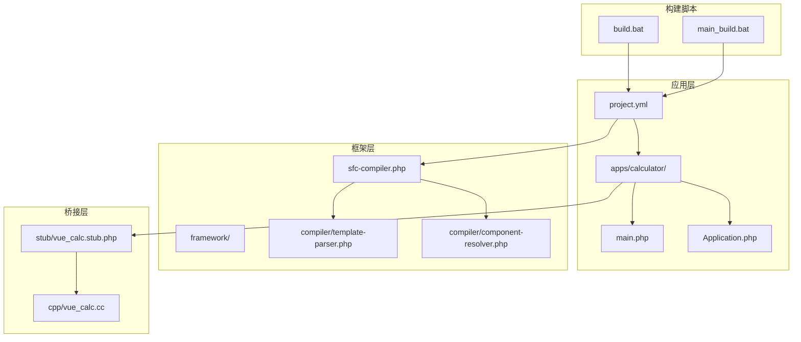
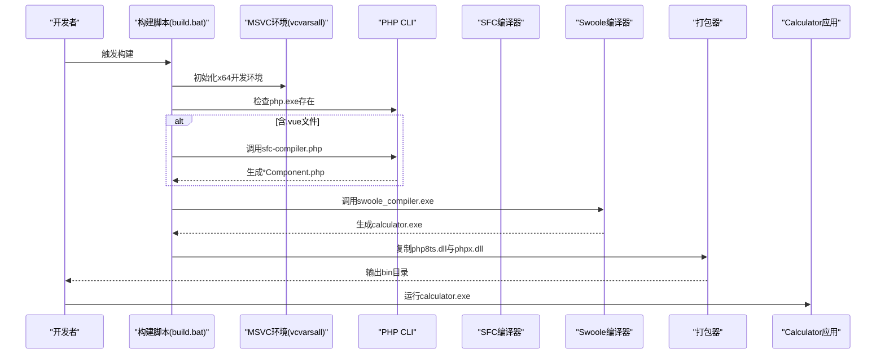
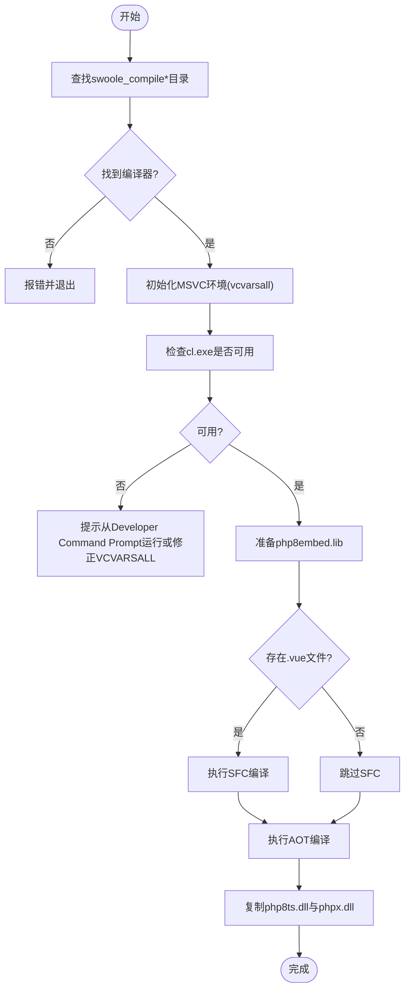
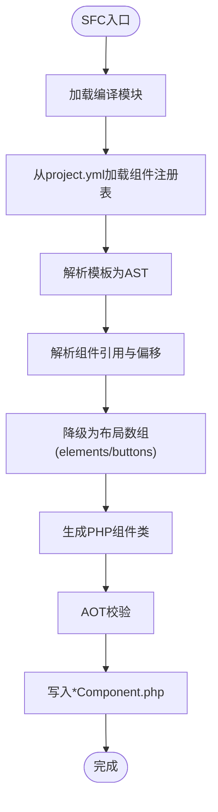
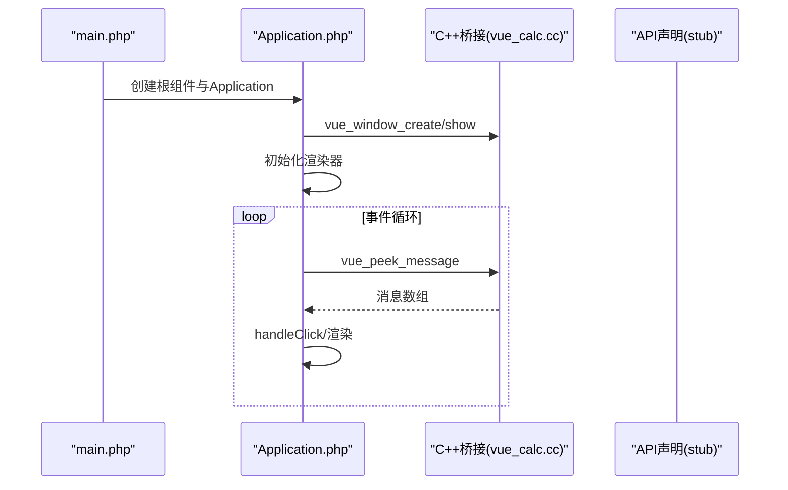
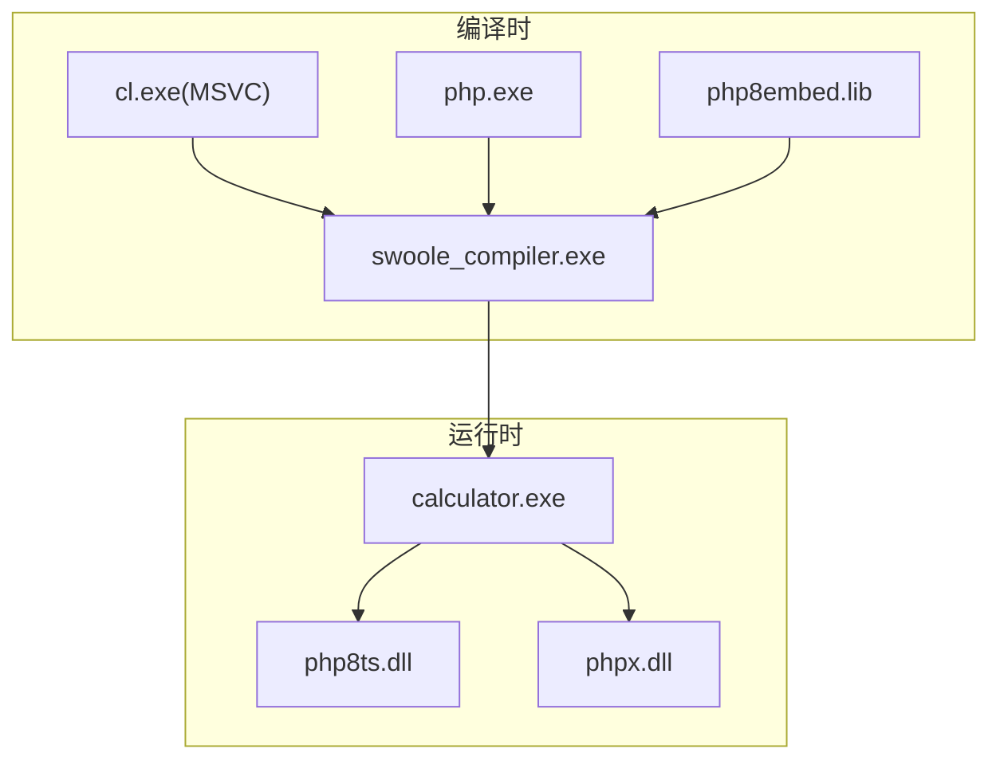

# 依赖管理策略

<cite>
**本文档引用的文件**
- [build.bat](file://build.bat)
- [main_build.bat](file://main_build.bat)
- [sfc-compiler.php](file://framework/sfc-compiler.php)
- [template-parser.php](file://framework/compiler/template-parser.php)
- [component-resolver.php](file://framework/compiler/component-resolver.php)
- [Application.php](file://apps/calculator/Application.php)
- [main.php](file://apps/calculator/main.php)
- [vue_calc.cc](file://cpp/vue_calc.cc)
- [vue_calc.stub.php](file://stub/vue_calc.stub.php)
- [project.yml](file://apps/calculator/project.yml)
</cite>

## 目录
1. [简介](#简介)
2. [项目结构](#项目结构)
3. [核心组件](#核心组件)
4. [架构总览](#架构总览)
5. [详细组件分析](#详细组件分析)
6. [依赖关系分析](#依赖关系分析)
7. [性能考量](#性能考量)
8. [故障排除指南](#故障排除指南)
9. [结论](#结论)
10. [附录](#附录)

## 简介
本指南聚焦于VueCalc项目的依赖管理策略，涵盖构建过程中的各类依赖项：Swoole编译器、MSVC编译器、PHP运行时库以及第三方DLL文件。文档详细说明版本要求、安装位置、环境变量配置、自动检测机制与手动配置方法，并解释依赖项之间的依赖关系与加载顺序（编译时vs运行时）。最后提供最佳实践、更新策略、版本锁定与冲突解决方法，并给出常见问题的诊断与修复建议。

## 项目结构
VueCalc采用“框架+应用”的组织方式，构建脚本位于仓库根目录，应用位于apps/，框架核心位于framework/，C++桥接层位于cpp/，类型与API声明位于stub/。构建脚本负责定位编译器、准备环境、执行SFC/AOT编译、打包DLL并输出可执行文件。

**图表来源**
- [build.bat:1-350](file://build.bat#L1-L350)
- [main_build.bat:1-404](file://main_build.bat#L1-L404)
- [project.yml:1-34](file://apps/calculator/project.yml#L1-L34)
- [sfc-compiler.php:1-819](file://framework/sfc-compiler.php#L1-L819)
- [template-parser.php:1-869](file://framework/compiler/template-parser.php#L1-L869)
- [component-resolver.php:1-62](file://framework/compiler/component-resolver.php#L1-L62)
- [vue_calc.stub.php:1-24](file://stub/vue_calc.stub.php#L1-L24)
- [vue_calc.cc:1-157](file://cpp/vue_calc.cc#L1-L157)

**章节来源**
- [build.bat:1-350](file://build.bat#L1-L350)
- [main_build.bat:1-404](file://main_build.bat#L1-L404)
- [project.yml:1-34](file://apps/calculator/project.yml#L1-L34)

## 核心组件
- 构建脚本：负责自动检测Swoole编译器、MSVC环境、准备AOT所需库文件、执行SFC与AOT编译、打包DLL并输出可执行文件。
- SFC编译器：将.vue单文件组件编译为PHP组件类，生成布局数组与事件绑定代码。
- 模板解析器：递归下降解析模板，生成AST并降级为布局数组。
- 组件解析器：处理组件引用、坐标偏移与属性绑定。
- 应用入口与控制器：定义应用生命周期、窗口初始化、事件循环与渲染调度。
- C++桥接层：提供Win32 API薄封装，供PHP调用实现绘制与消息处理。
- 项目配置：project.yml声明源文件、组件注册表与输出名称等。

**章节来源**
- [build.bat:1-350](file://build.bat#L1-L350)
- [main_build.bat:1-404](file://main_build.bat#L1-L404)
- [sfc-compiler.php:1-819](file://framework/sfc-compiler.php#L1-L819)
- [template-parser.php:1-869](file://framework/compiler/template-parser.php#L1-L869)
- [component-resolver.php:1-62](file://framework/compiler/component-resolver.php#L1-L62)
- [Application.php:1-322](file://apps/calculator/Application.php#L1-L322)
- [main.php:1-48](file://apps/calculator/main.php#L1-L48)
- [vue_calc.cc:1-157](file://cpp/vue_calc.cc#L1-L157)
- [vue_calc.stub.php:1-24](file://stub/vue_calc.stub.php#L1-L24)
- [project.yml:1-34](file://apps/calculator/project.yml#L1-L34)

## 架构总览
下图展示从构建到运行的关键依赖链路：构建脚本定位编译器与MSVC环境；SFC阶段生成PHP组件类；AOT阶段将PHP源码与框架代码编译为可执行文件；运行时加载DLL并启动应用。

**图表来源**
- [build.bat:140-350](file://build.bat#L140-L350)
- [main_build.bat:208-383](file://main_build.bat#L208-L383)
- [sfc-compiler.php:1-819](file://framework/sfc-compiler.php#L1-L819)
- [project.yml:1-34](file://apps/calculator/project.yml#L1-L34)

## 详细组件分析

### 构建脚本与依赖检测
- 自动检测Swoole编译器：通过通配符查找swoole_compile*目录，优先在框架根目录，其次在父目录。若未找到则报错。
- 环境变量与路径：VCVARSALL默认指向VS 2022 Community路径，可通过修改脚本调整；MSVC cl.exe需在PATH中。
- AOT依赖准备：确保php8embed.lib存在于编译器根目录，若不存在则尝试从SDK/lib、lib或lib/lib拷贝。
- DLL打包：构建完成后复制php8ts.dll与phpx.dll到输出bin目录。

**图表来源**
- [build.bat:43-312](file://build.bat#L43-L312)
- [main_build.bat:35-305](file://main_build.bat#L35-L305)

**章节来源**
- [build.bat:43-312](file://build.bat#L43-L312)
- [main_build.bat:35-305](file://main_build.bat#L35-L305)

### SFC编译器与模板解析
- 模块加载：按需引入AST节点、CSS映射、模板解析器、AOT校验器、脚本分析器、组件注册表与解析器。
- 组件注册表：从project.yml读取components配置，建立自定义标签到.vue源文件的映射。
- 组件解析：解析子组件引用、应用坐标偏移、属性绑定、v-if条件传播，生成布局数组与事件映射。
- 代码生成：生成主组件与子组件的PHP类，包含getLayout、dispatchClick、evalCondition等方法骨架，交由AOT编译。

**图表来源**
- [sfc-compiler.php:27-819](file://framework/sfc-compiler.php#L27-L819)
- [template-parser.php:61-869](file://framework/compiler/template-parser.php#L61-L869)
- [component-resolver.php:9-62](file://framework/compiler/component-resolver.php#L9-L62)
- [project.yml:29-34](file://apps/calculator/project.yml#L29-L34)

**章节来源**
- [sfc-compiler.php:1-819](file://framework/sfc-compiler.php#L1-L819)
- [template-parser.php:1-869](file://framework/compiler/template-parser.php#L1-L869)
- [component-resolver.php:1-62](file://framework/compiler/component-resolver.php#L1-L62)
- [project.yml:29-34](file://apps/calculator/project.yml#L29-L34)

### 应用入口与运行时依赖
- 应用入口：main.php定义应用入口点，创建根组件、渲染上下文与Application控制器，启动事件循环。
- Application控制器：负责窗口初始化、组件挂载、事件分发、渲染调度与点击命中测试。
- 运行时依赖：应用运行时依赖php8ts.dll与phpx.dll，构建脚本在打包阶段复制这些DLL到bin目录。

**图表来源**
- [main.php:19-48](file://apps/calculator/main.php#L19-L48)
- [Application.php:1-322](file://apps/calculator/Application.php#L1-L322)
- [vue_calc.cc:1-157](file://cpp/vue_calc.cc#L1-L157)
- [vue_calc.stub.php:1-24](file://stub/vue_calc.stub.php#L1-L24)

**章节来源**
- [main.php:1-48](file://apps/calculator/main.php#L1-L48)
- [Application.php:1-322](file://apps/calculator/Application.php#L1-L322)
- [vue_calc.cc:1-157](file://cpp/vue_calc.cc#L1-L157)
- [vue_calc.stub.php:1-24](file://stub/vue_calc.stub.php#L1-L24)

## 依赖关系分析
- 编译时依赖
  - MSVC编译器：AOT编译必需，需通过vcvarsall初始化x64环境，cl.exe必须在PATH中。
  - Swoole编译器：位于swoole_compile*目录，需具备php.exe与swoole_compiler.exe。
  - PHP嵌入式库：php8embed.lib需位于编译器根目录，否则脚本会尝试从SDK/lib、lib或lib/lib拷贝。
  - PHP运行时DLL：构建阶段复制php8ts.dll与phpx.dll到输出目录。
- 运行时依赖
  - php8ts.dll：PHP线程安全运行时DLL，随应用一起发布。
  - phpx.dll：扩展运行时DLL，随应用一起发布。
  - C++桥接DLL：由编译器生成的可执行文件依赖上述DLL运行。

**图表来源**
- [build.bat:140-312](file://build.bat#L140-L312)
- [main_build.bat:208-305](file://main_build.bat#L208-L305)

**章节来源**
- [build.bat:140-312](file://build.bat#L140-L312)
- [main_build.bat:208-305](file://main_build.bat#L208-L305)

## 性能考量
- SFC编译阶段：模板解析与AST降级为布局数组，复杂度与模板节点数量成正比。建议减少不必要的嵌套与重复元素。
- AOT编译阶段：依赖MSVC编译速度与优化级别。Release模式可提升运行时性能。
- 运行时渲染：Application控制器按需渲染，避免频繁重绘。合理设置渲染频率与布局计算开销。

## 故障排除指南
- 未找到swoole_compile*目录
  - 现象：构建脚本报错，提示未找到编译器目录。
  - 排查：确认编译器目录位于框架根目录或其父目录；检查路径拼接逻辑。
  - 参考：[build.bat:43-62](file://build.bat#L43-L62)、[main_build.bat:35-54](file://main_build.bat#L35-L54)
- MSVC环境初始化失败或cl.exe不可用
  - 现象：提示从Developer Command Prompt运行或修正VCVARSALL路径。
  - 排查：确认Visual Studio安装路径；确保vcvarsall.bat存在且可执行。
  - 参考：[build.bat:148-171](file://build.bat#L148-L171)、[main_build.bat:103-114](file://main_build.bat#L103-L114)
- 找不到php8embed.lib
  - 现象：AOT编译前检查失败。
  - 排查：将php8embed.lib放置在编译器根目录；脚本会尝试从SDK/lib、lib或lib/lib拷贝。
  - 参考：[build.bat:234-250](file://build.bat#L234-L250)、[main_build.bat:288-305](file://main_build.bat#L288-L305)
- 复制DLL失败
  - 现象：打包阶段复制php8ts.dll或phpx.dll失败。
  - 排查：确认DLL存在于编译器目录；检查权限与磁盘空间。
  - 参考：[build.bat:293-312](file://build.bat#L293-L312)、[main_build.bat:347-366](file://main_build.bat#L347-L366)
- AOT编译返回成功但未生成exe
  - 现象：AOT退出码为0但输出目录无exe。
  - 排查：检查project.yml的name字段；确认输出路径与名称一致。
  - 参考：[build.bat:272-277](file://build.bat#L272-L277)、[main_build.bat:326-331](file://main_build.bat#L326-L331)
- SFC编译失败
  - 现象：SFC阶段错误码非0。
  - 排查：检查.vue文件格式与project.yml中的components配置；查看SFC输出文件是否存在。
  - 参考：[build.bat:187-206](file://build.bat#L187-L206)、[main_build.bat:241-261](file://main_build.bat#L241-L261)

**章节来源**
- [build.bat:148-206](file://build.bat#L148-L206)
- [main_build.bat:103-261](file://main_build.bat#L103-L261)

## 结论
VueCalc的依赖管理围绕Swoole编译器、MSVC与PHP运行时展开。构建脚本提供了完善的自动检测与容错机制，确保在不同环境下稳定产出可执行文件。遵循本文档的最佳实践与故障排除指南，可显著降低依赖相关问题的发生概率，并提升构建与运行的可靠性。

## 附录
- 版本与兼容性
  - Swoole编译器：通过swoole_compile*目录通配符自动识别，版本号可变化。
  - MSVC：默认VS 2022 Community路径，可根据实际安装路径调整VCVARSALL。
  - PHP：运行时依赖php8ts.dll与phpx.dll，需与编译器版本匹配。
- 更新策略
  - 编译器更新：替换swoole_compile*目录后，确保php8embed.lib位于根目录或脚本可复制到根目录。
  - MSVC更新：若升级Visual Studio，请同步更新VCVARSALL路径。
  - PHP更新：更新运行时DLL时，确保与编译器版本兼容，并重新打包。
- 冲突解决
  - 路径冲突：统一使用相对路径与%~dp0基准，避免硬编码绝对路径。
  - 环境冲突：在Developer Command Prompt中运行构建脚本，确保PATH包含cl.exe。
  - 组件冲突：在project.yml中明确components映射，避免同名标签冲突。