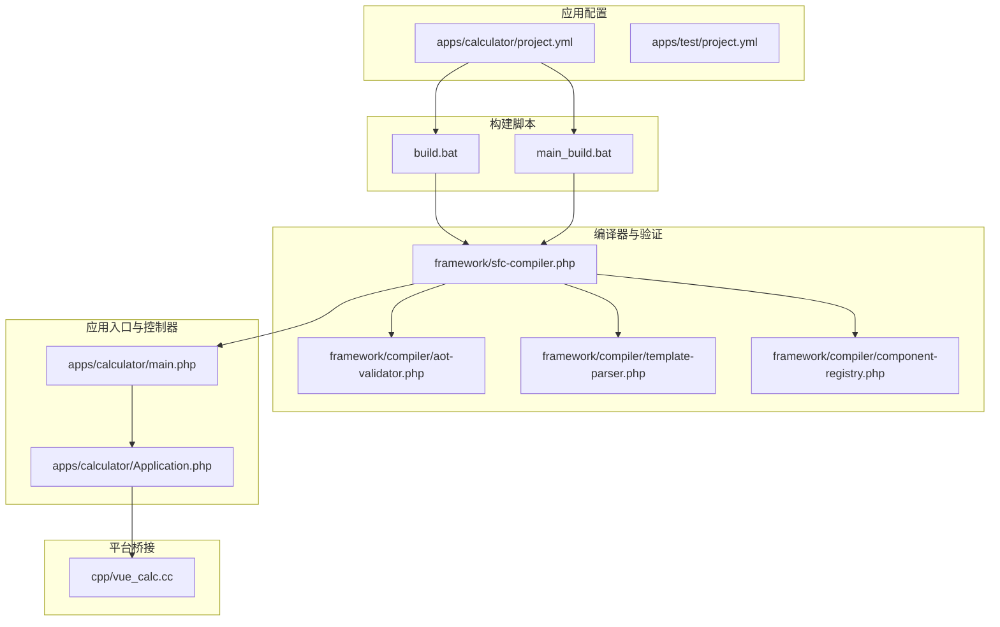
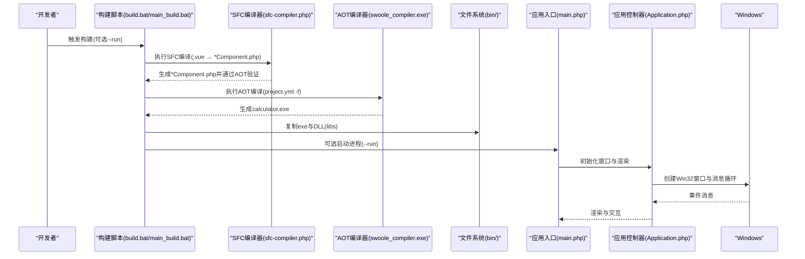
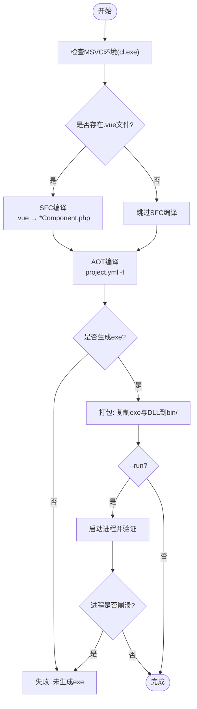
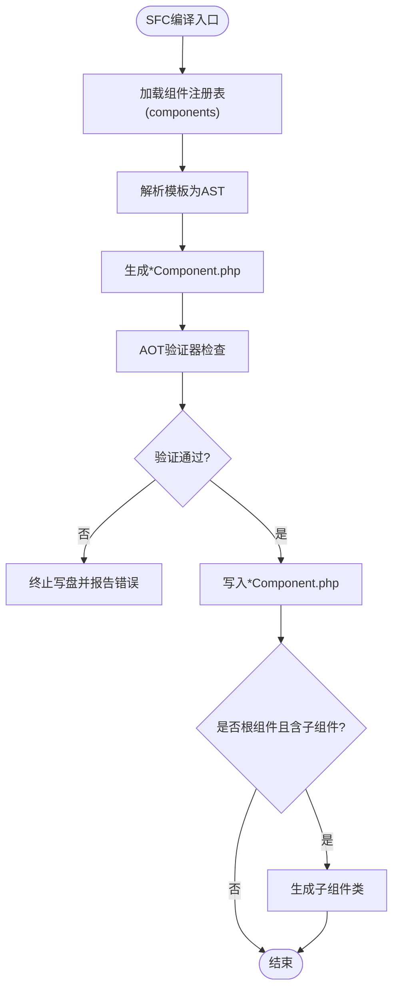
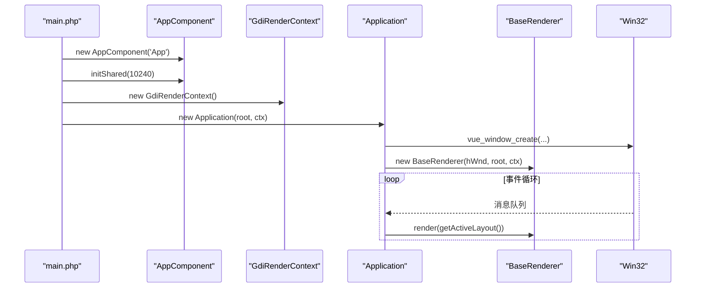
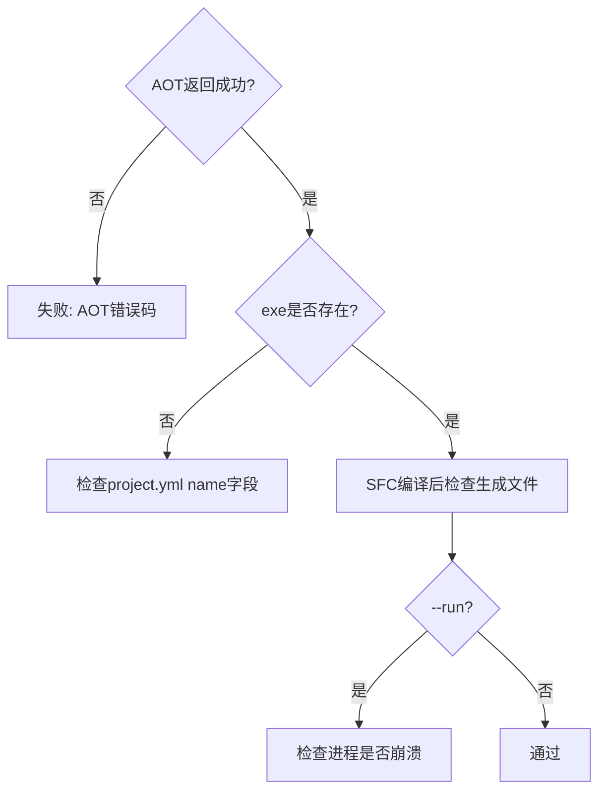
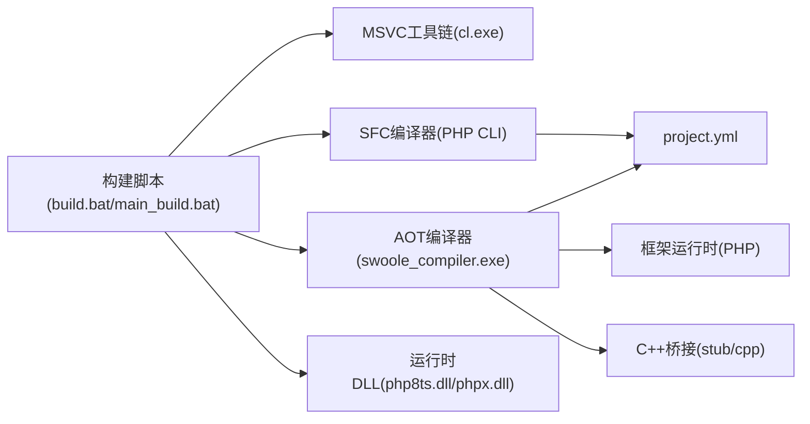

# 打包和分发

<cite>
**本文引用的文件**
- [build.bat](file://build.bat)
- [main_build.bat](file://main_build.bat)
- [apps/calculator/project.yml](file://apps/calculator/project.yml)
- [apps/test/project.yml](file://apps/test/project.yml)
- [framework/sfc-compiler.php](file://framework/sfc-compiler.php)
- [framework/compiler/aot-validator.php](file://framework/compiler/aot-validator.php)
- [framework/compiler/template-parser.php](file://framework/compiler/template-parser.php)
- [framework/compiler/component-registry.php](file://framework/compiler/component-registry.php)
- [apps/calculator/main.php](file://apps/calculator/main.php)
- [apps/calculator/Application.php](file://apps/calculator/Application.php)
- [cpp/vue_calc.cc](file://cpp/vue_calc.cc)
- [docs/构建编译流程参考.md](file://docs/构建编译流程参考.md)
</cite>

## 目录
1. [简介](#简介)
2. [项目结构](#项目结构)
3. [核心组件](#核心组件)
4. [架构总览](#架构总览)
5. [详细组件分析](#详细组件分析)
6. [依赖分析](#依赖分析)
7. [性能考虑](#性能考虑)
8. [故障排查指南](#故障排查指南)
9. [结论](#结论)
10. [附录](#附录)

## 简介
本指南面向VueCalc项目的打包与分发，围绕构建脚本的打包流程展开，覆盖可执行文件、DLL库与资源文件的收集与组织；阐述打包目录结构与命名规范（尤其是bin目录组织与文件权限）；深入分析打包过程中的文件验证机制（完整性与依赖校验）；给出分发包创建策略（安装程序、便携版与在线更新思路）；并提供打包优化技巧（压缩、增量更新、多平台兼容）与常见问题解决方案及自动化分发最佳实践。

## 项目结构
- 构建脚本
  - build.bat：非交互式构建，执行SFC编译、AOT编译与打包，并可选运行验证。
  - main_build.bat：交互式构建器，扫描apps目录、选择应用、执行完整构建流水线。
- 应用配置
  - apps/*/project.yml：定义应用名称、版本、编译模式、源文件集合与组件注册表。
- 编译器与验证
  - framework/sfc-compiler.php：SFC编译器，将.vue组件预处理为*Component.php并进行AOT验证。
  - framework/compiler/aot-validator.php：AOT兼容性验证器，检测潜在AOT失败模式。
  - framework/compiler/template-parser.php：模板解析器，支持递归下降解析。
  - framework/compiler/component-registry.php：组件注册表，将自定义标签映射到.vue源文件。
- 应用入口与控制器
  - apps/calculator/main.php：应用入口，创建根组件、渲染上下文与应用控制器。
  - apps/calculator/Application.php：应用控制器，负责窗口初始化、事件循环、布局收集与渲染调度。
- 平台桥接
  - cpp/vue_calc.cc：Win32 API薄层，提供窗口、消息与GDI绘制原语。

**图表来源**
- [build.bat](file://build.bat)
- [main_build.bat](file://main_build.bat)
- [framework/sfc-compiler.php](file://framework/sfc-compiler.php)
- [framework/compiler/aot-validator.php](file://framework/compiler/aot-validator.php)
- [framework/compiler/template-parser.php](file://framework/compiler/template-parser.php)
- [framework/compiler/component-registry.php](file://framework/compiler/component-registry.php)
- [apps/calculator/main.php](file://apps/calculator/main.php)
- [apps/calculator/Application.php](file://apps/calculator/Application.php)
- [cpp/vue_calc.cc](file://cpp/vue_calc.cc)
- [apps/calculator/project.yml](file://apps/calculator/project.yml)

**章节来源**
- [build.bat](file://build.bat)
- [main_build.bat](file://main_build.bat)
- [apps/calculator/project.yml](file://apps/calculator/project.yml)
- [apps/test/project.yml](file://apps/test/project.yml)
- [docs/构建编译流程参考.md](file://docs/构建编译流程参考.md)

## 核心组件
- 构建脚本
  - build.bat：非交互式构建，包含SFC编译、AOT编译与打包步骤，支持--run参数进行运行验证。
  - main_build.bat：交互式构建，扫描apps目录，列出可构建应用，执行完整构建流水线。
- SFC编译器
  - 将.vue组件解析为AST，生成*Component.php文件，并在写盘前进行AOT验证。
- AOT验证器
  - 检测文件名含多余点号、const嵌套数组、变量属性/方法访问、变量函数调用、PHP8函数使用等AOT不兼容模式。
- 应用入口与控制器
  - main.php创建根组件与渲染上下文，Application负责窗口初始化、事件循环与渲染调度。
- 平台桥接
  - cpp/vue_calc.cc提供Win32窗口与GDI绘制原语，供PHP侧调用。

**章节来源**
- [build.bat](file://build.bat)
- [main_build.bat](file://main_build.bat)
- [framework/sfc-compiler.php](file://framework/sfc-compiler.php)
- [framework/compiler/aot-validator.php](file://framework/compiler/aot-validator.php)
- [apps/calculator/main.php](file://apps/calculator/main.php)
- [apps/calculator/Application.php](file://apps/calculator/Application.php)
- [cpp/vue_calc.cc](file://cpp/vue_calc.cc)

## 架构总览
下图展示从.sfc到可执行文件的端到端打包与分发路径，涵盖SFC预处理、AOT编译、打包与运行验证。

**图表来源**
- [build.bat](file://build.bat)
- [main_build.bat](file://main_build.bat)
- [framework/sfc-compiler.php](file://framework/sfc-compiler.php)
- [apps/calculator/project.yml](file://apps/calculator/project.yml)
- [apps/calculator/main.php](file://apps/calculator/main.php)
- [apps/calculator/Application.php](file://apps/calculator/Application.php)

## 详细组件分析

### 组件A：构建脚本与打包流程
- 非交互式构建（build.bat）
  - 步骤0：MSVC环境检查与初始化（vcvarsall.bat x64）。
  - 步骤1：SFC编译（若存在.vue文件），生成*Component.php与常量文件。
  - 步骤2：AOT编译（PHP→C++→exe），确保php8embed.lib存在。
  - 步骤3：打包（复制exe与DLL到bin/），输出包内容清单。
  - 步骤4：可选运行验证（--run），启动进程并检测是否崩溃。
- 交互式构建（main_build.bat）
  - 扫描apps/目录，列出包含project.yml的应用，支持循环构建。
  - 流水线与非交互式一致，但提供用户选择界面与错误恢复。

**图表来源**
- [build.bat](file://build.bat)
- [main_build.bat](file://main_build.bat)

**章节来源**
- [build.bat](file://build.bat)
- [main_build.bat](file://main_build.bat)

### 组件B：SFC编译器与AOT验证
- SFC编译器职责
  - 读取project.yml中的components映射，解析.vue模板为AST，生成*Component.php。
  - 生成getLayout()/dispatchClick()/evalCondition()等方法，支持子组件注册与布局收集。
  - 在写盘前调用AOT验证器进行兼容性检查。
- AOT验证器规则
  - 文件名最多一个点（避免C++符号冲突）。
  - 禁止const嵌套数组（全局常量未注册）。
  - 禁止变量属性/方法访问与变量函数调用（类型推断失败）。
  - 警告PHP8函数使用（跨版本兼容性）。

**图表来源**
- [framework/sfc-compiler.php](file://framework/sfc-compiler.php)
- [framework/compiler/aot-validator.php](file://framework/compiler/aot-validator.php)
- [framework/compiler/component-registry.php](file://framework/compiler/component-registry.php)

**章节来源**
- [framework/sfc-compiler.php](file://framework/sfc-compiler.php)
- [framework/compiler/aot-validator.php](file://framework/compiler/aot-validator.php)
- [framework/compiler/component-registry.php](file://framework/compiler/component-registry.php)

### 组件C：应用入口与控制器
- 应用入口（main.php）
  - 创建根组件AppComponent，初始化共享内存，创建GdiRenderContext与Application。
  - 启动事件循环。
- 应用控制器（Application.php）
  - 初始化窗口、挂载组件树、渲染调度、事件循环与点击分发。
  - 采用数据驱动渲染，仅在组件状态变更后重绘。

**图表来源**
- [apps/calculator/main.php](file://apps/calculator/main.php)
- [apps/calculator/Application.php](file://apps/calculator/Application.php)
- [cpp/vue_calc.cc](file://cpp/vue_calc.cc)

**章节来源**
- [apps/calculator/main.php](file://apps/calculator/main.php)
- [apps/calculator/Application.php](file://apps/calculator/Application.php)
- [cpp/vue_calc.cc](file://cpp/vue_calc.cc)

### 组件D：打包目录结构与文件组织
- bin目录组织
  - 目标：存放可执行文件与运行时依赖DLL，便于分发与便携部署。
  - 文件清单：calculator.exe（来自AOT编译）、php8ts.dll、phpx.dll。
  - 输出清单：脚本打印bin/下所有文件及其字节大小，便于核验完整性。
- 文件命名规范
  - SFC编译器生成的类文件使用[a-zA-Z0-9_]，避免点号，防止C++符号名冲突。
  - project.yml中name字段决定exe文件名（name.exe）。
- 文件权限
  - Windows环境下，复制到bin/的文件通常无需特殊权限；建议以标准用户权限执行构建脚本，避免UAC弹窗影响CI/自动化。

**章节来源**
- [build.bat](file://build.bat)
- [main_build.bat](file://main_build.bat)
- [framework/sfc-compiler.php](file://framework/sfc-compiler.php)
- [apps/calculator/project.yml](file://apps/calculator/project.yml)

### 组件E：文件验证机制
- AOT编译后验证
  - 若AOT返回成功但未生成exe，脚本提示检查project.yml的name字段。
- SFC编译后验证
  - 检查生成的*Component.php与constants.php是否存在，缺失时报警告。
- 运行时验证（--run）
  - 启动进程，短暂等待后检查进程是否仍在运行，否则判定崩溃。

**图表来源**
- [build.bat](file://build.bat)
- [main_build.bat](file://main_build.bat)

**章节来源**
- [build.bat](file://build.bat)
- [main_build.bat](file://main_build.bat)

### 组件F：分发包创建与分发策略
- 安装程序制作
  - 基于bin/中的exe与DLL，使用安装器工具（如NSIS/Wix/Inno Setup）创建安装包。
  - 安装时可选择目标目录，复制exe与DLL到Program Files或用户目录。
- 便携版打包
  - 将bin/作为便携包根目录，随包提供简要使用说明与依赖DLL。
  - 适合无需管理员权限的场景。
- 在线更新机制
  - 通过版本号（project.yml version）与远程清单比对，增量下载差异文件。
  - 更新前备份旧版本，更新后进行简单自检（启动验证）。

**章节来源**
- [apps/calculator/project.yml](file://apps/calculator/project.yml)
- [docs/构建编译流程参考.md](file://docs/构建编译流程参考.md)

### 组件G：打包优化技巧
- 文件压缩
  - 便携版可对DLL与资源进行压缩（如7z），发布时解压到临时目录运行。
- 增量更新
  - 以文件哈希或版本号对比，仅传输变更文件，降低带宽占用。
- 多平台兼容性
  - 当前为Windows x64原生GUI；若扩展到Linux/macOS，需分别准备对应DLL与依赖库。
  - 保持bin/目录结构统一，便于自动化脚本识别。

**章节来源**
- [docs/构建编译流程参考.md](file://docs/构建编译流程参考.md)

## 依赖分析
- 构建脚本依赖
  - MSVC工具链（cl.exe）：通过vcvarsall.bat初始化。
  - Swoole编译器与PHP CLI：用于SFC预处理与AOT编译。
  - 运行时DLL：php8ts.dll、phpx.dll。
- 应用依赖
  - 项目配置（project.yml）：定义sources与components映射。
  - 框架运行时：ComponentInterface.php、BaseComponent.php、ReactiveComponent.php等。
  - C++桥接：stub与cpp目录下的绑定与Win32实现。

**图表来源**
- [build.bat](file://build.bat)
- [main_build.bat](file://main_build.bat)
- [apps/calculator/project.yml](file://apps/calculator/project.yml)
- [framework/sfc-compiler.php](file://framework/sfc-compiler.php)
- [cpp/vue_calc.cc](file://cpp/vue_calc.cc)

**章节来源**
- [build.bat](file://build.bat)
- [main_build.bat](file://main_build.bat)
- [apps/calculator/project.yml](file://apps/calculator/project.yml)

## 性能考虑
- 渲染性能
  - Application采用数据驱动渲染，仅在组件状态变更后重绘，降低CPU占用。
  - 使用双缓冲绘制（cpp层）提升画面流畅度。
- 构建性能
  - SFC编译仅在存在.vue时执行，避免不必要的预处理。
  - AOT编译前确保php8embed.lib就位，减少重试成本。

**章节来源**
- [apps/calculator/Application.php](file://apps/calculator/Application.php)
- [cpp/vue_calc.cc](file://cpp/vue_calc.cc)

## 故障排查指南
- 常见AOT错误与修复
  - cl.exe未找到：通过vcvarsall.bat x64初始化MSVC环境。
  - 顶层游离代码：将所有代码移入函数或类内部。
  - 变量先使用后定义：为变量提供初始值。
  - 变量类型改变：避免同一变量在不同分支赋不同类型。
  - 文件名含点号：使用下划线替换，避免C++符号冲突。
- SFC编译错误
  - 缺少<script lang="php">块：确保.vue包含该块。
  - CSS正则分隔符冲突：避免使用#作为分隔符，优先使用~。
- 运行时崩溃
  - --run模式下进程立即退出：检查异常堆栈与日志输出。

**章节来源**
- [build.bat](file://build.bat)
- [main_build.bat](file://main_build.bat)
- [docs/构建编译流程参考.md](file://docs/构建编译流程参考.md)

## 结论
VueCalc的打包与分发以构建脚本为核心，串联SFC预处理、AOT编译与打包流程。通过严格的文件命名规范与AOT验证机制，确保产物在Windows x64平台上的稳定运行。结合bin目录的标准化组织与运行验证，可快速形成可分发的便携版与安装包，并为后续在线更新与多平台扩展奠定基础。

## 附录
- 一键构建与交互式构建
  - 非交互式：build.bat <app-name> [--run]
  - 交互式：main_build.bat（扫描apps/并选择应用）
- 产物与路径
  - AOT输出：calculator.exe（位于框架根目录）
  - 打包输出：apps/<app>/bin/（包含exe与DLL）

**章节来源**
- [build.bat](file://build.bat)
- [main_build.bat](file://main_build.bat)
- [apps/calculator/project.yml](file://apps/calculator/project.yml)