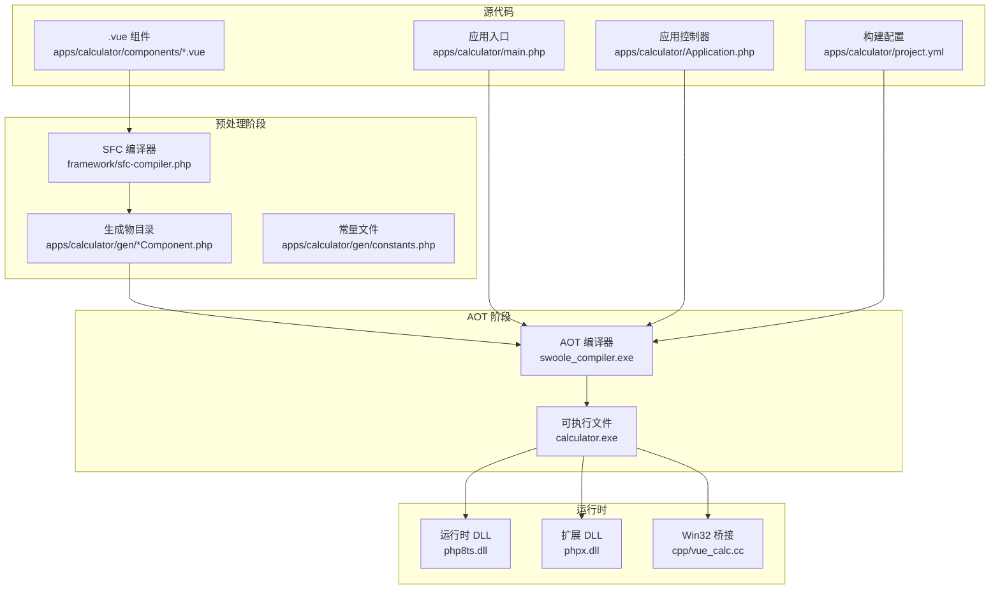
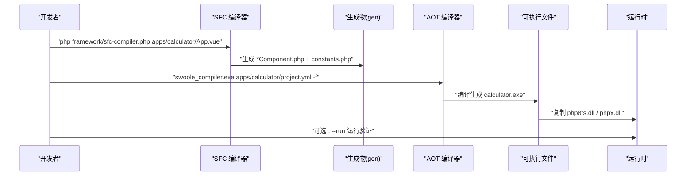
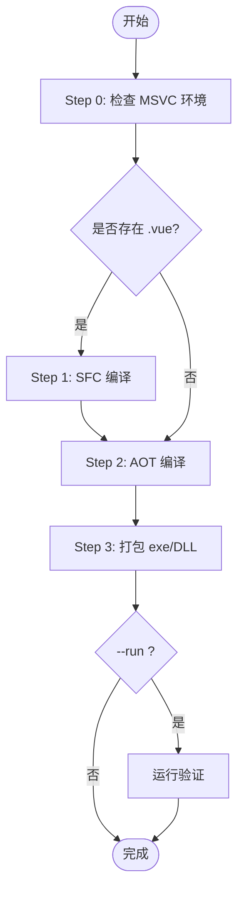
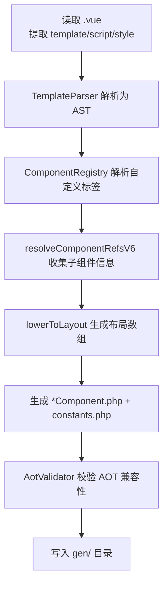
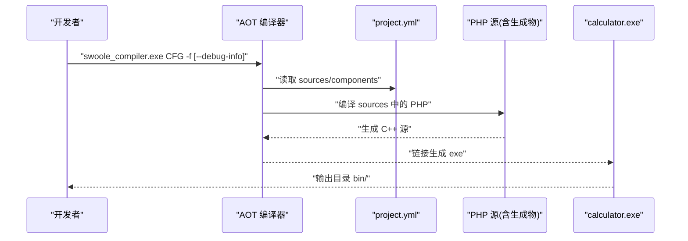
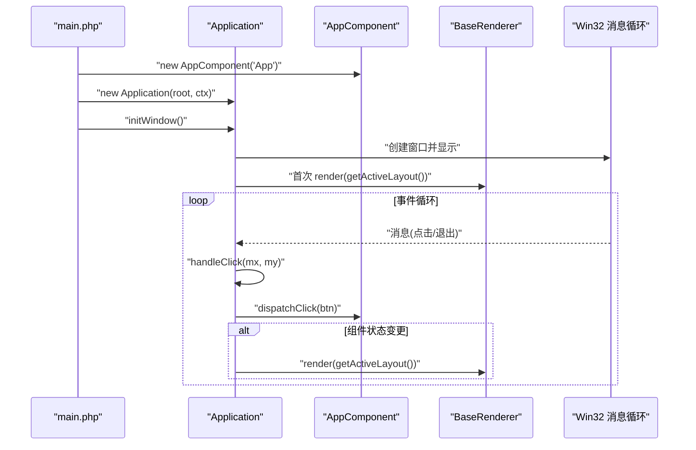
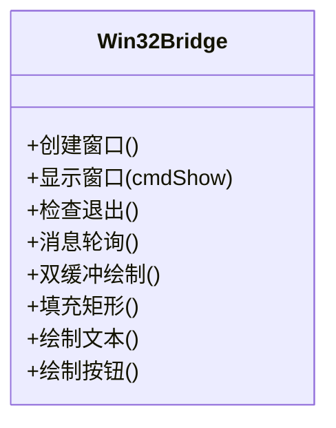
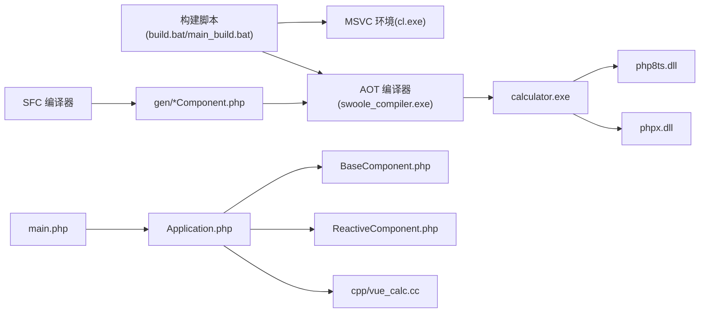

# 构建和部署

<cite>
**本文引用的文件**   
- [build.bat](file://build.bat)
- [main_build.bat](file://main_build.bat)
- [apps/calculator/project.yml](file://apps/calculator/project.yml)
- [framework/sfc-compiler.php](file://framework/sfc-compiler.php)
- [framework/compiler/template-parser.php](file://framework/compiler/template-parser.php)
- [framework/compiler/aot-validator.php](file://framework/compiler/aot-validator.php)
- [framework/compiler/script-analyzer.php](file://framework/compiler/script-analyzer.php)
- [framework/compiler/component-registry.php](file://framework/compiler/component-registry.php)
- [apps/calculator/main.php](file://apps/calculator/main.php)
- [apps/calculator/Application.php](file://apps/calculator/Application.php)
- [framework/BaseComponent.php](file://framework/BaseComponent.php)
- [framework/ReactiveComponent.php](file://framework/ReactiveComponent.php)
- [cpp/vue_calc.cc](file://cpp/vue_calc.cc)
- [docs/构建编译流程参考.md](file://docs/构建编译流程参考.md)
</cite>

## 目录
1. [简介](#简介)
2. [项目结构](#项目结构)
3. [核心组件](#核心组件)
4. [架构总览](#架构总览)
5. [详细组件分析](#详细组件分析)
6. [依赖关系分析](#依赖关系分析)
7. [性能考量](#性能考量)
8. [故障排除指南](#故障排除指南)
9. [结论](#结论)
10. [附录](#附录)

## 简介
本指南面向 VueCalc 项目，提供从源代码到可执行文件的完整构建与部署说明。内容覆盖：
- 构建流程的每一步：SFC 预处理、AOT 编译、打包与运行验证
- 构建脚本工作机制：参数解析、路径计算、环境检查、错误码与回退
- 编译参数与配置：project.yml 的 sources、components、输出命名等
- 依赖管理策略：框架运行时、C++ 桥接层、生成物目录
- 打包与分发：二进制与运行时 DLL 的复制与校验
- CI/CD 与自动化：批处理脚本、开发者命令提示符、环境初始化
- 故障排除与性能优化：常见错误定位、AOT 兼容性规则、调试信息

## 项目结构
VueCalc 采用“SFC 预处理 + AOT 编译”的双阶段流水线：
- 源代码：.vue 组件与 PHP 应用入口
- 预处理：SFC 编译器将 .vue 转换为 *Component.php 与常量文件
- AOT 编译：swoole_compiler.exe 将 PHP 源（含生成物）编译为 Windows x64 可执行文件
- 运行时：exe + php8ts.dll + phpx.dll

**图表来源**
- [build.bat:140-350](file://build.bat#L140-L350)
- [main_build.bat:208-383](file://main_build.bat#L208-L383)
- [framework/sfc-compiler.php:226-601](file://framework/sfc-compiler.php#L226-L601)
- [apps/calculator/project.yml:12-27](file://apps/calculator/project.yml#L12-L27)

**章节来源**
- [docs/构建编译流程参考.md:23-85](file://docs/构建编译流程参考.md#L23-L85)

## 核心组件
- 构建脚本
  - build.bat：非交互式构建，支持 --run 参数进行运行验证
  - main_build.bat：交互式构建器，支持多应用选择与循环构建
- SFC 编译器
  - 将 .vue 模板解析为 AST，生成 *Component.php 与 constants.php
  - 通过 AOT 验证器确保生成代码满足 AOT 兼容性
- AOT 编译器
  - 依据 project.yml 的 sources 与 components，将 PHP 源（含生成物）编译为 exe
- 应用入口与控制器
  - main.php：创建根组件、渲染上下文与应用控制器，启动事件循环
  - Application.php：窗口初始化、事件循环、布局收集与点击分发
- 组件基类与响应式基类
  - BaseComponent：组件树结构与生命周期钩子
  - ReactiveComponent：脏标记与条件求值接口
- C++ 桥接层
  - cpp/vue_calc.cc：封装 Win32 API，提供窗口、消息与 GDI 绘制原语

**章节来源**
- [build.bat:1-350](file://build.bat#L1-L350)
- [main_build.bat:1-404](file://main_build.bat#L1-L404)
- [framework/sfc-compiler.php:1-819](file://framework/sfc-compiler.php#L1-L819)
- [apps/calculator/main.php:19-48](file://apps/calculator/main.php#L19-L48)
- [apps/calculator/Application.php:15-322](file://apps/calculator/Application.php#L15-L322)
- [framework/BaseComponent.php:16-177](file://framework/BaseComponent.php#L16-L177)
- [framework/ReactiveComponent.php:14-90](file://framework/ReactiveComponent.php#L14-L90)
- [cpp/vue_calc.cc:1-157](file://cpp/vue_calc.cc#L1-L157)

## 架构总览
下图展示从 .vue 到 exe 的端到端流程，以及关键文件与职责：

**图表来源**
- [build.bat:177-280](file://build.bat#L177-L280)
- [main_build.bat:231-334](file://main_build.bat#L231-L334)
- [framework/sfc-compiler.php:226-601](file://framework/sfc-compiler.php#L226-L601)
- [apps/calculator/project.yml:12-27](file://apps/calculator/project.yml#L12-L27)

## 详细组件分析

### 构建脚本：build.bat 与 main_build.bat
- 参数与环境
  - 自动定位 swoole_compile* 目录，解析 PHP CLI、swoole_compiler、DLL 路径
  - 通过 vcvarsall.bat 初始化 MSVC 环境，确保 cl.exe 可用
- 步骤划分
  - Step 0：MSVC 环境检查
  - Step 1：SFC 编译（若存在 .vue）
  - Step 2：AOT 编译（project.yml 驱动）
  - Step 3：打包（复制 exe 与 DLL 至 bin/）
  - Step 4：可选运行验证（--run）
- 错误码与回退
  - 1：参数/前置检查失败
  - 2：SFC 编译失败
  - 3：AOT 编译失败
  - 4：打包失败
  - 5：运行时崩溃
- 交互式构建
  - main_build.bat 支持多应用扫描与选择，循环构建与错误恢复

**图表来源**
- [build.bat:140-350](file://build.bat#L140-L350)
- [main_build.bat:208-383](file://main_build.bat#L208-L383)

**章节来源**
- [build.bat:1-350](file://build.bat#L1-L350)
- [main_build.bat:1-404](file://main_build.bat#L1-L404)

### SFC 编译器：从 .vue 到 *Component.php
- 输入与解析
  - 读取 .vue 的 template/script/style 块
  - 使用 TemplateParser 将模板解析为 AST，支持 app/rect/text/grid/btn 与自定义组件标签
  - 通过 ComponentRegistry 将自定义标签映射到 .vue 源文件
- 组件解析与布局生成
  - resolveComponentRefsV6：解析子组件引用，收集 registerChildren 信息
  - lowerToLayout：将 AST 转换为 elements/buttons 等布局数组，收集 bindKeys/handlerMap/condProps
- 代码生成与注入
  - 生成 getLayout/registerChildren/getBaseComponents/dispatchClick/evalCondition 等方法
  - 使用 ScriptAnalyzer 自动注入脏标记，减少手写样板
- AOT 验证
  - AotValidator 校验生成代码的 AOT 兼容性（文件名、const 数组、变量属性/方法访问、PHP8 函数、顶层可执行语句、变量函数调用等）

**图表来源**
- [framework/sfc-compiler.php:261-601](file://framework/sfc-compiler.php#L261-L601)
- [framework/compiler/template-parser.php:88-686](file://framework/compiler/template-parser.php#L88-L686)
- [framework/compiler/aot-validator.php:37-121](file://framework/compiler/aot-validator.php#L37-L121)
- [framework/compiler/script-analyzer.php:27-243](file://framework/compiler/script-analyzer.php#L27-L243)
- [framework/compiler/component-registry.php:26-52](file://framework/compiler/component-registry.php#L26-L52)

**章节来源**
- [framework/sfc-compiler.php:1-819](file://framework/sfc-compiler.php#L1-L819)
- [framework/compiler/template-parser.php:1-869](file://framework/compiler/template-parser.php#L1-L869)
- [framework/compiler/aot-validator.php:1-207](file://framework/compiler/aot-validator.php#L1-L207)
- [framework/compiler/script-analyzer.php:1-281](file://framework/compiler/script-analyzer.php#L1-L281)
- [framework/compiler/component-registry.php:1-70](file://framework/compiler/component-registry.php#L1-L70)

### AOT 编译：project.yml 驱动的 PHP→exe 流程
- sources 配置
  - 显式列出应用入口、控制器、生成物目录与框架运行时文件
  - 严格顺序：接口 → 基类 → 实现类
  - 目录递归包含：./gen 自动包含所有 .php
- components 配置
  - 供 SFC 编译器读取，映射自定义标签到 .vue 源文件
- 编译参数
  - -f：强制输出
  - --debug-info：启用调试信息（main_build.bat 使用）
- 输出与校验
  - 生成 calculator.exe，校验存在性
  - 若成功但未生成 exe，提示检查 project.yml 的 name 字段

**图表来源**
- [apps/calculator/project.yml:12-27](file://apps/calculator/project.yml#L12-L27)
- [build.bat:253-277](file://build.bat#L253-L277)
- [main_build.bat:307-331](file://main_build.bat#L307-L331)

**章节来源**
- [apps/calculator/project.yml:1-34](file://apps/calculator/project.yml#L1-L34)
- [build.bat:218-280](file://build.bat#L218-L280)
- [main_build.bat:272-334](file://main_build.bat#L272-L334)

### 应用入口与控制器：事件循环与渲染
- main.php
  - 创建 AppComponent 根组件、GdiRenderContext 渲染上下文
  - 初始化 Application 并启动 run()
- Application.php
  - initWindow：创建窗口、显示、挂载初始组件树
  - run：渲染器首次渲染，事件循环中根据脏标记重绘
  - getActiveLayout：递归收集布局数据并应用累积偏移
  - handleClick：分层命中测试，分发到根组件 dispatchClick

**图表来源**
- [apps/calculator/main.php:19-48](file://apps/calculator/main.php#L19-L48)
- [apps/calculator/Application.php:51-322](file://apps/calculator/Application.php#L51-L322)
- [framework/BaseComponent.php:16-177](file://framework/BaseComponent.php#L16-L177)
- [framework/ReactiveComponent.php:14-90](file://framework/ReactiveComponent.php#L14-L90)

**章节来源**
- [apps/calculator/main.php:1-48](file://apps/calculator/main.php#L1-L48)
- [apps/calculator/Application.php:1-322](file://apps/calculator/Application.php#L1-L322)
- [framework/BaseComponent.php:1-177](file://framework/BaseComponent.php#L1-L177)
- [framework/ReactiveComponent.php:1-90](file://framework/ReactiveComponent.php#L1-L90)

### C++ 桥接层：Win32 API 与 GDI
- 功能
  - 窗口创建、显示、消息轮询与退出检测
  - 双缓冲绘制：BeginPaint/EndPaint，矩形填充、文本绘制、按钮绘制
- 与 PHP 的交互
  - 通过 php:: namespace 的 API 暴露给 PHP 调用（由 stub 与编译器桥接）

**图表来源**
- [cpp/vue_calc.cc:36-157](file://cpp/vue_calc.cc#L36-L157)

**章节来源**
- [cpp/vue_calc.cc:1-157](file://cpp/vue_calc.cc#L1-L157)

## 依赖关系分析
- 构建脚本依赖
  - MSVC 环境：vcvarsall.bat 初始化 cl.exe
  - 编译器：swoole_compiler.exe、php8embed.lib
  - 运行时：php8ts.dll、phpx.dll
- 代码依赖
  - 应用入口依赖根组件与渲染上下文
  - Application 依赖 BaseComponent/ReactiveComponent 与渲染器
  - SFC 编译器依赖模板解析、CSS 映射、组件注册、脚本分析与 AOT 验证

**图表来源**
- [build.bat:148-171](file://build.bat#L148-L171)
- [build.bat:290-312](file://build.bat#L290-L312)
- [framework/sfc-compiler.php:244-248](file://framework/sfc-compiler.php#L244-L248)
- [apps/calculator/main.php:30-38](file://apps/calculator/main.php#L30-L38)
- [apps/calculator/Application.php:32-76](file://apps/calculator/Application.php#L32-L76)

**章节来源**
- [build.bat:1-350](file://build.bat#L1-L350)
- [main_build.bat:1-404](file://main_build.bat#L1-L404)
- [framework/sfc-compiler.php:1-819](file://framework/sfc-compiler.php#L1-L819)
- [apps/calculator/main.php:1-48](file://apps/calculator/main.php#L1-L48)
- [apps/calculator/Application.php:1-322](file://apps/calculator/Application.php#L1-L322)
- [framework/BaseComponent.php:1-177](file://framework/BaseComponent.php#L1-L177)
- [framework/ReactiveComponent.php:1-90](file://framework/ReactiveComponent.php#L1-L90)
- [cpp/vue_calc.cc:1-157](file://cpp/vue_calc.cc#L1-L157)

## 性能考量
- 渲染效率
  - 数据驱动渲染：仅在组件状态变更后重绘，降低 CPU 占用
  - 分层命中测试：从最高活跃层向下逆序命中，提升点击响应效率
- 组件树遍历
  - 使用 array_keys + for 循环遍历关联数组，避免 foreach 的额外开销
- 布局计算
  - 按编译时计算网格按钮坐标，运行时仅做偏移累加，减少动态计算
- AOT 兼容性对性能的影响
  - 避免反射与动态加载，保证编译期确定性，获得更稳定的运行时性能

[本节为通用指导，无需具体文件分析]

## 故障排除指南
- SFC 编译器错误
  - 缺少模板/脚本块：确保 .vue 含 template/script/style
  - 未知标签：检查 project.yml 的 components 映射
  - 正则分隔符冲突：避免使用与 CSS 颜色冲突的 #，改用 ~
- AOT 编译器错误
  - cl.exe 未找到：通过 vcvarsall.bat 初始化 MSVC 环境
  - 顶层可执行语句：将 require_once/include 移至函数内或删除（由 sources 自动链接）
  - 变量类型变化：避免同一变量从 string 赋值为 object
  - const 复杂数组：改为 function 返回数组
  - 文件名含点号：改用下划线，避免无效 C++ 符号
  - 未定义变量：先赋初始值（如 null）
- 打包与运行
  - 未生成 exe：检查 project.yml 的 name 字段与输出路径
  - DLL 缺失：确保 php8ts.dll 与 phpx.dll 复制到 bin/
  - 运行崩溃：使用 --run 参数验证，查看进程是否立即退出

**章节来源**
- [docs/构建编译流程参考.md:207-231](file://docs/构建编译流程参考.md#L207-L231)
- [build.bat:190-277](file://build.bat#L190-L277)
- [main_build.bat:244-331](file://main_build.bat#L244-L331)
- [framework/compiler/aot-validator.php:37-121](file://framework/compiler/aot-validator.php#L37-L121)

## 结论
VueCalc 的构建体系以“SFC 预处理 + AOT 编译”为核心，通过严格的 AOT 兼容性规则与完善的构建脚本，实现了从 .vue 到 Windows x64 可执行文件的自动化流水线。配合清晰的项目结构与组件职责划分，开发者可以高效地迭代界面与逻辑，同时保持构建稳定性与可维护性。

[本节为总结，无需具体文件分析]

## 附录
- 快速参考
  - 环境初始化：vcvarsall.bat x64
  - SFC 编译：php framework/sfc-compiler.php apps/calculator/App.vue
  - AOT 编译：swoole_compiler.exe apps/calculator/project.yml -f
  - 一键构建：build.bat / main_build.bat
  - 产物：calculator.exe (~360KB)，Windows x64 GUI
- AOT 兼容性清单
  - 禁止：动态变量、魔术方法、同变量多类型赋值、反射、eval/include、含 \0 的字符串
  - 必须：所有代码在函数内、变量先定义后使用、类型不可变、文件名仅含 a-zA-Z0-9_、接口在 sources 中、数组遍历使用安全模式

**章节来源**
- [docs/构建编译流程参考.md:290-324](file://docs/构建编译流程参考.md#L290-L324)