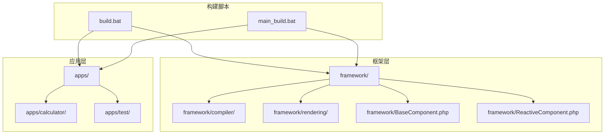
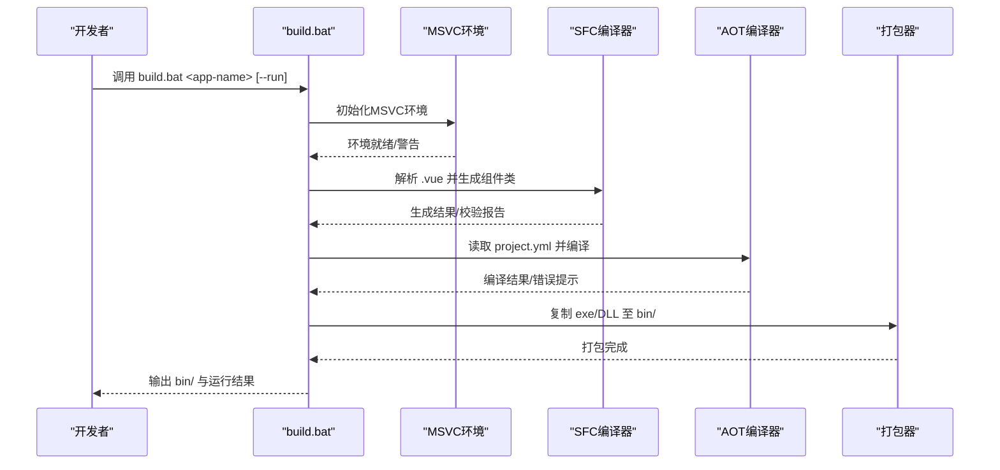
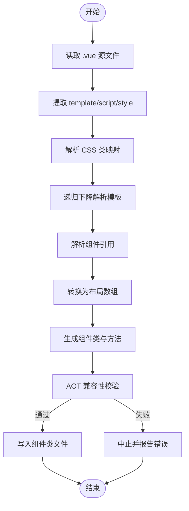
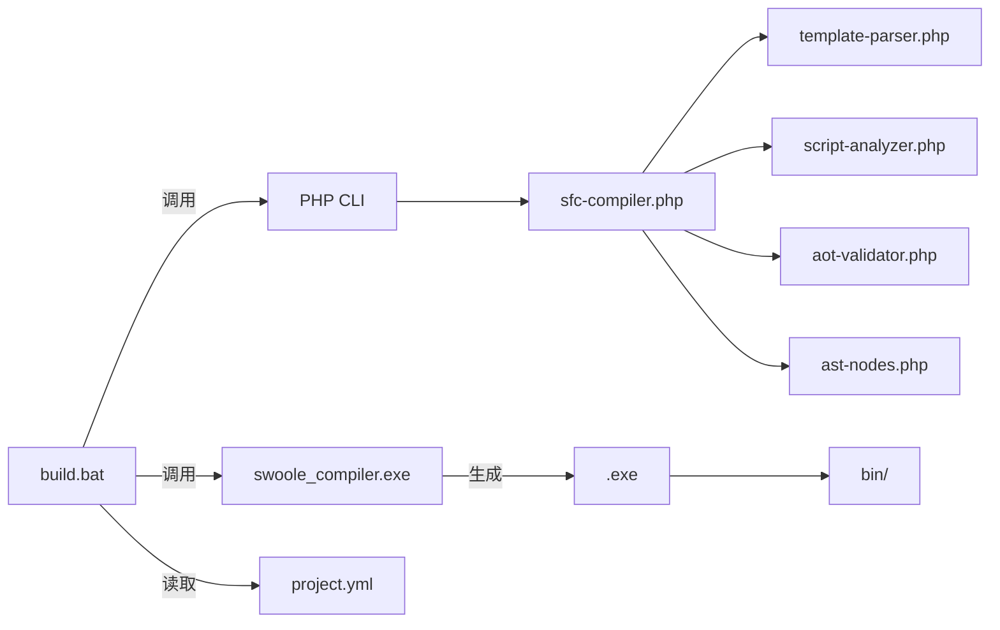

# 构建流程详解

<cite>
**本文引用的文件列表**
- [build.bat](file://build.bat)
- [main_build.bat](file://main_build.bat)
- [sfc-compiler.php](file://framework/sfc-compiler.php)
- [aot-validator.php](file://framework/compiler/aot-validator.php)
- [template-parser.php](file://framework/compiler/template-parser.php)
- [script-analyzer.php](file://framework/compiler/script-analyzer.php)
- [ast-nodes.php](file://framework/compiler/ast-nodes.php)
- [calculator project.yml](file://apps/calculator/project.yml)
- [test project.yml](file://apps/test/project.yml)
</cite>

## 目录
1. [简介](#简介)
2. [项目结构](#项目结构)
3. [核心组件](#核心组件)
4. [架构总览](#架构总览)
5. [详细组件分析](#详细组件分析)
6. [依赖关系分析](#依赖关系分析)
7. [性能考量](#性能考量)
8. [故障排查指南](#故障排查指南)
9. [结论](#结论)

## 简介
本文面向VueCalc项目的构建流程，聚焦于非交互式构建脚本build.bat的四个核心步骤：MSVC编译环境初始化、SFC编译、AOT编译与打包。文档深入解释每个步骤的执行逻辑、参数传递、错误处理机制，并阐述构建脚本如何检测和处理异常情况（编译器缺失、环境配置错误、文件依赖问题）。同时，说明路径计算、文件查找与输出验证机制，并提供可视化图表与代码示例路径，帮助开发者全面理解构建过程的技术细节与实现原理。

## 项目结构
VueCalc采用“框架+应用”的分层组织：
- 框架层：compiler、rendering、BaseComponent等核心组件与编译器模块
- 应用层：apps/<app-name>包含具体应用的源码与配置
- 构建脚本：build.bat负责自动化构建；main_build.bat提供交互式构建体验

图示来源
- [build.bat](file://build.bat)
- [main_build.bat](file://main_build.bat)
- [sfc-compiler.php](file://framework/sfc-compiler.php)

章节来源
- [build.bat](file://build.bat)
- [main_build.bat](file://main_build.bat)

## 核心组件
- 构建脚本：负责路径计算、前置检查、四步构建流水线、错误处理与输出验证
- SFC编译器：解析.vue单文件，生成组件类与布局数组，进行AOT兼容性校验
- AOT校验器：在生成文件写盘前进行AOT约束检查，避免后续编译失败
- 模板解析器：递归下降解析模板，生成AST并转换为布局数组
- 脚本分析器：自动注入脏标记，简化响应式状态更新

章节来源
- [sfc-compiler.php](file://framework/sfc-compiler.php)
- [aot-validator.php](file://framework/compiler/aot-validator.php)
- [template-parser.php](file://framework/compiler/template-parser.php)
- [script-analyzer.php](file://framework/compiler/script-analyzer.php)

## 架构总览
构建流程以build.bat为核心，按顺序执行四个步骤，每一步都有严格的前置检查与错误处理。整体流程如下：

图示来源
- [build.bat](file://build.bat)
- [sfc-compiler.php](file://framework/sfc-compiler.php)
- [aot-validator.php](file://framework/compiler/aot-validator.php)

## 详细组件分析

### 步骤0：MSVC编译环境初始化
- 路径计算：基于脚本所在目录定位框架根、父目录与应用目录
- 编译器定位：通过通配符查找swoole_compile*目录，确定PHP CLI、swoole_compiler与DLL路径
- 环境初始化：调用vcvarsall.bat设置x64环境；若失败则发出警告
- 可用性检查：验证cl.exe是否存在于PATH中，否则提示解决方案

关键点
- 通配符匹配swoole_compile*目录，优先在框架根目录内查找，其次在父目录查找
- 若vcvarsall.bat不存在，仍可继续执行，但AOT编译可能失败
- cl.exe缺失时直接终止并给出修复建议

章节来源
- [build.bat](file://build.bat)
- [main_build.bat](file://main_build.bat)

### 步骤1：SFC编译（仅含.vue文件时）
- 应用配置解析：检测应用目录是否存在project.yml；解析name字段决定输出exe名称
- .vue文件识别：扫描应用根目录及子目录，确定主组件文件与基础名
- 编译执行：切换到框架根目录，调用PHP CLI执行sfc-compiler.php
- 输出验证：检查gen/目录下生成的组件类文件是否存在

SFC编译器工作流
- 读取.vue文件，提取template/script/style块
- 解析CSS映射，生成样式类到GDI属性的映射
- 递归下降解析模板，生成AST
- 解析组件引用，生成子组件注册与布局数据
- 生成组件类与方法（getLayout/registerChildren/getBaseComponents等），自动注入脏标记
- AOT校验：在写盘前进行AOT兼容性检查，失败则阻止生成

图示来源
- [sfc-compiler.php](file://framework/sfc-compiler.php)
- [aot-validator.php](file://framework/compiler/aot-validator.php)
- [template-parser.php](file://framework/compiler/template-parser.php)
- [script-analyzer.php](file://framework/compiler/script-analyzer.php)
- [ast-nodes.php](file://framework/compiler/ast-nodes.php)

章节来源
- [build.bat](file://build.bat)
- [sfc-compiler.php](file://framework/sfc-compiler.php)
- [aot-validator.php](file://framework/compiler/aot-validator.php)
- [template-parser.php](file://framework/compiler/template-parser.php)
- [script-analyzer.php](file://framework/compiler/script-analyzer.php)
- [ast-nodes.php](file://framework/compiler/ast-nodes.php)

### 步骤2：AOT编译
- 环境二次确认：再次检查cl.exe是否可用
- 依赖准备：确保php8embed.lib位于编译器根目录，若不存在则尝试从SDK/lib或lib/lib拷贝
- 编译执行：切换到框架根目录，调用swoole_compiler.exe读取project.yml并编译
- 输出验证：检查目标目录是否生成exe文件，否则提示name字段问题

AOT编译常见失败原因
- 缺少MSVC cl.exe
- 顶层可执行语句（require_once/include等）
- 变量先使用后定义
- 变量类型变化（如int转string）
- 文件名包含特殊字符（仅允许字母数字下划线）

章节来源
- [build.bat](file://build.bat)
- [calculator project.yml](file://apps/calculator/project.yml)

### 步骤3：打包
- 目录准备：创建应用bin/目录
- 文件复制：将exe与必要DLL复制到bin/目录
- 内容清单：列出bin/目录内容与大小

章节来源
- [build.bat](file://build.bat)

### 步骤4：可选运行验证（--run）
- 启动进程：启动生成的exe进行验证
- 进程存活检测：通过tasklist判断进程是否仍在运行
- 清理进程：验证结束后强制结束进程

章节来源
- [build.bat](file://build.bat)

## 依赖关系分析
构建脚本与编译器模块之间的依赖关系如下：

图示来源
- [build.bat](file://build.bat)
- [sfc-compiler.php](file://framework/sfc-compiler.php)
- [template-parser.php](file://framework/compiler/template-parser.php)
- [script-analyzer.php](file://framework/compiler/script-analyzer.php)
- [aot-validator.php](file://framework/compiler/aot-validator.php)
- [ast-nodes.php](file://framework/compiler/ast-nodes.php)
- [calculator project.yml](file://apps/calculator/project.yml)

章节来源
- [build.bat](file://build.bat)
- [sfc-compiler.php](file://framework/sfc-compiler.php)
- [template-parser.php](file://framework/compiler/template-parser.php)
- [script-analyzer.php](file://framework/compiler/script-analyzer.php)
- [aot-validator.php](file://framework/compiler/aot-validator.php)
- [ast-nodes.php](file://framework/compiler/ast-nodes.php)
- [calculator project.yml](file://apps/calculator/project.yml)

## 性能考量
- 路径计算与文件查找：使用通配符匹配swoole_compile*目录，减少硬编码路径依赖
- 编译阶段分离：SFC编译与AOT编译解耦，便于并行优化与增量构建
- 输出验证：在关键节点进行文件存在性检查，避免无效的后续步骤
- 交互式构建：main_build.bat提供用户选择与循环构建，适合多应用场景

## 故障排查指南
常见异常与处理
- 编译器缺失
  - 现象：找不到swoole_compile*目录或PHP CLI、swoole_compiler不存在
  - 处理：确保swoole_compiler安装在框架根或父目录，并修正VCVARSALL路径
- 环境配置错误
  - 现象：vcvarsall.bat不存在或cl.exe不在PATH中
  - 处理：从Developer Command Prompt for VS运行，或修正VCVARSALL路径
- 文件依赖问题
  - 现象：AOT编译失败且提示顶层可执行语句、变量先使用后定义、变量类型变化、文件名含特殊字符
  - 处理：将所有代码移至函数或类内部；确保变量有初始值；保持变量类型一致；仅使用字母数字下划线命名
- 输出验证失败
  - 现象：AOT返回成功但未生成exe
  - 处理：检查project.yml的name字段，确保与期望一致

章节来源
- [build.bat](file://build.bat)
- [aot-validator.php](file://framework/compiler/aot-validator.php)

## 结论
build.bat通过严谨的前置检查与四步构建流水线，实现了从.vue到.exe的完整自动化构建。SFC编译器负责将模板与脚本转换为可编译的组件类，并在写盘前进行AOT兼容性校验；AOT编译器依据project.yml配置生成最终可执行文件；最后打包器将exe与运行时DLL复制到bin/目录。该流程具备完善的错误处理与输出验证机制，能够帮助开发者快速定位并解决问题，提升构建效率与稳定性。