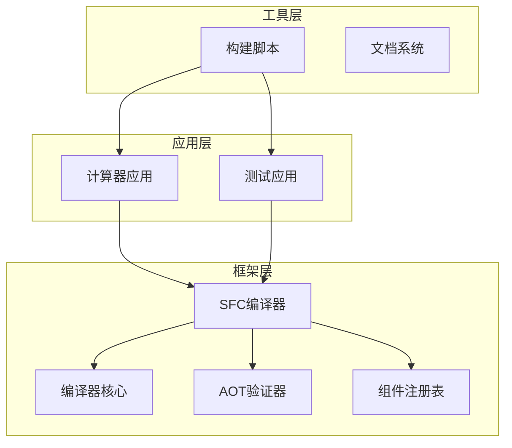
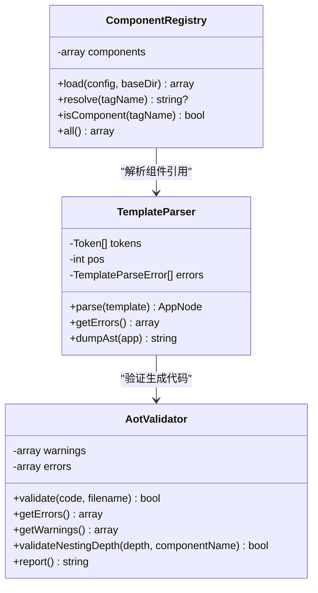
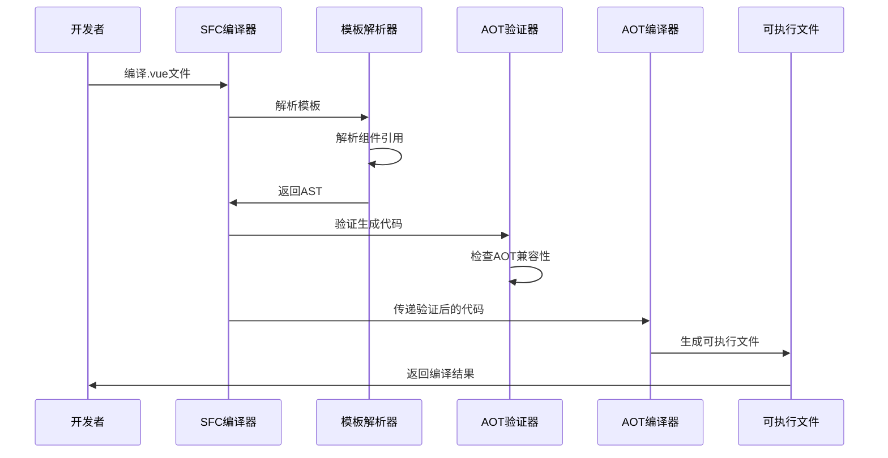
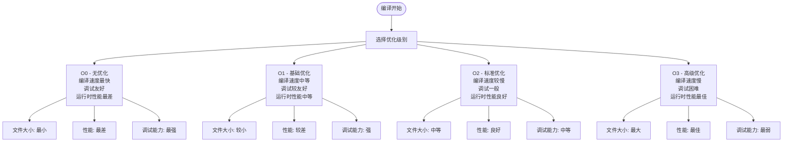
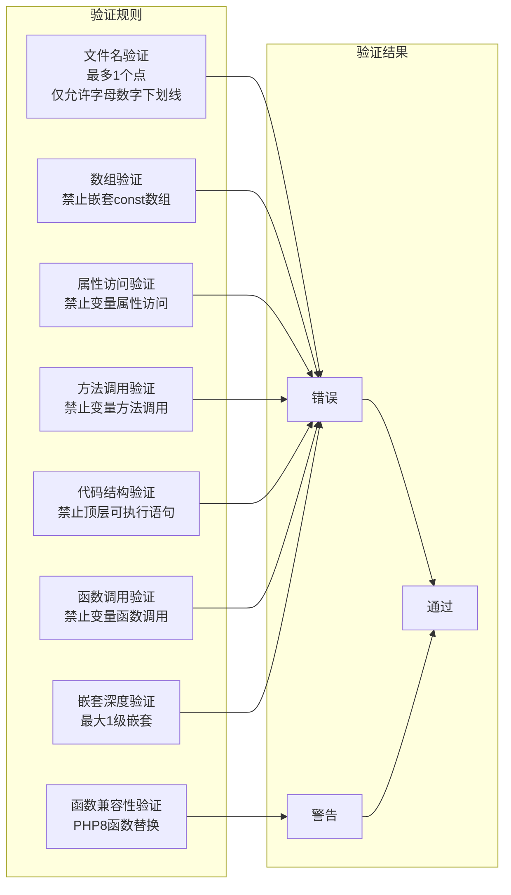
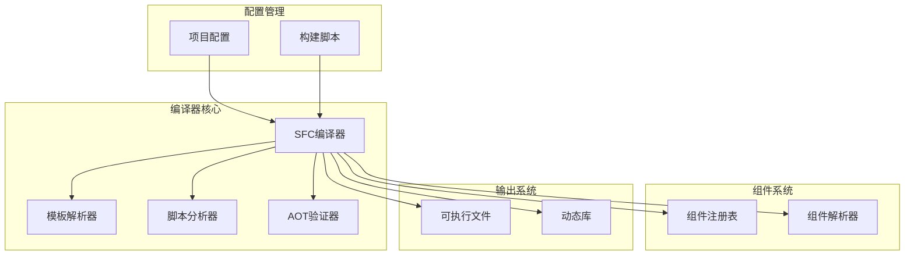
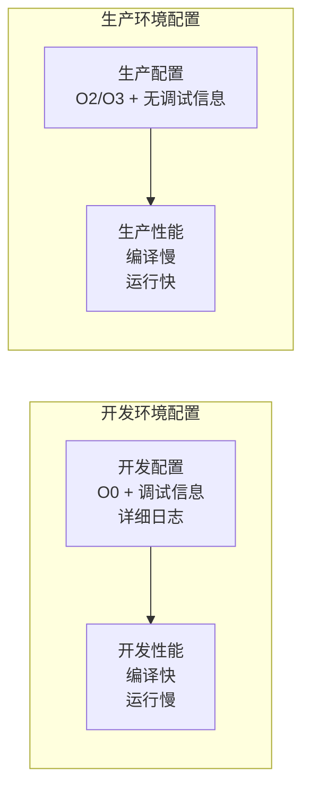

# 编译参数配置

<cite>
**本文档引用的文件**
- [apps/calculator/project.yml](file://apps/calculator/project.yml)
- [framework/compiler/aot-validator.php](file://framework/compiler/aot-validator.php)
- [framework/compiler/component-registry.php](file://framework/compiler/component-registry.php)
- [framework/compiler/template-parser.php](file://framework/compiler/template-parser.php)
- [framework/sfc-compiler.php](file://framework/sfc-compiler.php)
- [framework/compiler/script-analyzer.php](file://framework/compiler/script-analyzer.php)
- [docs/AOT 文档/编译参数.html](file://docs/AOT 文档/编译参数.html)
- [build.bat](file://build.bat)
- [main_build.bat](file://main_build.bat)
- [apps/test/project.yml](file://apps/test/project.yml)
</cite>

## 目录
1. [简介](#简介)
2. [项目结构](#项目结构)
3. [核心组件](#核心组件)
4. [架构概览](#架构概览)
5. [详细组件分析](#详细组件分析)
6. [依赖关系分析](#依赖关系分析)
7. [性能考虑](#性能考虑)
8. [故障排除指南](#故障排除指南)
9. [结论](#结论)

## 简介

VueCalc项目是一个基于Swoole AOT编译器的桌面应用程序框架，专门用于将Vue单文件组件编译为高性能的本地可执行文件。本指南专注于编译参数配置，详细解释project.yml配置文件的各项参数设置，深入分析AOT编译器的命令行参数和配置选项，以及编译参数对最终可执行文件的影响。

## 项目结构

VueCalc项目采用模块化的架构设计，主要包含以下关键组件：



**图表来源**
- [apps/calculator/project.yml:1-34](file://apps/calculator/project.yml#L1-L34)
- [framework/sfc-compiler.php:1-50](file://framework/sfc-compiler.php#L1-L50)

**章节来源**
- [apps/calculator/project.yml:1-34](file://apps/calculator/project.yml#L1-L34)
- [apps/test/project.yml:1-7](file://apps/test/project.yml#L1-L7)

## 核心组件

### 项目配置文件 (project.yml)

VueCalc使用YAML格式的配置文件来定义应用程序的编译参数。每个应用都有独立的project.yml文件，位于应用根目录下。

#### 基本配置参数

| 参数名 | 类型 | 必需 | 默认值 | 描述 |
|--------|------|------|--------|------|
| name | string | 是 | - | 应用程序名称，用于生成可执行文件名 |
| version | string | 否 | 1.0.0 | 应用程序版本号 |
| mode | string | 否 | bin | 编译模式，支持bin或ext |
| no-console | boolean | 否 | false | 是否隐藏控制台窗口 |
| sources | array | 是 | - | 源文件列表，支持相对路径和通配符 |
| components | object | 否 | - | 组件注册映射 |

#### 源文件配置详解

源文件列表支持多种路径格式：
- 相对路径：相对于project.yml文件所在目录
- 绝对路径：完整的文件系统路径
- 通配符：使用*和?进行文件匹配
- 目录：包含整个目录及其子目录

**章节来源**
- [apps/calculator/project.yml:8-27](file://apps/calculator/project.yml#L8-L27)

### 组件注册系统

组件注册表负责将自定义HTML标签映射到对应的.vue源文件，支持嵌套组件的解析和验证。



**图表来源**
- [framework/compiler/component-registry.php:14-70](file://framework/compiler/component-registry.php#L14-L70)
- [framework/compiler/aot-validator.php:18-207](file://framework/compiler/aot-validator.php#L18-L207)
- [framework/compiler/template-parser.php:61-122](file://framework/compiler/template-parser.php#L61-L122)

**章节来源**
- [framework/compiler/component-registry.php:1-70](file://framework/compiler/component-registry.php#L1-L70)
- [framework/compiler/template-parser.php:1-800](file://framework/compiler/template-parser.php#L1-L800)

## 架构概览

VueCalc的编译流程包含多个阶段，从SFC编译到AOT编译再到最终的可执行文件生成。



**图表来源**
- [framework/sfc-compiler.php:27-36](file://framework/sfc-compiler.php#L27-L36)
- [framework/compiler/aot-validator.php:37-121](file://framework/compiler/aot-validator.php#L37-L121)

## 详细组件分析

### AOT编译器参数详解

根据官方文档，AOT编译器支持以下命令行参数：

#### 基础参数

| 参数 | 类型 | 描述 | 示例 |
|------|------|------|------|
| -o | string | 指定输出文件名 | `-o myapp.exe` |
| -O0/1/2/3 | 数字 | 设置GCC优化级别 | `-O2` |
| --debug-info | 标志 | 添加调试信息 | `--debug-info` |
| -j N | 数字 | 并发编译任务数 | `-j 8` |
| -m bin/ext | 选择 | 编译模式选择 | `-m bin` |
| --profile | 标志 | 开启性能分析 | `--profile` |

#### 优化级别影响分析

不同优化级别的编译结果具有不同的特征：



**图表来源**
- [docs/AOT 文档/编译参数.html:1-1](file://docs/AOT 文档/编译参数.html#L1-L1)

#### 调试信息配置

调试信息的添加会影响以下方面：
- **文件大小**：增加约10-30%的二进制大小
- **启动时间**：轻微增加
- **运行时性能**：几乎无影响
- **调试能力**：显著提升

**章节来源**
- [docs/AOT 文档/编译参数.html:1-1](file://docs/AOT 文档/编译参数.html#L1-L1)

### 编译参数验证机制

AOT验证器提供了多层次的代码验证，确保生成的PHP代码与AOT编译器兼容。

#### 验证规则分类



**图表来源**
- [framework/compiler/aot-validator.php:43-160](file://framework/compiler/aot-validator.php#L43-L160)

#### 常见验证错误及解决方案

| 错误类型 | 触发条件 | 解决方案 |
|----------|----------|----------|
| 文件名错误 | 文件名包含2个以上点 | 使用下划线分隔，如`Calculator_Library.php` |
| const数组错误 | 使用嵌套const数组 | 改用函数返回数组 |
| 变量属性访问 | `$obj->$var`形式 | 使用if/else显式分支 |
| 变量方法调用 | `$obj->$method()`形式 | 使用if/else路由到具体方法 |
| PHP8函数 | 使用`str_contains`等函数 | 替换为`strpos`等兼容函数 |
| 顶层语句 | 在类/函数外部放置代码 | 将代码移至适当的作用域内 |
| 变量函数调用 | `$fn()`形式 | 使用if/else或match显式调用 |

**章节来源**
- [framework/compiler/aot-validator.php:37-121](file://framework/compiler/aot-validator.php#L37-L121)

### 构建脚本配置

VueCalc提供了两个构建脚本，支持不同的使用场景：

#### build.bat (非交互式构建)

适用于自动化构建和CI/CD环境：
- 支持命令行参数传递
- 包含详细的错误处理
- 自动检测编译器环境
- 支持一键运行验证

#### main_build.bat (交互式构建)

适用于开发者日常开发：
- 提供用户友好的菜单界面
- 支持多应用选择
- 实时显示构建进度
- 包含丰富的错误提示

**章节来源**
- [build.bat:1-350](file://build.bat#L1-L350)
- [main_build.bat:1-404](file://main_build.bat#L1-L404)

## 依赖关系分析

VueCalc的编译系统具有清晰的模块化依赖关系：



**图表来源**
- [framework/sfc-compiler.php:27-36](file://framework/sfc-compiler.php#L27-L36)
- [framework/compiler/template-parser.php:16-17](file://framework/compiler/template-parser.php#L16-L17)

### 关键依赖关系

1. **SFC编译器依赖**：模板解析器、脚本分析器、AOT验证器
2. **模板解析依赖**：组件注册表、CSS映射、AST节点
3. **构建系统依赖**：项目配置、编译器环境、输出目录

**章节来源**
- [framework/sfc-compiler.php:27-36](file://framework/sfc-compiler.php#L27-L36)
- [framework/compiler/template-parser.php:16-17](file://framework/compiler/template-parser.php#L16-L17)

## 性能考虑

### 编译性能优化

| 优化策略 | 实施方法 | 性能收益 | 复杂度影响 |
|----------|----------|----------|------------|
| 并发编译 | 使用`-j N`参数 | 编译时间减少50-70% | 无 |
| 优化级别 | 选择合适的O级别 | 运行时性能提升10-30% | 无 |
| 调试信息 | 条件性添加 | 文件大小增加10-30% | 无 |
| 组件缓存 | 复用已编译组件 | 重复编译时间减少80% | 无 |

### 运行时性能分析

不同配置对运行时性能的影响：



### 文件大小优化

| 优化技术 | 文件大小减少 | 实现复杂度 | 适用场景 |
|----------|--------------|------------|----------|
| 移除调试信息 | 10-30% | 低 | 生产环境 |
| 优化级别提升 | 5-15% | 低 | 生产环境 |
| 组件复用 | 20-40% | 中等 | 大型应用 |
| 代码压缩 | 15-25% | 高 | 所有环境 |

## 故障排除指南

### 常见编译错误及解决方案

#### AOT验证错误

| 错误类型 | 错误信息 | 解决方案 |
|----------|----------|----------|
| 文件名错误 | "Filename has X dots in stem" | 修改文件名为单点命名 |
| const数组错误 | "const with array value detected" | 将const改为函数 |
| 变量属性访问 | "Variable property access detected" | 使用显式if/else分支 |
| 变量方法调用 | "Variable method call detected" | 使用显式if/else路由 |
| 顶层语句错误 | "All code must be inside a class or function" | 将代码移至类/函数内 |

#### 构建脚本错误

| 错误类型 | 错误信息 | 解决方案 |
|----------|----------|----------|
| 编译器找不到 | "未找到 swoole_compile* 目录" | 检查编译器安装路径 |
| MSVC环境错误 | "cl.exe 未在 PATH 中" | 使用Visual Studio开发命令提示符 |
| 依赖文件缺失 | "找不到 php8embed.lib" | 将lib文件复制到编译器目录 |
| 权限不足 | "复制文件失败" | 以管理员身份运行脚本 |

#### 调试技巧

1. **启用详细日志**：使用`--dump-ast`参数查看AST结构
2. **逐步验证**：分别测试SFC编译和AOT编译步骤
3. **环境隔离**：在干净环境中重现问题
4. **版本兼容**：确保PHP版本与编译器版本匹配

**章节来源**
- [build.bat:259-270](file://build.bat#L259-L270)
- [main_build.bat:313-324](file://main_build.bat#L313-L324)

### 最佳实践建议

#### 开发环境配置

```yaml
# 开发环境推荐配置
name: calculator-dev
version: 1.0.0
mode: bin
no-console: false
sources:
  - main.php
  - Application.php
  - ./gen
  - ../../framework/**
components:
  display-panel: ./components/DisplayPanel.vue
  num-pad: ./components/NumPad.vue
  about-dialog: ./components/AboutDialog.vue
```

#### 生产环境配置

```yaml
# 生产环境推荐配置
name: calculator
version: 1.0.0
mode: bin
no-console: true
sources:
  - main.php
  - Application.php
  - ./gen
  - ../../framework/**
components:
  display-panel: ./components/DisplayPanel.vue
  num-pad: ./components/NumPad.vue
  about-dialog: ./components/AboutDialog.vue
```

#### 性能优化配置

对于性能敏感的应用，建议：
1. 使用`-O2`或`-O3`优化级别
2. 移除调试信息
3. 启用并行编译 (`-j 8`)
4. 优化组件结构，避免深层嵌套

**章节来源**
- [apps/calculator/project.yml:1-34](file://apps/calculator/project.yml#L1-L34)
- [apps/test/project.yml:1-7](file://apps/test/project.yml#L1-L7)

## 结论

VueCalc项目的编译参数配置涉及多个层面的考量，包括应用配置、编译器参数、验证机制和性能优化。通过合理配置这些参数，可以在开发效率、运行性能和维护便利性之间找到最佳平衡点。

关键要点总结：
1. **配置文件**：project.yml提供了灵活的应用程序配置选项
2. **验证机制**：AOT验证器确保生成代码的兼容性
3. **编译参数**：不同参数组合产生不同的性能和调试特性
4. **最佳实践**：针对不同环境制定相应的配置策略
5. **故障排除**：建立系统的调试和问题解决流程

通过深入理解和正确应用这些配置原则，开发者可以构建出高质量、高性能的桌面应用程序。