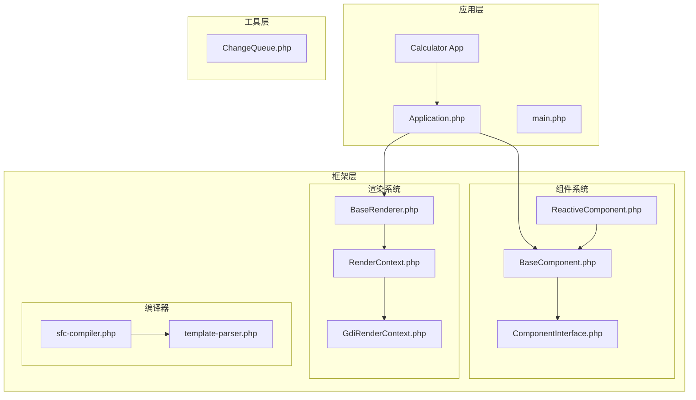
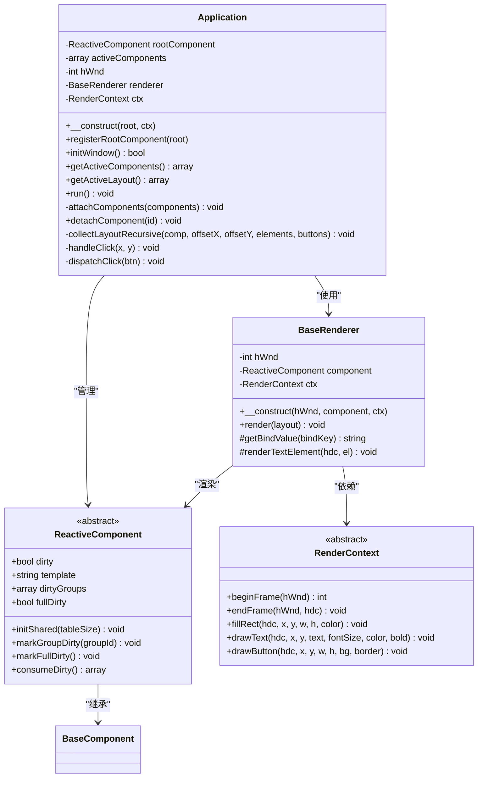
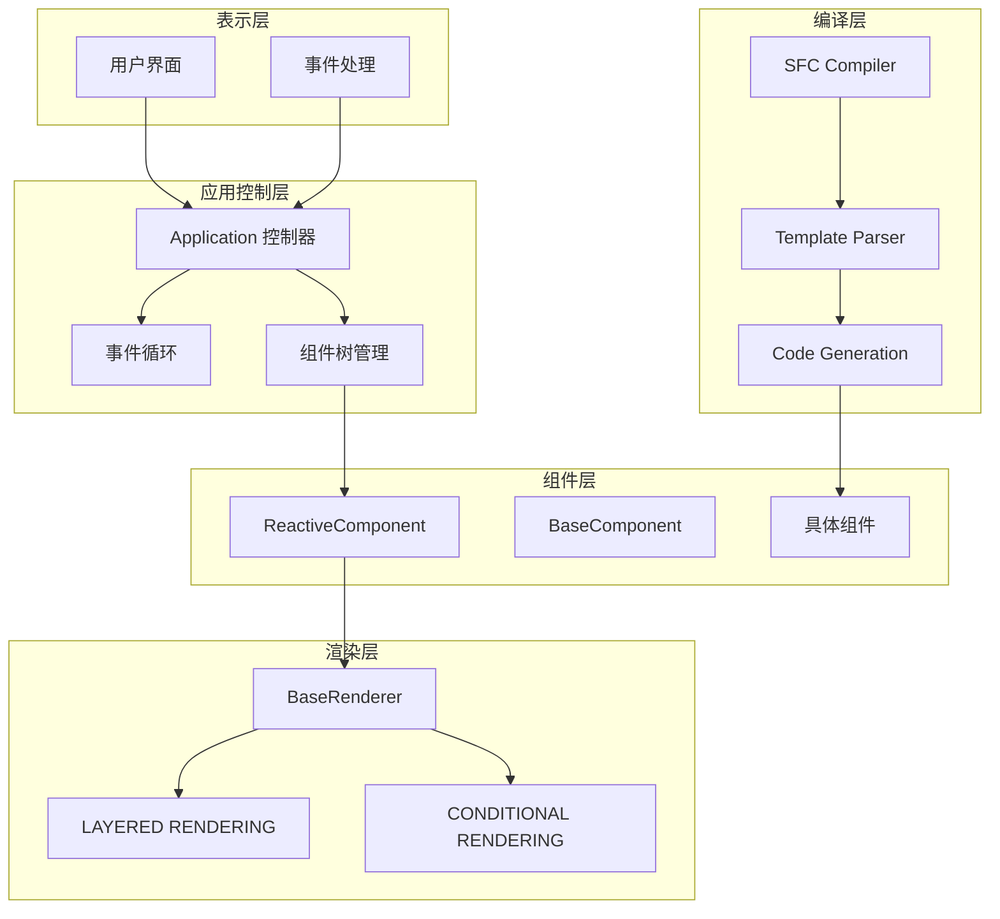
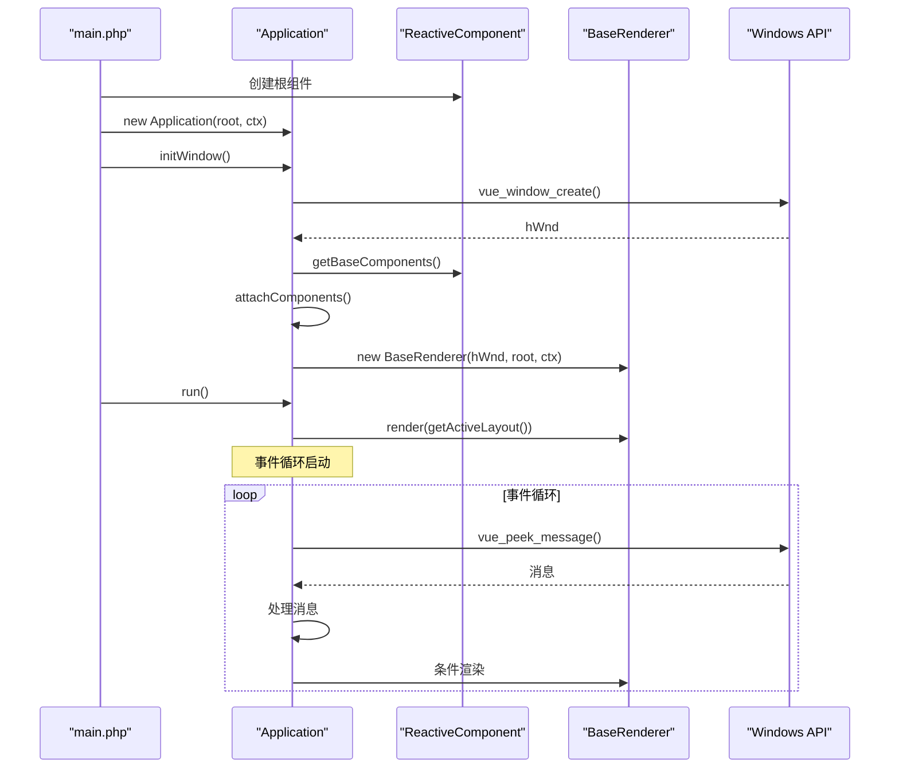
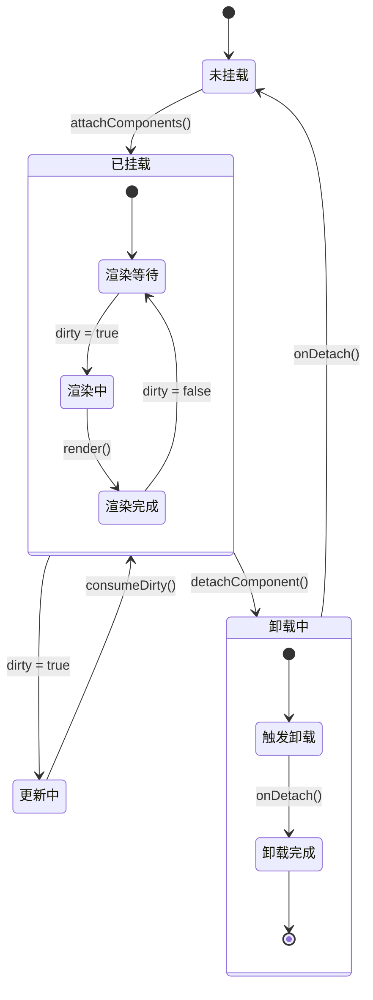
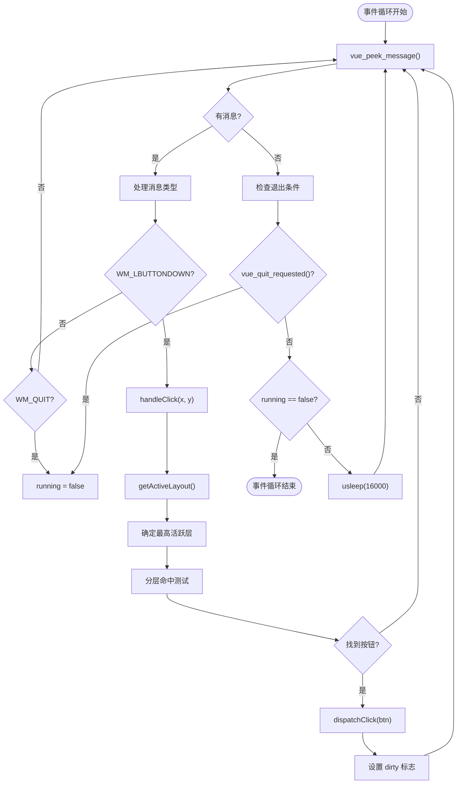
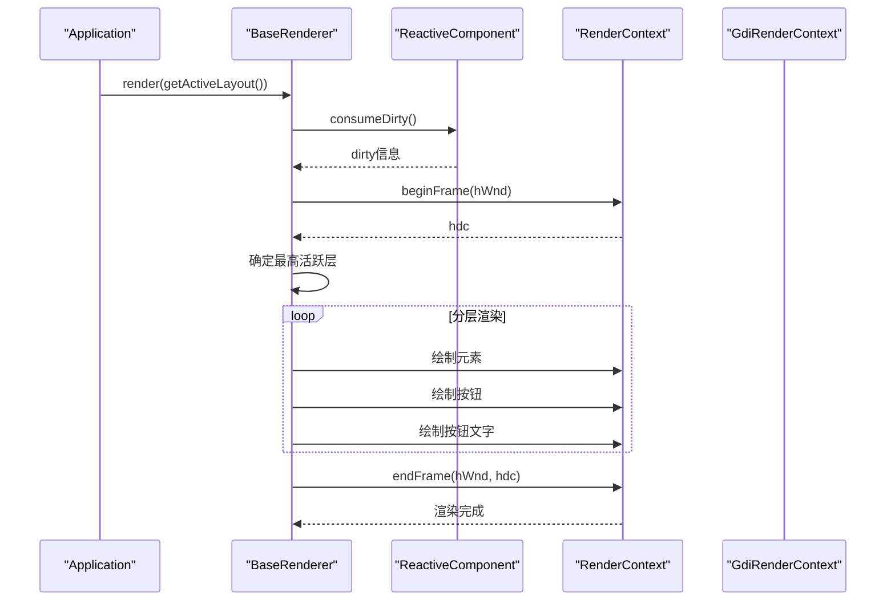
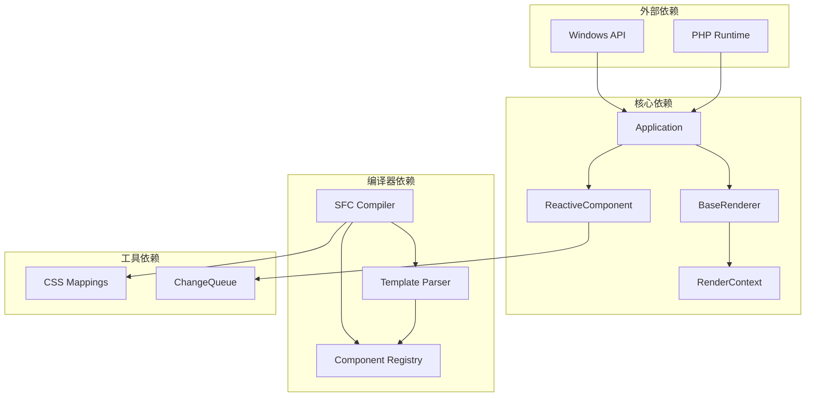

# 应用控制设计

<cite>
**本文档引用的文件**
- [Application.php](file://apps/calculator/Application.php)
- [main.php](file://apps/calculator/main.php)
- [BaseComponent.php](file://framework/BaseComponent.php)
- [ReactiveComponent.php](file://framework/ReactiveComponent.php)
- [RenderContext.php](file://framework/rendering/RenderContext.php)
- [BaseRenderer.php](file://framework/BaseRenderer.php)
- [GdiRenderContext.php](file://framework/rendering/GdiRenderContext.php)
- [ComponentInterface.php](file://framework/interfaces/ComponentInterface.php)
- [sfc-compiler.php](file://framework/sfc-compiler.php)
- [template-parser.php](file://framework/compiler/template-parser.php)
- [App.vue](file://apps/calculator/App.vue)
- [DisplayPanel.vue](file://apps/calculator/components/DisplayPanel.vue)
- [ChangeQueue.php](file://framework/ChangeQueue.php)
</cite>

## 目录
1. [简介](#简介)
2. [项目结构](#项目结构)
3. [核心组件](#核心组件)
4. [架构概览](#架构概览)
5. [详细组件分析](#详细组件分析)
6. [依赖关系分析](#依赖关系分析)
7. [性能考虑](#性能考虑)
8. [故障排除指南](#故障排除指南)
9. [结论](#结论)

## 简介

VueCalc框架的应用控制层以Application类为核心，负责管理整个桌面应用程序的生命周期和组件协调。该框架采用Vue.js风格的单文件组件(SFC)架构，通过AOT(Ahead-of-Time)编译器将.vue组件转换为高性能的PHP组件类，实现了数据驱动的UI渲染和响应式状态管理。

Application类作为应用控制器，承担着窗口初始化、事件循环控制、组件树协调和渲染调度等关键职责。它通过与渲染系统、组件系统和编译器的紧密协作，构建了一个高效、可维护的桌面应用框架。

## 项目结构

VueCalc框架采用模块化的项目结构，主要分为以下几个层次：



**图表来源**
- [Application.php:1-322](file://apps/calculator/Application.php#L1-L322)
- [main.php:1-48](file://apps/calculator/main.php#L1-L48)
- [BaseComponent.php:1-177](file://framework/BaseComponent.php#L1-L177)

**章节来源**
- [Application.php:1-322](file://apps/calculator/Application.php#L1-L322)
- [main.php:1-48](file://apps/calculator/main.php#L1-L48)

## 核心组件

### Application类设计

Application类是应用控制层的核心，实现了以下关键功能：

#### 核心职责
- **窗口管理**: 创建和管理应用程序窗口
- **事件循环控制**: 处理Windows消息队列和用户交互
- **组件树协调**: 管理组件的挂载、卸载和状态同步
- **渲染调度**: 协调渲染器进行数据驱动的重绘

#### 关键属性和方法



**图表来源**
- [Application.php:15-322](file://apps/calculator/Application.php#L15-L322)
- [ReactiveComponent.php:14-90](file://framework/ReactiveComponent.php#L14-L90)
- [BaseRenderer.php:15-197](file://framework/BaseRenderer.php#L15-L197)
- [RenderContext.php:13-30](file://framework/rendering/RenderContext.php#L13-L30)

**章节来源**
- [Application.php:15-322](file://apps/calculator/Application.php#L15-L322)
- [ReactiveComponent.php:14-90](file://framework/ReactiveComponent.php#L14-L90)

## 架构概览

VueCalc框架采用分层架构设计，各层之间职责清晰，耦合度低：



**图表来源**
- [Application.php:205-263](file://apps/calculator/Application.php#L205-L263)
- [BaseRenderer.php:98-196](file://framework/BaseRenderer.php#L98-L196)
- [sfc-compiler.php:1-819](file://framework/sfc-compiler.php#L1-L819)

## 详细组件分析

### 应用启动流程

Application类的启动流程遵循严格的初始化顺序：



**图表来源**
- [main.php:19-48](file://apps/calculator/main.php#L19-L48)
- [Application.php:51-76](file://apps/calculator/Application.php#L51-L76)
- [Application.php:205-263](file://apps/calculator/Application.php#L205-L263)

#### 启动流程的关键步骤

1. **根组件创建**: 通过AppComponent构造函数创建根组件实例
2. **渲染上下文初始化**: 创建GdiRenderContext实例
3. **Application实例化**: 传入根组件和渲染上下文
4. **窗口创建**: 调用vue_window_create()创建应用程序窗口
5. **组件树挂载**: 通过getBaseComponents()获取初始组件树并挂载
6. **渲染器初始化**: 创建BaseRenderer实例进行渲染调度

**章节来源**
- [main.php:19-48](file://apps/calculator/main.php#L19-L48)
- [Application.php:32-76](file://apps/calculator/Application.php#L32-L76)

### 组件生命周期管理

VueCalc框架实现了完整的组件生命周期管理：



**图表来源**
- [BaseComponent.php:118-129](file://framework/BaseComponent.php#L118-L129)
- [ReactiveComponent.php:56-64](file://framework/ReactiveComponent.php#L56-L64)
- [Application.php:97-112](file://apps/calculator/Application.php#L97-L112)

#### 生命周期关键方法

- **onAttach()**: 组件挂载时的初始化回调
- **onDetach()**: 组件卸载时的清理回调  
- **markAttached()**: 标记组件为已挂载状态
- **markDetached()**: 标记组件为已卸载状态
- **consumeDirty()**: 消费脏标记状态

**章节来源**
- [BaseComponent.php:118-129](file://framework/BaseComponent.php#L118-L129)
- [ReactiveComponent.php:56-64](file://framework/ReactiveComponent.php#L56-L64)

### 事件处理机制

Application类实现了完整的事件处理机制，支持鼠标点击、窗口消息和条件渲染：



**图表来源**
- [Application.php:214-263](file://apps/calculator/Application.php#L214-L263)
- [Application.php:269-321](file://apps/calculator/Application.php#L269-L321)

#### 事件处理流程

1. **消息泵**: 使用vue_peek_message()轮询Windows消息队列
2. **消息分发**: 根据消息类型进行不同处理
3. **点击处理**: 实现分层命中测试算法
4. **条件渲染**: 基于脏标记触发渲染更新

**章节来源**
- [Application.php:214-263](file://apps/calculator/Application.php#L214-L263)

### 渲染系统交互

BaseRenderer类实现了数据驱动的渲染系统，支持两阶段分层渲染：



**图表来源**
- [BaseRenderer.php:98-196](file://framework/BaseRenderer.php#L98-L196)
- [Application.php:209-257](file://apps/calculator/Application.php#L209-L257)

#### 渲染流程特点

1. **两阶段渲染**: 先确定最高活跃层，再按层渲染
2. **条件渲染**: 支持基于条件表达式的元素显示控制
3. **脏标记驱动**: 仅在组件状态变更时触发重绘
4. **双缓冲**: 使用beginFrame/endFrame实现双缓冲渲染

**章节来源**
- [BaseRenderer.php:98-196](file://framework/BaseRenderer.php#L98-L196)

### 组件协调机制

Application类实现了复杂的组件协调机制，支持动态偏移和条件渲染：

```mermaid
flowchart TD
GetLayout[getActiveLayout()] --> Recurse[collectLayoutRecursive]
Recurse --> ProcessElements["处理元素布局<br/>应用X/Y偏移"]
Recurse --> ProcessButtons["处理按钮布局<br/>应用X/Y偏移"]
Recurse --> ProcessChildren["递归处理子组件"]
ProcessElements --> ApplyOffset["应用累积偏移<br/>containerX/containerY"]
ProcessButtons --> ApplyOffset
ApplyOffset --> UpdateElements["更新元素坐标"]
UpdateElements --> UpdateButtons["更新按钮坐标"]
UpdateButtons --> ReturnLayout["返回布局数据"]
ProcessChildren --> GetChildProps["获取子组件props<br/>x/y偏移"]
GetChildProps --> Recurse
```

**图表来源**
- [Application.php:120-200](file://apps/calculator/Application.php#L120-L200)

#### 组件协调特性

1. **动态偏移**: 支持组件树的动态坐标偏移计算
2. **条件渲染**: 支持基于条件表达式的组件显示控制
3. **层管理**: 实现按钮的分层渲染机制
4. **性能优化**: 使用AOT安全的数组遍历和类型转换

**章节来源**
- [Application.php:120-200](file://apps/calculator/Application.php#L120-L200)

## 依赖关系分析

VueCalc框架的依赖关系体现了清晰的分层设计：



**图表来源**
- [Application.php:1-322](file://apps/calculator/Application.php#L1-L322)
- [BaseRenderer.php:1-197](file://framework/BaseRenderer.php#L1-L197)
- [sfc-compiler.php:1-819](file://framework/sfc-compiler.php#L1-L819)

### 关键依赖关系

1. **Application ↔ BaseRenderer**: 通过渲染接口进行解耦
2. **ReactiveComponent ↔ ChangeQueue**: 通过变更队列实现响应式更新
3. **SFC Compiler ↔ Template Parser**: 通过AST节点实现模板解析
4. **RenderContext ↔ GdiRenderContext**: 通过抽象接口实现后端无关性

**章节来源**
- [Application.php:1-322](file://apps/calculator/Application.php#L1-L322)
- [BaseRenderer.php:1-197](file://framework/BaseRenderer.php#L1-L197)

## 性能考虑

VueCalc框架在多个层面实现了性能优化：

### 渲染性能优化

1. **脏标记驱动渲染**: 仅在状态变更时触发重绘
2. **双缓冲渲染**: 使用beginFrame/endFrame减少闪烁
3. **分层渲染**: 通过最高活跃层优化渲染顺序
4. **条件渲染**: 支持基于条件表达式的元素过滤

### 内存管理优化

1. **组件池管理**: 通过activeComponents数组管理组件生命周期
2. **数组遍历优化**: 使用array_keys()+for循环避免类型推断问题
3. **对象复用**: 通过共享渲染上下文减少对象创建开销

### 事件处理优化

1. **消息泵**: 使用vue_peek_message()非阻塞轮询
2. **60FPS帧率**: 通过usleep(16000)控制渲染频率
3. **条件渲染**: 避免不必要的渲染调用

## 故障排除指南

### 常见问题及解决方案

#### 窗口创建失败
**症状**: initWindow()返回false，控制台输出错误信息
**原因**: Windows窗口创建失败
**解决方案**: 检查WINDOW_WIDTH和WINDOW_HEIGHT常量定义

#### 组件挂载异常
**症状**: 组件无法正常显示或响应
**原因**: attachComponents()执行失败或组件树不完整
**解决方案**: 验证getBaseComponents()返回的组件列表

#### 渲染性能问题
**症状**: 应用卡顿或渲染延迟
**原因**: 脏标记未正确设置或渲染循环过载
**解决方案**: 检查dirty标志设置和渲染频率控制

#### 事件处理失效
**症状**: 鼠标点击无响应
**原因**: 消息循环异常或命中测试失败
**解决方案**: 验证handleClick()方法和条件表达式

**章节来源**
- [Application.php:59-62](file://apps/calculator/Application.php#L59-L62)
- [Application.php:227-232](file://apps/calculator/Application.php#L227-L232)

## 结论

VueCalc框架的应用控制层通过Application类实现了高度模块化和可维护的桌面应用架构。该设计具有以下优势：

1. **清晰的职责分离**: 应用控制、组件管理、渲染系统各司其职
2. **高效的事件处理**: 基于消息泵的非阻塞事件循环
3. **灵活的组件系统**: 支持动态偏移和条件渲染的组件树
4. **性能优化**: 脏标记驱动的渲染和双缓冲技术
5. **AOT兼容性**: 完整支持Ahead-of-Time编译

通过SFC编译器的引入，VueCalc实现了从Vue.js风格模板到高性能PHP组件的转换，为桌面应用开发提供了现代化的开发体验和优秀的运行性能。Application类作为核心控制器，成功地将这些技术整合在一起，构建了一个功能完整、性能优异的桌面应用框架。