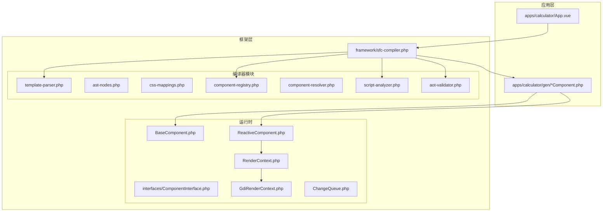
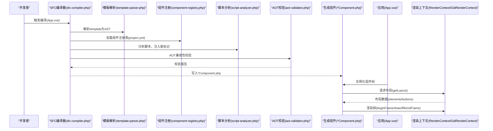
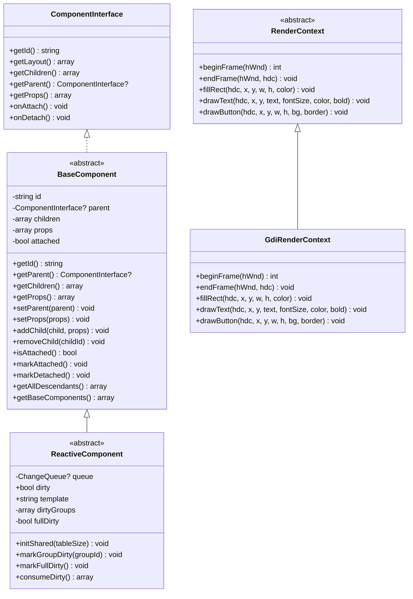
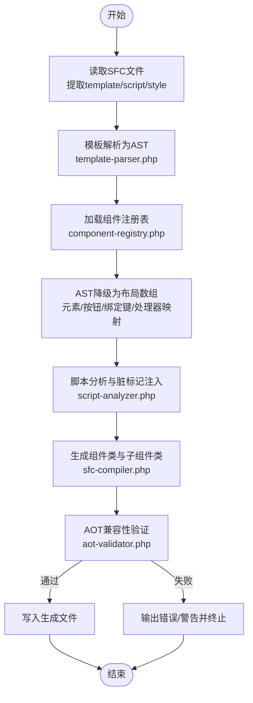
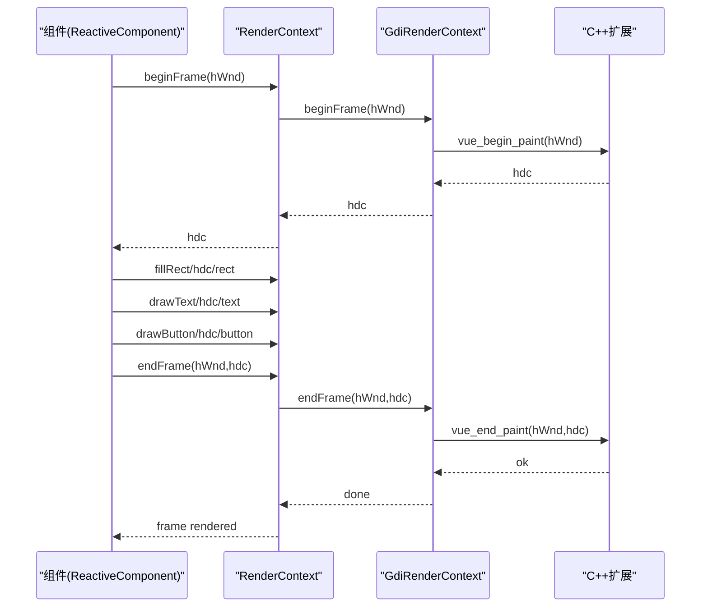
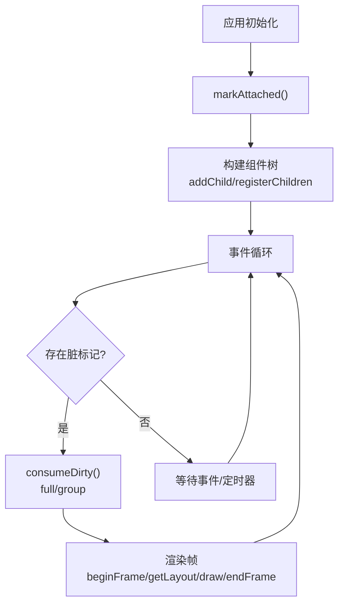
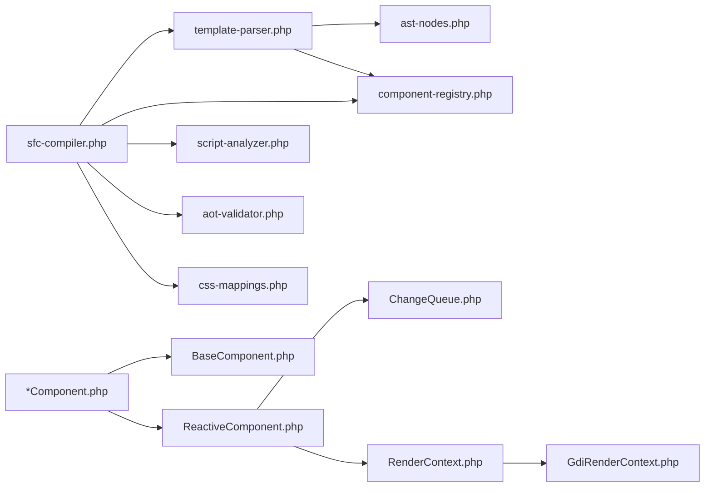

# 核心架构设计

<cite>
**本文引用的文件**
- [BaseComponent.php](file://framework/BaseComponent.php)
- [ReactiveComponent.php](file://framework/ReactiveComponent.php)
- [ComponentInterface.php](file://framework/interfaces/ComponentInterface.php)
- [sfc-compiler.php](file://framework/sfc-compiler.php)
- [template-parser.php](file://framework/compiler/template-parser.php)
- [ast-nodes.php](file://framework/compiler/ast-nodes.php)
- [css-mappings.php](file://framework/compiler/css-mappings.php)
- [script-analyzer.php](file://framework/compiler/script-analyzer.php)
- [component-registry.php](file://framework/compiler/component-registry.php)
- [component-resolver.php](file://framework/compiler/component-resolver.php)
- [aot-validator.php](file://framework/compiler/aot-validator.php)
- [RenderContext.php](file://framework/rendering/RenderContext.php)
- [GdiRenderContext.php](file://framework/rendering/GdiRenderContext.php)
- [ChangeQueue.php](file://framework/ChangeQueue.php)
- [App.vue](file://apps/calculator/App.vue)
</cite>

## 目录
1. [引言](#引言)
2. [项目结构](#项目结构)
3. [核心组件](#核心组件)
4. [架构总览](#架构总览)
5. [详细组件分析](#详细组件分析)
6. [依赖分析](#依赖分析)
7. [性能考虑](#性能考虑)
8. [故障排查指南](#故障排查指南)
9. [结论](#结论)
10. [附录](#附录)

## 引言
本设计文档面向VueCalc框架，聚焦于整体架构模式与关键技术实现，涵盖组件化架构、数据驱动渲染、分层设计、SFC编译器、渲染系统以及应用控制层的协同机制。文档旨在帮助开发者快速理解从模板到渲染的完整链路，掌握AOT兼容性约束与优化策略。

## 项目结构
仓库采用按功能域划分的目录组织方式：
- apps：应用示例与构建产物生成目录
- framework：核心框架代码，包含组件基类、编译器模块、渲染上下文与工具类
- docs：技术文档与规划资料
- cpp：C++扩展桥接（与渲染后端交互）
- stub：类型与桩文件
- tests：编译器与布局校验测试

**图表来源**
- [sfc-compiler.php:27-36](file://framework/sfc-compiler.php#L27-L36)
- [template-parser.php:16-17](file://framework/compiler/template-parser.php#L16-L17)
- [ast-nodes.php:9-27](file://framework/compiler/ast-nodes.php#L9-L27)
- [css-mappings.php:15-210](file://framework/compiler/css-mappings.php#L15-L210)
- [component-registry.php:14-70](file://framework/compiler/component-registry.php#L14-L70)
- [component-resolver.php:9-62](file://framework/compiler/component-resolver.php#L9-L62)
- [script-analyzer.php:15-281](file://framework/compiler/script-analyzer.php#L15-L281)
- [aot-validator.php:18-207](file://framework/compiler/aot-validator.php#L18-L207)
- [BaseComponent.php:16-177](file://framework/BaseComponent.php#L16-L177)
- [ReactiveComponent.php:14-90](file://framework/ReactiveComponent.php#L14-L90)
- [RenderContext.php:13-30](file://framework/rendering/RenderContext.php#L13-L30)
- [GdiRenderContext.php:11-38](file://framework/rendering/GdiRenderContext.php#L11-L38)

**章节来源**
- [sfc-compiler.php:27-36](file://framework/sfc-compiler.php#L27-L36)
- [template-parser.php:16-17](file://framework/compiler/template-parser.php#L16-L17)
- [BaseComponent.php:16-177](file://framework/BaseComponent.php#L16-L177)
- [ReactiveComponent.php:14-90](file://framework/ReactiveComponent.php#L14-L90)
- [RenderContext.php:13-30](file://framework/rendering/RenderContext.php#L13-L30)
- [GdiRenderContext.php:11-38](file://framework/rendering/GdiRenderContext.php#L11-L38)

## 核心组件
- 组件接口与基类
  - ComponentInterface：定义组件树、布局与生命周期的标准契约，确保AOT兼容性
  - BaseComponent：提供组件树管理（父子引用、子组件集合、属性）、挂载状态与后代收集
  - ReactiveComponent：在BaseComponent基础上引入响应式状态与脏标记，支持分组级重绘与全量重绘

- 渲染上下文
  - RenderContext：抽象渲染后端接口，定义帧开始/结束与基础绘制原语
  - GdiRenderContext：Win32 GDI后端实现，委托C++扩展函数执行绘制

- 变更队列
  - ChangeQueue：环形缓冲队列，承载响应式变更，供渲染循环消费

**章节来源**
- [ComponentInterface.php:13-52](file://framework/interfaces/ComponentInterface.php#L13-L52)
- [BaseComponent.php:16-177](file://framework/BaseComponent.php#L16-L177)
- [ReactiveComponent.php:14-90](file://framework/ReactiveComponent.php#L14-L90)
- [RenderContext.php:13-30](file://framework/rendering/RenderContext.php#L13-L30)
- [GdiRenderContext.php:11-38](file://framework/rendering/GdiRenderContext.php#L11-L38)
- [ChangeQueue.php:11-57](file://framework/ChangeQueue.php#L11-L57)

## 架构总览
VueCalc采用“模板驱动 + 编译期优化 + AOT兼容”的整体架构：
- 模板层：SFC单文件组件，包含template/style/script三块
- 编译层：SFC编译器将模板解析为AST，降级为布局数组，注入脚本分析与AOT校验
- 运行时层：组件树由生成的*Component.php承载，ReactiveComponent负责状态与渲染协调，RenderContext抽象渲染，GDI后端输出到Win32窗口

**图表来源**
- [sfc-compiler.php:227-239](file://framework/sfc-compiler.php#L227-L239)
- [template-parser.php:88-105](file://framework/compiler/template-parser.php#L88-L105)
- [component-registry.php:26-41](file://framework/compiler/component-registry.php#L26-L41)
- [script-analyzer.php:27-43](file://framework/compiler/script-analyzer.php#L27-L43)
- [aot-validator.php:37-121](file://framework/compiler/aot-validator.php#L37-L121)
- [GdiRenderContext.php:13-36](file://framework/rendering/GdiRenderContext.php#L13-L36)

## 详细组件分析

### 组件系统设计：BaseComponent → ReactiveComponent
- 设计理念
  - BaseComponent提供组件树结构与生命周期钩子，保证父子关系与后代遍历的AOT友好实现
  - ReactiveComponent在保持接口一致性的同时，引入脏标记与分组级重绘，降低渲染开销
- 职责分工
  - BaseComponent：树管理、属性传递、挂载状态、后代收集
  - ReactiveComponent：状态属性声明、脏标记维护、绑定值查询、事件派发、条件求值
- AOT兼容要点
  - 避免魔术方法，使用显式属性与手动脏标记
  - 使用数组索引遍历与显式类型转换，规避AOT类型推断限制

**图表来源**
- [ComponentInterface.php:13-52](file://framework/interfaces/ComponentInterface.php#L13-L52)
- [BaseComponent.php:16-177](file://framework/BaseComponent.php#L16-L177)
- [ReactiveComponent.php:14-90](file://framework/ReactiveComponent.php#L14-L90)
- [RenderContext.php:13-30](file://framework/rendering/RenderContext.php#L13-L30)
- [GdiRenderContext.php:11-38](file://framework/rendering/GdiRenderContext.php#L11-L38)

**章节来源**
- [BaseComponent.php:16-177](file://framework/BaseComponent.php#L16-L177)
- [ReactiveComponent.php:14-90](file://framework/ReactiveComponent.php#L14-L90)
- [ComponentInterface.php:13-52](file://framework/interfaces/ComponentInterface.php#L13-L52)

### SFC编译器架构：模板解析 → 代码生成 → AOT验证
- 模块职责
  - 模板解析：递归下降解析，生成AST节点，支持未知标签与组件引用
  - 组件注册：从project.yml加载组件映射，解析自定义标签到源文件
  - 样式映射：CSS属性到GDI参数的映射与默认值处理
  - 脚本分析：自动注入脏标记，消除手写样板
  - AOT验证：规则检查与报告，保障生成代码在AOT环境可用
- 流程概览
  - 读取SFC三块内容，解析模板为AST，降级为布局数组，生成组件类与子组件类，最后进行AOT校验

**图表来源**
- [sfc-compiler.php:262-601](file://framework/sfc-compiler.php#L262-L601)
- [template-parser.php:88-105](file://framework/compiler/template-parser.php#L88-L105)
- [component-registry.php:26-41](file://framework/compiler/component-registry.php#L26-L41)
- [script-analyzer.php:27-43](file://framework/compiler/script-analyzer.php#L27-L43)
- [aot-validator.php:37-121](file://framework/compiler/aot-validator.php#L37-L121)

**章节来源**
- [sfc-compiler.php:262-601](file://framework/sfc-compiler.php#L262-L601)
- [template-parser.php:88-105](file://framework/compiler/template-parser.php#L88-L105)
- [ast-nodes.php:29-211](file://framework/compiler/ast-nodes.php#L29-L211)
- [css-mappings.php:15-210](file://framework/compiler/css-mappings.php#L15-L210)
- [component-registry.php:14-70](file://framework/compiler/component-registry.php#L14-L70)
- [script-analyzer.php:15-281](file://framework/compiler/script-analyzer.php#L15-L281)
- [aot-validator.php:18-207](file://framework/compiler/aot-validator.php#L18-L207)

### 渲染系统：GDI渲染上下文工作原理
- 抽象层
  - RenderContext定义帧管理与基础绘制原语，确保渲染逻辑与后端解耦
- 具体实现
  - GdiRenderContext将抽象方法委托给C++扩展的vue_*函数，完成双缓冲与绘制
- 数据流
  - 组件通过getLayout返回布局数组，渲染上下文根据元素/按钮数据调用对应绘制方法

**图表来源**
- [RenderContext.php:13-30](file://framework/rendering/RenderContext.php#L13-L30)
- [GdiRenderContext.php:11-38](file://framework/rendering/GdiRenderContext.php#L11-L38)

**章节来源**
- [RenderContext.php:13-30](file://framework/rendering/RenderContext.php#L13-L30)
- [GdiRenderContext.php:11-38](file://framework/rendering/GdiRenderContext.php#L11-L38)

### 应用控制层：组件树、事件循环与渲染协调
- 组件树管理
  - BaseComponent提供addChild/removeChild、getAllDescendants、getBaseComponents等能力，支撑应用初始化与动态更新
- 事件循环与渲染
  - ReactiveComponent通过dirty/fullDirty/dirtyGroups实现增量渲染；ChangeQueue承载变更，渲染循环消费队列
- 生命周期
  - onAttach/onDetach在应用挂载/卸载时触发，配合组件树状态同步

**图表来源**
- [BaseComponent.php:118-170](file://framework/BaseComponent.php#L118-L170)
- [ReactiveComponent.php:56-64](file://framework/ReactiveComponent.php#L56-L64)
- [ChangeQueue.php:23-56](file://framework/ChangeQueue.php#L23-L56)

**章节来源**
- [BaseComponent.php:118-170](file://framework/BaseComponent.php#L118-L170)
- [ReactiveComponent.php:56-64](file://framework/ReactiveComponent.php#L56-L64)
- [ChangeQueue.php:11-57](file://framework/ChangeQueue.php#L11-L57)

## 依赖分析
- 组件间依赖
  - ReactiveComponent依赖BaseComponent与ChangeQueue
  - GdiRenderContext依赖RenderContext与C++扩展
- 编译器模块依赖
  - sfc-compiler.php依赖各编译器模块；template-parser.php依赖ast-nodes.php与component-registry.php；css-mappings.php提供样式映射；script-analyzer.php负责脏标记注入；aot-validator.php贯穿生成流程

**图表来源**
- [sfc-compiler.php:27-36](file://framework/sfc-compiler.php#L27-L36)
- [template-parser.php:16-17](file://framework/compiler/template-parser.php#L16-L17)
- [ast-nodes.php:9-27](file://framework/compiler/ast-nodes.php#L9-L27)
- [css-mappings.php:15-210](file://framework/compiler/css-mappings.php#L15-L210)
- [component-registry.php:14-70](file://framework/compiler/component-registry.php#L14-L70)
- [script-analyzer.php:15-281](file://framework/compiler/script-analyzer.php#L15-L281)
- [aot-validator.php:18-207](file://framework/compiler/aot-validator.php#L18-L207)
- [BaseComponent.php:16-177](file://framework/BaseComponent.php#L16-L177)
- [ReactiveComponent.php:14-90](file://framework/ReactiveComponent.php#L14-L90)
- [RenderContext.php:13-30](file://framework/rendering/RenderContext.php#L13-L30)
- [GdiRenderContext.php:11-38](file://framework/rendering/GdiRenderContext.php#L11-L38)
- [ChangeQueue.php:11-57](file://framework/ChangeQueue.php#L11-L57)

**章节来源**
- [sfc-compiler.php:27-36](file://framework/sfc-compiler.php#L27-L36)
- [template-parser.php:16-17](file://framework/compiler/template-parser.php#L16-L17)
- [ast-nodes.php:9-27](file://framework/compiler/ast-nodes.php#L9-L27)
- [css-mappings.php:15-210](file://framework/compiler/css-mappings.php#L15-L210)
- [component-registry.php:14-70](file://framework/compiler/component-registry.php#L14-L70)
- [script-analyzer.php:15-281](file://framework/compiler/script-analyzer.php#L15-L281)
- [aot-validator.php:18-207](file://framework/compiler/aot-validator.php#L18-L207)
- [BaseComponent.php:16-177](file://framework/BaseComponent.php#L16-L177)
- [ReactiveComponent.php:14-90](file://framework/ReactiveComponent.php#L14-L90)
- [RenderContext.php:13-30](file://framework/rendering/RenderContext.php#L13-L30)
- [GdiRenderContext.php:11-38](file://framework/rendering/GdiRenderContext.php#L11-L38)
- [ChangeQueue.php:11-57](file://framework/ChangeQueue.php#L11-L57)

## 性能考虑
- 增量渲染
  - 通过dirtyGroups与fullDirty实现分组级与全量重绘控制，减少不必要的绘制
- 环形缓冲队列
  - ChangeQueue以固定大小环形缓冲承载变更，避免频繁分配与拷贝
- 编译期优化
  - 模板解析与布局数组生成在编译期完成，运行时仅需读取布局与调用绘制原语
- AOT兼容性
  - 严格遵循AOT规则，避免动态函数调用与复杂类型推断，提升编译成功率与运行时稳定性

## 故障排查指南
- 编译阶段
  - 模板解析错误：检查template中标签闭合、未知标签与非法嵌套
  - 组件解析警告：确认project.yml中的组件映射路径正确且文件存在
  - AOT验证失败：修正文件命名、移除const嵌套数组、避免变量属性/方法访问与变量函数调用
- 运行阶段
  - 组件未渲染：检查v-if条件、绑定键是否存在、布局数组是否生成
  - 渲染异常：确认GDI后端可用、hWnd有效、帧管理调用顺序正确

**章节来源**
- [template-parser.php:783-786](file://framework/compiler/template-parser.php#L783-L786)
- [aot-validator.php:37-121](file://framework/compiler/aot-validator.php#L37-L121)
- [GdiRenderContext.php:13-36](file://framework/rendering/GdiRenderContext.php#L13-L36)

## 结论
VueCalc通过清晰的分层设计与严格的AOT兼容约束，实现了从模板到渲染的高效闭环。组件化架构与数据驱动渲染相结合，既保证了开发体验，又满足桌面应用对性能与稳定性的要求。编译器模块的完善与验证机制确保了生成代码的质量与可维护性。

## 附录
- 示例应用：apps/calculator/App.vue展示了组件树、绑定与事件处理的实际用法
- 生成文件：sfc-compiler.php生成的*Component.php承载组件布局与行为，供运行时使用

**章节来源**
- [App.vue:1-203](file://apps/calculator/App.vue#L1-L203)
- [sfc-compiler.php:513-581](file://framework/sfc-compiler.php#L513-L581)