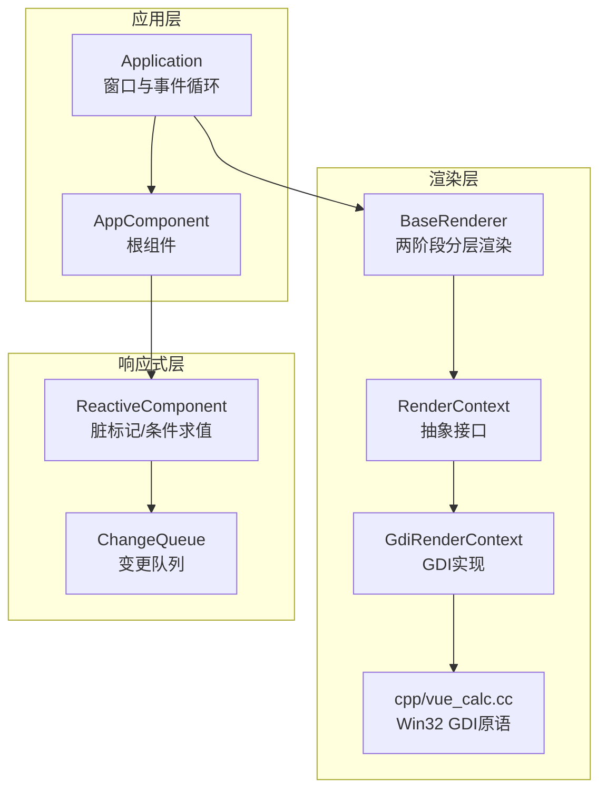
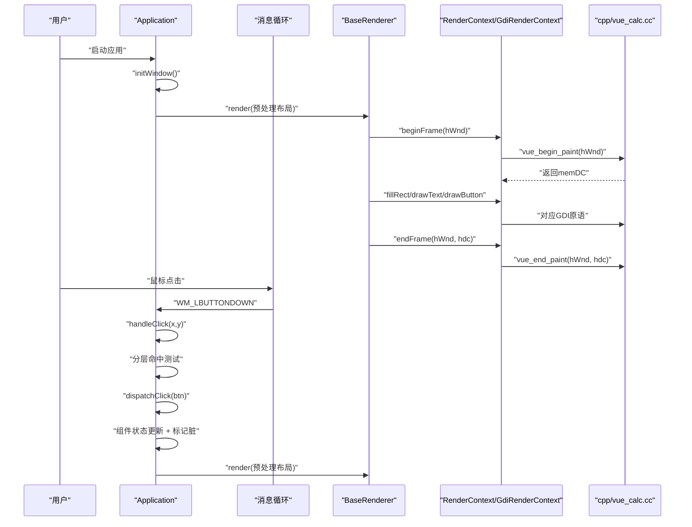
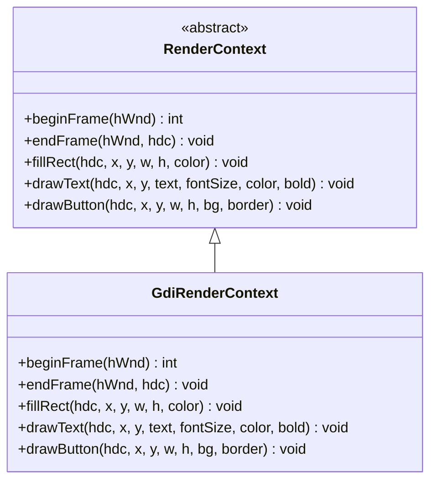
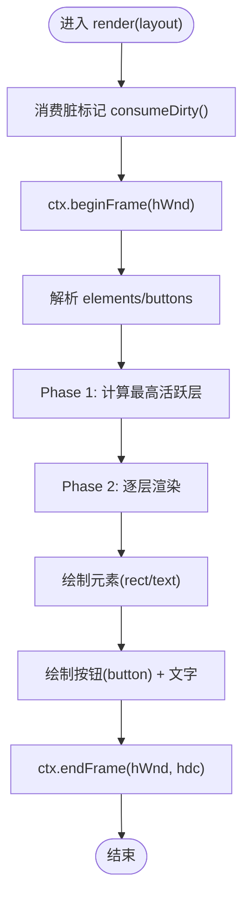
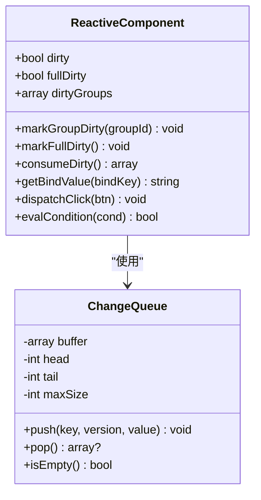
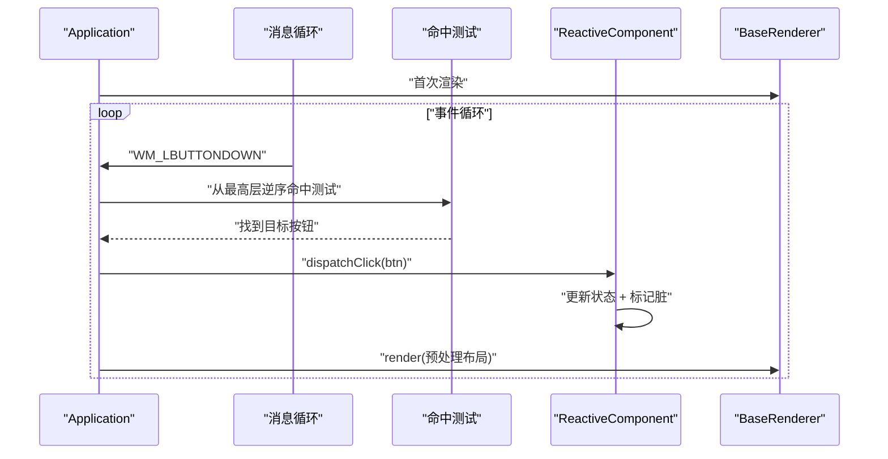
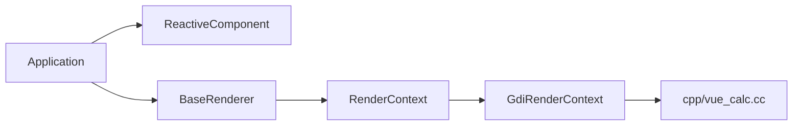

# 渲染系统设计

<cite>
**本文档引用的文件**
- [framework/rendering/RenderContext.php](file://framework/rendering/RenderContext.php)
- [framework/rendering/GdiRenderContext.php](file://framework/rendering/GdiRenderContext.php)
- [framework/BaseRenderer.php](file://framework/BaseRenderer.php)
- [framework/ChangeQueue.php](file://framework/ChangeQueue.php)
- [framework/ReactiveComponent.php](file://framework/ReactiveComponent.php)
- [apps/calculator/Application.php](file://apps/calculator/Application.php)
- [apps/calculator/main.php](file://apps/calculator/main.php)
- [cpp/vue_calc.cc](file://cpp/vue_calc.cc)
- [apps/calculator/gen/AppComponent.php](file://apps/calculator/gen/AppComponent.php)
- [apps/calculator/gen/DisplayPanelComponent.php](file://apps/calculator/gen/DisplayPanelComponent.php)
</cite>

## 目录
1. [简介](#简介)
2. [项目结构](#项目结构)
3. [核心组件](#核心组件)
4. [架构总览](#架构总览)
5. [详细组件分析](#详细组件分析)
6. [依赖关系分析](#依赖关系分析)
7. [性能考量](#性能考量)
8. [故障排查指南](#故障排查指南)
9. [结论](#结论)

## 简介
本设计文档聚焦于VueCalc框架的渲染系统，围绕以下目标展开：
- 深入解释GdiRenderContext的Windows GDI渲染实现，包括坐标系统、绘制命令和图形状态管理
- 描述RenderContext接口的设计规范，强调渲染上下文抽象与平台无关性
- 阐述BaseRenderer的渲染器基类，涵盖渲染队列管理、事件处理与性能优化策略
- 解释渲染系统的分层架构：布局计算、绘制命令生成与GDI调用封装
- 描述事件驱动的渲染机制：鼠标事件处理、窗口消息循环与重绘触发条件
- 提供渲染流程图、事件处理时序图与性能优化策略，帮助开发者理解渲染系统的高效实现与扩展方式

## 项目结构
渲染系统主要分布在以下模块：
- 渲染抽象层：RenderContext（抽象基类）、GdiRenderContext（Windows GDI实现）
- 渲染执行层：BaseRenderer（两阶段分层渲染）
- 响应式与事件：ReactiveComponent（脏标记）、ChangeQueue（变更队列）
- 应用控制层：Application（窗口初始化、事件循环、点击分发）
- C++桥接层：cpp/vue_calc.cc（Win32 GDI原语与消息循环）
- 生成组件：apps/calculator/gen/*（布局数据与交互逻辑）

图表来源
- [apps/calculator/Application.php:15-36](file://apps/calculator/Application.php#L15-L36)
- [framework/BaseRenderer.php:15-26](file://framework/BaseRenderer.php#L15-L26)
- [framework/rendering/RenderContext.php:13-29](file://framework/rendering/RenderContext.php#L13-L29)
- [framework/rendering/GdiRenderContext.php:11-37](file://framework/rendering/GdiRenderContext.php#L11-L37)
- [cpp/vue_calc.cc:19-84](file://cpp/vue_calc.cc#L19-L84)
- [framework/ReactiveComponent.php:14-30](file://framework/ReactiveComponent.php#L14-L30)
- [framework/ChangeQueue.php:11-21](file://framework/ChangeQueue.php#L11-L21)

章节来源
- [apps/calculator/Application.php:15-76](file://apps/calculator/Application.php#L15-L76)
- [framework/BaseRenderer.php:15-26](file://framework/BaseRenderer.php#L15-L26)
- [framework/rendering/RenderContext.php:13-29](file://framework/rendering/RenderContext.php#L13-L29)
- [framework/rendering/GdiRenderContext.php:11-37](file://framework/rendering/GdiRenderContext.php#L11-L37)
- [cpp/vue_calc.cc:19-84](file://cpp/vue_calc.cc#L19-L84)
- [framework/ReactiveComponent.php:14-30](file://framework/ReactiveComponent.php#L14-L30)
- [framework/ChangeQueue.php:11-21](file://framework/ChangeQueue.php#L11-L21)

## 核心组件
- RenderContext（抽象基类）：定义与后端无关的绘制接口，包括帧开始/结束、矩形填充、文本绘制、按钮绘制等抽象方法，确保未来可扩展至多后端（如Skia/OpenGL/Web Canvas）。
- GdiRenderContext（GDI实现）：继承RenderContext，将抽象方法映射到C++层的vue_* stub函数，实现Windows GDI绘制原语。
- BaseRenderer：负责两阶段分层渲染，先确定最高活跃层，再按层顺序绘制元素与按钮；同时处理文本对齐、动态字号与按钮文字居中。
- ReactiveComponent：提供脏标记、条件求值与变更队列，驱动渲染器按需重绘。
- ChangeQueue：环形缓冲实现的变更队列，支持组件状态变化时的异步通知。
- Application：窗口初始化、事件循环、点击分发与渲染调度；负责收集组件树布局并传入渲染器。
- cpp/vue_calc.cc：封装Win32 API，提供双缓冲帧、GDI绘制原语与消息循环包装。

章节来源
- [framework/rendering/RenderContext.php:13-29](file://framework/rendering/RenderContext.php#L13-L29)
- [framework/rendering/GdiRenderContext.php:11-37](file://framework/rendering/GdiRenderContext.php#L11-L37)
- [framework/BaseRenderer.php:15-197](file://framework/BaseRenderer.php#L15-L197)
- [framework/ReactiveComponent.php:14-90](file://framework/ReactiveComponent.php#L14-L90)
- [framework/ChangeQueue.php:11-57](file://framework/ChangeQueue.php#L11-L57)
- [apps/calculator/Application.php:15-322](file://apps/calculator/Application.php#L15-L322)
- [cpp/vue_calc.cc:19-157](file://cpp/vue_calc.cc#L19-L157)

## 架构总览
渲染系统采用“数据驱动 + 事件驱动”的双通道设计：
- 数据驱动：ReactiveComponent维护脏标记，Application检测脏状态后触发BaseRenderer进行渲染。
- 事件驱动：Application通过消息循环捕获鼠标事件，进行分层命中测试，将点击事件分发到根组件，组件更新状态并标记脏，再次触发渲染。

图表来源
- [apps/calculator/Application.php:205-263](file://apps/calculator/Application.php#L205-L263)
- [framework/BaseRenderer.php:98-196](file://framework/BaseRenderer.php#L98-L196)
- [framework/rendering/GdiRenderContext.php:13-36](file://framework/rendering/GdiRenderContext.php#L13-L36)
- [cpp/vue_calc.cc:90-157](file://cpp/vue_calc.cc#L90-L157)

## 详细组件分析

### RenderContext接口设计
- 设计目标：提供与后端无关的绘制抽象，便于未来扩展多后端（Skia/OpenGL/Web Canvas）。
- 关键方法：
  - beginFrame：创建双缓冲帧，返回内存设备上下文句柄
  - endFrame：提交双缓冲帧，释放资源
  - fillRect：填充矩形
  - drawText：绘制文本（含字号、颜色、粗体）
  - drawButton：绘制按钮（背景+边框）
- AOT兼容性：使用抽象类+extends模式，已通过Swoole Compiler验证。

章节来源
- [framework/rendering/RenderContext.php:13-29](file://framework/rendering/RenderContext.php#L13-L29)

### GdiRenderContext实现
- 实现要点：
  - 直接委托给C++层的vue_* stub函数，封装5个基础原语
  - beginFrame/endFrame负责双缓冲帧生命周期管理
  - drawText/drawButton分别调用对应的GDI绘制函数
- 与C++层的对应关系：
  - beginFrame -> php_vue_begin_paint
  - endFrame -> php_vue_end_paint
  - fillRect -> php_vue_fill_rect
  - drawText -> php_vue_draw_text
  - drawButton -> php_vue_draw_button

图表来源
- [framework/rendering/RenderContext.php:13-29](file://framework/rendering/RenderContext.php#L13-L29)
- [framework/rendering/GdiRenderContext.php:11-37](file://framework/rendering/GdiRenderContext.php#L11-L37)

章节来源
- [framework/rendering/GdiRenderContext.php:11-37](file://framework/rendering/GdiRenderContext.php#L11-L37)
- [cpp/vue_calc.cc:90-157](file://cpp/vue_calc.cc#L90-L157)

### BaseRenderer渲染器基类
- 两阶段分层渲染：
  - Phase 1：确定最高活跃层（考虑condition与layer）
  - Phase 2：按层从低到高绘制元素与按钮
- 文本渲染增强：
  - 动态字号：根据文本长度调整字号，避免溢出
  - 对齐支持：右对齐与居中对齐，基于容器宽度与字符宽度估算
- 按钮渲染：
  - 绘制背景与边框
  - 按钮文字居中绘制（label字体大小固定）
- 性能优化：
  - AOT安全遍历：使用array_keys()+for循环替代foreach，避免关联数组类型推断问题
  - 条件字段类型校验：确保condition为数组，防止AOT误判
  - 局部变量复用：减少重复计算

图表来源
- [framework/BaseRenderer.php:98-196](file://framework/BaseRenderer.php#L98-L196)

章节来源
- [framework/BaseRenderer.php:98-196](file://framework/BaseRenderer.php#L98-L196)

### ReactiveComponent与ChangeQueue
- ReactiveComponent：
  - 脏标记：dirty/fullDirty/group级dirty追踪
  - 条件求值：支持truthy/falsy/==/!=等条件表达式
  - 绑定值获取：用于文本渲染的数据源
- ChangeQueue：
  - 环形缓冲：固定最大容量，push/pop支持O(1)时间复杂度
  - 变更存储：key/version/value三元组，value统一转字符串

图表来源
- [framework/ReactiveComponent.php:14-90](file://framework/ReactiveComponent.php#L14-L90)
- [framework/ChangeQueue.php:11-57](file://framework/ChangeQueue.php#L11-L57)

章节来源
- [framework/ReactiveComponent.php:14-90](file://framework/ReactiveComponent.php#L14-L90)
- [framework/ChangeQueue.php:11-57](file://framework/ChangeQueue.php#L11-L57)

### Application事件驱动渲染机制
- 窗口初始化：创建窗口、显示窗口、挂载组件树、创建渲染器
- 事件循环：
  - 使用vue_peek_message轮询消息
  - 处理WM_LBUTTONDOWN：进行分层命中测试，找到最上层且满足条件的按钮
  - 分发点击到根组件，组件更新状态并标记脏
- 渲染调度：仅在dirty为true时调用渲染器，传入预处理后的布局数据
- FPS控制：usleep(16000)约60FPS

图表来源
- [apps/calculator/Application.php:205-322](file://apps/calculator/Application.php#L205-L322)

章节来源
- [apps/calculator/Application.php:205-322](file://apps/calculator/Application.php#L205-L322)

### 布局数据与坐标系统
- 布局数据结构：
  - elements：包含rect与text元素，支持layer、condition、group_id、containerW/containerX等
  - buttons：包含按钮配置，支持label、handler、arg、layer、condition、group_id等
- 坐标系统：
  - 采用屏幕坐标系，x/y为左上角坐标
  - 元素与按钮支持相对偏移，Application在收集布局时递归累加offset
  - 文本对齐基于容器边界计算，右对齐与居中对齐均考虑容器X/W与字符宽度估算

章节来源
- [apps/calculator/gen/AppComponent.php:194-669](file://apps/calculator/gen/AppComponent.php#L194-L669)
- [apps/calculator/gen/DisplayPanelComponent.php:18-52](file://apps/calculator/gen/DisplayPanelComponent.php#L18-L52)
- [apps/calculator/Application.php:120-200](file://apps/calculator/Application.php#L120-L200)

## 依赖关系分析
- 组件耦合：
  - Application依赖ReactiveComponent与BaseRenderer，负责调度
  - BaseRenderer依赖RenderContext，实现两阶段分层渲染
  - GdiRenderContext依赖C++层GDI原语，完成最终绘制
- 外部依赖：
  - Win32 API：窗口创建、消息循环、GDI绘制
  - Swoole AOT编译器：要求抽象类+extends模式与AOT安全遍历

图表来源
- [apps/calculator/Application.php:15-36](file://apps/calculator/Application.php#L15-L36)
- [framework/BaseRenderer.php:15-26](file://framework/BaseRenderer.php#L15-L26)
- [framework/rendering/RenderContext.php:13-29](file://framework/rendering/RenderContext.php#L13-L29)
- [framework/rendering/GdiRenderContext.php:11-37](file://framework/rendering/GdiRenderContext.php#L11-L37)
- [cpp/vue_calc.cc:19-84](file://cpp/vue_calc.cc#L19-L84)

章节来源
- [apps/calculator/Application.php:15-36](file://apps/calculator/Application.php#L15-L36)
- [framework/BaseRenderer.php:15-26](file://framework/BaseRenderer.php#L15-L26)
- [framework/rendering/RenderContext.php:13-29](file://framework/rendering/RenderContext.php#L13-L29)
- [framework/rendering/GdiRenderContext.php:11-37](file://framework/rendering/GdiRenderContext.php#L11-L37)
- [cpp/vue_calc.cc:19-84](file://cpp/vue_calc.cc#L19-L84)

## 性能考量
- 渲染优化
  - 两阶段分层渲染：仅在必要层级绘制，减少不必要的绘制开销
  - 文本动态字号：长数字自动缩小，避免溢出与重排
  - AOT安全遍历：避免foreach关联数组类型推断问题，提升编译稳定性
- 事件与调度
  - 仅在dirty为true时触发渲染，降低无效重绘
  - 事件循环中使用usleep(16000)控制帧率，平衡流畅度与CPU占用
- 内存与资源
  - 双缓冲帧：避免闪烁，减少屏幕撕裂
  - GDI对象管理：在GdiRenderContext中及时释放画刷、画笔、字体等资源

章节来源
- [framework/BaseRenderer.php:98-196](file://framework/BaseRenderer.php#L98-L196)
- [apps/calculator/Application.php:248-260](file://apps/calculator/Application.php#L248-L260)
- [cpp/vue_calc.cc:90-157](file://cpp/vue_calc.cc#L90-L157)

## 故障排查指南
- 渲染不触发
  - 检查ReactiveComponent的dirty标记是否被正确设置
  - 确认Application事件循环中是否检测到dirty并调用渲染器
- 文本对齐异常
  - 检查元素是否提供containerW与containerX
  - 确认align设置为right或center，并验证字符宽度估算
- 按钮点击无响应
  - 确认按钮的condition满足evalCondition
  - 检查命中测试是否正确从最高层逆序查找
- GDI绘制异常
  - 检查beginFrame/endFrame配对调用
  - 确认传入的hdc与hWnd有效

章节来源
- [framework/ReactiveComponent.php:56-64](file://framework/ReactiveComponent.php#L56-L64)
- [apps/calculator/Application.php:248-322](file://apps/calculator/Application.php#L248-L322)
- [framework/rendering/GdiRenderContext.php:13-36](file://framework/rendering/GdiRenderContext.php#L13-L36)
- [cpp/vue_calc.cc:90-157](file://cpp/vue_calc.cc#L90-L157)

## 结论
VueCalc渲染系统通过RenderContext抽象与GdiRenderContext实现，结合BaseRenderer的两阶段分层渲染与Application的事件驱动机制，形成了清晰、可扩展且高效的桌面渲染架构。其数据驱动与事件驱动相结合的方式，既保证了响应式状态的即时更新，又通过脏标记与帧率控制实现了良好的性能表现。未来可在RenderContext层面扩展多后端支持，进一步提升框架的通用性与跨平台能力。