# 组件系统设计

<cite>
**本文档引用的文件**
- [framework/BaseComponent.php](file://framework/BaseComponent.php)
- [framework/ReactiveComponent.php](file://framework/ReactiveComponent.php)
- [framework/interfaces/ComponentInterface.php](file://framework/interfaces/ComponentInterface.php)
- [framework/ChangeQueue.php](file://framework/ChangeQueue.php)
- [framework/BaseRenderer.php](file://framework/BaseRenderer.php)
- [framework/rendering/RenderContext.php](file://framework/rendering/RenderContext.php)
- [framework/rendering/GdiRenderContext.php](file://framework/rendering/GdiRenderContext.php)
- [framework/Application.php](file://framework/Application.php)
- [framework/sfc-compiler.php](file://framework/sfc-compiler.php)
- [framework/compiler/ast-nodes.php](file://framework/compiler/ast-nodes.php)
- [framework/compiler/template-parser.php](file://framework/compiler/template-parser.php)
- [apps/calculator/App.vue](file://apps/calculator/App.vue)
- [apps/calculator/main.php](file://apps/calculator/main.php)
- [apps/calculator/components/DisplayPanel.vue](file://apps/calculator/components/DisplayPanel.vue)
</cite>

## 更新摘要
**所做更改**
- 新增ComponentFactory架构设计章节，详细介绍组件工厂模式的实现
- 新增v-if动态组件支持章节，说明条件挂载/卸载机制
- 更新组件树结构管理，增加动态组件处理流程
- 新增组件缓存池管理机制
- 更新渲染系统架构，支持动态组件渲染
- 新增v-if条件解析和评估机制

## 目录
1. [简介](#简介)
2. [项目结构](#项目结构)
3. [核心组件](#核心组件)
4. [架构概览](#架构概览)
5. [详细组件分析](#详细组件分析)
6. [ComponentFactory架构](#componentfactory架构)
7. [v-if动态组件支持](#v-if动态组件支持)
8. [依赖分析](#依赖分析)
9. [性能考虑](#性能考虑)
10. [故障排除指南](#故障排除指南)
11. [结论](#结论)

## 简介

VueCalc框架的组件系统是一个基于PHP实现的高性能UI框架，采用AOT（Ahead-of-Time）编译优化和数据驱动渲染设计。该系统提供了完整的组件生命周期管理、响应式状态更新、高效的渲染机制以及最新的v-if动态组件支持。

组件系统的核心设计理念包括：
- **组件树结构管理**：支持父子组件关系维护和深度优先遍历
- **响应式机制**：通过脏标记系统实现状态变更检测和自动重绘
- **AOT兼容性**：针对静态编译器的特殊约束进行优化
- **数据驱动渲染**：基于布局数据的高效渲染流程
- **动态组件支持**：通过ComponentFactory实现组件实例化和v-if条件渲染
- **组件缓存管理**：支持组件实例的缓存和复用机制

## 项目结构

VueCalc框架采用模块化的文件组织方式，主要分为以下几个层次：

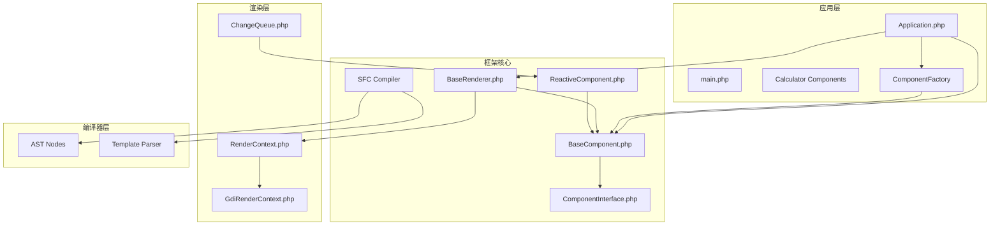

**图表来源**
- [framework/Application.php:1-400](file://framework/Application.php#L1-L400)
- [framework/sfc-compiler.php:820-865](file://framework/sfc-compiler.php#L820-L865)
- [framework/BaseComponent.php:1-177](file://framework/BaseComponent.php#L1-L177)
- [framework/ReactiveComponent.php:1-90](file://framework/ReactiveComponent.php#L1-L90)
- [framework/interfaces/ComponentInterface.php:1-52](file://framework/interfaces/ComponentInterface.php#L1-L52)
- [framework/BaseRenderer.php:1-197](file://framework/BaseRenderer.php#L1-L197)

**章节来源**
- [framework/Application.php:1-400](file://framework/Application.php#L1-L400)
- [framework/sfc-compiler.php:820-865](file://framework/sfc-compiler.php#L820-L865)
- [framework/BaseComponent.php:1-177](file://framework/BaseComponent.php#L1-L177)
- [framework/ReactiveComponent.php:1-90](file://framework/ReactiveComponent.php#L1-L90)
- [framework/interfaces/ComponentInterface.php:1-52](file://framework/interfaces/ComponentInterface.php#L1-L52)

## 核心组件

### ComponentInterface接口设计

ComponentInterface定义了组件系统的核心契约，确保所有组件都具备统一的接口规范：

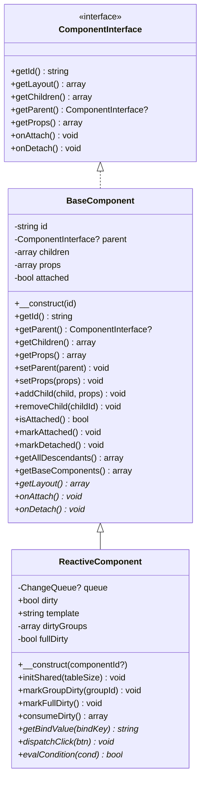

**图表来源**
- [framework/interfaces/ComponentInterface.php:13-52](file://framework/interfaces/ComponentInterface.php#L13-L52)
- [framework/BaseComponent.php:16-177](file://framework/BaseComponent.php#L16-L177)
- [framework/ReactiveComponent.php:14-90](file://framework/ReactiveComponent.php#L14-L90)

### BaseComponent基础组件类

BaseComponent作为所有组件的基类，提供了完整的组件树结构管理功能：

**核心功能特性**：
- **组件标识管理**：每个组件都有唯一的ID标识
- **父子关系维护**：支持动态添加和移除子组件
- **属性配置系统**：通过props数组传递配置参数
- **生命周期管理**：提供挂载和卸载状态跟踪
- **深度遍历算法**：支持组件树的深度优先遍历

**章节来源**
- [framework/BaseComponent.php:16-177](file://framework/BaseComponent.php#L16-L177)

### ReactiveComponent响应式组件

ReactiveComponent扩展了BaseComponent，增加了响应式状态管理能力：

**响应式机制设计**：
- **脏标记系统**：通过$dirty布尔值跟踪状态变更
- **分组脏标记**：支持按组别的精细化重绘控制
- **全量重绘标志**：处理首帧渲染和强制刷新场景
- **变更队列集成**：与ChangeQueue配合实现异步更新
- **v-if条件评估**：支持动态组件条件渲染

**章节来源**
- [framework/ReactiveComponent.php:14-90](file://framework/ReactiveComponent.php#L14-L90)

## 架构概览

VueCalc组件系统的整体架构采用分层设计，从底层渲染到上层应用形成清晰的职责分离：

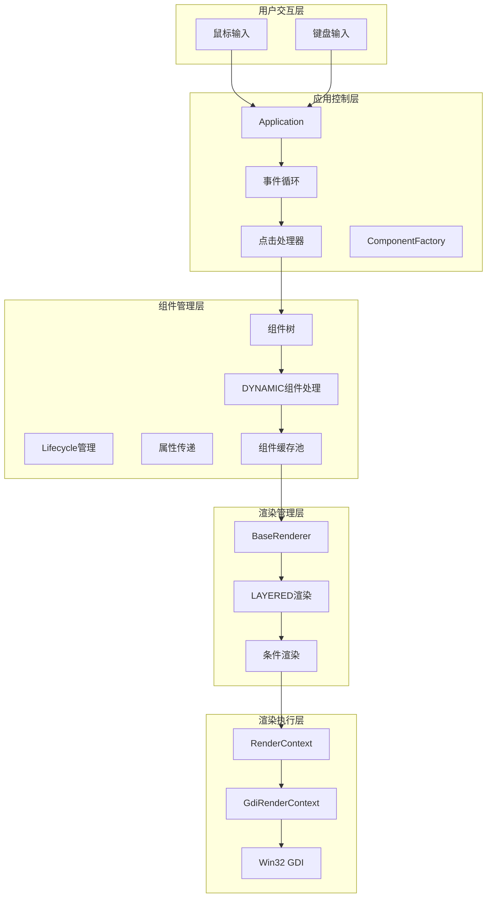

**图表来源**
- [framework/Application.php:86-151](file://framework/Application.php#L86-L151)
- [framework/BaseRenderer.php:15-197](file://framework/BaseRenderer.php#L15-L197)
- [framework/rendering/RenderContext.php:13-30](file://framework/rendering/RenderContext.php#L13-L30)

## 详细组件分析

### 组件树结构管理

组件树结构是VueCalc框架的核心数据结构，负责维护整个UI层次关系：

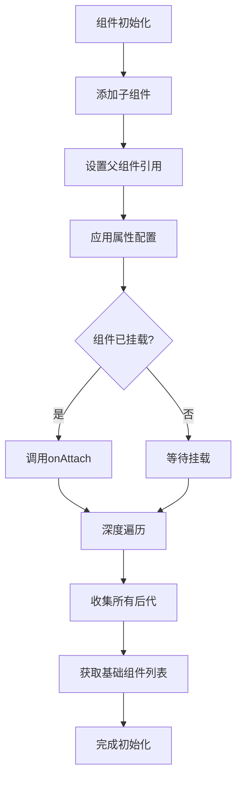

**图表来源**
- [framework/BaseComponent.php:84-105](file://framework/BaseComponent.php#L84-L105)
- [framework/BaseComponent.php:137-170](file://framework/BaseComponent.php#L137-L170)

**章节来源**
- [framework/BaseComponent.php:84-105](file://framework/BaseComponent.php#L84-L105)
- [framework/BaseComponent.php:137-170](file://framework/BaseComponent.php#L137-L170)

### 生命周期管理流程

VueCalc框架采用简化的生命周期设计，主要包含挂载和卸载两个关键阶段：

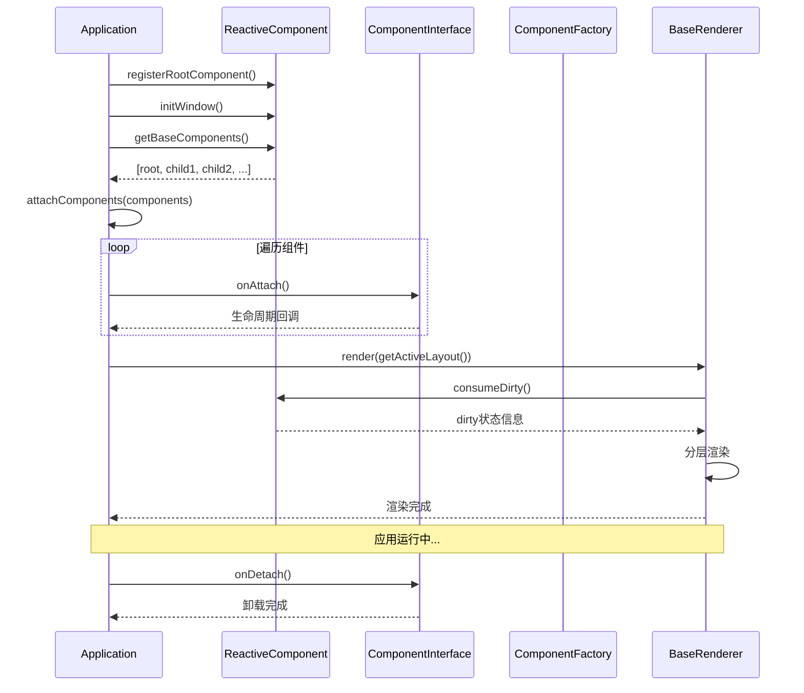

**图表来源**
- [framework/Application.php:66-91](file://framework/Application.php#L66-L91)
- [framework/Application.php:205-263](file://framework/Application.php#L205-L263)
- [framework/BaseRenderer.php:98-196](file://framework/BaseRenderer.php#L98-L196)

**章节来源**
- [framework/Application.php:66-91](file://framework/Application.php#L66-L91)
- [framework/Application.php:205-263](file://framework/Application.php#L205-L263)

### 响应式状态管理

ReactiveComponent实现了高效的响应式状态管理系统，通过脏标记机制实现智能重绘：

```mermaid
flowchart TD
STATECHANGE[状态变更] --> SETDIRTY[设置dirty=true]
SETDIRTY --> MARKGROUP[markGroupDirty()]
MARKGROUP --> GROUPDIRTY[标记分组脏]
GROUPDIRTY --> MARKFULL[markFullDirty()]
MARKFULL --> FULLDIRTY[标记全量脏]
FULLDIRTY --> EVENTLOOP[事件循环检测]
GROUPDIRTY --> EVENTLOOP
EVENTLOOP --> CHECKDIRTY{dirty状态?}
CHECKDIRTY --> |false| WAIT[等待下次循环]
CHECKDIRTY --> |true| CONSUMEDIRTY[consumeDirty]
CONSUMEDIRTY --> RENDER[触发渲染]
RENDER --> COLLECTLAYOUT[收集布局数据]
COLLECTLAYOUT --> APPLYOFFSET[应用偏移变换]
APPLYOFFSET --> LAYEREDRENDER[分层渲染]
LAYEREDRENDER --> RESETDIRTY[重置dirty=false]
RESETDIRTY --> WAIT
```

**图表来源**
- [framework/ReactiveComponent.php:31-64](file://framework/ReactiveComponent.php#L31-L64)
- [framework/Application.php:248-257](file://framework/Application.php#L248-L257)

**章节来源**
- [framework/ReactiveComponent.php:31-64](file://framework/ReactiveComponent.php#L31-L64)
- [framework/Application.php:248-257](file://framework/Application.php#L248-L257)

### 渲染系统架构

BaseRenderer实现了两阶段分层渲染机制，支持复杂的UI层次结构：

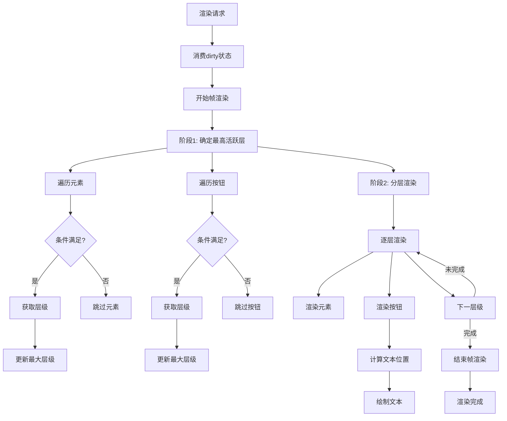

**图表来源**
- [framework/BaseRenderer.php:98-196](file://framework/BaseRenderer.php#L98-L196)

**章节来源**
- [framework/BaseRenderer.php:98-196](file://framework/BaseRenderer.php#L98-L196)

### 事件处理机制

VueCalc框架实现了高效的事件处理系统，支持分层命中测试和事件冒泡：

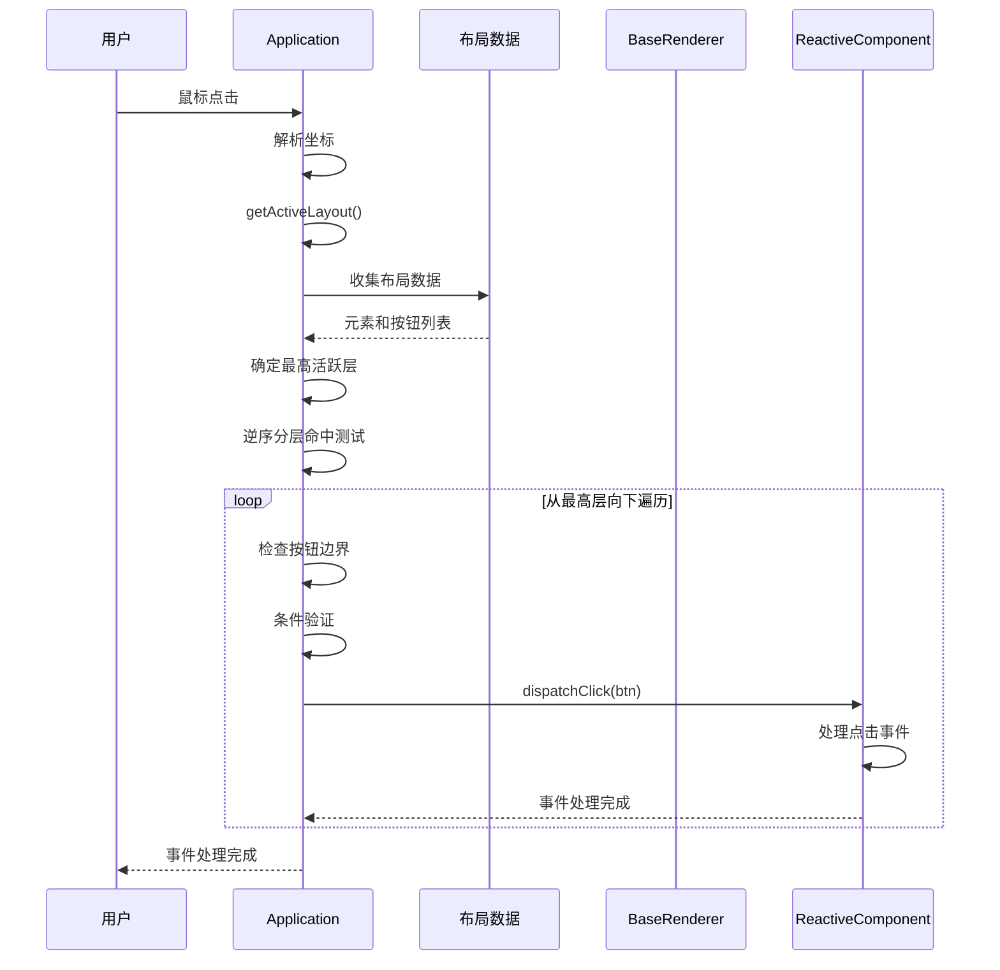

**图表来源**
- [framework/Application.php:269-321](file://framework/Application.php#L269-L321)

**章节来源**
- [framework/Application.php:269-321](file://framework/Application.php#L269-L321)

## ComponentFactory架构

### 组件工厂模式设计

ComponentFactory是VueCalc框架中引入的重要架构组件，专门负责组件实例的创建和管理：

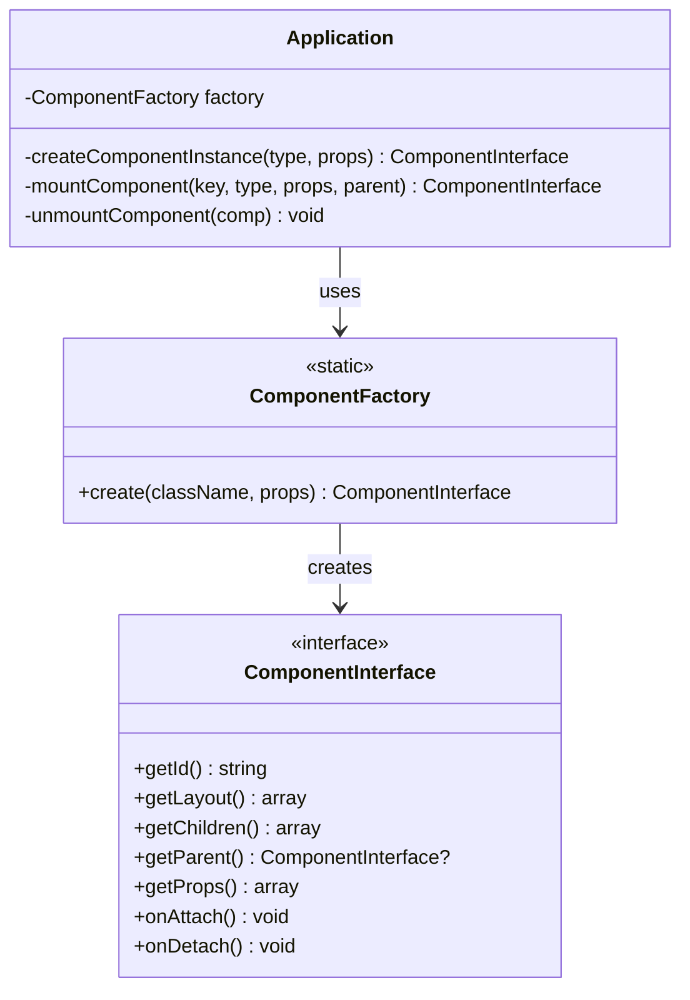

**图表来源**
- [framework/sfc-compiler.php:828-858](file://framework/sfc-compiler.php#L828-L858)
- [framework/Application.php:148-151](file://framework/Application.php#L148-L151)

### 组件实例化流程

ComponentFactory通过switch-case语句实现AOT安全的组件实例化：

```mermaid
flowchart TD
START[create()调用] --> SWITCH[switch className]
SWITCH --> CASE1{匹配组件类型}
CASE1 --> |DisplayPanel| NEW1[new DisplayPanel()]
CASE1 --> |NumPad| NEW2[new NumPad()]
CASE1 --> |AboutDialog| NEW3[new AboutDialog()]
CASE1 --> |其他| THROW[抛出异常]
NEW1 --> PROPS1[设置属性]
NEW2 --> PROPS2[设置属性]
NEW3 --> PROPS3[设置属性]
PROPS1 --> RETURN[返回组件实例]
PROPS2 --> RETURN
PROPS3 --> RETURN
THROW --> END[结束]
RETURN --> END
```

**图表来源**
- [framework/sfc-compiler.php:838-857](file://framework/sfc-compiler.php#L838-L857)

**章节来源**
- [framework/sfc-compiler.php:828-858](file://framework/sfc-compiler.php#L828-L858)
- [framework/Application.php:148-151](file://framework/Application.php#L148-L151)

## v-if动态组件支持

### 条件渲染机制

VueCalc框架引入了v-if指令支持，允许组件根据条件动态挂载和卸载：

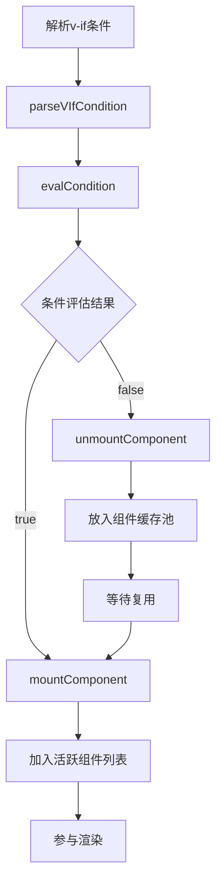

**图表来源**
- [framework/compiler/template-parser.php:848-864](file://framework/compiler/template-parser.php#L848-L864)
- [framework/Application.php:222-264](file://framework/Application.php#L222-L264)

### 组件缓存池管理

Application类实现了组件缓存池机制，支持组件实例的复用：

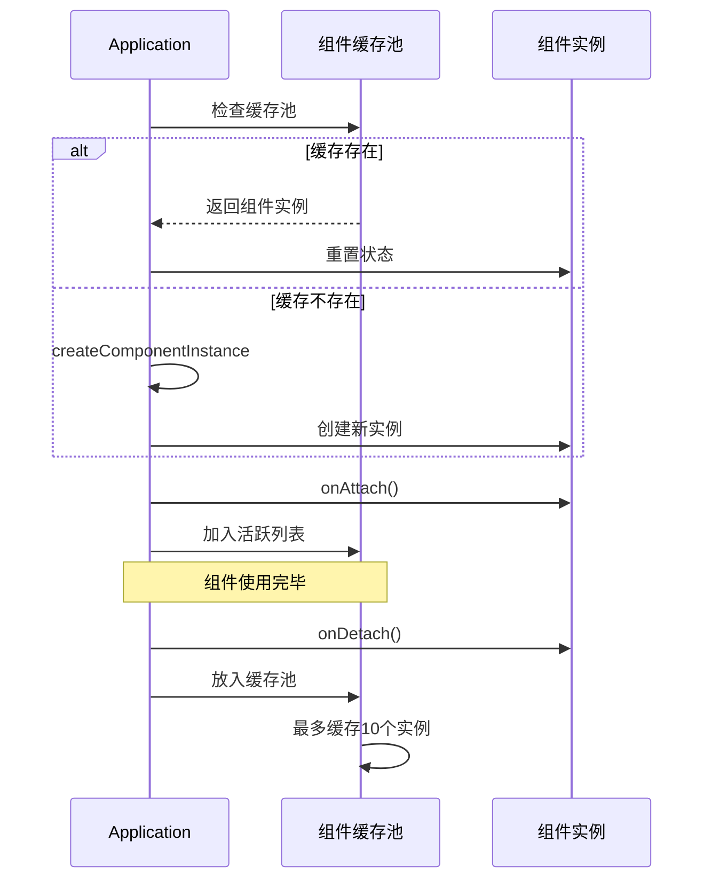

**图表来源**
- [framework/Application.php:94-139](file://framework/Application.php#L94-L139)

### v-if条件解析

模板解析器支持多种v-if条件语法：

| 条件语法 | 解析结果 | 说明 |
|---------|---------|------|
| `propName` | `['prop' => 'propName', 'op' => 'truthy']` | 属性非空检查 |
| `!propName` | `['prop' => 'propName', 'op' => 'falsy']` | 属性为空检查 |
| `propName == 'val'` | `['prop' => 'propName', 'op' => '==', 'value' => 'val']` | 等值比较 |
| `propName != 'val'` | `['prop' => 'propName', 'op' => '!=', 'value' => 'val']` | 不等比较 |

**章节来源**
- [framework/compiler/template-parser.php:848-864](file://framework/compiler/template-parser.php#L848-L864)
- [framework/Application.php:94-139](file://framework/Application.php#L94-L139)

## 依赖分析

VueCalc组件系统的依赖关系体现了清晰的分层架构：

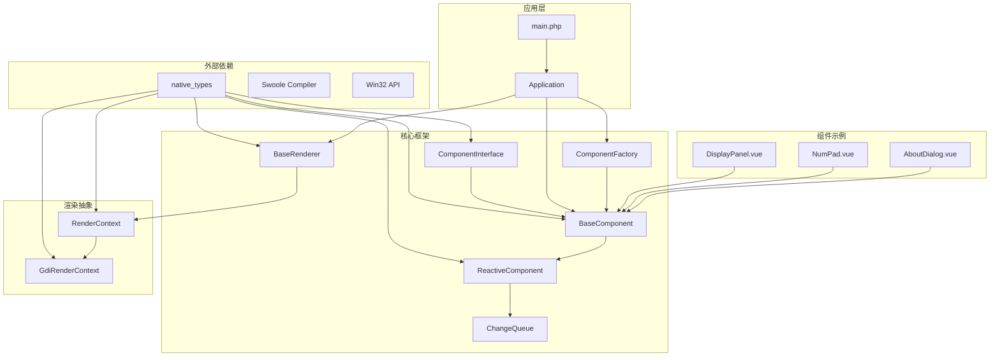

**图表来源**
- [framework/interfaces/ComponentInterface.php:1-52](file://framework/interfaces/ComponentInterface.php#L1-L52)
- [framework/BaseComponent.php:1-177](file://framework/BaseComponent.php#L1-L177)
- [framework/ReactiveComponent.php:1-90](file://framework/ReactiveComponent.php#L1-L90)
- [framework/BaseRenderer.php:1-197](file://framework/BaseRenderer.php#L1-L197)
- [framework/sfc-compiler.php:828-858](file://framework/sfc-compiler.php#L828-L858)

**章节来源**
- [framework/interfaces/ComponentInterface.php:1-52](file://framework/interfaces/ComponentInterface.php#L1-L52)
- [framework/BaseComponent.php:1-177](file://framework/BaseComponent.php#L1-L177)
- [framework/ReactiveComponent.php:1-90](file://framework/ReactiveComponent.php#L1-L90)
- [framework/BaseRenderer.php:1-197](file://framework/BaseRenderer.php#L1-L197)
- [framework/sfc-compiler.php:828-858](file://framework/sfc-compiler.php#L828-L858)

## 性能考虑

VueCalc框架在设计时充分考虑了性能优化，特别是在AOT编译环境下的特殊约束：

### AOT兼容性优化

框架采用了多项针对AOT编译器的优化策略：

- **类型安全保证**：使用显式类型转换确保编译器正确推断类型
- **循环优化**：使用array_keys()+for循环替代foreach避免类型推断问题
- **数组引用保持**：使用(array)类型转换保持数组引用完整性
- **字符串处理**：使用strval()确保字符串类型一致性
- **switch-case实例化**：ComponentFactory使用switch-case替代动态new

### 渲染性能优化

- **脏标记驱动**：仅在状态变更时触发渲染，避免不必要的重绘
- **分层渲染**：通过确定最高活跃层减少无效渲染区域
- **条件渲染**：支持复杂条件表达式的快速评估
- **批量处理**：组件树的批量挂载和卸载操作
- **组件缓存复用**：减少组件创建开销

### 内存管理优化

- **组件池管理**：活跃组件列表的高效查找和更新
- **布局数据缓存**：动态偏移应用后的布局数据复用
- **渲染上下文复用**：单帧内多次渲染共享上下文资源
- **缓存池限制**：最多缓存10个组件实例，防止内存泄漏

## 故障排除指南

### 常见问题诊断

**组件挂载问题**
- 检查组件ID唯一性
- 验证父子组件关系设置
- 确认onAttach/onDetach调用顺序
- 验证ComponentFactory是否正确注册组件

**渲染异常问题**
- 检查布局数据格式正确性
- 验证条件表达式语法
- 确认分层渲染逻辑
- 检查v-if条件解析结果

**事件处理问题**
- 验证点击坐标计算准确性
- 检查条件过滤逻辑
- 确认事件冒泡处理
- 验证组件缓存池状态

**v-if动态组件问题**
- 检查组件key唯一性
- 验证v-if条件语法正确性
- 确认组件缓存池容量限制
- 检查组件实例复用逻辑

### 调试技巧

**日志记录**
- 在关键生命周期节点添加调试输出
- 记录组件树遍历过程
- 监控脏标记状态变化
- 跟踪v-if条件评估过程

**性能监控**
- 测量渲染帧率
- 监控内存使用情况
- 分析事件处理延迟
- 统计组件缓存命中率

**章节来源**
- [framework/Application.php:253-255](file://framework/Application.php#L253-L255)
- [framework/Application.php:229-232](file://framework/Application.php#L229-L232)

## 结论

VueCalc框架的组件系统通过精心设计的架构实现了高性能的UI渲染和事件处理。其核心优势包括：

**设计亮点**：
- **简洁而强大的接口设计**：ComponentInterface提供了最小但完整的能力集合
- **高效的组件树管理**：支持动态添加、移除和遍历操作
- **智能的响应式机制**：脏标记系统确保只在必要时进行重绘
- **优秀的AOT兼容性**：针对静态编译器进行了全面优化
- **创新的ComponentFactory架构**：通过工厂模式实现组件实例化
- **灵活的v-if动态组件支持**：支持条件挂载/卸载和组件缓存复用

**技术特色**：
- **数据驱动渲染**：基于布局数据的高效渲染流程
- **分层渲染架构**：支持复杂的UI层次结构
- **事件处理系统**：精确的命中测试和事件分发
- **组件缓存管理**：智能的组件实例复用机制
- **跨平台抽象**：RenderContext提供后端无关的渲染接口

**最新特性**：
- **组件工厂模式**：通过ComponentFactory实现AOT安全的组件实例化
- **v-if条件渲染**：支持基于条件的动态组件挂载和卸载
- **组件缓存池**：最多缓存10个组件实例，提升性能表现
- **条件解析引擎**：支持多种v-if语法格式的解析和评估

该框架为构建高性能桌面应用程序提供了坚实的技术基础，特别适合需要实时交互、复杂UI层次和动态组件管理的应用场景。