# 编译器架构

<cite>
**本文引用的文件**
- [sfc-compiler.php](file://framework/sfc-compiler.php)
- [template-parser.php](file://framework/compiler/template-parser.php)
- [ast-nodes.php](file://framework/compiler/ast-nodes.php)
- [aot-validator.php](file://framework/compiler/aot-validator.php)
- [component-registry.php](file://framework/compiler/component-registry.php)
- [component-resolver.php](file://framework/compiler/component-resolver.php)
- [css-mappings.php](file://framework/compiler/css-mappings.php)
- [script-analyzer.php](file://framework/compiler/script-analyzer.php)
- [ComponentInterface.php](file://framework/interfaces/ComponentInterface.php)
- [BaseComponent.php](file://framework/BaseComponent.php)
- [ReactiveComponent.php](file://framework/ReactiveComponent.php)
- [App.vue](file://apps/calculator/App.vue)
- [project.yml](file://apps/calculator/project.yml)
- [DisplayPanel.vue](file://apps/calculator/components/DisplayPanel.vue)
</cite>

## 更新摘要
**所做更改**
- 更新了模板解析器的v6 M3架构说明，新增v-for循环支持
- 修订了AST节点系统，增加了ForNode节点类型
- 更新了代码生成流程，移除了AppLayout_gen.php生成
- 新增了组件工厂类的自动生成机制
- 修订了组件注册系统的功能说明
- 更新了AOT验证器的验证规则和报告机制

## 目录
1. [引言](#引言)
2. [项目结构](#项目结构)
3. [核心组件](#核心组件)
4. [架构总览](#架构总览)
5. [详细组件分析](#详细组件分析)
6. [依赖关系分析](#依赖关系分析)
7. [性能考量](#性能考量)
8. [故障排查指南](#故障排查指南)
9. [结论](#结论)
10. [附录](#附录)

## 引言
本文件面向VueCalc框架的SFC编译器，系统化阐述从Vue单文件组件到PHP代码的完整转换流程。重点覆盖以下方面：
- 模板解析：递归下降解析器如何构建AST节点、解析指令与属性，并进行布局数组的代码生成准备。
- AOT验证：在生成代码写盘前执行的兼容性检查与错误报告机制。
- 组件注册：通过项目配置将自定义标签映射到.vue源文件，支持组件发现与编译期内联。
- 插件与扩展：基于模块化的编译管线，便于接入新的解析规则、样式映射与脚本分析策略。

## 项目结构
编译器位于framework/compiler目录下，围绕"块提取→样式解析→模板解析→组件解析→布局生成→AOT验证→代码生成"的流水线组织。应用侧通过project.yml声明组件映射，主入口sfc-compiler.php串联各阶段。

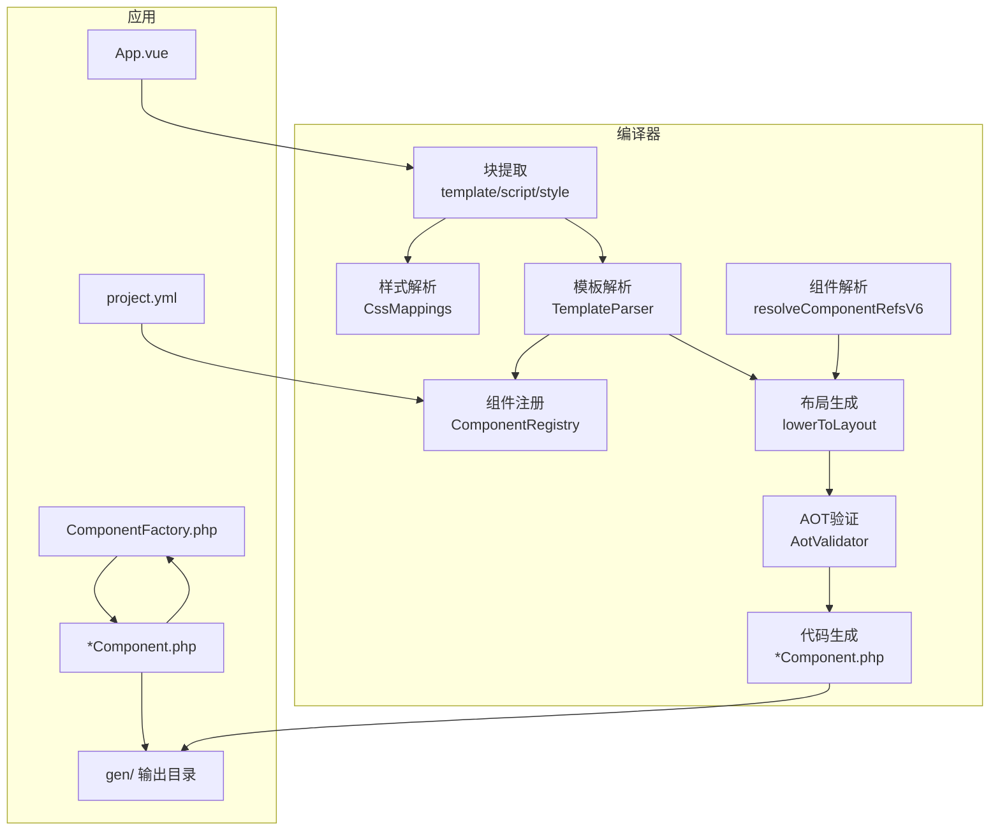

**图表来源**
- [sfc-compiler.php:227-800](file://framework/sfc-compiler.php#L227-L800)
- [template-parser.php:61-208](file://framework/compiler/template-parser.php#L61-L208)
- [css-mappings.php:15-194](file://framework/compiler/css-mappings.php#L15-L194)
- [component-registry.php:14-69](file://framework/compiler/component-registry.php#L14-L69)
- [aot-validator.php:18-121](file://framework/compiler/aot-validator.php#L18-L121)

**章节来源**
- [sfc-compiler.php:27-89](file://framework/sfc-compiler.php#L27-L89)
- [project.yml:29-34](file://apps/calculator/project.yml#L29-L34)

## 核心组件
- 模板解析器：负责将template块解析为AST，支持内置元素(rect/text/grid/btn)与自定义组件引用，产出布局数组。
- AST节点库：统一的节点类型体系，承载位置、样式、指令等元信息。
- 组件注册表：从project.yml加载组件映射，提供标签到源文件的解析。
- 组件解析器：递归展开子组件，应用坐标偏移、属性绑定与条件传播。
- 样式映射：将CSS类映射为渲染参数，支持颜色、字号、粗细等。
- 脚本分析器：自动注入脏标记，减少手写样板代码。
- AOT验证器：在写盘前检查生成代码的AOT兼容性。
- 接口与基类：ComponentInterface、BaseComponent、ReactiveComponent定义了组件树与响应式行为。

**章节来源**
- [ast-nodes.php:9-211](file://framework/compiler/ast-nodes.php#L9-L211)
- [template-parser.php:61-807](file://framework/compiler/template-parser.php#L61-L807)
- [component-registry.php:14-69](file://framework/compiler/component-registry.php#L14-L69)
- [component-resolver.php:9-62](file://framework/compiler/component-resolver.php#L9-L62)
- [css-mappings.php:15-210](file://framework/compiler/css-mappings.php#L15-L210)
- [script-analyzer.php:15-281](file://framework/compiler/script-analyzer.php#L15-L281)
- [aot-validator.php:18-207](file://framework/compiler/aot-validator.php#L18-L207)
- [ComponentInterface.php:13-52](file://framework/interfaces/ComponentInterface.php#L13-L52)
- [BaseComponent.php:16-177](file://framework/BaseComponent.php#L16-L177)
- [ReactiveComponent.php:14-90](file://framework/ReactiveComponent.php#L14-L90)

## 架构总览
编译器采用"阶段化流水线"设计，每个阶段职责清晰、边界明确，便于扩展与维护。

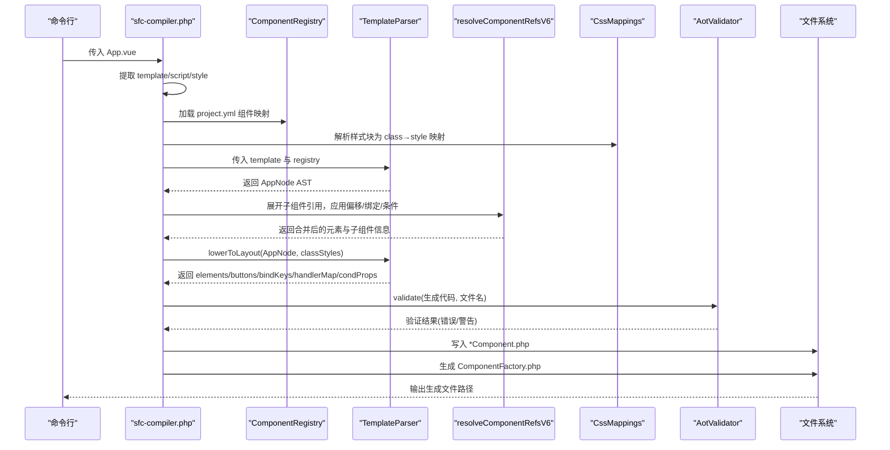

**图表来源**
- [sfc-compiler.php:227-800](file://framework/sfc-compiler.php#L227-L800)
- [template-parser.php:557-686](file://framework/compiler/template-parser.php#L557-L686)
- [aot-validator.php:37-121](file://framework/compiler/aot-validator.php#L37-L121)

## 详细组件分析

### 模板解析器（TemplateParser）
- 词法分析：识别标签、注释、文本与EOF，跟踪行号，收集错误。
- 语法分析：递归下降解析，限定根元素为<app>，支持rect/text/grid/btn与未知标签。
- 指令解析：解析v-if、v-model/:bind、@click等，生成节点级条件与事件映射。
- 组件引用：通过ComponentRegistry解析自定义标签，生成ComponentRefNode。
- v6 M3新增：支持v-for循环指令，生成ForNode节点包装重复元素。
- 代码生成准备：lowerToLayout将AST转为布局数组，收集bindKeys、handlerMap、condProps，进行编译期坐标计算与样式合并。

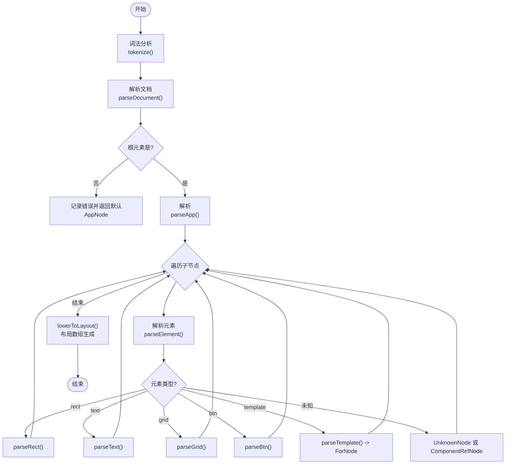

**图表来源**
- [template-parser.php:214-543](file://framework/compiler/template-parser.php#L214-L543)
- [template-parser.php:557-686](file://framework/compiler/template-parser.php#L557-L686)

**章节来源**
- [template-parser.php:61-807](file://framework/compiler/template-parser.php#L61-L807)
- [ast-nodes.php:29-211](file://framework/compiler/ast-nodes.php#L29-L211)

### AST节点体系
- 抽象节点TemplateNode：统一携带line、vIf、layer、groupId等元信息。
- 具体节点：AppNode、RectNode、TextNode、GridNode、BtnNode、UnknownNode、ComponentRefNode、ForNode。
- 设计要点：所有节点均记录源文件行号，便于错误定位；支持v-if条件、图层与分组标识，满足复杂布局与渲染需求。

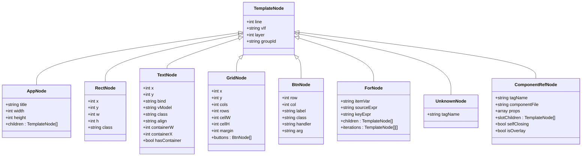

**图表来源**
- [ast-nodes.php:9-211](file://framework/compiler/ast-nodes.php#L9-L211)

**章节来源**
- [ast-nodes.php:9-211](file://framework/compiler/ast-nodes.php#L9-L211)

### 组件注册系统（ComponentRegistry）
- 功能：从project.yml加载组件映射，将自定义标签名映射到绝对路径。
- 行为：支持相对路径解析与存在性校验，缺失文件产生告警。
- 用途：为TemplateParser提供未知标签的解析能力，实现自定义组件引用。

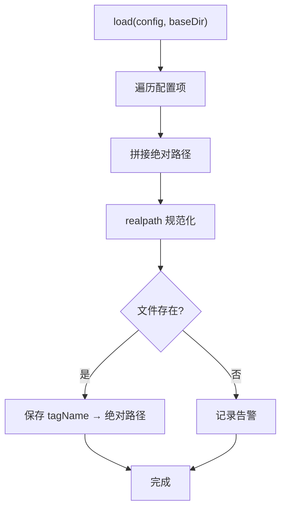

**图表来源**
- [component-registry.php:26-41](file://framework/compiler/component-registry.php#L26-L41)

**章节来源**
- [component-registry.php:14-69](file://framework/compiler/component-registry.php#L14-L69)
- [project.yml:29-34](file://apps/calculator/project.yml#L29-L34)

### 组件解析与内联（resolveComponentRefsV6）
- 递归展开子组件：读取子组件.vue，提取template/style，解析为AST并合并到主组件。
- 坐标偏移与属性绑定：applyOffset与applyPropBindings将父组件的x/y与:prop绑定传递给子组件元素。
- 条件传播：若父组件设置v-if，则传播至其子元素（含grid内的btn）。
- 叠加层与嵌套限制：overlay组件分配更高layer；v6仅支持1级嵌套。

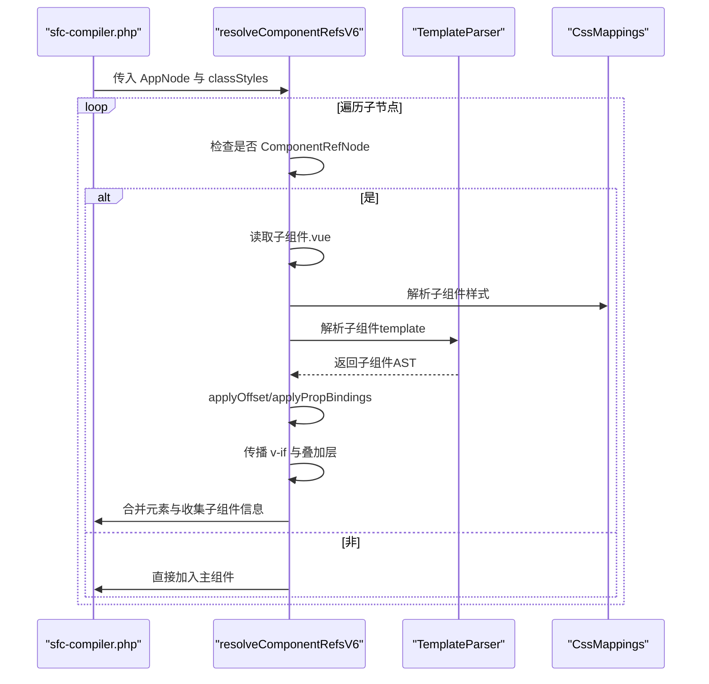

**图表来源**
- [sfc-compiler.php:95-192](file://framework/sfc-compiler.php#L95-L192)
- [component-resolver.php:13-62](file://framework/compiler/component-resolver.php#L13-L62)

**章节来源**
- [sfc-compiler.php:95-192](file://framework/sfc-compiler.php#L95-L192)
- [component-resolver.php:9-62](file://framework/compiler/component-resolver.php#L9-L62)

### 样式映射（CssMappings）
- 支持属性：background/color/font-size/font-weight等，映射到渲染参数（如bg/fg/fontSize/bold）。
- 解析流程：parseStyleBlock提取类→属性映射，提供默认值与告警。
- 辅助函数：颜色转换、边框色派生、像素解析、字体粗细解析、文本对齐解析。

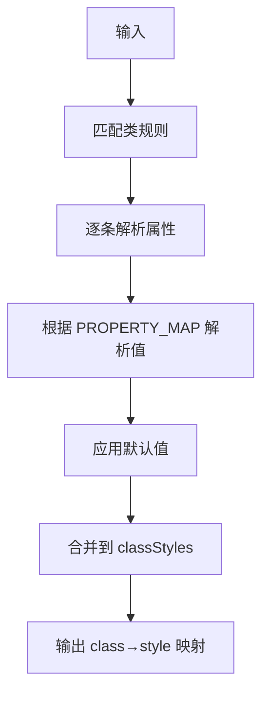

**图表来源**
- [css-mappings.php:164-194](file://framework/compiler/css-mappings.php#L164-L194)

**章节来源**
- [css-mappings.php:15-210](file://framework/compiler/css-mappings.php#L15-L210)

### 脚本分析器（ScriptAnalyzer）
- 自动注入脏标记：扫描typed属性声明，检测方法体中对属性的修改，自动在return与方法末尾注入$dirty标记。
- 清理冗余标记：移除手工$dirty=true，避免重复与冲突。
- 状态机处理：按方法边界拆分头/体，保持缩进与格式。

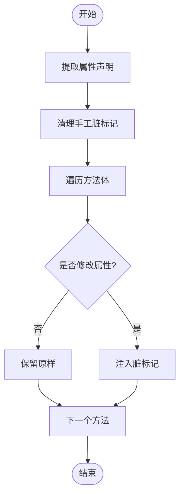

**图表来源**
- [script-analyzer.php:27-281](file://framework/compiler/script-analyzer.php#L27-L281)

**章节来源**
- [script-analyzer.php:15-281](file://framework/compiler/script-analyzer.php#L15-L281)

### AOT验证器（AotValidator）
- 文件名规则：限制文件名主干最多一个点，避免AOT生成无效C++符号。
- 结构限制：禁止const数组嵌套结构；禁止变量属性访问与变量方法调用；禁止变量函数调用。
- 语言兼容：检测PHP8函数，建议回退到兼容写法。
- 嵌套深度：v6仅支持1级嵌套，超过则报错。
- 报告：汇总错误与警告，便于修复后重试。

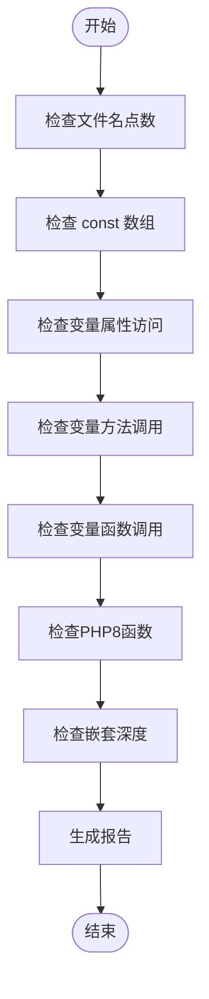

**图表来源**
- [aot-validator.php:37-160](file://framework/compiler/aot-validator.php#L37-L160)

**章节来源**
- [aot-validator.php:18-207](file://framework/compiler/aot-validator.php#L18-L207)

### 代码生成与接口契约
- 生成类：以组件名为基名，继承ReactiveComponent，注入getLayout/registerChildren/getBaseComponents/getBindValue/dispatchClick/evalCondition等方法。
- 生命周期：onAttach/onDetach空实现或由子类覆盖。
- 接口与基类：ComponentInterface定义组件树与布局契约；BaseComponent提供addChild/removeChild等树管理；ReactiveComponent提供脏标记与条件求值抽象。
- v6 M3新增：自动生成ComponentFactory工厂类，支持AOT安全的组件实例化。

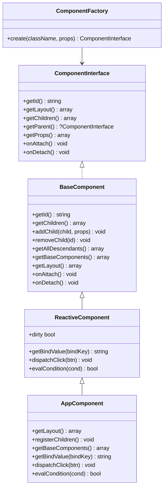

**图表来源**
- [ComponentInterface.php:13-52](file://framework/interfaces/ComponentInterface.php#L13-L52)
- [BaseComponent.php:16-177](file://framework/BaseComponent.php#L16-L177)
- [ReactiveComponent.php:14-90](file://framework/ReactiveComponent.php#L14-L90)
- [sfc-compiler.php:523-581](file://framework/sfc-compiler.php#L523-L581)
- [sfc-compiler.php:820-865](file://framework/sfc-compiler.php#L820-L865)

**章节来源**
- [ComponentInterface.php:13-52](file://framework/interfaces/ComponentInterface.php#L13-L52)
- [BaseComponent.php:16-177](file://framework/BaseComponent.php#L16-L177)
- [ReactiveComponent.php:14-90](file://framework/ReactiveComponent.php#L14-L90)
- [sfc-compiler.php:523-581](file://framework/sfc-compiler.php#L523-L581)
- [sfc-compiler.php:820-865](file://framework/sfc-compiler.php#L820-L865)

## 依赖关系分析
- sfc-compiler.php作为编译入口，依赖各模块：ast-nodes、css-mappings、template-parser、aot-validator、script-analyzer、component-registry、component-resolver。
- TemplateParser依赖ast-nodes与component-registry；lowerToLayout依赖css-mappings。
- 组件解析依赖component-resolver与css-mappings；代码生成依赖接口与基类。

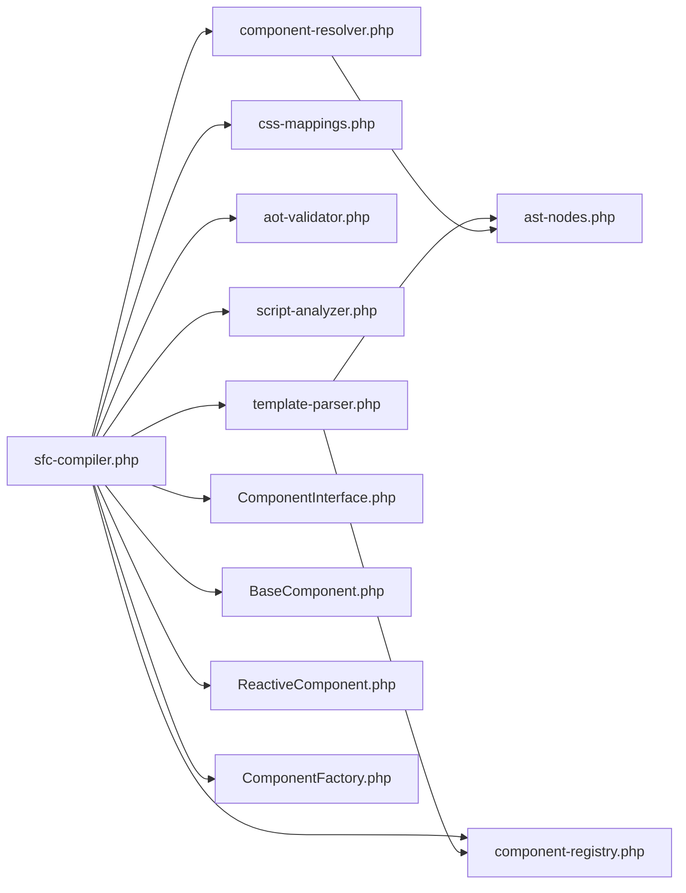

**图表来源**
- [sfc-compiler.php:27-36](file://framework/sfc-compiler.php#L27-L36)
- [template-parser.php:16-17](file://framework/compiler/template-parser.php#L16-L17)
- [ast-nodes.php:1-8](file://framework/compiler/ast-nodes.php#L1-L8)
- [css-mappings.php:1-14](file://framework/compiler/css-mappings.php#L1-L14)
- [aot-validator.php:1-16](file://framework/compiler/aot-validator.php#L1-L16)
- [script-analyzer.php:1-13](file://framework/compiler/script-analyzer.php#L1-L13)
- [component-registry.php:1-12](file://framework/compiler/component-registry.php#L1-L12)
- [component-resolver.php:1-7](file://framework/compiler/component-resolver.php#L1-L7)
- [ComponentInterface.php:1-12](file://framework/interfaces/ComponentInterface.php#L1-L12)
- [BaseComponent.php:1-15](file://framework/BaseComponent.php#L1-L15)
- [ReactiveComponent.php:1-13](file://framework/ReactiveComponent.php#L1-L13)

**章节来源**
- [sfc-compiler.php:27-36](file://framework/sfc-compiler.php#L27-L36)

## 性能考量
- 词法与语法解析：使用线性扫描与递归下降，时间复杂度近似O(n)，适合模板规模。
- 样式解析：正则匹配类规则，复杂度O(N×M)，其中N为类数量，M为属性数量。
- 组件解析：递归展开子组件，最坏情况下与子树规模成正比；v6限制1级嵌套，控制复杂度增长。
- 生成阶段：字符串拼接与数组导出，I/O瓶颈为主；可通过批量写入与缓存classStyles降低开销。
- AOT验证：正则扫描，成本较低；建议在CI中提前拦截问题，避免反复生成。

## 故障排查指南
- 模板解析错误
  - 症状：根元素非<App>、缺少width/height、<grid>自闭合、<btn>位置不当、未知标签。
  - 排查：查看TemplateParser错误列表与行号；确认project.yml组件映射是否正确。
- 样式解析告警
  - 症状：类未指定background或color导致透明渲染。
  - 排查：为类添加必要样式属性，或忽略告警但注意渲染效果。
- AOT验证失败
  - 文件名含多个点：将文件名改为"主名.副名.php"形式。
  - const数组嵌套：将数组封装为函数返回。
  - 变量属性/方法/函数调用：改用显式分支或具名调用。
  - PHP8函数：替换为兼容写法（如str_contains→strpos）。
  - 嵌套超限：拆分为1级嵌套，或将多层逻辑合并到父组件。
- 组件内联问题
  - 子组件无template：生成时会跳过并告警。
  - 嵌套子组件：v6仅支持1级，多层将被忽略并告警。
  - 坐标/绑定未生效：检查父组件x/y与:prop命名是否一致。

**章节来源**
- [template-parser.php:214-333](file://framework/compiler/template-parser.php#L214-L333)
- [css-mappings.php:185-188](file://framework/compiler/css-mappings.php#L185-L188)
- [aot-validator.php:55-114](file://framework/compiler/aot-validator.php#L55-L114)
- [sfc-compiler.php:95-192](file://framework/sfc-compiler.php#L95-L192)

## 结论
VueCalc的SFC编译器以模块化与可扩展为核心设计，通过清晰的阶段划分与严格的AOT验证，实现了从Vue模板到高性能AOT可编译PHP代码的稳定转换。模板解析器、组件注册与解析、样式映射、脚本分析与AOT验证共同构成完整的编译链路，既保证了开发体验，又兼顾了运行时性能与兼容性。

## 附录
- 示例应用：apps/calculator/App.vue展示典型布局与指令使用；project.yml定义组件映射；子组件DisplayPanel.vue演示内联与样式复用。
- 生成产物：主组件与子组件均生成*Component.php，包含getLayout/registerChildren/getBaseComponents/getBindValue/dispatchClick/evalCondition等方法。
- v6 M3新增：自动生成ComponentFactory.php工厂类，支持AOT安全的组件实例化。

**章节来源**
- [App.vue:1-203](file://apps/calculator/App.vue#L1-L203)
- [project.yml:29-34](file://apps/calculator/project.yml#L29-L34)
- [DisplayPanel.vue:1-12](file://apps/calculator/components/DisplayPanel.vue#L1-L12)
- [sfc-compiler.php:523-581](file://framework/sfc-compiler.php#L523-L581)
- [sfc-compiler.php:820-865](file://framework/sfc-compiler.php#L820-L865)