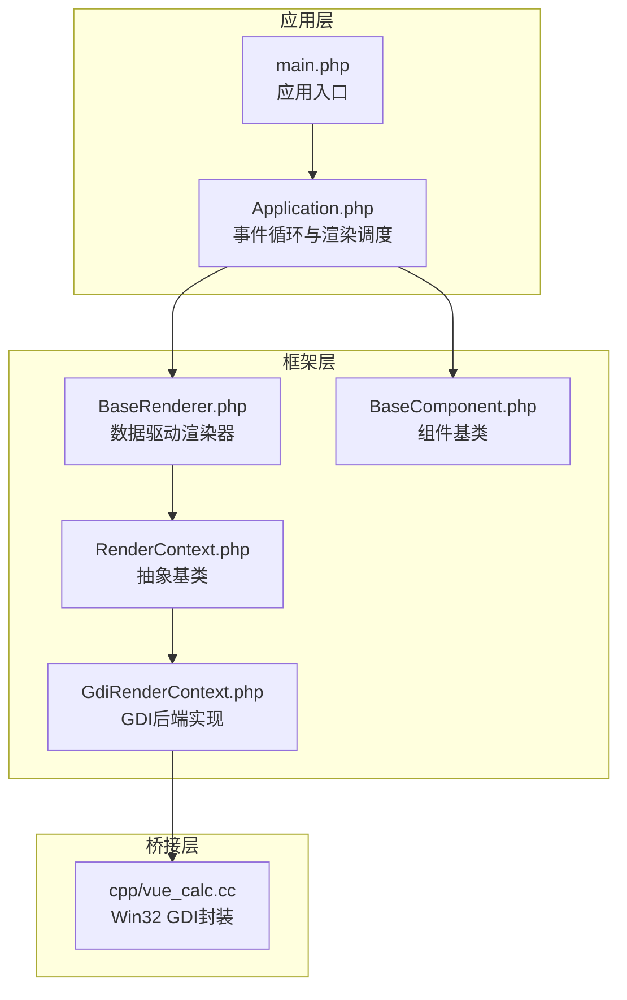
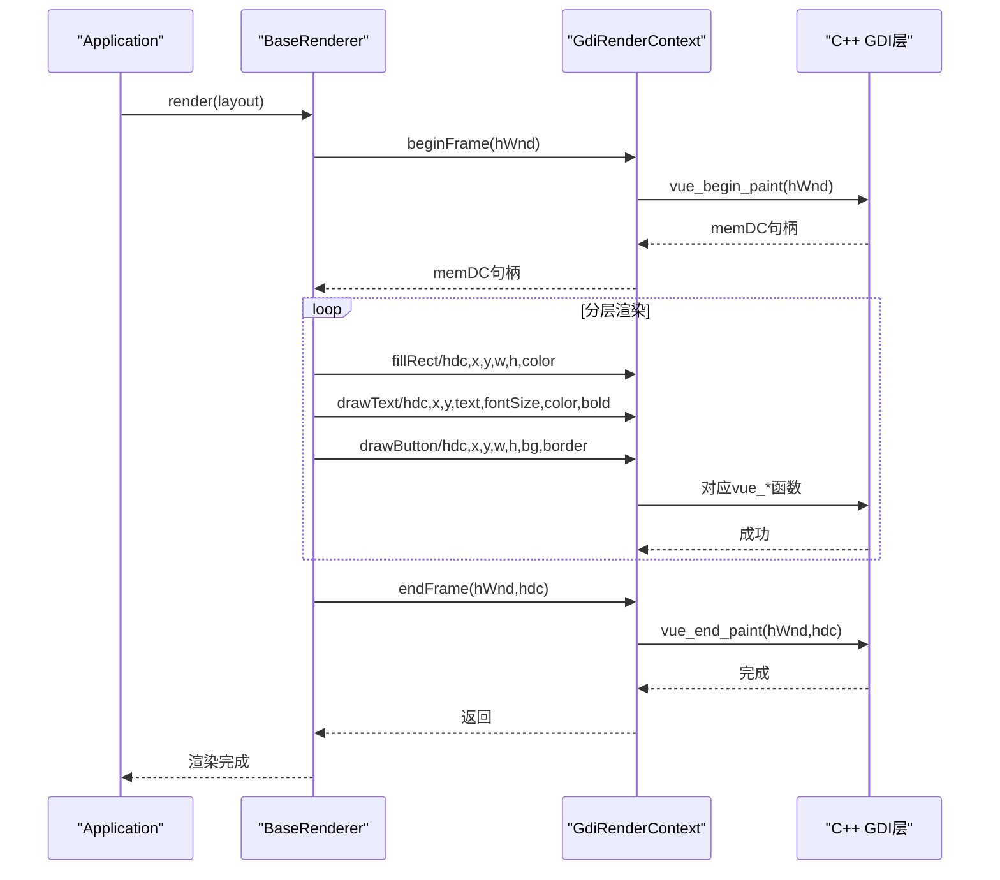
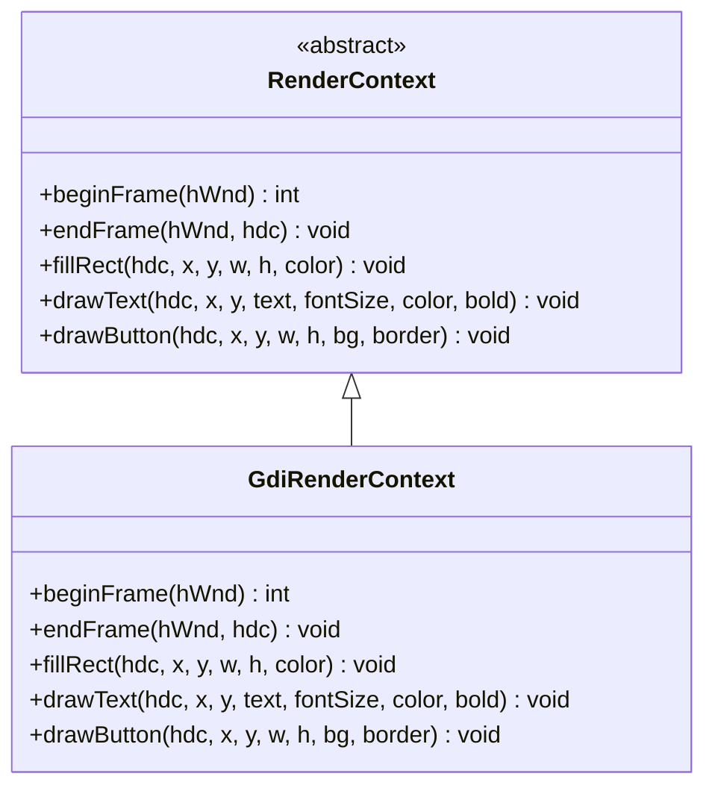
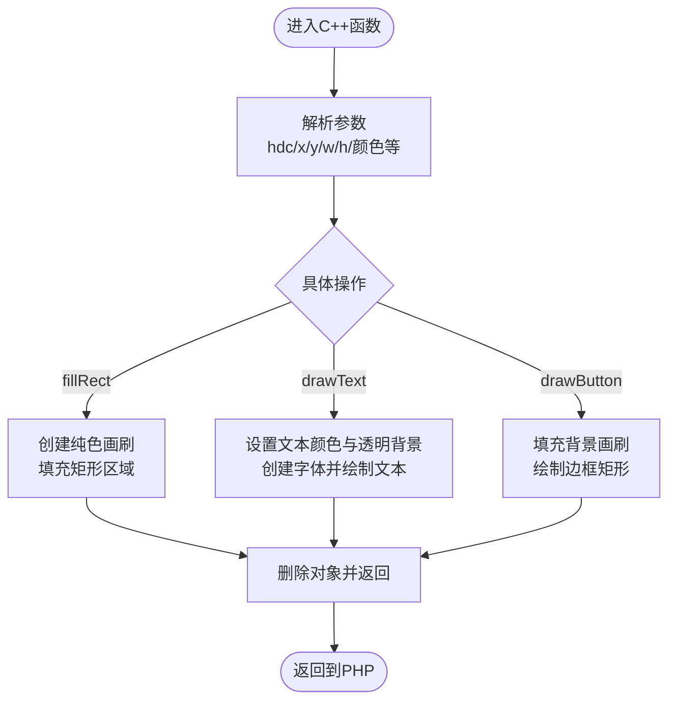
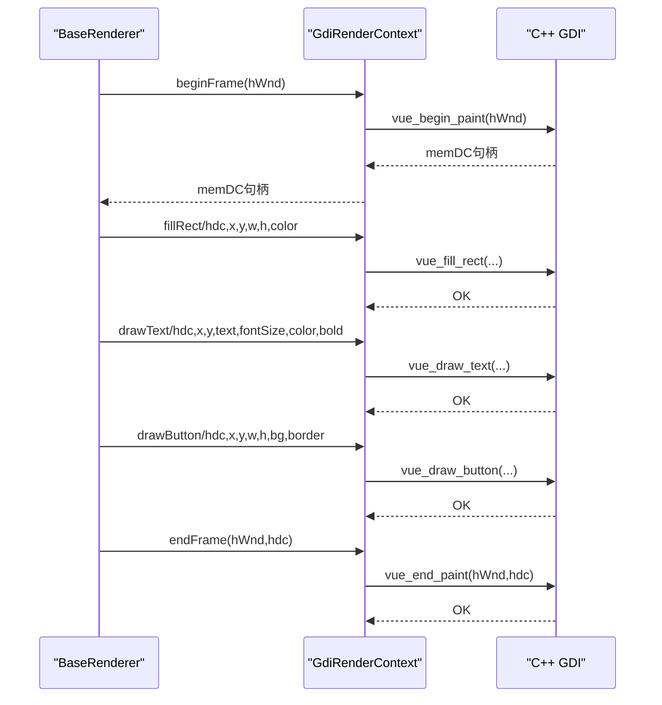
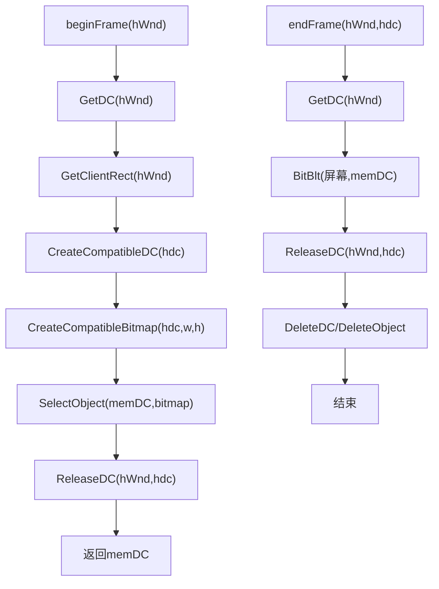
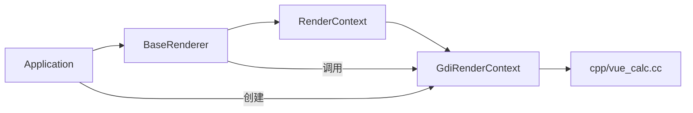

# GDI渲染上下文

<cite>
**本文引用的文件**
- [GdiRenderContext.php](file://framework/rendering/GdiRenderContext.php)
- [RenderContext.php](file://framework/rendering/RenderContext.php)
- [vue_calc.cc](file://cpp/vue_calc.cc)
- [Application.php](file://apps/calculator/Application.php)
- [main.php](file://apps/calculator/main.php)
- [BaseRenderer.php](file://framework/BaseRenderer.php)
- [BaseComponent.php](file://framework/BaseComponent.php)
- [project.yml](file://apps/calculator/project.yml)
- [build.bat](file://build.bat)
- [VueCalc技术规划文档_v3.html](file://docs/VueCalc技术规划文档_v3.html)
- [vue-dialog-overlay-pattern.md](file://docs/vue-dialog-overlay-pattern.md)
</cite>

## 目录
1. [简介](#简介)
2. [项目结构](#项目结构)
3. [核心组件](#核心组件)
4. [架构总览](#架构总览)
5. [详细组件分析](#详细组件分析)
6. [依赖关系分析](#依赖关系分析)
7. [性能考量](#性能考量)
8. [故障排查指南](#故障排查指南)
9. [结论](#结论)
10. [附录](#附录)

## 简介
本文件围绕GDI渲染上下文展开，系统性说明GdiRenderContext类的功能与实现原理，涵盖：
- Windows GDI图形设备接口的封装与使用
- 绘制命令的生成与执行流程（文本绘制、矩形填充、按钮绘制）
- beginFrame与endFrame的工作机制（设备上下文获取与释放）
- drawText、fillRect、drawButton等核心绘制方法的参数与行为
- C++桥接层（phpx扩展）实现，展示PHP与C++之间的数据交换与函数调用机制
- 性能优化技巧、内存管理与错误处理策略
- 跨平台移植的考虑与替代方案

## 项目结构
该工程采用“PHP前端 + C++桥接层”的混合架构，渲染后端通过GdiRenderContext抽象，底层由C++封装Win32 GDI实现。应用入口负责窗口创建、事件循环与渲染调度；渲染器根据组件布局数据驱动绘制；GDI后端将绘制命令委托给C++层。

图表来源
- [Application.php:1-322](file://apps/calculator/Application.php#L1-L322)
- [main.php:1-48](file://apps/calculator/main.php#L1-L48)
- [RenderContext.php:1-30](file://framework/rendering/RenderContext.php#L1-L30)
- [GdiRenderContext.php:1-38](file://framework/rendering/GdiRenderContext.php#L1-L38)
- [BaseRenderer.php:1-197](file://framework/BaseRenderer.php#L1-L197)
- [BaseComponent.php:1-177](file://framework/BaseComponent.php#L1-L177)
- [vue_calc.cc:1-157](file://cpp/vue_calc.cc#L1-L157)

章节来源
- [project.yml:1-34](file://apps/calculator/project.yml#L1-L34)
- [build.bat:1-350](file://build.bat#L1-L350)

## 核心组件
- RenderContext（抽象基类）：定义与后端无关的渲染接口，包括帧管理与绘制原语。
- GdiRenderContext（GDI后端实现）：将抽象方法映射到C++层的vue_* stub函数。
- BaseRenderer：接收组件布局数据，按层分阶段渲染，调用RenderContext执行绘制。
- Application：负责窗口生命周期、事件循环与渲染调度。
- cpp/vue_calc.cc：C++桥接层，封装Win32 GDI绘制原语与双缓冲机制。

章节来源
- [RenderContext.php:1-30](file://framework/rendering/RenderContext.php#L1-L30)
- [GdiRenderContext.php:1-38](file://framework/rendering/GdiRenderContext.php#L1-L38)
- [BaseRenderer.php:1-197](file://framework/BaseRenderer.php#L1-L197)
- [Application.php:1-322](file://apps/calculator/Application.php#L1-L322)
- [vue_calc.cc:1-157](file://cpp/vue_calc.cc#L1-L157)

## 架构总览
渲染管线自底向上分为三层：
- C++桥接层：封装Win32 GDI，提供双缓冲帧管理与绘制原语。
- PHP渲染层：GdiRenderContext将抽象方法映射到C++ stub函数。
- 应用与渲染器：Application负责事件循环与调度，BaseRenderer按布局数据驱动绘制。

图表来源
- [BaseRenderer.php:98-196](file://framework/BaseRenderer.php#L98-L196)
- [GdiRenderContext.php:13-36](file://framework/rendering/GdiRenderContext.php#L13-L36)
- [vue_calc.cc:90-117](file://cpp/vue_calc.cc#L90-L117)
- [vue_calc.cc:119-156](file://cpp/vue_calc.cc#L119-L156)

## 详细组件分析

### GdiRenderContext类
- 角色定位：RenderContext的具体实现，面向GDI后端，直接委托给C++ phpx扩展提供的vue_* stub函数。
- 关键方法
  - beginFrame(hWnd): 返回memDC句柄，用于双缓冲绘制。
  - endFrame(hWnd, hdc): 将memDC内容blit到屏幕并释放资源。
  - fillRect(hdc, x, y, w, h, color): 填充矩形。
  - drawText(hdc, x, y, text, fontSize, color, bold): 绘制文本。
  - drawButton(hdc, x, y, w, h, bg, border): 绘制按钮（背景+边框）。

图表来源
- [RenderContext.php:13-29](file://framework/rendering/RenderContext.php#L13-L29)
- [GdiRenderContext.php:11-36](file://framework/rendering/GdiRenderContext.php#L11-L36)

章节来源
- [GdiRenderContext.php:1-38](file://framework/rendering/GdiRenderContext.php#L1-L38)

### C++桥接层（phpx扩展）
- 目标：以轻薄层封装Win32 GDI，提供双缓冲帧与基础绘制原语。
- 关键实现
  - 窗口与消息：注册窗口类、创建窗口、消息循环与退出标志。
  - 双缓冲帧管理：获取屏幕DC，创建兼容DC与位图，完成绘制后BitBlt到屏幕并清理。
  - 绘制原语：fillRect、drawText、drawButton分别对应GDI绘制API。
- 数据交换：phpx.h提供PHP与C++类型自动转换，参数与返回值在两端自动装箱/拆箱。

图表来源
- [vue_calc.cc:119-156](file://cpp/vue_calc.cc#L119-L156)

章节来源
- [vue_calc.cc:1-157](file://cpp/vue_calc.cc#L1-L157)
- [VueCalc技术规划文档_v3.html:1213-1257](file://docs/VueCalc技术规划文档_v3.html#L1213-L1257)

### 绘制命令生成与执行流程
- BaseRenderer根据组件布局数据生成绘制命令序列：
  - 计算最高活跃层，按层从低到高渲染。
  - 元素层：rect类型调用fillRect，text类型调用renderTextElement（含对齐与动态字号）。
  - 按钮层：先调用drawButton绘制背景与边框，再在中心绘制标签文本。
- GdiRenderContext将上述调用转发到C++层，C++层执行相应GDI绘制API。

图表来源
- [BaseRenderer.php:98-196](file://framework/BaseRenderer.php#L98-L196)
- [GdiRenderContext.php:13-36](file://framework/rendering/GdiRenderContext.php#L13-L36)
- [vue_calc.cc:90-117](file://cpp/vue_calc.cc#L90-L117)
- [vue_calc.cc:119-156](file://cpp/vue_calc.cc#L119-L156)

章节来源
- [BaseRenderer.php:34-90](file://framework/BaseRenderer.php#L34-L90)
- [BaseRenderer.php:98-196](file://framework/BaseRenderer.php#L98-L196)

### beginFrame与endFrame工作机制
- beginFrame
  - 获取窗口DC，查询客户区尺寸。
  - 创建兼容DC与兼容位图，选择位图到兼容DC。
  - 释放窗口DC，返回memDC句柄供后续绘制。
- endFrame
  - 获取窗口DC，将memDC内容BitBlt到屏幕。
  - 释放窗口DC，删除memDC与位图对象，完成双缓冲提交。

图表来源
- [vue_calc.cc:90-117](file://cpp/vue_calc.cc#L90-L117)

章节来源
- [vue_calc.cc:90-117](file://cpp/vue_calc.cc#L90-L117)

### 核心绘制方法详解
- fillRect
  - 参数：hdc、x、y、w、h、color（RGB）
  - 行为：创建纯色画刷，填充指定矩形区域，随后销毁画刷。
- drawText
  - 参数：hdc、x、y、text、fontSize、color、bold（1/0）
  - 行为：设置文本颜色与透明背景，创建字体（粗体可选），绘制文本，恢复旧字体并销毁字体。
- drawButton
  - 参数：hdc、x、y、w、h、bg、border
  - 行为：先填充背景画刷，再绘制边框矩形（空画刷+实线画笔），最后销毁画笔与画刷。

章节来源
- [GdiRenderContext.php:23-36](file://framework/rendering/GdiRenderContext.php#L23-L36)
- [vue_calc.cc:119-156](file://cpp/vue_calc.cc#L119-L156)

### 应用入口与事件循环
- main.php创建根组件、渲染上下文与Application，初始化窗口并启动事件循环。
- Application.run中轮询消息队列，处理鼠标点击，触发渲染器按需重绘。

章节来源
- [main.php:19-48](file://apps/calculator/main.php#L19-L48)
- [Application.php:205-263](file://apps/calculator/Application.php#L205-L263)

## 依赖关系分析
- 组件耦合
  - BaseRenderer依赖RenderContext接口，通过多态适配不同后端。
  - GdiRenderContext依赖C++层stub函数，形成PHP↔C++桥接。
  - Application持有RenderContext实例，驱动渲染器执行绘制。
- 外部依赖
  - Windows GDI API（CreateCompatibleDC、BitBlt、FillRect、TextOut等）。
  - phpx扩展（类型转换与函数导出）。

图表来源
- [Application.php:32-76](file://apps/calculator/Application.php#L32-L76)
- [BaseRenderer.php:21-26](file://framework/BaseRenderer.php#L21-L26)
- [GdiRenderContext.php:11-16](file://framework/rendering/GdiRenderContext.php#L11-L16)
- [vue_calc.cc:90-117](file://cpp/vue_calc.cc#L90-L117)

章节来源
- [Application.php:1-322](file://apps/calculator/Application.php#L1-L322)
- [BaseRenderer.php:1-197](file://framework/BaseRenderer.php#L1-L197)
- [GdiRenderContext.php:1-38](file://framework/rendering/GdiRenderContext.php#L1-L38)
- [vue_calc.cc:1-157](file://cpp/vue_calc.cc#L1-L157)

## 性能考量
- 双缓冲策略：通过memDC与BitBlt减少闪烁，提升视觉流畅度。
- 资源管理：每帧创建/销毁memDC与位图，避免长期持有导致内存膨胀。
- 文本绘制：按字符长度动态调整字号，减少超长文本溢出与重排成本。
- 对齐优化：右对齐与居中对齐通过容器宽度与字符宽度计算，避免额外测量开销。
- AOT兼容：使用array_keys+for循环避免foreach类型推断问题，减少运行时分支判断。

章节来源
- [BaseRenderer.php:55-87](file://framework/BaseRenderer.php#L55-L87)
- [BaseRenderer.php:109-193](file://framework/BaseRenderer.php#L109-L193)
- [vue_dialog-overlay-pattern.md:863-982](file://docs/vue-dialog-overlay-pattern.md#L863-L982)

## 故障排查指南
- 窗口创建失败
  - 现象：initWindow返回false。
  - 排查：检查窗口类注册、CreateWindowEx参数与返回值。
- 绘制异常
  - 现象：文本不显示、矩形不填充、按钮边框缺失。
  - 排查：确认hdc有效性、颜色参数格式（BGR）、字体创建与选择顺序。
- 资源泄漏
  - 现象：内存持续增长。
  - 排查：确保endFrame中DeleteDC/DeleteObject被调用。
- 事件循环卡顿
  - 现象：渲染不及时或CPU占用高。
  - 排查：检查消息轮询频率与渲染触发条件，避免频繁重绘。

章节来源
- [Application.php:51-76](file://apps/calculator/Application.php#L51-L76)
- [vue_calc.cc:105-117](file://cpp/vue_calc.cc#L105-L117)

## 结论
GdiRenderContext通过RenderContext抽象，将PHP侧的绘制命令统一映射到C++桥接层，借助Win32 GDI实现双缓冲与基础绘制原语。整体架构清晰、职责分离明确，具备良好的可扩展性与AOT兼容性。未来可在保持抽象不变的前提下，逐步扩展更多绘制原语与后端（如Skia/OpenGL/Web Canvas），以满足更复杂的渲染需求。

## 附录

### 跨平台移植与替代方案
- GDI限制与缓解
  - 不支持Alpha通道：保留setAlpha接口，GDI后端忽略。
  - 不支持旋转变换：接口不暴露rotate/scale，仅暴露translate。
  - SaveDC栈深度有限：编译器检测嵌套深度>5时发出警告。
  - 字体不支持斜体：接口不暴露setItalic。
- 替代方案
  - Skia：提供更丰富的绘制能力与硬件加速，适合复杂图形与动画。
  - OpenGL/Web Canvas：适合Web风格UI与跨平台一致体验。
- 迁移建议
  - 保持RenderContext接口不变，新增后端实现类，通过配置切换后端。
  - 逐步替换GDI特定API为后端无关实现，确保AOT兼容性。

章节来源
- [vue_dialog-overlay-pattern.md:972-981](file://docs/vue-dialog-overlay-pattern.md#L972-L981)