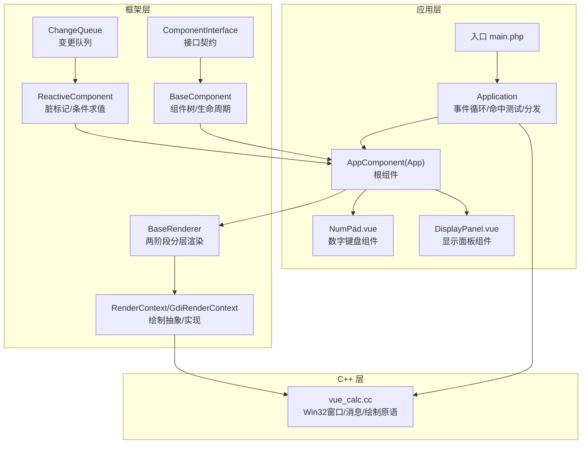
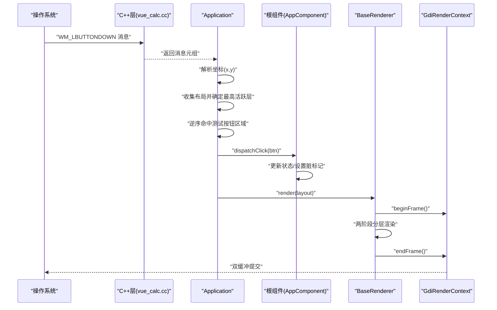
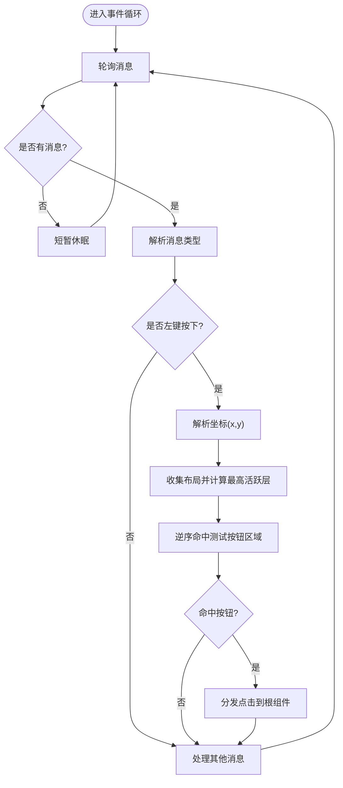
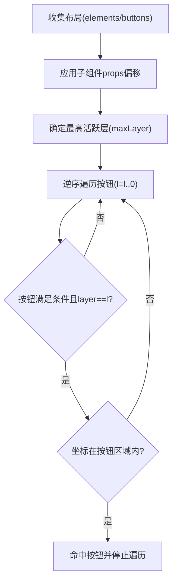
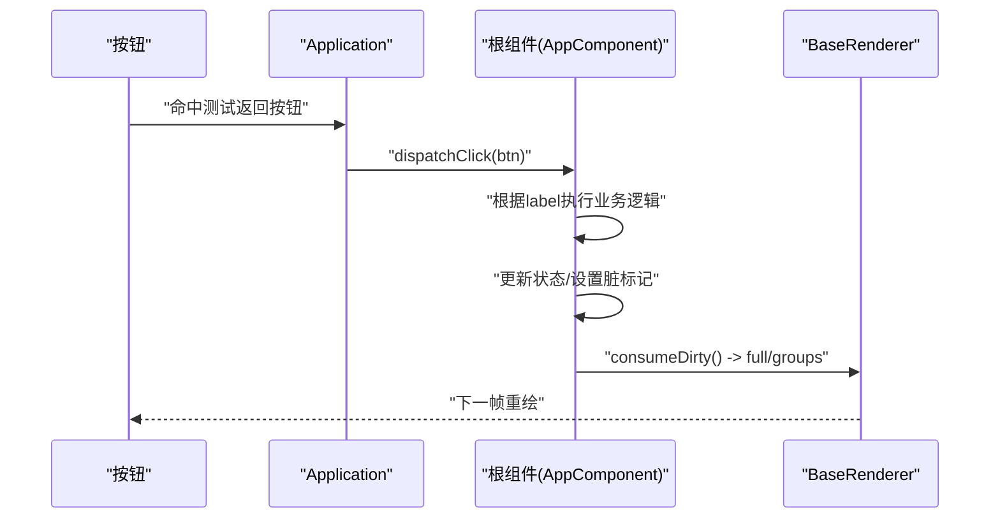
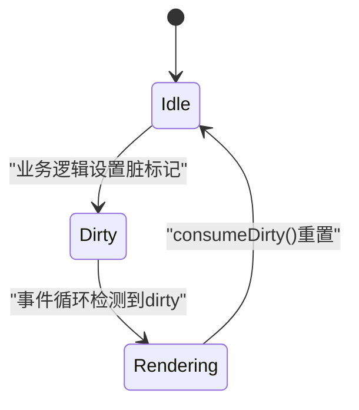
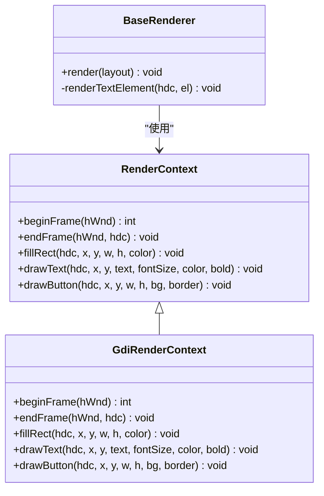
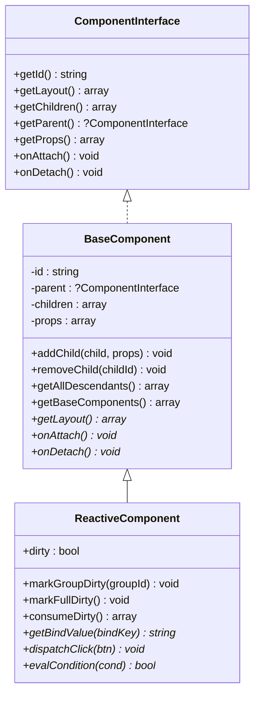
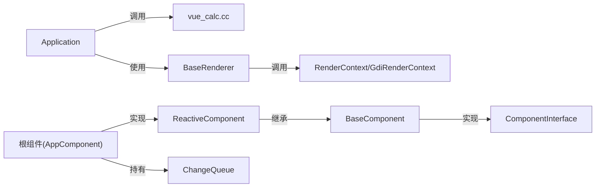

# 事件处理机制

<cite>
**本文引用的文件**
- [apps/calculator/App.vue](file://apps/calculator/App.vue)
- [apps/calculator/components/NumPad.vue](file://apps/calculator/components/NumPad.vue)
- [apps/calculator/components/DisplayPanel.vue](file://apps/calculator/components/DisplayPanel.vue)
- [apps/calculator/Application.php](file://apps/calculator/Application.php)
- [apps/calculator/main.php](file://apps/calculator/main.php)
- [framework/BaseComponent.php](file://framework/BaseComponent.php)
- [framework/BaseRenderer.php](file://framework/BaseRenderer.php)
- [framework/ReactiveComponent.php](file://framework/ReactiveComponent.php)
- [framework/rendering/RenderContext.php](file://framework/rendering/RenderContext.php)
- [framework/rendering/GdiRenderContext.php](file://framework/rendering/GdiRenderContext.php)
- [framework/interfaces/ComponentInterface.php](file://framework/interfaces/ComponentInterface.php)
- [framework/ChangeQueue.php](file://framework/ChangeQueue.php)
- [cpp/vue_calc.cc](file://cpp/vue_calc.cc)
</cite>

## 目录
1. [简介](#简介)
2. [项目结构](#项目结构)
3. [核心组件](#核心组件)
4. [架构总览](#架构总览)
5. [详细组件分析](#详细组件分析)
6. [依赖关系分析](#依赖关系分析)
7. [性能考量](#性能考量)
8. [故障排查指南](#故障排查指南)
9. [结论](#结论)
10. [附录](#附录)

## 简介
本文件系统性梳理 VueCalc 的事件处理机制，聚焦渲染系统中的事件处理流程：鼠标左键点击的捕获与分发、事件坐标转换、组件命中测试、按钮点击处理逻辑、事件与组件状态更新的关系以及从事件触发到界面重绘的完整链路。同时给出性能优化策略、调试技巧、常见问题排查以及扩展新事件类型的实现方法与最佳实践。

## 项目结构
VueCalc 采用“模板驱动 + 组件树 + 渲染器 + C++ 绘制原语”的分层架构：
- 应用入口负责窗口创建、事件循环与渲染调度
- 组件层定义 UI 结构与交互行为（如 App.vue、NumPad.vue）
- 渲染层负责布局收集、分层渲染与绘制
- C++ 层提供 Win32 API 与 GDI 绘制原语

图表来源
- [apps/calculator/main.php:19-48](file://apps/calculator/main.php#L19-L48)
- [apps/calculator/Application.php:15-322](file://apps/calculator/Application.php#L15-L322)
- [apps/calculator/App.vue:1-203](file://apps/calculator/App.vue#L1-L203)
- [apps/calculator/components/NumPad.vue:1-37](file://apps/calculator/components/NumPad.vue#L1-L37)
- [apps/calculator/components/DisplayPanel.vue:1-12](file://apps/calculator/components/DisplayPanel.vue#L1-L12)
- [framework/BaseComponent.php:16-177](file://framework/BaseComponent.php#L16-L177)
- [framework/BaseRenderer.php:15-197](file://framework/BaseRenderer.php#L15-L197)
- [framework/ReactiveComponent.php:14-90](file://framework/ReactiveComponent.php#L14-L90)
- [framework/rendering/RenderContext.php:13-30](file://framework/rendering/RenderContext.php#L13-L30)
- [framework/rendering/GdiRenderContext.php:11-38](file://framework/rendering/GdiRenderContext.php#L11-L38)
- [framework/interfaces/ComponentInterface.php:13-52](file://framework/interfaces/ComponentInterface.php#L13-L52)
- [framework/ChangeQueue.php:11-57](file://framework/ChangeQueue.php#L11-L57)
- [cpp/vue_calc.cc:36-84](file://cpp/vue_calc.cc#L36-L84)

章节来源
- [apps/calculator/main.php:19-48](file://apps/calculator/main.php#L19-L48)
- [apps/calculator/Application.php:15-322](file://apps/calculator/Application.php#L15-L322)
- [framework/BaseComponent.php:16-177](file://framework/BaseComponent.php#L16-L177)
- [framework/BaseRenderer.php:15-197](file://framework/BaseRenderer.php#L15-L197)
- [framework/ReactiveComponent.php:14-90](file://framework/ReactiveComponent.php#L14-L90)
- [framework/rendering/RenderContext.php:13-30](file://framework/rendering/RenderContext.php#L13-L30)
- [framework/rendering/GdiRenderContext.php:11-38](file://framework/rendering/GdiRenderContext.php#L11-L38)
- [framework/interfaces/ComponentInterface.php:13-52](file://framework/interfaces/ComponentInterface.php#L13-L52)
- [framework/ChangeQueue.php:11-57](file://framework/ChangeQueue.php#L11-L57)
- [cpp/vue_calc.cc:36-84](file://cpp/vue_calc.cc#L36-L84)

## 核心组件
- 应用控制器 Application：负责窗口初始化、事件循环、消息轮询、点击命中测试与事件分发、基于脏标记的渲染调度。
- 根组件 App（AppComponent）：承载计算器业务状态与交互逻辑，接收按钮点击并更新状态，触发重绘。
- 渲染器 BaseRenderer：两阶段分层渲染，按层绘制元素与按钮，支持条件渲染与动态字号适配。
- 渲染上下文 RenderContext/GdiRenderContext：抽象绘制接口与 Win32 GDI 实现，桥接 C++ 绘制原语。
- 组件基类 BaseComponent/ReactiveComponent：组件树结构、生命周期、布局数据与脏标记。
- C++ 层 vue_calc.cc：封装 Win32 窗口、消息与 GDI 绘制原语，供 PHP 层调用。

章节来源
- [apps/calculator/Application.php:15-322](file://apps/calculator/Application.php#L15-L322)
- [apps/calculator/App.vue:1-203](file://apps/calculator/App.vue#L1-L203)
- [framework/BaseRenderer.php:15-197](file://framework/BaseRenderer.php#L15-L197)
- [framework/rendering/RenderContext.php:13-30](file://framework/rendering/RenderContext.php#L13-L30)
- [framework/rendering/GdiRenderContext.php:11-38](file://framework/rendering/GdiRenderContext.php#L11-L38)
- [framework/BaseComponent.php:16-177](file://framework/BaseComponent.php#L16-L177)
- [framework/ReactiveComponent.php:14-90](file://framework/ReactiveComponent.php#L14-L90)
- [cpp/vue_calc.cc:36-84](file://cpp/vue_calc.cc#L36-L84)

## 架构总览
事件处理与渲染的总体流程如下：
- 应用启动：入口创建根组件、渲染上下文与应用控制器；初始化窗口并挂载组件树。
- 事件循环：轮询消息队列，解析鼠标左键按下事件，提取屏幕坐标。
- 坐标转换：将屏幕坐标转换为组件局部坐标（通过布局偏移累加）。
- 命中测试：按层从最高层向下逆序测试按钮区域，找到第一个满足条件且包含坐标的按钮。
- 事件分发：将按钮信息分发给根组件，由根组件处理业务逻辑并设置脏标记。
- 渲染调度：根据脏标记触发渲染，渲染器收集布局、执行两阶段分层渲染，最终提交帧。

图表来源
- [apps/calculator/Application.php:205-322](file://apps/calculator/Application.php#L205-L322)
- [framework/BaseRenderer.php:98-197](file://framework/BaseRenderer.php#L98-L197)
- [framework/rendering/GdiRenderContext.php:11-38](file://framework/rendering/GdiRenderContext.php#L11-L38)
- [cpp/vue_calc.cc:69-84](file://cpp/vue_calc.cc#L69-L84)

## 详细组件分析

### 鼠标事件捕获与分发
- 消息轮询：应用控制器在主循环中持续调用消息轮询接口，解析消息类型与参数。
- 左键按下：识别 WM_LBUTTONDOWN，从 lParam 中提取坐标（低 16 位为 x，高 16 位为 y）。
- 坐标转换：命中测试发生在应用层，使用布局数据中的按钮位置进行区域判断，无需额外坐标转换。
- 命中测试：先确定最高活跃层，再按层从最高层向下逆序遍历按钮，遇到满足条件且包含坐标的按钮即命中。
- 事件分发：命中后调用根组件的点击分发接口，将按钮数据传递给业务逻辑处理。

图表来源
- [apps/calculator/Application.php:214-322](file://apps/calculator/Application.php#L214-L322)

章节来源
- [apps/calculator/Application.php:214-322](file://apps/calculator/Application.php#L214-L322)
- [apps/calculator/main.php:14-18](file://apps/calculator/main.php#L14-L18)
- [cpp/vue_calc.cc:69-84](file://cpp/vue_calc.cc#L69-L84)

### 事件坐标转换与组件命中测试
- 布局偏移：应用层在收集布局时，会将子组件的 props（x/y）累加到按钮与元素的绝对坐标，形成全局布局。
- 命中测试：应用层在命中测试时直接使用全局布局中的按钮坐标进行矩形包含判断，不涉及额外坐标转换。
- 条件渲染：命中测试与渲染均尊重按钮的 condition 字段，仅对满足条件的按钮参与命中或绘制。
- 分层策略：先确定最高活跃层，再按层从最高层向下逆序遍历，确保上层按钮优先于下层按钮被命中。

图表来源
- [apps/calculator/Application.php:143-200](file://apps/calculator/Application.php#L143-L200)
- [apps/calculator/Application.php:269-311](file://apps/calculator/Application.php#L269-L311)

章节来源
- [apps/calculator/Application.php:143-200](file://apps/calculator/Application.php#L143-L200)
- [apps/calculator/Application.php:269-311](file://apps/calculator/Application.php#L269-L311)

### 按钮点击事件处理逻辑
- 根组件职责：接收按钮点击，根据按钮标签或数据执行相应业务逻辑（如数字输入、运算符处理、清屏、退格、计算等），并在完成后设置脏标记以触发重绘。
- 子组件协作：数字键盘组件将点击事件转发给根组件，根组件统一处理并更新状态。
- 状态更新：业务方法更新 display、expression、operand1、operator、newInput、hasDecimal 等状态字段，并在必要时设置 dirty 以驱动重绘。

图表来源
- [apps/calculator/Application.php:316-321](file://apps/calculator/Application.php#L316-L321)
- [apps/calculator/App.vue:167-193](file://apps/calculator/App.vue#L167-L193)
- [apps/calculator/components/NumPad.vue:1-37](file://apps/calculator/components/NumPad.vue#L1-L37)

章节来源
- [apps/calculator/App.vue:167-193](file://apps/calculator/App.vue#L167-L193)
- [apps/calculator/components/NumPad.vue:1-37](file://apps/calculator/components/NumPad.vue#L1-L37)
- [apps/calculator/Application.php:316-321](file://apps/calculator/Application.php#L316-L321)

### 事件与组件状态更新的关系
- 脏标记：根组件维护 dirty 标志与分组级 dirtyGroups/fullDirty，渲染器消费后重置。
- 渲染触发：仅当根组件 dirty 为真时才重新收集布局并渲染，避免不必要的重绘。
- 状态到视图：渲染器读取布局中的 elements/buttons 与文本绑定值，按层绘制，最终完成一次完整的 UI 更新。

图表来源
- [framework/ReactiveComponent.php:56-64](file://framework/ReactiveComponent.php#L56-L64)
- [framework/BaseRenderer.php:100-102](file://framework/BaseRenderer.php#L100-L102)
- [apps/calculator/Application.php:248-257](file://apps/calculator/Application.php#L248-L257)

章节来源
- [framework/ReactiveComponent.php:56-64](file://framework/ReactiveComponent.php#L56-L64)
- [framework/BaseRenderer.php:100-102](file://framework/BaseRenderer.php#L100-L102)
- [apps/calculator/Application.php:248-257](file://apps/calculator/Application.php#L248-L257)

### 渲染系统与绘制原语
- 两阶段分层渲染：先确定最高活跃层，再逐层绘制元素与按钮；按钮文字在按钮绘制后居中绘制。
- 条件渲染：每个元素/按钮支持 condition 字段，渲染器与命中测试均会评估条件。
- 文本对齐：支持左对齐、右对齐、居中对齐，长文本自动降低字号以适应容器宽度。
- 绘制原语：GDI 上下文封装了 beginFrame/endFrame/fillRect/drawText/drawButton 等原语，底层由 C++ 实现。

图表来源
- [framework/rendering/RenderContext.php:13-30](file://framework/rendering/RenderContext.php#L13-L30)
- [framework/rendering/GdiRenderContext.php:11-38](file://framework/rendering/GdiRenderContext.php#L11-L38)
- [framework/BaseRenderer.php:98-197](file://framework/BaseRenderer.php#L98-L197)

章节来源
- [framework/rendering/RenderContext.php:13-30](file://framework/rendering/RenderContext.php#L13-L30)
- [framework/rendering/GdiRenderContext.php:11-38](file://framework/rendering/GdiRenderContext.php#L11-L38)
- [framework/BaseRenderer.php:98-197](file://framework/BaseRenderer.php#L98-L197)

### 组件树与布局收集
- 组件树：组件基类提供父子关系与子组件管理，支持深度优先遍历与后代收集。
- 布局收集：应用层递归遍历组件树，将子组件的 props（x/y）累加到按钮与元素的绝对坐标，生成全局布局。
- 接口契约：组件接口定义了布局获取、生命周期回调与属性访问等能力。

图表来源
- [framework/interfaces/ComponentInterface.php:13-52](file://framework/interfaces/ComponentInterface.php#L13-L52)
- [framework/BaseComponent.php:16-177](file://framework/BaseComponent.php#L16-L177)
- [framework/ReactiveComponent.php:14-90](file://framework/ReactiveComponent.php#L14-L90)

章节来源
- [framework/interfaces/ComponentInterface.php:13-52](file://framework/interfaces/ComponentInterface.php#L13-L52)
- [framework/BaseComponent.php:16-177](file://framework/BaseComponent.php#L16-L177)
- [framework/ReactiveComponent.php:14-90](file://framework/ReactiveComponent.php#L14-L90)

## 依赖关系分析
- 应用层依赖 C++ 层的消息与绘制原语，负责事件循环与命中测试。
- 渲染层依赖渲染上下文抽象，具体实现委托给 GDI 后端。
- 根组件实现响应式接口，提供业务逻辑与脏标记。
- 组件基类提供树结构与生命周期，支撑布局收集与挂载。

图表来源
- [apps/calculator/Application.php:15-322](file://apps/calculator/Application.php#L15-L322)
- [framework/BaseRenderer.php:15-197](file://framework/BaseRenderer.php#L15-L197)
- [framework/rendering/GdiRenderContext.php:11-38](file://framework/rendering/GdiRenderContext.php#L11-L38)
- [framework/ReactiveComponent.php:14-90](file://framework/ReactiveComponent.php#L14-L90)
- [framework/BaseComponent.php:16-177](file://framework/BaseComponent.php#L16-L177)
- [framework/interfaces/ComponentInterface.php:13-52](file://framework/interfaces/ComponentInterface.php#L13-L52)
- [framework/ChangeQueue.php:11-57](file://framework/ChangeQueue.php#L11-L57)
- [cpp/vue_calc.cc:36-84](file://cpp/vue_calc.cc#L36-L84)

章节来源
- [apps/calculator/Application.php:15-322](file://apps/calculator/Application.php#L15-L322)
- [framework/BaseRenderer.php:15-197](file://framework/BaseRenderer.php#L15-L197)
- [framework/rendering/GdiRenderContext.php:11-38](file://framework/rendering/GdiRenderContext.php#L11-L38)
- [framework/ReactiveComponent.php:14-90](file://framework/ReactiveComponent.php#L14-L90)
- [framework/BaseComponent.php:16-177](file://framework/BaseComponent.php#L16-L177)
- [framework/interfaces/ComponentInterface.php:13-52](file://framework/interfaces/ComponentInterface.php#L13-L52)
- [framework/ChangeQueue.php:11-57](file://framework/ChangeQueue.php#L11-L57)
- [cpp/vue_calc.cc:36-84](file://cpp/vue_calc.cc#L36-L84)

## 性能考量
- 事件过滤与命中测试
  - 仅在左键按下时进行命中测试，避免对移动、滚轮等事件做无谓处理。
  - 先确定最高活跃层，再按层逆序遍历，减少无效比较。
  - 条件字段严格校验类型，避免因 AOT 推断导致的异常分支。
- 渲染优化
  - 脏标记驱动渲染：仅在 dirty 为真时重新收集布局与渲染，避免每帧全量重绘。
  - 两阶段分层渲染：按层绘制，减少绘制顺序冲突与重复绘制。
  - 文本对齐与字号自适应：长文本自动降级字号，避免溢出与重排。
- 批量处理
  - 消息轮询采用“一次性取尽”策略，减少阻塞等待。
  - 渲染频率控制在约 60 FPS，平衡流畅度与 CPU 占用。
- 内存与对象复用
  - 布局收集使用引用传递，避免深层拷贝。
  - 渲染上下文与绘制原语在帧内复用，减少对象创建开销。

章节来源
- [apps/calculator/Application.php:214-322](file://apps/calculator/Application.php#L214-L322)
- [framework/BaseRenderer.php:98-197](file://framework/BaseRenderer.php#L98-L197)
- [framework/ReactiveComponent.php:56-64](file://framework/ReactiveComponent.php#L56-L64)

## 故障排查指南
- 点击无响应
  - 检查消息轮询是否正确解析 WM_LBUTTONDOWN 与 lParam。
  - 确认命中测试的按钮区域与布局偏移一致，避免坐标错位。
  - 核对按钮 condition 是否导致按钮不可见或不参与命中。
- 状态未更新
  - 确认根组件业务方法是否被调用，以及是否设置了脏标记。
  - 检查 dirty 消费逻辑是否在渲染后被重置。
- 渲染异常
  - 检查 beginFrame/endFrame 是否成对调用，避免资源泄漏。
  - 确认元素/按钮的 type、layer、condition 等字段类型正确。
- 文本对齐问题
  - 检查容器宽高与字符宽度计算，确认 right/center 对齐逻辑生效。
- 调试技巧
  - 在应用层捕获异常并打印堆栈，定位点击处理中的错误。
  - 在渲染器中输出脏标记与分组信息，确认渲染触发时机。
  - 使用日志记录消息类型与坐标，验证坐标转换与命中测试。

章节来源
- [apps/calculator/Application.php:223-233](file://apps/calculator/Application.php#L223-L233)
- [framework/BaseRenderer.php:100-102](file://framework/BaseRenderer.php#L100-L102)
- [framework/ReactiveComponent.php:56-64](file://framework/ReactiveComponent.php#L56-L64)

## 结论
VueCalc 的事件处理机制以“应用层事件循环 + 组件树布局 + 渲染器两阶段渲染”为核心，通过脏标记驱动渲染，确保事件到界面更新的高效闭环。鼠标事件在应用层完成捕获、坐标与命中测试、业务分发与状态更新，随后由渲染器按层绘制，最终完成帧提交。该设计具备良好的可扩展性与可维护性，便于后续扩展键盘事件、窗口消息与新的交互类型。

## 附录

### 扩展新的事件类型实现方法
- 新增消息类型
  - 在应用层事件循环中增加消息类型判断与处理分支。
  - 解析 lParam/wParam 获取坐标或按键信息。
- 坐标转换
  - 若涉及窗口坐标与控件坐标差异，可在应用层进行转换后再参与命中测试。
- 命中测试扩展
  - 在命中测试中增加对新事件的区域判断逻辑（如键盘按键映射到按钮区域）。
- 业务分发
  - 在根组件新增对应业务方法，更新状态并设置脏标记。
- 渲染适配
  - 如需视觉反馈，可在渲染器中增加对应元素或按钮样式。

章节来源
- [apps/calculator/Application.php:214-322](file://apps/calculator/Application.php#L214-L322)
- [framework/BaseRenderer.php:98-197](file://framework/BaseRenderer.php#L98-L197)

### 最佳实践
- 事件处理
  - 仅在必要时进行命中测试，避免对非交互事件做昂贵操作。
  - 使用条件字段控制可见性与可交互性，减少无效命中。
- 状态管理
  - 业务状态变更后及时设置脏标记，保证渲染一致性。
  - 使用分组级脏标记精细控制重绘范围。
- 渲染优化
  - 控制渲染频率，避免过度刷新。
  - 合理使用分层渲染，确保上层覆盖下层的预期效果。
- 可维护性
  - 统一事件处理入口，集中管理消息类型与处理逻辑。
  - 明确组件职责边界，根组件负责业务，子组件负责展示与转发。