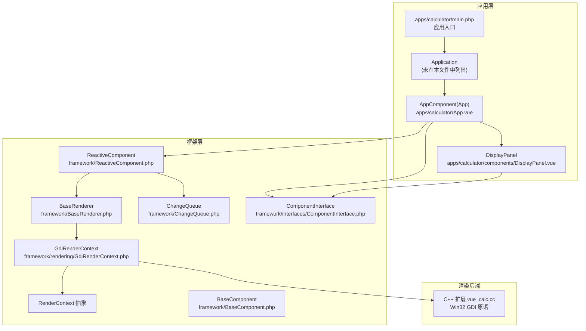
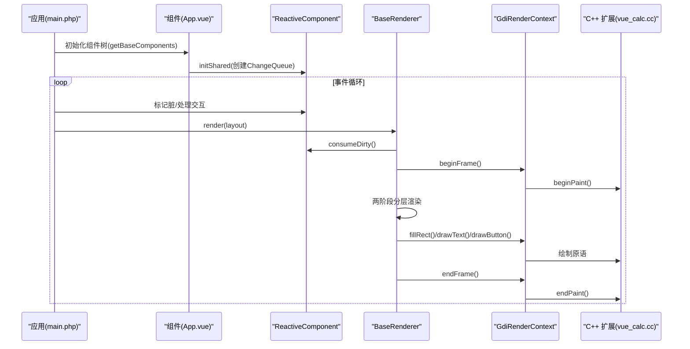
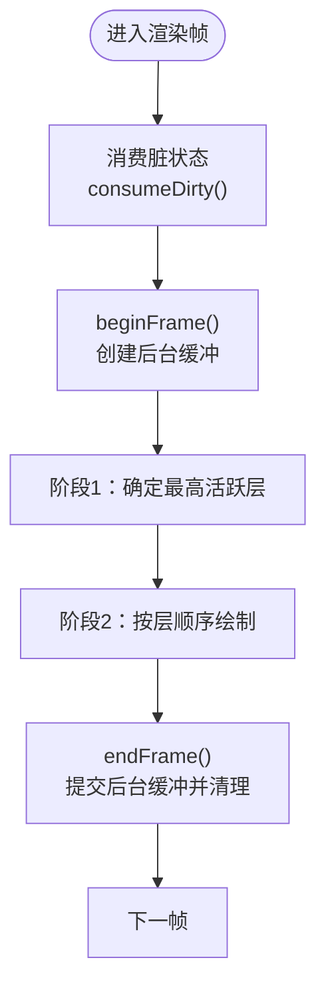
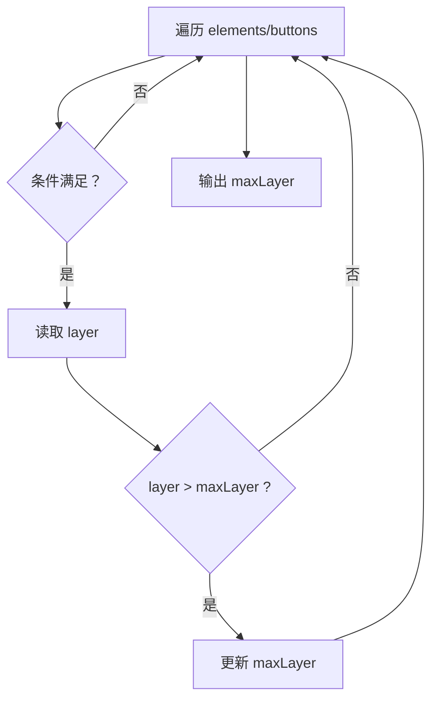
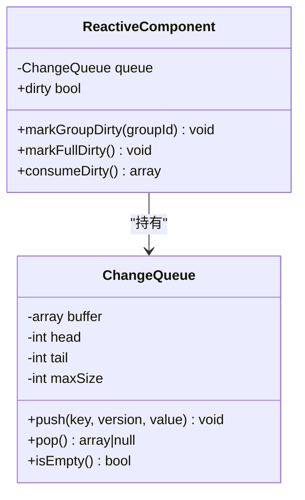
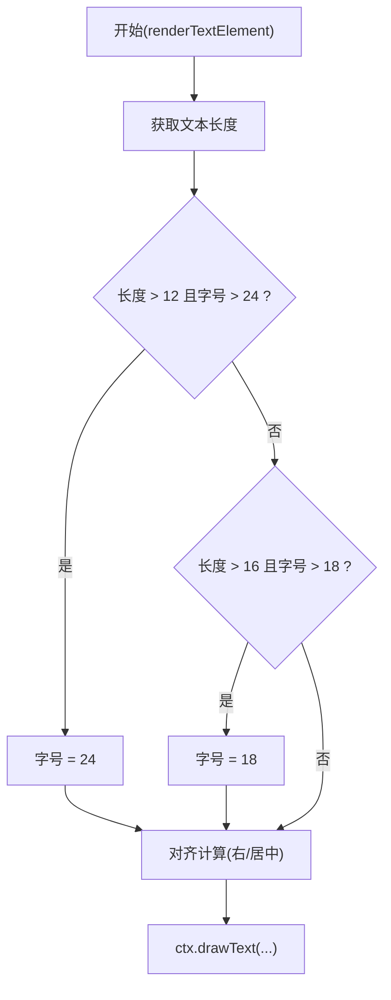
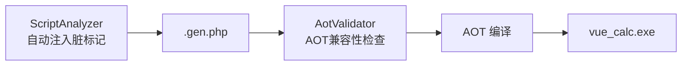

# 性能优化策略

<cite>
**本文引用的文件**
- [ChangeQueue.php](file://framework/ChangeQueue.php)
- [BaseRenderer.php](file://framework/BaseRenderer.php)
- [GdiRenderContext.php](file://framework/rendering/GdiRenderContext.php)
- [RenderContext.php](file://framework/rendering/RenderContext.php)
- [vue_calc.cc](file://cpp/vue_calc.cc)
- [ReactiveComponent.php](file://framework/ReactiveComponent.php)
- [BaseComponent.php](file://framework/BaseComponent.php)
- [aot-validator.php](file://framework/compiler/aot-validator.php)
- [script-analyzer.php](file://framework/compiler/script-analyzer.php)
- [App.vue](file://apps/calculator/App.vue)
- [DisplayPanel.vue](file://apps/calculator/components/DisplayPanel.vue)
- [main.php](file://apps/calculator/main.php)
- [ComponentInterface.php](file://framework/interfaces/ComponentInterface.php)
- [VueCalc技术文档_v2.html](file://docs/VueCalc技术文档_v2.html)
- [AOT 文档\最佳实践.html](file://docs/AOT 文档/最佳实践.html)
</cite>

## 目录
1. [引言](#引言)
2. [项目结构](#项目结构)
3. [核心组件](#核心组件)
4. [架构总览](#架构总览)
5. [详细组件分析](#详细组件分析)
6. [依赖关系分析](#依赖关系分析)
7. [性能考量](#性能考量)
8. [故障排查指南](#故障排查指南)
9. [结论](#结论)
10. [附录](#附录)

## 引言
本文件聚焦于VueCalc渲染系统的性能优化策略，围绕以下主题展开：脏区域管理与按需重绘、两阶段分层渲染减少不必要重绘、批量绘制与内存优化、ChangeQueue的状态变更收集与处理机制、动态字号调整算法及其性能影响、AOT编译优化（类型推断修复与循环优化）、性能监控与基准测试方法、瓶颈识别技巧，以及可复用的调优实践。

## 项目结构
VueCalc采用“PHP数据与业务逻辑 + C++ GDI渲染”的混合架构。应用入口负责初始化组件树与渲染上下文，渲染器执行两阶段分层渲染，底层通过C++扩展提供双缓冲与GDI绘制原语。



**图表来源**
- [main.php:19-48](file://apps/calculator/main.php#L19-L48)
- [App.vue:1-203](file://apps/calculator/App.vue#L1-L203)
- [DisplayPanel.vue:1-12](file://apps/calculator/components/DisplayPanel.vue#L1-L12)
- [BaseRenderer.php:15-197](file://framework/BaseRenderer.php#L15-L197)
- [GdiRenderContext.php:11-38](file://framework/rendering/GdiRenderContext.php#L11-L38)
- [RenderContext.php:13-30](file://framework/rendering/RenderContext.php#L13-L30)
- [ReactiveComponent.php:14-90](file://framework/ReactiveComponent.php#L14-L90)
- [ChangeQueue.php:11-57](file://framework/ChangeQueue.php#L11-L57)
- [ComponentInterface.php:13-52](file://framework/interfaces/ComponentInterface.php#L13-L52)
- [vue_calc.cc:90-157](file://cpp/vue_calc.cc#L90-L157)

**章节来源**
- [main.php:19-48](file://apps/calculator/main.php#L19-L48)
- [App.vue:1-203](file://apps/calculator/App.vue#L1-L203)
- [DisplayPanel.vue:1-12](file://apps/calculator/components/DisplayPanel.vue#L1-L12)
- [BaseRenderer.php:15-197](file://framework/BaseRenderer.php#L15-L197)
- [GdiRenderContext.php:11-38](file://framework/rendering/GdiRenderContext.php#L11-L38)
- [RenderContext.php:13-30](file://framework/rendering/RenderContext.php#L13-L30)
- [ReactiveComponent.php:14-90](file://framework/ReactiveComponent.php#L14-L90)
- [ChangeQueue.php:11-57](file://framework/ChangeQueue.php#L11-L57)
- [ComponentInterface.php:13-52](file://framework/interfaces/ComponentInterface.php#L13-L52)
- [vue_calc.cc:90-157](file://cpp/vue_calc.cc#L90-L157)

## 核心组件
- 渲染器与上下文
  - BaseRenderer：实现两阶段分层渲染，支持条件判断、层序控制与文本动态字号调整。
  - RenderContext：后端无关的抽象，定义 beginFrame/endFrame/fillRect/drawText/drawButton。
  - GdiRenderContext：将抽象方法委托至C++扩展的GDI原语。
  - C++扩展：提供双缓冲帧、矩形填充、文本绘制、按钮绘制等底层实现。
- 组件与脏标记
  - ReactiveComponent：维护脏标记、分组脏状态与全局变更队列；提供消费脏状态接口。
  - BaseComponent：组件树管理、属性配置与后代收集。
  - ComponentInterface：组件统一接口契约。
- 变更队列
  - ChangeQueue：环形缓冲队列，用于收集ReactiveValue变更，供渲染循环消费。

**章节来源**
- [BaseRenderer.php:15-197](file://framework/BaseRenderer.php#L15-L197)
- [RenderContext.php:13-30](file://framework/rendering/RenderContext.php#L13-L30)
- [GdiRenderContext.php:11-38](file://framework/rendering/GdiRenderContext.php#L11-L38)
- [vue_calc.cc:90-157](file://cpp/vue_calc.cc#L90-L157)
- [ReactiveComponent.php:14-90](file://framework/ReactiveComponent.php#L14-L90)
- [BaseComponent.php:16-177](file://framework/BaseComponent.php#L16-L177)
- [ComponentInterface.php:13-52](file://framework/interfaces/ComponentInterface.php#L13-L52)
- [ChangeQueue.php:11-57](file://framework/ChangeQueue.php#L11-L57)

## 架构总览
渲染管线以数据驱动为核心：组件状态变化触发脏标记，渲染器在每帧中消费脏信息并按层序绘制。GDI后端通过C++扩展提供高性能双缓冲与原语绘制。



**图表来源**
- [main.php:28-44](file://apps/calculator/main.php#L28-L44)
- [App.vue:1-203](file://apps/calculator/App.vue#L1-L203)
- [ReactiveComponent.php:37-64](file://framework/ReactiveComponent.php#L37-L64)
- [BaseRenderer.php:98-196](file://framework/BaseRenderer.php#L98-L196)
- [GdiRenderContext.php:13-36](file://framework/rendering/GdiRenderContext.php#L13-L36)
- [vue_calc.cc:90-157](file://cpp/vue_calc.cc#L90-L157)

## 详细组件分析

### 脏区域管理与批量绘制
- 脏标记与分组
  - ReactiveComponent维护全局脏标志与分组脏集合，并提供消费接口，使渲染器在每帧只处理必要的更新。
  - BaseRenderer在渲染前调用consumeDirty，读取本次渲染所需的脏信息，避免重复处理。
- 批量绘制
  - GdiRenderContext将绘制操作委托给C++扩展，底层实现双缓冲帧（后台缓冲合成到前台），减少闪烁与无效重绘。
- 内存优化
  - C++扩展在每帧结束释放位图与设备上下文，防止资源泄漏。



**图表来源**
- [ReactiveComponent.php:56-64](file://framework/ReactiveComponent.php#L56-L64)
- [BaseRenderer.php:100-196](file://framework/BaseRenderer.php#L100-L196)
- [GdiRenderContext.php:13-21](file://framework/rendering/GdiRenderContext.php#L13-L21)
- [vue_calc.cc:90-117](file://cpp/vue_calc.cc#L90-L117)

**章节来源**
- [ReactiveComponent.php:16-64](file://framework/ReactiveComponent.php#L16-L64)
- [BaseRenderer.php:98-196](file://framework/BaseRenderer.php#L98-L196)
- [GdiRenderContext.php:13-21](file://framework/rendering/GdiRenderContext.php#L13-L21)
- [vue_calc.cc:90-117](file://cpp/vue_calc.cc#L90-L117)

### 两阶段分层渲染：活跃层确定与按层渲染
- 活跃层确定算法
  - 渲染器遍历元素与按钮，根据条件表达式评估与层字段比较，确定最高活跃层maxLayer。
- 按层渲染的效率优势
  - 仅渲染当前层及之前的层，避免跨层覆盖导致的重复绘制；按钮在最高层才渲染，确保层级正确且减少不必要绘制。



**图表来源**
- [BaseRenderer.php:109-136](file://framework/BaseRenderer.php#L109-L136)

**章节来源**
- [BaseRenderer.php:98-196](file://framework/BaseRenderer.php#L98-L196)

### ChangeQueue：状态变更的收集与处理
- 环形缓冲设计
  - 固定最大容量，使用头尾指针推进，避免频繁扩容与GC压力。
- 变更入队与出队
  - 入队时写入键、版本与字符串化值；出队时按序返回，空队列返回null。
- 在渲染循环中的作用
  - ReactiveComponent持有队列实例，渲染器通过consumeDirty获取本次渲染所需的信息，实现解耦与批处理。



**图表来源**
- [ChangeQueue.php:11-57](file://framework/ChangeQueue.php#L11-L57)
- [ReactiveComponent.php:16-64](file://framework/ReactiveComponent.php#L16-L64)

**章节来源**
- [ChangeQueue.php:11-57](file://framework/ChangeQueue.php#L11-L57)
- [ReactiveComponent.php:16-64](file://framework/ReactiveComponent.php#L16-L64)

### 动态字号调整算法：长数字文本的缩放策略
- 策略要点
  - 基于文本长度阈值分档缩小字号，配合容器宽度与字符宽度估算，实现右对齐与居中对齐下的边缘约束。
- 性能影响
  - 计算开销主要来自字符串长度与简单算术，成本低；对超长文本的缩放可显著提升可读性并减少裁剪。



**图表来源**
- [BaseRenderer.php:34-90](file://framework/BaseRenderer.php#L34-L90)

**章节来源**
- [BaseRenderer.php:34-90](file://framework/BaseRenderer.php#L34-L90)

### AOT编译优化：类型推断修复与循环优化
- 类型推断修复
  - foreach遍历关联数组时key类型推断错误：使用array_keys()+for循环替代foreach，避免AOT类型推断失败。
  - 函数返回嵌套数组后子数组类型丢失：使用(array)类型转换修复。
- 循环优化
  - 在BaseRenderer与BaseComponent中广泛采用for计数循环，减少foreach带来的类型与性能开销。
- 代码生成辅助
  - ScriptAnalyzer自动注入脏标记，消除手写脏标记的技术债务，降低编译风险。
  - AotValidator在生成代码前检查AOT兼容性，规避变量属性/方法访问、变量函数调用等禁用模式。



**图表来源**
- [BaseRenderer.php:96-97](file://framework/BaseRenderer.php#L96-L97)
- [BaseComponent.php:133-154](file://framework/BaseComponent.php#L133-L154)
- [script-analyzer.php:27-43](file://framework/compiler/script-analyzer.php#L27-L43)
- [aot-validator.php:37-121](file://framework/compiler/aot-validator.php#L37-L121)

**章节来源**
- [BaseRenderer.php:96-97](file://framework/BaseRenderer.php#L96-L97)
- [BaseComponent.php:133-154](file://framework/BaseComponent.php#L133-L154)
- [script-analyzer.php:27-43](file://framework/compiler/script-analyzer.php#L27-L43)
- [aot-validator.php:37-121](file://framework/compiler/aot-validator.php#L37-L121)

## 依赖关系分析
- 组件层次
  - BaseComponent为组件树与生命周期提供基础；ReactiveComponent在其之上增加脏标记与变更队列；具体业务组件（如App.vue）继承ReactiveComponent并实现业务方法。
- 渲染依赖
  - BaseRenderer依赖ReactiveComponent提供的脏状态与布局数据；通过RenderContext抽象与GdiRenderContext对接C++扩展；C++扩展提供双缓冲与GDI原语。
- 编译依赖
  - AOT编译要求严格的语法与类型约束，ScriptAnalyzer与AotValidator分别在生成与校验阶段保障兼容性。

```mermaid
classDiagram
class ComponentInterface
class BaseComponent
class ReactiveComponent
class BaseRenderer
class RenderContext
class GdiRenderContext
class ChangeQueue
class Component_App["App.vue(业务组件)"]
ComponentInterface <|.. BaseComponent
BaseComponent <|-- ReactiveComponent
ReactiveComponent <|-- Component_App
ReactiveComponent --> ChangeQueue : "持有"
BaseRenderer --> ReactiveComponent : "消费脏状态"
BaseRenderer --> RenderContext : "调用抽象接口"
RenderContext <|-- GdiRenderContext
GdiRenderContext --> CppExt["C++ 扩展"]
```

**图表来源**
- [ComponentInterface.php:13-52](file://framework/interfaces/ComponentInterface.php#L13-L52)
- [BaseComponent.php:16-177](file://framework/BaseComponent.php#L16-L177)
- [ReactiveComponent.php:14-90](file://framework/ReactiveComponent.php#L14-L90)
- [BaseRenderer.php:15-197](file://framework/BaseRenderer.php#L15-L197)
- [RenderContext.php:13-30](file://framework/rendering/RenderContext.php#L13-L30)
- [GdiRenderContext.php:11-38](file://framework/rendering/GdiRenderContext.php#L11-L38)
- [ChangeQueue.php:11-57](file://framework/ChangeQueue.php#L11-L57)
- [App.vue:1-203](file://apps/calculator/App.vue#L1-L203)

**章节来源**
- [ComponentInterface.php:13-52](file://framework/interfaces/ComponentInterface.php#L13-L52)
- [BaseComponent.php:16-177](file://framework/BaseComponent.php#L16-L177)
- [ReactiveComponent.php:14-90](file://framework/ReactiveComponent.php#L14-L90)
- [BaseRenderer.php:15-197](file://framework/BaseRenderer.php#L15-L197)
- [RenderContext.php:13-30](file://framework/rendering/RenderContext.php#L13-L30)
- [GdiRenderContext.php:11-38](file://framework/rendering/GdiRenderContext.php#L11-L38)
- [ChangeQueue.php:11-57](file://framework/ChangeQueue.php#L11-L57)
- [App.vue:1-203](file://apps/calculator/App.vue#L1-L203)

## 性能考量
- 渲染路径优化
  - 使用两阶段分层渲染减少跨层重绘；在按钮层面仅在最高层渲染，避免重复绘制。
  - 文本动态字号调整在长数字场景下提升可读性，同时保持较低计算成本。
- 内存与资源管理
  - GDI双缓冲在每帧结束释放位图与设备上下文，防止内存泄漏。
  - ChangeQueue采用环形缓冲，避免频繁分配与GC压力。
- AOT编译收益
  - 通过array_keys()+for循环与(array)类型转换修复，规避AOT类型推断问题，提升运行时稳定性与性能。
  - ScriptAnalyzer自动注入脏标记，减少手写错误与编译风险。
- 监控与基准
  - 建议在渲染前后记录时间戳，统计每帧耗时与绘制调用次数；对长文本与高频交互场景进行专项压测。

[本节为通用性能讨论，无需引用具体文件]

## 故障排查指南
- AOT兼容性问题
  - 使用AotValidator检查生成代码是否存在变量属性/方法访问、变量函数调用等禁用模式；按报告逐项修正。
- 脏标记遗漏
  - 确认业务方法是否被ScriptAnalyzer正确注入脏标记；若未注入，手动调用$component->dirty=true或重构为可识别的属性赋值模式。
- 渲染异常
  - 检查BaseRenderer的条件表达式与层字段是否正确；确认GdiRenderContext与C++扩展的句柄传递无误。
- 内存泄漏
  - 确认每帧endFrame后资源释放逻辑正常；核对C++扩展的DeleteDC/DeleteObject调用。

**章节来源**
- [aot-validator.php:37-121](file://framework/compiler/aot-validator.php#L37-L121)
- [script-analyzer.php:27-43](file://framework/compiler/script-analyzer.php#L27-L43)
- [BaseRenderer.php:98-196](file://framework/BaseRenderer.php#L98-L196)
- [GdiRenderContext.php:18-21](file://framework/rendering/GdiRenderContext.php#L18-L21)
- [vue_calc.cc:104-117](file://cpp/vue_calc.cc#L104-L117)

## 结论
VueCalc通过“脏标记 + 分层渲染 + 双缓冲 + AOT优化”形成完整的性能闭环：以数据驱动最小化重绘范围，以类型修复与循环优化提升编译与运行效率，以资源管理与监控保障长期稳定。结合动态字号与批量绘制策略，可在保证视觉质量的同时获得流畅的交互体验。

[本节为总结性内容，无需引用具体文件]

## 附录
- 性能监控与基准测试建议
  - 指标：每帧耗时(ms)、绘制调用次数、文本/按钮绘制占比、资源占用峰值。
  - 工具：在渲染前后打点，统计平均/95百分位；对高频交互（如连续按键）与长文本场景做专项压测。
- 调优实践清单
  - 优先保证AOT兼容性（禁用变量属性/方法访问、变量函数调用）。
  - 使用array_keys()+for循环替代foreach，避免类型推断问题。
  - 通过ScriptAnalyzer自动注入脏标记，减少手写遗漏。
  - 控制按钮在最高层渲染，减少跨层重绘。
  - 长数字文本启用动态字号缩放，兼顾可读性与性能。

[本节为通用实践建议，无需引用具体文件]