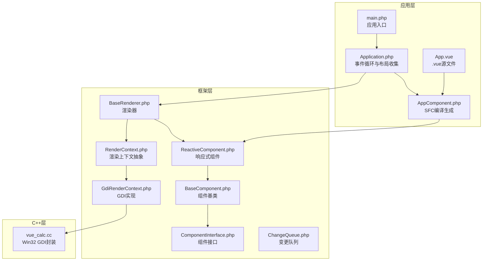
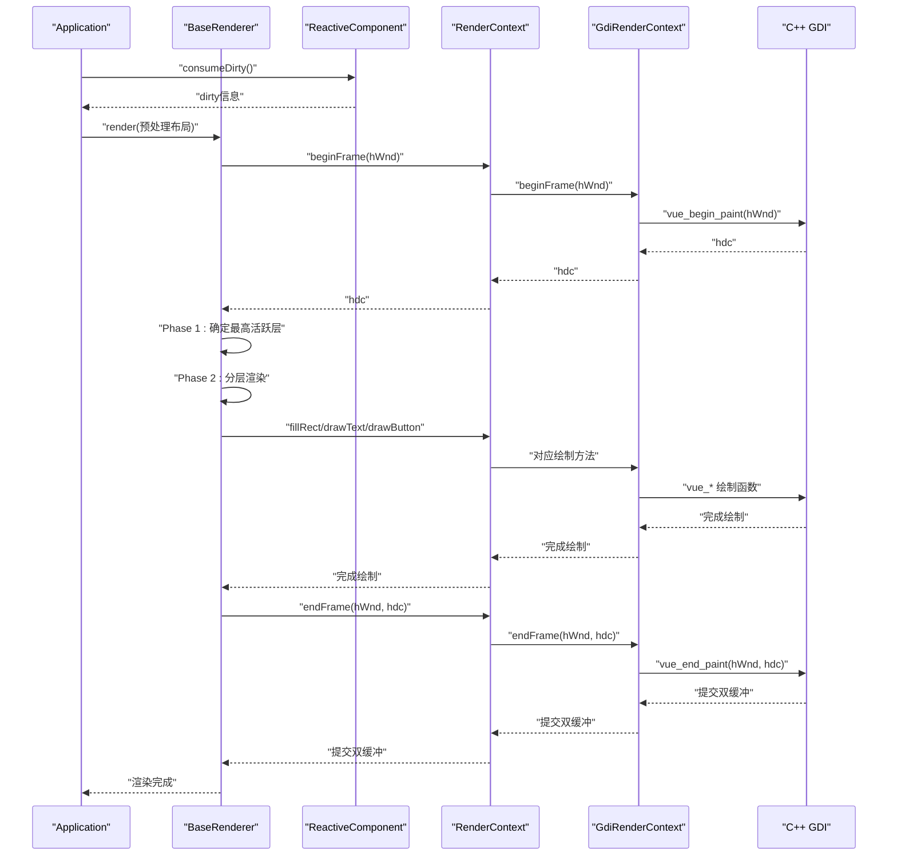
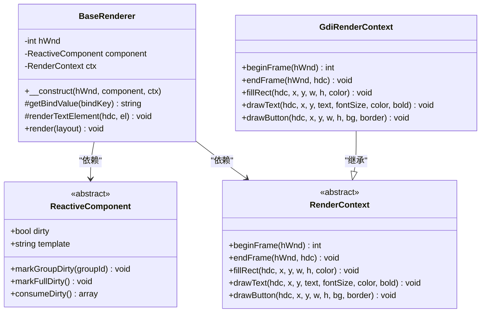
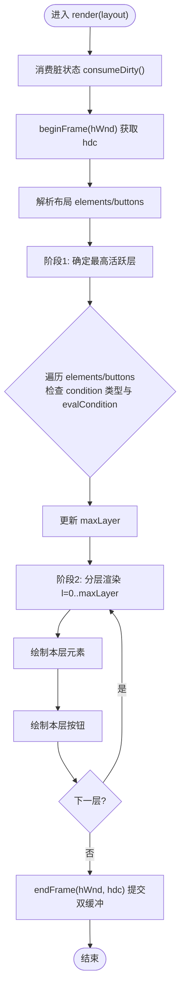
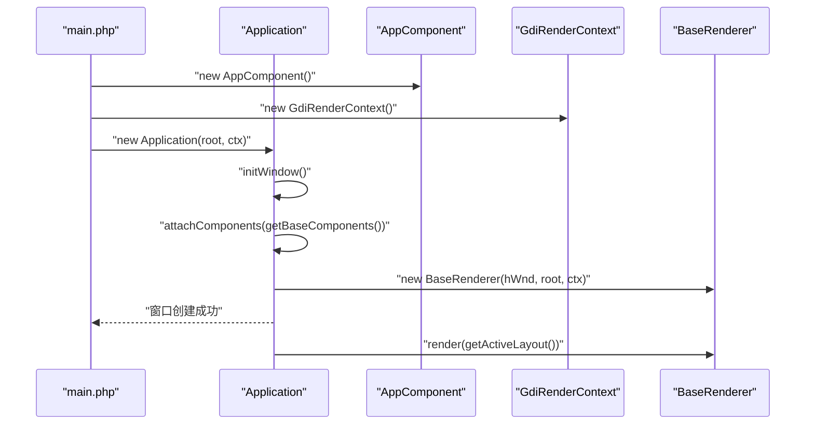
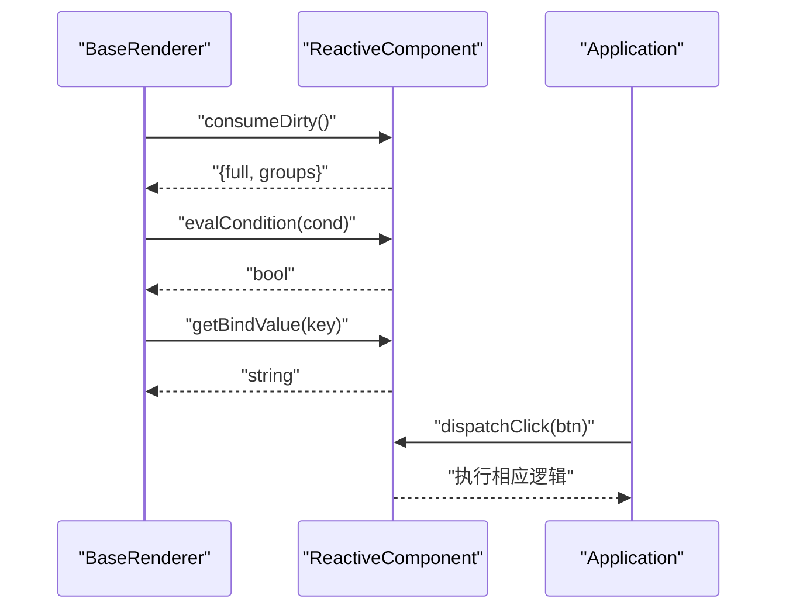
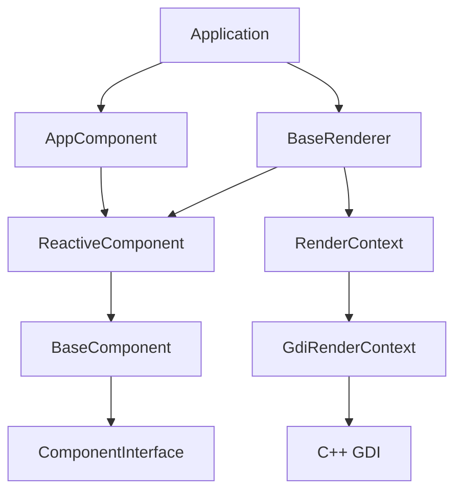

# 渲染器架构设计

<cite>
**本文档引用的文件**
- [framework/BaseRenderer.php](file://framework/BaseRenderer.php)
- [framework/rendering/RenderContext.php](file://framework/rendering/RenderContext.php)
- [framework/rendering/GdiRenderContext.php](file://framework/rendering/GdiRenderContext.php)
- [framework/BaseComponent.php](file://framework/BaseComponent.php)
- [framework/ReactiveComponent.php](file://framework/ReactiveComponent.php)
- [framework/interfaces/ComponentInterface.php](file://framework/interfaces/ComponentInterface.php)
- [framework/ChangeQueue.php](file://framework/ChangeQueue.php)
- [apps/calculator/Application.php](file://apps/calculator/Application.php)
- [apps/calculator/main.php](file://apps/calculator/main.php)
- [apps/calculator/App.vue](file://apps/calculator/App.vue)
- [apps/calculator/gen/AppComponent.php](file://apps/calculator/gen/AppComponent.php)
- [apps/calculator/components/DisplayPanel.vue](file://apps/calculator/components/DisplayPanel.vue)
- [apps/calculator/components/NumPad.vue](file://apps/calculator/components/NumPad.vue)
- [cpp/vue_calc.cc](file://cpp/vue_calc.cc)
</cite>

## 目录
1. [简介](#简介)
2. [项目结构](#项目结构)
3. [核心组件](#核心组件)
4. [架构总览](#架构总览)
5. [详细组件分析](#详细组件分析)
6. [依赖关系分析](#依赖关系分析)
7. [性能考虑](#性能考虑)
8. [故障排除指南](#故障排除指南)
9. [结论](#结论)
10. [附录](#附录)

## 简介
本文件面向VueCalc渲染器架构设计，围绕BaseRenderer类展开，系统阐述其设计原理、实现细节与扩展点。重点包括：
- 渲染调度逻辑与两阶段分层渲染机制
- 渲染器构造过程中的窗口句柄、组件引用与渲染上下文初始化
- 活跃层确定与分层渲染流程
- AOT编译限制的解决方案（foreach关联数组类型推断、嵌套数组类型丢失）
- 渲染器与组件系统的交互（脏状态消费、条件评估）
- 渲染器扩展点与自定义渲染逻辑实现指南

## 项目结构
VueCalc采用“SFC组件 + AOT编译 + C++渲染后端”的分层架构。核心目录与职责如下：
- apps/calculator：应用层，包含.vue源文件、生成的组件代码与入口脚本
- framework：框架层，包含渲染器、组件基类、渲染上下文与接口
- cpp：C++层，封装Win32 GDI绘制原语，作为渲染后端

**图表来源**
- [apps/calculator/Application.php:15-36](file://apps/calculator/Application.php#L15-L36)
- [framework/BaseRenderer.php:15-26](file://framework/BaseRenderer.php#L15-L26)
- [framework/rendering/RenderContext.php:13-29](file://framework/rendering/RenderContext.php#L13-L29)
- [framework/rendering/GdiRenderContext.php:11-37](file://framework/rendering/GdiRenderContext.php#L11-L37)
- [framework/BaseComponent.php:16-36](file://framework/BaseComponent.php#L16-L36)
- [framework/ReactiveComponent.php:14-35](file://framework/ReactiveComponent.php#L14-L35)
- [framework/interfaces/ComponentInterface.php:13-52](file://framework/interfaces/ComponentInterface.php#L13-L52)
- [framework/ChangeQueue.php:11-57](file://framework/ChangeQueue.php#L11-L57)
- [cpp/vue_calc.cc:36-157](file://cpp/vue_calc.cc#L36-L157)

**章节来源**
- [apps/calculator/Application.php:15-36](file://apps/calculator/Application.php#L15-L36)
- [framework/BaseRenderer.php:15-26](file://framework/BaseRenderer.php#L15-L26)
- [framework/rendering/RenderContext.php:13-29](file://framework/rendering/RenderContext.php#L13-L29)
- [framework/rendering/GdiRenderContext.php:11-37](file://framework/rendering/GdiRenderContext.php#L11-L37)
- [framework/BaseComponent.php:16-36](file://framework/BaseComponent.php#L16-L36)
- [framework/ReactiveComponent.php:14-35](file://framework/ReactiveComponent.php#L14-L35)
- [framework/interfaces/ComponentInterface.php:13-52](file://framework/interfaces/ComponentInterface.php#L13-L52)
- [framework/ChangeQueue.php:11-57](file://framework/ChangeQueue.php#L11-L57)
- [cpp/vue_calc.cc:36-157](file://cpp/vue_calc.cc#L36-L157)

## 核心组件
本节聚焦BaseRenderer类及其协作组件，解释其职责与交互。

- BaseRenderer：负责两阶段分层渲染与调度，接收预处理后的布局数据，消费组件脏状态，调用渲染上下文进行绘制，并在帧结束时提交双缓冲。
- RenderContext：渲染上下文抽象，定义beginFrame/endFrame/fillRect/drawText/drawButton等绘制接口。
- GdiRenderContext：Win32 GDI后端实现，委托C++层的vue_*函数执行具体绘制。
- ReactiveComponent：响应式组件基类，维护脏标记与组级脏状态，提供getBindValue、dispatchClick、evalCondition等抽象方法。
- BaseComponent：组件基类，提供组件树结构、父子引用与属性管理。
- Application：应用控制器，负责窗口初始化、事件循环、布局收集与渲染调度。

**章节来源**
- [framework/BaseRenderer.php:15-197](file://framework/BaseRenderer.php#L15-L197)
- [framework/rendering/RenderContext.php:13-29](file://framework/rendering/RenderContext.php#L13-L29)
- [framework/rendering/GdiRenderContext.php:11-37](file://framework/rendering/GdiRenderContext.php#L11-L37)
- [framework/ReactiveComponent.php:14-90](file://framework/ReactiveComponent.php#L14-L90)
- [framework/BaseComponent.php:16-177](file://framework/BaseComponent.php#L16-L177)
- [apps/calculator/Application.php:15-322](file://apps/calculator/Application.php#L15-L322)

## 架构总览
渲染器架构遵循“数据驱动 + 组件化 + 后端无关”的设计原则。渲染流程分为两阶段：活跃层确定与分层渲染；同时通过脏状态驱动按需重绘，避免不必要的绘制开销。

**图表来源**
- [apps/calculator/Application.php:205-263](file://apps/calculator/Application.php#L205-L263)
- [framework/BaseRenderer.php:98-196](file://framework/BaseRenderer.php#L98-L196)
- [framework/ReactiveComponent.php:56-64](file://framework/ReactiveComponent.php#L56-L64)
- [framework/rendering/RenderContext.php:15-29](file://framework/rendering/RenderContext.php#L15-L29)
- [framework/rendering/GdiRenderContext.php:13-36](file://framework/rendering/GdiRenderContext.php#L13-L36)
- [cpp/vue_calc.cc:90-117](file://cpp/vue_calc.cc#L90-L117)

## 详细组件分析

### BaseRenderer 设计与实现
BaseRenderer是渲染器的核心，承担以下职责：
- 接收窗口句柄、组件引用与渲染上下文
- 消费组件脏状态，决定是否进行渲染
- 两阶段分层渲染：先确定最高活跃层，再按层顺序绘制
- 文本渲染支持对齐与动态字号调整
- 调用渲染上下文执行绘制操作

关键实现要点：
- 构造函数保存hWnd、组件与渲染上下文
- render方法中，先消费脏状态，再beginFrame获取hdc，最后endFrame提交
- 两阶段渲染：遍历elements/buttons确定最大层，再逐层绘制
- 条件评估：对每个元素/按钮检查condition字段，确保为数组类型后再evalCondition
- 文本渲染：根据容器宽度与对齐方式计算x坐标，动态调整字号

AOT编译限制的解决方案：
- foreach遍历关联数组时key类型推断错误：使用array_keys() + for循环替代foreach
- 函数返回嵌套数组后子数组类型丢失：使用(array)类型转换保留数组引用

**图表来源**
- [framework/BaseRenderer.php:15-197](file://framework/BaseRenderer.php#L15-L197)
- [framework/ReactiveComponent.php:14-90](file://framework/ReactiveComponent.php#L14-L90)
- [framework/rendering/RenderContext.php:13-29](file://framework/rendering/RenderContext.php#L13-L29)
- [framework/rendering/GdiRenderContext.php:11-37](file://framework/rendering/GdiRenderContext.php#L11-L37)

**章节来源**
- [framework/BaseRenderer.php:15-197](file://framework/BaseRenderer.php#L15-L197)

### 渲染流程：活跃层确定与分层渲染
渲染流程分为两个阶段：
- 阶段1：确定最高活跃层
  - 遍历elements与buttons，检查condition字段类型，调用组件evalCondition，记录最大layer
- 阶段2：分层渲染
  - 从0到maxLayer逐层渲染
  - 对每层先绘制元素，再绘制按钮
  - 按钮仅在最高层或满足条件时绘制

**图表来源**
- [framework/BaseRenderer.php:98-196](file://framework/BaseRenderer.php#L98-L196)

**章节来源**
- [framework/BaseRenderer.php:98-196](file://framework/BaseRenderer.php#L98-L196)

### 渲染器构造过程与初始化
渲染器的构造与初始化涉及以下步骤：
- 应用入口main.php创建根组件、渲染上下文与Application
- Application.initWindow()创建窗口、显示窗口、挂载组件树、创建BaseRenderer
- Application.run()中按需调用renderer.render(getActiveLayout())

**图表来源**
- [apps/calculator/main.php:19-48](file://apps/calculator/main.php#L19-L48)
- [apps/calculator/Application.php:51-76](file://apps/calculator/Application.php#L51-L76)
- [apps/calculator/gen/AppComponent.php:781-787](file://apps/calculator/gen/AppComponent.php#L781-L787)

**章节来源**
- [apps/calculator/main.php:19-48](file://apps/calculator/main.php#L19-L48)
- [apps/calculator/Application.php:51-76](file://apps/calculator/Application.php#L51-L76)
- [apps/calculator/gen/AppComponent.php:781-787](file://apps/calculator/gen/AppComponent.php#L781-L787)

### 渲染器与组件系统的交互
- 脏状态消费：BaseRenderer在render开始时调用ReactiveComponent.consumeDirty()，获取full与groups标记，用于控制重绘范围
- 条件评估：对每个元素/按钮的condition字段进行类型校验后，调用组件evalCondition判断是否渲染
- 绑定值获取：文本元素通过getBindValue(bindKey)从组件读取绑定值
- 点击分发：Application.handleClick中同样采用两阶段分层命中测试，最终调用组件dispatchClick

**图表来源**
- [framework/BaseRenderer.php:100-101](file://framework/BaseRenderer.php#L100-L101)
- [framework/BaseRenderer.php:117-120](file://framework/BaseRenderer.php#L117-L120)
- [framework/BaseRenderer.php:146-148](file://framework/BaseRenderer.php#L146-L148)
- [framework/ReactiveComponent.php:56-64](file://framework/ReactiveComponent.php#L56-L64)
- [framework/ReactiveComponent.php:84-89](file://framework/ReactiveComponent.php#L84-L89)
- [apps/calculator/Application.php:269-321](file://apps/calculator/Application.php#L269-L321)

**章节来源**
- [framework/BaseRenderer.php:100-101](file://framework/BaseRenderer.php#L100-L101)
- [framework/BaseRenderer.php:117-120](file://framework/BaseRenderer.php#L117-L120)
- [framework/BaseRenderer.php:146-148](file://framework/BaseRenderer.php#L146-L148)
- [framework/ReactiveComponent.php:56-64](file://framework/ReactiveComponent.php#L56-L64)
- [framework/ReactiveComponent.php:84-89](file://framework/ReactiveComponent.php#L84-L89)
- [apps/calculator/Application.php:269-321](file://apps/calculator/Application.php#L269-L321)

### AOT编译限制的解决方案
针对Swoole AOT编译的限制，代码采用以下策略：
- foreach遍历关联数组时key类型推断错误：使用array_keys() + for循环替代foreach
- 函数返回嵌套数组后子数组类型丢失：使用(array)类型转换保留数组引用

这些修复广泛应用于：
- BaseRenderer.render中的elements/buttons遍历
- Application.getBaseComponents与collectLayoutRecursive
- ReactiveComponent.getAllDescendants与getBaseComponents

**章节来源**
- [framework/BaseRenderer.php:112-136](file://framework/BaseRenderer.php#L112-L136)
- [framework/BaseRenderer.php:141-162](file://framework/BaseRenderer.php#L141-L162)
- [apps/calculator/Application.php:143-200](file://apps/calculator/Application.php#L143-L200)
- [framework/BaseComponent.php:137-154](file://framework/BaseComponent.php#L137-L154)
- [framework/BaseComponent.php:162-170](file://framework/BaseComponent.php#L162-L170)
- [framework/ReactiveComponent.php:37-40](file://framework/ReactiveComponent.php#L37-L40)

### 渲染器扩展点与自定义渲染逻辑
- 自定义渲染上下文：实现RenderContext抽象类，覆盖beginFrame/endFrame/fillRect/drawText/drawButton，即可切换不同后端（如Skia/OpenGL/Web Canvas）
- 自定义绘制行为：在GdiRenderContext中扩展更多绘制原语，或在C++层增加新的vue_*函数
- 自定义条件评估：在ReactiveComponent.evalCondition中扩展更多条件运算符与属性
- 自定义绑定值：在ReactiveComponent.getBindValue中扩展更多绑定键
- 自定义布局生成：在组件的getLayout中返回自定义元素/按钮结构，配合layer与condition实现复杂交互

**章节来源**
- [framework/rendering/RenderContext.php:13-29](file://framework/rendering/RenderContext.php#L13-L29)
- [framework/rendering/GdiRenderContext.php:11-37](file://framework/rendering/GdiRenderContext.php#L11-L37)
- [framework/ReactiveComponent.php:84-89](file://framework/ReactiveComponent.php#L84-L89)
- [framework/ReactiveComponent.php:66-74](file://framework/ReactiveComponent.php#L66-L74)

## 依赖关系分析
渲染器与组件系统之间的依赖关系清晰且低耦合：
- BaseRenderer依赖ReactiveComponent（脏状态消费、条件评估、绑定值获取）
- BaseRenderer依赖RenderContext（后端无关的绘制接口）
- GdiRenderContext实现RenderContext，委托C++层GDI函数
- Application协调窗口、事件循环与渲染调度
- 组件通过SFC编译生成，提供布局数据与交互逻辑

**图表来源**
- [framework/BaseRenderer.php:15-197](file://framework/BaseRenderer.php#L15-L197)
- [framework/ReactiveComponent.php:14-90](file://framework/ReactiveComponent.php#L14-L90)
- [framework/rendering/RenderContext.php:13-29](file://framework/rendering/RenderContext.php#L13-L29)
- [framework/rendering/GdiRenderContext.php:11-37](file://framework/rendering/GdiRenderContext.php#L11-L37)
- [apps/calculator/Application.php:15-322](file://apps/calculator/Application.php#L15-L322)
- [apps/calculator/gen/AppComponent.php:11-787](file://apps/calculator/gen/AppComponent.php#L11-L787)
- [framework/BaseComponent.php:16-177](file://framework/BaseComponent.php#L16-L177)
- [framework/interfaces/ComponentInterface.php:13-52](file://framework/interfaces/ComponentInterface.php#L13-L52)

**章节来源**
- [framework/BaseRenderer.php:15-197](file://framework/BaseRenderer.php#L15-L197)
- [framework/ReactiveComponent.php:14-90](file://framework/ReactiveComponent.php#L14-L90)
- [framework/rendering/RenderContext.php:13-29](file://framework/rendering/RenderContext.php#L13-L29)
- [framework/rendering/GdiRenderContext.php:11-37](file://framework/rendering/GdiRenderContext.php#L11-L37)
- [apps/calculator/Application.php:15-322](file://apps/calculator/Application.php#L15-L322)
- [apps/calculator/gen/AppComponent.php:11-787](file://apps/calculator/gen/AppComponent.php#L11-L787)
- [framework/BaseComponent.php:16-177](file://framework/BaseComponent.php#L16-L177)
- [framework/interfaces/ComponentInterface.php:13-52](file://framework/interfaces/ComponentInterface.php#L13-L52)

## 性能考虑
- 按需渲染：通过ReactiveComponent.dirty与consumeDirty()实现脏状态驱动的渲染，避免全量重绘
- 分层渲染：先确定最高活跃层，再按层绘制，减少无效绘制
- AOT安全遍历：使用array_keys()+for循环替代foreach，降低类型推断开销
- 双缓冲：GDI后端使用双缓冲，减少闪烁并提升帧率稳定性
- 事件循环节流：Application.run中使用usleep(16ms)控制约60FPS

[本节为通用性能讨论，不直接分析具体文件]

## 故障排除指南
常见问题与排查建议：
- 渲染未触发：确认组件状态变更后是否设置dirty，以及Application事件循环是否检测到dirty
- 条件渲染异常：检查condition字段是否为数组类型，确保evalCondition正确实现
- 文本未显示：检查bindKey是否存在且getBindValue返回非空字符串
- 点击无响应：确认按钮的handler与参数正确，Application.handleClick命中测试逻辑正常
- AOT编译报错：检查foreach遍历关联数组处是否使用array_keys()+for循环，返回嵌套数组处是否使用(array)类型转换

**章节来源**
- [framework/BaseRenderer.php:100-101](file://framework/BaseRenderer.php#L100-L101)
- [framework/BaseRenderer.php:117-120](file://framework/BaseRenderer.php#L117-L120)
- [framework/BaseRenderer.php:146-148](file://framework/BaseRenderer.php#L146-L148)
- [framework/ReactiveComponent.php:56-64](file://framework/ReactiveComponent.php#L56-L64)
- [apps/calculator/Application.php:269-321](file://apps/calculator/Application.php#L269-L321)

## 结论
VueCalc渲染器通过BaseRenderer实现了数据驱动、组件化的两阶段分层渲染体系。借助ReactiveComponent的脏状态与条件评估机制，渲染器能够在AOT环境下稳定运行，并通过RenderContext抽象实现后端无关的绘制能力。整体架构清晰、扩展性强，适合进一步演进至多后端支持与更复杂的交互场景。

[本节为总结性内容，不直接分析具体文件]

## 附录
- 示例应用：Calculator应用展示了组件树、布局数据与交互逻辑的完整实现
- C++后端：Win32 GDI封装提供基础绘制原语，支持双缓冲与常用图形操作

**章节来源**
- [apps/calculator/App.vue:1-203](file://apps/calculator/App.vue#L1-L203)
- [apps/calculator/gen/AppComponent.php:11-787](file://apps/calculator/gen/AppComponent.php#L11-L787)
- [apps/calculator/components/DisplayPanel.vue:1-12](file://apps/calculator/components/DisplayPanel.vue#L1-L12)
- [apps/calculator/components/NumPad.vue:1-37](file://apps/calculator/components/NumPad.vue#L1-L37)
- [cpp/vue_calc.cc:36-157](file://cpp/vue_calc.cc#L36-L157)