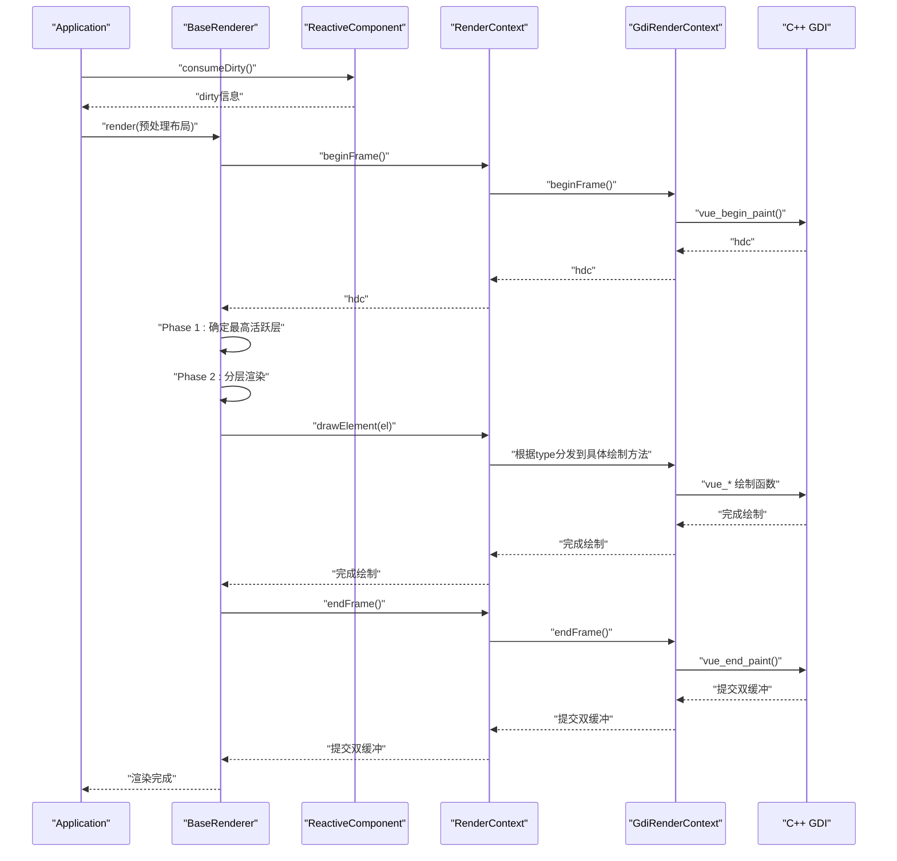
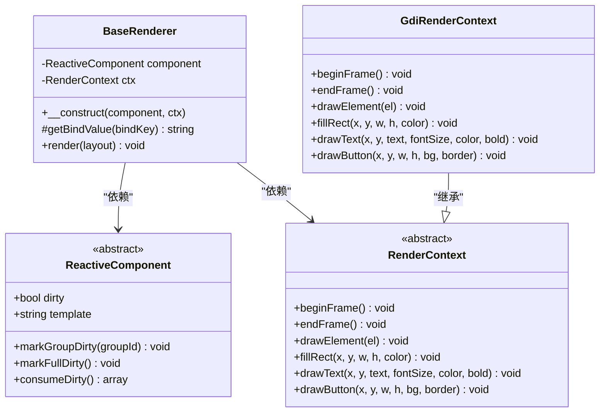
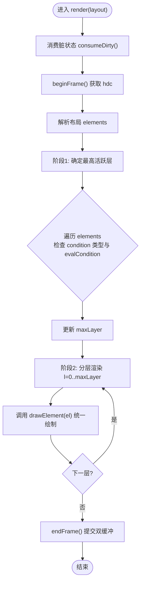
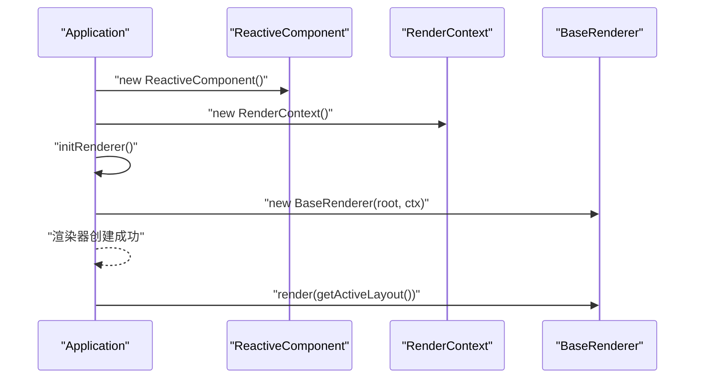
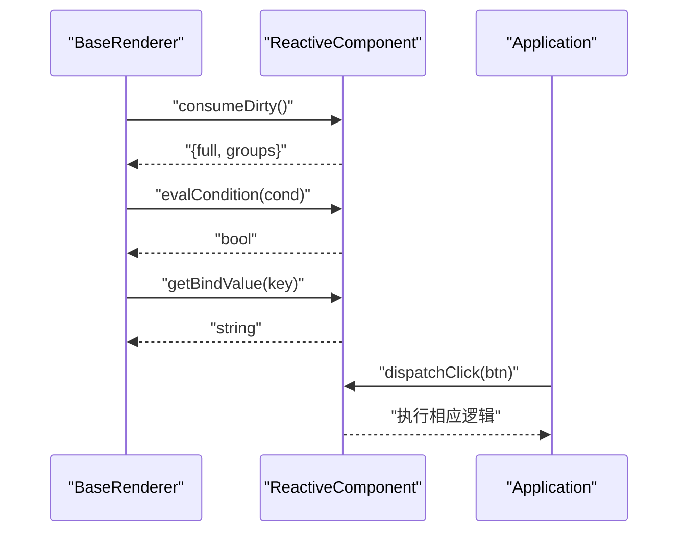
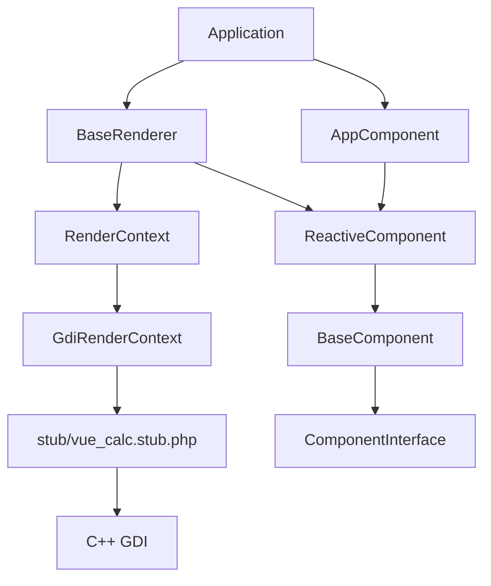

# 渲染器架构设计

<cite>
**本文档引用的文件**
- [framework/BaseRenderer.php](file://framework/BaseRenderer.php)
- [framework/rendering/RenderContext.php](file://framework/rendering/RenderContext.php)
- [framework/rendering/GdiRenderContext.php](file://framework/rendering/GdiRenderContext.php)
- [framework/BaseComponent.php](file://framework/BaseComponent.php)
- [framework/ReactiveComponent.php](file://framework/ReactiveComponent.php)
- [framework/interfaces/ComponentInterface.php](file://framework/interfaces/ComponentInterface.php)
- [framework/ChangeQueue.php](file://framework/ChangeQueue.php)
- [framework/Application.php](file://framework/Application.php)
- [stub/vue_calc.stub.php](file://stub/vue_calc.stub.php)
</cite>

## 目录
1. [简介](#简介)
2. [项目结构](#项目结构)
3. [核心组件](#核心组件)
4. [架构总览](#架构总览)
5. [详细组件分析](#详细组件分析)
6. [依赖关系分析](#依赖关系分析)
7. [性能考虑](#性能考虑)
8. [故障排除指南](#故障排除指南)
9. [结论](#结论)
10. [附录](#附录)

## 简介
本文件面向VueCalc渲染器架构设计，围绕BaseRenderer类展开，系统阐述其设计原理、实现细节与扩展点。重点包括：
- 渲染调度逻辑与两阶段分层渲染机制
- 渲染器构造过程中的组件引用与渲染上下文初始化
- 活跃层确定与分层渲染流程
- AOT编译限制的解决方案（foreach关联数组类型推断、嵌套数组类型丢失）
- 渲染器与组件系统的交互（脏状态消费、条件评估）
- 渲染器扩展点与自定义渲染逻辑实现指南

**更新** 渲染系统已统一化架构，BaseRenderer移除了独立的renderTextElement方法，所有渲染职责委托给统一的render()方法，RenderContext引入了drawElement()统一接口。

## 项目结构
VueCalc采用"SFC组件 + AOT编译 + C++渲染后端"的分层架构。核心目录与职责如下：
- framework：框架层，包含渲染器、组件基类、渲染上下文与接口
- stub：PHP扩展存根文件，定义C++层的函数声明
- framework/Application.php：应用控制器，负责窗口初始化、事件循环、布局收集与渲染调度

```mermaid
graph TB
subgraph "框架层"
RENDERER["BaseRenderer.php<br/>渲染器"]
RCTX["RenderContext.php<br/>渲染上下文抽象"]
GDI["GdiRenderContext.php<br/>GDI实现"]
BASECOMP["BaseComponent.php<br/>组件基类"]
REACCOMP["ReactiveComponent.php<br/>响应式组件"]
IFACE["ComponentInterface.php<br/>组件接口"]
CHANGEQ["ChangeQueue.php<br/>变更队列"]
APP["Application.php<br/>应用控制器"]
ENDPOINT["stub/vue_calc.stub.php<br/>C++函数声明"]
end
SUBGRAPH "C++层"
CPP["vue_calc.cc<br/>Win32 GDI封装"]
END
APP --> RENDERER
RENDERER --> RCTX
RCTX --> GDI
GDI --> ENDPOINT
ENDPOINT --> CPP
RENDERER --> REACCOMP
REACCOMP --> BASECOMP
BASECOMP --> IFACE
```

**图表来源**
- [framework/BaseRenderer.php:1-129](file://framework/BaseRenderer.php#L1-L129)
- [framework/rendering/RenderContext.php:1-41](file://framework/rendering/RenderContext.php#L1-L41)
- [framework/rendering/GdiRenderContext.php:1-116](file://framework/rendering/GdiRenderContext.php#L1-L116)
- [framework/BaseComponent.php:1-177](file://framework/BaseComponent.php#L1-L177)
- [framework/ReactiveComponent.php:1-90](file://framework/ReactiveComponent.php#L1-L90)
- [framework/interfaces/ComponentInterface.php:1-52](file://framework/interfaces/ComponentInterface.php#L1-L52)
- [framework/ChangeQueue.php:1-57](file://framework/ChangeQueue.php#L1-L57)
- [framework/Application.php:1-400](file://framework/Application.php#L1-L400)
- [stub/vue_calc.stub.php:1-24](file://stub/vue_calc.stub.php#L1-L24)

**章节来源**
- [framework/BaseRenderer.php:1-129](file://framework/BaseRenderer.php#L1-L129)
- [framework/rendering/RenderContext.php:1-41](file://framework/rendering/RenderContext.php#L1-L41)
- [framework/rendering/GdiRenderContext.php:1-116](file://framework/rendering/GdiRenderContext.php#L1-L116)
- [framework/BaseComponent.php:1-177](file://framework/BaseComponent.php#L1-L177)
- [framework/ReactiveComponent.php:1-90](file://framework/ReactiveComponent.php#L1-L90)
- [framework/interfaces/ComponentInterface.php:1-52](file://framework/interfaces/ComponentInterface.php#L1-L52)
- [framework/ChangeQueue.php:1-57](file://framework/ChangeQueue.php#L1-L57)
- [framework/Application.php:1-400](file://framework/Application.php#L1-L400)
- [stub/vue_calc.stub.php:1-24](file://stub/vue_calc.stub.php#L1-L24)

## 核心组件
本节聚焦BaseRenderer类及其协作组件，解释其职责与交互。

- BaseRenderer：负责两阶段分层渲染与调度，接收预处理后的布局数据，消费组件脏状态，调用渲染上下文进行绘制，并在帧结束时提交双缓冲。
- RenderContext：渲染上下文抽象，定义beginFrame/endFrame/drawElement/fillRect/drawText/drawButton等绘制接口。
- GdiRenderContext：Win32 GDI后端实现，委托C++层的vue_*函数执行具体绘制。
- ReactiveComponent：响应式组件基类，维护脏标记与组级脏状态，提供getBindValue、dispatchClick、evalCondition等抽象方法。
- BaseComponent：组件基类，提供组件树结构、父子引用与属性管理。
- Application：应用控制器，负责窗口初始化、事件循环、布局收集与渲染调度。

**更新** 渲染系统已统一化架构，BaseRenderer不再依赖独立的renderTextElement方法，所有渲染职责都委托给统一的render()方法，RenderContext引入了drawElement()统一接口。

**章节来源**
- [framework/BaseRenderer.php:1-129](file://framework/BaseRenderer.php#L1-L129)
- [framework/rendering/RenderContext.php:1-41](file://framework/rendering/RenderContext.php#L1-L41)
- [framework/rendering/GdiRenderContext.php:1-116](file://framework/rendering/GdiRenderContext.php#L1-L116)
- [framework/ReactiveComponent.php:1-90](file://framework/ReactiveComponent.php#L1-L90)
- [framework/BaseComponent.php:1-177](file://framework/BaseComponent.php#L1-L177)
- [framework/Application.php:1-400](file://framework/Application.php#L1-L400)

## 架构总览
渲染器架构遵循"数据驱动 + 组件化 + 后端无关"的设计原则。渲染流程分为两阶段：活跃层确定与分层渲染；同时通过脏状态驱动按需重绘，避免不必要的绘制开销。



**更新** 渲染流程已简化，统一通过drawElement()接口进行绘制，不再需要独立的renderTextElement方法。

**图表来源**
- [framework/Application.php:271-329](file://framework/Application.php#L271-L329)
- [framework/BaseRenderer.php:43-128](file://framework/BaseRenderer.php#L43-L128)
- [framework/ReactiveComponent.php:56-64](file://framework/ReactiveComponent.php#L56-L64)
- [framework/rendering/RenderContext.php:21-30](file://framework/rendering/RenderContext.php#L21-L30)
- [framework/rendering/GdiRenderContext.php:32-54](file://framework/rendering/GdiRenderContext.php#L32-L54)
- [stub/vue_calc.stub.php:18-23](file://stub/vue_calc.stub.php#L18-L23)

## 详细组件分析

### BaseRenderer 设计与实现
BaseRenderer是渲染器的核心，承担以下职责：
- 接收组件引用与渲染上下文
- 消费组件脏状态，决定是否进行渲染
- 两阶段分层渲染：先确定最高活跃层，再按层顺序绘制
- 文本渲染支持对齐与动态字号调整
- 调用渲染上下文执行绘制操作

关键实现要点：
- 构造函数保存组件与渲染上下文
- render方法中，先beginFrame获取hdc，最后endFrame提交
- 两阶段渲染：遍历elements确定最大层，再逐层绘制
- 条件评估：对每个元素检查condition字段，确保为数组类型后再evalCondition
- 文本渲染：根据容器宽度与对齐方式计算x坐标，动态调整字号
- 统一绘制：调用ctx->drawElement()统一处理所有元素类型

**更新** BaseRenderer已移除独立的renderTextElement方法，所有渲染职责都委托给统一的render()方法，通过ctx->drawElement()接口实现。

AOT编译限制的解决方案：
- foreach遍历关联数组时key类型推断错误：使用array_keys() + for循环替代foreach
- 函数返回嵌套数组后子数组类型丢失：使用(array)类型转换保留数组引用



**更新** GdiRenderContext现在实现了drawElement()方法，将元素类型分发到具体的绘制方法。

**图表来源**
- [framework/BaseRenderer.php:1-129](file://framework/BaseRenderer.php#L1-L129)
- [framework/ReactiveComponent.php:1-90](file://framework/ReactiveComponent.php#L1-L90)
- [framework/rendering/RenderContext.php:1-41](file://framework/rendering/RenderContext.php#L1-L41)
- [framework/rendering/GdiRenderContext.php:1-116](file://framework/rendering/GdiRenderContext.php#L1-L116)

**章节来源**
- [framework/BaseRenderer.php:1-129](file://framework/BaseRenderer.php#L1-L129)

### 渲染流程：活跃层确定与分层渲染
渲染流程分为两个阶段：
- 阶段1：确定最高活跃层
  - 遍历elements，检查condition字段类型，调用组件evalCondition，记录最大layer
- 阶段2：分层渲染
  - 从0到maxLayer逐层渲染
  - 对每层调用ctx->drawElement()统一绘制元素
  - 按钮仅在最高层或满足条件时绘制

**更新** 渲染流程已简化，统一通过drawElement()接口处理所有元素类型。



**更新** 渲染流程已简化，统一通过drawElement()接口处理所有元素类型。

**图表来源**
- [framework/BaseRenderer.php:43-128](file://framework/BaseRenderer.php#L43-L128)

**章节来源**
- [framework/BaseRenderer.php:43-128](file://framework/BaseRenderer.php#L43-L128)

### 渲染器构造过程与初始化
渲染器的构造与初始化涉及以下步骤：
- Application.initRenderer()中创建BaseRenderer
- BaseRenderer构造函数保存组件与渲染上下文
- Application.run()中按需调用renderer.render(getActiveLayout())

**更新** 渲染器构造过程已简化，不再需要窗口句柄参数。



**图表来源**
- [framework/Application.php:35-57](file://framework/Application.php#L35-L57)
- [framework/BaseRenderer.php:18-22](file://framework/BaseRenderer.php#L18-L22)

**章节来源**
- [framework/Application.php:35-57](file://framework/Application.php#L35-L57)
- [framework/BaseRenderer.php:18-22](file://framework/BaseRenderer.php#L18-L22)

### 渲染器与组件系统的交互
- 脏状态消费：BaseRenderer在render开始时调用ReactiveComponent.consumeDirty()，获取full与groups标记，用于控制重绘范围
- 条件评估：对每个元素的condition字段进行类型校验后，调用组件evalCondition判断是否渲染
- 绑定值获取：文本元素通过getBindValue(bindKey)从组件读取绑定值
- 点击分发：Application.handleClick中同样采用两阶段分层命中测试，最终调用组件dispatchClick

**更新** 渲染器与组件系统的交互保持不变，仍通过consumeDirty()、evalCondition()和getBindValue()进行通信。



**图表来源**
- [framework/BaseRenderer.php:56-64](file://framework/BaseRenderer.php#L56-L64)
- [framework/BaseRenderer.php:77-81](file://framework/BaseRenderer.php#L77-L81)
- [framework/BaseRenderer.php:122-123](file://framework/BaseRenderer.php#L122-L123)
- [framework/ReactiveComponent.php:56-64](file://framework/ReactiveComponent.php#L56-L64)
- [framework/ReactiveComponent.php:68-74](file://framework/ReactiveComponent.php#L68-L74)
- [framework/Application.php:335-399](file://framework/Application.php#L335-L399)

**章节来源**
- [framework/BaseRenderer.php:56-64](file://framework/BaseRenderer.php#L56-L64)
- [framework/BaseRenderer.php:77-81](file://framework/BaseRenderer.php#L77-L81)
- [framework/BaseRenderer.php:122-123](file://framework/BaseRenderer.php#L122-L123)
- [framework/ReactiveComponent.php:56-64](file://framework/ReactiveComponent.php#L56-L64)
- [framework/ReactiveComponent.php:68-74](file://framework/ReactiveComponent.php#L68-L74)
- [framework/Application.php:335-399](file://framework/Application.php#L335-L399)

### AOT编译限制的解决方案
针对Swoole AOT编译的限制，代码采用以下策略：
- foreach遍历关联数组时key类型推断错误：使用array_keys() + for循环替代foreach
- 函数返回嵌套数组后子数组类型丢失：使用(array)类型转换保留数组引用

这些修复广泛应用于：
- BaseRenderer.render中的elements遍历
- Application.getBaseComponents与collectLayoutRecursive
- ReactiveComponent.getAllDescendants与getBaseComponents

**更新** AOT编译限制的解决方案保持不变，仍使用array_keys()+for循环和(array)类型转换。

**章节来源**
- [framework/BaseRenderer.php:53-64](file://framework/BaseRenderer.php#L53-L64)
- [framework/BaseRenderer.php:77-93](file://framework/BaseRenderer.php#L77-L93)
- [framework/Application.php:189-206](file://framework/Application.php#L189-L206)
- [framework/BaseComponent.php:137-154](file://framework/BaseComponent.php#L137-L154)
- [framework/BaseComponent.php:162-170](file://framework/BaseComponent.php#L162-L170)
- [framework/ReactiveComponent.php:37-40](file://framework/ReactiveComponent.php#L37-L40)

### 渲染器扩展点与自定义渲染逻辑
- 自定义渲染上下文：实现RenderContext抽象类，覆盖beginFrame/endFrame/drawElement/fillRect/drawText/drawButton，即可切换不同后端（如Skia/OpenGL/Web Canvas）
- 自定义绘制行为：在GdiRenderContext中扩展更多绘制原语，或在C++层增加新的vue_*函数
- 自定义条件评估：在ReactiveComponent.evalCondition中扩展更多条件运算符与属性
- 自定义绑定值：在ReactiveComponent.getBindValue中扩展更多绑定键
- 自定义布局生成：在组件的getLayout中返回自定义元素/按钮结构，配合layer与condition实现复杂交互

**更新** 渲染器扩展点已简化，新增自定义渲染上下文时只需实现drawElement()统一接口。

**章节来源**
- [framework/rendering/RenderContext.php:13-40](file://framework/rendering/RenderContext.php#L13-L40)
- [framework/rendering/GdiRenderContext.php:32-54](file://framework/rendering/GdiRenderContext.php#L32-L54)
- [framework/ReactiveComponent.php:68-74](file://framework/ReactiveComponent.php#L68-L74)
- [framework/ReactiveComponent.php:84-89](file://framework/ReactiveComponent.php#L84-L89)

## 依赖关系分析
渲染器与组件系统之间的依赖关系清晰且低耦合：
- BaseRenderer依赖ReactiveComponent（脏状态消费、条件评估、绑定值获取）
- BaseRenderer依赖RenderContext（后端无关的绘制接口）
- GdiRenderContext实现RenderContext，委托C++层GDI函数
- Application协调窗口、事件循环与渲染调度
- 组件通过SFC编译生成，提供布局数据与交互逻辑

**更新** 依赖关系保持不变，但渲染流程已统一化。



**图表来源**
- [framework/BaseRenderer.php:1-129](file://framework/BaseRenderer.php#L1-L129)
- [framework/ReactiveComponent.php:1-90](file://framework/ReactiveComponent.php#L1-L90)
- [framework/rendering/RenderContext.php:1-41](file://framework/rendering/RenderContext.php#L1-L41)
- [framework/rendering/GdiRenderContext.php:1-116](file://framework/rendering/GdiRenderContext.php#L1-L116)
- [framework/Application.php:1-400](file://framework/Application.php#L1-L400)
- [framework/BaseComponent.php:1-177](file://framework/BaseComponent.php#L1-L177)
- [framework/interfaces/ComponentInterface.php:1-52](file://framework/interfaces/ComponentInterface.php#L1-L52)
- [stub/vue_calc.stub.php:1-24](file://stub/vue_calc.stub.php#L1-L24)

**章节来源**
- [framework/BaseRenderer.php:1-129](file://framework/BaseRenderer.php#L1-L129)
- [framework/ReactiveComponent.php:1-90](file://framework/ReactiveComponent.php#L1-L90)
- [framework/rendering/RenderContext.php:1-41](file://framework/rendering/RenderContext.php#L1-L41)
- [framework/rendering/GdiRenderContext.php:1-116](file://framework/rendering/GdiRenderContext.php#L1-L116)
- [framework/Application.php:1-400](file://framework/Application.php#L1-L400)
- [framework/BaseComponent.php:1-177](file://framework/BaseComponent.php#L1-L177)
- [framework/interfaces/ComponentInterface.php:1-52](file://framework/interfaces/ComponentInterface.php#L1-L52)
- [stub/vue_calc.stub.php:1-24](file://stub/vue_calc.stub.php#L1-L24)

## 性能考虑
- 按需渲染：通过ReactiveComponent.dirty与consumeDirty()实现脏状态驱动的渲染，避免全量重绘
- 分层渲染：先确定最高活跃层，再按层绘制，减少无效绘制
- AOT安全遍历：使用array_keys()+for循环替代foreach，降低类型推断开销
- 统一绘制接口：通过drawElement()统一处理所有元素类型，减少分支判断开销
- 双缓冲：GDI后端使用双缓冲，减少闪烁并提升帧率稳定性
- 事件循环节流：Application.run中使用usleep(16ms)控制约60FPS

**更新** 性能考虑已优化，统一绘制接口减少了分支判断开销。

## 故障排除指南
常见问题与排查建议：
- 渲染未触发：确认组件状态变更后是否设置dirty，以及Application事件循环是否检测到dirty
- 条件渲染异常：检查condition字段是否为数组类型，确保evalCondition正确实现
- 文本未显示：检查bindKey是否存在且getBindValue返回非空字符串
- 点击无响应：确认按钮的handler与参数正确，Application.handleClick命中测试逻辑正常
- AOT编译报错：检查foreach遍历关联数组处是否使用array_keys()+for循环，返回嵌套数组处是否使用(array)类型转换
- 统一接口问题：检查RenderContext.drawElement()实现是否正确处理所有元素类型

**更新** 新增了统一接口问题的排查建议。

**章节来源**
- [framework/BaseRenderer.php:56-64](file://framework/BaseRenderer.php#L56-L64)
- [framework/BaseRenderer.php:77-81](file://framework/BaseRenderer.php#L77-L81)
- [framework/BaseRenderer.php:122-123](file://framework/BaseRenderer.php#L122-L123)
- [framework/ReactiveComponent.php:56-64](file://framework/ReactiveComponent.php#L56-L64)
- [framework/Application.php:335-399](file://framework/Application.php#L335-L399)

## 结论
VueCalc渲染器通过BaseRenderer实现了数据驱动、组件化的两阶段分层渲染体系。借助ReactiveComponent的脏状态与条件评估机制，渲染器能够在AOT环境下稳定运行，并通过RenderContext抽象实现后端无关的绘制能力。**更新** 渲染系统已统一化架构，BaseRenderer移除了独立的renderTextElement方法，所有渲染职责委托给统一的render()方法，RenderContext引入了drawElement()统一接口，使架构更加简洁和一致。

## 附录
- 示例应用：Calculator应用展示了组件树、布局数据与交互逻辑的完整实现
- C++后端：Win32 GDI封装提供基础绘制原语，支持双缓冲与常用图形操作

**章节来源**
- [framework/Application.php:1-400](file://framework/Application.php#L1-L400)
- [stub/vue_calc.stub.php:1-24](file://stub/vue_calc.stub.php#L1-L24)