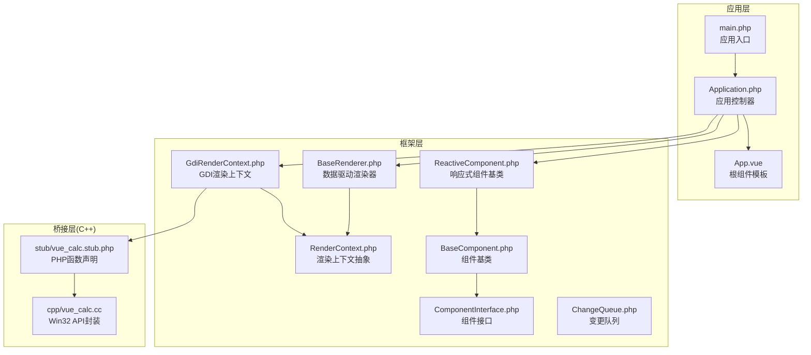
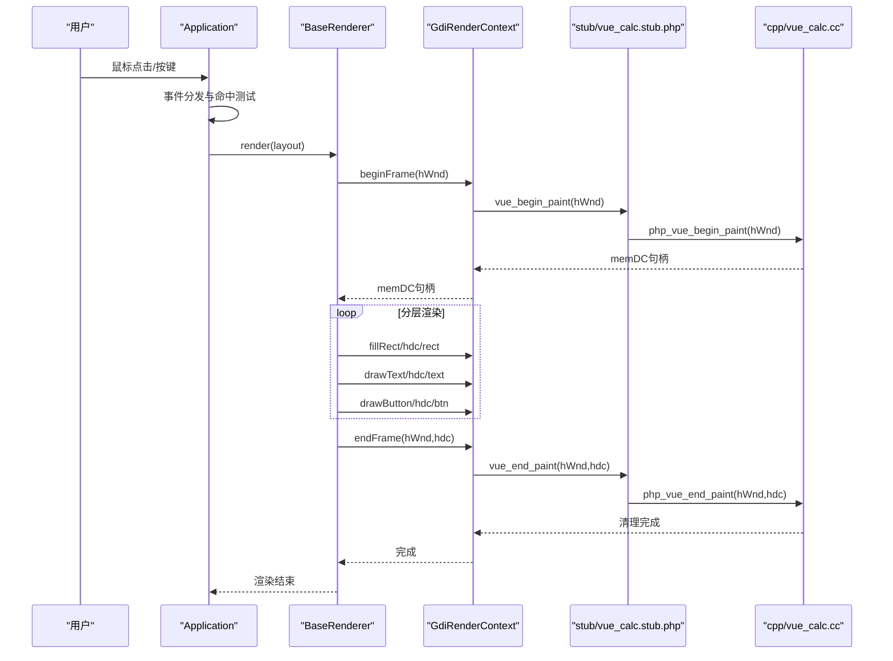
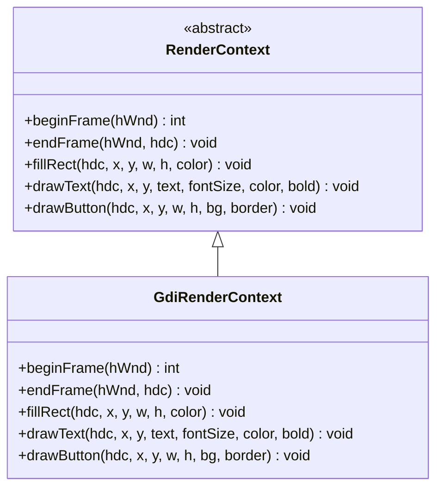
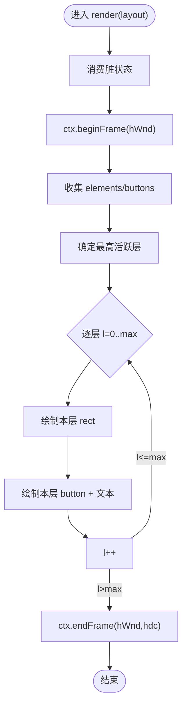
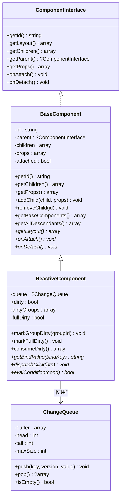
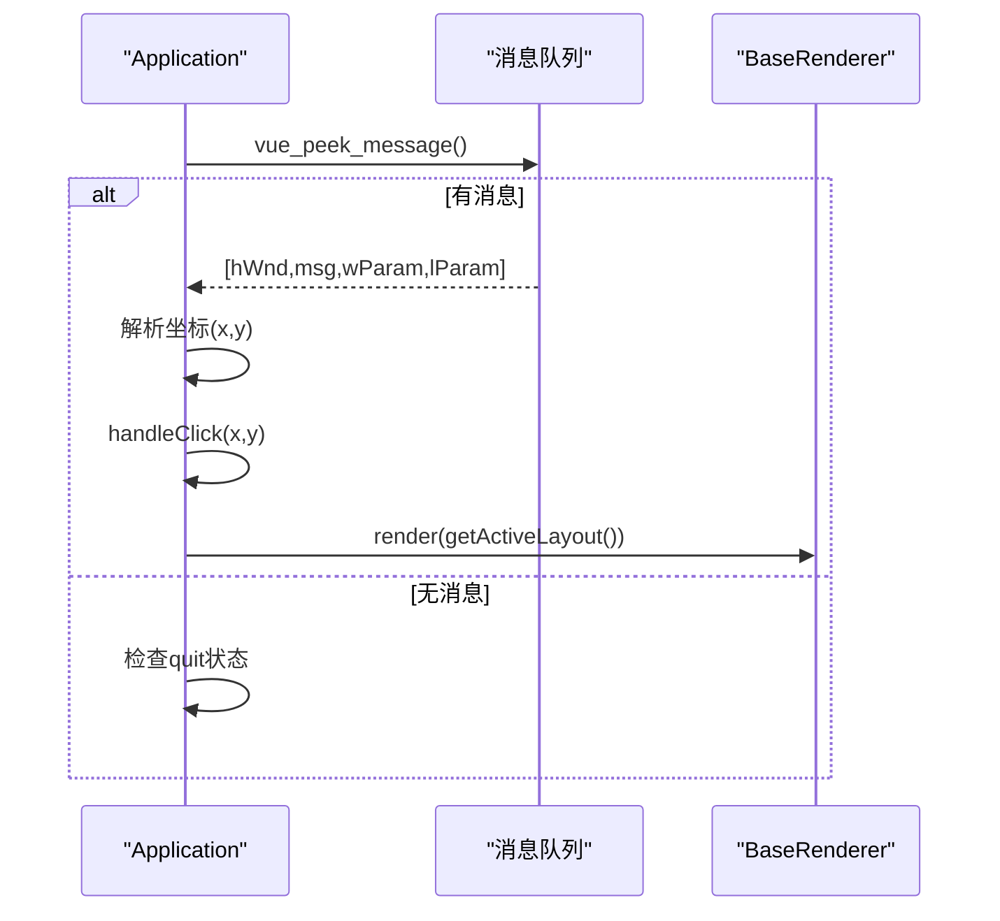
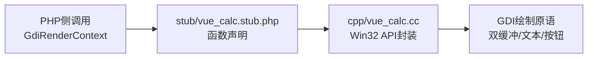
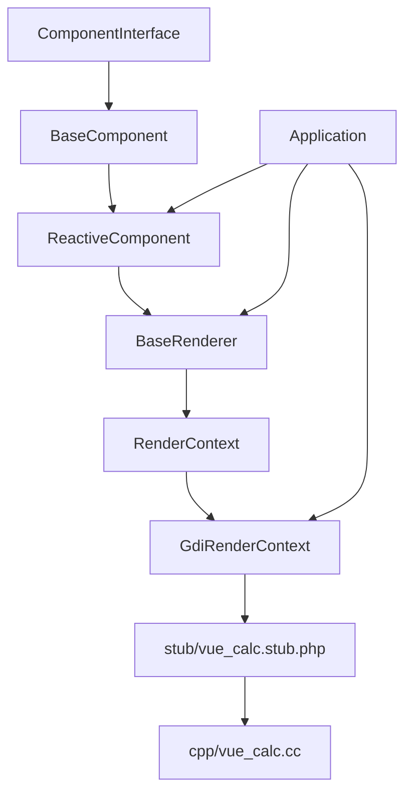

# 渲染系统实现

<cite>
**本文引用的文件**
- [framework/rendering/RenderContext.php](file://framework/rendering/RenderContext.php)
- [framework/rendering/GdiRenderContext.php](file://framework/rendering/GdiRenderContext.php)
- [framework/BaseRenderer.php](file://framework/BaseRenderer.php)
- [framework/ReactiveComponent.php](file://framework/ReactiveComponent.php)
- [framework/BaseComponent.php](file://framework/BaseComponent.php)
- [framework/interfaces/ComponentInterface.php](file://framework/interfaces/ComponentInterface.php)
- [framework/ChangeQueue.php](file://framework/ChangeQueue.php)
- [apps/calculator/Application.php](file://apps/calculator/Application.php)
- [apps/calculator/main.php](file://apps/calculator/main.php)
- [apps/calculator/App.vue](file://apps/calculator/App.vue)
- [cpp/vue_calc.cc](file://cpp/vue_calc.cc)
- [stub/vue_calc.stub.php](file://stub/vue_calc.stub.php)
- [docs/构建编译流程参考.md](file://docs/构建编译流程参考.md)
- [docs/VueCalc技术文档_v2.html](file://docs/VueCalc技术文档_v2.html)
</cite>

## 目录
1. [简介](#简介)
2. [项目结构](#项目结构)
3. [核心组件](#核心组件)
4. [架构总览](#架构总览)
5. [详细组件分析](#详细组件分析)
6. [依赖关系分析](#依赖关系分析)
7. [性能考量](#性能考量)
8. [故障排查指南](#故障排查指南)
9. [结论](#结论)
10. [附录](#附录)

## 简介
本文件面向VueCalc渲染系统，聚焦渲染器架构设计与实现细节，涵盖渲染上下文抽象与GDI后端实现、事件处理机制、渲染性能优化策略、C++桥接层的数据交换与函数调用机制，并提供调试与跨平台移植建议。文档基于仓库中的真实代码进行分析，确保内容可追溯且可落地。

## 项目结构
VueCalc采用“PHP业务逻辑 + C++ GDI渲染”的双层架构，配合SFC编译器将.vue组件转为PHP组件类与布局数据，最终通过AOT编译为Windows原生GUI程序。渲染系统位于framework与cpp目录，应用入口与控制器位于apps/calculator。

**图表来源**
- [apps/calculator/main.php:19-48](file://apps/calculator/main.php#L19-L48)
- [apps/calculator/Application.php:15-37](file://apps/calculator/Application.php#L15-L37)
- [framework/rendering/RenderContext.php:13-29](file://framework/rendering/RenderContext.php#L13-L29)
- [framework/rendering/GdiRenderContext.php:11-37](file://framework/rendering/GdiRenderContext.php#L11-L37)
- [framework/BaseRenderer.php:15-26](file://framework/BaseRenderer.php#L15-L26)
- [framework/ReactiveComponent.php:14-35](file://framework/ReactiveComponent.php#L14-L35)
- [framework/BaseComponent.php:16-36](file://framework/BaseComponent.php#L16-L36)
- [framework/interfaces/ComponentInterface.php:13-52](file://framework/interfaces/ComponentInterface.php#L13-L52)
- [framework/ChangeQueue.php:11-21](file://framework/ChangeQueue.php#L11-L21)
- [stub/vue_calc.stub.php:12-24](file://stub/vue_calc.stub.php#L12-L24)
- [cpp/vue_calc.cc:36-84](file://cpp/vue_calc.cc#L36-L84)

**章节来源**
- [docs/构建编译流程参考.md:23-64](file://docs/构建编译流程参考.md#L23-L64)
- [apps/calculator/main.php:19-48](file://apps/calculator/main.php#L19-L48)

## 核心组件
- 渲染上下文抽象：定义与后端无关的绘制接口，便于扩展至Skia/OpenGL/Web Canvas等后端。
- GDI渲染上下文：将抽象接口委托给C++ stub函数，实现Win32 GDI绘制原语。
- 数据驱动渲染器：两阶段分层渲染，按层顺序绘制元素与按钮，支持条件渲染与动态布局。
- 响应式组件：维护脏标记与变更队列，驱动渲染器按需重绘。
- 应用控制器：负责窗口初始化、事件循环、点击命中测试与渲染调度。
- C++桥接层：封装Win32 API，提供窗口管理与GDI绘制原语，供PHP侧调用。

**章节来源**
- [framework/rendering/RenderContext.php:13-29](file://framework/rendering/RenderContext.php#L13-L29)
- [framework/rendering/GdiRenderContext.php:11-37](file://framework/rendering/GdiRenderContext.php#L11-L37)
- [framework/BaseRenderer.php:98-196](file://framework/BaseRenderer.php#L98-L196)
- [framework/ReactiveComponent.php:14-90](file://framework/ReactiveComponent.php#L14-L90)
- [apps/calculator/Application.php:15-37](file://apps/calculator/Application.php#L15-L37)
- [cpp/vue_calc.cc:36-157](file://cpp/vue_calc.cc#L36-L157)

## 架构总览
渲染系统遵循“数据驱动 + 分层渲染 + 双缓冲GDI”的设计思路。应用控制器在主事件循环中根据组件脏状态触发渲染器，渲染器遍历组件树生成布局数据，按层绘制元素与按钮，最终通过GDI双缓冲提交到屏幕。

**图表来源**
- [apps/calculator/Application.php:205-263](file://apps/calculator/Application.php#L205-L263)
- [framework/BaseRenderer.php:98-196](file://framework/BaseRenderer.php#L98-L196)
- [framework/rendering/GdiRenderContext.php:13-36](file://framework/rendering/GdiRenderContext.php#L13-L36)
- [stub/vue_calc.stub.php:19-23](file://stub/vue_calc.stub.php#L19-L23)
- [cpp/vue_calc.cc:91-117](file://cpp/vue_calc.cc#L91-L117)

## 详细组件分析

### 渲染上下文抽象与GDI实现
- 抽象接口定义：beginFrame/endFrame用于双缓冲帧管理；fillRect/drawText/drawButton用于基础绘制原语。
- GDI实现：将抽象方法委托给C++ stub函数，保持后端无关性，便于未来扩展其他渲染后端。

**图表来源**
- [framework/rendering/RenderContext.php:13-29](file://framework/rendering/RenderContext.php#L13-L29)
- [framework/rendering/GdiRenderContext.php:11-37](file://framework/rendering/GdiRenderContext.php#L11-L37)

**章节来源**
- [framework/rendering/RenderContext.php:13-29](file://framework/rendering/RenderContext.php#L13-L29)
- [framework/rendering/GdiRenderContext.php:11-37](file://framework/rendering/GdiRenderContext.php#L11-L37)

### 数据驱动渲染器（两阶段分层渲染）
- 脏状态消费：渲染器在每帧开始消费组件的脏状态，决定是否全量或按组重绘。
- 分层渲染：先确定最高活跃层，再逐层从低到高绘制，保证按钮覆盖关系正确。
- 条件渲染：对元素与按钮的condition字段进行求值，支持按条件显示/隐藏。
- 文本对齐：支持右对齐与居中对齐，动态计算字符宽度与容器边界。

**图表来源**
- [framework/BaseRenderer.php:98-196](file://framework/BaseRenderer.php#L98-L196)

**章节来源**
- [framework/BaseRenderer.php:98-196](file://framework/BaseRenderer.php#L98-L196)

### 响应式组件与变更队列
- 脏标记：组件维护dirty标志位与dirtyGroups/fullDirty标记，用于驱动渲染器按需重绘。
- 变更队列：环形缓冲队列保存变更项，支持渲染循环消费，降低耦合度。
- 组件树：BaseComponent提供父子关系与子组件管理，ReactiveComponent在其基础上增加响应式能力。

**图表来源**
- [framework/interfaces/ComponentInterface.php:13-52](file://framework/interfaces/ComponentInterface.php#L13-L52)
- [framework/BaseComponent.php:16-177](file://framework/BaseComponent.php#L16-L177)
- [framework/ReactiveComponent.php:14-90](file://framework/ReactiveComponent.php#L14-L90)
- [framework/ChangeQueue.php:11-57](file://framework/ChangeQueue.php#L11-L57)

**章节来源**
- [framework/ReactiveComponent.php:14-90](file://framework/ReactiveComponent.php#L14-L90)
- [framework/BaseComponent.php:16-177](file://framework/BaseComponent.php#L16-L177)
- [framework/ChangeQueue.php:11-57](file://framework/ChangeQueue.php#L11-L57)

### 应用控制器与事件处理
- 窗口初始化：创建窗口、显示窗口、挂载组件树、创建渲染器。
- 事件循环：轮询消息队列，处理鼠标左键按下与WM_QUIT，驱动渲染器按脏状态重绘。
- 点击命中测试：两阶段分层逆序命中测试，从最高层向下查找命中的按钮，分发到根组件处理。

**图表来源**
- [apps/calculator/Application.php:205-263](file://apps/calculator/Application.php#L205-L263)
- [apps/calculator/Application.php:269-321](file://apps/calculator/Application.php#L269-L321)

**章节来源**
- [apps/calculator/Application.php:51-76](file://apps/calculator/Application.php#L51-L76)
- [apps/calculator/Application.php:205-263](file://apps/calculator/Application.php#L205-L263)
- [apps/calculator/Application.php:269-321](file://apps/calculator/Application.php#L269-L321)

### C++桥接层与Win32 GDI
- 窗口与消息：封装窗口创建、显示、退出检测与消息轮询，返回PHP可用的消息数组。
- GDI绘制原语：双缓冲帧管理（begin/end paint）、填充矩形、绘制文本、绘制按钮（背景+边框）。
- 数据交换：PHP通过stub函数调用C++实现，参数与返回值类型严格匹配，确保AOT兼容。

**图表来源**
- [stub/vue_calc.stub.php:12-24](file://stub/vue_calc.stub.php#L12-L24)
- [cpp/vue_calc.cc:36-157](file://cpp/vue_calc.cc#L36-L157)

**章节来源**
- [stub/vue_calc.stub.php:12-24](file://stub/vue_calc.stub.php#L12-L24)
- [cpp/vue_calc.cc:36-157](file://cpp/vue_calc.cc#L36-L157)

### 根组件与布局数据
- 根组件App.vue定义应用布局、样式与业务逻辑，包含显示面板、数字键盘、关于按钮与弹窗等。
- 布局数据由SFC编译器生成，组件通过getLayout()返回元素与按钮数组，渲染器据此绘制。

**章节来源**
- [apps/calculator/App.vue:1-203](file://apps/calculator/App.vue#L1-L203)

## 依赖关系分析
- 组件层次：ComponentInterface → BaseComponent → ReactiveComponent，形成清晰的继承链。
- 渲染依赖：BaseRenderer依赖RenderContext抽象，GdiRenderContext实现具体后端。
- 应用依赖：Application持有RootComponent、Renderer与RenderContext，协调窗口与渲染。
- 桥接依赖：GdiRenderContext通过stub函数调用C++实现，C++实现依赖Win32 API。

**图表来源**
- [framework/interfaces/ComponentInterface.php:13-52](file://framework/interfaces/ComponentInterface.php#L13-L52)
- [framework/BaseComponent.php:16-177](file://framework/BaseComponent.php#L16-L177)
- [framework/ReactiveComponent.php:14-90](file://framework/ReactiveComponent.php#L14-L90)
- [framework/BaseRenderer.php:15-26](file://framework/BaseRenderer.php#L15-L26)
- [framework/rendering/RenderContext.php:13-29](file://framework/rendering/RenderContext.php#L13-L29)
- [framework/rendering/GdiRenderContext.php:11-37](file://framework/rendering/GdiRenderContext.php#L11-L37)
- [stub/vue_calc.stub.php:12-24](file://stub/vue_calc.stub.php#L12-L24)
- [cpp/vue_calc.cc:36-157](file://cpp/vue_calc.cc#L36-L157)
- [apps/calculator/Application.php:15-37](file://apps/calculator/Application.php#L15-L37)

**章节来源**
- [framework/interfaces/ComponentInterface.php:13-52](file://framework/interfaces/ComponentInterface.php#L13-L52)
- [framework/BaseComponent.php:16-177](file://framework/BaseComponent.php#L16-L177)
- [framework/ReactiveComponent.php:14-90](file://framework/ReactiveComponent.php#L14-L90)
- [framework/BaseRenderer.php:15-26](file://framework/BaseRenderer.php#L15-L26)
- [framework/rendering/RenderContext.php:13-29](file://framework/rendering/RenderContext.php#L13-L29)
- [framework/rendering/GdiRenderContext.php:11-37](file://framework/rendering/GdiRenderContext.php#L11-L37)
- [apps/calculator/Application.php:15-37](file://apps/calculator/Application.php#L15-L37)

## 性能考量
- 脏区域管理：通过组件脏标记与分层渲染减少不必要的绘制，仅在状态变更后触发重绘。
- 批量绘制：渲染器按层批量调用绘制原语，避免频繁切换状态。
- 内存优化：GDI双缓冲在帧结束时释放位图与DC，防止资源泄漏；文本字体在绘制后恢复旧对象并删除。
- AOT兼容：使用for循环替代foreach避免类型推断问题，确保渲染器与组件在AOT环境下稳定运行。

**章节来源**
- [framework/BaseRenderer.php:98-196](file://framework/BaseRenderer.php#L98-L196)
- [framework/ReactiveComponent.php:56-64](file://framework/ReactiveComponent.php#L56-L64)
- [cpp/vue_calc.cc:91-117](file://cpp/vue_calc.cc#L91-L117)

## 故障排查指南
- 窗口创建失败：检查窗口创建与显示调用，确认返回句柄有效。
- 事件循环卡顿：检查消息轮询与渲染频率，确保渲染后及时重置脏标记。
- 点击未响应：确认命中测试的层序与条件判断，确保按钮可见且处于最高活跃层。
- AOT编译错误：遵循构建文档中的AOT兼容性规则，避免使用魔术方法、反射与动态加载。

**章节来源**
- [apps/calculator/Application.php:51-76](file://apps/calculator/Application.php#L51-L76)
- [apps/calculator/Application.php:205-263](file://apps/calculator/Application.php#L205-L263)
- [docs/构建编译流程参考.md:234-287](file://docs/构建编译流程参考.md#L234-L287)

## 结论
VueCalc渲染系统通过抽象的渲染上下文与GDI后端实现，结合数据驱动与分层渲染策略，在Windows平台上实现了高效稳定的桌面GUI。C++桥接层将Win32 API封装为PHP可调用的函数，既满足AOT编译要求，又提供了清晰的扩展路径。配合脏标记与批处理机制，系统在性能与可维护性之间取得良好平衡。

## 附录
- 构建流程参考：包含SFC编译器、AOT编译器与一键构建脚本的使用说明。
- 技术文档：涵盖SFC编译器管道、AOT约束与最佳实践。

**章节来源**
- [docs/构建编译流程参考.md:98-203](file://docs/构建编译流程参考.md#L98-L203)
- [docs/VueCalc技术文档_v2.html:151-194](file://docs/VueCalc技术文档_v2.html#L151-L194)