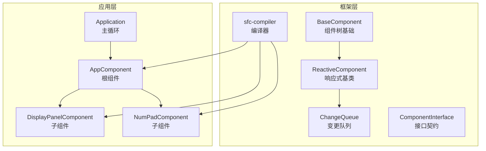
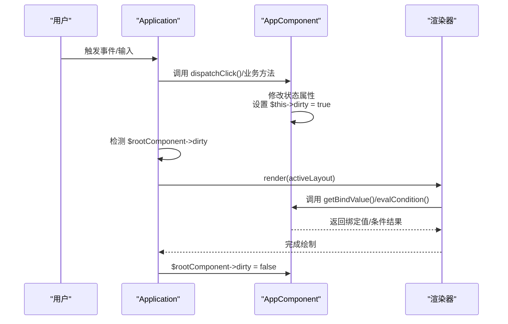
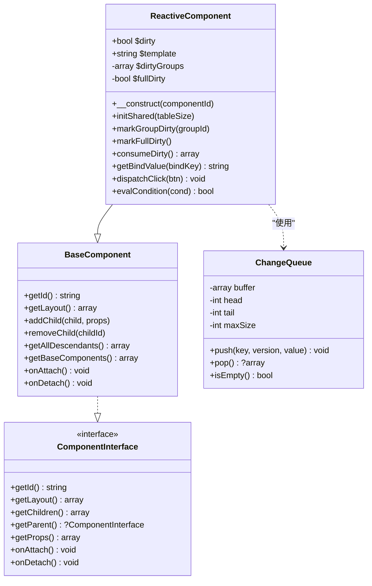
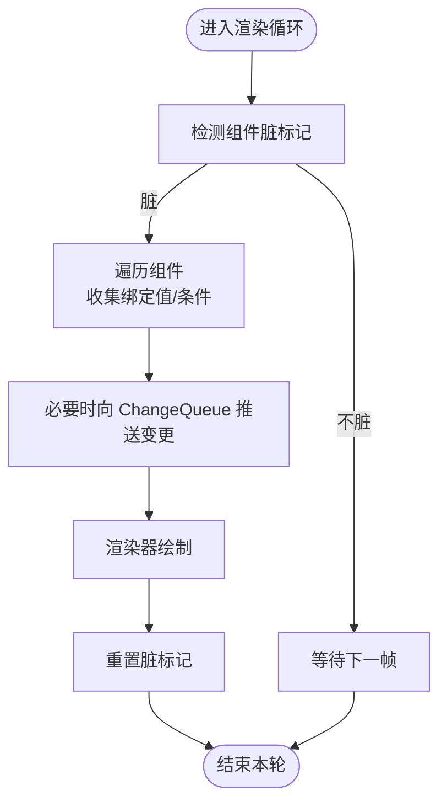
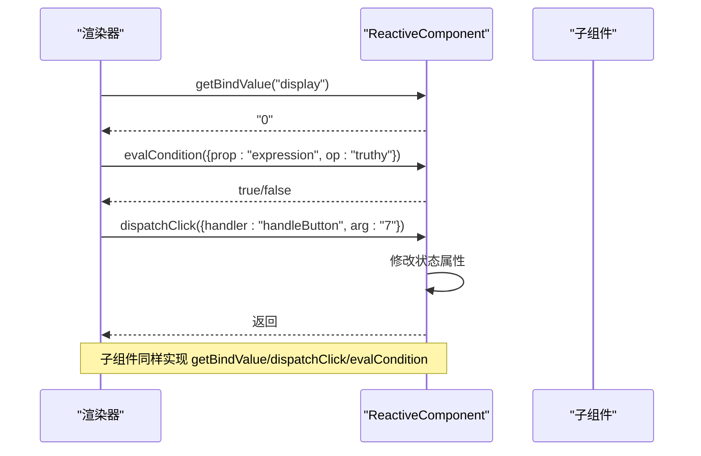
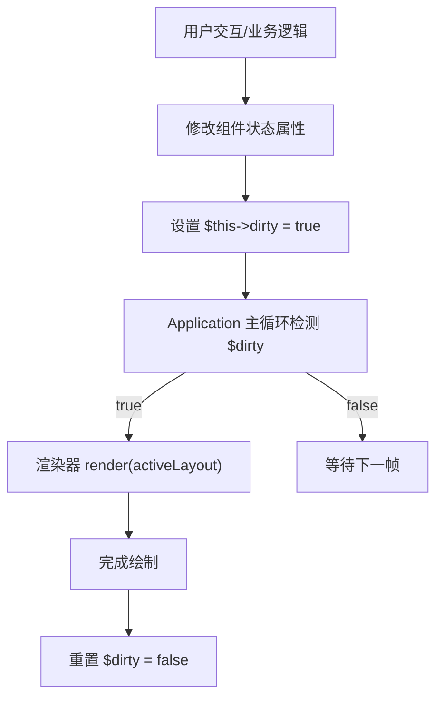
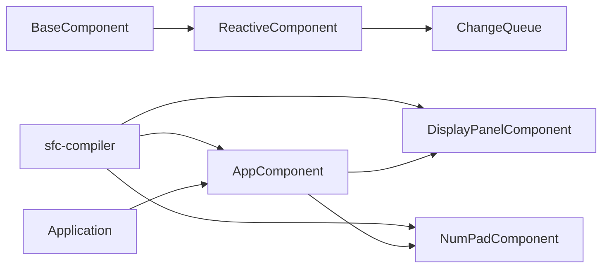

# 响应式组件机制

<cite>
**本文引用的文件**
- [ReactiveComponent.php](file://framework/ReactiveComponent.php)
- [ChangeQueue.php](file://framework/ChangeQueue.php)
- [BaseComponent.php](file://framework/BaseComponent.php)
- [ComponentInterface.php](file://framework/interfaces/ComponentInterface.php)
- [sfc-compiler.php](file://framework/sfc-compiler.php)
- [AppComponent.php](file://apps/calculator/gen/AppComponent.php)
- [DisplayPanelComponent.php](file://apps/calculator/gen/DisplayPanelComponent.php)
- [NumPadComponent.php](file://apps/calculator/gen/NumPadComponent.php)
- [Application.php](file://apps/calculator/Application.php)
- [VueCalc技术文档_v1.html](file://docs/VueCalc技术文档_v1.html)
- [vue-dialog-overlay-pattern.md](file://docs/vue-dialog-overlay-pattern.md)
- [architecture-roadmap.html](file://docs/architecture-roadmap.html)
</cite>

## 目录
1. [简介](#简介)
2. [项目结构](#项目结构)
3. [核心组件](#核心组件)
4. [架构总览](#架构总览)
5. [详细组件分析](#详细组件分析)
6. [依赖关系分析](#依赖关系分析)
7. [性能考量](#性能考量)
8. [故障排查指南](#故障排查指南)
9. [结论](#结论)
10. [附录](#附录)

## 简介
本文面向希望深入理解 VueCalc 响应式组件机制的开发者，系统阐述 ReactiveComponent 基类的实现原理，包括：
- 脏标记机制的工作流程与状态变更传播
- 变更队列（ChangeQueue）的设计与作用
- 自动重绘触发条件与性能优化策略
- 响应式数据绑定的实现方式（属性监听、事件触发、UI 更新）
- 在组件中使用响应式特性的实践范式与注意事项
- 性能、内存与常见问题的调试方法

## 项目结构
响应式系统位于框架层，配合 SFC 编译器生成组件代码，应用层驱动渲染循环。核心文件与职责如下：
- 框架层
  - ReactiveComponent：响应式组件基类，提供脏标记与分组级脏追踪
  - ChangeQueue：环形缓冲变更队列，承载增量通知
  - BaseComponent：组件树与生命周期的基础实现
  - ComponentInterface：组件接口契约
  - sfc-compiler：将 .vue 单文件组件编译为 PHP 组件类，注入 getBindValue/dispatchClick/evalCondition 等方法
- 应用层
  - 生成的组件类（如 AppComponent、DisplayPanelComponent、NumPadComponent）体现响应式状态与渲染逻辑
  - Application：主循环负责检测脏标记并触发渲染

**图表来源**
- [ReactiveComponent.php:14-90](file://framework/ReactiveComponent.php#L14-L90)
- [ChangeQueue.php:11-57](file://framework/ChangeQueue.php#L11-L57)
- [BaseComponent.php:16-177](file://framework/BaseComponent.php#L16-L177)
- [ComponentInterface.php:13-52](file://framework/interfaces/ComponentInterface.php#L13-L52)
- [sfc-compiler.php:1-200](file://framework/sfc-compiler.php#L1-L200)
- [AppComponent.php:11-787](file://apps/calculator/gen/AppComponent.php#L11-L787)
- [DisplayPanelComponent.php:11-84](file://apps/calculator/gen/DisplayPanelComponent.php#L11-L84)
- [NumPadComponent.php:11-338](file://apps/calculator/gen/NumPadComponent.php#L11-L338)
- [Application.php:250-287](file://apps/calculator/Application.php#L250-L287)

**章节来源**
- [ReactiveComponent.php:14-90](file://framework/ReactiveComponent.php#L14-L90)
- [ChangeQueue.php:11-57](file://framework/ChangeQueue.php#L11-L57)
- [BaseComponent.php:16-177](file://framework/BaseComponent.php#L16-L177)
- [ComponentInterface.php:13-52](file://framework/interfaces/ComponentInterface.php#L13-L52)
- [sfc-compiler.php:1-200](file://framework/sfc-compiler.php#L1-L200)
- [AppComponent.php:11-787](file://apps/calculator/gen/AppComponent.php#L11-L787)
- [DisplayPanelComponent.php:11-84](file://apps/calculator/gen/DisplayPanelComponent.php#L11-L84)
- [NumPadComponent.php:11-338](file://apps/calculator/gen/NumPadComponent.php#L11-L338)
- [Application.php:250-287](file://apps/calculator/Application.php#L250-L287)

## 核心组件
- ReactiveComponent
  - 提供脏标记 $dirty、分组级脏标记 $dirtyGroups、全量脏标记 $fullDirty
  - 提供 markGroupDirty/markFullDirty/consumeDirty 等 API
  - 通过 initShared 初始化共享的 ChangeQueue
  - 子类需实现 getBindValue/dispatchClick/evalCondition 三个抽象方法
- ChangeQueue
  - 环形缓冲实现，支持 push/pop/isEmpty
  - 用于承载组件状态变更，供渲染循环消费
- BaseComponent
  - 组件树管理：父子引用、子组件集合、属性配置
  - 生命周期钩子：onAttach/onDetach
  - 工具方法：获取后代、初始组件树等
- ComponentInterface
  - 组件接口契约，约束 getLayout/getChildren/getParent/getProps 等方法
- SFC 编译器
  - 从 .vue 文件生成 PHP 组件类，注入 getBindValue/dispatchClick/evalCondition
  - 生成 registerChildren/getBaseComponents 等方法
- 生成的组件类
  - 如 AppComponent：声明业务状态属性，修改后手动设置 $this->dirty = true
  - 实现 getBindValue/dispatchClick/evalCondition，读取状态或分发事件
- Application
  - 主循环检测 $rootComponent->dirty，调用渲染器 render，最后重置 $dirty

**章节来源**
- [ReactiveComponent.php:14-90](file://framework/ReactiveComponent.php#L14-L90)
- [ChangeQueue.php:11-57](file://framework/ChangeQueue.php#L11-L57)
- [BaseComponent.php:16-177](file://framework/BaseComponent.php#L16-L177)
- [ComponentInterface.php:13-52](file://framework/interfaces/ComponentInterface.php#L13-L52)
- [sfc-compiler.php:371-698](file://framework/sfc-compiler.php#L371-L698)
- [AppComponent.php:11-787](file://apps/calculator/gen/AppComponent.php#L11-L787)
- [Application.php:250-287](file://apps/calculator/Application.php#L250-L287)

## 架构总览
响应式系统采用“手动脏标记 + 分组级增量”的设计，避免 AOT 不支持的魔术方法，同时通过编译器注入方法，保证渲染循环以最小代价感知状态变化。

**图表来源**
- [Application.php:250-287](file://apps/calculator/Application.php#L250-L287)
- [AppComponent.php:11-787](file://apps/calculator/gen/AppComponent.php#L11-L787)
- [ReactiveComponent.php:66-90](file://framework/ReactiveComponent.php#L66-L90)

## 详细组件分析

### ReactiveComponent 类分析
- 设计要点
  - 去除 __get/__set 魔术方法，改为直接属性 + 手动脏标记，确保 AOT 兼容
  - 支持分组级脏追踪（$dirtyGroups）与全量脏标记（$fullDirty），便于按组增量渲染
  - initShared 构造全局变更队列（ChangeQueue），为后续增量渲染预留
- 关键方法
  - markGroupDirty：标记指定 group 为脏，同时设置 $dirty
  - markFullDirty：标记全量脏，触发全量重绘
  - consumeDirty：消费脏状态，返回 full 与 groups 标志，供渲染器按需处理
  - 三个抽象方法：getBindValue/dispatchClick/evalCondition，由编译器注入具体实现

**图表来源**
- [ReactiveComponent.php:14-90](file://framework/ReactiveComponent.php#L14-L90)
- [BaseComponent.php:16-177](file://framework/BaseComponent.php#L16-L177)
- [ComponentInterface.php:13-52](file://framework/interfaces/ComponentInterface.php#L13-L52)
- [ChangeQueue.php:11-57](file://framework/ChangeQueue.php#L11-L57)

**章节来源**
- [ReactiveComponent.php:14-90](file://framework/ReactiveComponent.php#L14-L90)

### ChangeQueue 设计与作用
- 环形缓冲实现，固定最大容量（默认 4096），支持 push/pop/isEmpty
- 用于承载组件状态变更，供渲染循环消费
- 为 v5 M4 的“按组增量渲染”提供基础设施；当前生成代码尚未调用 push，但已预留

**图表来源**
- [ChangeQueue.php:11-57](file://framework/ChangeQueue.php#L11-L57)
- [ReactiveComponent.php:16-64](file://framework/ReactiveComponent.php#L16-L64)

**章节来源**
- [ChangeQueue.php:11-57](file://framework/ChangeQueue.php#L11-L57)

### 响应式数据绑定与事件分发
- 绑定读取：getBindValue(bindKey) 返回对应状态字符串，供渲染器绑定文本/属性
- 事件分发：dispatchClick(btn) 根据按钮 handler 分发到组件方法（如 reset/backspace/handleButton/calculate）
- 条件渲染：evalCondition(cond) 支持 truthy/falsy/==/!= 等条件判断，结合 v-if 的 group_id 过滤

**图表来源**
- [ReactiveComponent.php:66-90](file://framework/ReactiveComponent.php#L66-L90)
- [sfc-compiler.php:371-698](file://framework/sfc-compiler.php#L371-L698)
- [AppComponent.php:711-779](file://apps/calculator/gen/AppComponent.php#L711-L779)
- [DisplayPanelComponent.php:62-78](file://apps/calculator/gen/DisplayPanelComponent.php#L62-L78)
- [NumPadComponent.php:306-332](file://apps/calculator/gen/NumPadComponent.php#L306-L332)

**章节来源**
- [sfc-compiler.php:371-698](file://framework/sfc-compiler.php#L371-L698)
- [AppComponent.php:711-779](file://apps/calculator/gen/AppComponent.php#L711-L779)
- [DisplayPanelComponent.php:62-78](file://apps/calculator/gen/DisplayPanelComponent.php#L62-L78)
- [NumPadComponent.php:306-332](file://apps/calculator/gen/NumPadComponent.php#L306-L332)

### 自动重绘触发条件与渲染循环
- 触发条件：Application 主循环检测 $rootComponent->dirty
- 渲染流程：调用渲染器 render(activeLayout)，随后重置 $dirty
- 生成的组件在状态变更后手动设置 $this->dirty = true，确保下一轮循环触发重绘

**图表来源**
- [Application.php:250-287](file://apps/calculator/Application.php#L250-L287)
- [AppComponent.php:41-160](file://apps/calculator/gen/AppComponent.php#L41-L160)

**章节来源**
- [Application.php:250-287](file://apps/calculator/Application.php#L250-L287)
- [AppComponent.php:41-160](file://apps/calculator/gen/AppComponent.php#L41-L160)

### 组件使用范式与最佳实践
- 在组件中声明业务状态属性（如 display/expression/operator/newInput 等）
- 修改状态后务必设置 $this->dirty = true，确保渲染循环感知变化
- 事件处理方法中根据按钮参数进行分支处理，最终统一设置 $this->dirty = true
- 条件渲染通过 evalCondition 结合 v-if 条件，避免不必要的元素遍历

**章节来源**
- [AppComponent.php:41-160](file://apps/calculator/gen/AppComponent.php#L41-L160)
- [sfc-compiler.php:371-698](file://framework/sfc-compiler.php#L371-L698)

## 依赖关系分析
- ReactiveComponent 依赖 BaseComponent（继承）与 ChangeQueue（实例化）
- 生成的组件类（如 AppComponent）继承 ReactiveComponent，并由 sfc-compiler 注入 getBindValue/dispatchClick/evalCondition
- Application 依赖生成的组件类，驱动渲染循环

**图表来源**
- [BaseComponent.php:16-177](file://framework/BaseComponent.php#L16-L177)
- [ReactiveComponent.php:14-90](file://framework/ReactiveComponent.php#L14-L90)
- [ChangeQueue.php:11-57](file://framework/ChangeQueue.php#L11-L57)
- [sfc-compiler.php:1-200](file://framework/sfc-compiler.php#L1-L200)
- [AppComponent.php:11-787](file://apps/calculator/gen/AppComponent.php#L11-L787)
- [DisplayPanelComponent.php:11-84](file://apps/calculator/gen/DisplayPanelComponent.php#L11-L84)
- [NumPadComponent.php:11-338](file://apps/calculator/gen/NumPadComponent.php#L11-L338)
- [Application.php:250-287](file://apps/calculator/Application.php#L250-L287)

**章节来源**
- [BaseComponent.php:16-177](file://framework/BaseComponent.php#L16-L177)
- [ReactiveComponent.php:14-90](file://framework/ReactiveComponent.php#L14-L90)
- [ChangeQueue.php:11-57](file://framework/ChangeQueue.php#L11-L57)
- [sfc-compiler.php:1-200](file://framework/sfc-compiler.php#L1-L200)
- [AppComponent.php:11-787](file://apps/calculator/gen/AppComponent.php#L11-L787)
- [DisplayPanelComponent.php:11-84](file://apps/calculator/gen/DisplayPanelComponent.php#L11-L84)
- [NumPadComponent.php:11-338](file://apps/calculator/gen/NumPadComponent.php#L11-L338)
- [Application.php:250-287](file://apps/calculator/Application.php#L250-L287)

## 性能考量
- 脏标记驱动的按需重绘：仅在数据变化时重绘，空闲时 CPU 几乎为零
- 分组级脏追踪：支持按 group_id 精细化控制重绘范围，避免全量遍历
- 环形缓冲变更队列：为未来增量渲染预留，降低渲染成本
- 文档建议与限制
  - 避免使用魔术方法（如 __get/__set），改用手动脏标记
  - 避免 json_encode/json_decode（AOT 运行时环境可能不支持）
  - 避免 str_contains（PHP 8.0 函数），改用 strpos
  - 静态属性类型与空值检查：ChangeQueue $queue 声明为可空，避免运行时错误

**章节来源**
- [VueCalc技术文档_v1.html:504-523](file://docs/VueCalc技术文档_v1.html#L504-L523)
- [vue-dialog-overlay-pattern.md:635-680](file://docs/vue-dialog-overlay-pattern.md#L635-L680)
- [architecture-roadmap.html:1115-1134](file://docs/architecture-roadmap.html#L1115-L1134)

## 故障排查指南
- 症状：点击无效或状态未更新
  - 检查是否在事件处理方法末尾设置 $this->dirty = true
  - 确认 dispatchClick 分发逻辑与按钮 handler 名称一致
- 症状：条件渲染不生效
  - 检查 evalCondition 条件表达式与 v-if prop/op/value 是否匹配
  - 确认条件判断逻辑与组件状态一致
- 症状：渲染卡顿或帧率下降
  - 检查是否存在频繁的小幅状态抖动导致高频重绘
  - 考虑合并多次状态变更，减少脏标记次数
- 症状：AOT 编译报错或运行时异常
  - 避免使用 __get/__set 魔术方法
  - 确保使用 (array) 或 any() 包裹返回数组，避免类型丢失
  - 避免使用 AOT 不支持的函数（如 str_contains）

**章节来源**
- [AppComponent.php:162-181](file://apps/calculator/gen/AppComponent.php#L162-L181)
- [sfc-compiler.php:371-698](file://framework/sfc-compiler.php#L371-L698)
- [VueCalc技术文档_v1.html:504-523](file://docs/VueCalc技术文档_v1.html#L504-L523)

## 结论
VueCalc 的响应式机制以 ReactiveComponent 为核心，通过手动脏标记与分组级脏追踪，实现了 AOT 兼容且高效的增量渲染。SFC 编译器将模板与脚本转换为可直接使用的组件类，Application 驱动的渲染循环确保 UI 与状态保持一致。遵循本文的最佳实践与故障排查建议，可获得稳定、可维护且高性能的响应式体验。

## 附录
- 术语说明
  - 脏标记：指示组件需要重绘的状态标志
  - 分组级脏追踪：按 group_id 追踪哪些区域需要重绘
  - 增量渲染：仅渲染发生变更的部分，降低 CPU/GPU 压力
- 参考文档
  - [VueCalc技术文档_v1.html](file://docs/VueCalc技术文档_v1.html)
  - [vue-dialog-overlay-pattern.md](file://docs/vue-dialog-overlay-pattern.md)
  - [architecture-roadmap.html](file://docs/architecture-roadmap.html)