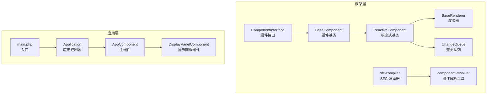
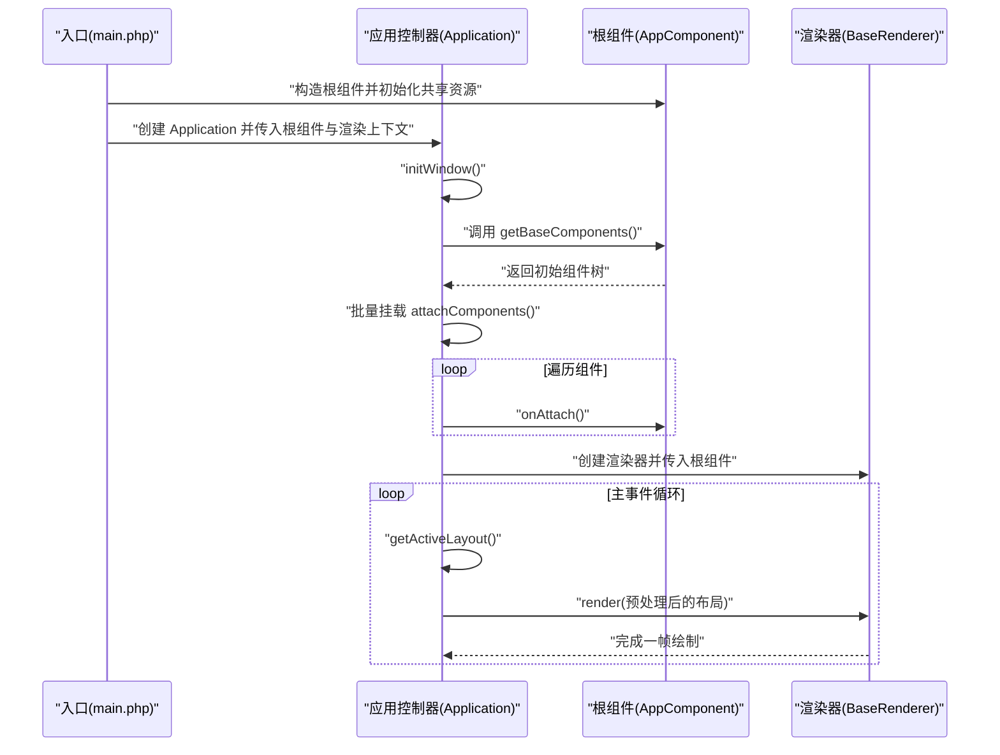
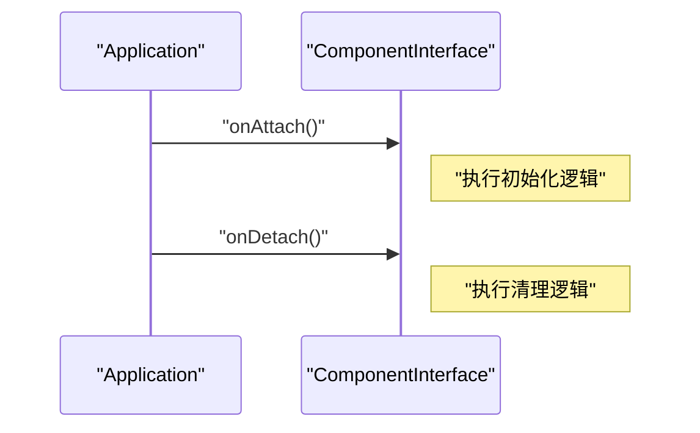
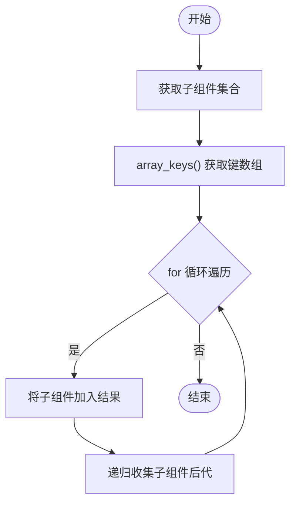
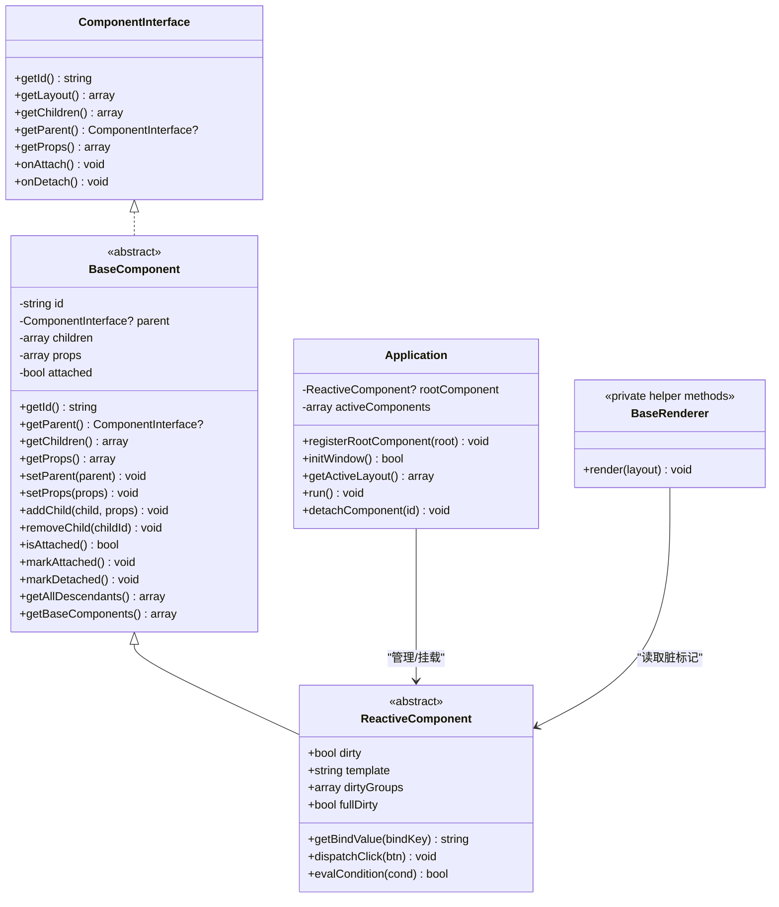

# 组件基类设计

<cite>
**本文引用的文件**
- [framework/BaseComponent.php](file://framework/BaseComponent.php)
- [framework/interfaces/ComponentInterface.php](file://framework/interfaces/ComponentInterface.php)
- [framework/ReactiveComponent.php](file://framework/ReactiveComponent.php)
- [framework/BaseRenderer.php](file://framework/BaseRenderer.php)
- [framework/ChangeQueue.php](file://framework/ChangeQueue.php)
- [apps/calculator/Application.php](file://apps/calculator/Application.php)
- [apps/calculator/gen/AppComponent.php](file://apps/calculator/gen/AppComponent.php)
- [apps/calculator/gen/DisplayPanelComponent.php](file://apps/calculator/gen/DisplayPanelComponent.php)
- [apps/calculator/main.php](file://apps/calculator/main.php)
- [framework/compiler/component-resolver.php](file://framework/compiler/component-resolver.php)
- [framework/sfc-compiler.php](file://framework/sfc-compiler.php)
</cite>

## 目录
1. [引言](#引言)
2. [项目结构](#项目结构)
3. [核心组件](#核心组件)
4. [架构总览](#架构总览)
5. [详细组件分析](#详细组件分析)
6. [依赖分析](#依赖分析)
7. [性能考量](#性能考量)
8. [故障排查指南](#故障排查指南)
9. [结论](#结论)
10. [附录](#附录)

## 引言
本文件围绕组件基类设计展开，系统阐述 BaseComponent 的设计理念与架构原理，重点覆盖：
- 组件树结构与父子关系管理
- 组件属性配置系统与偏移应用
- 生命周期方法 onAttach/onDetach 的作用与调用时机
- 组件挂载状态管理机制
- 组件 ID 生成与唯一性保证
- 组件查找与遍历算法
- 如何继承 BaseComponent 创建自定义组件及实现抽象方法
- AOT 兼容性考虑、性能优化技巧与最佳实践

## 项目结构
该仓库采用“框架层 + 应用层”的分层组织方式。框架层提供组件基类、接口、渲染器与编译工具；应用层以计算器为例，展示组件化架构与运行时交互。

图表来源
- [framework/BaseComponent.php:16-177](file://framework/BaseComponent.php#L16-L177)
- [framework/interfaces/ComponentInterface.php:13-52](file://framework/interfaces/ComponentInterface.php#L13-L52)
- [framework/ReactiveComponent.php:14-90](file://framework/ReactiveComponent.php#L14-L90)
- [framework/BaseRenderer.php:15-197](file://framework/BaseRenderer.php#L15-L197)
- [framework/ChangeQueue.php:11-57](file://framework/ChangeQueue.php#L11-L57)
- [framework/compiler/component-resolver.php:1-62](file://framework/compiler/component-resolver.php#L1-62)
- [framework/sfc-compiler.php:1-200](file://framework/sfc-compiler.php#L1-L200)
- [apps/calculator/Application.php:15-322](file://apps/calculator/Application.php#L15-L322)
- [apps/calculator/main.php:19-48](file://apps/calculator/main.php#L19-L48)
- [apps/calculator/gen/AppComponent.php:11-787](file://apps/calculator/gen/AppComponent.php#L11-L787)
- [apps/calculator/gen/DisplayPanelComponent.php:11-84](file://apps/calculator/gen/DisplayPanelComponent.php#L11-L84)

章节来源
- [framework/BaseComponent.php:16-177](file://framework/BaseComponent.php#L16-L177)
- [framework/interfaces/ComponentInterface.php:13-52](file://framework/interfaces/ComponentInterface.php#L13-L52)
- [apps/calculator/Application.php:15-322](file://apps/calculator/Application.php#L15-L322)
- [apps/calculator/main.php:19-48](file://apps/calculator/main.php#L19-L48)

## 核心组件
本节聚焦 BaseComponent 的职责与关键成员，以及与接口、响应式基类的关系。

- 组件接口 ComponentInterface：定义组件必须实现的核心方法，包括获取 ID、布局、父子关系、属性、生命周期回调等。
- 组件基类 BaseComponent：实现组件树结构与生命周期管理，提供 addChild/removeChild、getAllDescendants、getBaseComponents 等能力，并声明抽象方法 getLayout、onAttach、onDetach。
- 响应式基类 ReactiveComponent：继承 BaseComponent，扩展响应式状态管理（脏标记、分组脏标记、全量脏标记），并声明 getBindValue、dispatchClick、evalCondition 等抽象方法。

章节来源
- [framework/interfaces/ComponentInterface.php:13-52](file://framework/interfaces/ComponentInterface.php#L13-L52)
- [framework/BaseComponent.php:16-177](file://framework/BaseComponent.php#L16-L177)
- [framework/ReactiveComponent.php:14-90](file://framework/ReactiveComponent.php#L14-L90)

## 架构总览
下图展示了组件基类在整体架构中的位置与交互关系，以及应用启动、组件挂载、布局收集与渲染的关键流程。

图表来源
- [apps/calculator/main.php:19-48](file://apps/calculator/main.php#L19-L48)
- [apps/calculator/Application.php:51-132](file://apps/calculator/Application.php#L51-L132)
- [apps/calculator/gen/AppComponent.php:684-701](file://apps/calculator/gen/AppComponent.php#L684-L701)
- [framework/BaseRenderer.php:98-197](file://framework/BaseRenderer.php#L98-L197)

## 详细组件分析

### BaseComponent 设计要点
- 组件树结构
  - 父子引用：通过 setParent 与 getParent 管理父子关系。
  - 子组件集合：children 以 id 为键存储，确保唯一性与快速查找。
- 属性配置系统
  - props 保存偏移与绑定等配置；addChild 支持为子组件设置 props。
  - 应用层通过 Application::collectLayoutRecursive 动态叠加偏移。
- 生命周期管理
  - isAttached/markAttached/markDetached 管理挂载状态。
  - onAttach/onDetach 由 Application 在挂载/卸载时调用。
- 遍历与查找
  - getAllDescendants 使用深度优先遍历，AOT 兼容写法使用 array_keys + for 循环。
  - getBaseComponents 返回包含自身与所有后代的初始组件树，供 Application 初始化挂载。

章节来源
- [framework/BaseComponent.php:16-177](file://framework/BaseComponent.php#L16-L177)
- [apps/calculator/Application.php:82-200](file://apps/calculator/Application.php#L82-L200)

### 生命周期方法 onAttach 与 onDetach
- onAttach：在组件被挂载到活跃列表时调用，适合执行一次性初始化、订阅事件或建立外部连接。
- onDetach：在组件从活跃列表移除时调用，适合释放资源、取消订阅与清理状态。
- 调用时机：Application::attachComponents 与 Application::detachComponent 分别在批量挂载与单个卸载时触发。

图表来源
- [apps/calculator/Application.php:82-103](file://apps/calculator/Application.php#L82-L103)
- [framework/BaseComponent.php:175-176](file://framework/BaseComponent.php#L175-L176)

章节来源
- [apps/calculator/Application.php:82-103](file://apps/calculator/Application.php#L82-L103)
- [framework/BaseComponent.php:175-176](file://framework/BaseComponent.php#L175-L176)

### 组件 ID 生成与唯一性保证
- BaseComponent 构造函数允许显式传入 id；ReactiveComponent 默认使用类名作为 id。
- 子组件注册时使用 child->getId() 作为 children 数组的键，天然保证唯一性。
- 应用层通过 activeComponents[id] 存储活跃组件，同样依赖 id 的唯一性。

章节来源
- [framework/BaseComponent.php:33-36](file://framework/BaseComponent.php#L33-L36)
- [framework/ReactiveComponent.php:31-35](file://framework/ReactiveComponent.php#L31-L35)
- [apps/calculator/Application.php:82-91](file://apps/calculator/Application.php#L82-L91)

### 组件查找与遍历算法
- 深度优先遍历 getAllDescendants：使用 array_keys + for 循环，避免 foreach 在 AOT 下的类型推断问题。
- 初始组件树 getBaseComponents：包含自身与所有后代，便于 Application 一次性挂载。
- 应用层布局收集 collectLayoutRecursive：递归遍历组件树，叠加 props 偏移，生成全局布局数据。

图表来源
- [framework/BaseComponent.php:137-154](file://framework/BaseComponent.php#L137-L154)

章节来源
- [framework/BaseComponent.php:137-154](file://framework/BaseComponent.php#L137-L154)
- [apps/calculator/Application.php:143-200](file://apps/calculator/Application.php#L143-L200)

### 自定义组件继承与实现示例
- 继承关系：自定义组件通常继承 ReactiveComponent（如 DisplayPanelComponent、AppComponent），从而获得响应式能力与基础组件树管理。
- 必须实现的抽象方法：
  - getLayout：返回布局数组（elements/buttons）。
  - onAttach/onDetach：空实现或自定义初始化/清理逻辑。
  - ReactiveComponent 抽象方法：getBindValue、dispatchClick、evalCondition。
- 示例参考：
  - DisplayPanelComponent：实现 getLayout、onAttach、onDetach、getBindValue、dispatchClick、evalCondition，并在构造函数中调用父类构造。
  - AppComponent：实现 getLayout、registerChildren、getBaseComponents、onAttach、onDetach、getBindValue、dispatchClick、evalCondition，并在构造函数中注册子组件。

章节来源
- [apps/calculator/gen/DisplayPanelComponent.php:11-84](file://apps/calculator/gen/DisplayPanelComponent.php#L11-L84)
- [apps/calculator/gen/AppComponent.php:11-787](file://apps/calculator/gen/AppComponent.php#L11-L787)
- [framework/ReactiveComponent.php:66-90](file://framework/ReactiveComponent.php#L66-L90)

### AOT 兼容性考虑
- BaseComponent 与 BaseRenderer 的注释明确标注了 AOT 兼容性要求：
  - 使用 strval() 确保字符串类型
  - 使用 (array) 类型转换保留数组引用
  - 使用 array_keys() + for 循环遍历关联数组，避免 foreach 的类型推断问题
- 编译器侧的组件解析工具 component-resolver 与 sfc-compiler 也遵循相同原则，确保生成的组件代码在 AOT 环境中稳定运行。

章节来源
- [framework/BaseComponent.php:11-15](file://framework/BaseComponent.php#L11-L15)
- [framework/BaseRenderer.php:11-14](file://framework/BaseRenderer.php#L11-L14)
- [framework/compiler/component-resolver.php:1-62](file://framework/compiler/component-resolver.php#L1-L62)
- [framework/sfc-compiler.php:16-25](file://framework/sfc-compiler.php#L16-L25)

### 性能优化技巧与最佳实践
- 遍历优化：始终使用 array_keys + for 循环替代 foreach 遍历关联数组，减少类型推断开销。
- 布局收集：在 Application::collectLayoutRecursive 中按需叠加偏移，避免重复计算；尽量保持布局数据结构简单。
- 脏标记驱动渲染：ReactiveComponent 使用 dirty/fullDirty/dirtyGroups 控制渲染粒度，仅在状态变更时重绘。
- 变更队列：ChangeQueue 采用环形缓冲，降低频繁分配带来的 GC 压力。
- 组件树规模控制：合理拆分组件，避免过深的嵌套层级，提升 getAllDescendants 与 getBaseComponents 的效率。

章节来源
- [framework/BaseRenderer.php:98-197](file://framework/BaseRenderer.php#L98-L197)
- [framework/ReactiveComponent.php:14-90](file://framework/ReactiveComponent.php#L14-L90)
- [framework/ChangeQueue.php:11-57](file://framework/ChangeQueue.php#L11-L57)
- [apps/calculator/Application.php:143-200](file://apps/calculator/Application.php#L143-L200)

## 依赖分析
- 组件接口与基类：ComponentInterface 定义契约，BaseComponent 实现通用逻辑，ReactiveComponent 在其基础上增加响应式能力。
- 应用控制器：Application 负责组件树的挂载、卸载、布局收集与渲染调度。
- 渲染器：BaseRenderer 读取布局数据并进行两阶段分层渲染，消费 ReactiveComponent 的脏标记。
- 编译器与解析工具：sfc-compiler 与 component-resolver 负责模板解析、偏移应用与绑定映射，生成符合 AOT 的组件代码。

图表来源
- [framework/interfaces/ComponentInterface.php:13-52](file://framework/interfaces/ComponentInterface.php#L13-L52)
- [framework/BaseComponent.php:16-177](file://framework/BaseComponent.php#L16-L177)
- [framework/ReactiveComponent.php:14-90](file://framework/ReactiveComponent.php#L14-L90)
- [apps/calculator/Application.php:15-322](file://apps/calculator/Application.php#L15-L322)
- [framework/BaseRenderer.php:15-197](file://framework/BaseRenderer.php#L15-L197)

章节来源
- [framework/interfaces/ComponentInterface.php:13-52](file://framework/interfaces/ComponentInterface.php#L13-L52)
- [framework/BaseComponent.php:16-177](file://framework/BaseComponent.php#L16-L177)
- [framework/ReactiveComponent.php:14-90](file://framework/ReactiveComponent.php#L14-L90)
- [apps/calculator/Application.php:15-322](file://apps/calculator/Application.php#L15-L322)
- [framework/BaseRenderer.php:15-197](file://framework/BaseRenderer.php#L15-L197)

## 性能考量
- 遍历与类型安全：AOT 环境下避免 foreach 关联数组的类型推断问题，统一使用 array_keys + for 循环。
- 布局数据结构：保持 elements/buttons 结构扁平且字段精简，减少渲染器判断分支与内存占用。
- 脏标记策略：利用 fullDirty 与 dirtyGroups 精准控制重绘范围，避免全屏重绘。
- 变更队列容量：根据业务更新频率调整 ChangeQueue 的最大容量，平衡内存与吞吐。

## 故障排查指南
- 组件未渲染或点击无效
  - 检查 Application::attachComponents 是否正确调用 onAttach。
  - 确认 getActiveLayout 是否正确叠加偏移，按钮命中测试是否命中。
- 布局错位
  - 检查 props 中的 x/y 偏移是否正确传递至子组件。
  - 确认 collectLayoutRecursive 的叠加顺序与递归深度。
- 渲染异常
  - 检查 BaseRenderer 的 condition 字段类型，确保为数组。
  - 确认 dirty/fullDirty 状态是否被正确消费与重置。
- AOT 编译报错
  - 检查 foreach 关联数组处是否使用 array_keys + for 循环。
  - 确认返回嵌套数组后使用 (array) 类型转换。

章节来源
- [apps/calculator/Application.php:82-200](file://apps/calculator/Application.php#L82-L200)
- [framework/BaseRenderer.php:98-197](file://framework/BaseRenderer.php#L98-L197)
- [framework/ChangeQueue.php:11-57](file://framework/ChangeQueue.php#L11-L57)

## 结论
BaseComponent 通过清晰的接口契约与通用的组件树管理，为上层组件提供了稳定的基座。配合 ReactiveComponent 的响应式能力与 Application 的生命周期管理，实现了从编译到运行的完整链路。遵循 AOT 兼容性约束与性能优化建议，可在桌面 AOT 环境中获得高效、可靠的组件化体验。

## 附录
- 入口与运行流程参考：[apps/calculator/main.php:19-48](file://apps/calculator/main.php#L19-L48)
- 应用控制器与组件树管理：[apps/calculator/Application.php:15-322](file://apps/calculator/Application.php#L15-L322)
- 主组件与子组件示例：[apps/calculator/gen/AppComponent.php:11-787](file://apps/calculator/gen/AppComponent.php#L11-L787)，[apps/calculator/gen/DisplayPanelComponent.php:11-84](file://apps/calculator/gen/DisplayPanelComponent.php#L11-L84)
- 编译器与解析工具：[framework/sfc-compiler.php:1-200](file://framework/sfc-compiler.php#L1-L200)，[framework/compiler/component-resolver.php:1-62](file://framework/compiler/component-resolver.php#L1-L62)