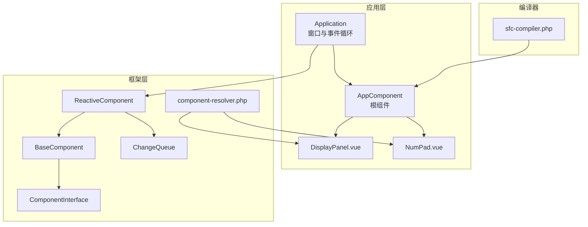
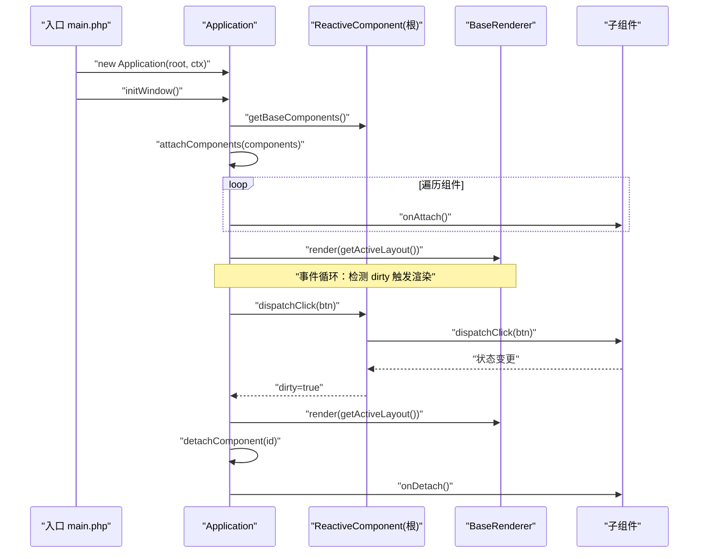
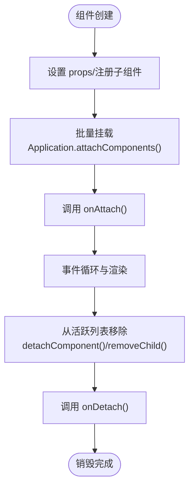
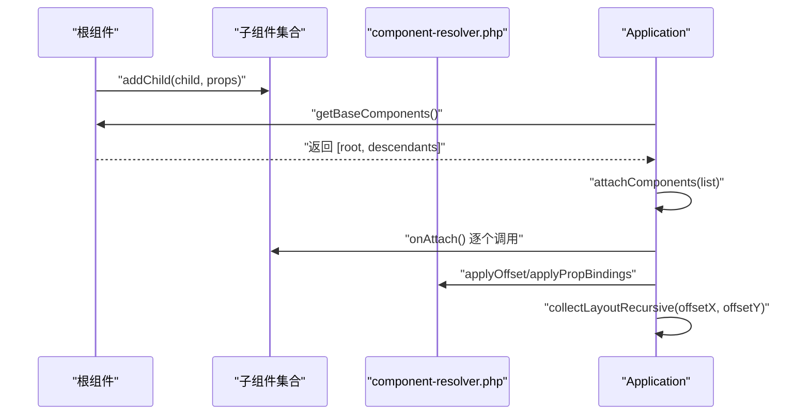
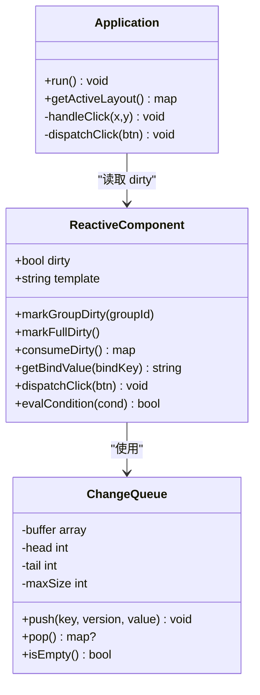
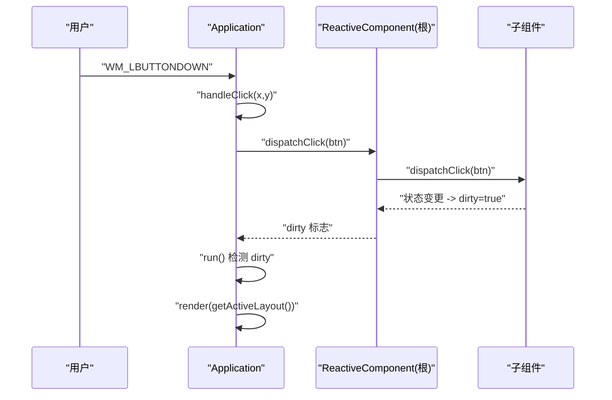
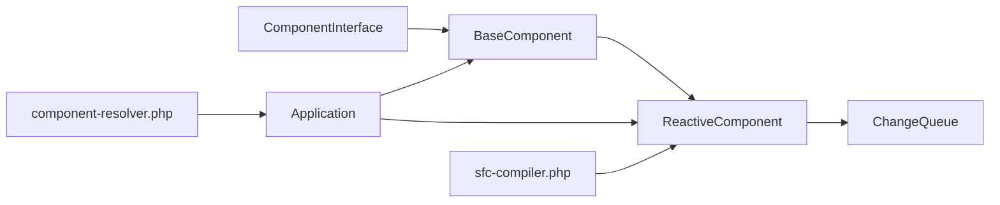

# 组件生命周期管理

<cite>
**本文引用的文件**
- [framework/BaseComponent.php](file://framework/BaseComponent.php)
- [framework/ReactiveComponent.php](file://framework/ReactiveComponent.php)
- [framework/interfaces/ComponentInterface.php](file://framework/interfaces/ComponentInterface.php)
- [framework/ChangeQueue.php](file://framework/ChangeQueue.php)
- [framework/compiler/component-resolver.php](file://framework/compiler/component-resolver.php)
- [framework/sfc-compiler.php](file://framework/sfc-compiler.php)
- [apps/calculator/Application.php](file://apps/calculator/Application.php)
- [apps/calculator/App.vue](file://apps/calculator/App.vue)
- [apps/calculator/components/DisplayPanel.vue](file://apps/calculator/components/DisplayPanel.vue)
- [apps/calculator/components/NumPad.vue](file://apps/calculator/components/NumPad.vue)
- [apps/calculator/main.php](file://apps/calculator/main.php)
- [docs/vue-dialog-overlay-pattern.md](file://docs/vue-dialog-overlay-pattern.md)
</cite>

## 目录
1. [引言](#引言)
2. [项目结构](#项目结构)
3. [核心组件](#核心组件)
4. [架构总览](#架构总览)
5. [详细组件分析](#详细组件分析)
6. [依赖分析](#依赖分析)
7. [性能考虑](#性能考虑)
8. [故障排查指南](#故障排查指南)
9. [结论](#结论)
10. [附录](#附录)

## 引言
本文件围绕组件生命周期管理进行系统化技术说明，聚焦于组件从创建到销毁的完整生命周期：初始化阶段、挂载阶段、运行阶段与销毁阶段。文档基于仓库中的框架与示例应用，梳理生命周期钩子 onAttach/onDetach 的调用时机、组件状态在不同阶段的变化规律，并阐述组件树的生命周期同步机制（父子组件生命周期的协调与依赖关系处理）。同时提供最佳实践、常见陷阱与性能优化建议，帮助开发者在该架构下正确使用生命周期钩子、处理异步与资源清理。

## 项目结构
本项目采用“SFC（单文件组件）+ 编译器 + 运行时”的架构：
- 模板与脚本位于 apps/calculator/*.vue 文件中，通过 sfc-compiler.php 编译为 PHP 组件类。
- 运行时由 Application 控制窗口初始化、事件循环、布局收集与渲染。
- 框架层提供组件基类 BaseComponent、响应式基类 ReactiveComponent 以及接口 ComponentInterface，定义生命周期钩子与状态管理能力。
- 编译器辅助工具 component-resolver.php 负责坐标偏移与属性绑定映射等布局处理。

图表来源
- [apps/calculator/Application.php:15-36](file://apps/calculator/Application.php#L15-L36)
- [framework/BaseComponent.php:16-36](file://framework/BaseComponent.php#L16-L36)
- [framework/ReactiveComponent.php:14-35](file://framework/ReactiveComponent.php#L14-L35)
- [framework/interfaces/ComponentInterface.php:13-52](file://framework/interfaces/ComponentInterface.php#L13-L52)
- [framework/ChangeQueue.php:11-56](file://framework/ChangeQueue.php#L11-L56)
- [framework/compiler/component-resolver.php:13-61](file://framework/compiler/component-resolver.php#L13-L61)
- [framework/sfc-compiler.php:540-581](file://framework/sfc-compiler.php#L540-L581)
- [apps/calculator/App.vue:1-203](file://apps/calculator/App.vue#L1-L203)
- [apps/calculator/components/DisplayPanel.vue:1-12](file://apps/calculator/components/DisplayPanel.vue#L1-L12)
- [apps/calculator/components/NumPad.vue:1-37](file://apps/calculator/components/NumPad.vue#L1-L37)

章节来源
- [apps/calculator/main.php:19-48](file://apps/calculator/main.php#L19-L48)
- [framework/sfc-compiler.php:302-342](file://framework/sfc-compiler.php#L302-L342)

## 核心组件
- ComponentInterface：定义组件必须实现的核心方法，包括生命周期钩子 onAttach/onDetach。
- BaseComponent：提供组件树结构与基础状态（父引用、子列表、props、挂载标志），并提供批量获取后代与初始组件树的能力。
- ReactiveComponent：继承 BaseComponent，增加响应式状态管理（dirty 标志、组级 dirty、全量 dirty、变更队列），并暴露 getBindValue/dispatchClick/evalCondition 等与渲染/交互相关的抽象方法。
- Application：负责窗口初始化、批量挂载/卸载组件、收集布局数据、事件循环与渲染调度。
- ChangeQueue：环形缓冲的变更通知队列，配合 ReactiveComponent 的脏标记驱动增量渲染。
- component-resolver.php：在编译期/运行时对模板节点应用坐标偏移与属性绑定映射，支撑组件树的布局与数据流。

章节来源
- [framework/interfaces/ComponentInterface.php:13-52](file://framework/interfaces/ComponentInterface.php#L13-L52)
- [framework/BaseComponent.php:16-177](file://framework/BaseComponent.php#L16-L177)
- [framework/ReactiveComponent.php:14-90](file://framework/ReactiveComponent.php#L14-L90)
- [apps/calculator/Application.php:15-322](file://apps/calculator/Application.php#L15-L322)
- [framework/ChangeQueue.php:11-56](file://framework/ChangeQueue.php#L11-L56)
- [framework/compiler/component-resolver.php:13-61](file://framework/compiler/component-resolver.php#L13-L61)

## 架构总览
生命周期管理在本架构中的关键路径如下：
- 初始化阶段：编译器生成根组件类，根组件构造时注册子组件；Application 在 initWindow 中调用 getBaseComponents 获取初始组件树并批量 onAttach。
- 运行阶段：Application.run 根据 ReactiveComponent 的 dirty 标志触发渲染；用户交互通过 Application.handleClick 分发到根组件，根组件通过 dispatchClick 调用子组件逻辑，最终可能触发 dirty 标记。
- 销毁阶段：通过 detachComponent 卸载指定组件并触发 onDetach；removeChild 在移除子组件时同样触发 onDetach。

图表来源
- [apps/calculator/main.php:28-44](file://apps/calculator/main.php#L28-L44)
- [apps/calculator/Application.php:51-91](file://apps/calculator/Application.php#L51-L91)
- [framework/sfc-compiler.php:547-561](file://framework/sfc-compiler.php#L547-L561)
- [apps/calculator/App.vue:167-193](file://apps/calculator/App.vue#L167-L193)

## 详细组件分析

### 生命周期钩子 onAttach/onDetach 的职责与调用时机
- onAttach：组件被挂载到活跃列表时调用，适合执行一次性初始化、订阅事件、建立外部资源连接等。Application 在批量挂载组件时逐个调用。
- onDetach：组件从活跃列表移除或被销毁时调用，适合释放资源、取消订阅、清理定时器等。Application 在 detachComponent 或 BaseComponent.removeChild 时触发。

图表来源
- [apps/calculator/Application.php:82-91](file://apps/calculator/Application.php#L82-L91)
- [framework/BaseComponent.php:99-105](file://framework/BaseComponent.php#L99-L105)
- [framework/BaseComponent.php:174-177](file://framework/BaseComponent.php#L174-L177)

章节来源
- [framework/interfaces/ComponentInterface.php:44-51](file://framework/interfaces/ComponentInterface.php#L44-L51)
- [framework/BaseComponent.php:174-177](file://framework/BaseComponent.php#L174-L177)
- [apps/calculator/Application.php:82-103](file://apps/calculator/Application.php#L82-L103)

### 组件树的生命周期同步机制
- 父子组件生命周期协调：Application 在 initWindow 时通过 getBaseComponents 获取包含根组件及其所有后代的初始组件树，然后逐个 onAttach，确保父子层级顺序一致。
- 依赖关系处理：子组件的 props（如 x/y 偏移）在编译期/运行时通过 component-resolver.php 应用到布局节点，保证渲染时的相对坐标与绑定正确。
- 动态可见性：示例中通过 v-if 控制子组件显示，但编译器会将其转换为层（layer）与条件（condition），在运行时通过 Application.getActiveLayout 与点击命中测试共同决定交互范围。

图表来源
- [framework/BaseComponent.php:84-92](file://framework/BaseComponent.php#L84-L92)
- [framework/compiler/component-resolver.php:13-61](file://framework/compiler/component-resolver.php#L13-L61)
- [apps/calculator/Application.php:120-200](file://apps/calculator/Application.php#L120-L200)
- [framework/sfc-compiler.php:547-561](file://framework/sfc-compiler.php#L547-L561)

章节来源
- [framework/BaseComponent.php:162-170](file://framework/BaseComponent.php#L162-L170)
- [framework/compiler/component-resolver.php:13-61](file://framework/compiler/component-resolver.php#L13-L61)
- [apps/calculator/Application.php:120-200](file://apps/calculator/Application.php#L120-L200)

### 响应式状态与渲染驱动
- ReactiveComponent 提供 dirty 标志与组级/全量 dirty 追踪，配合 ChangeQueue 实现增量渲染。
- Application.run 在检测到 dirty 时重新收集布局并调用渲染器 render，随后重置 dirty 标志。
- 示例应用中，切换对话框状态会设置 dirty，从而触发重绘。

图表来源
- [framework/ReactiveComponent.php:14-90](file://framework/ReactiveComponent.php#L14-L90)
- [framework/ChangeQueue.php:11-56](file://framework/ChangeQueue.php#L11-L56)
- [apps/calculator/Application.php:205-263](file://apps/calculator/Application.php#L205-L263)

章节来源
- [framework/ReactiveComponent.php:37-64](file://framework/ReactiveComponent.php#L37-L64)
- [framework/ChangeQueue.php:23-55](file://framework/ChangeQueue.php#L23-L55)
- [apps/calculator/Application.php:248-257](file://apps/calculator/Application.php#L248-L257)
- [apps/calculator/App.vue:188-193](file://apps/calculator/App.vue#L188-L193)

### 交互与状态变更流程
- 用户点击：Application.handleClick 收集按钮布局，按层命中测试后分发到根组件。
- 根组件处理：App.vue 的 handleButton 根据标签路由到具体逻辑（输入、运算、清空等），并在必要时设置 dirty。
- 子组件联动：例如切换对话框状态会设置 dirty，触发重绘。

图表来源
- [apps/calculator/Application.php:223-321](file://apps/calculator/Application.php#L223-L321)
- [apps/calculator/App.vue:167-193](file://apps/calculator/App.vue#L167-L193)

章节来源
- [apps/calculator/Application.php:223-321](file://apps/calculator/Application.php#L223-L321)
- [apps/calculator/App.vue:167-193](file://apps/calculator/App.vue#L167-L193)

### 组件状态在不同阶段的变化规律
- 初始化阶段：组件创建后设置 props、注册子组件；在 Application.initWindow 时进入活跃列表并触发 onAttach。
- 运行阶段：组件状态通过 ReactiveComponent 的脏标记驱动渲染；点击事件可能改变状态并触发重绘。
- 销毁阶段：组件从活跃列表移除或被显式 detach，触发 onDetach；removeChild 同样触发 onDetach。

章节来源
- [framework/BaseComponent.php:84-105](file://framework/BaseComponent.php#L84-L105)
- [apps/calculator/Application.php:82-103](file://apps/calculator/Application.php#L82-L103)
- [framework/ReactiveComponent.php:37-64](file://framework/ReactiveComponent.php#L37-L64)

### 在组件中正确使用生命周期钩子
- onAttach：执行一次性初始化、订阅事件、建立外部资源连接；避免在此处进行昂贵的同步阻塞操作。
- onDetach：释放资源、取消订阅、清理定时器；确保幂等，多次调用不会出错。
- 与脏标记协作：在修改状态后设置 dirty 或组级 dirty，交由 Application.run 驱动渲染。

章节来源
- [framework/interfaces/ComponentInterface.php:44-51](file://framework/interfaces/ComponentInterface.php#L44-L51)
- [framework/ReactiveComponent.php:37-64](file://framework/ReactiveComponent.php#L37-L64)

### 如何处理异步操作与资源清理
- 异步操作：在 onAttach 中启动异步任务（如定时器、网络请求），在 onDetach 中取消或中断。
- 资源清理：确保 onDetach 中释放内存、关闭句柄、注销回调；避免泄漏。
- 渲染节流：利用 ReactiveComponent 的组级 dirty 与全量 dirty，减少不必要的重绘。

章节来源
- [framework/ReactiveComponent.php:42-64](file://framework/ReactiveComponent.php#L42-L64)
- [framework/ChangeQueue.php:23-55](file://framework/ChangeQueue.php#L23-L55)

### 具体代码示例（以路径代替内容）
- 在根组件中设置 dirty 触发重绘：[apps/calculator/App.vue:188-193](file://apps/calculator/App.vue#L188-L193)
- Application 批量挂载组件并调用 onAttach：[apps/calculator/Application.php:82-91](file://apps/calculator/Application.php#L82-L91)
- Application 从活跃列表卸载组件并调用 onDetach：[apps/calculator/Application.php:97-103](file://apps/calculator/Application.php#L97-L103)
- BaseComponent 移除子组件并触发 onDetach：[framework/BaseComponent.php:99-105](file://framework/BaseComponent.php#L99-L105)
- ReactiveComponent 标记组级/全量 dirty 并消费：[framework/ReactiveComponent.php:42-64](file://framework/ReactiveComponent.php#L42-L64)

## 依赖分析
- 组件接口与实现：ComponentInterface 定义契约，BaseComponent/ReactiveComponent 提供实现；ReactiveComponent 依赖 ChangeQueue。
- 运行时控制：Application 依赖 ReactiveComponent 的脏标记与布局收集；通过 component-resolver.php 处理布局偏移与绑定。
- 编译器集成：sfc-compiler.php 生成根组件类并注入 onAttach/onDetach 空实现，同时生成 getBindValue/dispatchClick/evalCondition 的具体逻辑。

图表来源
- [framework/interfaces/ComponentInterface.php:13-52](file://framework/interfaces/ComponentInterface.php#L13-L52)
- [framework/BaseComponent.php:16-36](file://framework/BaseComponent.php#L16-L36)
- [framework/ReactiveComponent.php:14-35](file://framework/ReactiveComponent.php#L14-L35)
- [framework/ChangeQueue.php:11-56](file://framework/ChangeQueue.php#L11-L56)
- [apps/calculator/Application.php:15-36](file://apps/calculator/Application.php#L15-L36)
- [framework/sfc-compiler.php:540-581](file://framework/sfc-compiler.php#L540-L581)
- [framework/compiler/component-resolver.php:13-61](file://framework/compiler/component-resolver.php#L13-L61)

章节来源
- [framework/BaseComponent.php:16-36](file://framework/BaseComponent.php#L16-L36)
- [framework/ReactiveComponent.php:14-35](file://framework/ReactiveComponent.php#L14-L35)
- [apps/calculator/Application.php:15-36](file://apps/calculator/Application.php#L15-L36)
- [framework/sfc-compiler.php:540-581](file://framework/sfc-compiler.php#L540-L581)

## 性能考虑
- 增量渲染：利用 ReactiveComponent 的 dirty 与组级 dirty，避免全量重绘。
- 事件循环节律：Application.run 中使用固定休眠时间维持约 60 FPS，避免过高的 CPU 占用。
- 布局收集优化：collectLayoutRecursive 采用 AOT 友好的数组访问方式，减少开销。
- 组件树扁平化与分层：编译器将子组件内联到根组件布局，减少运行时查找成本。

章节来源
- [framework/ReactiveComponent.php:37-64](file://framework/ReactiveComponent.php#L37-L64)
- [apps/calculator/Application.php:248-263](file://apps/calculator/Application.php#L248-L263)
- [framework/sfc-compiler.php:547-561](file://framework/sfc-compiler.php#L547-L561)

## 故障排查指南
- 挂载失败：检查 Application.initWindow 是否成功创建窗口并调用 attachComponents。
- 未触发渲染：确认 ReactiveComponent.dirty 是否被正确设置；检查 Application.run 中的脏标记检测逻辑。
- 点击无响应：核对 Application.handleClick 的层与条件判断逻辑；确保按钮的 condition 与 layer 正确。
- 资源泄漏：在 onDetach 中检查是否释放了外部资源；确保重复调用幂等。

章节来源
- [apps/calculator/Application.php:51-76](file://apps/calculator/Application.php#L51-L76)
- [apps/calculator/Application.php:248-263](file://apps/calculator/Application.php#L248-L263)
- [apps/calculator/Application.php:269-321](file://apps/calculator/Application.php#L269-L321)
- [framework/BaseComponent.php:99-105](file://framework/BaseComponent.php#L99-L105)

## 结论
本项目通过 ComponentInterface、BaseComponent、ReactiveComponent 与 Application 的协同，实现了清晰的组件生命周期管理：初始化阶段批量挂载并触发 onAttach，运行阶段以脏标记驱动增量渲染，销毁阶段统一通过 onDetach 清理资源。编译器与运行时工具链（component-resolver.php、sfc-compiler.php）保障了组件树的布局与数据流一致性。遵循本文的最佳实践与注意事项，可在保证性能的同时，构建稳定可靠的组件生命周期体系。

## 附录
- 生命周期演进参考：当前版本具备 dirty 追踪与 onAttach/onDetach，未来版本将引入激活/停用与跨平台标准化钩子。

章节来源
- [docs/vue-dialog-overlay-pattern.md:1353-1366](file://docs/vue-dialog-overlay-pattern.md#L1353-L1366)