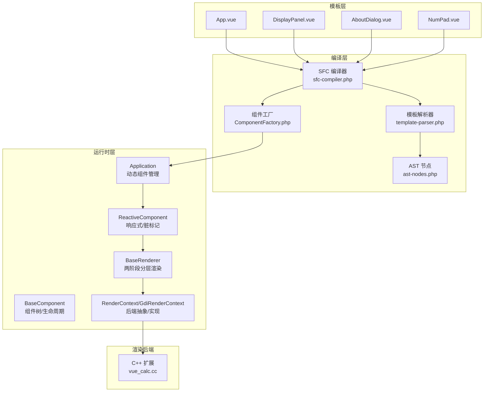
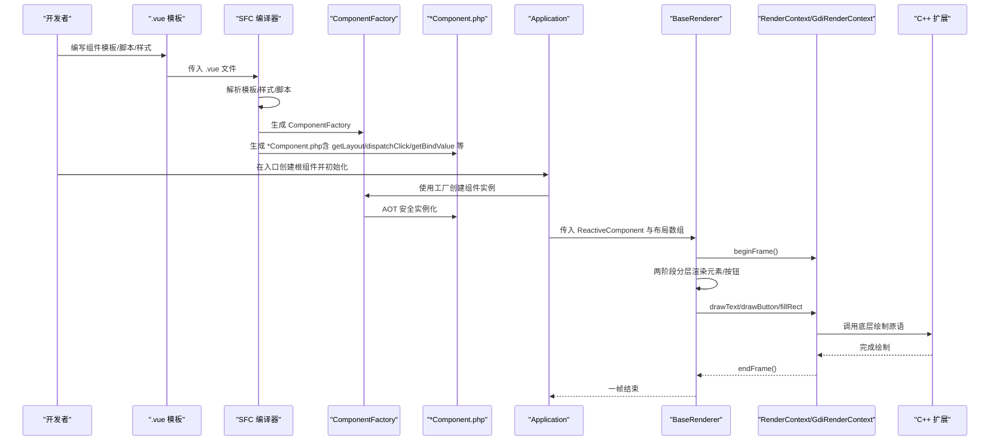
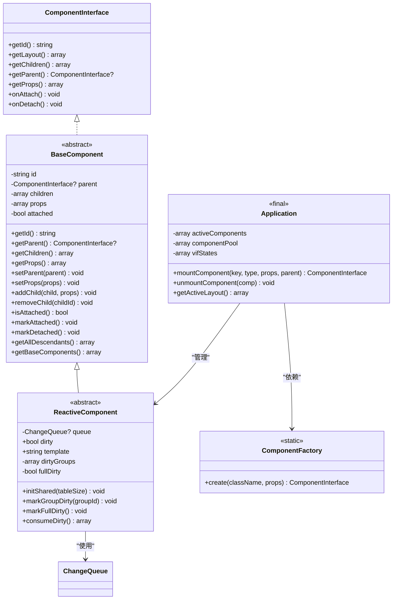
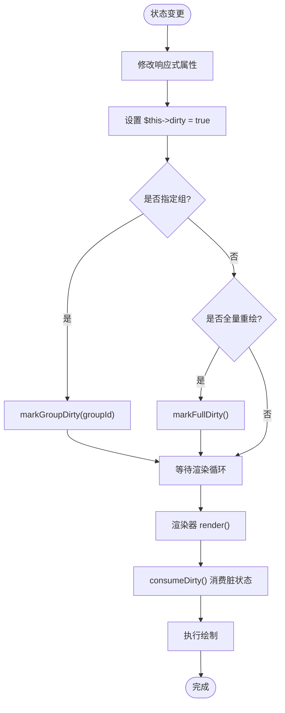
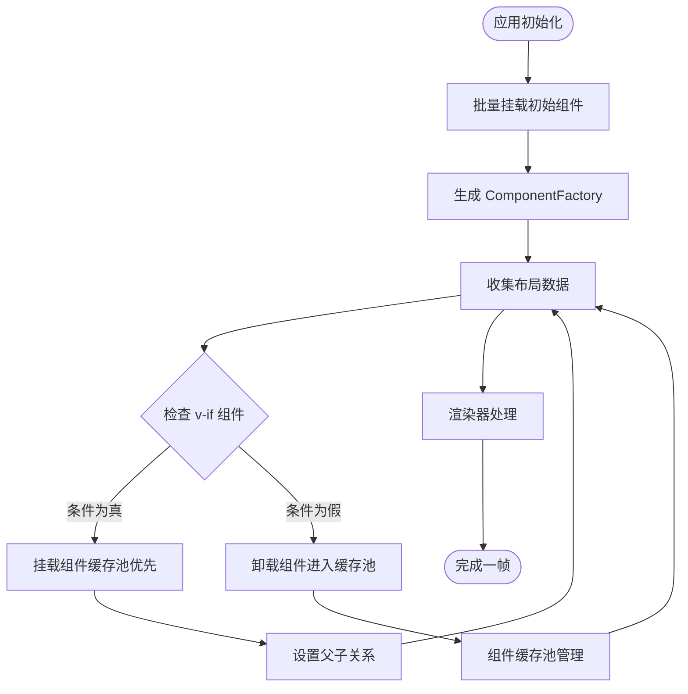
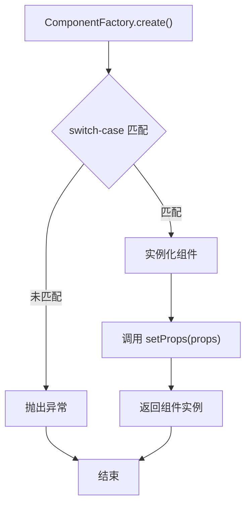
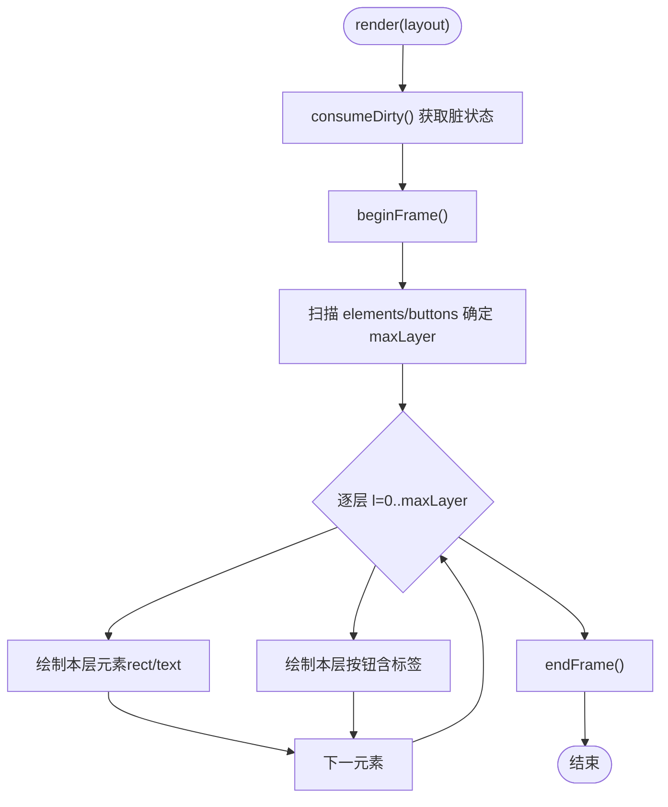
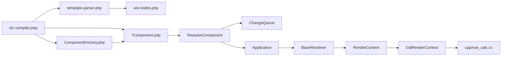

# 组件系统详解

<cite>
**本文引用的文件**
- [framework/BaseComponent.php](file://framework/BaseComponent.php)
- [framework/ReactiveComponent.php](file://framework/ReactiveComponent.php)
- [framework/interfaces/ComponentInterface.php](file://framework/interfaces/ComponentInterface.php)
- [framework/ChangeQueue.php](file://framework/ChangeQueue.php)
- [framework/BaseRenderer.php](file://framework/BaseRenderer.php)
- [framework/rendering/RenderContext.php](file://framework/rendering/RenderContext.php)
- [framework/rendering/GdiRenderContext.php](file://framework/rendering/GdiRenderContext.php)
- [framework/compiler/template-parser.php](file://framework/compiler/template-parser.php)
- [framework/compiler/ast-nodes.php](file://framework/compiler/ast-nodes.php)
- [framework/sfc-compiler.php](file://framework/sfc-compiler.php)
- [framework/Application.php](file://framework/Application.php)
- [apps/calculator/App.vue](file://apps/calculator/App.vue)
- [apps/calculator/components/DisplayPanel.vue](file://apps/calculator/components/DisplayPanel.vue)
- [apps/calculator/components/AboutDialog.vue](file://apps/calculator/components/AboutDialog.vue)
- [apps/calculator/components/NumPad.vue](file://apps/calculator/components/NumPad.vue)
- [apps/calculator/main.php](file://apps/calculator/main.php)
- [apps/calculator/gen/ComponentFactory.php](file://apps/calculator/gen/ComponentFactory.php)
- [cpp/vue_calc.cc](file://cpp/vue_calc.cc)
</cite>

## 更新摘要
**变更内容**
- 新增 ComponentFactory 工厂模式，替代动态 new 实现 AOT 安全的组件实例化
- 引入 v-if 动态渲染支持，实现条件挂载/卸载和组件缓存池
- 增强组件生命周期管理，支持 onAttach/onDetach 钩子
- 更新应用控制器，支持动态组件树管理和状态追踪
- 改进模板解析器，支持结构化 v-if 条件解析

## 目录
1. [简介](#简介)
2. [项目结构](#项目结构)
3. [核心组件](#核心组件)
4. [架构总览](#架构总览)
5. [详细组件分析](#详细组件分析)
6. [依赖关系分析](#依赖关系分析)
7. [性能考量](#性能考量)
8. [故障排查指南](#故障排查指南)
9. [结论](#结论)
10. [附录](#附录)

## 简介
本文件面向希望基于 VueCalc 组件系统构建复杂桌面应用的开发者，系统性阐述组件基类设计、组件树结构、生命周期管理、状态与响应式机制、渲染管线以及组件间通信模式。文档同时给出最佳实践、性能优化建议与常见问题解决方案，并以图示与路径引用的方式帮助读者快速定位到源码实现。

**更新** 本版本重点介绍了组件系统的重大架构升级，包括新的 ComponentFactory 工厂模式、v-if 动态渲染支持、增强的组件生命周期管理等新特性。

## 项目结构
VueCalc 采用"单文件组件（SFC）+ 编译器 + AOT + 渲染后端"的分层架构：
- 模板层：.vue 文件定义组件的结构与行为（<template>/<script>/<style>）
- 编译层：SFC 编译器将 .vue 转换为 PHP 组件类，生成布局数组与自动注入的响应式方法
- 运行时层：组件继承基类，参与组件树管理；渲染器按布局数组进行两阶段分层渲染
- 渲染后端：Win32 GDI 抽象，通过 C++ 扩展桥接到系统绘制原语

**图表来源**
- [framework/sfc-compiler.php:820-865](file://framework/sfc-compiler.php#L820-L865)
- [framework/Application.php:148-151](file://framework/Application.php#L148-L151)
- [framework/compiler/template-parser.php:1-869](file://framework/compiler/template-parser.php#L1-L869)
- [framework/compiler/ast-nodes.php:1-250](file://framework/compiler/ast-nodes.php#L1-L250)
- [framework/BaseComponent.php:1-177](file://framework/BaseComponent.php#L1-L177)
- [framework/ReactiveComponent.php:1-90](file://framework/ReactiveComponent.php#L1-L90)
- [framework/Application.php:1-400](file://framework/Application.php#L1-L400)
- [framework/BaseRenderer.php:1-197](file://framework/BaseRenderer.php#L1-L197)
- [framework/rendering/RenderContext.php:1-30](file://framework/rendering/RenderContext.php#L1-L30)
- [framework/rendering/GdiRenderContext.php:1-38](file://framework/rendering/GdiRenderContext.php#L1-L38)
- [cpp/vue_calc.cc:1-157](file://cpp/vue_calc.cc#L1-L157)

**章节来源**
- [framework/sfc-compiler.php:820-865](file://framework/sfc-compiler.php#L820-L865)
- [framework/Application.php:148-151](file://framework/Application.php#L148-L151)
- [framework/compiler/template-parser.php:1-869](file://framework/compiler/template-parser.php#L1-L869)
- [framework/compiler/ast-nodes.php:1-250](file://framework/compiler/ast-nodes.php#L1-L250)
- [framework/BaseComponent.php:1-177](file://framework/BaseComponent.php#L1-L177)
- [framework/ReactiveComponent.php:1-90](file://framework/ReactiveComponent.php#L1-L90)
- [framework/Application.php:1-400](file://framework/Application.php#L1-L400)
- [framework/BaseRenderer.php:1-197](file://framework/BaseRenderer.php#L1-L197)
- [framework/rendering/RenderContext.php:1-30](file://framework/rendering/RenderContext.php#L1-L30)
- [framework/rendering/GdiRenderContext.php:1-38](file://framework/rendering/GdiRenderContext.php#L1-L38)
- [cpp/vue_calc.cc:1-157](file://cpp/vue_calc.cc#L1-L157)

## 核心组件
- 组件接口与基类
  - ComponentInterface：定义组件必须实现的统一接口，包括获取布局、子组件、父组件、生命周期回调等
  - BaseComponent：提供组件树结构与生命周期管理的基础实现，支持 addChild/removeChild/getAllDescendants/getBaseComponents 等
- 响应式组件
  - ReactiveComponent：在 BaseComponent 基础上引入响应式状态管理，包含脏标记、组级脏标记、全量脏标记、变更队列共享等
- 应用控制器与工厂模式
  - Application：新增 v-if 动态组件管理，支持组件缓存池、状态追踪和条件挂载/卸载
  - ComponentFactory：新的工厂类，使用 switch-case 替代动态 new 实现 AOT 安全的组件实例化
- 渲染器与后端
  - BaseRenderer：两阶段分层渲染，先确定最高活跃层，再逐层绘制元素与按钮，支持条件渲染与分组
  - RenderContext/GdiRenderContext：后端无关抽象与 Win32 GDI 实现，封装 beginFrame/endFrame/fillRect/drawText/drawButton 等原语
- 变更队列
  - ChangeQueue：环形缓冲队列，用于收集与消费变更，支持版本号与字符串化值存储

**章节来源**
- [framework/interfaces/ComponentInterface.php:1-52](file://framework/interfaces/ComponentInterface.php#L1-L52)
- [framework/BaseComponent.php:1-177](file://framework/BaseComponent.php#L1-L177)
- [framework/ReactiveComponent.php:1-90](file://framework/ReactiveComponent.php#L1-L90)
- [framework/Application.php:1-400](file://framework/Application.php#L1-L400)
- [apps/calculator/gen/ComponentFactory.php:1-42](file://apps/calculator/gen/ComponentFactory.php#L1-L42)
- [framework/BaseRenderer.php:1-197](file://framework/BaseRenderer.php#L1-L197)
- [framework/rendering/RenderContext.php:1-30](file://framework/rendering/RenderContext.php#L1-L30)
- [framework/rendering/GdiRenderContext.php:1-38](file://framework/rendering/GdiRenderContext.php#L1-L38)
- [framework/ChangeQueue.php:1-57](file://framework/ChangeQueue.php#L1-L57)

## 架构总览
下图展示了从 .vue 到最终渲染的关键流程：模板解析、组件解析与合并、布局数组生成、响应式方法注入、渲染调度与绘制。

**图表来源**
- [framework/sfc-compiler.php:820-865](file://framework/sfc-compiler.php#L820-L865)
- [framework/Application.php:148-151](file://framework/Application.php#L148-L151)
- [framework/compiler/template-parser.php:1-869](file://framework/compiler/template-parser.php#L1-L869)
- [framework/BaseRenderer.php:98-197](file://framework/BaseRenderer.php#L98-L197)
- [framework/rendering/GdiRenderContext.php:1-38](file://framework/rendering/GdiRenderContext.php#L1-L38)
- [cpp/vue_calc.cc:90-157](file://cpp/vue_calc.cc#L90-L157)

**章节来源**
- [framework/sfc-compiler.php:820-865](file://framework/sfc-compiler.php#L820-L865)
- [framework/Application.php:148-151](file://framework/Application.php#L148-L151)
- [framework/compiler/template-parser.php:1-869](file://framework/compiler/template-parser.php#L1-L869)
- [framework/BaseRenderer.php:1-197](file://framework/BaseRenderer.php#L1-L197)
- [framework/rendering/GdiRenderContext.php:1-38](file://framework/rendering/GdiRenderContext.php#L1-L38)
- [cpp/vue_calc.cc:1-157](file://cpp/vue_calc.cc#L1-L157)

## 详细组件分析

### 组件基类与组件树
- 设计要点
  - 组件树：通过父指针与子映射维护层级关系，支持深度优先遍历与后代收集
  - 生命周期：onAttach/onDetach 由应用在挂载/卸载时触发，便于资源申请与释放
  - 属性配置：props 用于子组件偏移与运行时配置
- 关键方法
  - addChild/removeChild：建立/解除父子关系并设置 parent 与 props
  - getAllDescendants/getBaseComponents：用于应用初始化时一次性挂载整棵组件树
- AOT 兼容性
  - 遍历关联数组使用 array_keys + for 循环，避免类型推断问题

**图表来源**
- [framework/interfaces/ComponentInterface.php:1-52](file://framework/interfaces/ComponentInterface.php#L1-L52)
- [framework/BaseComponent.php:1-177](file://framework/BaseComponent.php#L1-L177)
- [framework/ReactiveComponent.php:1-90](file://framework/ReactiveComponent.php#L1-L90)
- [framework/Application.php:1-400](file://framework/Application.php#L1-L400)
- [apps/calculator/gen/ComponentFactory.php:1-42](file://apps/calculator/gen/ComponentFactory.php#L1-L42)
- [framework/ChangeQueue.php:1-57](file://framework/ChangeQueue.php#L1-L57)

**章节来源**
- [framework/BaseComponent.php:1-177](file://framework/BaseComponent.php#L1-L177)
- [framework/interfaces/ComponentInterface.php:1-52](file://framework/interfaces/ComponentInterface.php#L1-L52)

### 响应式组件与脏标记机制
- 脏标记
  - dirty：是否需要重绘
  - dirtyGroups：按组追踪脏区域，支持局部重绘
  - fullDirty：全量重绘标志，覆盖所有组
  - consumeDirty：渲染后消费脏状态并重置
- 自动注入
  - 编译器在脚本分析阶段自动注入 $this->dirty = true，减少手动标记遗漏
- 变更队列
  - ChangeQueue 以环形缓冲存储变更项，支持版本号与字符串化值，便于渲染循环消费

**图表来源**
- [framework/ReactiveComponent.php:37-64](file://framework/ReactiveComponent.php#L37-L64)
- [framework/ChangeQueue.php:24-49](file://framework/ChangeQueue.php#L24-L49)
- [framework/BaseRenderer.php:100-101](file://framework/BaseRenderer.php#L100-L101)

**章节来源**
- [framework/ReactiveComponent.php:1-90](file://framework/ReactiveComponent.php#L1-L90)
- [framework/ChangeQueue.php:1-57](file://framework/ChangeQueue.php#L1-L57)
- [framework/sfc-compiler.php:366-369](file://framework/sfc-compiler.php#L366-L369)

### 应用控制器与动态组件管理
- 动态组件管理
  - 组件缓存池：支持最多 10 个实例缓存，提高组件复用效率
  - v-if 状态追踪：记录每个动态组件的条件状态，支持条件挂载/卸载
  - 组件生命周期：通过 onAttach/onDetach 钩子管理资源分配与释放
- 工厂模式集成
  - 使用 ComponentFactory 替代动态 new，实现 AOT 安全的组件实例化
  - 支持结构化组件属性传递和父子关系建立
- 布局收集优化
  - 递归收集布局数据时动态应用偏移，支持嵌套组件的相对定位

**图表来源**
- [framework/Application.php:63-72](file://framework/Application.php#L63-L72)
- [framework/Application.php:94-115](file://framework/Application.php#L94-L115)
- [framework/Application.php:121-139](file://framework/Application.php#L121-L139)
- [framework/Application.php:181-266](file://framework/Application.php#L181-L266)

**章节来源**
- [framework/Application.php:1-400](file://framework/Application.php#L1-L400)
- [apps/calculator/gen/ComponentFactory.php:1-42](file://apps/calculator/gen/ComponentFactory.php#L1-L42)

### 组件工厂模式与 AOT 安全
- 工厂模式设计
  - 自动生成：编译器扫描 gen/ 目录下的所有组件类，自动生成工厂方法
  - AOT 安全：使用 switch-case 替代动态 new，确保编译期绑定
  - 组件属性：自动注入 setProps 方法，支持运行时属性传递
- 实例化流程
  - 缓存优先：优先从组件池取出实例，减少内存分配
  - 属性设置：自动调用 setProps 设置组件偏移和配置
  - 错误处理：未找到的组件类抛出 RuntimeException

**图表来源**
- [apps/calculator/gen/ComponentFactory.php:18-41](file://apps/calculator/gen/ComponentFactory.php#L18-L41)

**章节来源**
- [apps/calculator/gen/ComponentFactory.php:1-42](file://apps/calculator/gen/ComponentFactory.php#L1-L42)
- [framework/sfc-compiler.php:820-865](file://framework/sfc-compiler.php#L820-L865)

### 渲染器与两阶段分层渲染
- 分层策略
  - 第一阶段：扫描元素与按钮，确定最高活跃层 maxLayer
  - 第二阶段：按层从低到高依次绘制，保证遮挡关系正确
- 条件渲染
  - 支持 v-if 条件，条件表达式由 evalCondition 解析并求值
- 文本与按钮绘制
  - 文本支持对齐（左/右/居中）、容器宽度与动态字号
  - 按钮支持背景色、前景色与边框，标签文本居中绘制

**图表来源**
- [framework/BaseRenderer.php:98-197](file://framework/BaseRenderer.php#L98-L197)

**章节来源**
- [framework/BaseRenderer.php:1-197](file://framework/BaseRenderer.php#L1-L197)

### 组件接口与实现
- 接口契约
  - 组件必须实现 getId/getLayout/getChildren/getParent/getProps/onAttach/onDetach
- 响应式接口
  - getBindValue：根据绑定键返回渲染值
  - dispatchClick：根据按钮处理器分发点击事件
  - evalCondition：解析并求值 v-if 条件表达式

**章节来源**
- [framework/interfaces/ComponentInterface.php:1-52](file://framework/interfaces/ComponentInterface.php#L1-L52)
- [framework/ReactiveComponent.php:66-90](file://framework/ReactiveComponent.php#L66-L90)

### 组件间通信与数据传递
- 子组件注册
  - 根组件在构造时通过 registerChildren() 注册子组件，传入偏移属性（x/y）
  - getBaseComponents() 返回包含自身与所有后代的初始组件树，供应用一次性挂载
- 组件解析与合并
  - 编译器解析 <app> 根节点，识别 rect/text/grid/btn 等内置元素
  - 支持自定义组件引用（如 <display-panel>），在编译期解析并内联其布局，同时传播 v-if 与叠加层
- 数据绑定与事件
  - 文本元素通过 :bind 或 v-model 绑定到组件属性
  - 按钮通过 @click 绑定到组件方法，编译器自动生成 dispatchClick 分发逻辑
- v-if 动态渲染
  - 支持结构化条件数组，包括 truthy/falsy/==/!= 等操作符
  - 条件满足时挂载组件，不满足时卸载并缓存到组件池

**章节来源**
- [framework/sfc-compiler.php:453-492](file://framework/sfc-compiler.php#L453-L492)
- [framework/compiler/template-parser.php:490-543](file://framework/compiler/template-parser.php#L490-L543)
- [framework/compiler/template-parser.php:557-686](file://framework/compiler/template-parser.php#L557-L686)
- [framework/compiler/template-parser.php:848-864](file://framework/compiler/template-parser.php#L848-L864)
- [apps/calculator/App.vue:1-203](file://apps/calculator/App.vue#L1-L203)
- [apps/calculator/components/DisplayPanel.vue:1-12](file://apps/calculator/components/DisplayPanel.vue#L1-L12)
- [apps/calculator/components/AboutDialog.vue:1-37](file://apps/calculator/components/AboutDialog.vue#L1-L37)
- [apps/calculator/components/NumPad.vue:1-37](file://apps/calculator/components/NumPad.vue#L1-L37)

### 具体示例与最佳实践
- 创建自定义组件
  - 步骤
    1) 编写 .vue 模板（<template>/<style> 必须，<script> 可选）
    2) 使用 SFC 编译器生成 *Component.php 和 ComponentFactory
    3) 在根组件中通过 project.yml 注册并使用
  - 示例路径
    - [apps/calculator/components/DisplayPanel.vue:1-12](file://apps/calculator/components/DisplayPanel.vue#L1-L12)
    - [apps/calculator/components/AboutDialog.vue:1-37](file://apps/calculator/components/AboutDialog.vue#L1-L37)
    - [apps/calculator/components/NumPad.vue:1-37](file://apps/calculator/components/NumPad.vue#L1-L37)
- 处理用户交互
  - 在组件脚本中定义方法（如 handleButton/reset/calculate），编译器自动生成 dispatchClick 分发
  - 示例路径
    - [apps/calculator/App.vue:167-193](file://apps/calculator/App.vue#L167-L193)
- 管理组件状态
  - 修改响应式属性后调用 $this->dirty = true（或由编译器自动注入）
  - 使用 markGroupDirty/markFullDirty 控制局部/全量重绘
  - 示例路径
    - [apps/calculator/App.vue:189-193](file://apps/calculator/App.vue#L189-L193)
    - [framework/ReactiveComponent.php:42-54](file://framework/ReactiveComponent.php#L42-L54)
- 使用 v-if 动态渲染
  - 在模板中使用 v-if 条件控制组件显示/隐藏
  - 支持简单属性检查和比较操作符
  - 示例路径
    - [apps/calculator/App.vue:10](file://apps/calculator/App.vue#L10)
    - [apps/calculator/components/AboutDialog.vue:4](file://apps/calculator/components/AboutDialog.vue#L4)

**章节来源**
- [framework/sfc-compiler.php:366-403](file://framework/sfc-compiler.php#L366-L403)
- [apps/calculator/App.vue:1-203](file://apps/calculator/App.vue#L1-L203)
- [framework/ReactiveComponent.php:1-90](file://framework/ReactiveComponent.php#L1-L90)

## 依赖关系分析
- 组件基类与渲染器
  - ReactiveComponent 依赖 ChangeQueue；BaseRenderer 依赖 ReactiveComponent 与 RenderContext
- 应用控制器与工厂模式
  - Application 依赖 ComponentFactory；ComponentFactory 依赖所有生成的组件类
- 编译器与模板解析
  - SFC 编译器依赖 TemplateParser 与 AST 节点；TemplateParser 依赖 ComponentRegistry
- 渲染后端
  - RenderContext 为抽象，GdiRenderContext 实现具体 Win32 GDI 原语

**图表来源**
- [framework/sfc-compiler.php:820-865](file://framework/sfc-compiler.php#L820-L865)
- [framework/compiler/template-parser.php:1-869](file://framework/compiler/template-parser.php#L1-L869)
- [framework/compiler/ast-nodes.php:1-250](file://framework/compiler/ast-nodes.php#L1-L250)
- [framework/ReactiveComponent.php:1-90](file://framework/ReactiveComponent.php#L1-L90)
- [framework/ChangeQueue.php:1-57](file://framework/ChangeQueue.php#L1-L57)
- [framework/Application.php:148-151](file://framework/Application.php#L148-L151)
- [framework/BaseRenderer.php:1-197](file://framework/BaseRenderer.php#L1-L197)
- [framework/rendering/RenderContext.php:1-30](file://framework/rendering/RenderContext.php#L1-L30)
- [framework/rendering/GdiRenderContext.php:1-38](file://framework/rendering/GdiRenderContext.php#L1-L38)
- [cpp/vue_calc.cc:1-157](file://cpp/vue_calc.cc#L1-L157)

**章节来源**
- [framework/sfc-compiler.php:820-865](file://framework/sfc-compiler.php#L820-L865)
- [framework/compiler/template-parser.php:1-869](file://framework/compiler/template-parser.php#L1-L869)
- [framework/BaseRenderer.php:1-197](file://framework/BaseRenderer.php#L1-L197)

## 性能考量
- 局部重绘
  - 使用组级脏标记（markGroupDirty）与 consumeDirty，避免全屏重绘
- 分层渲染
  - 两阶段分层减少绘制次数与提升可见性顺序正确性
- 组件缓存池
  - v-if 动态组件支持最多 10 个实例缓存，提高组件复用效率
- 工厂模式优化
  - ComponentFactory 使用 switch-case 替代动态 new，实现 AOT 安全的实例化
- 文本动态适配
  - 根据文本长度动态调整字号，避免过长文本导致的绘制开销
- AOT 与编译期优化
  - 编译期计算网格坐标、收集绑定键与处理器映射，降低运行时开销
- 双缓冲与批处理
  - GDI 后端使用双缓冲，减少闪烁与提升吞吐

## 故障排查指南
- 模板解析错误
  - 现象：编译时报错或未知标签被跳过
  - 排查：检查 <app> 根元素、必需属性（width/height）、标签闭合与未知标签
  - 参考路径
    - [framework/compiler/template-parser.php:214-288](file://framework/compiler/template-parser.php#L214-L288)
    - [framework/compiler/template-parser.php:335-488](file://framework/compiler/template-parser.php#L335-L488)
- v-if 条件不生效
  - 现象：元素未按预期显示/隐藏
  - 排查：确认条件字符串格式（prop、!prop、==、!=），确保 evalCondition 能解析
  - 参考路径
    - [framework/compiler/template-parser.php:848-864](file://framework/compiler/template-parser.php#L848-L864)
    - [framework/BaseRenderer.php:118-136](file://framework/BaseRenderer.php#L118-L136)
- 组件实例化失败
  - 现象：运行时抛出 Component not found 异常
  - 排查：确认组件类名正确，检查 ComponentFactory 是否包含对应 case
  - 参考路径
    - [apps/calculator/gen/ComponentFactory.php:36-38](file://apps/calculator/gen/ComponentFactory.php#L36-L38)
- 组件缓存池溢出
  - 现象：组件无法复用或内存占用异常
  - 排查：确认缓存池大小限制（最多 10 个实例），检查 unmountComponent 流程
  - 参考路径
    - [framework/Application.php:131-139](file://framework/Application.php#L131-L139)
- 按钮点击无响应
  - 现象：点击无效
  - 排查：确认 @click 绑定的方法名与参数，检查编译器生成的 dispatchClick
  - 参考路径
    - [framework/sfc-compiler.php:383-403](file://framework/sfc-compiler.php#L383-L403)
- 文本不显示或对齐异常
  - 现象：文本缺失或位置不正确
  - 排查：检查 :bind/v-model、align、容器宽高与字符宽度计算
  - 参考路径
    - [framework/BaseRenderer.php:35-90](file://framework/BaseRenderer.php#L35-L90)
- 渲染黑屏或崩溃
  - 现象：窗口无法正常绘制
  - 排查：确认 RenderContext 实现与 GDI 原语调用顺序，检查 beginFrame/endFrame 配对
  - 参考路径
    - [framework/rendering/GdiRenderContext.php:13-36](file://framework/rendering/GdiRenderContext.php#L13-L36)
    - [cpp/vue_calc.cc:90-157](file://cpp/vue_calc.cc#L90-L157)

**章节来源**
- [framework/compiler/template-parser.php:214-488](file://framework/compiler/template-parser.php#L214-L488)
- [framework/BaseRenderer.php:35-197](file://framework/BaseRenderer.php#L35-L197)
- [framework/sfc-compiler.php:383-403](file://framework/sfc-compiler.php#L383-L403)
- [apps/calculator/gen/ComponentFactory.php:36-38](file://apps/calculator/gen/ComponentFactory.php#L36-L38)
- [framework/Application.php:131-139](file://framework/Application.php#L131-L139)
- [framework/rendering/GdiRenderContext.php:1-38](file://framework/rendering/GdiRenderContext.php#L1-L38)
- [cpp/vue_calc.cc:1-157](file://cpp/vue_calc.cc#L1-L157)

## 结论
VueCalc 组件系统通过清晰的基类设计、严格的接口契约、编译期优化与两阶段分层渲染，实现了高性能、可维护且易于扩展的桌面应用框架。最新的架构升级引入了 ComponentFactory 工厂模式、v-if 动态渲染支持和增强的组件生命周期管理，进一步提升了系统的灵活性和性能。开发者只需专注于 .vue 模板与业务逻辑，其余由编译器与运行时自动处理，从而大幅降低复杂度并提升开发效率。

## 附录
- 入口与应用控制流
  - 应用入口负责创建根组件、初始化渲染上下文与启动事件循环
  - 参考路径
    - [apps/calculator/main.php:19-48](file://apps/calculator/main.php#L19-L48)
- 渲染后端原语
  - GDI 后端封装了双缓冲与基本绘制原语，供渲染上下文调用
  - 参考路径
    - [framework/rendering/GdiRenderContext.php:1-38](file://framework/rendering/GdiRenderContext.php#L1-L38)
    - [cpp/vue_calc.cc:90-157](file://cpp/vue_calc.cc#L90-L157)
- 组件工厂使用示例
  - 通过 ComponentFactory::create() 安全地创建组件实例
  - 支持组件属性传递和父子关系建立
  - 参考路径
    - [apps/calculator/gen/ComponentFactory.php:18-41](file://apps/calculator/gen/ComponentFactory.php#L18-L41)
    - [framework/Application.php:148-151](file://framework/Application.php#L148-L151)