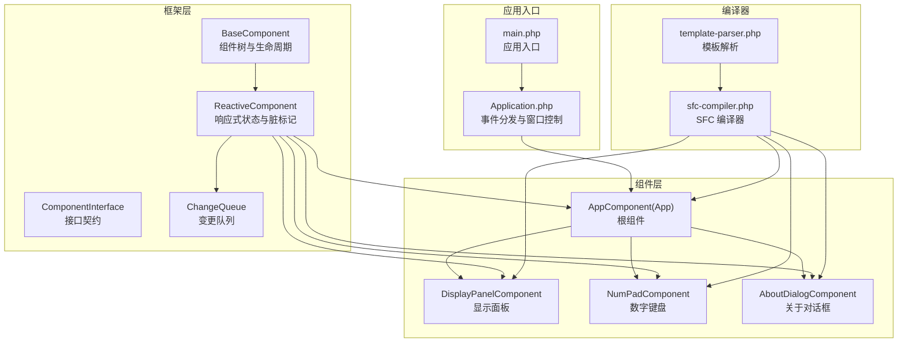
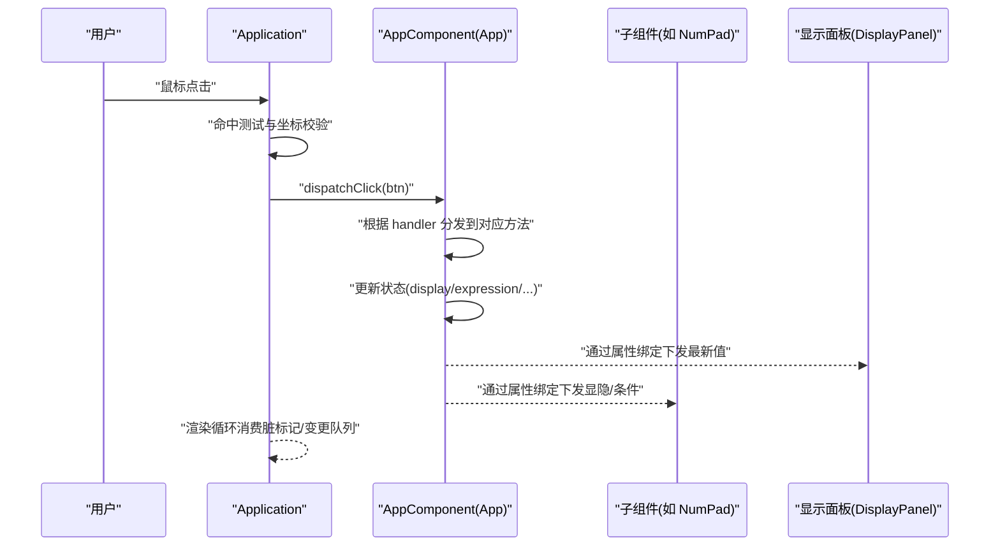
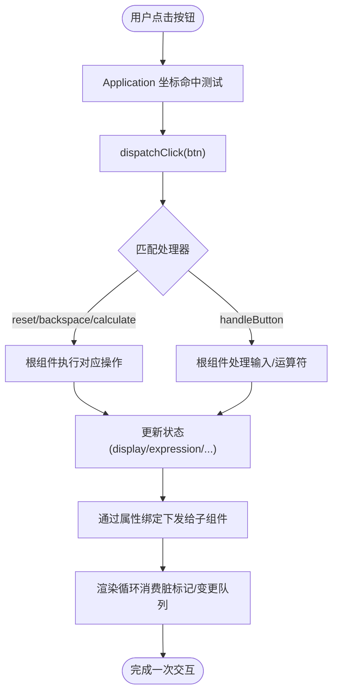
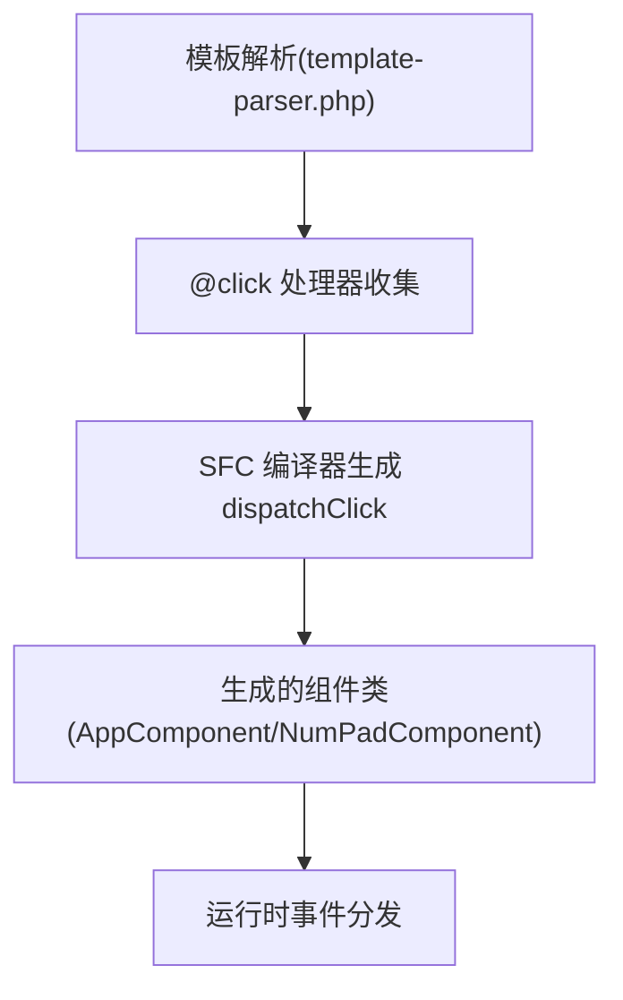
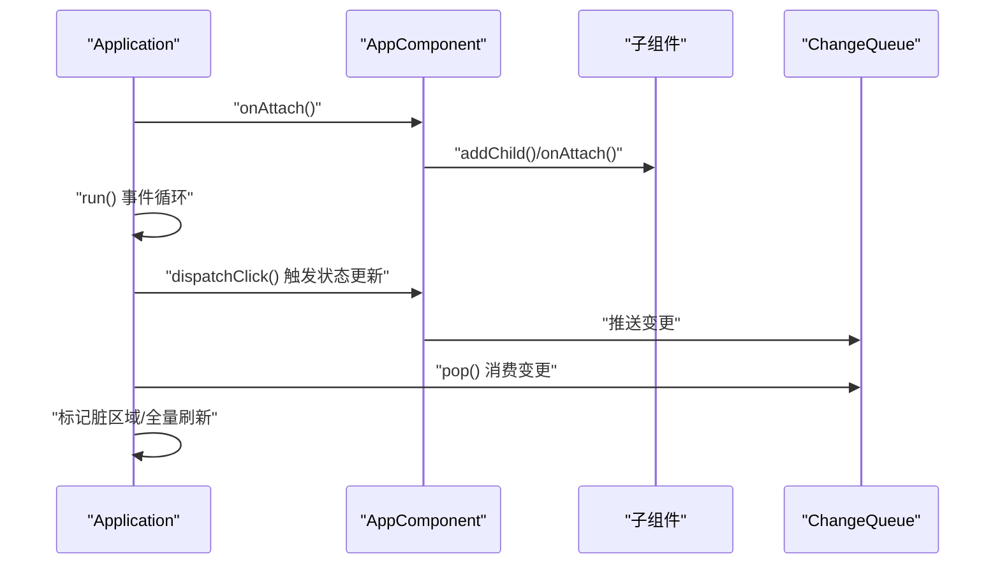
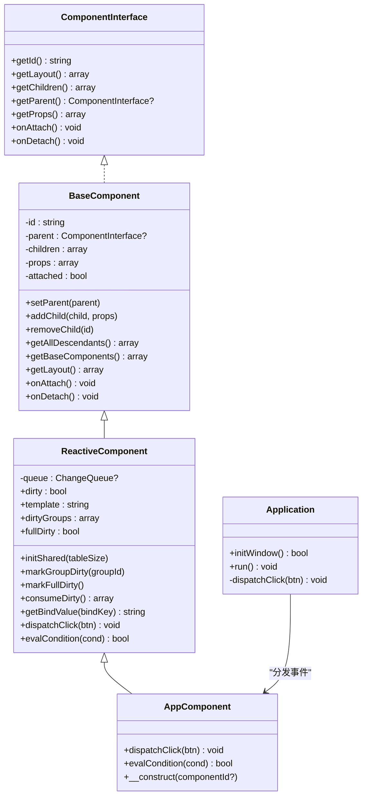

# 组件通信模式

<cite>
**本文引用的文件**
- [apps/calculator/App.vue](file://apps/calculator/App.vue)
- [apps/calculator/components/DisplayPanel.vue](file://apps/calculator/components/DisplayPanel.vue)
- [apps/calculator/components/NumPad.vue](file://apps/calculator/components/NumPad.vue)
- [apps/calculator/components/AboutDialog.vue](file://apps/calculator/components/AboutDialog.vue)
- [apps/calculator/main.php](file://apps/calculator/main.php)
- [apps/calculator/Application.php](file://apps/calculator/Application.php)
- [apps/calculator/gen/AppComponent.php](file://apps/calculator/gen/AppComponent.php)
- [apps/calculator/gen/NumPadComponent.php](file://apps/calculator/gen/NumPadComponent.php)
- [framework/BaseComponent.php](file://framework/BaseComponent.php)
- [framework/ReactiveComponent.php](file://framework/ReactiveComponent.php)
- [framework/interfaces/ComponentInterface.php](file://framework/interfaces/ComponentInterface.php)
- [framework/ChangeQueue.php](file://framework/ChangeQueue.php)
- [framework/sfc-compiler.php](file://framework/sfc-compiler.php)
- [framework/compiler/template-parser.php](file://framework/compiler/template-parser.php)
</cite>

## 目录
1. [引言](#引言)
2. [项目结构](#项目结构)
3. [核心组件](#核心组件)
4. [架构总览](#架构总览)
5. [详细组件分析](#详细组件分析)
6. [依赖关系分析](#依赖关系分析)
7. [性能考量](#性能考量)
8. [故障排查指南](#故障排查指南)
9. [结论](#结论)
10. [附录](#附录)

## 引言
本文件围绕 Vue 计算器项目中的组件通信模式展开，系统梳理父子组件通信、兄弟组件通信与跨层级通信的实现方式，解释 props 向下传递与 events 向上传递的设计原则，并结合项目中自动生成的组件与渲染管线，给出状态共享、松耦合通信、复杂数据流与事件链的处理建议，以及性能优化与调试方法。

## 项目结构
该计算器采用“模板驱动 + 自动代码生成”的架构：前端以 .vue 组件定义视图与交互；构建阶段通过 SFC 编译器将模板解析为 PHP 组件类；运行时由 Application 驱动组件树，处理输入事件并触发状态更新，最终由渲染上下文进行绘制。

图表来源
- [apps/calculator/main.php:19-48](file://apps/calculator/main.php#L19-L48)
- [apps/calculator/Application.php:300-322](file://apps/calculator/Application.php#L300-L322)
- [apps/calculator/gen/AppComponent.php:781-787](file://apps/calculator/gen/AppComponent.php#L781-L787)
- [framework/BaseComponent.php:16-177](file://framework/BaseComponent.php#L16-L177)
- [framework/ReactiveComponent.php:14-90](file://framework/ReactiveComponent.php#L14-L90)
- [framework/interfaces/ComponentInterface.php:13-52](file://framework/interfaces/ComponentInterface.php#L13-L52)
- [framework/ChangeQueue.php:11-57](file://framework/ChangeQueue.php#L11-L57)
- [framework/sfc-compiler.php:382-396](file://framework/sfc-compiler.php#L382-L396)
- [framework/compiler/template-parser.php:466-481](file://framework/compiler/template-parser.php#L466-L481)

章节来源
- [apps/calculator/main.php:19-48](file://apps/calculator/main.php#L19-L48)
- [apps/calculator/Application.php:300-322](file://apps/calculator/Application.php#L300-L322)

## 核心组件
- 根组件 App：集中管理计算器状态（显示值、表达式、操作数、运算符等），并提供输入处理、计算、重置、退格等业务方法。模板中通过属性绑定将状态传递给子组件，同时通过事件处理切换关于弹窗。
- 显示面板 DisplayPanel：接收来自根组件的状态值，负责渲染当前显示值。
- 数字键盘 NumPad：提供按钮网格，将用户点击映射为具体操作（如数字输入、运算符、等号、退格、清屏等），通过事件分发到根组件处理。
- 关于对话框 AboutDialog：作为覆盖层显示，通过状态控制其显隐，关闭时回到主界面。

章节来源
- [apps/calculator/App.vue:27-193](file://apps/calculator/App.vue#L27-L193)
- [apps/calculator/components/DisplayPanel.vue:1-12](file://apps/calculator/components/DisplayPanel.vue#L1-L12)
- [apps/calculator/components/NumPad.vue:1-37](file://apps/calculator/components/NumPad.vue#L1-L37)
- [apps/calculator/components/AboutDialog.vue:1-37](file://apps/calculator/components/AboutDialog.vue#L1-L37)

## 架构总览
组件通信遵循“单向数据流 + 事件向上”的设计原则：
- props 向下传递：根组件将状态以属性形式传给子组件，确保数据来源单一、可追踪。
- events 向上传递：子组件通过事件或统一的 dispatchClick 将用户意图上报至根组件，由根组件集中处理并更新状态，再通过 props 下发给其他组件。
- 自动化事件分发：编译器根据模板中的 @click 属性生成 dispatchClick 分发逻辑，减少手写样板代码，提升一致性与可维护性。

图表来源
- [apps/calculator/Application.php:300-322](file://apps/calculator/Application.php#L300-L322)
- [apps/calculator/gen/AppComponent.php:731-750](file://apps/calculator/gen/AppComponent.php#L731-L750)
- [apps/calculator/App.vue:6-21](file://apps/calculator/App.vue#L6-L21)

## 详细组件分析

### 父子组件通信（props 下行 + 事件上行）
- 数据下行：根组件将 display、expression 等状态以属性形式绑定到子组件，子组件仅读取不修改，保证数据单向流动。
- 事件上行：子组件通过统一的 dispatchClick 接口上报点击事件，根组件集中处理业务逻辑并更新状态，随后通过 props 下发给其他组件。
- 状态隔离：每个组件只持有自身所需的状态片段，避免跨组件直接访问导致的耦合。

图表来源
- [apps/calculator/Application.php:300-322](file://apps/calculator/Application.php#L300-L322)
- [apps/calculator/gen/AppComponent.php:731-750](file://apps/calculator/gen/AppComponent.php#L731-L750)
- [apps/calculator/App.vue:6-21](file://apps/calculator/App.vue#L6-L21)

章节来源
- [apps/calculator/App.vue:6-21](file://apps/calculator/App.vue#L6-L21)
- [apps/calculator/gen/AppComponent.php:731-750](file://apps/calculator/gen/AppComponent.php#L731-L750)
- [apps/calculator/Application.php:300-322](file://apps/calculator/Application.php#L300-L322)

### 兄弟组件通信（通过共同父组件协调）
- 在本项目中，数字键盘与显示面板属于兄弟关系，它们通过共享的父组件状态实现“协同”。例如，数字键盘负责收集输入，父组件统一计算并更新显示面板。
- 若需进一步解耦，可在框架层面引入事件总线或集中式状态容器（见“组件间状态共享”），但当前实现通过 props + 事件即可满足需求。

章节来源
- [apps/calculator/components/NumPad.vue:4-27](file://apps/calculator/components/NumPad.vue#L4-L27)
- [apps/calculator/components/DisplayPanel.vue:4](file://apps/calculator/components/DisplayPanel.vue#L4)

### 跨层级组件通信（根组件集中处理）
- 对话框与主界面之间存在跨层级关系。通过根组件的布尔状态控制对话框显隐，子组件仅负责触发切换，根组件统一管理状态。
- 该模式避免了跨层级直接通信带来的复杂依赖，简化了数据流与事件链。

章节来源
- [apps/calculator/App.vue:188-193](file://apps/calculator/App.vue#L188-L193)
- [apps/calculator/components/AboutDialog.vue:22-24](file://apps/calculator/components/AboutDialog.vue#L22-L24)

### 事件分发与模板编译
- 模板解析：编译器解析模板中的 @click 属性，提取处理器名称与参数，生成 dispatchClick 的分发体。
- 自动生成：基于收集到的处理器信息，编译器自动生成 dispatchClick 的分支逻辑，保证事件分发的一致性与可维护性。

图表来源
- [framework/compiler/template-parser.php:466-481](file://framework/compiler/template-parser.php#L466-L481)
- [framework/sfc-compiler.php:382-396](file://framework/sfc-compiler.php#L382-L396)
- [apps/calculator/gen/AppComponent.php:731-750](file://apps/calculator/gen/AppComponent.php#L731-L750)
- [apps/calculator/gen/NumPadComponent.php:311-327](file://apps/calculator/gen/NumPadComponent.php#L311-L327)

章节来源
- [framework/compiler/template-parser.php:466-481](file://framework/compiler/template-parser.php#L466-L481)
- [framework/sfc-compiler.php:382-396](file://framework/sfc-compiler.php#L382-L396)
- [apps/calculator/gen/AppComponent.php:731-750](file://apps/calculator/gen/AppComponent.php#L731-L750)
- [apps/calculator/gen/NumPadComponent.php:311-327](file://apps/calculator/gen/NumPadComponent.php#L311-L327)

### 组件生命周期与渲染管线
- 生命周期：组件通过 onAttach/onDetach 管理挂载与卸载，配合 Application 的初始化与事件循环，确保渲染顺序与资源释放。
- 渲染循环：ReactiveComponent 维护脏标记与变更队列，Application 在每帧消费队列并触发重绘，保证 UI 与状态同步。

图表来源
- [framework/BaseComponent.php:118-129](file://framework/BaseComponent.php#L118-L129)
- [framework/ReactiveComponent.php:37-64](file://framework/ReactiveComponent.php#L37-L64)
- [framework/ChangeQueue.php:23-55](file://framework/ChangeQueue.php#L23-L55)
- [apps/calculator/Application.php:300-322](file://apps/calculator/Application.php#L300-L322)

章节来源
- [framework/BaseComponent.php:118-129](file://framework/BaseComponent.php#L118-L129)
- [framework/ReactiveComponent.php:37-64](file://framework/ReactiveComponent.php#L37-L64)
- [framework/ChangeQueue.php:23-55](file://framework/ChangeQueue.php#L23-L55)
- [apps/calculator/Application.php:300-322](file://apps/calculator/Application.php#L300-L322)

## 依赖关系分析
- 组件树结构：BaseComponent 提供父子组件管理与后代遍历；ReactiveComponent 在此基础上提供响应式能力与脏标记。
- 接口契约：ComponentInterface 明确组件必须实现的方法，保证不同组件类型的一致行为。
- 事件分发：Application 负责输入事件的坐标命中与分发；根组件接收并处理，再通过 props 下发给子组件。
- 编译器集成：template-parser 与 sfc-compiler 将模板与事件处理器映射到生成的组件类，形成“模板 -> 代码”的闭环。

图表来源
- [framework/interfaces/ComponentInterface.php:13-52](file://framework/interfaces/ComponentInterface.php#L13-L52)
- [framework/BaseComponent.php:16-177](file://framework/BaseComponent.php#L16-L177)
- [framework/ReactiveComponent.php:14-90](file://framework/ReactiveComponent.php#L14-L90)
- [apps/calculator/Application.php:300-322](file://apps/calculator/Application.php#L300-L322)
- [apps/calculator/gen/AppComponent.php:781-787](file://apps/calculator/gen/AppComponent.php#L781-L787)

章节来源
- [framework/interfaces/ComponentInterface.php:13-52](file://framework/interfaces/ComponentInterface.php#L13-L52)
- [framework/BaseComponent.php:16-177](file://framework/BaseComponent.php#L16-L177)
- [framework/ReactiveComponent.php:14-90](file://framework/ReactiveComponent.php#L14-L90)
- [apps/calculator/Application.php:300-322](file://apps/calculator/Application.php#L300-L322)
- [apps/calculator/gen/AppComponent.php:781-787](file://apps/calculator/gen/AppComponent.php#L781-L787)

## 性能考量
- 脏标记与增量渲染：ReactiveComponent 提供脏标记与组级脏标记，Application 在渲染循环中按需重绘，降低全量刷新开销。
- 变更队列：ChangeQueue 采用环形缓冲，限制最大容量，避免频繁分配与内存抖动。
- 事件分发优化：编译器自动生成 dispatchClick 分支，减少运行时反射与判断成本。
- 状态最小化：组件仅持有必要状态，减少 props 传递与渲染压力。

章节来源
- [framework/ReactiveComponent.php:37-64](file://framework/ReactiveComponent.php#L37-L64)
- [framework/ChangeQueue.php:11-57](file://framework/ChangeQueue.php#L11-L57)
- [framework/sfc-compiler.php:382-396](file://framework/sfc-compiler.php#L382-L396)

## 故障排查指南
- 事件未生效
  - 检查模板中 @click 是否正确书写，编译器是否生成对应的处理器映射。
  - 确认 Application 的坐标命中逻辑是否正确，按钮区域是否被遮挡。
- 状态未更新
  - 确认根组件是否实现了对应处理器并更新了状态，随后通过 props 下发。
  - 检查脏标记是否被正确设置与消费。
- 渲染异常
  - 查看变更队列是否溢出或阻塞，适当调整队列大小或刷新频率。
  - 确认 evalCondition 与 getBindValue 的实现是否与模板绑定一致。

章节来源
- [framework/compiler/template-parser.php:466-481](file://framework/compiler/template-parser.php#L466-L481)
- [apps/calculator/Application.php:300-322](file://apps/calculator/Application.php#L300-L322)
- [apps/calculator/gen/AppComponent.php:752-779](file://apps/calculator/gen/AppComponent.php#L752-L779)
- [framework/ChangeQueue.php:23-55](file://framework/ChangeQueue.php#L23-L55)

## 结论
本项目通过“单向数据流 + 事件上行 + 自动事件分发”的组合，实现了清晰、可维护且高性能的组件通信。根组件集中处理状态与业务逻辑，子组件专注渲染与事件上报，跨层级通过布尔状态与覆盖层实现，整体保持低耦合与高内聚。对于更复杂的场景，可在现有框架基础上引入集中式状态容器或事件总线，以进一步增强扩展性与可测试性。

## 附录
- 通信模式选择指南
  - 父子通信：优先使用 props 下行 + 事件上行，保持数据单向流动。
  - 兄弟通信：通过共同父组件协调，避免跨层级直接通信。
  - 跨层级通信：使用布尔状态或覆盖层控制显隐，必要时引入集中式状态管理。
- 松耦合通信实践
  - 使用统一的 dispatchClick 接口，编译器自动生成分发逻辑。
  - 组件仅暴露必要的属性与事件，隐藏内部实现细节。
  - 通过脏标记与变更队列实现增量渲染，避免全量刷新。
- 调试建议
  - 在 Application 中打印命中按钮信息与事件分发路径。
  - 在 ReactiveComponent 中检查脏标记与消费日志，确认渲染循环正常工作。
  - 使用最小化示例复现问题，逐步排除模板、编译与运行时环节。