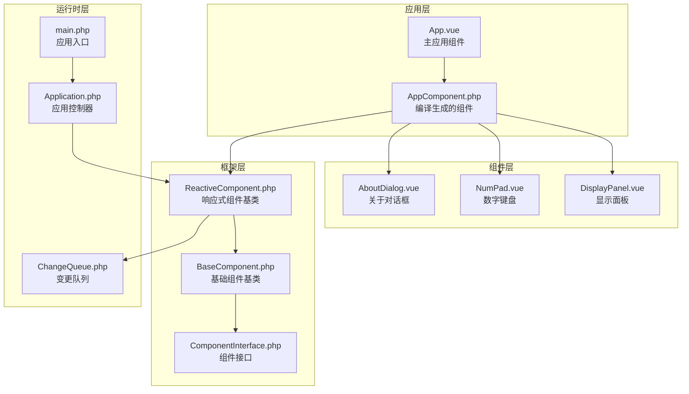
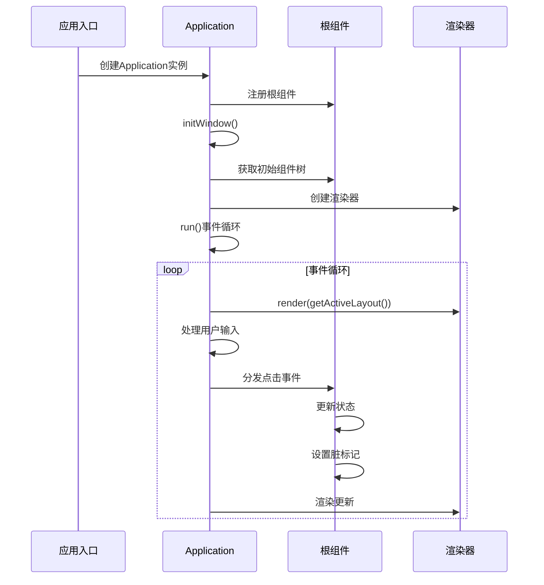
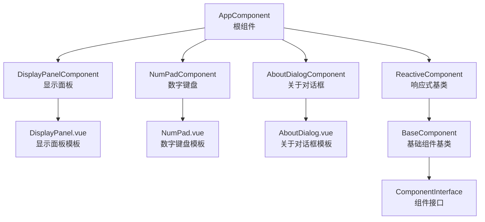
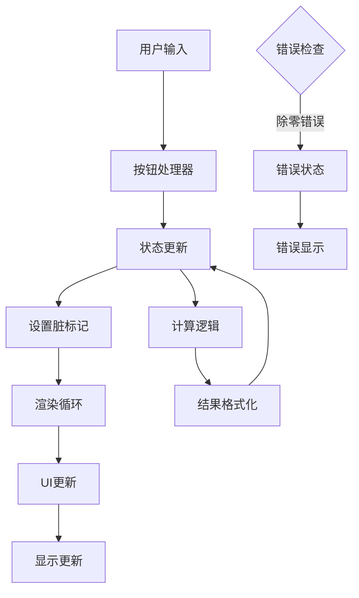
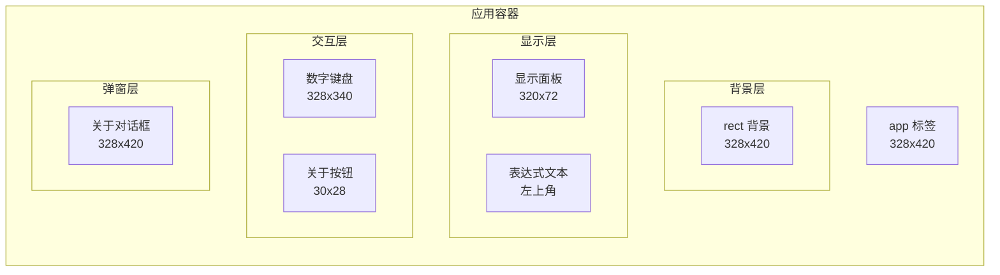
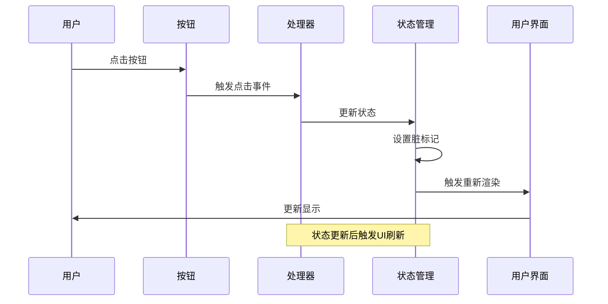
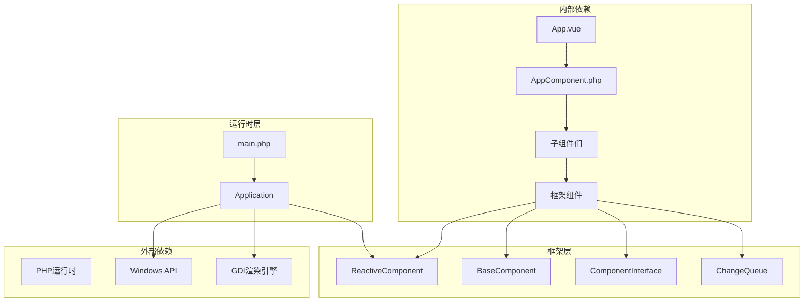
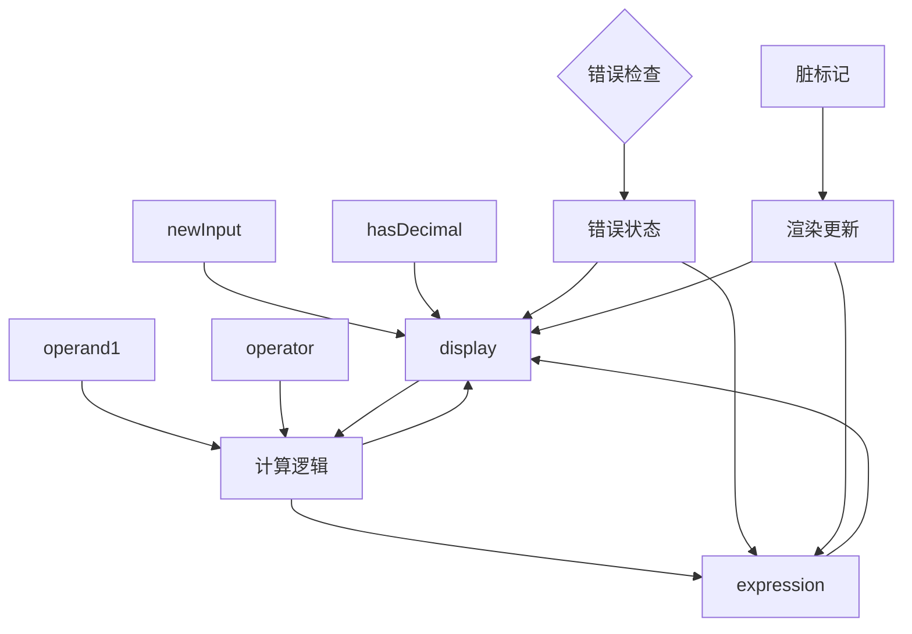

# 主应用组件App.vue

<cite>
**本文档引用的文件**
- [App.vue](file://apps/calculator/App.vue)
- [AppComponent.php](file://apps/calculator/gen/AppComponent.php)
- [DisplayPanel.vue](file://apps/calculator/components/DisplayPanel.vue)
- [NumPad.vue](file://apps/calculator/components/NumPad.vue)
- [AboutDialog.vue](file://apps/calculator/components/AboutDialog.vue)
- [Application.php](file://apps/calculator/Application.php)
- [main.php](file://apps/calculator/main.php)
- [BaseComponent.php](file://framework/BaseComponent.php)
- [ReactiveComponent.php](file://framework/ReactiveComponent.php)
- [ComponentInterface.php](file://framework/interfaces/ComponentInterface.php)
- [ChangeQueue.php](file://framework/ChangeQueue.php)
</cite>

## 目录
1. [简介](#简介)
2. [项目结构](#项目结构)
3. [核心组件](#核心组件)
4. [架构概览](#架构概览)
5. [详细组件分析](#详细组件分析)
6. [依赖关系分析](#依赖关系分析)
7. [性能考虑](#性能考虑)
8. [故障排除指南](#故障排除指南)
9. [结论](#结论)

## 简介

VueCalc是一个基于SFC（Server-Side Components）编译器的桌面计算器应用程序。该应用采用PHP作为模板语言，通过SFC编译器将.vue文件编译为PHP组件，实现了跨平台的桌面应用开发。主应用组件App.vue是整个计算器的核心，负责管理应用状态、处理用户交互和协调各个子组件的工作。

该应用采用了响应式组件架构，通过脏标记机制实现高效的渲染更新。应用支持完整的计算器功能，包括基本算术运算、错误处理、小数点处理和历史表达式显示。

## 项目结构

VueCalc项目采用模块化的组件架构，主要包含以下结构：

**图表来源**
- [App.vue:1-203](file://apps/calculator/App.vue#L1-L203)
- [AppComponent.php:1-787](file://apps/calculator/gen/AppComponent.php#L1-L787)
- [Application.php:1-322](file://apps/calculator/Application.php#L1-L322)

**章节来源**
- [App.vue:1-203](file://apps/calculator/App.vue#L1-L203)
- [main.php:1-48](file://apps/calculator/main.php#L1-L48)

## 核心组件

### 主应用组件架构

主应用组件AppComponent继承自ReactiveComponent基类，实现了完整的计算器功能。组件的核心职责包括：

1. **状态管理**：维护计算器的当前状态，包括显示值、操作数、运算符等
2. **事件处理**：处理用户输入和按钮点击事件
3. **计算逻辑**：执行数学运算和结果格式化
4. **UI协调**：协调各个子组件的显示和交互

### 核心状态属性

组件定义了多个关键状态属性来管理计算器的状态：

| 属性名称 | 类型 | 默认值 | 描述 |
|---------|------|--------|------|
| display | string | '0' | 当前显示的数值 |
| expression | string | '' | 当前正在输入的表达式 |
| operand1 | string | '' | 第一个操作数 |
| operator | string | '' | 当前运算符 |
| newInput | bool | true | 是否开始新的输入 |
| hasDecimal | bool | false | 是否已输入小数点 |
| showDialog | bool | false | 关于对话框的显示状态 |

### 生命周期管理

应用采用标准的组件生命周期模式：

**图表来源**
- [Application.php:205-263](file://apps/calculator/Application.php#L205-L263)
- [main.php:19-48](file://apps/calculator/main.php#L19-L48)

**章节来源**
- [AppComponent.php:11-787](file://apps/calculator/gen/AppComponent.php#L11-L787)
- [ReactiveComponent.php:14-90](file://framework/ReactiveComponent.php#L14-L90)

## 架构概览

### 组件层次结构

VueCalc采用分层的组件架构，从根组件到子组件的层次关系如下：

**图表来源**
- [AppComponent.php:676-701](file://apps/calculator/gen/AppComponent.php#L676-L701)
- [BaseComponent.php:16-177](file://framework/BaseComponent.php#L16-L177)

### 数据流架构

应用的数据流采用单向数据流设计，确保状态的一致性和可预测性：

**图表来源**
- [AppComponent.php:96-140](file://apps/calculator/gen/AppComponent.php#L96-L140)
- [Application.php:248-257](file://apps/calculator/Application.php#L248-L257)

**章节来源**
- [App.vue:1-203](file://apps/calculator/App.vue#L1-L203)
- [AppComponent.php:194-669](file://apps/calculator/gen/AppComponent.php#L194-L669)

## 详细组件分析

### 主应用组件App.vue

#### 模板结构分析

主应用组件的模板结构采用绝对定位的方式，通过x、y坐标精确控制各个元素的位置：

**图表来源**
- [App.vue:1-23](file://apps/calculator/App.vue#L1-L23)

#### 核心状态管理

组件通过多个状态属性管理计算器的不同方面：

**显示状态管理**
- `display`: 控制当前显示的数值，支持数字累加和重置
- `expression`: 显示当前正在输入的表达式，支持条件渲染

**计算状态管理**
- `operand1`: 存储第一个操作数，用于连续计算
- `operator`: 存储当前运算符，决定计算类型
- `newInput`: 控制是否开始新的输入序列

**用户界面状态**
- `showDialog`: 控制关于对话框的显示和隐藏
- `hasDecimal`: 跟踪小数点的使用情况

#### 用户交互处理机制

用户交互通过事件处理器统一管理：

**图表来源**
- [AppComponent.php:162-181](file://apps/calculator/gen/AppComponent.php#L162-L181)
- [Application.php:316-321](file://apps/calculator/Application.php#L316-L321)

**章节来源**
- [App.vue:25-194](file://apps/calculator/App.vue#L25-L194)
- [AppComponent.php:40-181](file://apps/calculator/gen/AppComponent.php#L40-L181)

### 显示面板组件

显示面板组件负责显示当前的计算结果和表达式：

#### 组件结构
- **背景矩形**: 320x72像素的深色背景
- **显示文本**: 右对齐的白色大字体数字显示
- **容器配置**: 282像素宽度的文本容器

#### 显示逻辑
组件通过绑定机制实时显示状态属性：
- `display`属性绑定到显示文本
- 支持右对齐和容器裁剪
- 字体大小32，粗体显示

**章节来源**
- [DisplayPanel.vue:1-12](file://apps/calculator/components/DisplayPanel.vue#L1-L12)

### 数字键盘组件

数字键盘组件提供完整的计算器输入界面：

#### 按钮布局
采用4x5网格布局，包含：
- **功能按钮**: C（清除）、<-（退格）
- **运算符按钮**: +、-、*、/
- **数字按钮**: 0-9
- **特殊按钮**: =（计算）、.（小数点）

#### 事件处理
每个按钮都绑定到相应的处理器：
- 数字按钮调用`handleButton()`方法
- 运算符按钮调用`handleButton()`方法
- 特殊按钮调用对应的方法

**章节来源**
- [NumPad.vue:1-37](file://apps/calculator/components/NumPad.vue#L1-L37)

### 关于对话框组件

关于对话框提供应用信息展示功能：

#### 对话框结构
- **半透明覆盖层**: modal效果
- **对话框面板**: 280x200像素的深色背景
- **标题区域**: 应用名称显示
- **内容区域**: 描述文本
- **版本信息**: 版本号显示
- **关闭按钮**: 100x34像素的按钮

#### 显示控制
- 通过`showDialog`状态控制显示
- 支持条件渲染和层叠显示
- 采用模态对话框设计

**章节来源**
- [AboutDialog.vue:1-37](file://apps/calculator/components/AboutDialog.vue#L1-L37)

## 依赖关系分析

### 组件依赖图

**图表来源**
- [AppComponent.php:11-11](file://apps/calculator/gen/AppComponent.php#L11-L11)
- [Application.php:15-36](file://apps/calculator/Application.php#L15-L36)

### 状态依赖关系

组件状态之间存在复杂的依赖关系：

**图表来源**
- [AppComponent.php:96-140](file://apps/calculator/gen/AppComponent.php#L96-L140)
- [AppComponent.php:162-181](file://apps/calculator/gen/AppComponent.php#L162-L181)

**章节来源**
- [AppComponent.php:11-787](file://apps/calculator/gen/AppComponent.php#L11-L787)
- [ReactiveComponent.php:14-90](file://framework/ReactiveComponent.php#L14-L90)

## 性能考虑

### 脏标记机制

应用采用高效的脏标记机制来优化渲染性能：

1. **状态变更检测**: 每次状态更新后设置`$this->dirty = true`
2. **批量渲染**: 仅在状态变更时触发渲染
3. **渲染节流**: 60FPS的渲染频率限制

### 内存管理

- **组件树管理**: 通过`getBaseComponents()`方法管理组件树
- **子组件生命周期**: 自动管理子组件的挂载和卸载
- **资源清理**: 应用退出时自动清理资源

### 计算优化

- **浮点数精度**: 使用适当的精度控制避免显示问题
- **错误处理**: 及时检测和处理除零错误
- **状态缓存**: 避免不必要的状态重建

## 故障排除指南

### 常见问题及解决方案

**问题1: 按钮无响应**
- 检查`dispatchClick()`方法是否正确处理
- 验证按钮的`handler`属性配置
- 确认组件的`dirty`标记被正确设置

**问题2: 显示异常**
- 检查`display`状态的更新逻辑
- 验证格式化函数的使用
- 确认文本绑定的正确性

**问题3: 计算错误**
- 检查运算符处理逻辑
- 验证除零错误处理
- 确认浮点数精度控制

### 调试技巧

1. **启用日志输出**: 在关键方法中添加调试信息
2. **状态监控**: 使用`consumeDirty()`方法监控状态变更
3. **渲染验证**: 检查渲染器的输出结果

**章节来源**
- [Application.php:227-232](file://apps/calculator/Application.php#L227-L232)
- [ReactiveComponent.php:56-64](file://framework/ReactiveComponent.php#L56-L64)

## 结论

主应用组件App.vue展现了现代响应式应用架构的最佳实践。通过清晰的组件分离、完善的事件处理机制和高效的渲染优化，该组件成功实现了复杂的功能需求。

### 主要优势

1. **架构清晰**: 采用分层架构，职责分离明确
2. **性能优秀**: 脏标记机制确保高效的渲染更新
3. **扩展性强**: 模块化设计便于功能扩展
4. **维护友好**: 清晰的代码结构和文档

### 改进建议

1. **错误处理增强**: 添加更详细的错误信息和恢复机制
2. **性能监控**: 实现性能指标监控和分析
3. **测试覆盖**: 增加单元测试和集成测试
4. **文档完善**: 补充更多的API文档和使用示例

该组件为桌面应用开发提供了优秀的参考模型，展示了如何在受限环境中实现复杂的应用功能。