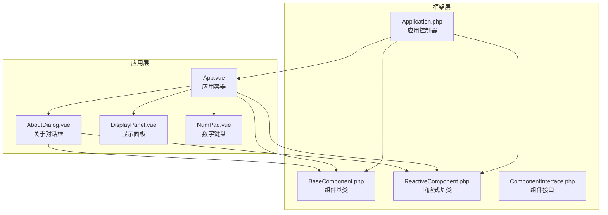
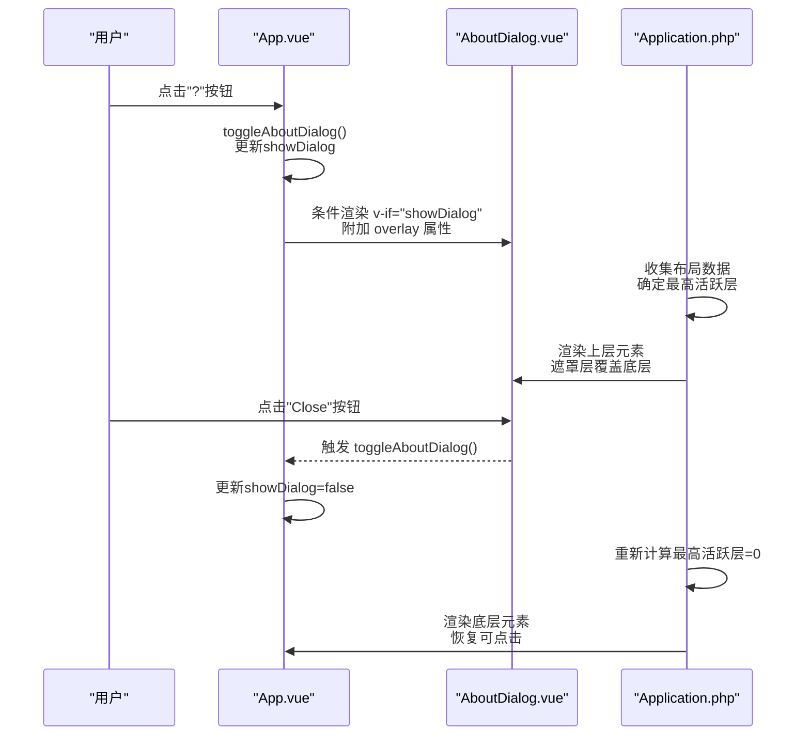
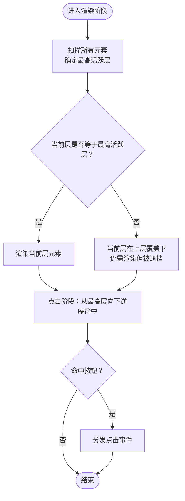
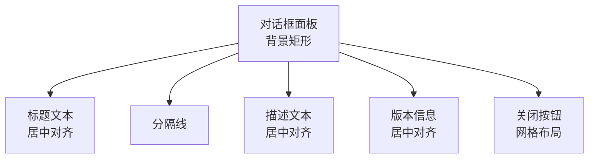
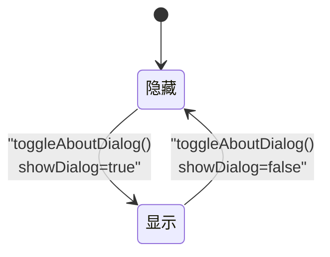
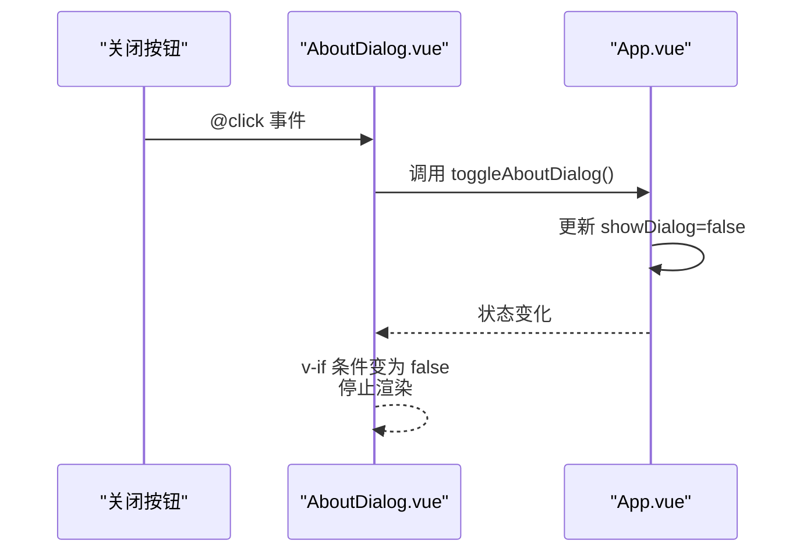
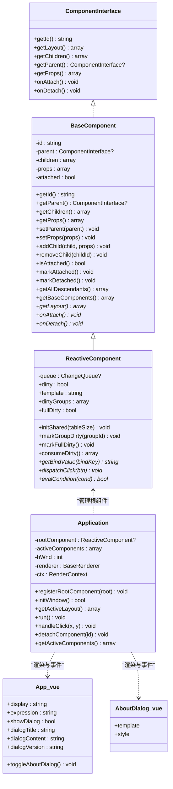

# 关于对话框组件AboutDialog.vue

<cite>
**本文档引用的文件**
- [AboutDialog.vue](file://apps/calculator/components/AboutDialog.vue)
- [App.vue](file://apps/calculator/App.vue)
- [Application.php](file://apps/calculator/Application.php)
- [BaseComponent.php](file://framework/BaseComponent.php)
- [ReactiveComponent.php](file://framework/ReactiveComponent.php)
- [ComponentInterface.php](file://framework/interfaces/ComponentInterface.php)
- [vue-dialog-overlay-pattern.md](file://docs/vue-dialog-overlay-pattern.md)
</cite>

## 目录
1. [简介](#简介)
2. [项目结构](#项目结构)
3. [核心组件](#核心组件)
4. [架构总览](#架构总览)
5. [详细组件分析](#详细组件分析)
6. [依赖关系分析](#依赖关系分析)
7. [性能考虑](#性能考虑)
8. [故障排除指南](#故障排除指南)
9. [结论](#结论)
10. [附录](#附录)

## 简介
本指南围绕计算器应用中的关于对话框组件AboutDialog.vue展开，系统阐述其设计架构与实现细节，重点包括：
- 模态窗口与遮罩层的实现方式
- 遮罩层的渲染与点击穿透防护机制
- 对话框的居中定位与层级控制
- 内容结构：标题、版本信息、描述文本与关闭按钮的布局设计
- 显示控制逻辑：状态管理、条件渲染与焦点处理
- 组件与父组件的通信机制：overlay属性、事件传递与状态同步
- 定制与扩展：内容格式修改、新增信息项与交互体验优化

## 项目结构
计算器应用采用组件化架构，AboutDialog作为子组件被App.vue引入并在需要时通过条件渲染展示。应用通过Application.php协调组件树、布局收集与渲染调度，并借助框架提供的BaseComponent、ReactiveComponent等基类实现组件生命周期与状态管理。

**图表来源**
- [App.vue:1-23](file://apps/calculator/App.vue#L1-L23)
- [AboutDialog.vue:1-26](file://apps/calculator/components/AboutDialog.vue#L1-L26)
- [Application.php:15-37](file://apps/calculator/Application.php#L15-L37)
- [BaseComponent.php:16-36](file://framework/BaseComponent.php#L16-L36)
- [ReactiveComponent.php:14-35](file://framework/ReactiveComponent.php#L14-L35)
- [ComponentInterface.php:13-52](file://framework/interfaces/ComponentInterface.php#L13-L52)

**章节来源**
- [App.vue:1-23](file://apps/calculator/App.vue#L1-L23)
- [AboutDialog.vue:1-26](file://apps/calculator/components/AboutDialog.vue#L1-L26)
- [Application.php:15-37](file://apps/calculator/Application.php#L15-L37)

## 核心组件
- AboutDialog.vue：负责渲染对话框的遮罩层、面板背景、标题、分隔线、描述文本、版本信息与关闭按钮。通过v-if条件渲染控制显示与隐藏。
- App.vue：应用容器，维护showDialog状态与对话框文本变量，提供toggleAboutDialog切换逻辑，并通过overlay属性将对话框置于独立层级。
- Application.php：应用控制器，负责窗口初始化、事件循环、点击分发与渲染调度，支撑组件树与布局数据的收集与渲染。

**章节来源**
- [AboutDialog.vue:1-37](file://apps/calculator/components/AboutDialog.vue#L1-L37)
- [App.vue:45-52](file://apps/calculator/App.vue#L45-L52)
- [App.vue:188-193](file://apps/calculator/App.vue#L188-L193)
- [Application.php:205-263](file://apps/calculator/Application.php#L205-L263)

## 架构总览
对话框采用“条件渲染 + 层级控制”的模式实现模态效果。父组件App.vue通过showDialog控制AboutDialog的显示；在模板中，AboutDialog通过overlay属性声明自身为叠加层，配合框架的分层渲染与点击策略，实现遮罩层覆盖底层元素、点击优先命中上层元素的效果。

**图表来源**
- [App.vue:16-21](file://apps/calculator/App.vue#L16-L21)
- [App.vue:188-193](file://apps/calculator/App.vue#L188-L193)
- [AboutDialog.vue:4-24](file://apps/calculator/components/AboutDialog.vue#L4-L24)
- [Application.php:269-311](file://apps/calculator/Application.php#L269-L311)

## 详细组件分析

### 模态窗口与遮罩层实现
- 遮罩层：通过一个半透明矩形覆盖整个画布区域，实现视觉上的模态遮罩效果。该遮罩层随对话框显示而渲染，随隐藏而移除。
- 点击穿透防护：框架通过“分层累积渲染 + 分层点击”机制，确保上层元素（如遮罩层）优先渲染与命中，底层元素在上层活跃时被屏蔽，从而避免点击穿透问题。

**图表来源**
- [vue-dialog-overlay-pattern.md:83-107](file://docs/vue-dialog-overlay-pattern.md#L83-L107)
- [Application.php:269-311](file://apps/calculator/Application.php#L269-L311)

**章节来源**
- [AboutDialog.vue:4](file://apps/calculator/components/AboutDialog.vue#L4)
- [vue-dialog-overlay-pattern.md:37-53](file://docs/vue-dialog-overlay-pattern.md#L37-L53)
- [vue-dialog-overlay-pattern.md:76-79](file://docs/vue-dialog-overlay-pattern.md#L76-L79)

### 对话框面板与居中定位
- 面板背景：在固定区域内绘制对话框背景，提供内容承载区。
- 居中定位：通过设置面板的绝对坐标与尺寸，结合文本容器的居中对齐属性，实现内容在对话框内的水平居中布局。
- 标题与分隔线：标题位于面板顶部，下方以分隔线强调内容分区。
- 描述文本与版本信息：描述文本与版本信息按垂直顺序排列，均采用居中对齐，提升可读性。
- 关闭按钮：使用网格布局放置关闭按钮，便于统一尺寸与间距。

**图表来源**
- [AboutDialog.vue:6-24](file://apps/calculator/components/AboutDialog.vue#L6-L24)

**章节来源**
- [AboutDialog.vue:6-24](file://apps/calculator/components/AboutDialog.vue#L6-L24)

### 显示控制逻辑与状态管理
- 状态变量：App.vue维护showDialog布尔状态，用于控制对话框的显示与隐藏。
- 切换逻辑：toggleAboutDialog方法在调用时翻转showDialog状态，并标记脏位触发重绘。
- 条件渲染：AboutDialog内部通过v-if="showDialog"控制遮罩层、面板与内容的渲染，避免不必要的元素参与布局与渲染。

**图表来源**
- [App.vue:188-193](file://apps/calculator/App.vue#L188-L193)

**章节来源**
- [App.vue:45-52](file://apps/calculator/App.vue#L45-L52)
- [App.vue:188-193](file://apps/calculator/App.vue#L188-L193)
- [AboutDialog.vue:4-24](file://apps/calculator/components/AboutDialog.vue#L4-L24)

### 组件与父组件的通信机制
- overlay属性：在App.vue中，AboutDialog通过overlay属性声明自身为叠加层，使框架能够将其置于更高的渲染层级。
- 事件传递：关闭按钮绑定点击事件，事件回调指向toggleAboutDialog，实现从子组件向父组件的状态同步。
- 状态同步：父组件在toggleAboutDialog中更新showDialog，触发组件树重绘，渲染器根据最高活跃层决定元素的可见性与可点击性。

**图表来源**
- [AboutDialog.vue:22-24](file://apps/calculator/components/AboutDialog.vue#L22-L24)
- [App.vue:188-193](file://apps/calculator/App.vue#L188-L193)

**章节来源**
- [App.vue:20-21](file://apps/calculator/App.vue#L20-L21)
- [AboutDialog.vue:22-24](file://apps/calculator/components/AboutDialog.vue#L22-L24)
- [App.vue:188-193](file://apps/calculator/App.vue#L188-L193)

### 定制与扩展指导
- 修改内容格式：通过调整文本样式类（如标题、描述、版本）与容器尺寸，可改变字体大小、颜色与对齐方式。
- 添加新信息：在模板中插入新的文本元素，并为其设置居中对齐与容器参数，即可无缝融入现有布局。
- 优化交互体验：可考虑为关闭按钮增加悬停反馈或过渡动画；在父组件中为toggleAboutDialog增加防抖逻辑，减少频繁切换带来的重绘开销。

**章节来源**
- [AboutDialog.vue:28-36](file://apps/calculator/components/AboutDialog.vue#L28-L36)

## 依赖关系分析
- AboutDialog依赖于框架的组件基类与响应式基类，继承组件树管理与状态变更能力。
- App作为根组件，负责状态管理与事件分发，同时通过Application控制器协调渲染与点击处理。
- 框架接口定义了组件必须实现的方法，保证组件树结构与布局数据的一致性。

**图表来源**
- [ComponentInterface.php:13-52](file://framework/interfaces/ComponentInterface.php#L13-L52)
- [BaseComponent.php:16-177](file://framework/BaseComponent.php#L16-L177)
- [ReactiveComponent.php:14-90](file://framework/ReactiveComponent.php#L14-L90)
- [Application.php:15-322](file://apps/calculator/Application.php#L15-L322)
- [App.vue:25-194](file://apps/calculator/App.vue#L25-L194)
- [AboutDialog.vue:1-37](file://apps/calculator/components/AboutDialog.vue#L1-L37)

**章节来源**
- [ComponentInterface.php:13-52](file://framework/interfaces/ComponentInterface.php#L13-L52)
- [BaseComponent.php:16-177](file://framework/BaseComponent.php#L16-L177)
- [ReactiveComponent.php:14-90](file://framework/ReactiveComponent.php#L14-L90)
- [Application.php:15-322](file://apps/calculator/Application.php#L15-L322)
- [App.vue:25-194](file://apps/calculator/App.vue#L25-L194)
- [AboutDialog.vue:1-37](file://apps/calculator/components/AboutDialog.vue#L1-L37)

## 性能考虑
- 条件渲染：通过v-if在对话框隐藏时完全移除相关元素，降低布局扫描与渲染成本。
- 脏标记：父组件在状态变更后标记脏位，渲染器仅在dirty为真时进行重绘，避免不必要的刷新。
- 分层渲染：框架按层累积渲染，上层覆盖底层，减少底层元素的重复绘制。

**章节来源**
- [AboutDialog.vue:4-24](file://apps/calculator/components/AboutDialog.vue#L4-L24)
- [ReactiveComponent.php:19-64](file://framework/ReactiveComponent.php#L19-L64)
- [Application.php:248-257](file://apps/calculator/Application.php#L248-L257)

## 故障排除指南
- 点击穿透问题：若出现点击底层元素的情况，检查父组件是否正确传入overlay属性，以及showDialog状态是否与条件渲染一致。
- 点击未响应：确认按钮未被条件屏蔽且不在低于最高活跃层的条件下；检查按钮的layer与condition配置。
- 界面闪烁：避免在toggleAboutDialog中进行不必要的多次状态更新，确保一次切换完成。

**章节来源**
- [vue-dialog-overlay-pattern.md:14-18](file://docs/vue-dialog-overlay-pattern.md#L14-L18)
- [vue-dialog-overlay-pattern.md:54-61](file://docs/vue-dialog-overlay-pattern.md#L54-L61)
- [Application.php:269-311](file://apps/calculator/Application.php#L269-L311)

## 结论
AboutDialog.vue通过简洁的模板结构与条件渲染，配合框架的overlay分层机制，实现了可靠的模态对话框体验。父组件以最小的样板代码完成状态管理与事件传递，渲染器基于脏标记与分层策略保障性能与交互一致性。该设计既满足当前需求，也为后续定制与扩展提供了清晰的路径。

## 附录
- 术语说明
  - overlay：叠加层属性，声明组件处于更高渲染层级，用于实现模态与遮罩效果。
  - 脏标记：组件状态变更后触发重绘的标记机制。
  - 分层渲染：按层级累积渲染，高层覆盖底层，提升视觉层次与交互优先级。