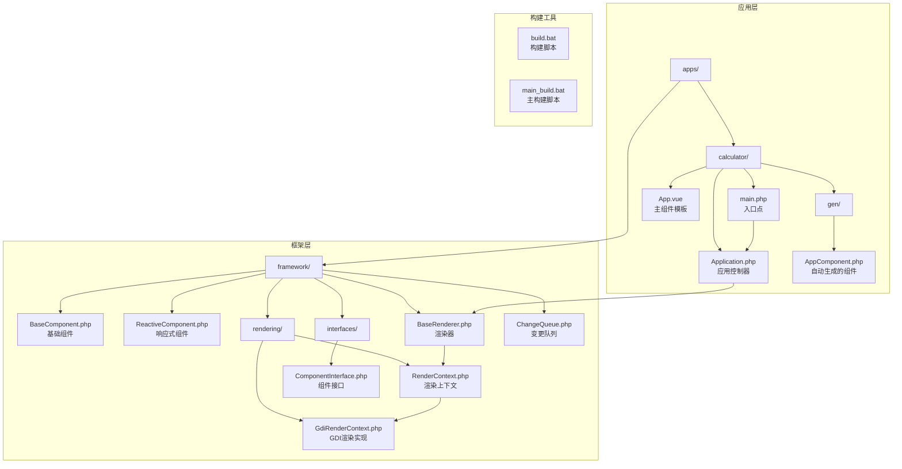
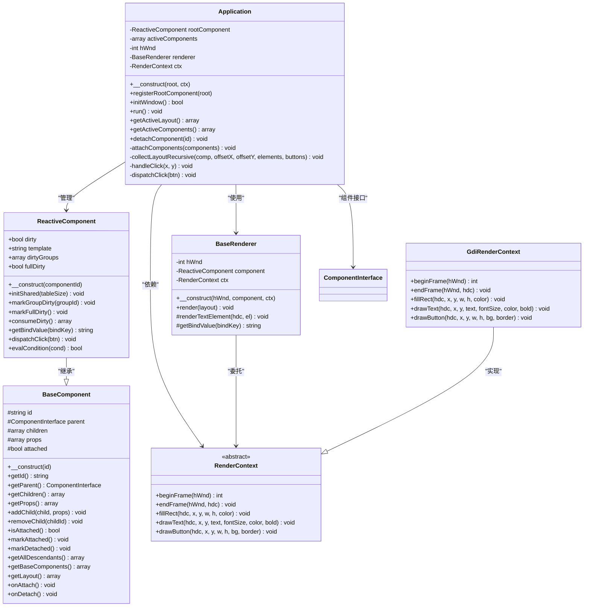
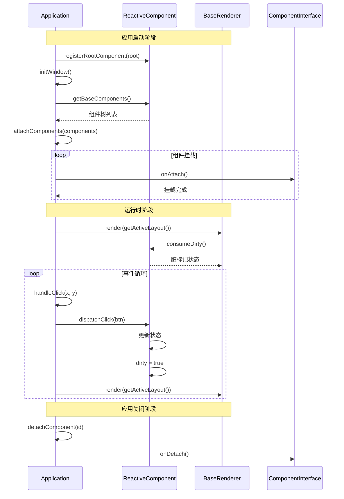
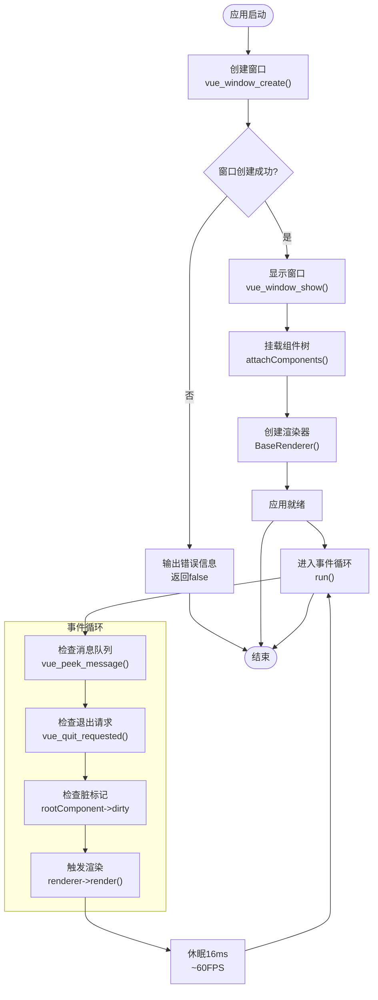
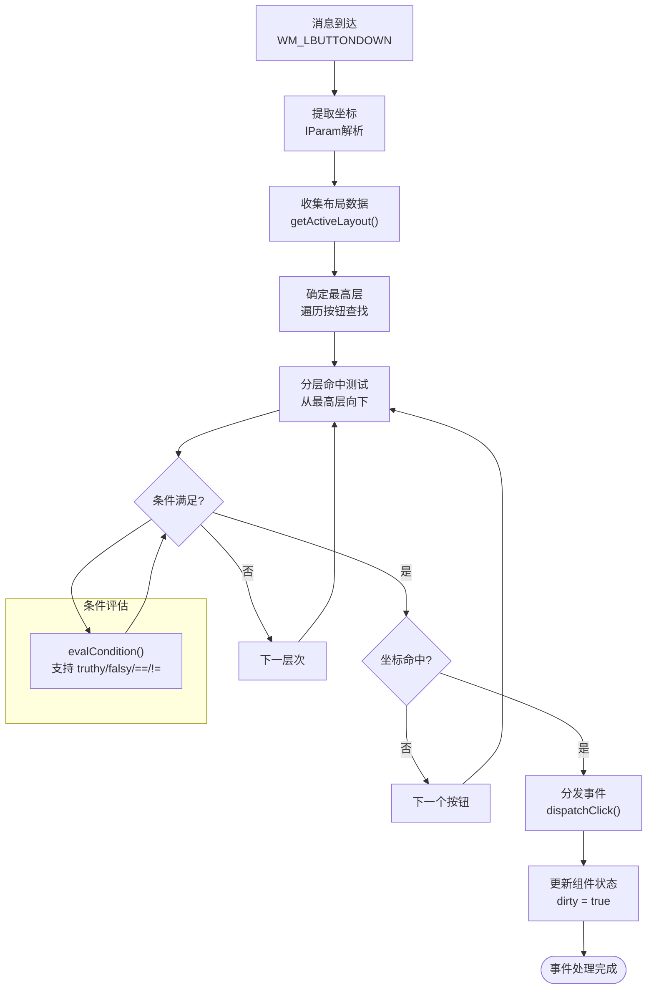
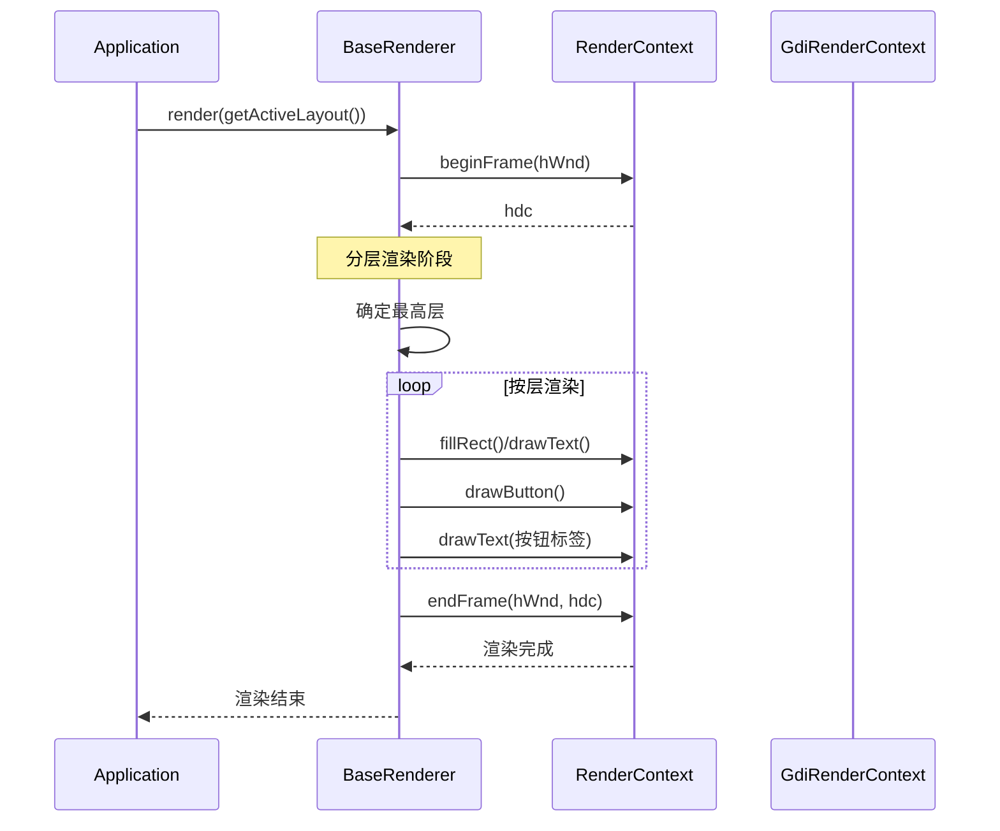
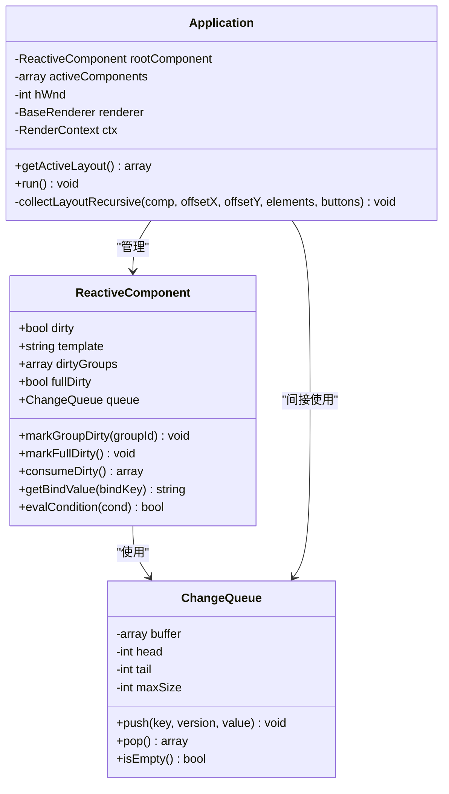

# 应用控制器Application.php

<cite>
**本文档引用的文件**
- [Application.php](file://apps/calculator/Application.php)
- [AppComponent.php](file://apps/calculator/gen/AppComponent.php)
- [main.php](file://apps/calculator/main.php)
- [App.vue](file://apps/calculator/App.vue)
- [BaseComponent.php](file://framework/BaseComponent.php)
- [ReactiveComponent.php](file://framework/ReactiveComponent.php)
- [BaseRenderer.php](file://framework/BaseRenderer.php)
- [RenderContext.php](file://framework/rendering/RenderContext.php)
- [GdiRenderContext.php](file://framework/rendering/GdiRenderContext.php)
- [ComponentInterface.php](file://framework/interfaces/ComponentInterface.php)
- [ChangeQueue.php](file://framework/ChangeQueue.php)
</cite>

## 目录
1. [简介](#简介)
2. [项目结构概览](#项目结构概览)
3. [核心架构设计](#核心架构设计)
4. [组件树生命周期管理](#组件树生命周期管理)
5. [窗口管理系统](#窗口管理系统)
6. [事件处理机制](#事件处理机制)
7. [渲染系统架构](#渲染系统架构)
8. [应用启动流程详解](#应用启动流程详解)
9. [状态管理与内存控制](#状态管理与内存控制)
10. [性能优化策略](#性能优化策略)
11. [扩展与定制指南](#扩展与定制指南)
12. [故障排除指南](#故障排除指南)
13. [总结](#总结)

## 简介

Application.php是VueCalc v6 M2版本中的核心应用控制器，负责管理整个SFC（Single File Component）应用程序的生命周期。该控制器实现了数据驱动的窗口管理、事件循环、组件树管理和渲染调度系统。通过采用组件化架构和AOT（Ahead-of-Time）编译优化，Application.php提供了高性能、可扩展的应用程序运行时环境。

该控制器的核心职责包括：
- 窗口初始化和管理
- 组件树的挂载和卸载
- 事件循环和消息处理
- 数据驱动的渲染调度
- 组件状态管理和脏标记机制

## 项目结构概览

VueCalc项目采用模块化架构，主要目录结构如下：



**图表来源**
- [Application.php:1-322](file://apps/calculator/Application.php#L1-L322)
- [main.php:1-48](file://apps/calculator/main.php#L1-L48)

**章节来源**
- [Application.php:1-322](file://apps/calculator/Application.php#L1-L322)
- [main.php:1-48](file://apps/calculator/main.php#L1-L48)

## 核心架构设计

Application.php采用了分层架构设计，将不同职责分离到专门的组件中：



**图表来源**
- [Application.php:15-322](file://apps/calculator/Application.php#L15-L322)
- [ReactiveComponent.php:14-90](file://framework/ReactiveComponent.php#L14-L90)
- [BaseComponent.php:16-177](file://framework/BaseComponent.php#L16-L177)
- [BaseRenderer.php:15-197](file://framework/BaseRenderer.php#L15-L197)
- [RenderContext.php:13-30](file://framework/rendering/RenderContext.php#L13-L30)
- [GdiRenderContext.php:11-38](file://framework/rendering/GdiRenderContext.php#L11-L38)

**章节来源**
- [Application.php:15-322](file://apps/calculator/Application.php#L15-L322)
- [ReactiveComponent.php:14-90](file://framework/ReactiveComponent.php#L14-L90)
- [BaseComponent.php:16-177](file://framework/BaseComponent.php#L16-L177)

## 组件树生命周期管理

Application.php实现了完整的组件树生命周期管理，包括组件的注册、挂载、更新和卸载过程：



**图表来源**
- [Application.php:32-112](file://apps/calculator/Application.php#L32-L112)
- [Application.php:205-263](file://apps/calculator/Application.php#L205-L263)
- [BaseComponent.php:162-170](file://framework/BaseComponent.php#L162-L170)

**章节来源**
- [Application.php:32-112](file://apps/calculator/Application.php#L32-L112)
- [BaseComponent.php:162-170](file://framework/BaseComponent.php#L162-L170)

## 窗口管理系统

Application.php负责管理应用程序窗口的创建、显示和销毁：



**图表来源**
- [Application.php:51-76](file://apps/calculator/Application.php#L51-L76)
- [Application.php:205-263](file://apps/calculator/Application.php#L205-L263)

**章节来源**
- [Application.php:51-76](file://apps/calculator/Application.php#L51-L76)
- [Application.php:205-263](file://apps/calculator/Application.php#L205-L263)

## 事件处理机制

Application.php实现了高效的数据驱动事件处理系统，支持鼠标点击、窗口消息和组件事件的分发：



**图表来源**
- [Application.php:223-321](file://apps/calculator/Application.php#L223-L321)
- [ReactiveComponent.php:89](file://framework/ReactiveComponent.php#L89)

**章节来源**
- [Application.php:223-321](file://apps/calculator/Application.php#L223-L321)
- [ReactiveComponent.php:89](file://framework/ReactiveComponent.php#L89)

## 渲染系统架构

Application.php的渲染系统采用数据驱动的设计，通过BaseRenderer实现高效的图形渲染：



**图表来源**
- [BaseRenderer.php:98-196](file://framework/BaseRenderer.php#L98-L196)
- [GdiRenderContext.php:13-36](file://framework/rendering/GdiRenderContext.php#L13-L36)

**章节来源**
- [BaseRenderer.php:98-196](file://framework/BaseRenderer.php#L98-L196)
- [GdiRenderContext.php:13-36](file://framework/rendering/GdiRenderContext.php#L13-L36)

## 应用启动流程详解

Application.php的启动流程遵循严格的初始化顺序，确保应用程序的稳定运行：

```mermaid
flowchart TD
Start([main()函数]) --> InitTimezone["设置时区<br/>date_default_timezone_set()"]
InitTimezone --> CreateRoot["创建根组件<br/>new AppComponent('App')"]
CreateRoot --> InitShared["初始化共享资源<br/>initShared(10240)"]
InitShared --> CreateCtx["创建渲染上下文<br/>new GdiRenderContext()"]
CreateCtx --> CreateApp["创建应用控制器<br/>new Application(root, ctx)"]
CreateApp --> InitWindow["初始化窗口<br/>app->initWindow()"]
InitWindow --> CheckSuccess{"初始化成功?"}
CheckSuccess --> |否| ReturnError["返回错误码1"]
CheckSuccess --> |是| StartEventLoop["启动事件循环<br/>app->run()"]
StartEventLoop --> AppRunning["应用运行中"]
ReturnError --> End([结束])
AppRunning --> End
subgraph "initWindow()内部流程"
CreateWindow["创建窗口<br/>vue_window_create()"]
ShowWindow["显示窗口<br/>vue_window_show()"]
AttachComponents["挂载组件<br/>attachComponents()"]
CreateRenderer["创建渲染器<br/>BaseRenderer()"]
end
InitWindow --> CreateWindow
CreateWindow --> ShowWindow
ShowWindow --> AttachComponents
AttachComponents --> CreateRenderer
```

**图表来源**
- [main.php:19-48](file://apps/calculator/main.php#L19-L48)
- [Application.php:51-76](file://apps/calculator/Application.php#L51-L76)

**章节来源**
- [main.php:19-48](file://apps/calculator/main.php#L19-L48)
- [Application.php:51-76](file://apps/calculator/Application.php#L51-L76)

## 状态管理与内存控制

Application.php实现了完整的状态管理和内存控制机制，确保应用程序的高效运行：



**图表来源**
- [ReactiveComponent.php:16-64](file://framework/ReactiveComponent.php#L16-L64)
- [ChangeQueue.php:11-57](file://framework/ChangeQueue.php#L11-L57)
- [Application.php:17-31](file://apps/calculator/Application.php#L17-L31)

**章节来源**
- [ReactiveComponent.php:16-64](file://framework/ReactiveComponent.php#L16-L64)
- [ChangeQueue.php:11-57](file://framework/ChangeQueue.php#L11-L57)
- [Application.php:17-31](file://apps/calculator/Application.php#L17-L31)

## 性能优化策略

Application.php采用了多种性能优化策略来确保应用程序的流畅运行：

### 1. 脏标记驱动的渲染
- 仅在组件状态发生变化时触发渲染
- 通过`$this->rootComponent->dirty`标志位控制渲染时机
- 避免不必要的重绘操作

### 2. AOT编译兼容性优化
- 使用`array_keys() + for`循环替代`foreach`避免类型推断问题
- 使用`(array)`类型转换确保数组引用正确性
- 避免魔术方法的使用减少运行时开销

### 3. 分层渲染优化
- 通过`layer`属性实现分层渲染，提高渲染效率
- 最高层优先渲染，确保视觉效果的正确性

### 4. 内存管理优化
- 使用环形缓冲区的ChangeQueue减少内存分配
- 及时释放不再使用的组件资源
- 合理的垃圾回收策略

## 扩展与定制指南

Application.php提供了丰富的扩展点，允许开发者根据需求定制应用程序的行为：

### 1. 添加新功能组件

要添加新的功能组件，需要：

1. **创建组件类**：继承`BaseComponent`或`ReactiveComponent`
2. **实现必需方法**：`getLayout()`、`onAttach()`、`onDetach()`
3. **集成到组件树**：在根组件中注册新组件

### 2. 修改应用行为

可以通过以下方式修改应用行为：

- **自定义渲染逻辑**：继承`BaseRenderer`实现自定义渲染
- **扩展事件处理**：在`Application`中添加新的事件类型处理
- **修改窗口行为**：通过`vue_*`函数扩展窗口功能

### 3. 性能优化建议

- **批量更新**：使用`markGroupDirty()`进行分组状态更新
- **延迟渲染**：合理设置渲染频率避免过度渲染
- **资源池化**：复用昂贵的对象和资源

## 故障排除指南

### 常见问题及解决方案

#### 1. 窗口创建失败
**症状**：应用启动后立即退出
**原因**：`vue_window_create()`返回0
**解决**：检查Windows系统权限和显示设置

#### 2. 组件未显示
**症状**：界面空白或部分组件不显示
**原因**：组件挂载失败或布局数据错误
**解决**：检查`getLayout()`返回值和组件树结构

#### 3. 点击事件无响应
**症状**：鼠标点击无任何反应
**原因**：命中测试失败或事件分发错误
**解决**：验证按钮坐标和条件表达式

#### 4. 渲染异常
**症状**：屏幕闪烁或渲染错误
**原因**：脏标记未正确设置或渲染上下文问题
**解决**：检查`dirty`标志位和渲染上下文初始化

**章节来源**
- [Application.php:59-62](file://apps/calculator/Application.php#L59-L62)
- [Application.php:227-232](file://apps/calculator/Application.php#L227-L232)

## 总结

Application.php作为VueCalc v6 M2版本的核心控制器，展现了现代应用程序架构的最佳实践。通过采用组件化设计、数据驱动渲染和AOT编译优化，该控制器实现了高性能、可扩展的应用程序运行时环境。

### 主要优势

1. **清晰的架构分离**：将窗口管理、事件处理、渲染等职责明确分离
2. **高效的组件管理**：支持复杂的组件树结构和动态组件管理
3. **灵活的扩展机制**：提供丰富的扩展点和定制选项
4. **优秀的性能表现**：通过脏标记驱动和分层渲染实现高效渲染
5. **完善的错误处理**：包含全面的错误检测和恢复机制

### 技术特色

- **AOT编译兼容**：完全兼容Swoole AOT编译器
- **数据驱动设计**：基于布局数据的声明式渲染
- **分层事件处理**：支持复杂的事件分发和条件判断
- **内存友好**：优化的内存管理和资源控制

Application.php为开发者提供了一个强大而灵活的应用程序开发平台，既适合初学者学习，也为高级开发者提供了充分的定制空间。