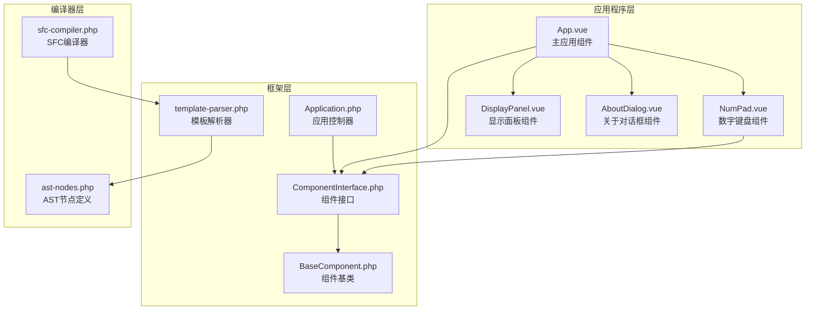
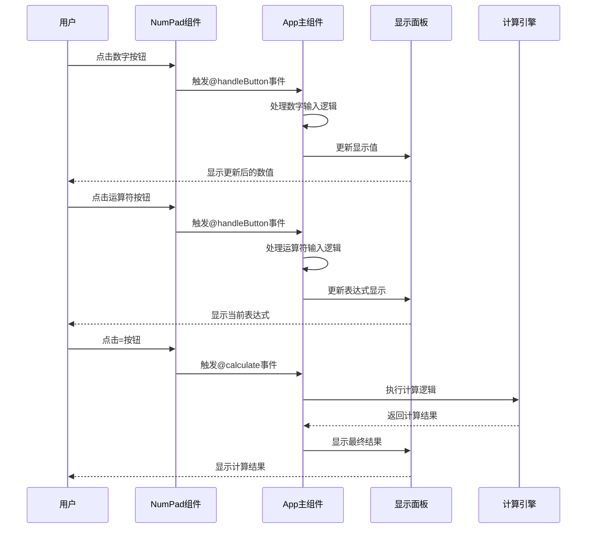
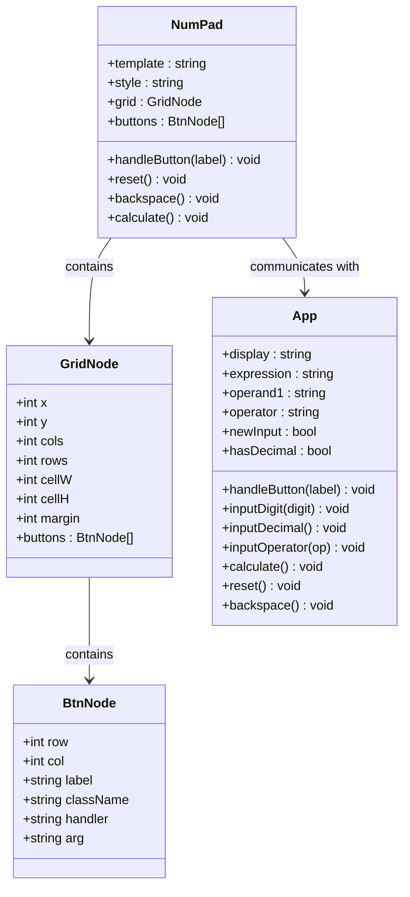
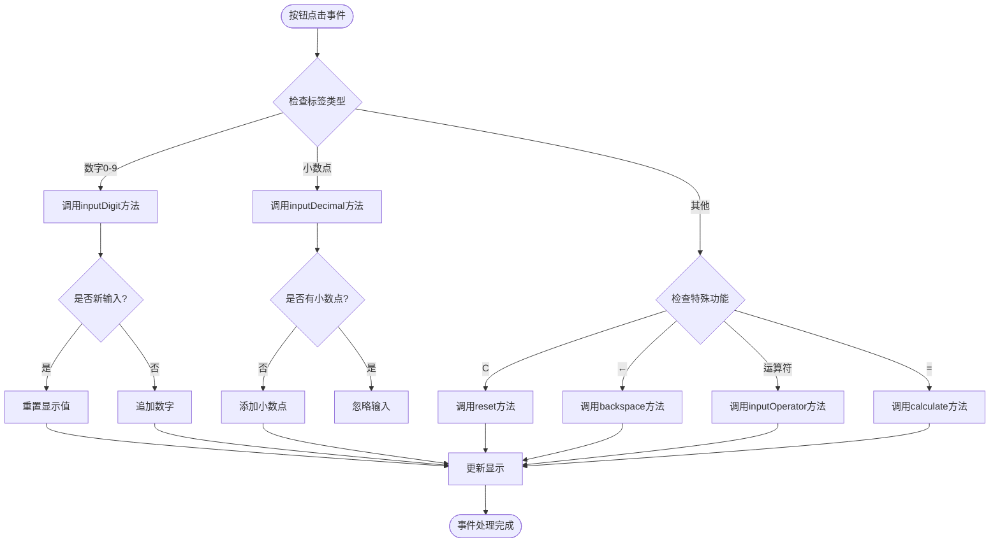
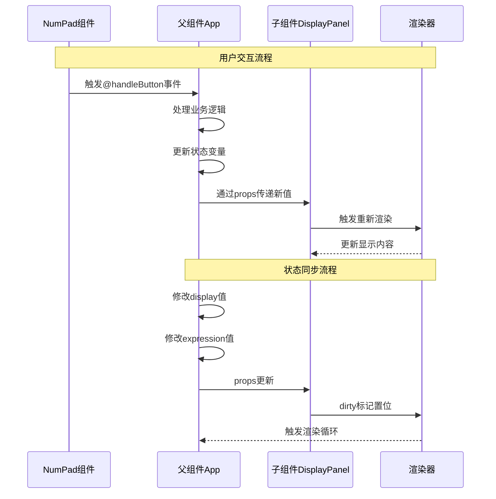
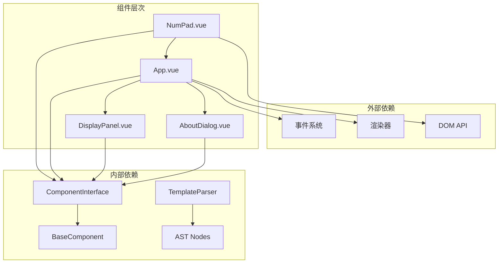

# 数字键盘组件NumPad.vue

<cite>
**本文档中引用的文件**
- [NumPad.vue](file://apps/calculator/components/NumPad.vue)
- [App.vue](file://apps/calculator/App.vue)
- [DisplayPanel.vue](file://apps/calculator/components/DisplayPanel.vue)
- [AboutDialog.vue](file://apps/calculator/components/AboutDialog.vue)
- [Application.php](file://apps/calculator/Application.php)
- [main.php](file://apps/calculator/main.php)
- [ComponentInterface.php](file://framework/interfaces/ComponentInterface.php)
- [BaseComponent.php](file://framework/BaseComponent.php)
- [template-parser.php](file://framework/compiler/template-parser.php)
- [ast-nodes.php](file://framework/compiler/ast-nodes.php)
- [sfc-compiler.php](file://framework/sfc-compiler.php)
</cite>

## 目录
1. [简介](#简介)
2. [项目结构](#项目结构)
3. [核心组件](#核心组件)
4. [架构概览](#架构概览)
5. [详细组件分析](#详细组件分析)
6. [依赖关系分析](#依赖关系分析)
7. [性能考虑](#性能考虑)
8. [故障排除指南](#故障排除指南)
9. [结论](#结论)

## 简介

数字键盘组件NumPad.vue是VueCalc计算器应用程序中的核心交互组件，负责提供数字输入和基本数学运算功能。该组件采用网格布局系统，包含18个按钮，支持数字输入、运算符操作、清除功能和退格删除等完整功能。

该组件基于VueCalc的SFC（Single File Component）架构，使用自定义的模板语法和编译器系统，实现了高性能的桌面应用程序界面。组件通过事件驱动的方式与父组件App.vue进行交互，实现了完整的计算器功能。

## 项目结构

VueCalc项目采用模块化的组件架构，数字键盘作为独立的子组件集成到主应用中：

**图表来源**
- [App.vue:1-203](file://apps/calculator/App.vue#L1-L203)
- [NumPad.vue:1-37](file://apps/calculator/components/NumPad.vue#L1-L37)
- [Application.php:1-322](file://apps/calculator/Application.php#L1-L322)

**章节来源**
- [main.php:1-48](file://apps/calculator/main.php#L1-L48)
- [App.vue:1-203](file://apps/calculator/App.vue#L1-L203)

## 核心组件

### 数字键盘布局设计

数字键盘采用4列5行的网格布局，总共有18个按钮，布局参数如下：

- **网格规格**: 4列 × 5行
- **单元格尺寸**: 80像素宽 × 60像素高
- **边距设置**: 2像素
- **按钮尺寸**: 76像素宽 × 56像素高（80-2×2）
- **整体尺寸**: 328像素宽 × 340像素高

布局结构分为五个功能区域：

1. **第一行**: 功能按钮区
   - C (清除) - 重置计算器状态
   - ← (退格) - 删除最后输入的字符
   - ÷ (除法) - 运算符按钮
   - × (乘法) - 运算符按钮

2. **第二行**: 数字按钮区
   - 7, 8, 9 - 数字按钮

3. **第三行**: 数字按钮区
   - 4, 5, 6 - 数字按钮
   - - (减法) - 运算符按钮

4. **第四行**: 数字按钮区
   - 1, 2, 3 - 数字按钮
   - = (等于) - 计算结果按钮

5. **第五行**: 数字和功能按钮区
   - 0 (零) - 数字按钮
   - . (小数点) - 数字按钮

**章节来源**
- [NumPad.vue:4-27](file://apps/calculator/components/NumPad.vue#L4-L27)

### 按钮样式系统

组件实现了四种不同类型的按钮样式，每种样式对应不同的功能：

1. **数字按钮 (.btn-num)**: #323232背景，#ffffff文字
   - 用途：数字0-9和小数点
   - 特征：深灰色背景，白色文字

2. **运算符按钮 (.btn-op)**: #ff9500背景，#ffffff文字
   - 用途：+、-、×、÷运算符
   - 特征：橙色背景，白色文字

3. **等号按钮 (.btn-eq)**: #007aff背景，#ffffff文字
   - 用途：=计算结果
   - 特征：蓝色背景，白色文字

4. **功能按钮 (.btn-func)**: #505050背景，#ffffff文字
   - 用途：C清除和←退格
   - 特征：浅灰色背景，白色文字

**章节来源**
- [NumPad.vue:31-36](file://apps/calculator/components/NumPad.vue#L31-L36)

## 架构概览

VueCalc采用分层架构设计，数字键盘组件通过事件驱动的方式与主应用进行交互：

**图表来源**
- [NumPad.vue:5-27](file://apps/calculator/components/NumPad.vue#L5-L27)
- [App.vue:167-186](file://apps/calculator/App.vue#L167-L186)

**章节来源**
- [Application.php:205-322](file://apps/calculator/Application.php#L205-L322)

## 详细组件分析

### 组件结构分析

数字键盘组件采用简洁的模板结构，主要包含以下元素：

**图表来源**
- [NumPad.vue:1-37](file://apps/calculator/components/NumPad.vue#L1-L37)
- [ast-nodes.php:98-142](file://framework/compiler/ast-nodes.php#L98-L142)

### 事件处理机制

组件实现了完整的事件处理机制，支持多种类型的按钮操作：

#### 数字按钮事件处理

数字按钮（0-9和小数点）通过统一的`handleButton`方法处理：

**图表来源**
- [App.vue:167-186](file://apps/calculator/App.vue#L167-L186)
- [App.vue:65-92](file://apps/calculator/App.vue#L65-L92)

#### 运算符按钮处理逻辑

运算符按钮（+、-、×、÷）通过`inputOperator`方法处理：

1. **检查现有运算符**: 如果已有运算符且不是新输入，先执行计算
2. **保存第一个操作数**: 将当前显示值保存为operand1
3. **设置运算符**: 将运算符存储到operator变量
4. **更新表达式显示**: 显示"操作数 运算符"格式
5. **准备新输入**: 设置newInput标志为true

#### 功能按钮处理逻辑

功能按钮包括：
- **C按钮**: 调用`reset`方法重置所有状态
- **←按钮**: 调用`backspace`方法删除最后一位
- **=按钮**: 调用`calculate`方法执行计算

**章节来源**
- [App.vue:54-186](file://apps/calculator/App.vue#L54-L186)

### 组件交互模式

数字键盘组件与父组件的交互采用事件冒泡和状态传递的方式：

**图表来源**
- [Application.php:248-257](file://apps/calculator/Application.php#L248-L257)
- [App.vue:7-13](file://apps/calculator/App.vue#L7-L13)

**章节来源**
- [Application.php:120-200](file://apps/calculator/Application.php#L120-L200)

### 样式系统实现

组件的样式系统基于CSS类选择器，实现了完整的视觉层次：

#### 默认样式配置

每个按钮类别都有特定的颜色方案：

1. **数字按钮样式**:
   - 背景颜色: #323232 (深灰)
   - 文字颜色: #ffffff (白色)
   - 字体大小: 24px
   - 字体粗细: bold

2. **运算符按钮样式**:
   - 背景颜色: #ff9500 (橙色)
   - 文字颜色: #ffffff (白色)
   - 字体大小: 24px
   - 字体粗细: bold

3. **等号按钮样式**:
   - 背景颜色: #007aff (蓝色)
   - 文字颜色: #ffffff (白色)
   - 字体大小: 24px
   - 字体粗细: bold

4. **功能按钮样式**:
   - 背景颜色: #505050 (浅灰)
   - 文字颜色: #ffffff (白色)
   - 字体大小: 24px
   - 字体粗细: bold

#### 悬停效果和按下反馈

虽然当前版本未实现悬停和按下反馈效果，但框架支持通过CSS伪类实现这些交互效果：

- `:hover`: 悬停状态样式
- `:active`: 按下状态样式  
- `:disabled`: 禁用状态样式

**章节来源**
- [NumPad.vue:31-36](file://apps/calculator/components/NumPad.vue#L31-L36)

## 依赖关系分析

### 组件依赖图

**图表来源**
- [ComponentInterface.php:13-52](file://framework/interfaces/ComponentInterface.php#L13-L52)
- [BaseComponent.php:16-177](file://framework/BaseComponent.php#L16-L177)

### 编译器集成

数字键盘组件通过SFC编译器系统集成到应用程序中：

1. **模板解析**: `template-parser.php`解析`.vue`文件
2. **AST构建**: `ast-nodes.php`构建抽象语法树
3. **代码生成**: `sfc-compiler.php`生成PHP组件类
4. **运行时加载**: `Application.php`加载和管理组件

**章节来源**
- [template-parser.php:414-635](file://framework/compiler/template-parser.php#L414-L635)
- [ast-nodes.php:98-142](file://framework/compiler/ast-nodes.php#L98-L142)

## 性能考虑

### 渲染优化策略

VueCalc应用采用了多项性能优化措施：

1. **增量渲染**: 仅在组件状态变化时触发渲染
2. **事件循环**: 60FPS的固定帧率控制
3. **内存管理**: 使用原生类型减少内存开销
4. **编译时优化**: AOT编译减少运行时开销

### 事件处理优化

1. **事件冒泡**: 通过组件树传播事件，减少事件监听器数量
2. **条件渲染**: 使用`v-if`控制组件可见性
3. **状态缓存**: 使用`dirty`标记优化渲染调度

**章节来源**
- [Application.php:248-257](file://apps/calculator/Application.php#L248-L257)

## 故障排除指南

### 常见问题诊断

#### 按钮无响应问题

1. **检查事件绑定**: 确认`@click`事件正确绑定到处理方法
2. **验证方法存在**: 确认父组件中存在对应的处理方法
3. **检查组件注册**: 确认组件已在编译器中注册

#### 样式不生效问题

1. **CSS类名检查**: 确认使用正确的CSS类名
2. **样式优先级**: 检查样式覆盖规则
3. **编译器配置**: 确认样式被正确编译到输出

#### 布局错位问题

1. **网格参数检查**: 确认`cols`、`rows`、`cell-w`、`cell-h`参数正确
2. **边距设置**: 检查`margin`参数影响
3. **坐标计算**: 验证按钮位置计算公式

**章节来源**
- [template-parser.php:612-635](file://framework/compiler/template-parser.php#L612-L635)

## 结论

数字键盘组件NumPad.vue展现了VueCalc项目的完整架构理念，通过以下关键特性实现了高质量的用户体验：

### 设计优势

1. **清晰的职责分离**: 组件专注于UI交互，业务逻辑集中在父组件
2. **可扩展的布局系统**: 网格布局支持灵活的按钮排列
3. **完整的事件处理**: 支持数字、运算符、功能按钮的统一处理
4. **高效的渲染机制**: 基于状态变化的增量渲染

### 技术特色

1. **SFC架构**: 单文件组件提供了良好的开发体验
2. **AOT编译**: 预编译优化提升了运行时性能
3. **组件系统**: 完整的组件生命周期管理
4. **事件驱动**: 响应式的用户交互模式

### 扩展建议

1. **样式定制**: 添加更多CSS变量支持主题切换
2. **动画效果**: 实现按钮点击反馈和过渡动画
3. **键盘支持**: 添加键盘快捷键支持
4. **无障碍访问**: 实现屏幕阅读器支持

该组件为VueCalc项目奠定了坚实的技术基础，展示了现代Web技术在桌面应用开发中的创新应用。