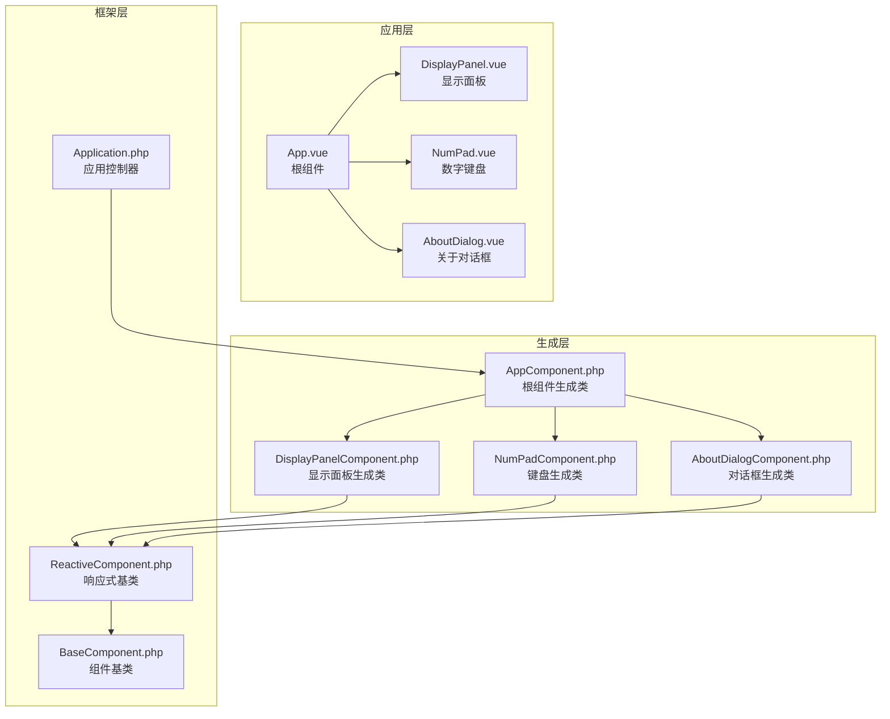
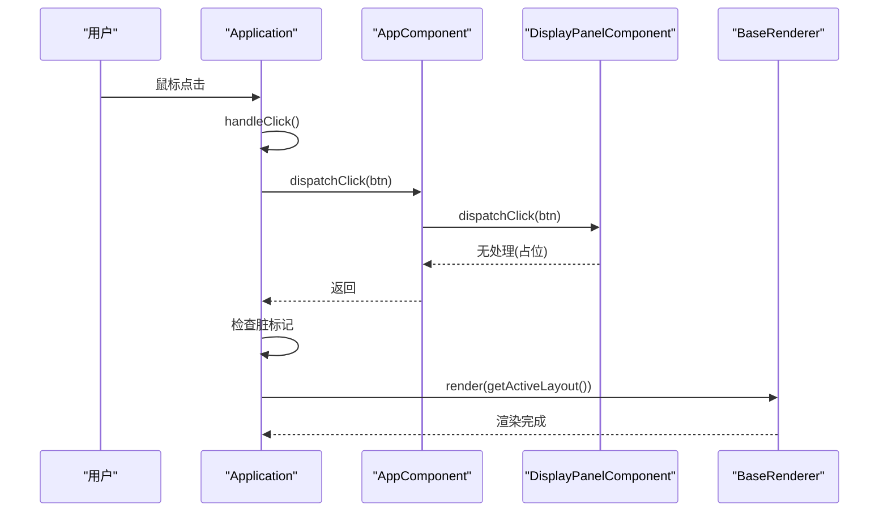
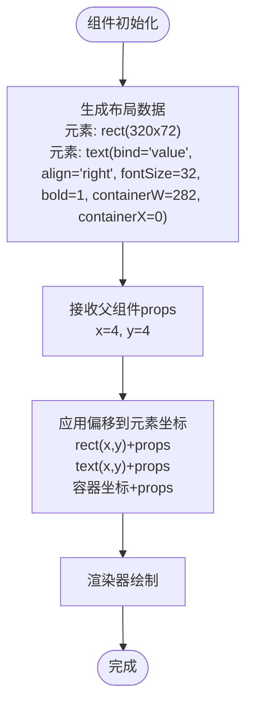
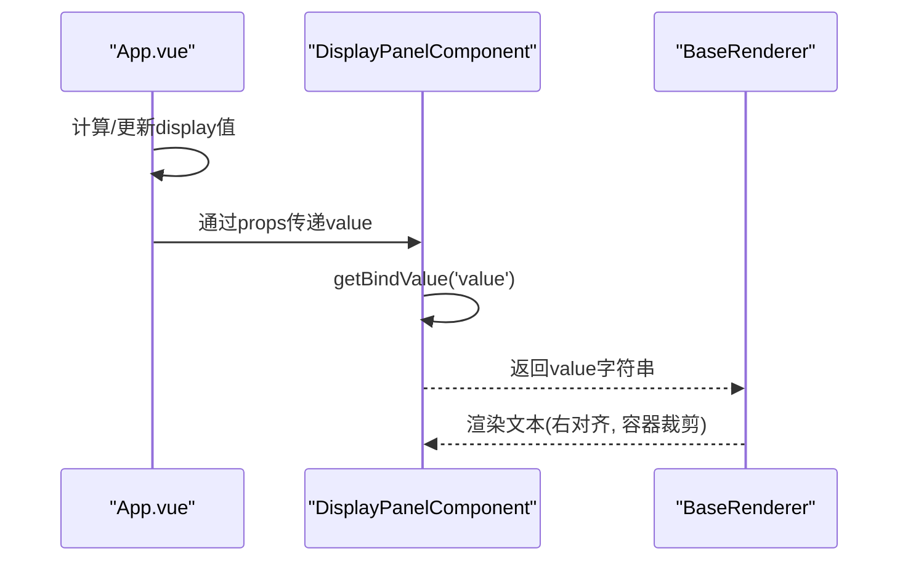
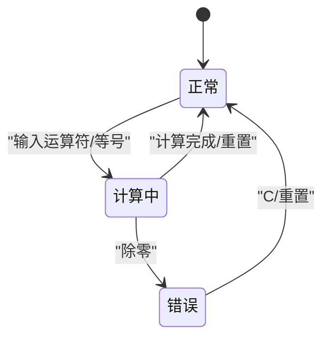
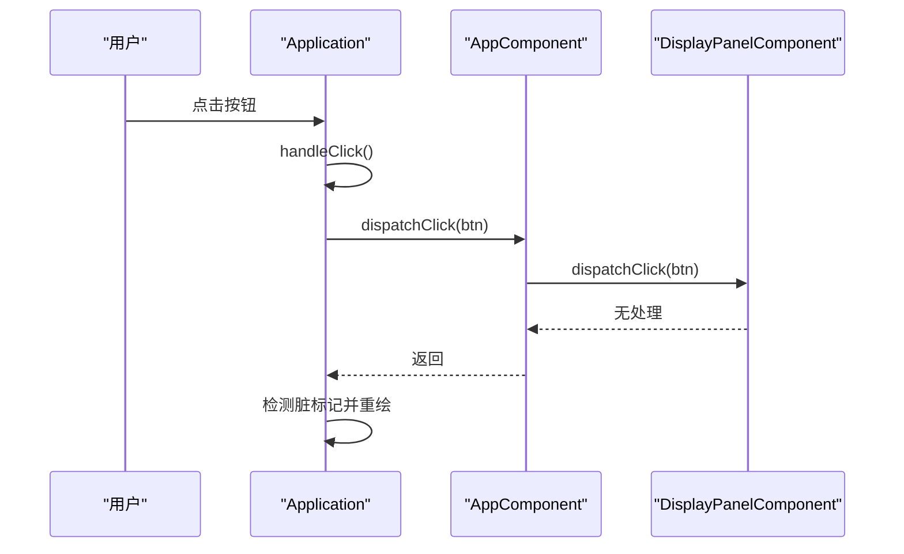
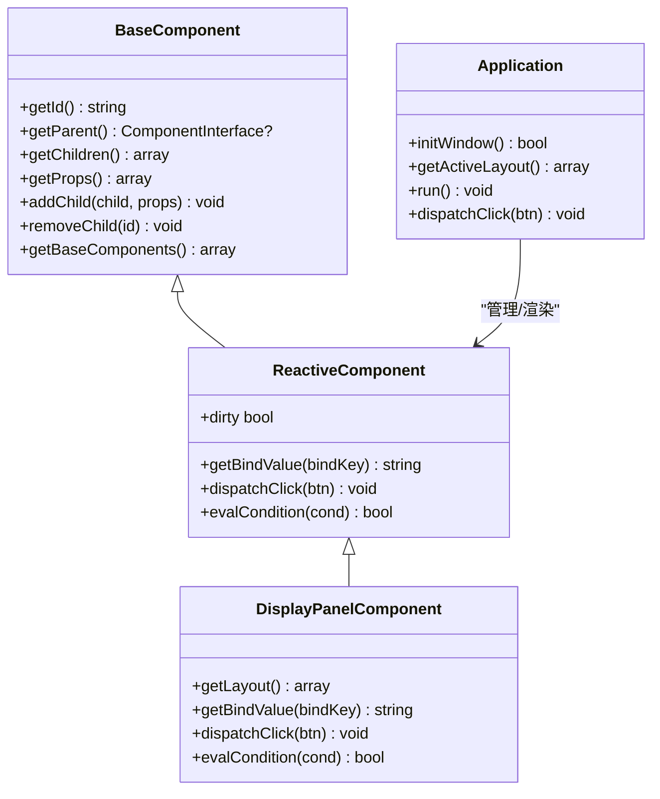

# 显示面板组件DisplayPanel.vue

<cite>
**本文档引用的文件**
- [DisplayPanel.vue](file://apps/calculator/components/DisplayPanel.vue)
- [DisplayPanelComponent.php](file://apps/calculator/gen/DisplayPanelComponent.php)
- [App.vue](file://apps/calculator/App.vue)
- [AppComponent.php](file://apps/calculator/gen/AppComponent.php)
- [NumPad.vue](file://apps/calculator/components/NumPad.vue)
- [AboutDialog.vue](file://apps/calculator/components/AboutDialog.vue)
- [BaseComponent.php](file://framework/BaseComponent.php)
- [ReactiveComponent.php](file://framework/ReactiveComponent.php)
- [Application.php](file://apps/calculator/Application.php)
- [verify-layout.php](file://tests/verify-layout.php)
- [main.php](file://apps/calculator/main.php)
</cite>

## 目录
1. [简介](#简介)
2. [项目结构](#项目结构)
3. [核心组件](#核心组件)
4. [架构总览](#架构总览)
5. [详细组件分析](#详细组件分析)
6. [依赖关系分析](#依赖关系分析)
7. [性能考虑](#性能考虑)
8. [故障排除指南](#故障排除指南)
9. [结论](#结论)
10. [附录](#附录)

## 简介
本指南聚焦于显示面板组件DisplayPanel.vue的实现与使用，深入解析其设计架构、布局与样式、数据绑定机制、状态管理策略、与父组件的通信方式，以及如何进行定制与扩展。该组件采用SFC（单文件组件）与AOT（Ahead-of-Time）编译链路，结合响应式组件模型，实现高性能、可维护的桌面级计算器应用界面。

## 项目结构
DisplayPanel位于计算器应用的组件目录中，作为App的子组件被注册与挂载。整体结构遵循SFC编译到PHP组件的流程，最终由Application驱动渲染与事件循环。

**图表来源**
- [App.vue:6-22](file://apps/calculator/App.vue#L6-L22)
- [DisplayPanel.vue:1-12](file://apps/calculator/components/DisplayPanel.vue#L1-L12)
- [AppComponent.php](file://apps/calculator/gen/AppComponent.php)
- [DisplayPanelComponent.php:11-84](file://apps/calculator/gen/DisplayPanelComponent.php#L11-L84)
- [BaseComponent.php:16-177](file://framework/BaseComponent.php#L16-L177)
- [ReactiveComponent.php:14-90](file://framework/ReactiveComponent.php#L14-L90)
- [Application.php:15-322](file://apps/calculator/Application.php#L15-L322)

**章节来源**
- [App.vue:1-203](file://apps/calculator/App.vue#L1-L203)
- [DisplayPanel.vue:1-12](file://apps/calculator/components/DisplayPanel.vue#L1-L12)
- [DisplayPanelComponent.php:1-84](file://apps/calculator/gen/DisplayPanelComponent.php#L1-L84)
- [BaseComponent.php:1-177](file://framework/BaseComponent.php#L1-L177)
- [ReactiveComponent.php:1-90](file://framework/ReactiveComponent.php#L1-L90)
- [Application.php:1-322](file://apps/calculator/Application.php#L1-L322)

## 核心组件
- 显示面板组件DisplayPanel.vue：负责显示当前数值，采用右对齐文本、固定容器宽度与背景矩形，实现清晰的视觉呈现。
- 父组件App.vue：持有显示值与表达式等状态，通过props向子组件传递数据，并处理用户输入与计算逻辑。
- 生成类DisplayPanelComponent.php：由SFC编译器生成，提供布局数据、绑定值获取与点击处理占位实现。

关键实现要点：
- 布局与样式：背景矩形与文本元素构成，文本右对齐，容器宽度与偏移控制显示区域。
- 数据绑定：通过绑定键"value"从父组件获取显示值。
- 状态管理：父组件负责状态更新与脏标记，子组件不直接管理状态。
- 事件通信：点击事件由Application分发到根组件，再由根组件路由到具体子组件。

**章节来源**
- [DisplayPanel.vue:1-12](file://apps/calculator/components/DisplayPanel.vue#L1-L12)
- [DisplayPanelComponent.php:18-52](file://apps/calculator/gen/DisplayPanelComponent.php#L18-L52)
- [App.vue:27-186](file://apps/calculator/App.vue#L27-L186)

## 架构总览
DisplayPanel的运行时架构基于SFC编译链路与响应式组件模型，核心流程如下：

**图表来源**
- [Application.php:269-322](file://apps/calculator/Application.php#L269-L322)
- [DisplayPanelComponent.php:70-78](file://apps/calculator/gen/DisplayPanelComponent.php#L70-L78)
- [AppComponent.php](file://apps/calculator/gen/AppComponent.php)

**章节来源**
- [Application.php:205-263](file://apps/calculator/Application.php#L205-L263)
- [DisplayPanelComponent.php:62-78](file://apps/calculator/gen/DisplayPanelComponent.php#L62-L78)

## 详细组件分析

### 显示面板布局与样式
- 布局元素
  - 背景矩形：尺寸320x72，填充深灰背景色，作为显示区域底板。
  - 文本元素：绑定父组件的value，右对齐，字号32，粗体，容器宽度282，容器起始x坐标0，确保文本在容器内右对齐显示。
- 坐标与偏移
  - 父组件App通过props将x=4、y=4传递给DisplayPanel，应用到布局元素的绝对坐标。
  - 容器坐标containerX与containerW决定文本的裁剪与对齐范围。
- 样式配置
  - 背景色与文本色均为深色系，保证高对比度与可读性。
  - 字号与粗体增强视觉权重，便于远距离识别。

**图表来源**
- [DisplayPanel.vue:2-5](file://apps/calculator/components/DisplayPanel.vue#L2-L5)
- [DisplayPanelComponent.php:18-52](file://apps/calculator/gen/DisplayPanelComponent.php#L18-L52)
- [App.vue:7](file://apps/calculator/App.vue#L7)

**章节来源**
- [DisplayPanel.vue:1-12](file://apps/calculator/components/DisplayPanel.vue#L1-L12)
- [DisplayPanelComponent.php:18-52](file://apps/calculator/gen/DisplayPanelComponent.php#L18-L52)
- [App.vue:6-22](file://apps/calculator/App.vue#L6-L22)

### 数据绑定与数值格式化
- 数据绑定机制
  - 子组件通过绑定键"value"从父组件获取显示值，绑定键名与父组件属性名一致。
  - getBindValue方法根据绑定键返回对应值，未匹配时返回空字符串。
- 数值格式化策略
  - 父组件在App.vue中负责格式化：整数结果保持整数形式；小数结果去除末尾零，最多保留8位小数，避免冗余。
  - 特殊情况："Error"字符串用于除零等异常状态，父组件在App.vue中设置。
- 对齐与容器
  - 文本右对齐，容器宽度282，确保长数字从右侧对齐显示，提升可读性。
  - 容器x坐标0，配合父组件偏移，形成精确的显示区域。

**图表来源**
- [App.vue:107-147](file://apps/calculator/App.vue#L107-L147)
- [DisplayPanelComponent.php:62-68](file://apps/calculator/gen/DisplayPanelComponent.php#L62-L68)
- [DisplayPanel.vue:4](file://apps/calculator/components/DisplayPanel.vue#L4)

**章节来源**
- [App.vue:107-147](file://apps/calculator/App.vue#L107-L147)
- [DisplayPanelComponent.php:62-68](file://apps/calculator/gen/DisplayPanelComponent.php#L62-L68)
- [DisplayPanel.vue:4](file://apps/calculator/components/DisplayPanel.vue#L4)

### 状态管理与错误处理
- 状态来源
  - 父组件App持有display、expression等状态，子组件不直接管理状态。
  - 父组件在用户输入、运算与回退等操作后更新display，并标记脏标记以触发重绘。
- 错误状态
  - 除零时，父组件将display设为"Error"，表达式清空，重置运算状态。
  - 子组件通过绑定键接收"Error"字符串并渲染，无需额外错误处理逻辑。
- 脏标记与重绘
  - ReactiveComponent提供脏标记机制，Application在主循环中检测脏标记并触发渲染。
  - 仅在状态变化时重绘，避免不必要的开销。

**图表来源**
- [App.vue:94-147](file://apps/calculator/App.vue#L94-L147)
- [ReactiveComponent.php:19-64](file://framework/ReactiveComponent.php#L19-L64)
- [Application.php:248-257](file://apps/calculator/Application.php#L248-L257)

**章节来源**
- [App.vue:94-147](file://apps/calculator/App.vue#L94-L147)
- [ReactiveComponent.php:19-64](file://framework/ReactiveComponent.php#L19-L64)
- [Application.php:248-257](file://apps/calculator/Application.php#L248-L257)

### 与父组件的通信机制
- 单向数据流
  - 父组件通过props向子组件传递value，子组件只读绑定，不直接修改父状态。
  - 子组件通过事件向上冒泡（在当前实现中为空实现），父组件在根组件中统一处理。
- 事件传递
  - Application捕获鼠标点击，按层级逆序命中测试，将点击事件分发到根组件。
  - 根组件根据按钮位置与条件判断，调用相应子组件的dispatchClick方法。
  - DisplayPanelComponent的dispatchClick为占位实现，当前不处理任何事件。
- 状态同步
  - 父组件在处理按钮点击后更新display与expression，触发脏标记，子组件通过绑定键自动获得最新值。

**图表来源**
- [Application.php:269-322](file://apps/calculator/Application.php#L269-L322)
- [DisplayPanelComponent.php:70-78](file://apps/calculator/gen/DisplayPanelComponent.php#L70-L78)

**章节来源**
- [Application.php:269-322](file://apps/calculator/Application.php#L269-L322)
- [DisplayPanelComponent.php:70-78](file://apps/calculator/gen/DisplayPanelComponent.php#L70-L78)

### 定制与扩展指导
- 修改显示样式
  - 背景色：通过修改背景矩形的颜色属性或CSS类，调整显示区域外观。
  - 文本样式：调整字号、颜色、粗细，以及容器宽度与偏移，适配不同分辨率与主题。
- 添加显示效果
  - 可在父组件中引入更多状态（如闪烁、高亮），通过条件绑定与容器裁剪实现特殊效果。
  - 注意保持AOT兼容性，避免使用魔术方法或动态属性。
- 性能优化
  - 仅在状态变化时更新display，减少不必要的重绘。
  - 合理设置容器宽度，避免频繁的文本换行与重排。
  - 将复杂格式化逻辑集中在父组件，子组件保持轻量渲染。

**章节来源**
- [DisplayPanel.vue:8-11](file://apps/calculator/components/DisplayPanel.vue#L8-L11)
- [App.vue:107-147](file://apps/calculator/App.vue#L107-L147)

## 依赖关系分析
- 组件依赖
  - DisplayPanelComponent继承ReactiveComponent，间接依赖BaseComponent。
  - Application负责组件树挂载、布局收集与渲染调度。
- 外部依赖
  - 渲染上下文GdiRenderContext由main.php创建并注入Application。
  - 事件循环与消息处理由Application.run()驱动。

**图表来源**
- [BaseComponent.php:16-177](file://framework/BaseComponent.php#L16-L177)
- [ReactiveComponent.php:14-90](file://framework/ReactiveComponent.php#L14-L90)
- [DisplayPanelComponent.php:11-84](file://apps/calculator/gen/DisplayPanelComponent.php#L11-L84)
- [Application.php:15-322](file://apps/calculator/Application.php#L15-L322)

**章节来源**
- [BaseComponent.php:16-177](file://framework/BaseComponent.php#L16-L177)
- [ReactiveComponent.php:14-90](file://framework/ReactiveComponent.php#L14-L90)
- [DisplayPanelComponent.php:11-84](file://apps/calculator/gen/DisplayPanelComponent.php#L11-L84)
- [Application.php:15-322](file://apps/calculator/Application.php#L15-L322)

## 性能考虑
- 脏标记驱动渲染：仅在状态变化时重绘，降低CPU与GPU负载。
- AOT编译优化：静态类型与无魔法方法，减少运行时开销。
- 布局收集与偏移应用：在Application中一次性完成，避免重复计算。
- 文本渲染：固定容器与右对齐，减少布局抖动与重排。

[本节为通用性能建议，无需特定文件来源]

## 故障排除指南
- 显示异常
  - 检查父组件是否正确更新display与expression，确保绑定键一致。
  - 验证容器宽度与偏移，确认文本右对齐与裁剪符合预期。
- 错误状态未显示
  - 确认父组件在除零时设置display为"Error"，并清空表达式。
  - 检查子组件getBindValue是否正确返回value。
- 点击无响应
  - 确认Application的点击分发逻辑正常，按钮层级与条件满足。
  - 检查子组件dispatchClick是否被正确调用（当前实现为空）。

**章节来源**
- [App.vue:125-134](file://apps/calculator/App.vue#L125-L134)
- [DisplayPanelComponent.php:62-68](file://apps/calculator/gen/DisplayPanelComponent.php#L62-L68)
- [Application.php:269-322](file://apps/calculator/Application.php#L269-L322)

## 结论
DisplayPanel.vue通过简洁的布局与绑定机制，实现了稳定高效的数值显示。其与父组件的单向数据流、Application的事件分发与脏标记驱动渲染，共同构成了高性能的SFC应用架构。通过合理的样式定制与格式化策略，可在保持AOT兼容性的前提下实现丰富的显示效果与良好的用户体验。

[本节为总结性内容，无需特定文件来源]

## 附录
- 测试验证
  - 验证显示面板背景尺寸与文本对齐、字号、粗体与绑定键等关键属性。
- 入口与编译
  - main.php负责创建根组件、渲染上下文与应用控制器，启动事件循环。

**章节来源**
- [verify-layout.php:38-55](file://tests/verify-layout.php#L38-L55)
- [main.php:19-48](file://apps/calculator/main.php#L19-L48)