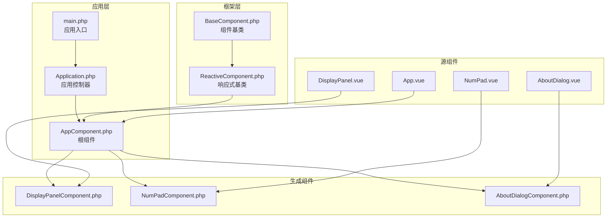
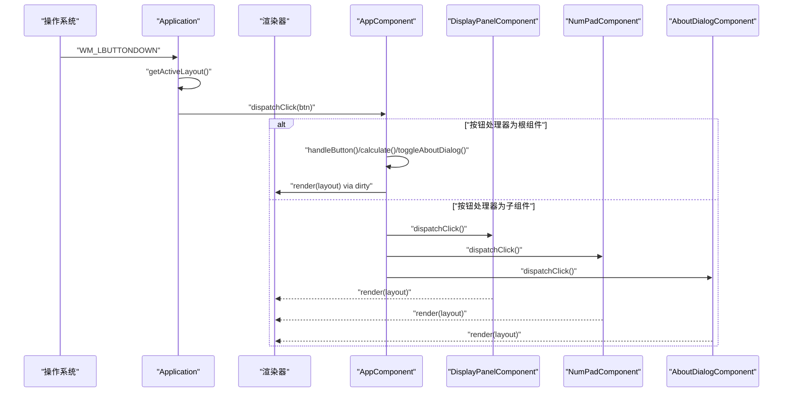
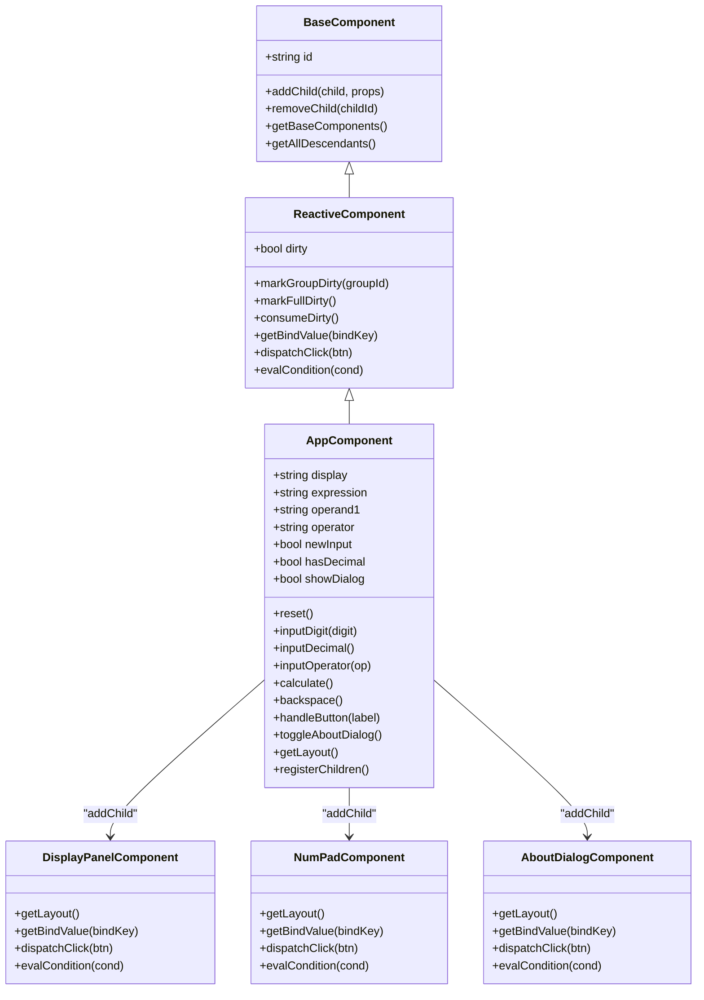
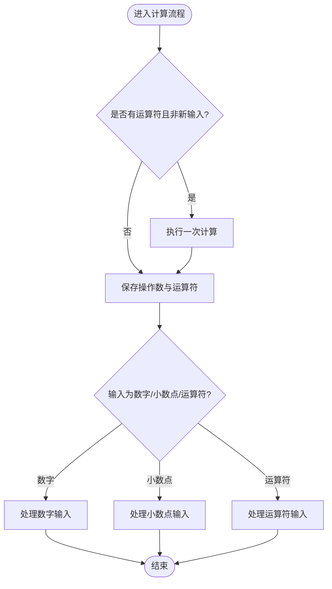
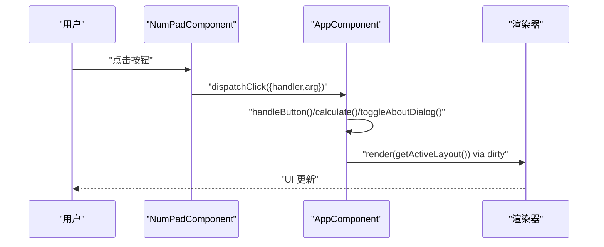
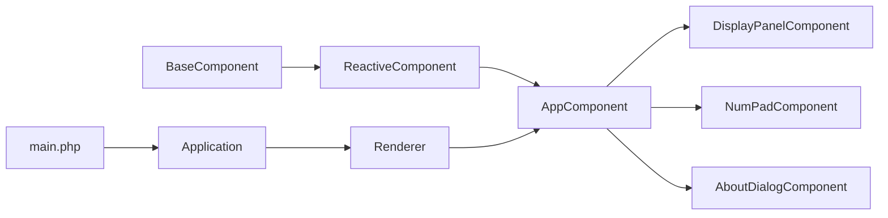

# 计算器应用实例

<cite>
**本文引用的文件**
- [apps/calculator/App.vue](file://apps/calculator/App.vue)
- [apps/calculator/components/DisplayPanel.vue](file://apps/calculator/components/DisplayPanel.vue)
- [apps/calculator/components/NumPad.vue](file://apps/calculator/components/NumPad.vue)
- [apps/calculator/components/AboutDialog.vue](file://apps/calculator/components/AboutDialog.vue)
- [apps/calculator/Application.php](file://apps/calculator/Application.php)
- [apps/calculator/main.php](file://apps/calculator/main.php)
- [framework/BaseComponent.php](file://framework/BaseComponent.php)
- [framework/ReactiveComponent.php](file://framework/ReactiveComponent.php)
- [apps/calculator/gen/AppComponent.php](file://apps/calculator/gen/AppComponent.php)
- [apps/calculator/gen/DisplayPanelComponent.php](file://apps/calculator/gen/DisplayPanelComponent.php)
- [apps/calculator/gen/NumPadComponent.php](file://apps/calculator/gen/NumPadComponent.php)
- [apps/calculator/gen/AboutDialogComponent.php](file://apps/calculator/gen/AboutDialogComponent.php)
</cite>

## 目录
1. [简介](#简介)
2. [项目结构](#项目结构)
3. [核心组件](#核心组件)
4. [架构总览](#架构总览)
5. [详细组件分析](#详细组件分析)
6. [依赖关系分析](#依赖关系分析)
7. [性能考虑](#性能考虑)
8. [故障排除指南](#故障排除指南)
9. [结论](#结论)
10. [附录](#附录)

## 简介
本指南面向希望基于 VueCalc 计算器应用进行开发与扩展的工程师，系统讲解其架构设计、组件组织、数据流与事件处理机制，并提供样式系统、主题定制与响应式布局的实现要点。文档同时给出扩展建议，如添加更多运算符、历史记录等。

## 项目结构
VueCalc 采用 SFC（单文件组件）与 AOT（Ahead-of-Time）编译链路，入口位于应用层，框架层提供组件基类与渲染管线，生成器将 .vue 文件编译为 PHP 组件类，最终输出可执行程序。

**图表来源**
- [apps/calculator/main.php:19-48](file://apps/calculator/main.php#L19-L48)
- [apps/calculator/Application.php:32-76](file://apps/calculator/Application.php#L32-L76)
- [apps/calculator/gen/AppComponent.php:676-701](file://apps/calculator/gen/AppComponent.php#L676-L701)
- [framework/BaseComponent.php:16-36](file://framework/BaseComponent.php#L16-L36)
- [framework/ReactiveComponent.php:14-35](file://framework/ReactiveComponent.php#L14-L35)

**章节来源**
- [apps/calculator/main.php:19-48](file://apps/calculator/main.php#L19-L48)
- [apps/calculator/Application.php:32-76](file://apps/calculator/Application.php#L32-L76)
- [apps/calculator/gen/AppComponent.php:676-701](file://apps/calculator/gen/AppComponent.php#L676-L701)

## 核心组件
- 根组件：负责状态管理与业务逻辑，包括显示值、表达式、操作数与运算符、小数点状态、对话框状态等；提供数字输入、小数点输入、运算符输入、计算、退格、重置与关于对话框切换等方法。
- 子组件：
  - 显示面板：渲染当前显示值与表达式文本。
  - 数字键盘：提供按钮网格与点击事件分发。
  - 关于对话框：半透明覆盖与信息面板，支持关闭。

这些组件通过布局数据与条件渲染实现层次化显示与交互。

**章节来源**
- [apps/calculator/App.vue:27-63](file://apps/calculator/App.vue#L27-L63)
- [apps/calculator/App.vue:65-193](file://apps/calculator/App.vue#L65-L193)
- [apps/calculator/components/DisplayPanel.vue:1-12](file://apps/calculator/components/DisplayPanel.vue#L1-L12)
- [apps/calculator/components/NumPad.vue:1-37](file://apps/calculator/components/NumPad.vue#L1-L37)
- [apps/calculator/components/AboutDialog.vue:1-37](file://apps/calculator/components/AboutDialog.vue#L1-L37)

## 架构总览
应用采用“数据驱动 + 组件树”的架构模式：
- 数据驱动：组件状态变更后设置脏标记，渲染器仅在需要时重绘。
- 组件树：根组件注册并挂载子组件，应用控制器负责窗口初始化、事件循环与点击分发。
- 事件循环：捕获鼠标点击，按层级进行命中测试，将点击事件分发到根组件，再由根组件路由到对应子组件或自身逻辑。

**图表来源**
- [apps/calculator/Application.php:205-261](file://apps/calculator/Application.php#L205-L261)
- [apps/calculator/Application.php:269-321](file://apps/calculator/Application.php#L269-L321)
- [apps/calculator/gen/AppComponent.php:731-750](file://apps/calculator/gen/AppComponent.php#L731-L750)
- [apps/calculator/gen/DisplayPanelComponent.php:70-73](file://apps/calculator/gen/DisplayPanelComponent.php#L70-L73)
- [apps/calculator/gen/NumPadComponent.php:311-327](file://apps/calculator/gen/NumPadComponent.php#L311-L327)
- [apps/calculator/gen/AboutDialogComponent.php:178-185](file://apps/calculator/gen/AboutDialogComponent.php#L178-L185)

**章节来源**
- [apps/calculator/Application.php:205-261](file://apps/calculator/Application.php#L205-L261)
- [apps/calculator/Application.php:269-321](file://apps/calculator/Application.php#L269-L321)
- [apps/calculator/gen/AppComponent.php:731-750](file://apps/calculator/gen/AppComponent.php#L731-L750)

## 详细组件分析

### 根组件 AppComponent 与 App.vue 的关系
- 生成的 AppComponent 将 App.vue 的模板与脚本编译为 PHP 类，包含状态字段与业务方法，并生成布局数据与按钮映射。
- 根组件负责：
  - 状态管理：display、expression、operand1、operator、newInput、hasDecimal、showDialog 等。
  - 用户输入处理：handleButton() 路由到具体方法。
  - 计算逻辑：inputDigit、inputDecimal、inputOperator、calculate、backspace、reset。
  - 条件渲染：根据表达式与对话框状态控制元素显示。
  - 脏标记：每次状态更新后设置 $this->dirty=true，触发重绘。

**图表来源**
- [framework/ReactiveComponent.php:14-90](file://framework/ReactiveComponent.php#L14-L90)
- [framework/BaseComponent.php:16-177](file://framework/BaseComponent.php#L16-L177)
- [apps/calculator/gen/AppComponent.php:11-787](file://apps/calculator/gen/AppComponent.php#L11-L787)
- [apps/calculator/gen/DisplayPanelComponent.php:11-84](file://apps/calculator/gen/DisplayPanelComponent.php#L11-L84)
- [apps/calculator/gen/NumPadComponent.php:11-338](file://apps/calculator/gen/NumPadComponent.php#L11-L338)
- [apps/calculator/gen/AboutDialogComponent.php:11-216](file://apps/calculator/gen/AboutDialogComponent.php#L11-L216)

**章节来源**
- [apps/calculator/gen/AppComponent.php:11-787](file://apps/calculator/gen/AppComponent.php#L11-L787)
- [framework/ReactiveComponent.php:14-90](file://framework/ReactiveComponent.php#L14-L90)
- [framework/BaseComponent.php:16-177](file://framework/BaseComponent.php#L16-L177)

### 计算器核心逻辑
- 数字输入处理：区分“新输入”与继续输入，避免前置零重复拼接；小数点仅允许一次。
- 运算符处理：若已有运算符且非新输入，则先执行一次计算；保存第一个操作数与运算符，更新表达式显示。
- 表达式计算：支持加减乘除，除零时清空状态并显示错误；结果整数以整型形式显示，否则格式化保留合适精度。
- 退格与重置：退格删除最后一位，遇到小数点同步清除小数状态；重置恢复初始状态。
- 错误处理：除零检测与状态清理，确保后续输入正常。

**图表来源**
- [apps/calculator/App.vue:65-193](file://apps/calculator/App.vue#L65-L193)

**章节来源**
- [apps/calculator/App.vue:65-193](file://apps/calculator/App.vue#L65-L193)

### 用户界面与交互
- 显示面板：右对齐大字体显示当前值，顶部左上角显示表达式文本。
- 数字键盘：网格布局，颜色区分数字、运算符、等号与功能键；点击事件通过按钮 handler 路由到根组件。
- 关于对话框：半透明覆盖层与信息面板，支持关闭按钮；通过条件渲染控制显示与隐藏。
- 事件处理：Application 的点击分发器按层级命中测试，将点击事件路由到对应组件的 dispatchClick。

**图表来源**
- [apps/calculator/gen/NumPadComponent.php:311-327](file://apps/calculator/gen/NumPadComponent.php#L311-L327)
- [apps/calculator/gen/AppComponent.php:731-750](file://apps/calculator/gen/AppComponent.php#L731-L750)
- [apps/calculator/Application.php:269-321](file://apps/calculator/Application.php#L269-L321)

**章节来源**
- [apps/calculator/components/DisplayPanel.vue:1-12](file://apps/calculator/components/DisplayPanel.vue#L1-L12)
- [apps/calculator/components/NumPad.vue:1-37](file://apps/calculator/components/NumPad.vue#L1-L37)
- [apps/calculator/components/AboutDialog.vue:1-37](file://apps/calculator/components/AboutDialog.vue#L1-L37)
- [apps/calculator/gen/NumPadComponent.php:311-327](file://apps/calculator/gen/NumPadComponent.php#L311-L327)
- [apps/calculator/gen/AppComponent.php:731-750](file://apps/calculator/gen/AppComponent.php#L731-L750)

### 样式系统与主题定制
- 根组件样式：应用背景、显示面板背景、表达式文本、显示文本、功能按钮样式。
- 子组件样式：显示面板文本样式、数字/运算符/等号/功能键颜色。
- 主题定制建议：通过修改颜色常量与字体属性实现主题切换；保持组件内样式与布局分离，便于维护。

**章节来源**
- [apps/calculator/App.vue:196-203](file://apps/calculator/App.vue#L196-L203)
- [apps/calculator/components/DisplayPanel.vue:8-11](file://apps/calculator/components/DisplayPanel.vue#L8-L11)
- [apps/calculator/components/NumPad.vue:31-36](file://apps/calculator/components/NumPad.vue#L31-L36)
- [apps/calculator/components/AboutDialog.vue:28-36](file://apps/calculator/components/AboutDialog.vue#L28-L36)

### 响应式设计与布局
- 组件树与偏移：子组件通过 props 的 x/y 偏移叠加到布局数据中，形成相对定位的组件树。
- 条件渲染：通过条件表达式控制元素与按钮的显示/隐藏，如表达式文本与关于对话框。
- 层级与命中测试：按钮按 layer 排序，最高层优先，逆序命中测试，保证覆盖层正确响应。

**章节来源**
- [apps/calculator/gen/AppComponent.php:194-670](file://apps/calculator/gen/AppComponent.php#L194-L670)
- [apps/calculator/Application.php:143-200](file://apps/calculator/Application.php#L143-L200)
- [apps/calculator/Application.php:269-321](file://apps/calculator/Application.php#L269-L321)

## 依赖关系分析
- 组件依赖：AppComponent 作为根组件，持有三个子组件实例；子组件不持有父组件引用，仅通过布局数据与事件分发交互。
- 框架依赖：BaseComponent 提供组件树结构与生命周期钩子；ReactiveComponent 提供脏标记与绑定值查询接口。
- 应用依赖：Application 负责窗口初始化、事件循环、布局收集与渲染器集成。

**图表来源**
- [framework/BaseComponent.php:16-177](file://framework/BaseComponent.php#L16-L177)
- [framework/ReactiveComponent.php:14-90](file://framework/ReactiveComponent.php#L14-L90)
- [apps/calculator/gen/AppComponent.php:11-787](file://apps/calculator/gen/AppComponent.php#L11-L787)
- [apps/calculator/Application.php:32-76](file://apps/calculator/Application.php#L32-L76)

**章节来源**
- [framework/BaseComponent.php:16-177](file://framework/BaseComponent.php#L16-L177)
- [framework/ReactiveComponent.php:14-90](file://framework/ReactiveComponent.php#L14-L90)
- [apps/calculator/gen/AppComponent.php:11-787](file://apps/calculator/gen/AppComponent.php#L11-L787)
- [apps/calculator/Application.php:32-76](file://apps/calculator/Application.php#L32-L76)

## 性能考虑
- 脏标记驱动渲染：仅在状态变更后重绘，减少不必要的绘制开销。
- AOT 编译：模板与布局数据在编译期生成，运行时直接消费，降低解析成本。
- 命中测试优化：按层级与条件过滤，减少无效命中尝试。
- 浮点计算与格式化：结果整数快速路径与精度裁剪，避免冗余小数位。

[本节为通用性能讨论，无需列出具体文件来源]

## 故障排除指南
- 除零错误：当除数为零时，显示错误并清理状态，确保后续输入正常。
- 状态异常：检查 newInput、hasDecimal 与 operator 的一致性，避免重复小数点或运算符冲突。
- 事件未响应：确认按钮 handler 与参数正确，以及条件表达式满足显示条件。
- 渲染不更新：确保状态变更后设置脏标记，或检查渲染器是否被正确调用。

**章节来源**
- [apps/calculator/App.vue:125-134](file://apps/calculator/App.vue#L125-L134)
- [apps/calculator/gen/AppComponent.php:116-126](file://apps/calculator/gen/AppComponent.php#L116-L126)

## 结论
VueCalc 通过清晰的组件分层、数据驱动与 AOT 编译，实现了简洁高效的桌面计算器应用。根组件集中处理业务逻辑，子组件专注 UI 与交互，应用控制器统一管理事件与渲染。该架构易于扩展，可按需添加新运算符、历史记录、主题切换等功能。

[本节为总结性内容，无需列出具体文件来源]

## 附录

### 扩展建议
- 新增运算符：在根组件与子组件按钮中增加对应标签与处理器，扩展计算逻辑分支。
- 历史记录：引入数组存储表达式与结果，新增历史面板组件与翻页/清空功能。
- 主题系统：抽取颜色与字体变量，提供明暗主题切换，动态更新样式类。
- 响应式布局：根据窗口尺寸调整组件尺寸与间距，适配不同分辨率。

[本节为概念性扩展建议，无需列出具体文件来源]