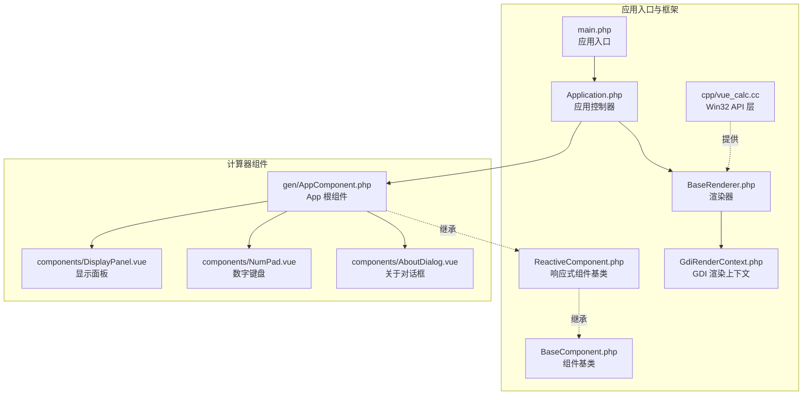
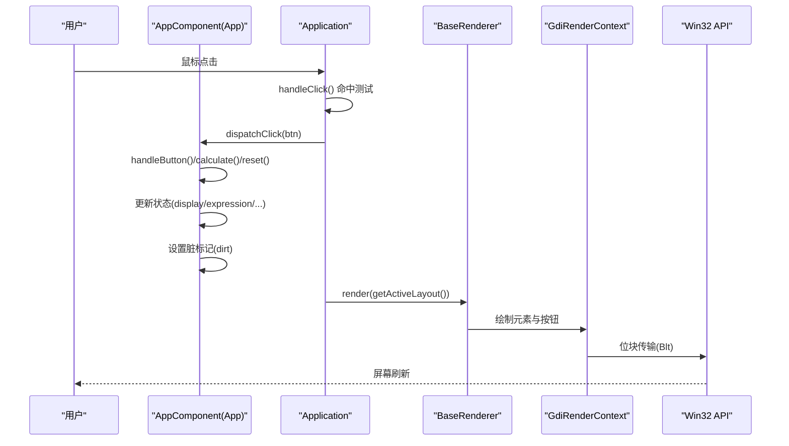
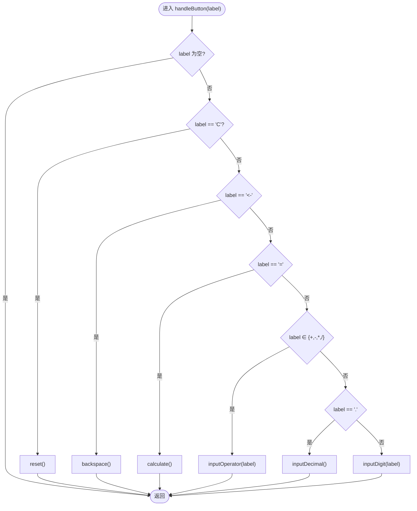
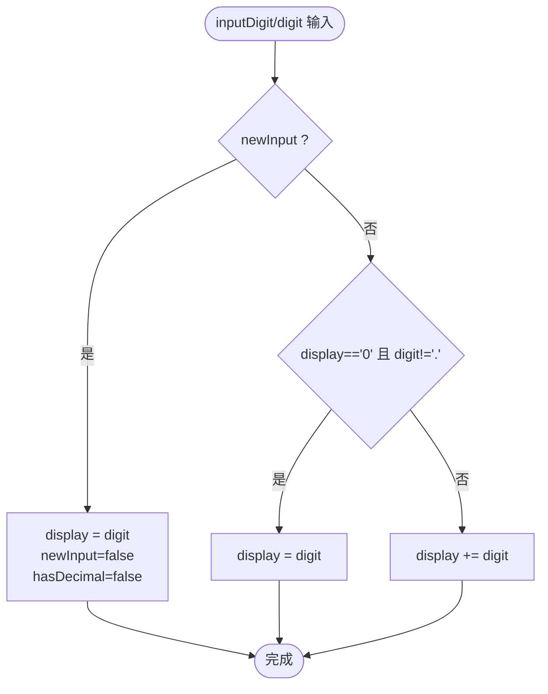
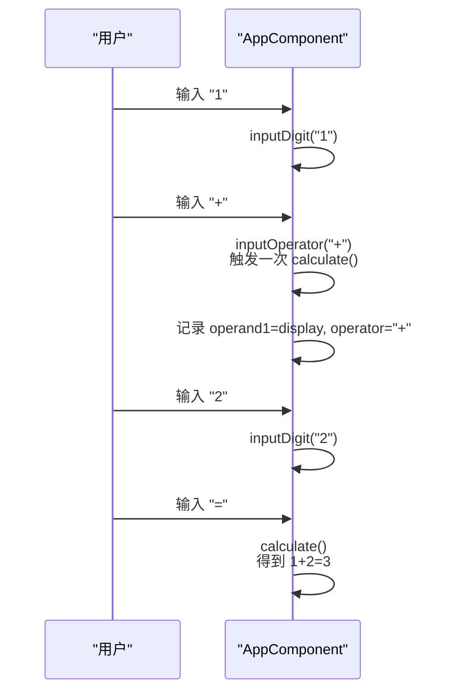
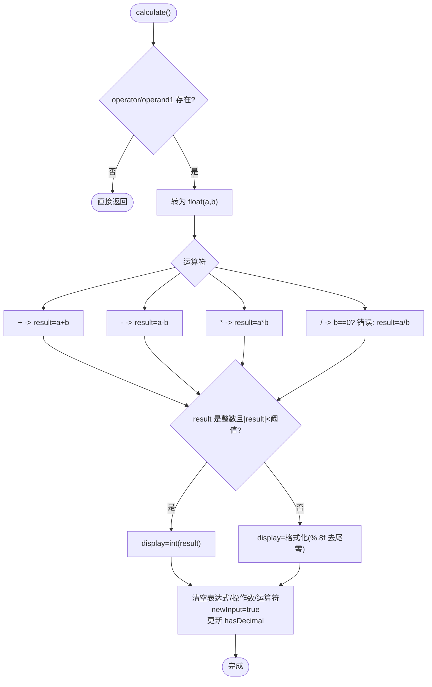
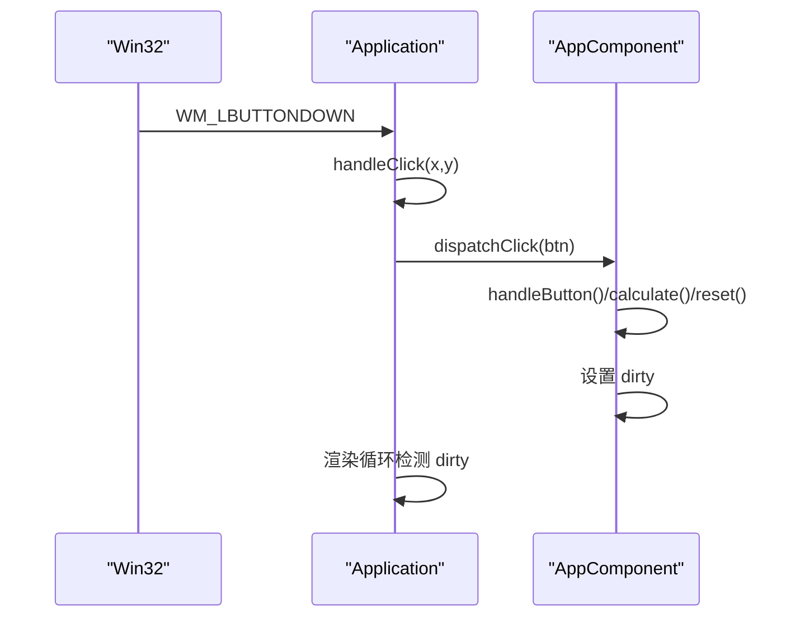
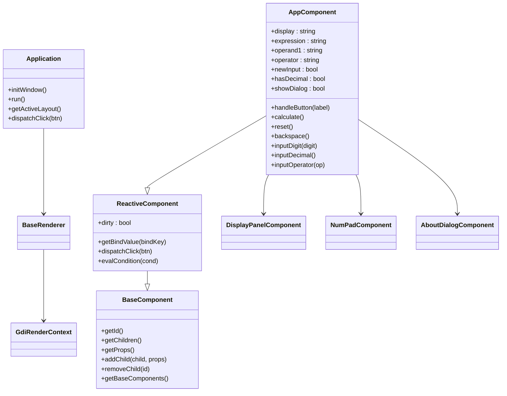

# 计算器核心逻辑

<cite>
**本文引用的文件**
- [apps/calculator/App.vue](file://apps/calculator/App.vue)
- [apps/calculator/Application.php](file://apps/calculator/Application.php)
- [apps/calculator/main.php](file://apps/calculator/main.php)
- [apps/calculator/components/DisplayPanel.vue](file://apps/calculator/components/DisplayPanel.vue)
- [apps/calculator/components/NumPad.vue](file://apps/calculator/components/NumPad.vue)
- [apps/calculator/components/AboutDialog.vue](file://apps/calculator/components/AboutDialog.vue)
- [apps/calculator/gen/AppComponent.php](file://apps/calculator/gen/AppComponent.php)
- [apps/calculator/gen/constants.php](file://apps/calculator/gen/constants.php)
- [framework/BaseComponent.php](file://framework/BaseComponent.php)
- [framework/ReactiveComponent.php](file://framework/ReactiveComponent.php)
- [framework/BaseRenderer.php](file://framework/BaseRenderer.php)
- [framework/rendering/GdiRenderContext.php](file://framework/rendering/GdiRenderContext.php)
- [cpp/vue_calc.cc](file://cpp/vue_calc.cc)
</cite>

## 目录
1. [简介](#简介)
2. [项目结构](#项目结构)
3. [核心组件](#核心组件)
4. [架构总览](#架构总览)
5. [详细组件分析](#详细组件分析)
6. [依赖关系分析](#依赖关系分析)
7. [性能考虑](#性能考虑)
8. [故障排除指南](#故障排除指南)
9. [结论](#结论)
10. [附录](#附录)

## 简介
本指南聚焦于计算器应用的核心逻辑实现，涵盖以下方面：
- 数字输入处理：单个数字与小数点的输入规则、输入状态切换与边界处理
- 运算符优先级：当前实现采用“遇新运算符即结算”的策略，非标准数学优先级
- 表达式计算：加减乘除四则运算、除零保护、结果格式化与精度控制
- 结果格式化：整数与浮点数的显示策略、尾随零去除
- 状态管理：操作数存储、运算符栈、表达式缓存、错误状态与输入模式
- 计算流程：连续计算、错误处理、边界条件与精度控制
- 用户交互：按键响应、输入验证、撤销（退格）、重置与关于对话框
- 算法优化与扩展：添加新运算符、支持科学计算、性能优化建议

## 项目结构
该计算器基于“SFC 数据驱动桌面框架”，采用 PHP 实现业务逻辑，C++ 提供 Win32 API 渲染层，组件树由框架统一管理与渲染。

**图表来源**
- [apps/calculator/main.php:19-48](file://apps/calculator/main.php#L19-L48)
- [apps/calculator/Application.php:32-76](file://apps/calculator/Application.php#L32-L76)
- [apps/calculator/gen/AppComponent.php:11-11](file://apps/calculator/gen/AppComponent.php#L11-L11)
- [framework/BaseComponent.php:16-36](file://framework/BaseComponent.php#L16-L36)
- [framework/ReactiveComponent.php:14-35](file://framework/ReactiveComponent.php#L14-L35)
- [framework/BaseRenderer.php](file://framework/BaseRenderer.php)
- [framework/rendering/GdiRenderContext.php](file://framework/rendering/GdiRenderContext.php)
- [cpp/vue_calc.cc:35-84](file://cpp/vue_calc.cc#L35-L84)

**章节来源**
- [apps/calculator/main.php:19-48](file://apps/calculator/main.php#L19-L48)
- [apps/calculator/Application.php:32-76](file://apps/calculator/Application.php#L32-L76)
- [framework/BaseComponent.php:16-36](file://framework/BaseComponent.php#L16-L36)
- [framework/ReactiveComponent.php:14-35](file://framework/ReactiveComponent.php#L14-L35)
- [framework/BaseRenderer.php](file://framework/BaseRenderer.php)
- [framework/rendering/GdiRenderContext.php](file://framework/rendering/GdiRenderContext.php)
- [cpp/vue_calc.cc:35-84](file://cpp/vue_calc.cc#L35-L84)

## 核心组件
- 根组件与状态
  - 显示值、表达式、第一个操作数、当前运算符、新输入标志、是否有小数点、关于对话框开关等
  - 通过脏标记驱动渲染更新
- 数字键盘与显示面板
  - 键盘网格布局与按钮事件映射
  - 显示面板绑定显示值与表达式
- 应用控制器
  - 窗口初始化、事件循环、点击分发、布局收集与渲染调度

**章节来源**
- [apps/calculator/App.vue:27-52](file://apps/calculator/App.vue#L27-L52)
- [apps/calculator/gen/AppComponent.php:13-39](file://apps/calculator/gen/AppComponent.php#L13-L39)
- [apps/calculator/components/DisplayPanel.vue:1-12](file://apps/calculator/components/DisplayPanel.vue#L1-L12)
- [apps/calculator/components/NumPad.vue:1-37](file://apps/calculator/components/NumPad.vue#L1-L37)
- [apps/calculator/Application.php:205-261](file://apps/calculator/Application.php#L205-L261)

## 架构总览
计算器采用“组件树 + 响应式状态 + 数据驱动渲染”的架构。根组件负责状态与计算逻辑，子组件负责展示与交互；应用控制器负责窗口与事件循环，渲染器根据布局数据进行绘制。

**图表来源**
- [apps/calculator/Application.php:269-321](file://apps/calculator/Application.php#L269-L321)
- [apps/calculator/gen/AppComponent.php:162-181](file://apps/calculator/gen/AppComponent.php#L162-L181)
- [framework/BaseRenderer.php](file://framework/BaseRenderer.php)
- [framework/rendering/GdiRenderContext.php](file://framework/rendering/GdiRenderContext.php)
- [cpp/vue_calc.cc:105-117](file://cpp/vue_calc.cc#L105-L117)

## 详细组件分析

### 根组件状态与计算流程
- 状态字段
  - 显示值、表达式、第一个操作数、当前运算符、新输入标志、是否有小数点、关于对话框开关
- 输入处理
  - 数字输入：遇到新输入则替换显示值；否则追加；特殊处理“0”开头的小数点
  - 小数点输入：新输入时前置“0.”；若尚未输入小数点则追加“.”
- 运算符处理
  - 若已有运算符且非新输入，则先执行一次计算
  - 记录第一个操作数与运算符，设置表达式显示，进入新输入模式
- 计算执行
  - 四则运算：加减乘除
  - 除零保护：出现除以0时显示错误并清空状态
  - 结果格式化：整数或绝对值超阈值时显示整数；否则保留固定小数位并去除尾随零
  - 清空表达式与中间状态，进入新输入模式
- 退格处理
  - 新输入或错误状态下不可退格
  - 单字符时恢复“0”并进入新输入；末位为小数点时清除小数点标记
- 按钮分发
  - 重置、退格、计算、运算符、小数点、数字分别调用对应方法

**图表来源**
- [apps/calculator/App.vue:167-186](file://apps/calculator/App.vue#L167-L186)
- [apps/calculator/gen/AppComponent.php:162-181](file://apps/calculator/gen/AppComponent.php#L162-L181)

**章节来源**
- [apps/calculator/App.vue:54-186](file://apps/calculator/App.vue#L54-L186)
- [apps/calculator/gen/AppComponent.php:40-181](file://apps/calculator/gen/AppComponent.php#L40-L181)

### 数字输入与小数点处理
- 新输入模式
  - 数字输入：直接替换显示值
  - 小数点输入：前置“0.”并标记有小数点
- 非新输入模式
  - “0”开头的数字输入：替换为新数字
  - 其他情况：追加到显示值
- 小数点限制
  - 已有小数点时禁止再次输入

**图表来源**
- [apps/calculator/App.vue:65-79](file://apps/calculator/App.vue#L65-L79)
- [apps/calculator/gen/AppComponent.php:52-67](file://apps/calculator/gen/AppComponent.php#L52-L67)

**章节来源**
- [apps/calculator/App.vue:65-92](file://apps/calculator/App.vue#L65-L92)
- [apps/calculator/gen/AppComponent.php:52-81](file://apps/calculator/gen/AppComponent.php#L52-L81)

### 运算符优先级与连续计算
- 当前策略
  - 遇到新的二元运算符时，先结算之前的表达式
  - 仅维护一个运算符与一个操作数，不使用显式运算符栈
- 连续计算
  - 例如：1 + 2 = 3，再按“+”会以3为左操作数继续计算
- 未实现
  - 标准数学运算符优先级（乘除优先于加减）

**图表来源**
- [apps/calculator/App.vue:94-104](file://apps/calculator/App.vue#L94-L104)
- [apps/calculator/App.vue:106-147](file://apps/calculator/App.vue#L106-L147)
- [apps/calculator/gen/AppComponent.php:83-140](file://apps/calculator/gen/AppComponent.php#L83-L140)

**章节来源**
- [apps/calculator/App.vue:94-147](file://apps/calculator/App.vue#L94-L147)
- [apps/calculator/gen/AppComponent.php:83-140](file://apps/calculator/gen/AppComponent.php#L83-L140)

### 表达式计算与结果格式化
- 计算步骤
  - 类型转换：将两个操作数转为浮点数
  - 运算：加减乘除
  - 除零保护：除数为0时显示错误并清空状态
  - 结果格式化：
    - 整数值且绝对值小于阈值：显示为整数
    - 否则：保留固定小数位并去除尾随零
- 状态复位
  - 清空表达式、操作数与运算符，进入新输入模式，更新小数点标记

**图表来源**
- [apps/calculator/App.vue:106-147](file://apps/calculator/App.vue#L106-L147)
- [apps/calculator/gen/AppComponent.php:96-140](file://apps/calculator/gen/AppComponent.php#L96-L140)

**章节来源**
- [apps/calculator/App.vue:106-147](file://apps/calculator/App.vue#L106-L147)
- [apps/calculator/gen/AppComponent.php:96-140](file://apps/calculator/gen/AppComponent.php#L96-L140)

### 用户交互与事件分发
- 按键映射
  - 数字键、小数点、运算符、等号、退格、清除、关于按钮
- 事件流
  - Application 接收消息，命中测试确定最高层按钮，分发到根组件
  - 根组件根据 handler 与参数调用相应方法
- 条件渲染
  - 表达式文本与关于对话框根据状态条件显示

**图表来源**
- [apps/calculator/Application.php:223-321](file://apps/calculator/Application.php#L223-L321)
- [apps/calculator/gen/AppComponent.php:731-750](file://apps/calculator/gen/AppComponent.php#L731-L750)

**章节来源**
- [apps/calculator/Application.php:223-321](file://apps/calculator/Application.php#L223-L321)
- [apps/calculator/gen/AppComponent.php:731-750](file://apps/calculator/gen/AppComponent.php#L731-L750)

### 错误处理与边界条件
- 除零错误
  - 显示错误提示并清空状态，阻止后续计算
- 输入边界
  - 退格：单字符时恢复“0”，末位为小数点时清除小数点标记
  - 小数点：同一输入周期内仅允许一次
  - “0”开头：替换而非前缀拼接
- 精度控制
  - 浮点格式化保留固定小数位并去除尾随零
  - 整数阈值控制避免过大浮点数显示为小数

**章节来源**
- [apps/calculator/App.vue:115-147](file://apps/calculator/App.vue#L115-L147)
- [apps/calculator/App.vue:149-165](file://apps/calculator/App.vue#L149-L165)
- [apps/calculator/gen/AppComponent.php:96-140](file://apps/calculator/gen/AppComponent.php#L96-L140)
- [apps/calculator/gen/AppComponent.php:142-160](file://apps/calculator/gen/AppComponent.php#L142-L160)

### 状态管理机制
- 脏标记驱动
  - 组件状态变更后设置 dirty，渲染器在事件循环中检测并重绘
- 状态字段
  - display、expression、operand1、operator、newInput、hasDecimal、showDialog
- 条件渲染
  - 表达式文本与关于对话框通过条件表达式控制显示

**章节来源**
- [framework/ReactiveComponent.php:19-64](file://framework/ReactiveComponent.php#L19-L64)
- [apps/calculator/App.vue:27-52](file://apps/calculator/App.vue#L27-L52)
- [apps/calculator/gen/AppComponent.php:194-361](file://apps/calculator/gen/AppComponent.php#L194-L361)

## 依赖关系分析

**图表来源**
- [framework/BaseComponent.php:16-177](file://framework/BaseComponent.php#L16-L177)
- [framework/ReactiveComponent.php:14-90](file://framework/ReactiveComponent.php#L14-L90)
- [apps/calculator/gen/AppComponent.php:11-787](file://apps/calculator/gen/AppComponent.php#L11-L787)
- [apps/calculator/Application.php:15-322](file://apps/calculator/Application.php#L15-L322)
- [framework/BaseRenderer.php](file://framework/BaseRenderer.php)
- [framework/rendering/GdiRenderContext.php](file://framework/rendering/GdiRenderContext.php)

**章节来源**
- [framework/BaseComponent.php:16-177](file://framework/BaseComponent.php#L16-L177)
- [framework/ReactiveComponent.php:14-90](file://framework/ReactiveComponent.php#L14-L90)
- [apps/calculator/gen/AppComponent.php:11-787](file://apps/calculator/gen/AppComponent.php#L11-L787)
- [apps/calculator/Application.php:15-322](file://apps/calculator/Application.php#L15-L322)

## 性能考虑
- 渲染优化
  - 脏标记驱动重绘，避免不必要的重绘
  - 事件循环中按固定频率休眠，维持稳定帧率
- 字符串与格式化
  - 使用固定小数位格式化与尾零去除，减少显示抖动
- 浮点运算
  - 仅在计算阶段进行类型转换，避免频繁转换带来的开销
- 建议
  - 对于复杂表达式解析，可引入显式运算符栈与中缀转后缀（Shunting Yard）算法，以支持标准优先级与括号
  - 对于科学计算，可扩展运算符集合与函数库，并增加内存池与缓存策略

[本节为通用性能讨论，无需具体文件引用]

## 故障排除指南
- 无法点击按钮
  - 检查 Application 的点击分发与命中测试逻辑
  - 确认按钮层叠顺序与条件表达式
- 显示异常
  - 检查脏标记是否正确设置与消费
  - 确认渲染器是否在事件循环中被调用
- 除零错误
  - 确认除法分支中的错误处理与状态清空逻辑
- 退格无效
  - 检查新输入与错误状态判断，确认字符长度与小数点标记更新

**章节来源**
- [apps/calculator/Application.php:269-321](file://apps/calculator/Application.php#L269-L321)
- [framework/ReactiveComponent.php:56-64](file://framework/ReactiveComponent.php#L56-L64)
- [apps/calculator/App.vue:115-147](file://apps/calculator/App.vue#L115-L147)
- [apps/calculator/App.vue:149-165](file://apps/calculator/App.vue#L149-L165)

## 结论
该计算器以简洁的状态机与数据驱动渲染为核心，实现了基本的四则运算与连续计算。其设计便于扩展：可通过增加运算符与函数、引入标准优先级与括号支持、以及优化渲染与计算性能，进一步提升用户体验与功能完整性。

[本节为总结性内容，无需具体文件引用]

## 附录

### 算法优化与扩展指导
- 添加新运算符
  - 在按钮布局与事件分发处新增标签与处理器
  - 在计算逻辑中增加分支处理与结果格式化
- 支持科学计算
  - 引入函数库（如三角函数、对数、幂运算），扩展表达式解析器
  - 增加常量与记忆功能（M+, M-, MR, MC）
- 优化计算性能
  - 使用显式运算符栈与后缀表达式求值
  - 减少字符串与浮点转换次数，缓存中间结果
  - 采用更高效的格式化策略与显示更新

[本节为概念性指导，无需具体文件引用]