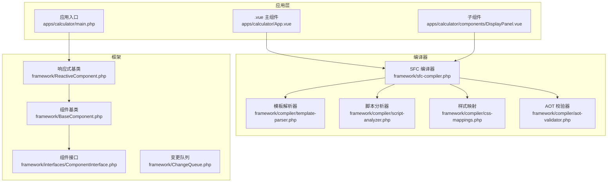
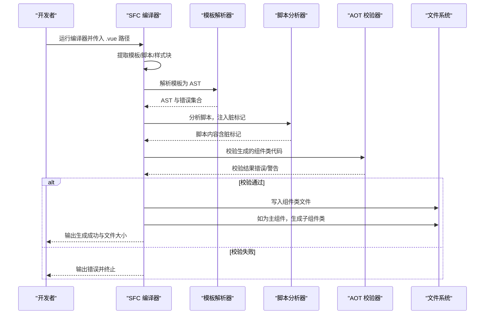
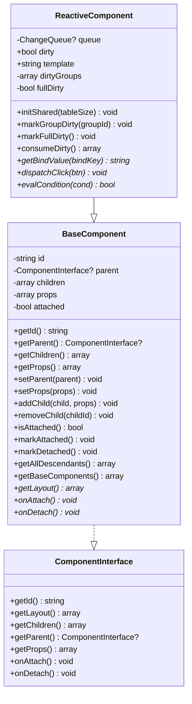
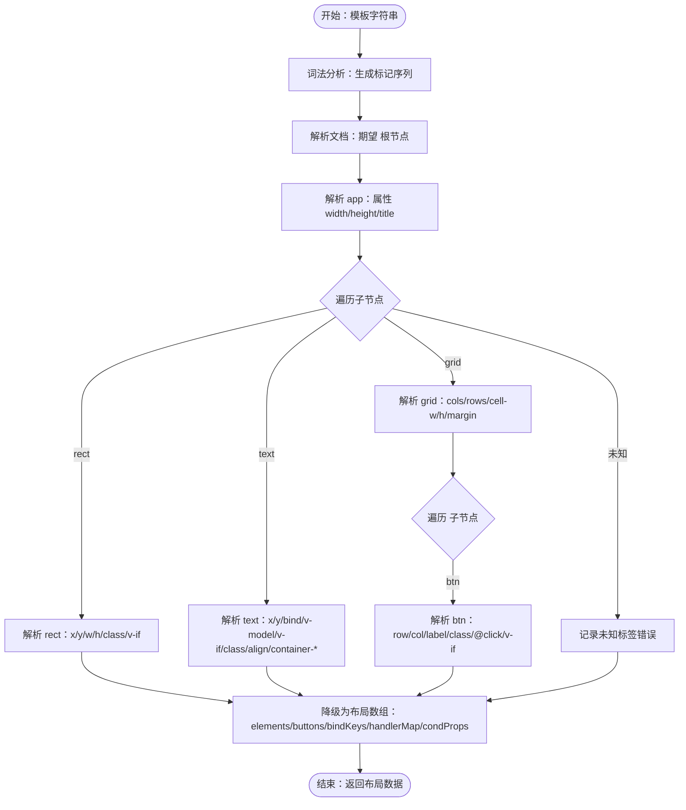
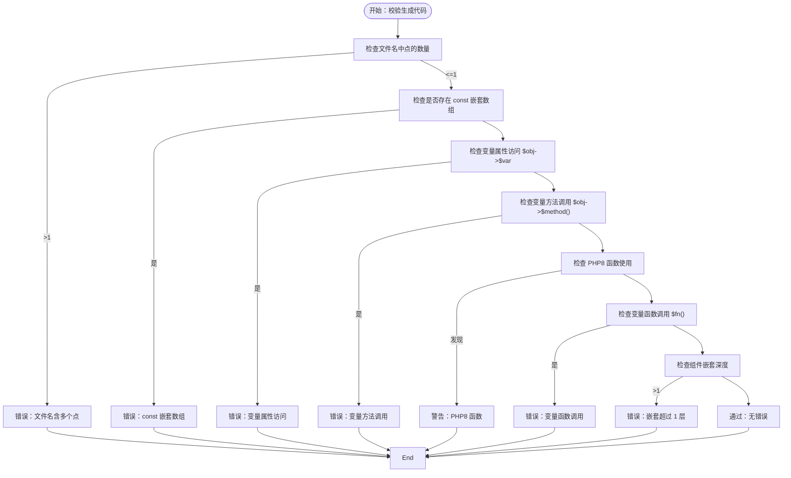
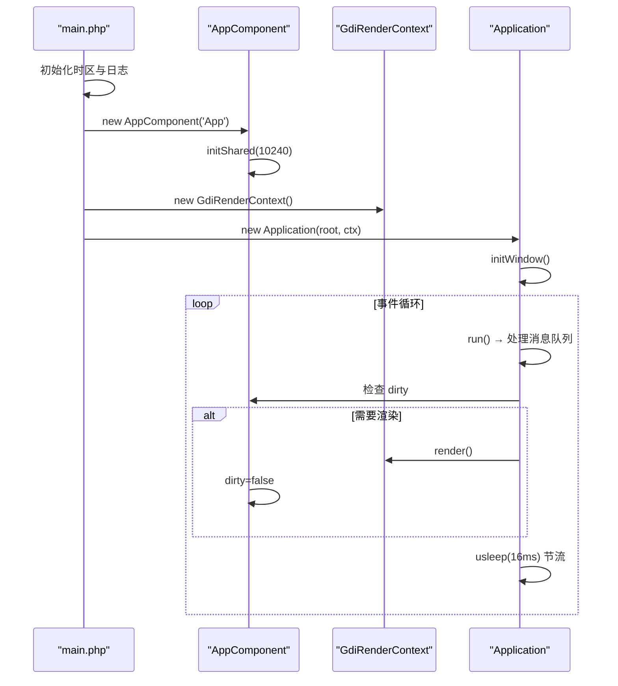
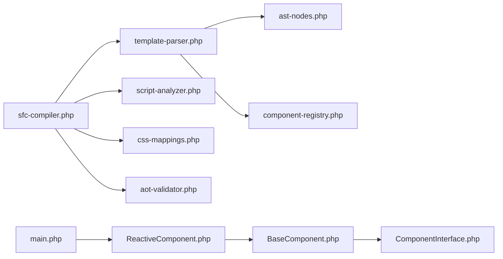

# 调试和故障排除

<cite>
**本文引用的文件**
- [apps/calculator/App.vue](file://apps/calculator/App.vue)
- [apps/calculator/main.php](file://apps/calculator/main.php)
- [apps/calculator/components/DisplayPanel.vue](file://apps/calculator/components/DisplayPanel.vue)
- [framework/sfc-compiler.php](file://framework/sfc-compiler.php)
- [framework/compiler/aot-validator.php](file://framework/compiler/aot-validator.php)
- [framework/compiler/template-parser.php](file://framework/compiler/template-parser.php)
- [framework/compiler/script-analyzer.php](file://framework/compiler/script-analyzer.php)
- [framework/compiler/css-mappings.php](file://framework/compiler/css-mappings.php)
- [framework/BaseComponent.php](file://framework/BaseComponent.php)
- [framework/ReactiveComponent.php](file://framework/ReactiveComponent.php)
- [framework/interfaces/ComponentInterface.php](file://framework/interfaces/ComponentInterface.php)
- [framework/ChangeQueue.php](file://framework/ChangeQueue.php)
- [docs/AOT 文档/调试.html](file://docs/AOT 文档/调试.html)
- [docs/开发经验与教训.md](file://docs/开发经验与教训.md)
</cite>

## 目录
1. [简介](#简介)
2. [项目结构](#项目结构)
3. [核心组件](#核心组件)
4. [架构总览](#架构总览)
5. [详细组件分析](#详细组件分析)
6. [依赖关系分析](#依赖关系分析)
7. [性能考量](#性能考量)
8. [故障排除指南](#故障排除指南)
9. [结论](#结论)
10. [附录](#附录)

## 简介
本指南面向 VueCalc 项目（基于 SFC 编译器与 AOT 编译流程的桌面计算器），提供系统化的调试与故障排除方法。内容涵盖：
- 编译错误与 AOT 兼容性问题的识别与修复
- 运行时异常定位与处理策略
- 性能问题的诊断与优化建议
- 调试工具使用（日志、GDB、内存与性能分析）
- 错误代码参考与预防性措施
- 问题反馈与知识沉淀流程

## 项目结构
VueCalc 采用“.vue 模板 + SFC 编译器 + AOT 编译”的前端式开发范式，核心目录与职责如下：
- apps/calculator：应用入口与组件
  - App.vue：主组件（应用布局、交互逻辑）
  - main.php：应用入口，负责创建根组件、渲染上下文与事件循环
  - components/DisplayPanel.vue：子组件（显示面板）
- framework：渲染与编译框架
  - sfc-compiler.php：SFC 编译器入口，负责解析模板、脚本、样式，生成组件类与布局数据，并进行 AOT 校验
  - compiler/*：编译器模块（模板解析、脚本分析、样式映射、AOT 校验）
  - BaseComponent/ReactiveComponent：组件基类与响应式基类
  - interfaces/ComponentInterface：组件接口
  - ChangeQueue：变更通知队列
- docs：AOT 调试与开发经验文档

**图表来源**
- [apps/calculator/App.vue:1-203](file://apps/calculator/App.vue#L1-L203)
- [apps/calculator/main.php:1-48](file://apps/calculator/main.php#L1-L48)
- [apps/calculator/components/DisplayPanel.vue:1-12](file://apps/calculator/components/DisplayPanel.vue#L1-L12)
- [framework/sfc-compiler.php:1-819](file://framework/sfc-compiler.php#L1-L819)
- [framework/compiler/template-parser.php:1-869](file://framework/compiler/template-parser.php#L1-L869)
- [framework/compiler/script-analyzer.php:1-281](file://framework/compiler/script-analyzer.php#L1-L281)
- [framework/compiler/css-mappings.php:1-210](file://framework/compiler/css-mappings.php#L1-L210)
- [framework/compiler/aot-validator.php:1-207](file://framework/compiler/aot-validator.php#L1-L207)
- [framework/BaseComponent.php:1-177](file://framework/BaseComponent.php#L1-L177)
- [framework/ReactiveComponent.php:1-90](file://framework/ReactiveComponent.php#L1-L90)
- [framework/interfaces/ComponentInterface.php:1-52](file://framework/interfaces/ComponentInterface.php#L1-L52)
- [framework/ChangeQueue.php:1-57](file://framework/ChangeQueue.php#L1-L57)

**章节来源**
- [apps/calculator/App.vue:1-203](file://apps/calculator/App.vue#L1-L203)
- [apps/calculator/main.php:1-48](file://apps/calculator/main.php#L1-L48)
- [apps/calculator/components/DisplayPanel.vue:1-12](file://apps/calculator/components/DisplayPanel.vue#L1-L12)
- [framework/sfc-compiler.php:1-819](file://framework/sfc-compiler.php#L1-L819)

## 核心组件
- 组件接口与基类
  - ComponentInterface：统一组件标识、布局、父子关系与生命周期接口
  - BaseComponent：组件树管理、父子引用、后代收集、挂载状态
  - ReactiveComponent：响应式基类，维护脏标记、分组脏标记与全量脏标记，提供绑定值、点击分发、条件求值等抽象
- 编译器与校验
  - SFC 编译器：提取模板/脚本/样式，解析模板为 AST，生成布局数组，注入脏标记，生成组件类，AOT 校验
  - 模板解析器：递归下降解析，错误收集，AST 降级为布局数组
  - 脚本分析器：自动注入脏标记，移除重复标记
  - AOT 校验器：检查文件名、常量数组、变量属性/方法访问、PHP8 函数、变量函数调用、嵌套深度等
  - 样式映射：CSS 类到 GDI 参数的映射与解析
- 应用入口
  - main.php：创建根组件、渲染上下文、应用控制器，初始化窗口并进入事件循环

**章节来源**
- [framework/interfaces/ComponentInterface.php:1-52](file://framework/interfaces/ComponentInterface.php#L1-L52)
- [framework/BaseComponent.php:1-177](file://framework/BaseComponent.php#L1-L177)
- [framework/ReactiveComponent.php:1-90](file://framework/ReactiveComponent.php#L1-L90)
- [framework/sfc-compiler.php:1-819](file://framework/sfc-compiler.php#L1-L819)
- [framework/compiler/template-parser.php:1-869](file://framework/compiler/template-parser.php#L1-L869)
- [framework/compiler/script-analyzer.php:1-281](file://framework/compiler/script-analyzer.php#L1-L281)
- [framework/compiler/aot-validator.php:1-207](file://framework/compiler/aot-validator.php#L1-L207)
- [framework/compiler/css-mappings.php:1-210](file://framework/compiler/css-mappings.php#L1-L210)
- [apps/calculator/main.php:1-48](file://apps/calculator/main.php#L1-L48)

## 架构总览
SFC 编译流程与 AOT 集成的关键步骤：
- 步骤 1：提取模板/脚本/样式块
- 步骤 2：样式解析为类样式映射
- 步骤 3：模板解析为 AST，组件引用解析与坐标偏移、条件传播
- 步骤 4：AST 降级为布局数组（元素、按钮、绑定键、处理器映射、条件属性）
- 步骤 5：脚本分析，注入脏标记，生成 getBindValue/dispatchClick/evalCondition/getLayout/registerChildren/getBaseComponents 等方法
- 步骤 6：AOT 校验，通过后写入组件类文件；如为主组件且存在子组件，逐个生成子组件类

**图表来源**
- [framework/sfc-compiler.php:226-601](file://framework/sfc-compiler.php#L226-L601)
- [framework/compiler/template-parser.php:82-121](file://framework/compiler/template-parser.php#L82-L121)
- [framework/compiler/script-analyzer.php:27-43](file://framework/compiler/script-analyzer.php#L27-L43)
- [framework/compiler/aot-validator.php:37-121](file://framework/compiler/aot-validator.php#L37-L121)

**章节来源**
- [framework/sfc-compiler.php:226-601](file://framework/sfc-compiler.php#L226-L601)

## 详细组件分析

### 组件类与响应式机制
- ReactiveComponent：维护脏标记与分组脏标记，提供 getBindValue/dispatchClick/evalCondition 抽象，供编译器生成具体实现
- BaseComponent：组件树管理、后代收集、挂载状态切换
- ComponentInterface：统一组件契约，便于 AOT 类型推断与多实现

**图表来源**
- [framework/interfaces/ComponentInterface.php:13-52](file://framework/interfaces/ComponentInterface.php#L13-L52)
- [framework/BaseComponent.php:16-177](file://framework/BaseComponent.php#L16-L177)
- [framework/ReactiveComponent.php:14-90](file://framework/ReactiveComponent.php#L14-L90)

**章节来源**
- [framework/BaseComponent.php:1-177](file://framework/BaseComponent.php#L1-L177)
- [framework/ReactiveComponent.php:1-90](file://framework/ReactiveComponent.php#L1-L90)
- [framework/interfaces/ComponentInterface.php:1-52](file://framework/interfaces/ComponentInterface.php#L1-L52)

### 模板解析与布局生成
- 模板解析器：递归下降解析，支持 app/rect/text/grid/btn 与未知标签处理，错误收集并报告行号
- 布局生成：将 AST 降级为元素数组（rect/text）与按钮数组（含坐标、颜色、字体、处理函数、条件），并收集绑定键与处理器映射

**图表来源**
- [framework/compiler/template-parser.php:124-787](file://framework/compiler/template-parser.php#L124-L787)

**章节来源**
- [framework/compiler/template-parser.php:1-869](file://framework/compiler/template-parser.php#L1-L869)

### AOT 校验规则与典型错误
- 文件名规则：文件名最多一个点（用于生成 C++ 符号）
- 常量数组限制：禁止在生成文件中出现 const 嵌套数组
- 变量属性/方法访问：禁止 $obj->$var、$obj->$method()
- PHP8 函数：str_contains/str_starts_with/str_ends_with/array_is_list 等替换为兼容函数
- 变量函数调用：禁止 $fn()（AOT 类型推断失败）
- 嵌套深度：v5 仅支持 1 层嵌套（parent→child）

**图表来源**
- [framework/compiler/aot-validator.php:37-160](file://framework/compiler/aot-validator.php#L37-L160)

**章节来源**
- [framework/compiler/aot-validator.php:1-207](file://framework/compiler/aot-validator.php#L1-L207)

### 应用入口与事件循环
- main.php：创建根组件 AppComponent，初始化共享资源，创建渲染上下文，构建 Application 并启动事件循环
- 事件循环要点：批量处理 Windows 消息，按帧检测脏标记并渲染，避免频繁渲染导致 CPU 占用

**图表来源**
- [apps/calculator/main.php:19-48](file://apps/calculator/main.php#L19-L48)
- [framework/ReactiveComponent.php:37-64](file://framework/ReactiveComponent.php#L37-L64)

**章节来源**
- [apps/calculator/main.php:1-48](file://apps/calculator/main.php#L1-L48)
- [framework/ReactiveComponent.php:1-90](file://framework/ReactiveComponent.php#L1-L90)

## 依赖关系分析
- 编译器模块耦合
  - sfc-compiler.php 依赖 template-parser.php、script-analyzer.php、css-mappings.php、aot-validator.php
  - template-parser.php 依赖 ast-nodes.php 与 component-registry.php（通过 require_once）
  - script-analyzer.php 与 aot-validator.php 与具体组件类生成无关，但影响生成代码的 AOT 兼容性
- 组件层次
  - ReactiveComponent 继承 BaseComponent，实现 ComponentInterface
  - 应用入口通过 ReactiveComponent 的抽象方法与布局生成协作

**图表来源**
- [framework/sfc-compiler.php:27-36](file://framework/sfc-compiler.php#L27-L36)
- [framework/compiler/template-parser.php:16-18](file://framework/compiler/template-parser.php#L16-L18)
- [framework/ReactiveComponent.php:14-35](file://framework/ReactiveComponent.php#L14-L35)
- [framework/BaseComponent.php:16-36](file://framework/BaseComponent.php#L16-L36)
- [framework/interfaces/ComponentInterface.php:13-52](file://framework/interfaces/ComponentInterface.php#L13-L52)
- [apps/calculator/main.php:19-48](file://apps/calculator/main.php#L19-L48)

**章节来源**
- [framework/sfc-compiler.php:27-36](file://framework/sfc-compiler.php#L27-L36)
- [framework/compiler/template-parser.php:16-18](file://framework/compiler/template-parser.php#L16-L18)
- [framework/ReactiveComponent.php:1-90](file://framework/ReactiveComponent.php#L1-L90)
- [framework/BaseComponent.php:1-177](file://framework/BaseComponent.php#L1-L177)
- [framework/interfaces/ComponentInterface.php:1-52](file://framework/interfaces/ComponentInterface.php#L1-L52)
- [apps/calculator/main.php:1-48](file://apps/calculator/main.php#L1-L48)

## 性能考量
- 渲染节流：事件循环中使用 usleep 控制帧率，避免忙等
- 批量消息处理：内层循环清空消息队列，外层统一渲染，减少频繁重绘
- 布局计算：模板解析与布局数组生成在编译期完成，运行时仅做渲染与脏标记检查
- 变更通知：保留 ChangeQueue 以便未来实现增量渲染（当前未启用）

**章节来源**
- [apps/calculator/main.php:214-234](file://apps/calculator/main.php#L214-L234)
- [framework/ChangeQueue.php:1-57](file://framework/ChangeQueue.php#L1-L57)

## 故障排除指南

### 一、编译错误与 AOT 兼容性问题
- 症状：AOT 校验失败，输出错误/警告
- 常见原因与修复
  - 文件名含多个点：将文件名中的额外点替换为下划线，确保生成的 C++ 符号合法
  - const 嵌套数组：将 const 数组改为函数返回数组
  - 变量属性/方法访问：将 $obj->$var/$obj->$method() 改为显式的 if/else 或路由
  - PHP8 函数：将 str_contains/str_starts_with/str_ends_with/array_is_list 替换为兼容函数（如 strpos、strncmp、substr、array_values）
  - 变量函数调用：将 $fn() 改为显式 if/else 或 match 分派
  - 嵌套超过 1 层：确保组件层级不超过 parent→child

**章节来源**
- [framework/compiler/aot-validator.php:37-160](file://framework/compiler/aot-validator.php#L37-L160)

### 二、模板解析错误
- 症状：模板解析错误列表，包含未知标签、属性缺失、闭合标签不匹配等
- 修复要点
  - 确保根元素为 <app>，并提供 width/height 属性
  - 仅使用受支持的标签：app/rect/text/grid/btn
  - rect 必须提供 class 与非零宽高
  - text 必须提供 class 与 :bind 或 v-model，二者互斥
  - grid 必须包含 <btn> 子节点，且不可自闭合
  - 未知标签会被记录为错误但保留在 AST 中

**章节来源**
- [framework/compiler/template-parser.php:214-544](file://framework/compiler/template-parser.php#L214-L544)

### 三、运行时异常与调试
- AOT 调试工具
  - 仅支持 gdb，需设置优化等级 -O0、开启调试符号 --debug-info，PHPX/PHP 建议 debug 版本
  - 断点函数名前缀为 php_，类方法为 php_{类名}__{方法名}
  - 原生类型可用 print 输出，PHP 类型可用 call var.print()
- 常见运行时错误与根因
  - Cannot redeclare class：AOT 已全量编译，移除顶层 require_once
  - Expression must be a global constant：属性默认值使用了 __DIR__ 等魔术常量
  - Cannot append element to an null：AOT 中 __get/__set 不生效，属性读取为 null
  - Call to undefined function any()：any() 不是 PHP 函数，移除并直接存储值

**章节来源**
- [docs/AOT 文档/调试.html:1-38](file://docs/AOT 文档/调试.html#L1-L38)
- [docs/开发经验与教训.md:22-126](file://docs/开发经验与教训.md#L22-L126)

### 四、脚本分析与脏标记注入
- 症状：修改状态后未触发重绘
- 修复要点
  - 脚本分析器会自动注入脏标记，但需确保组件属性声明为 public 且方法体内确实修改了这些属性
  - 若手动标记脏，确保在每个修改状态的方法末尾设置 $this->dirty = true

**章节来源**
- [framework/compiler/script-analyzer.php:27-43](file://framework/compiler/script-analyzer.php#L27-L43)
- [framework/ReactiveComponent.php:19-64](file://framework/ReactiveComponent.php#L19-L64)

### 五、样式映射与渲染问题
- 症状：文字或背景色未生效
- 修复要点
  - 确保 CSS 类包含 background/color，否则会给出警告
  - 字体大小与粗细按映射规则解析，超出范围将回退默认值

**章节来源**
- [framework/compiler/css-mappings.php:164-194](file://framework/compiler/css-mappings.php#L164-L194)

### 六、组件注册与子组件渲染
- 症状：子组件未显示或报未解析组件
- 修复要点
  - 主组件生成 registerChildren 与 getBaseComponents，确保子组件文件存在且可解析
  - 子组件模板必须包含 <template> 块，否则会记录警告

**章节来源**
- [framework/sfc-compiler.php:534-591](file://framework/sfc-compiler.php#L534-L591)
- [framework/sfc-compiler.php:604-797](file://framework/sfc-compiler.php#L604-L797)

### 七、日志与错误定位流程
- 建议流程
  - 开启控制台输出（no-console=false）
  - 在 handleClick/render 包裹 try-catch，捕获 Throwable 并输出到控制台
  - 每次改动后执行编译与运行，从错误信息反推问题
- 常见错误模式识别
  - 无法重新声明类：移除顶层 require_once
  - 表达式必须为全局常量：将 __DIR__ 等放入构造函数
  - 无法将 X 赋给类型 Z 的属性：避免类型化属性 + 反射赋值
  - 无法将元素附加到 null：属性读取返回 null，检查 __get/__set 在 AOT 中的可靠性

**章节来源**
- [docs/开发经验与教训.md:291-308](file://docs/开发经验与教训.md#L291-L308)

### 八、错误代码参考表
- AOT 校验错误
  - 文件名含多个点：文件名中点数 > 1
  - const 嵌套数组：检测到 const 且值为数组
  - 变量属性访问：$obj->$var
  - 变量方法调用：$obj->$method()
  - PHP8 函数：str_contains/str_starts_with/str_ends_with/array_is_list
  - 变量函数调用：$fn()
  - 嵌套超过 1 层：组件深度 > 1
- 模板解析错误
  - 缺少 <app> 根节点或属性
  - 未知标签
  - rect 缺少 class 或宽高为 0
  - text 缺少 :bind/v-model 或 class
  - grid 自闭合或包含非 <btn> 子节点
- 运行时错误
  - Cannot redeclare class
  - Expression must be a global constant
  - Cannot append element to an null
  - Call to undefined function any()

**章节来源**
- [framework/compiler/aot-validator.php:37-160](file://framework/compiler/aot-validator.php#L37-L160)
- [framework/compiler/template-parser.php:214-544](file://framework/compiler/template-parser.php#L214-L544)
- [docs/开发经验与教训.md:301-307](file://docs/开发经验与教训.md#L301-L307)

### 九、预防性措施与代码质量检查清单
- 编译前检查
  - 文件名仅含一个点
  - 无 const 嵌套数组
  - 无变量属性/方法访问
  - 无变量函数调用
  - 无 PHP8 函数（或已替换为兼容函数）
  - 组件嵌套不超过 1 层
- 模板检查
  - 根元素为 <app>，提供 width/height
  - rect 提供 class 与非零宽高
  - text 提供 class 与 :bind 或 v-model，二者互斥
  - grid 仅包含 <btn> 子节点
- 脚本检查
  - 组件属性声明为 public
  - 修改状态的方法末尾设置 $this->dirty = true
- 样式检查
  - CSS 类包含 background 或 color
- 运行时检查
  - 移除顶层 require_once
  - 将 __DIR__ 等放入构造函数
  - 避免使用 any()/扩展类（Swoole/Table/Atomic 等）

**章节来源**
- [framework/compiler/aot-validator.php:37-160](file://framework/compiler/aot-validator.php#L37-L160)
- [framework/compiler/template-parser.php:335-488](file://framework/compiler/template-parser.php#L335-L488)
- [framework/compiler/script-analyzer.php:27-43](file://framework/compiler/script-analyzer.php#L27-L43)
- [docs/开发经验与教训.md:64-126](file://docs/开发经验与教训.md#L64-L126)

### 十、问题反馈与知识库建设
- 建议流程
  - 记录问题现象、环境信息（PHP 版本、AOT 参数、编译器版本）
  - 提供最小可复现示例（.vue 与相关配置）
  - 附上编译器输出与 AOT 校验报告
  - 在团队知识库中归档，形成“常见问题-根因-修复步骤”三段式记录
- 知识库条目建议
  - AOT 调试工具使用（gdb、断点、符号规则）
  - 常见错误模式与修复步骤
  - 架构演进教训与设计原则
  - SFC 编译器生成代码的白名单与限制

**章节来源**
- [docs/开发经验与教训.md:318-328](file://docs/开发经验与教训.md#L318-L328)
- [docs/AOT 文档/调试.html:1-38](file://docs/AOT 文档/调试.html#L1-L38)

## 结论
VueCalc 的调试与故障排除围绕“编译期预处理 + AOT 白名单约束 + 显式标记”展开。通过 SFC 编译器与 AOT 校验器的协同，将模板解析、布局计算与脏标记注入在编译期完成，运行时仅承担渲染与事件循环，从而获得稳定可靠的桌面应用体验。建议开发者在设计阶段即考虑 AOT 约束，遵循“简单 > 巧妙，显式 > 隐式”的原则，并建立完善的日志与知识库体系。

## 附录
- 调试工具与参数
  - gdb：断点设置为 php_ 前缀函数名，打印原生类型或使用 call var.print()
  - 编译参数：-O0、--debug-info
  - PHPX/PHP：建议使用 debug 版本
- 术语
  - AOT：Ahead-of-Time 编译，将 PHP 编译为原生可执行文件
  - 布局数组：编译期生成的元素与按钮描述，供渲染器直接使用
  - 脏标记：指示组件状态变化，触发重绘

**章节来源**
- [docs/AOT 文档/调试.html:1-38](file://docs/AOT 文档/调试.html#L1-L38)