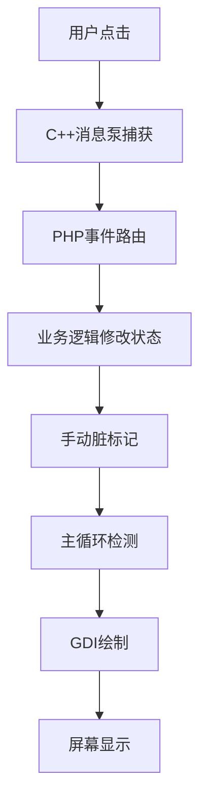
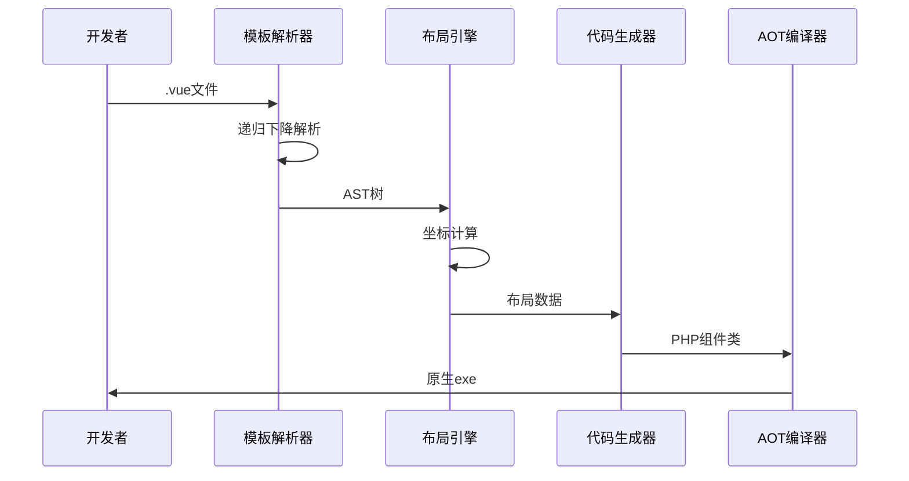
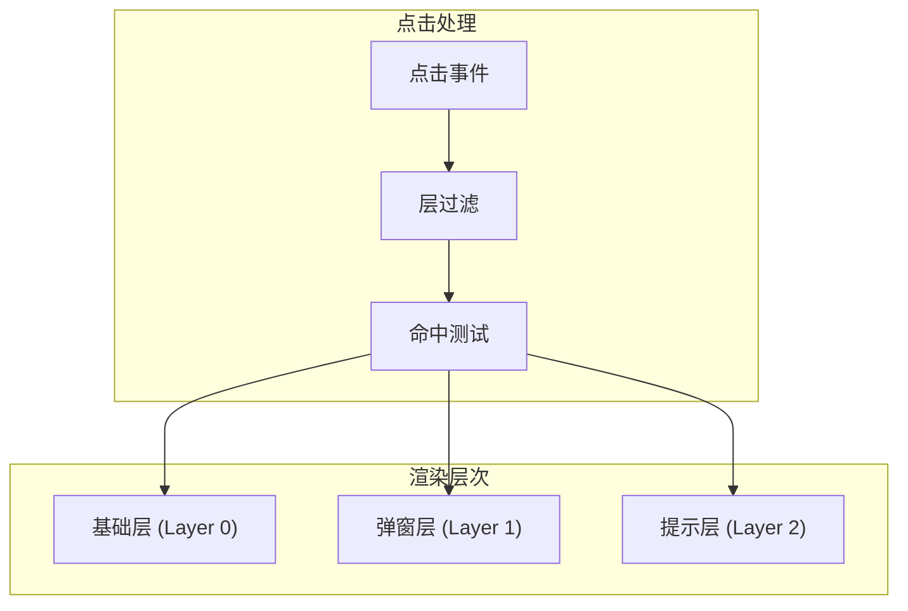
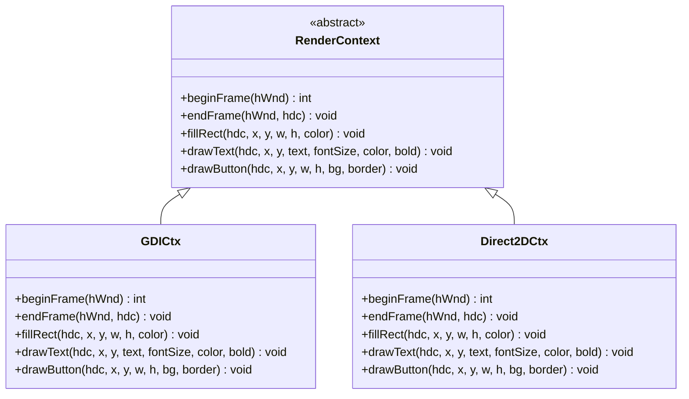
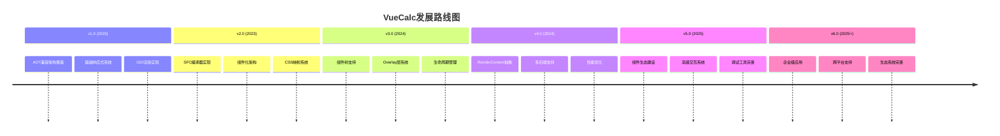

# 发展历程

<cite>
**本文引用的文件**
- [VueCalc技术文档_v1.html](file://docs/VueCalc技术文档_v1.html)
- [VueCalc技术文档_v2.html](file://docs/VueCalc技术文档_v2.html)
- [VueCalc技术规划文档_v3.html](file://docs/VueCalc技术规划文档_v3.html)
- [architecture-roadmap.html](file://docs/architecture-roadmap.html)
- [sfc-compiler.php](file://framework/sfc-compiler.php)
- [template-parser.php](file://framework/compiler/template-parser.php)
- [ast-nodes.php](file://framework/compiler/ast-nodes.php)
- [css-mappings.php](file://framework/compiler/css-mappings.php)
- [aot-validator.php](file://framework/compiler/aot-validator.php)
- [script-analyzer.php](file://framework/compiler/script-analyzer.php)
- [component-resolver.php](file://framework/compiler/component-resolver.php)
- [BaseComponent.php](file://framework/BaseComponent.php)
- [ComponentInterface.php](file://framework/interfaces/ComponentInterface.php)
- [RenderContext.php](file://framework/rendering/RenderContext.php)
</cite>

## 目录
1. [项目概述](#项目概述)
2. [发展历程总览](#发展历程总览)
3. [核心里程碑](#核心里程碑)
4. [技术架构演进](#技术架构演进)
5. [关键挑战与解决方案](#关键挑战与解决方案)
6. [未来发展规划](#未来发展规划)
7. [路线图与实施策略](#路线图与实施策略)
8. [总结](#总结)

## 项目概述

VueCalc是一个基于Swoole AOT编译器的Windows桌面计算器应用，采用PHP/C++混合架构，实现了一套类Vue的数据驱动响应式渲染模型。项目的核心理念是"UI = f(state)"，通过数据驱动的方式实现界面渲染。

项目采用AOT（Ahead-of-Time）编译模式，将PHP代码编译为C++，再通过MSVC链接生成原生exe文件。这种架构既保持了PHP的开发灵活性，又获得了原生应用的性能优势。

## 发展历程总览

VueCalc的发展可以分为四个主要阶段：

### 阶段一：概念验证期（v1.0）
- 实现了基础的AOT兼容响应式架构
- 采用直接属性声明+手动脏标记的模式
- 完成了从点击事件到像素渲染的完整数据流

### 阶段二：SFC编译器实现（v2.0）
- 实现了完整的单文件组件（SFC）编译器
- 支持自定义模板标签和样式映射
- 建立了从.vue到PHP组件的完整编译管道

### 阶段三：组件系统完善（v3.0）
- 引入了组件树支持和生命周期管理
- 实现了overlay层系统解决弹窗遮挡问题
- 建立了统一的架构演进路线

### 阶段四：架构升级（v4.0+）
- 实现了组件化架构和渲染抽象
- 引入了RenderContext后端无关渲染接口
- 为未来的多后端支持奠定基础

## 核心里程碑

### v1.0：AOT兼容架构奠基
**时间范围**：2023年
**核心成就**：
- 成功解决了AOT编译器对魔术方法不支持的问题
- 实现了手动脏标记机制替代自动拦截
- 建立了从事件到渲染的完整数据流

**关键技术突破**：

**图表来源**
- [VueCalc技术文档_v1.html:320-344](file://docs/VueCalc技术文档_v1.html#L320-L344)

### v2.0：SFC编译器实现
**时间范围**：2023年
**核心成就**：
- 实现了递归下降解析器替代正则方案
- 建立了完整的CSS到GDI映射系统
- 支持组件引用和样式解析

**编译器架构**：

**图表来源**
- [sfc-compiler.php:1-50](file://framework/sfc-compiler.php#L1-L50)
- [template-parser.php:1-50](file://framework/compiler/template-parser.php#L1-L50)

### v3.0：组件系统完善
**时间范围**：2024年
**核心成就**：
- 实现了组件树支持和嵌套组件
- 引入了overlay层系统解决弹窗遮挡
- 建立了统一的生命周期管理

**Overlay层系统**：

**图表来源**
- [architecture-roadmap.html:160-245](file://docs/architecture-roadmap.html#L160-L245)

### v4.0+：架构升级
**时间范围**：2024年至今
**核心成就**：
- 实现了组件化架构和接口抽象
- 引入了RenderContext后端无关渲染
- 为多后端支持奠定基础

## 技术架构演进

### 响应式系统演进

**v1.0响应式机制**：
- 直接属性声明：`public string $display = '0'`
- 手动脏标记：`$this->dirty = true`
- 全局脏检查：主循环检测`$calc->dirty`

**v2.0响应式增强**：
- 自动脏标记注入：通过ScriptAnalyzer分析方法
- 组件化架构：BaseComponent基类
- 生命周期管理：onAttach/onDetach钩子

**v3.0响应式完善**：
- 组件树支持：父子组件关系管理
- 条件渲染：v-if指令支持
- 属性绑定：v-model双向绑定

### 渲染系统演进

**GDI渲染阶段**：
- 5个核心GDI原语：fillRect、drawText、drawButton等
- 双缓冲技术：避免闪烁
- 编译时坐标计算：运行时零开销

**RenderContext抽象**：

**图表来源**
- [RenderContext.php:1-30](file://framework/rendering/RenderContext.php#L1-L30)

### 编译器架构演进

**v1.0编译器**：
- 正则表达式解析：简单但脆弱
- 硬编码标签支持：app、rect、text、grid、btn
- 直接数组输出：无AST中间表示

**v2.0编译器**：
- 递归下降解析：稳定的语法分析
- AST节点系统：完整的语法树表示
- 组件引用解析：支持嵌套组件

**v3.0编译器**：
- 组件注册表：动态组件解析
- 属性绑定系统：父子组件通信
- AOT验证：编译前完整性检查

## 关键挑战与解决方案

### AOT编译适配挑战

**挑战1：魔术方法不支持**
- **问题**：Swoole AOT编译器不支持`__get`/`__set`魔术方法
- **解决方案**：采用直接属性声明+手动脏标记模式
- **影响**：每个状态修改方法都需要显式设置`$this->dirty = true`

**挑战2：变量属性访问限制**
- **问题**：AOT不支持`$obj->$var`形式的变量属性访问
- **解决方案**：使用显式的if/else映射替代动态访问
- **影响**：代码生成器需要将动态逻辑转换为静态分支

**挑战3：PHP8函数兼容性**
- **问题**：`str_contains`等PHP8函数在AOT环境下不可用
- **解决方案**：使用`strpos`等兼容函数替代
- **影响**：需要在编译器中进行函数替换检查

### 性能优化挑战

**挑战1：全量GDI重绘**
- **问题**：每次状态变化都进行全量重绘，CPU占用较高
- **解决方案**：引入脏标记系统，仅在数据变化时重绘
- **效果**：空闲时CPU占用接近0%，有变化时约16ms重绘一次

**挑战2：布局计算开销**
- **问题**：复杂的布局计算在运行时进行会影响性能
- **解决方案**：编译时预计算坐标，运行时直接使用
- **效果**：按钮布局从运行时行列计算升级为编译时预计算

### 组件系统设计挑战

**挑战1：组件嵌套深度限制**
- **问题**：AOT编译器对变量类型推断有限，不支持深层嵌套
- **解决方案**：限制组件嵌套深度为1级，使用编译时展开
- **影响**：简化了类型推断，但限制了组件复用能力

**挑战2：生命周期管理**
- **问题**：组件需要挂载/卸载等生命周期钩子
- **解决方案**：引入BaseComponent基类和ComponentInterface接口
- **效果**：统一了组件管理方式，支持动态组件添加/移除

## 未来发展规划

### 短期目标（6个月内）

**v5.0：组件系统完善**
- 实现完整的组件树支持
- 引入keep-alive机制
- 增强条件渲染系统
- 优化属性绑定性能

**v5.1：渲染系统升级**
- 实现RenderContext抽象层
- 支持多种渲染后端
- 引入增量渲染机制
- 优化内存使用效率

### 中期目标（6-12个月）

**v6.0：多后端支持**
- 实现Direct2D渲染后端
- 支持Skia图形库
- 引入Web Canvas后端
- 实现跨平台编译

**v6.1：高级组件系统**
- 实现复杂组合组件
- 支持拖拽交互
- 引入动画系统
- 增强主题系统

### 长期目标（12个月以上）

**v7.0：框架生态建设**
- 实现组件库生态系统
- 支持第三方组件开发
- 建立开发工具链
- 完善文档和教程体系

**v8.0：企业级应用**
- 支持大型桌面应用开发
- 实现模块化架构
- 增强调试和性能分析工具
- 优化部署和分发机制

## 路线图与实施策略

### 分阶段实施策略

**阶段划分原则**：
1. **每步只解决一个问题**：避免功能叠加导致复杂度爆炸
2. **每步都是上一步的自然延伸**：确保技术栈的连贯性
3. **数据结构先于行为变更**：先完善数据结构再实现复杂行为
4. **C++扩展作为分水岭**：v5之前纯PHP改动，v6开始涉及C++层

**实施顺序**：

### 关键决策点

**技术选型决策**：
- 选择AOT编译器而非JIT编译器，确保运行时性能
- 采用PHP作为业务逻辑语言，保持开发效率
- 使用C++作为渲染层，获得最佳性能
- 实现组件化架构，支持复杂应用开发

**架构设计决策**：
- 采用数据驱动渲染模式，简化状态管理
- 实现组件树结构，支持嵌套布局
- 引入生命周期管理，统一组件处理
- 建立编译器管道，自动化代码生成

## 总结

VueCalc项目的发展历程体现了从概念验证到完整框架的完整演进过程。通过解决AOT编译适配、性能优化、组件系统设计等关键挑战，项目建立了稳定的技术架构和清晰的发展路线。

**核心成就**：
- 成功解决了AOT编译器的技术限制
- 建立了完整的SFC编译器管道
- 实现了组件化架构和生命周期管理
- 为多后端支持奠定了技术基础

**未来展望**：
VueCalc将继续沿着组件化、抽象化、多后端支持的道路发展，逐步完善框架生态，为桌面应用开发提供更加完善的解决方案。通过持续的架构演进和技术创新，VueCalc有望成为桌面应用开发的重要技术选择。