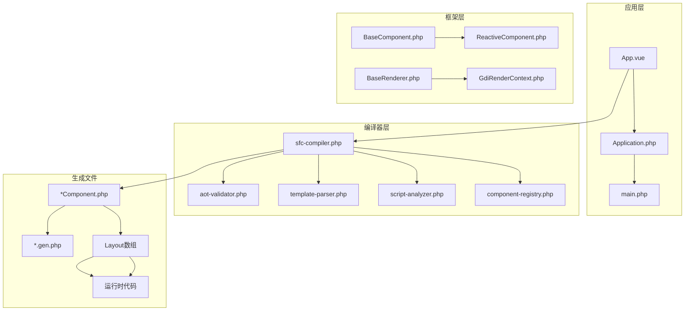
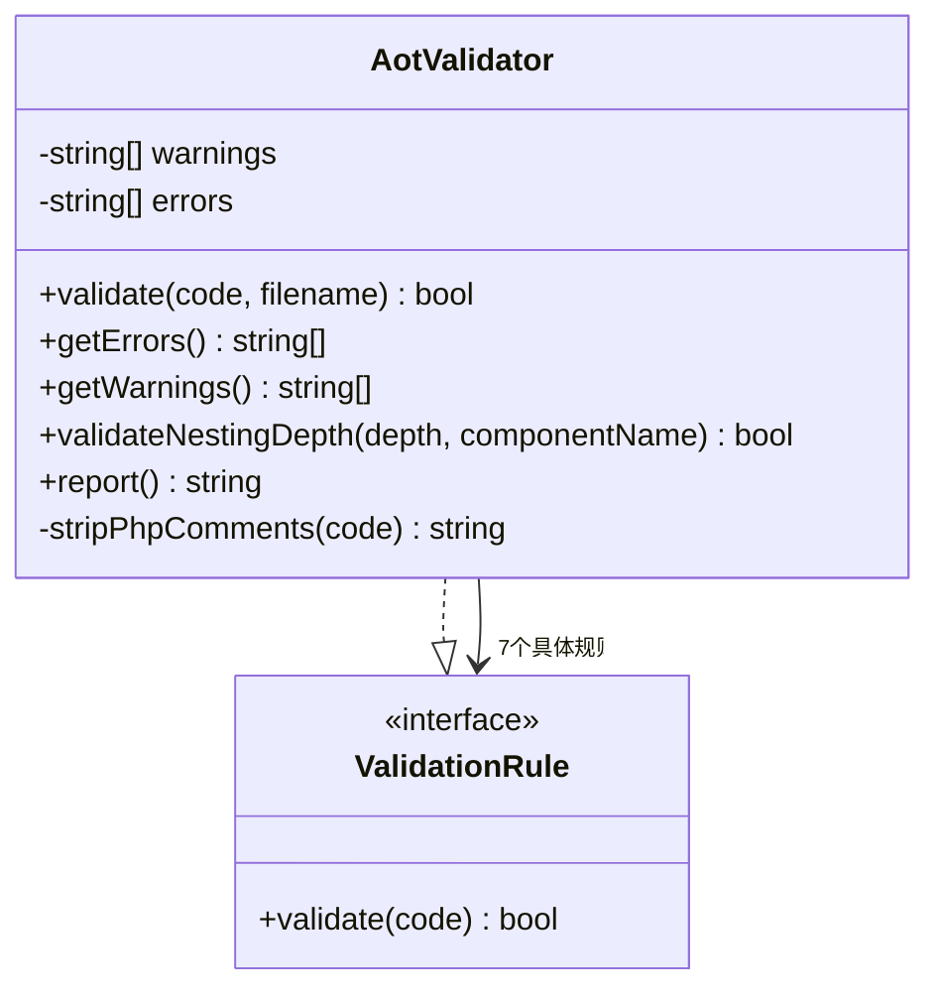
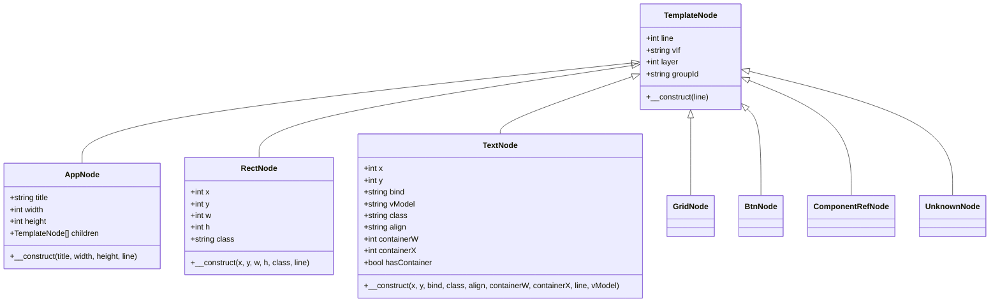
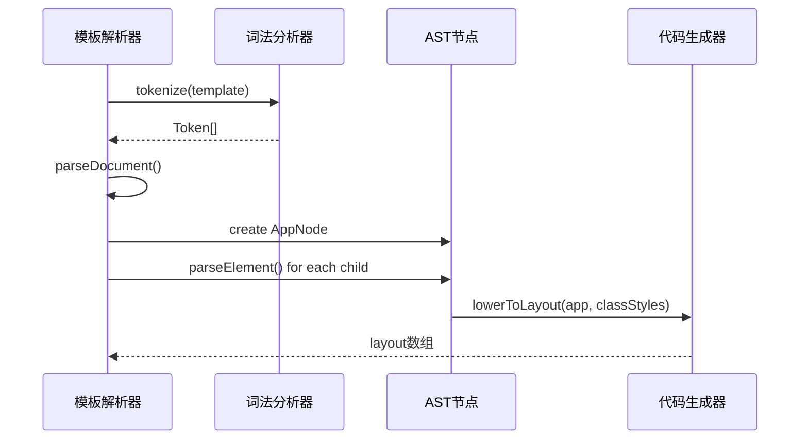
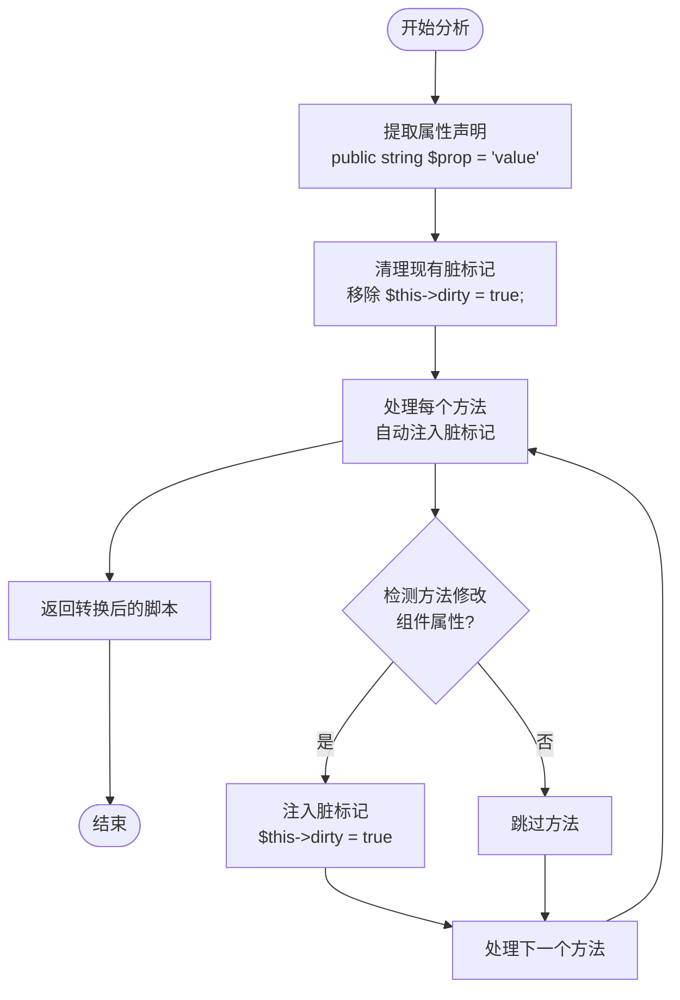
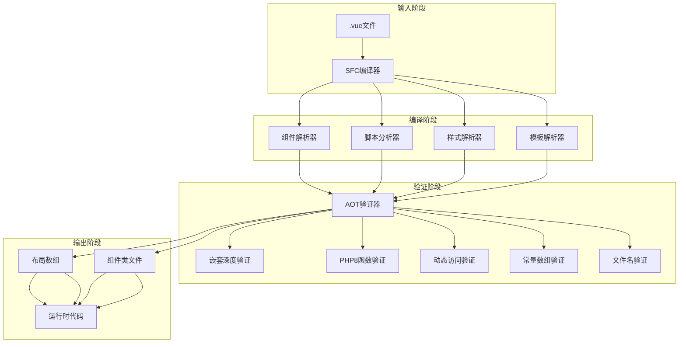
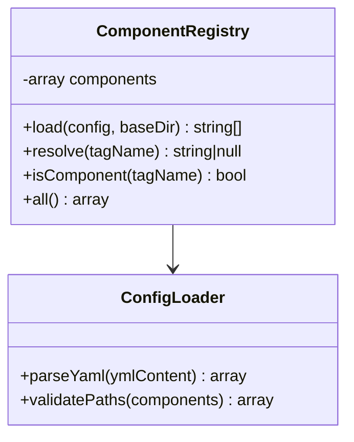
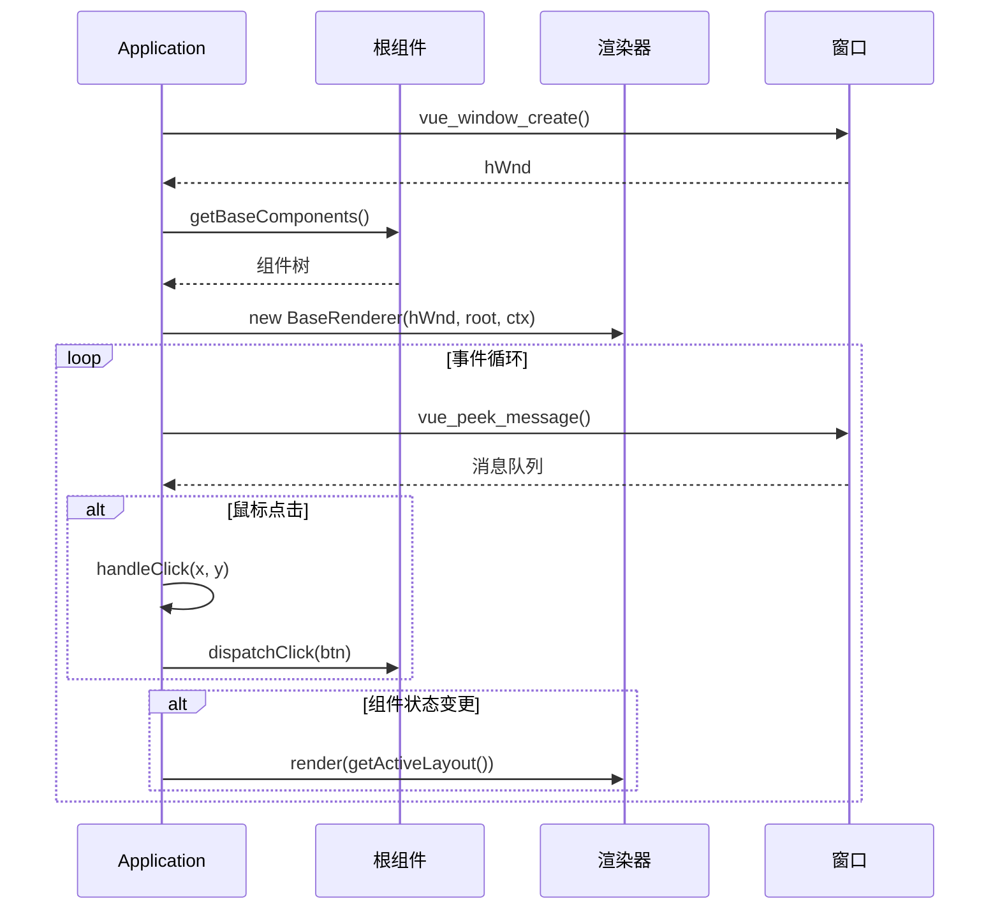
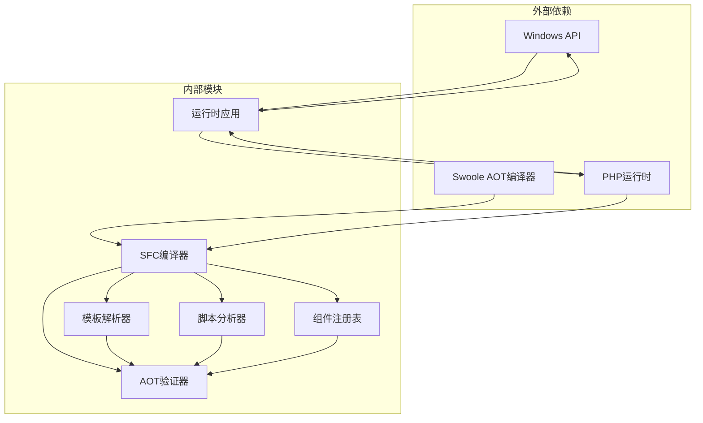

# AOT编译适配机制

<cite>
**本文档引用的文件**
- [aot-validator.php](file://framework/compiler/aot-validator.php)
- [ast-nodes.php](file://framework/compiler/ast-nodes.php)
- [template-parser.php](file://framework/compiler/template-parser.php)
- [script-analyzer.php](file://framework/compiler/script-analyzer.php)
- [component-resolver.php](file://framework/compiler/component-resolver.php)
- [component-registry.php](file://framework/compiler/component-registry.php)
- [sfc-compiler.php](file://framework/sfc-compiler.php)
- [Application.php](file://apps/calculator/Application.php)
- [main.php](file://apps/calculator/main.php)
- [App.vue](file://apps/calculator/App.vue)
- [project.yml](file://apps/calculator/project.yml)
- [vue_calc.stub.php](file://stub/vue_calc.stub.php)
- [sfc-compiler-test.php](file://tests/sfc-compiler-test.php)
- [verify-layout.php](file://tests/verify-layout.php)
</cite>

## 目录
1. [引言](#引言)
2. [项目结构](#项目结构)
3. [核心组件](#核心组件)
4. [架构概览](#架构概览)
5. [详细组件分析](#详细组件分析)
6. [依赖关系分析](#依赖关系分析)
7. [性能考虑](#性能考虑)
8. [故障排除指南](#故障排除指南)
9. [结论](#结论)
10. [附录](#附录)

## 引言

VueCalc项目的AOT（Ahead-of-Time）编译适配机制是一个完整的前端到桌面应用的编译流水线，专门针对Swoole AOT编译器的限制和约束进行了深度适配。该机制通过多种技术手段确保PHP代码能够被Swoole AOT编译器正确编译，同时保持应用程序的功能完整性和性能表现。

本机制的核心目标是在保持Vue.js风格的组件化开发体验的同时，将应用编译为高效的本地可执行文件。这涉及到对PHP语言特性的严格约束、编译时优化策略的应用，以及运行时性能的保障。

## 项目结构

VueCalc项目采用模块化的架构设计，主要分为以下几个核心部分：

**图表来源**
- [sfc-compiler.php:1-25](file://framework/sfc-compiler.php#L1-L25)
- [Application.php:1-322](file://apps/calculator/Application.php#L1-L322)

**章节来源**
- [sfc-compiler.php:1-25](file://framework/sfc-compiler.php#L1-L25)
- [project.yml:1-34](file://apps/calculator/project.yml#L1-L34)

## 核心组件

### AOT验证器（AotValidator）

AOT验证器是整个适配机制的核心组件，负责在编译过程中检查生成的PHP代码是否符合Swoole AOT编译器的要求。它实现了七个关键的验证规则：

1. **文件名约束检查**：限制文件名中点号数量，确保生成的C++符号名称有效
2. **常量数组限制**：禁止使用包含嵌套结构的const数组
3. **变量属性访问限制**：阻止$obj->$var形式的动态属性访问
4. **变量方法调用限制**：禁止$obj->$method()形式的动态方法调用
5. **PHP8函数兼容性**：检测并警告使用PHP8专用函数
6. **变量函数调用限制**：防止$fn()形式的动态函数调用
7. **组件嵌套深度验证**：限制组件的最大嵌套层级

**图表来源**
- [aot-validator.php:18-121](file://framework/compiler/aot-validator.php#L18-L121)

**章节来源**
- [aot-validator.php:1-207](file://framework/compiler/aot-validator.php#L1-L207)

### AST节点系统

VueCalc使用自定义的抽象语法树（AST）节点来表示模板结构，每个节点都包含源文件行号信息以便于错误报告：

- **TemplateNode**：所有节点的基类，包含行号、v-if条件、图层编号和组件组标识
- **AppNode**：应用程序根节点，包含标题、宽度、高度和子节点数组
- **RectNode**：矩形元素节点，包含坐标、尺寸和样式类
- **TextNode**：文本节点，支持v-model绑定和容器属性
- **GridNode**：网格布局节点，包含按钮矩阵配置
- **BtnNode**：按钮节点，包含位置、标签、处理器和参数
- **ComponentRefNode**：组件引用节点，用于子组件解析
- **UnknownNode**：未知标签节点，用于错误报告

**图表来源**
- [ast-nodes.php:9-27](file://framework/compiler/ast-nodes.php#L9-L27)
- [ast-nodes.php:29-45](file://framework/compiler/ast-nodes.php#L29-L45)

**章节来源**
- [ast-nodes.php:1-211](file://framework/compiler/ast-nodes.php#L1-L211)

### 模板解析器

模板解析器采用递归下降解析算法，替代了早期版本中的正则表达式方法。它提供了以下功能：

- **词法分析**：将模板字符串分解为Token流
- **语法分析**：构建AST树结构
- **错误处理**：收集详细的解析错误信息
- **降级处理**：将AST转换为布局数组供代码生成使用

**图表来源**
- [template-parser.php:88-105](file://framework/compiler/template-parser.php#L88-L105)
- [template-parser.php:557-686](file://framework/compiler/template-parser.php#L557-L686)

**章节来源**
- [template-parser.php:1-869](file://framework/compiler/template-parser.php#L1-L869)

### 脚本分析器

脚本分析器负责自动注入脏标记（dirty markers），消除了开发者手动编写脏标记的技术债务。它通过以下步骤工作：

1. **属性提取**：从PHP脚本中提取类型化属性声明
2. **现有标记清理**：移除所有现有的手动脏标记
3. **方法处理**：自动在修改组件属性的方法中注入脏标记

**图表来源**
- [script-analyzer.php:27-43](file://framework/compiler/script-analyzer.php#L27-L43)
- [script-analyzer.php:87-201](file://framework/compiler/script-analyzer.php#L87-L201)

**章节来源**
- [script-analyzer.php:1-281](file://framework/compiler/script-analyzer.php#L1-L281)

## 架构概览

VueCalc的AOT编译适配机制采用分层架构设计，确保各组件职责清晰且相互解耦：

**图表来源**
- [sfc-compiler.php:1-25](file://framework/sfc-compiler.php#L1-L25)
- [sfc-compiler.php:584-598](file://framework/sfc-compiler.php#L584-L598)

**章节来源**
- [sfc-compiler.php:1-819](file://framework/sfc-compiler.php#L1-L819)

## 详细组件分析

### 组件注册表（ComponentRegistry）

组件注册表负责将自定义HTML标签映射到对应的.vue源文件路径。它支持相对路径解析和文件存在性验证：

**图表来源**
- [component-registry.php:14-70](file://framework/compiler/component-registry.php#L14-L70)

**章节来源**
- [component-registry.php:1-70](file://framework/compiler/component-registry.php#L1-L70)

### 组件解析器（ComponentResolver）

组件解析器提供辅助函数来处理组件间的坐标偏移和属性绑定：

- **applyOffset**：为模板节点应用坐标偏移，递归处理网格按钮的坐标计算
- **applyPropBindings**：将父组件的属性绑定映射到子节点的绑定键

**章节来源**
- [component-resolver.php:1-62](file://framework/compiler/component-resolver.php#L1-L62)

### 运行时应用控制器

Application类作为运行时控制器，负责窗口初始化、事件循环、点击分发和组件管理：

**图表来源**
- [Application.php:51-76](file://apps/calculator/Application.php#L51-L76)
- [Application.php:205-263](file://apps/calculator/Application.php#L205-L263)

**章节来源**
- [Application.php:1-322](file://apps/calculator/Application.php#L1-L322)

## 依赖关系分析

VueCalc的依赖关系遵循单一职责原则和依赖倒置原则：

**图表来源**
- [sfc-compiler.php:27-35](file://framework/sfc-compiler.php#L27-L35)
- [Application.php:3-36](file://apps/calculator/Application.php#L3-L36)

**章节来源**
- [sfc-compiler.php:27-35](file://framework/sfc-compiler.php#L27-L35)

## 性能考虑

### 编译时优化策略

VueCalc实现了多种编译时优化策略来提升运行时性能：

1. **常量折叠**：在编译时计算静态布局数据，减少运行时计算开销
2. **死代码消除**：移除未使用的组件和属性，减小生成代码体积
3. **内联优化**：将简单的组件方法内联到调用点，减少函数调用开销

### 运行时性能优化

1. **增量渲染**：仅在组件状态变更时重新渲染，通过脏标记驱动
2. **层次命中测试**：先确定最高活跃层，再进行逆序命中测试，提高点击检测效率
3. **坐标偏移缓存**：在编译时计算坐标偏移，运行时直接应用

**章节来源**
- [Application.php:120-200](file://apps/calculator/Application.php#L120-L200)
- [Application.php:269-311](file://apps/calculator/Application.php#L269-L311)

## 故障排除指南

### 常见AOT编译错误及解决方案

#### 文件名约束错误
**错误现象**：`AOT: Filename 'Calculator.Layout.gen.php' has 2 dots in stem 'Calculator.Layout'. Max 1 allowed.`

**解决方案**：将文件名中的额外点号替换为下划线或连字符，如`Calculator_Layout_gen.php`

#### 常量数组错误
**错误现象**：`AOT: const with array value detected. Use a function that returns the array instead.`

**解决方案**：将const声明改为函数调用，如`function getLayout(): array`

#### 动态访问错误
**错误现象**：`AOT: Variable property access detected ('$obj->$var'). Use explicit if/else mapping instead.`

**解决方案**：使用显式的if-else分支替代动态属性访问

#### PHP8函数兼容性警告
**错误现象**：`AOT: PHP8 function 'str_contains()' detected. May not be available in all PHP versions.`

**解决方案**：使用兼容的替代函数，如`strpos($haystack, $needle) !== false`

### 调试技巧

1. **启用AST转储**：使用`--dump-ast`参数查看编译过程中的AST结构
2. **验证器报告**：仔细阅读AOT验证器的详细报告，了解具体的违规模式
3. **单元测试**：运行`sfc-compiler-test.php`验证编译器功能的正确性

**章节来源**
- [sfc-compiler-test.php:315-373](file://tests/sfc-compiler-test.php#L315-L373)
- [sfc-compiler-test.php:617-626](file://tests/sfc-compiler-test.php#L617-L626)

## 结论

VueCalc项目的AOT编译适配机制通过精心设计的架构和严格的约束管理，成功地将Vue.js风格的组件化开发与Swoole AOT编译器的要求相结合。该机制的主要优势包括：

1. **完整性**：覆盖了从模板解析到代码生成的完整编译流水线
2. **可靠性**：通过AOT验证器确保生成代码的兼容性
3. **性能**：实现了多种编译时和运行时优化策略
4. **可维护性**：模块化设计使得各组件职责清晰，易于维护和扩展

该机制为开发者提供了一个强大的工具链，既保持了现代Web开发的便利性，又实现了高性能本地应用的目标。随着VueCalc项目的持续发展，这套AOT编译适配机制将继续演进，以适应新的需求和技术挑战。

## 附录

### 最佳实践清单

1. **文件命名**：避免在文件名中使用多个点号
2. **属性访问**：使用静态属性访问而非动态访问
3. **函数调用**：避免变量函数调用，使用显式分发
4. **PHP版本**：使用跨版本兼容的函数替代PHP8专用函数
5. **组件设计**：保持组件嵌套深度不超过1级
6. **代码组织**：将复杂逻辑封装在函数中，避免在类外直接执行语句

### 技术债务缓解

脚本分析器通过自动注入脏标记消除了手动编写脏标记的技术债务，提高了代码质量和开发效率。

**章节来源**
- [script-analyzer.php:15-43](file://framework/compiler/script-analyzer.php#L15-L43)