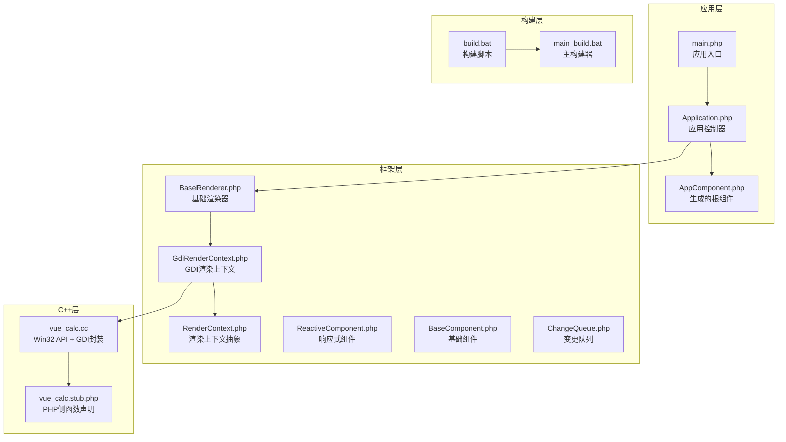
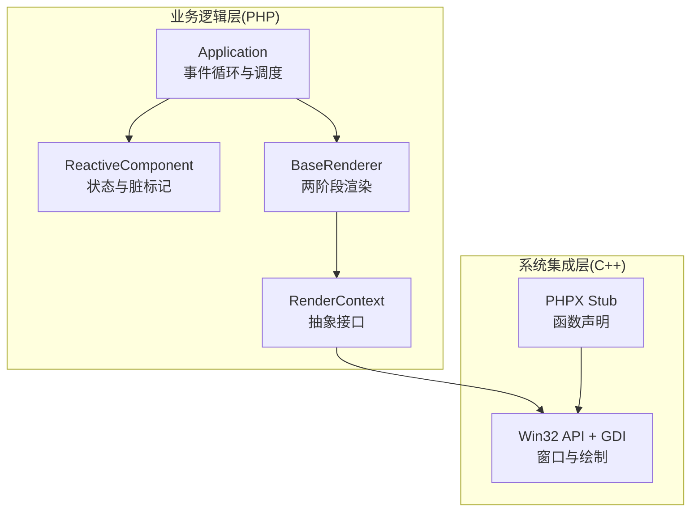
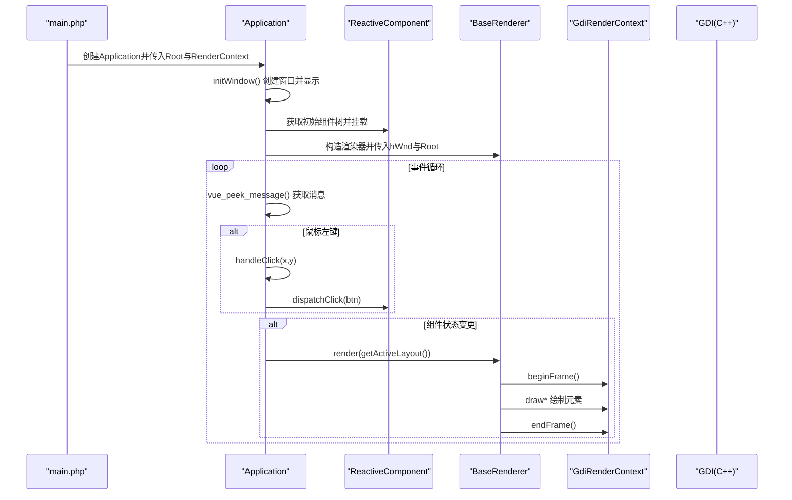
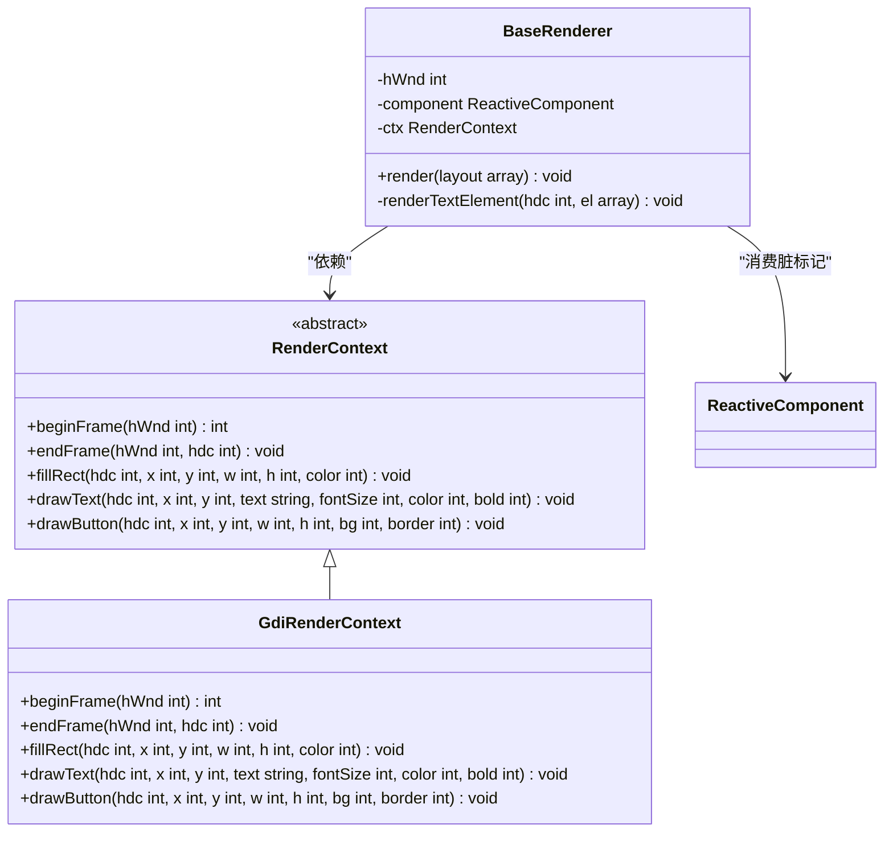
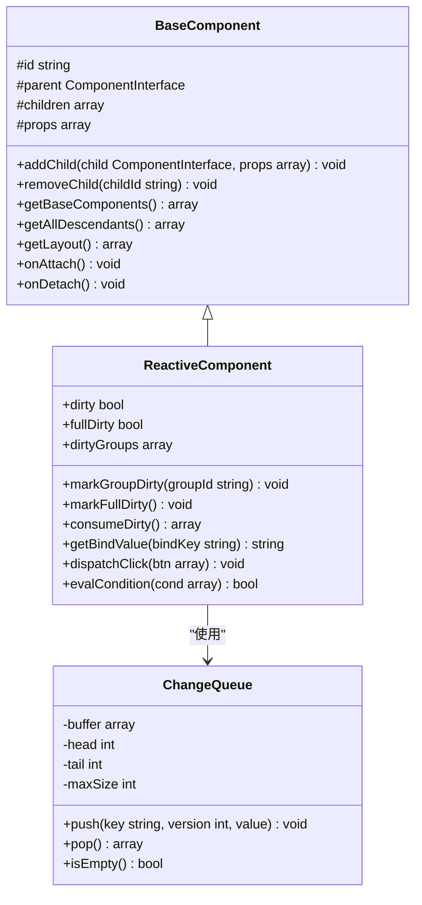
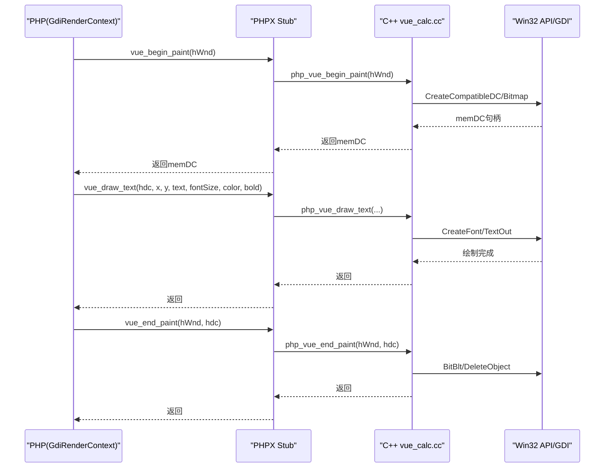
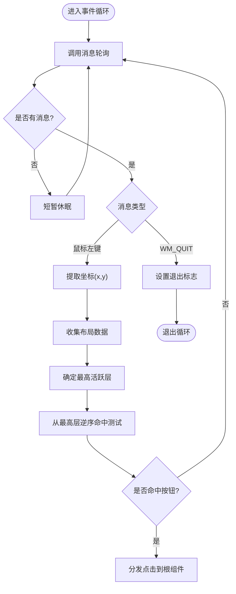
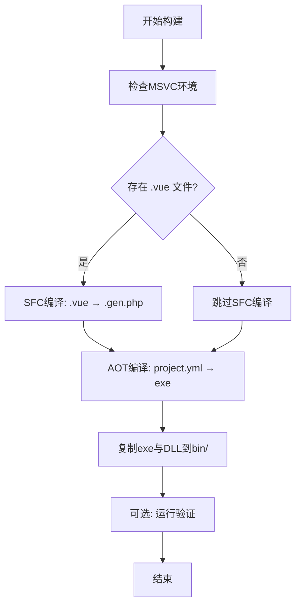
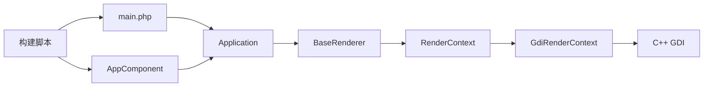

# PHP/C++混合语言架构

<cite>
**本文档引用的文件**
- [Application.php](file://apps/calculator/Application.php)
- [main.php](file://apps/calculator/main.php)
- [vue_calc.cc](file://cpp/vue_calc.cc)
- [GdiRenderContext.php](file://framework/rendering/GdiRenderContext.php)
- [RenderContext.php](file://framework/rendering/RenderContext.php)
- [BaseRenderer.php](file://framework/BaseRenderer.php)
- [ReactiveComponent.php](file://framework/ReactiveComponent.php)
- [BaseComponent.php](file://framework/BaseComponent.php)
- [ChangeQueue.php](file://framework/ChangeQueue.php)
- [vue_calc.stub.php](file://stub/vue_calc.stub.php)
- [build.bat](file://build.bat)
- [main_build.bat](file://main_build.bat)
- [AppComponent.php](file://apps/calculator/gen/AppComponent.php)
- [最佳实践.html](file://docs/AOT 文档/最佳实践.html)
- [VueCalc技术文档_v2.html](file://docs/VueCalc技术文档_v2.html)
</cite>

## 目录
1. [引言](#引言)
2. [项目结构](#项目结构)
3. [核心组件](#核心组件)
4. [架构总览](#架构总览)
5. [详细组件分析](#详细组件分析)
6. [依赖关系分析](#依赖关系分析)
7. [性能考量](#性能考量)
8. [故障排除指南](#故障排除指南)
9. [结论](#结论)
10. [附录](#附录)

## 引言
本项目采用PHP/C++混合语言架构，以PHP作为业务逻辑层，C++作为底层渲染与系统集成层。通过PHPX桥接库实现PHP与C++之间的函数调用与数据传递，结合Swoole AOT编译器将PHP源码编译为原生Windows可执行程序，配合C++ GDI渲染引擎实现高性能桌面GUI应用。该架构在保证开发效率的同时，兼顾编译期优化与运行时性能，适合构建数据驱动的桌面应用。

## 项目结构
项目采用分层组织方式：
- 应用层：应用入口、根组件与组件树管理
- 框架层：渲染抽象、响应式组件、基础组件与变更队列
- C++层：Win32 API封装与GDI绘制原语
- 构建层：SFC编译器、AOT编译器与打包脚本

**图表来源**
- [Application.php:1-322](file://apps/calculator/Application.php#L1-L322)
- [main.php:1-48](file://apps/calculator/main.php#L1-L48)
- [BaseRenderer.php:1-197](file://framework/BaseRenderer.php#L1-L197)
- [GdiRenderContext.php:1-38](file://framework/rendering/GdiRenderContext.php#L1-L38)
- [RenderContext.php:1-30](file://framework/rendering/RenderContext.php#L1-L30)
- [ReactiveComponent.php:1-90](file://framework/ReactiveComponent.php#L1-L90)
- [BaseComponent.php:1-177](file://framework/BaseComponent.php#L1-L177)
- [ChangeQueue.php:1-57](file://framework/ChangeQueue.php#L1-L57)
- [vue_calc.cc:1-157](file://cpp/vue_calc.cc#L1-L157)
- [vue_calc.stub.php:1-24](file://stub/vue_calc.stub.php#L1-L24)
- [build.bat:1-350](file://build.bat#L1-L350)
- [main_build.bat:1-404](file://main_build.bat#L1-L404)

**章节来源**
- [Application.php:1-322](file://apps/calculator/Application.php#L1-L322)
- [main.php:1-48](file://apps/calculator/main.php#L1-L48)
- [vue_calc.cc:1-157](file://cpp/vue_calc.cc#L1-L157)
- [GdiRenderContext.php:1-38](file://framework/rendering/GdiRenderContext.php#L1-L38)
- [BaseRenderer.php:1-197](file://framework/BaseRenderer.php#L1-L197)
- [ReactiveComponent.php:1-90](file://framework/ReactiveComponent.php#L1-L90)
- [BaseComponent.php:1-177](file://framework/BaseComponent.php#L1-L177)
- [ChangeQueue.php:1-57](file://framework/ChangeQueue.php#L1-L57)
- [vue_calc.stub.php:1-24](file://stub/vue_calc.stub.php#L1-L24)
- [build.bat:1-350](file://build.bat#L1-L350)
- [main_build.bat:1-404](file://main_build.bat#L1-L404)

## 核心组件
- 应用控制器(Application)：负责窗口初始化、事件循环、点击分发与脏标记驱动的渲染调度。
- 渲染器(BaseRenderer)：两阶段分层渲染，按层与条件过滤绘制元素与按钮。
- 渲染上下文(RenderContext/GdiRenderContext)：抽象渲染接口与GDI具体实现。
- 响应式组件(ReactiveComponent)：状态管理与脏标记，支持分组级变更追踪。
- 基础组件(BaseComponent)：组件树结构与子组件管理。
- C++桥接(vue_calc.cc)：Win32 API与GDI原语的薄封装，通过PHPX暴露给PHP。
- 构建系统：SFC编译器生成PHP组件与布局，AOT编译器生成原生exe。

**章节来源**
- [Application.php:1-322](file://apps/calculator/Application.php#L1-L322)
- [BaseRenderer.php:1-197](file://framework/BaseRenderer.php#L1-L197)
- [GdiRenderContext.php:1-38](file://framework/rendering/GdiRenderContext.php#L1-L38)
- [RenderContext.php:1-30](file://framework/rendering/RenderContext.php#L1-L30)
- [ReactiveComponent.php:1-90](file://framework/ReactiveComponent.php#L1-L90)
- [BaseComponent.php:1-177](file://framework/BaseComponent.php#L1-L177)
- [vue_calc.cc:1-157](file://cpp/vue_calc.cc#L1-L157)

## 架构总览
该架构采用“业务逻辑PHP + 底层渲染C++”的分层设计。PHP负责数据驱动的UI状态与业务逻辑，C++负责窗口消息循环、双缓冲绘制与GDI图形原语。通过PHPX桥接库实现PHP与C++之间的函数调用与数据传递，构建阶段由Swoole AOT编译器将PHP编译为原生exe，运行时无需PHP运行时，仅依赖系统DLL。

**图表来源**
- [Application.php:1-322](file://apps/calculator/Application.php#L1-L322)
- [ReactiveComponent.php:1-90](file://framework/ReactiveComponent.php#L1-L90)
- [BaseRenderer.php:1-197](file://framework/BaseRenderer.php#L1-L197)
- [RenderContext.php:1-30](file://framework/rendering/RenderContext.php#L1-L30)
- [vue_calc.cc:1-157](file://cpp/vue_calc.cc#L1-L157)
- [vue_calc.stub.php:1-24](file://stub/vue_calc.stub.php#L1-L24)

## 详细组件分析

### 应用控制器(Application)
- 职责：窗口创建与显示、组件树挂载、事件循环、点击命中测试与分发、脏标记驱动渲染。
- 关键流程：initWindow()创建窗口并挂载根组件；run()中持续轮询消息，根据脏标记触发渲染；handleClick()执行分层命中测试并分发到根组件。

**图表来源**
- [Application.php:205-263](file://apps/calculator/Application.php#L205-L263)
- [Application.php:269-322](file://apps/calculator/Application.php#L269-L322)
- [BaseRenderer.php:98-197](file://framework/BaseRenderer.php#L98-L197)
- [GdiRenderContext.php:13-37](file://framework/rendering/GdiRenderContext.php#L13-L37)

**章节来源**
- [Application.php:1-322](file://apps/calculator/Application.php#L1-L322)

### 渲染器(BaseRenderer)与渲染上下文(RenderContext/GdiRenderContext)
- BaseRenderer：两阶段分层渲染，先确定最高活跃层，再逐层绘制元素与按钮；支持条件过滤与对齐逻辑。
- RenderContext：抽象渲染接口，定义beginFrame/endFrame/fillRect/drawText/drawButton。
- GdiRenderContext：将抽象方法委托给C++层的vue_*函数，实现GDI绘制。

**图表来源**
- [RenderContext.php:13-30](file://framework/rendering/RenderContext.php#L13-L30)
- [GdiRenderContext.php:11-38](file://framework/rendering/GdiRenderContext.php#L11-L38)
- [BaseRenderer.php:15-197](file://framework/BaseRenderer.php#L15-L197)

**章节来源**
- [BaseRenderer.php:1-197](file://framework/BaseRenderer.php#L1-L197)
- [RenderContext.php:1-30](file://framework/rendering/RenderContext.php#L1-L30)
- [GdiRenderContext.php:1-38](file://framework/rendering/GdiRenderContext.php#L1-L38)

### 响应式组件与变更队列
- ReactiveComponent：维护dirty标志与dirtyGroups/fullDirty，提供consumeDirty供渲染器消费。
- BaseComponent：组件树结构与子组件管理，支持深度优先遍历与初始组件树获取。
- ChangeQueue：环形缓冲队列，用于变更通知的生产/消费模型。

**图表来源**
- [ReactiveComponent.php:14-90](file://framework/ReactiveComponent.php#L14-L90)
- [BaseComponent.php:16-177](file://framework/BaseComponent.php#L16-L177)
- [ChangeQueue.php:11-57](file://framework/ChangeQueue.php#L11-L57)

**章节来源**
- [ReactiveComponent.php:1-90](file://framework/ReactiveComponent.php#L1-L90)
- [BaseComponent.php:1-177](file://framework/BaseComponent.php#L1-L177)
- [ChangeQueue.php:1-57](file://framework/ChangeQueue.php#L1-L57)

### C++桥接与GDI渲染引擎
- C++层通过PHPX库暴露函数：窗口创建/显示、消息轮询、退出检测，以及GDI绘制原语（双缓冲、填充矩形、绘制文本、绘制按钮）。
- PHP层通过stub函数声明调用C++实现，GdiRenderContext将抽象方法映射到具体C++函数。
- 数据类型转换：整型句柄、颜色RGB值、字符串文本、字体大小与粗细等参数在PHP与C++之间传递。

**图表来源**
- [vue_calc.cc:36-157](file://cpp/vue_calc.cc#L36-L157)
- [vue_calc.stub.php:12-24](file://stub/vue_calc.stub.php#L12-L24)
- [GdiRenderContext.php:13-37](file://framework/rendering/GdiRenderContext.php#L13-L37)

**章节来源**
- [vue_calc.cc:1-157](file://cpp/vue_calc.cc#L1-L157)
- [vue_calc.stub.php:1-24](file://stub/vue_calc.stub.php#L1-L24)
- [GdiRenderContext.php:1-38](file://framework/rendering/GdiRenderContext.php#L1-L38)

### 事件处理与点击分发流程
- 事件循环：持续调用消息轮询函数，处理鼠标按下、窗口关闭等消息。
- 命中测试：从最高活跃层逆序遍历按钮，按条件过滤与矩形相交判断，命中后分发到根组件处理。

**图表来源**
- [Application.php:214-263](file://apps/calculator/Application.php#L214-L263)
- [Application.php:269-322](file://apps/calculator/Application.php#L269-L322)

**章节来源**
- [Application.php:1-322](file://apps/calculator/Application.php#L1-L322)

### 构建与AOT编译流程
- SFC编译：将.vue文件编译为PHP组件类与布局数据文件。
- AOT编译：将PHP源码编译为原生exe，依赖MSVC编译器与php8embed.lib。
- 打包：复制exe与所需DLL到bin目录，便于分发。

**图表来源**
- [build.bat:140-350](file://build.bat#L140-L350)
- [main_build.bat:208-384](file://main_build.bat#L208-L384)

**章节来源**
- [build.bat:1-350](file://build.bat#L1-L350)
- [main_build.bat:1-404](file://main_build.bat#L1-L404)

## 依赖关系分析
- 应用层依赖框架层的渲染器与组件体系，通过RenderContext抽象解耦具体后端。
- 渲染上下文依赖C++层的GDI实现，通过PHPX桥接函数调用。
- 构建脚本依赖Swoole编译器与MSVC工具链，确保AOT编译成功。

**图表来源**
- [Application.php:1-322](file://apps/calculator/Application.php#L1-L322)
- [BaseRenderer.php:1-197](file://framework/BaseRenderer.php#L1-L197)
- [GdiRenderContext.php:1-38](file://framework/rendering/GdiRenderContext.php#L1-L38)
- [vue_calc.cc:1-157](file://cpp/vue_calc.cc#L1-L157)
- [main.php:1-48](file://apps/calculator/main.php#L1-L48)
- [build.bat:1-350](file://build.bat#L1-L350)

**章节来源**
- [Application.php:1-322](file://apps/calculator/Application.php#L1-L322)
- [BaseRenderer.php:1-197](file://framework/BaseRenderer.php#L1-L197)
- [GdiRenderContext.php:1-38](file://framework/rendering/GdiRenderContext.php#L1-L38)
- [vue_calc.cc:1-157](file://cpp/vue_calc.cc#L1-L157)
- [main.php:1-48](file://apps/calculator/main.php#L1-L48)
- [build.bat:1-350](file://build.bat#L1-L350)

## 性能考量
- 编译期优化：AOT编译消除PHP解释执行开销，生成原生exe，启动更快、运行更高效。
- 运行时效率：双缓冲GDI绘制减少闪烁；脏标记驱动的按需渲染避免不必要的重绘；分层渲染按条件过滤提升绘制效率。
- 内存管理：C++层负责句柄与资源释放，PHP层通过桥接函数透明使用；构建时确保DLL与依赖正确打包。

[本节为通用性能讨论，无需列出具体文件来源]

## 故障排除指南
- AOT编译失败：检查MSVC工具链是否就绪，确保project.yml配置正确，避免顶层游离代码与变量类型变化。
- 运行时崩溃：确认bin目录包含exe、php8ts.dll与phpx.dll；使用--run参数验证进程是否正常启动。
- 渲染异常：检查RenderContext实现与C++函数调用返回值；验证布局数据与脏标记状态。

**章节来源**
- [build.bat:253-277](file://build.bat#L253-L277)
- [build.bat:324-340](file://build.bat#L324-L340)
- [main_build.bat:307-334](file://main_build.bat#L307-L334)

## 结论
VueCalc项目通过PHP/C++混合架构实现了高性能桌面GUI应用：PHP负责数据驱动的业务逻辑与渲染调度，C++负责底层窗口与GDI绘制，借助PHPX桥接与Swoole AOT编译器，既保证了开发效率又获得了接近原生的运行性能。该架构适合构建复杂数据驱动的桌面应用，具备良好的扩展性与可维护性。

[本节为总结性内容，无需列出具体文件来源]

## 附录

### 混合语言开发最佳实践
- 严格区分业务逻辑与渲染职责，保持PHP层纯逻辑、C++层纯系统集成。
- 使用脏标记与分层渲染减少无效绘制，合理控制渲染频率。
- 通过stub函数声明统一C++接口，避免硬编码跨语言调用细节。
- 构建阶段确保MSVC与编译器工具链就绪，依赖DLL正确打包。

**章节来源**
- [最佳实践.html:1-14](file://docs/AOT 文档/最佳实践.html#L1-L14)
- [VueCalc技术文档_v2.html:158-160](file://docs/VueCalc技术文档_v2.html#L158-L160)