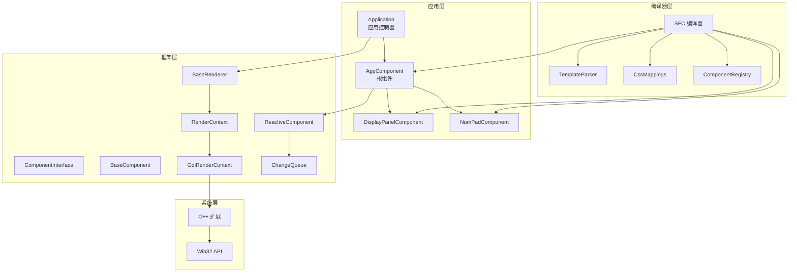
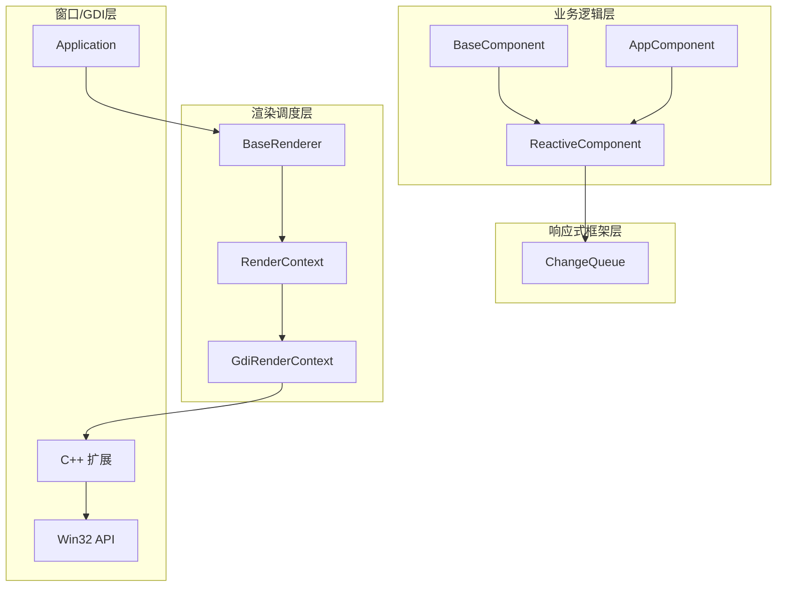
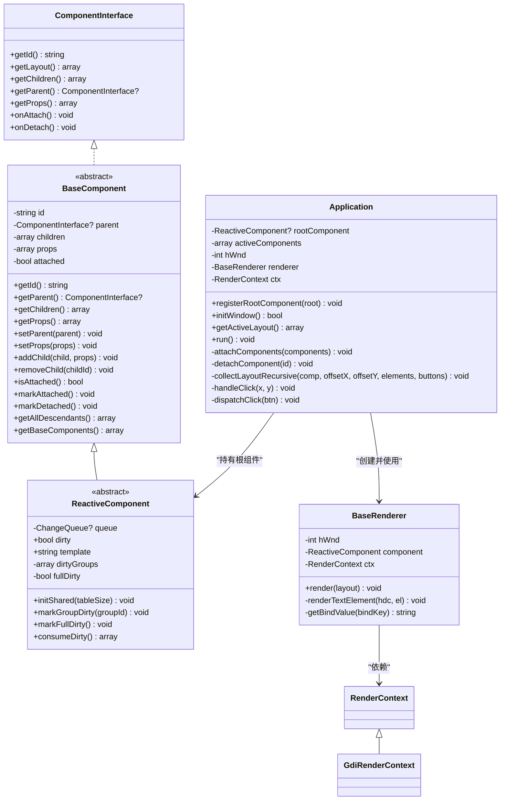
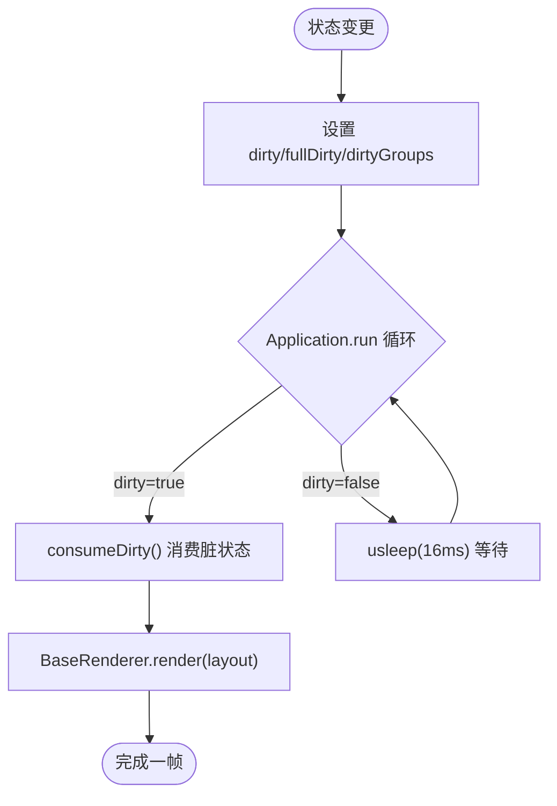
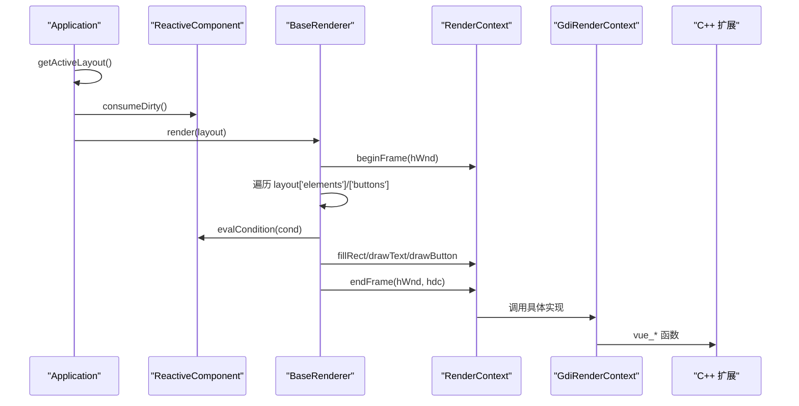
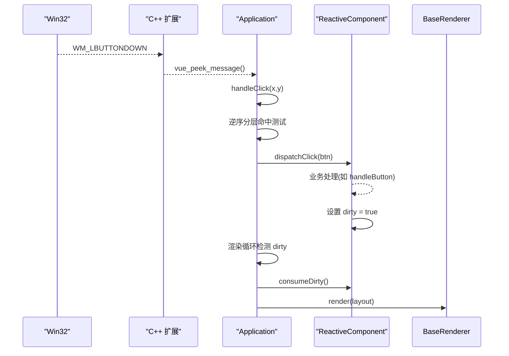
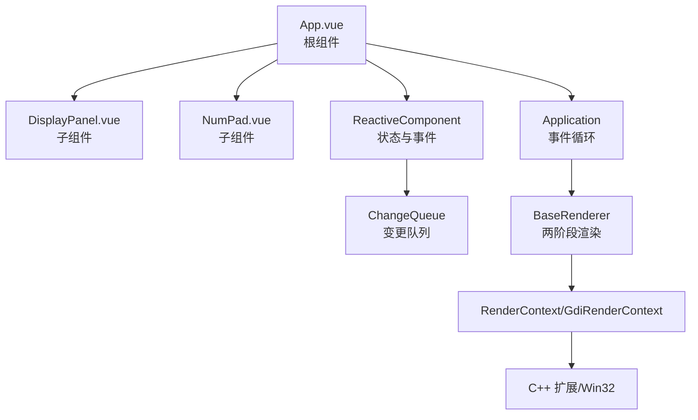
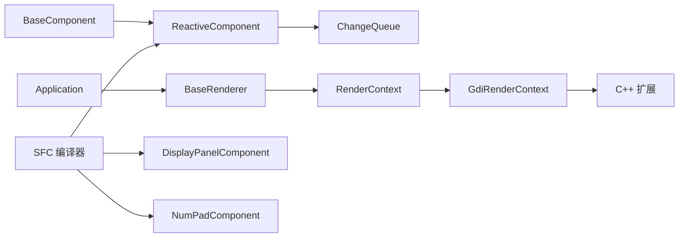

# 分层架构设计

<cite>
**本文引用的文件**
- [framework/BaseComponent.php](file://framework/BaseComponent.php)
- [framework/ReactiveComponent.php](file://framework/ReactiveComponent.php)
- [framework/interfaces/ComponentInterface.php](file://framework/interfaces/ComponentInterface.php)
- [framework/BaseRenderer.php](file://framework/BaseRenderer.php)
- [framework/rendering/RenderContext.php](file://framework/rendering/RenderContext.php)
- [framework/rendering/GdiRenderContext.php](file://framework/rendering/GdiRenderContext.php)
- [framework/ChangeQueue.php](file://framework/ChangeQueue.php)
- [apps/calculator/Application.php](file://apps/calculator/Application.php)
- [apps/calculator/main.php](file://apps/calculator/main.php)
- [apps/calculator/App.vue](file://apps/calculator/App.vue)
- [apps/calculator/components/DisplayPanel.vue](file://apps/calculator/components/DisplayPanel.vue)
- [apps/calculator/components/NumPad.vue](file://apps/calculator/components/NumPad.vue)
- [framework/sfc-compiler.php](file://framework/sfc-compiler.php)
- [cpp/vue_calc.cc](file://cpp/vue_calc.cc)
</cite>

## 目录
1. [引言](#引言)
2. [项目结构](#项目结构)
3. [核心组件](#核心组件)
4. [架构总览](#架构总览)
5. [详细组件分析](#详细组件分析)
6. [依赖分析](#依赖分析)
7. [性能考虑](#性能考虑)
8. [故障排查指南](#故障排查指南)
9. [结论](#结论)
10. [附录](#附录)

## 引言
本文件面向VueCalc项目，系统化阐述其四层架构设计：业务逻辑层（BaseComponent/ReactiveComponent）、响应式框架层、渲染调度层、窗口/GDI层。文档从职责边界、接口定义、交互模式出发，结合组件树结构、生命周期钩子与状态传播机制，解释渲染层如何将响应式状态转换为具体GDI绘制操作，并梳理事件在各层之间的传递路径，为开发者提供清晰的架构理解与设计指导。

## 项目结构
VueCalc采用“SFC单文件组件 + 编译器 + AOT + C++ GDI”的混合架构。前端以.vue描述UI与行为，经SFC编译器生成PHP组件类；运行期由Application驱动事件循环与渲染；底层通过C++扩展封装Win32 GDI绘制原语。

图表来源
- [apps/calculator/Application.php:15-36](file://apps/calculator/Application.php#L15-L36)
- [framework/BaseComponent.php:16-36](file://framework/BaseComponent.php#L16-L36)
- [framework/ReactiveComponent.php:14-35](file://framework/ReactiveComponent.php#L14-L35)
- [framework/BaseRenderer.php:15-26](file://framework/BaseRenderer.php#L15-L26)
- [framework/rendering/RenderContext.php:13-29](file://framework/rendering/RenderContext.php#L13-L29)
- [framework/rendering/GdiRenderContext.php:11-37](file://framework/rendering/GdiRenderContext.php#L11-L37)
- [framework/ChangeQueue.php:11-57](file://framework/ChangeQueue.php#L11-L57)
- [framework/sfc-compiler.php:27-36](file://framework/sfc-compiler.php#L27-L36)
- [cpp/vue_calc.cc:36-84](file://cpp/vue_calc.cc#L36-L84)

章节来源
- [apps/calculator/main.php:19-48](file://apps/calculator/main.php#L19-L48)
- [framework/sfc-compiler.php:1-25](file://framework/sfc-compiler.php#L1-L25)

## 核心组件
- 组件接口与基类
  - ComponentInterface：定义组件树、布局与生命周期的统一契约。
  - BaseComponent：提供父子组件管理、属性配置、挂载状态与后代遍历等通用能力。
  - ReactiveComponent：在BaseComponent之上引入响应式状态、脏标记与条件求值，支撑数据驱动渲染。
- 渲染与上下文
  - BaseRenderer：两阶段分层渲染调度器，负责布局收集、脏状态消费与按层绘制。
  - RenderContext/GdiRenderContext：渲染抽象与Win32 GDI实现，封装双缓冲与基础绘制原语。
- 应用控制与事件循环
  - Application：窗口初始化、组件树挂载、布局收集、事件循环与点击分发。
- 编译器与生成物
  - SFC编译器：解析.vue，生成*Component.php，内置getLayout()/getBindValue()/dispatchClick()/evalCondition()等方法。
- C++扩展
  - 封装Win32窗口与GDI绘制，向PHP层暴露vue_*系列函数。

章节来源
- [framework/interfaces/ComponentInterface.php:13-52](file://framework/interfaces/ComponentInterface.php#L13-L52)
- [framework/BaseComponent.php:16-177](file://framework/BaseComponent.php#L16-L177)
- [framework/ReactiveComponent.php:14-90](file://framework/ReactiveComponent.php#L14-L90)
- [framework/BaseRenderer.php:15-197](file://framework/BaseRenderer.php#L15-L197)
- [framework/rendering/RenderContext.php:13-29](file://framework/rendering/RenderContext.php#L13-L29)
- [framework/rendering/GdiRenderContext.php:11-37](file://framework/rendering/GdiRenderContext.php#L11-L37)
- [apps/calculator/Application.php:15-322](file://apps/calculator/Application.php#L15-L322)
- [framework/sfc-compiler.php:360-582](file://framework/sfc-compiler.php#L360-L582)
- [cpp/vue_calc.cc:36-157](file://cpp/vue_calc.cc#L36-L157)

## 架构总览
VueCalc采用四层分层设计，每层职责清晰、边界明确：

- 业务逻辑层（BaseComponent/ReactiveComponent）
  - 负责组件树结构、生命周期、业务状态与事件处理。
  - ReactiveComponent引入脏标记与条件求值，驱动渲染层增量更新。
- 响应式框架层
  - 提供ChangeQueue等基础设施，承载响应式状态变更的收集与传播。
- 渲染调度层（BaseRenderer）
  - 两阶段分层渲染：先确定最高活跃层，再逐层绘制；同时进行条件过滤与布局偏移应用。
- 窗口/GDI层
  - Application负责消息循环与事件分发；GdiRenderContext将抽象绘制映射到Win32 GDI原语；C++扩展封装底层系统调用。

图表来源
- [framework/BaseComponent.php:16-177](file://framework/BaseComponent.php#L16-L177)
- [framework/ReactiveComponent.php:14-90](file://framework/ReactiveComponent.php#L14-L90)
- [framework/ChangeQueue.php:11-57](file://framework/ChangeQueue.php#L11-L57)
- [framework/BaseRenderer.php:15-197](file://framework/BaseRenderer.php#L15-L197)
- [framework/rendering/RenderContext.php:13-29](file://framework/rendering/RenderContext.php#L13-L29)
- [framework/rendering/GdiRenderContext.php:11-37](file://framework/rendering/GdiRenderContext.php#L11-L37)
- [apps/calculator/Application.php:15-322](file://apps/calculator/Application.php#L15-L322)
- [cpp/vue_calc.cc:36-157](file://cpp/vue_calc.cc#L36-L157)

## 详细组件分析

### 业务逻辑层：组件树与生命周期
- 组件树结构
  - BaseComponent维护父子引用与子组件列表，支持addChild/removeChild、getAllDescendants、getBaseComponents等。
  - ReactiveComponent继承BaseComponent，新增脏标记、组级脏标记与全量脏标记，配合渲染层增量更新。
- 生命周期钩子
  - onAttach/onDetach由Application在挂载/卸载时调用，便于资源申请与释放。
- 状态传播机制
  - ReactiveComponent通过dirty/fullDirty/dirtyGroups记录变更范围；Application在渲染前消费脏状态，触发BaseRenderer执行两阶段分层渲染。

图表来源
- [framework/interfaces/ComponentInterface.php:13-52](file://framework/interfaces/ComponentInterface.php#L13-L52)
- [framework/BaseComponent.php:16-177](file://framework/BaseComponent.php#L16-L177)
- [framework/ReactiveComponent.php:14-90](file://framework/ReactiveComponent.php#L14-L90)
- [apps/calculator/Application.php:15-322](file://apps/calculator/Application.php#L15-L322)
- [framework/BaseRenderer.php:15-197](file://framework/BaseRenderer.php#L15-L197)
- [framework/rendering/RenderContext.php:13-29](file://framework/rendering/RenderContext.php#L13-L29)
- [framework/rendering/GdiRenderContext.php:11-37](file://framework/rendering/GdiRenderContext.php#L11-L37)

章节来源
- [framework/BaseComponent.php:16-177](file://framework/BaseComponent.php#L16-L177)
- [framework/ReactiveComponent.php:14-90](file://framework/ReactiveComponent.php#L14-L90)
- [apps/calculator/Application.php:82-200](file://apps/calculator/Application.php#L82-L200)

### 响应式框架层：变更队列与脏标记
- ChangeQueue
  - 环形缓冲实现，支持push/pop/isEmpty，用于异步/跨帧传播变更。
- 脏标记策略
  - ReactiveComponent提供markGroupDirty/markFullDirty/consumeDirty，支持组级与全量重绘；Application在渲染前消费脏状态，避免重复绘制。
- 条件求值
  - ReactiveComponent提供evalCondition，支持truthy/falsy/==/!=等条件，用于布局与按钮的可见性控制。

图表来源
- [framework/ReactiveComponent.php:37-64](file://framework/ReactiveComponent.php#L37-L64)
- [apps/calculator/Application.php:248-257](file://apps/calculator/Application.php#L248-L257)
- [framework/BaseRenderer.php:98-196](file://framework/BaseRenderer.php#L98-L196)

章节来源
- [framework/ChangeQueue.php:11-57](file://framework/ChangeQueue.php#L11-L57)
- [framework/ReactiveComponent.php:37-64](file://framework/ReactiveComponent.php#L37-L64)

### 渲染调度层：两阶段分层渲染
- 布局收集与偏移应用
  - Application.getActiveLayout递归遍历组件树，动态应用props中的x/y偏移，生成全局布局数组。
- 两阶段渲染
  - 阶段1：扫描elements/buttons，根据condition与layer确定最高活跃层。
  - 阶段2：按层从0到maxLayer绘制elements，再绘制满足条件的buttons；文本元素支持对齐与动态字号。
- 脏状态与条件过滤
  - BaseRenderer在每帧开始消费脏状态，调用ReactiveComponent.evalCondition进行条件过滤，确保只渲染活跃元素。

图表来源
- [apps/calculator/Application.php:120-200](file://apps/calculator/Application.php#L120-L200)
- [framework/BaseRenderer.php:98-196](file://framework/BaseRenderer.php#L98-L196)
- [framework/rendering/GdiRenderContext.php:13-36](file://framework/rendering/GdiRenderContext.php#L13-L36)
- [cpp/vue_calc.cc:90-157](file://cpp/vue_calc.cc#L90-L157)

章节来源
- [framework/BaseRenderer.php:98-196](file://framework/BaseRenderer.php#L98-L196)
- [apps/calculator/Application.php:120-200](file://apps/calculator/Application.php#L120-L200)

### 窗口/GDI层：事件与绘制
- 窗口与消息循环
  - Application.initWindow创建窗口并显示；run中通过vue_peek_message轮询消息，处理WM_LBUTTONDOWN并进行分层命中测试。
- 点击分发
  - Application.handleClick从最高层向下逆序命中测试，命中后调用dispatchClick，最终落到根组件的dispatchClick。
- GDI绘制
  - GdiRenderContext将抽象绘制映射到C++扩展的vue_*函数，实现双缓冲与基础原语绘制。

图表来源
- [apps/calculator/Application.php:205-322](file://apps/calculator/Application.php#L205-L322)
- [framework/ReactiveComponent.php:74-90](file://framework/ReactiveComponent.php#L74-L90)
- [framework/BaseRenderer.php:98-196](file://framework/BaseRenderer.php#L98-L196)
- [cpp/vue_calc.cc:21-84](file://cpp/vue_calc.cc#L21-L84)

章节来源
- [apps/calculator/Application.php:205-322](file://apps/calculator/Application.php#L205-L322)
- [cpp/vue_calc.cc:21-84](file://cpp/vue_calc.cc#L21-L84)

### 组件树结构与交互模式
- 组件树
  - App.vue包含DisplayPanel与NumPad两个子组件，通过props提供x/y偏移；根组件在构造时注册子组件并通过getBaseComponents提供初始组件树。
- 生命周期
  - Application.attachComponents批量调用onAttach；removeChild时调用onDetach。
- 事件处理路径
  - 用户点击 → Application.handleClick → dispatchClick → ReactiveComponent.dispatchClick → 业务方法（如handleButton/reset）→ 设置dirty → 下一帧渲染。

图表来源
- [apps/calculator/App.vue:1-23](file://apps/calculator/App.vue#L1-L23)
- [apps/calculator/components/DisplayPanel.vue:1-12](file://apps/calculator/components/DisplayPanel.vue#L1-L12)
- [apps/calculator/components/NumPad.vue:1-37](file://apps/calculator/components/NumPad.vue#L1-L37)
- [framework/sfc-compiler.php:534-582](file://framework/sfc-compiler.php#L534-L582)
- [apps/calculator/Application.php:82-112](file://apps/calculator/Application.php#L82-L112)

章节来源
- [apps/calculator/App.vue:1-23](file://apps/calculator/App.vue#L1-L23)
- [apps/calculator/components/DisplayPanel.vue:1-12](file://apps/calculator/components/DisplayPanel.vue#L1-L12)
- [apps/calculator/components/NumPad.vue:1-37](file://apps/calculator/components/NumPad.vue#L1-L37)
- [framework/sfc-compiler.php:534-582](file://framework/sfc-compiler.php#L534-L582)
- [apps/calculator/Application.php:82-112](file://apps/calculator/Application.php#L82-L112)

## 依赖分析
- 组件耦合与内聚
  - BaseComponent与ReactiveComponent形成清晰的继承关系，职责内聚：前者专注树结构与生命周期，后者专注响应式状态。
  - Application与BaseRenderer通过RenderContext解耦，便于替换不同后端。
- 外部依赖
  - C++扩展提供窗口与GDI能力；编译器生成的组件类依赖ReactiveComponent基类。
- 潜在风险
  - 若ReactiveComponent的evalCondition或getBindValue实现不一致，可能导致渲染异常；需在编译器阶段严格校验。

图表来源
- [framework/BaseComponent.php:16-177](file://framework/BaseComponent.php#L16-L177)
- [framework/ReactiveComponent.php:14-90](file://framework/ReactiveComponent.php#L14-L90)
- [framework/ChangeQueue.php:11-57](file://framework/ChangeQueue.php#L11-L57)
- [apps/calculator/Application.php:15-36](file://apps/calculator/Application.php#L15-L36)
- [framework/BaseRenderer.php:15-26](file://framework/BaseRenderer.php#L15-L26)
- [framework/rendering/RenderContext.php:13-29](file://framework/rendering/RenderContext.php#L13-L29)
- [framework/rendering/GdiRenderContext.php:11-37](file://framework/rendering/GdiRenderContext.php#L11-L37)
- [cpp/vue_calc.cc:36-157](file://cpp/vue_calc.cc#L36-L157)
- [framework/sfc-compiler.php:360-582](file://framework/sfc-compiler.php#L360-L582)

章节来源
- [framework/BaseComponent.php:16-177](file://framework/BaseComponent.php#L16-L177)
- [framework/ReactiveComponent.php:14-90](file://framework/ReactiveComponent.php#L14-L90)
- [framework/BaseRenderer.php:15-197](file://framework/BaseRenderer.php#L15-L197)
- [framework/rendering/RenderContext.php:13-29](file://framework/rendering/RenderContext.php#L13-L29)
- [framework/rendering/GdiRenderContext.php:11-37](file://framework/rendering/GdiRenderContext.php#L11-L37)
- [apps/calculator/Application.php:15-322](file://apps/calculator/Application.php#L15-L322)
- [cpp/vue_calc.cc:36-157](file://cpp/vue_calc.cc#L36-L157)
- [framework/sfc-compiler.php:360-582](file://framework/sfc-compiler.php#L360-L582)

## 性能考虑
- 增量渲染
  - 通过dirty/fullDirty/dirtyGroups实现组级与全量重绘控制，减少无效绘制。
- 两阶段分层渲染
  - 先确定最高活跃层，再按层绘制，避免深层元素反复计算。
- AOT兼容遍历
  - 避免foreach对关联数组的类型推断问题，使用array_keys()+for循环提升稳定性。
- 帧率控制
  - Application.run中使用usleep(16ms)维持约60FPS，平衡流畅度与CPU占用。

## 故障排查指南
- 渲染无输出或异常
  - 检查ReactiveComponent是否正确设置dirty；确认Application.consumeDirty被调用；核对BaseRenderer.evalCondition条件。
- 点击无响应
  - 检查Application.handleClick的命中测试顺序与条件；确认dispatchClick最终到达根组件的业务方法。
- 编译器生成异常
  - 查看SFC编译器输出与AOT校验报告，关注getBindValue/dispatchClick/evalCondition生成是否完整。
- GDI绘制问题
  - 检查GdiRenderContext方法映射与C++扩展导出函数；确认beginFrame/endFrame配对。

章节来源
- [apps/calculator/Application.php:248-257](file://apps/calculator/Application.php#L248-L257)
- [framework/BaseRenderer.php:98-196](file://framework/BaseRenderer.php#L98-L196)
- [framework/sfc-compiler.php:562-582](file://framework/sfc-compiler.php#L562-L582)
- [framework/rendering/GdiRenderContext.php:13-36](file://framework/rendering/GdiRenderContext.php#L13-L36)
- [cpp/vue_calc.cc:90-157](file://cpp/vue_calc.cc#L90-L157)

## 结论
VueCalc通过四层架构实现了从SFC组件到GDI绘制的完整链路：业务逻辑层负责状态与事件，响应式框架层提供变更传播，渲染调度层执行两阶段分层渲染，窗口/GDI层承接系统与绘制。该设计在保证AOT兼容性的同时，提供了清晰的职责分离与良好的扩展性，适合构建数据驱动的桌面应用。

## 附录
- 入口与编译流程
  - main.php作为AOT入口，创建根组件、渲染上下文与Application，随后启动事件循环。
  - SFC编译器解析.vue，生成*Component.php，包含getLayout/getBindValue/dispatchClick/evalCondition等方法。
- 示例组件
  - App.vue定义应用布局与业务逻辑；DisplayPanel.vue与NumPad.vue作为子组件，通过props提供偏移与样式。

章节来源
- [apps/calculator/main.php:19-48](file://apps/calculator/main.php#L19-L48)
- [framework/sfc-compiler.php:360-582](file://framework/sfc-compiler.php#L360-L582)
- [apps/calculator/App.vue:1-203](file://apps/calculator/App.vue#L1-L203)
- [apps/calculator/components/DisplayPanel.vue:1-12](file://apps/calculator/components/DisplayPanel.vue#L1-L12)
- [apps/calculator/components/NumPad.vue:1-37](file://apps/calculator/components/NumPad.vue#L1-L37)