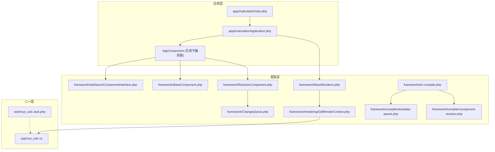
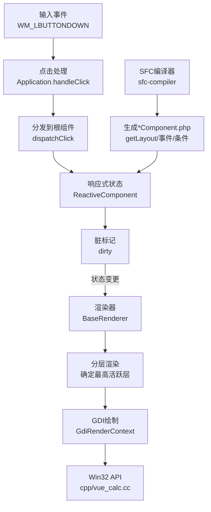
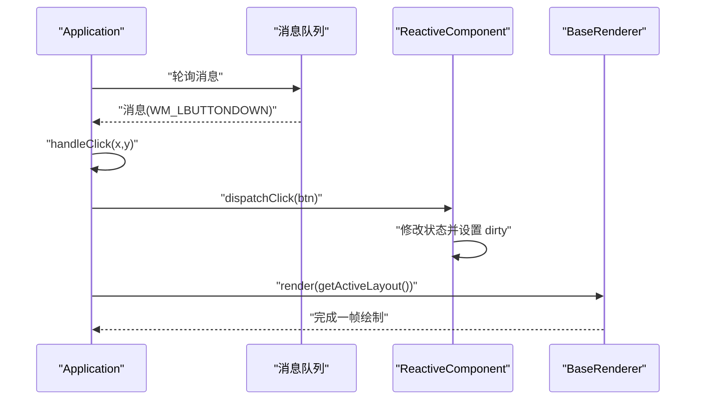
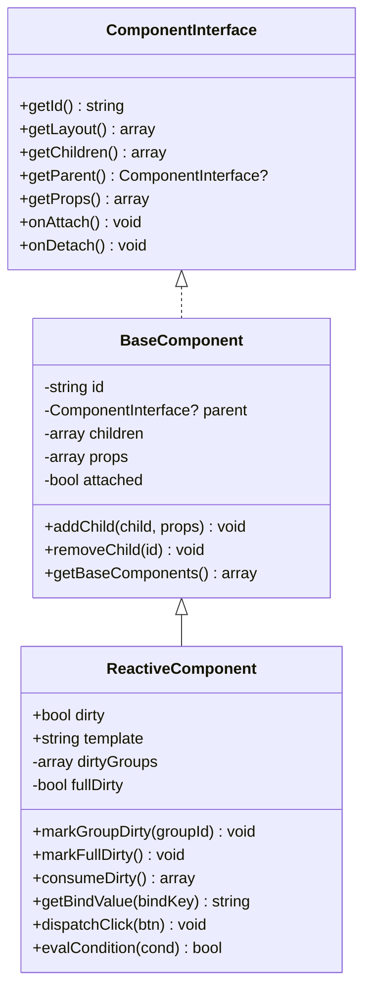
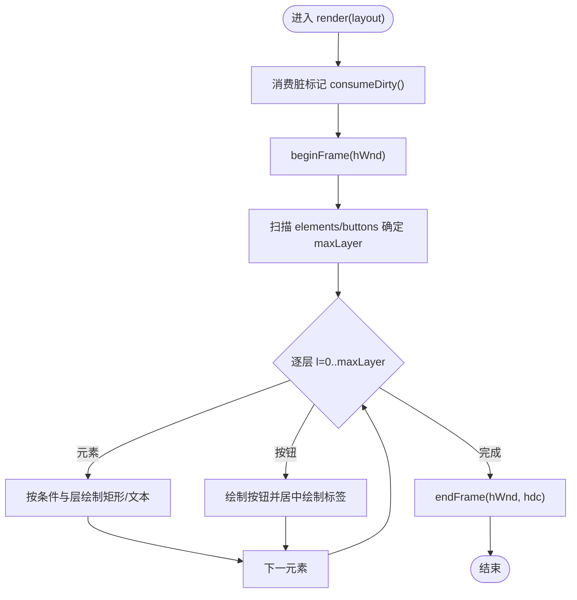
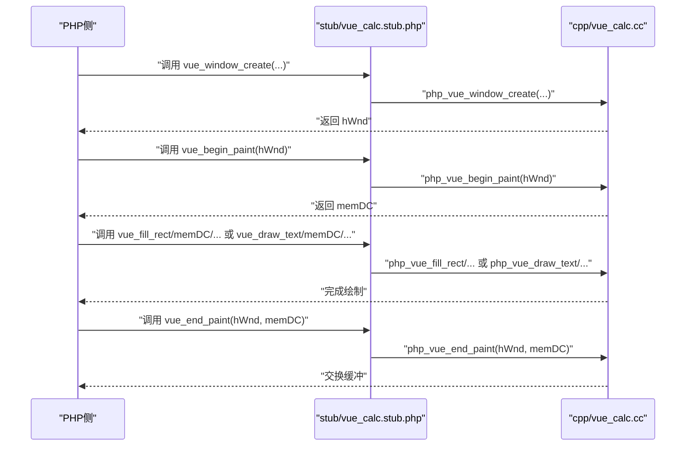
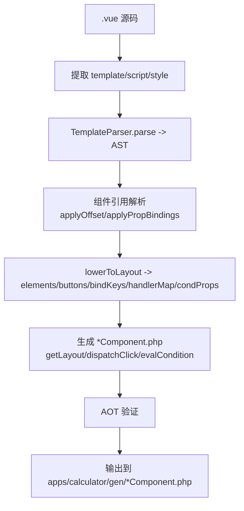
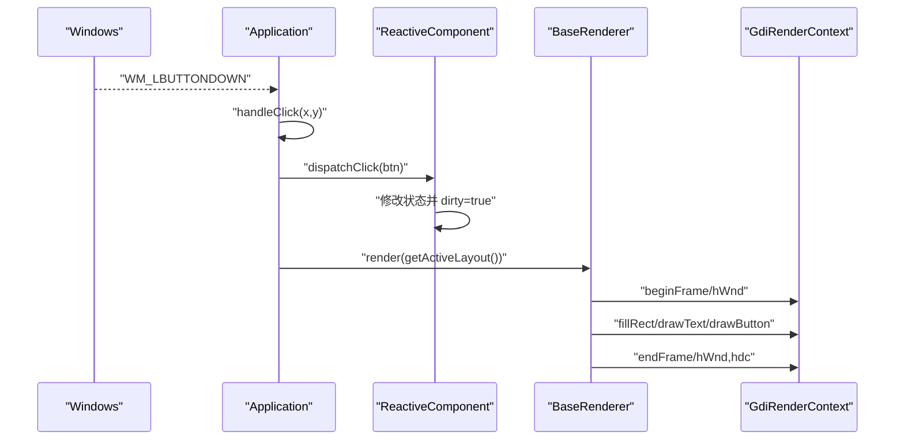
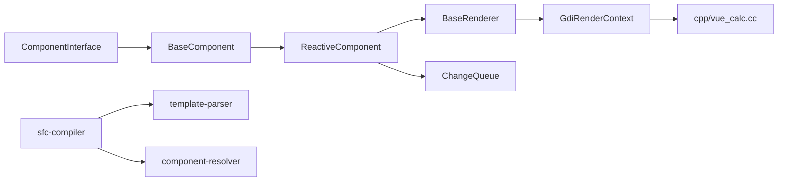

# 技术架构概览

<cite>
**本文引用的文件**
- [apps/calculator/Application.php](file://apps/calculator/Application.php)
- [apps/calculator/main.php](file://apps/calculator/main.php)
- [framework/BaseComponent.php](file://framework/BaseComponent.php)
- [framework/ReactiveComponent.php](file://framework/ReactiveComponent.php)
- [framework/BaseRenderer.php](file://framework/BaseRenderer.php)
- [framework/rendering/GdiRenderContext.php](file://framework/rendering/GdiRenderContext.php)
- [framework/interfaces/ComponentInterface.php](file://framework/interfaces/ComponentInterface.php)
- [framework/ChangeQueue.php](file://framework/ChangeQueue.php)
- [framework/sfc-compiler.php](file://framework/sfc-compiler.php)
- [framework/compiler/template-parser.php](file://framework/compiler/template-parser.php)
- [framework/compiler/component-resolver.php](file://framework/compiler/component-resolver.php)
- [cpp/vue_calc.cc](file://cpp/vue_calc.cc)
- [stub/vue_calc.stub.php](file://stub/vue_calc.stub.php)
- [docs/架构演进路线图.html](file://docs/architecture-roadmap.html)
- [docs/VueCalc技术文档_v2.html](file://docs/VueCalc技术文档_v2.html)
</cite>

## 目录
1. [引言](#引言)
2. [项目结构](#项目结构)
3. [核心组件](#核心组件)
4. [架构总览](#架构总览)
5. [详细组件分析](#详细组件分析)
6. [依赖分析](#依赖分析)
7. [性能考量](#性能考量)
8. [故障排查指南](#故障排查指南)
9. [结论](#结论)
10. [附录](#附录)

## 引言
本文件面向VueCalc项目，提供一份面向开发者的“技术架构概览”。重点阐述以下主题：
- 分层架构设计：业务逻辑层、响应式框架层、渲染调度层、窗口/GDI层的职责与协作方式
- PHP/C++混合架构：如何通过Swoole AOT编译器实现高性能本地桌面应用
- 数据驱动渲染模型（UI = f(state)）：事件处理、状态管理、渲染调度的完整流程
- AOT编译对架构设计的影响及为适配AOT约束所做的技术调整
- 为开发者提供的架构理解框架与设计思路

## 项目结构
VueCalc采用“SFC单文件组件 + PHP响应式框架 + C++ GDI渲染”的分层组织：
- 应用层（apps/calculator）：入口、应用控制器、组件
- 框架层（framework）：组件基类、渲染器、编译器、接口与工具
- C++层（cpp）：Win32 API薄封装，提供窗口与GDI绘制原语
- 文档与桩（docs, stub）：架构说明、构建流程与C++函数桩

**图表来源**
- [apps/calculator/main.php:1-48](file://apps/calculator/main.php#L1-L48)
- [apps/calculator/Application.php:1-322](file://apps/calculator/Application.php#L1-L322)
- [framework/BaseComponent.php:1-177](file://framework/BaseComponent.php#L1-L177)
- [framework/ReactiveComponent.php:1-90](file://framework/ReactiveComponent.php#L1-L90)
- [framework/BaseRenderer.php:1-197](file://framework/BaseRenderer.php#L1-L197)
- [framework/rendering/GdiRenderContext.php:1-38](file://framework/rendering/GdiRenderContext.php#L1-L38)
- [framework/sfc-compiler.php:1-819](file://framework/sfc-compiler.php#L1-L819)
- [framework/compiler/template-parser.php:1-869](file://framework/compiler/template-parser.php#L1-L869)
- [framework/compiler/component-resolver.php:1-62](file://framework/compiler/component-resolver.php#L1-L62)
- [framework/ChangeQueue.php:1-57](file://framework/ChangeQueue.php#L1-L57)
- [cpp/vue_calc.cc:1-157](file://cpp/vue_calc.cc#L1-L157)
- [stub/vue_calc.stub.php:1-24](file://stub/vue_calc.stub.php#L1-L24)

**章节来源**
- [apps/calculator/main.php:1-48](file://apps/calculator/main.php#L1-L48)
- [framework/sfc-compiler.php:1-25](file://framework/sfc-compiler.php#L1-L25)

## 核心组件
- 组件体系
  - ComponentInterface：组件统一接口，定义布局、父子关系、生命周期等契约
  - BaseComponent：组件树结构与属性管理的基础实现
  - ReactiveComponent：响应式组件基类，引入脏标记与变更队列，支撑数据驱动渲染
- 渲染体系
  - BaseRenderer：两阶段分层渲染（确定最高活跃层 → 按层渲染），负责元素与按钮的绘制
  - GdiRenderContext：Win32 GDI后端，封装绘制原语，委托C++实现
- 应用控制
  - Application：窗口初始化、事件循环、点击分发、布局收集与渲染调度
- 编译体系
  - sfc-compiler：SFC编译器，将.vue转为*Component.php（含getLayout、事件映射、条件属性）
  - template-parser：递归下降解析器，生成AST并下推为布局数组
  - component-resolver：组件引用解析与坐标/绑定传播
- C++与桩
  - cpp/vue_calc.cc：Win32 API薄封装（窗口、消息、GDI）
  - stub/vue_calc.stub.php：C++函数在PHP侧的桩声明

**章节来源**
- [framework/interfaces/ComponentInterface.php:1-52](file://framework/interfaces/ComponentInterface.php#L1-L52)
- [framework/BaseComponent.php:1-177](file://framework/BaseComponent.php#L1-L177)
- [framework/ReactiveComponent.php:1-90](file://framework/ReactiveComponent.php#L1-L90)
- [framework/BaseRenderer.php:1-197](file://framework/BaseRenderer.php#L1-L197)
- [framework/rendering/GdiRenderContext.php:1-38](file://framework/rendering/GdiRenderContext.php#L1-L38)
- [apps/calculator/Application.php:1-322](file://apps/calculator/Application.php#L1-L322)
- [framework/sfc-compiler.php:360-582](file://framework/sfc-compiler.php#L360-L582)
- [framework/compiler/template-parser.php:61-122](file://framework/compiler/template-parser.php#L61-L122)
- [framework/compiler/component-resolver.php:1-62](file://framework/compiler/component-resolver.php#L1-L62)
- [cpp/vue_calc.cc:1-157](file://cpp/vue_calc.cc#L1-L157)
- [stub/vue_calc.stub.php:1-24](file://stub/vue_calc.stub.php#L1-L24)

## 架构总览
VueCalc采用“数据驱动 + 分层渲染”的桌面GUI架构：
- 数据驱动渲染：UI = f(state)，组件状态变更触发脏标记，渲染器按层重绘
- 分层渲染：通过layer与condition实现叠加层（如对话框）与chrome按钮（始终可交互）
- 事件驱动：Application从消息队列提取事件，进行命中测试与点击分发
- 混合执行：PHP负责业务逻辑与响应式状态；C++负责窗口与GDI绘制

**图表来源**
- [framework/ReactiveComponent.php:19-64](file://framework/ReactiveComponent.php#L19-L64)
- [framework/BaseRenderer.php:98-196](file://framework/BaseRenderer.php#L98-L196)
- [framework/rendering/GdiRenderContext.php:11-37](file://framework/rendering/GdiRenderContext.php#L11-L37)
- [cpp/vue_calc.cc:21-84](file://cpp/vue_calc.cc#L21-L84)
- [apps/calculator/Application.php:205-322](file://apps/calculator/Application.php#L205-L322)
- [framework/sfc-compiler.php:360-582](file://framework/sfc-compiler.php#L360-L582)

## 详细组件分析

### 应用控制层（Application）
职责
- 窗口初始化与显示
- 组件树挂载与动态偏移应用
- 事件循环与消息分发
- 布局收集与渲染调度

关键流程
- initWindow：创建窗口、显示、挂载根组件、创建渲染器
- run：主事件循环，轮询消息，检测quit，按脏标记重绘
- handleClick：两阶段命中测试（确定最高活跃层 → 逆序命中测试）
- getActiveLayout：递归收集布局，应用累积偏移

**图表来源**
- [apps/calculator/Application.php:51-76](file://apps/calculator/Application.php#L51-L76)
- [apps/calculator/Application.php:205-263](file://apps/calculator/Application.php#L205-L263)
- [apps/calculator/Application.php:269-322](file://apps/calculator/Application.php#L269-L322)
- [framework/BaseRenderer.php:98-196](file://framework/BaseRenderer.php#L98-L196)

**章节来源**
- [apps/calculator/Application.php:1-322](file://apps/calculator/Application.php#L1-L322)

### 响应式框架层（ReactiveComponent）
职责
- 声明式状态管理：直接属性 + 手动脏标记
- 分组级脏标记与全量脏标记
- 事件分发与条件求值接口

要点
- 去除魔术方法，改为显式属性与dirty标志
- 提供markGroupDirty/markFullDirty/consumeDirty
- 子类实现getBindValue/dispatchClick/evalCondition

**图表来源**
- [framework/interfaces/ComponentInterface.php:13-52](file://framework/interfaces/ComponentInterface.php#L13-L52)
- [framework/BaseComponent.php:16-177](file://framework/BaseComponent.php#L16-L177)
- [framework/ReactiveComponent.php:14-90](file://framework/ReactiveComponent.php#L14-L90)

**章节来源**
- [framework/ReactiveComponent.php:1-90](file://framework/ReactiveComponent.php#L1-L90)
- [framework/BaseComponent.php:1-177](file://framework/BaseComponent.php#L1-L177)

### 渲染调度层（BaseRenderer + GdiRenderContext）
职责
- 两阶段分层渲染：先扫描确定最高活跃层，再按层渲染
- 文本对齐与动态字号适配
- 调用GDI上下文绘制矩形、文本、按钮

要点
- AOT安全：使用array_keys()+for循环遍历关联数组，(array)类型转换修复返回嵌套数组类型丢失
- evalCondition在渲染阶段再次校验条件，保证层可见性一致性

**图表来源**
- [framework/BaseRenderer.php:98-196](file://framework/BaseRenderer.php#L98-L196)
- [framework/rendering/GdiRenderContext.php:11-37](file://framework/rendering/GdiRenderContext.php#L11-L37)

**章节来源**
- [framework/BaseRenderer.php:1-197](file://framework/BaseRenderer.php#L1-L197)
- [framework/rendering/GdiRenderContext.php:1-38](file://framework/rendering/GdiRenderContext.php#L1-L38)

### 窗口/GDI层（C++）
职责
- 窗口创建、显示、消息循环
- GDI绘制原语：双缓冲帧、填充矩形、绘制文本、绘制按钮

要点
- C++仅做薄封装，逻辑与状态由PHP实现
- 通过stub声明在PHP侧可用的函数

**图表来源**
- [stub/vue_calc.stub.php:12-24](file://stub/vue_calc.stub.php#L12-L24)
- [cpp/vue_calc.cc:36-157](file://cpp/vue_calc.cc#L36-L157)

**章节来源**
- [cpp/vue_calc.cc:1-157](file://cpp/vue_calc.cc#L1-L157)
- [stub/vue_calc.stub.php:1-24](file://stub/vue_calc.stub.php#L1-L24)

### SFC编译器与模板解析
职责
- 将.vue模板解析为AST，再下推为布局数组（elements/buttons）
- 自动生成*Component.php，包含getLayout、事件映射、条件属性
- 组件引用解析与坐标/绑定传播

要点
- 递归下降解析器替代正则，提升稳定性
- v6 M2：输出*Component.php，生成registerChildren/getBaseComponents
- AOT验证：在生成前对生成代码进行AOT合规性检查

**图表来源**
- [framework/sfc-compiler.php:262-582](file://framework/sfc-compiler.php#L262-L582)
- [framework/compiler/template-parser.php:547-686](file://framework/compiler/template-parser.php#L547-L686)
- [framework/compiler/component-resolver.php:13-61](file://framework/compiler/component-resolver.php#L13-L61)

**章节来源**
- [framework/sfc-compiler.php:1-819](file://framework/sfc-compiler.php#L1-L819)
- [framework/compiler/template-parser.php:1-869](file://framework/compiler/template-parser.php#L1-L869)
- [framework/compiler/component-resolver.php:1-62](file://framework/compiler/component-resolver.php#L1-L62)

### 事件处理与状态管理流程
- 事件：Windows消息（WM_LBUTTONDOWN）经Application.handleClick进行两阶段命中测试
- 点击分发：命中按钮后调用根组件dispatchClick，更新状态并设置dirty
- 渲染：Application.run检测dirty，调用BaseRenderer.render，按层重绘
- 文本绑定：BaseRenderer.renderTextElement根据bindKey从组件取值

**图表来源**
- [apps/calculator/Application.php:223-322](file://apps/calculator/Application.php#L223-L322)
- [framework/BaseRenderer.php:98-196](file://framework/BaseRenderer.php#L98-L196)
- [framework/rendering/GdiRenderContext.php:13-36](file://framework/rendering/GdiRenderContext.php#L13-L36)

**章节来源**
- [apps/calculator/Application.php:1-322](file://apps/calculator/Application.php#L1-L322)
- [framework/BaseRenderer.php:1-197](file://framework/BaseRenderer.php#L1-L197)

## 依赖分析
- 组件接口与继承
  - ComponentInterface定义契约
  - BaseComponent提供组件树与属性管理
  - ReactiveComponent引入脏标记与变更队列
- 渲染依赖
  - BaseRenderer依赖ReactiveComponent的脏标记与条件求值
  - GdiRenderContext依赖C++层的绘制原语
- 编译依赖
  - sfc-compiler依赖template-parser与component-resolver
  - 生成的*Component.php依赖ReactiveComponent基类
- 运行时依赖
  - Application依赖ReactiveComponent与BaseRenderer
  - C++层通过stub暴露函数给PHP调用

**图表来源**
- [framework/interfaces/ComponentInterface.php:13-52](file://framework/interfaces/ComponentInterface.php#L13-L52)
- [framework/BaseComponent.php:16-177](file://framework/BaseComponent.php#L16-L177)
- [framework/ReactiveComponent.php:14-90](file://framework/ReactiveComponent.php#L14-L90)
- [framework/BaseRenderer.php:15-26](file://framework/BaseRenderer.php#L15-L26)
- [framework/rendering/GdiRenderContext.php:11-37](file://framework/rendering/GdiRenderContext.php#L11-L37)
- [framework/sfc-compiler.php:27-35](file://framework/sfc-compiler.php#L27-L35)
- [framework/compiler/template-parser.php:16-17](file://framework/compiler/template-parser.php#L16-L17)
- [framework/compiler/component-resolver.php:1-62](file://framework/compiler/component-resolver.php#L1-L62)
- [framework/ChangeQueue.php:11-57](file://framework/ChangeQueue.php#L11-L57)
- [cpp/vue_calc.cc:9-11](file://cpp/vue_calc.cc#L9-L11)

**章节来源**
- [framework/BaseComponent.php:1-177](file://framework/BaseComponent.php#L1-L177)
- [framework/ReactiveComponent.php:1-90](file://framework/ReactiveComponent.php#L1-L90)
- [framework/BaseRenderer.php:1-197](file://framework/BaseRenderer.php#L1-L197)
- [framework/rendering/GdiRenderContext.php:1-38](file://framework/rendering/GdiRenderContext.php#L1-L38)
- [framework/sfc-compiler.php:1-819](file://framework/sfc-compiler.php#L1-L819)
- [framework/compiler/template-parser.php:1-869](file://framework/compiler/template-parser.php#L1-L869)
- [framework/compiler/component-resolver.php:1-62](file://framework/compiler/component-resolver.php#L1-L62)
- [framework/ChangeQueue.php:1-57](file://framework/ChangeQueue.php#L1-L57)
- [cpp/vue_calc.cc:1-157](file://cpp/vue_calc.cc#L1-L157)

## 性能考量
- 渲染节流：事件循环中使用usleep(16ms)左右维持约60FPS
- 脏标记驱动：仅在状态变更后重绘，减少无效绘制
- 分层渲染：先确定最高活跃层，再按层渲染，避免全量扫描
- AOT优化：使用array_keys()+for循环与类型转换，规避AOT类型推断问题
- 文本适配：根据文本长度动态调整字号，兼顾可读性与性能

[本节为通用性能讨论，无需列出章节来源]

## 故障排查指南
常见问题与定位建议
- 渲染异常或黑屏
  - 检查Application.initWindow是否成功创建窗口
  - 确认BaseRenderer.render中beginFrame/endFrame配对
  - 核查GdiRenderContext.draw*系列函数调用
- 点击无响应
  - 检查Application.handleClick中的命中测试逻辑与条件判断
  - 确认按钮layer与condition设置正确
- AOT编译失败
  - 查看sfc-compiler的AOT验证报告，修正非法语法
  - 确保生成的*Component.php使用array_keys()+for循环与类型转换
- 文本未显示或错位
  - 检查BaseRenderer.renderTextElement的bindKey与容器宽度计算
  - 确认CSS映射生成的颜色与字号

**章节来源**
- [apps/calculator/Application.php:51-76](file://apps/calculator/Application.php#L51-L76)
- [framework/BaseRenderer.php:98-196](file://framework/BaseRenderer.php#L98-L196)
- [framework/rendering/GdiRenderContext.php:13-36](file://framework/rendering/GdiRenderContext.php#L13-L36)
- [framework/sfc-compiler.php:584-598](file://framework/sfc-compiler.php#L584-L598)

## 结论
VueCalc通过“数据驱动 + 分层渲染 + PHP/C++混合执行”的架构，在Swoole AOT环境下实现了高性能的本地桌面应用。其关键优势在于：
- UI = f(state)的数据驱动模型，配合脏标记与分层渲染，确保高效与可控
- 严格的AOT约束下，采用显式属性与类型转换，保障编译期稳定性
- 清晰的分层边界：业务逻辑（PHP）、渲染（GDI）、窗口（C++），便于维护与扩展

[本节为总结性内容，无需列出章节来源]

## 附录

### AOT编译对架构的影响与适配
- 约束
  - 不支持魔术方法、反射、eval
  - foreach遍历关联数组存在类型推断风险
  - 返回嵌套数组后子数组类型可能丢失
- 适配
  - ReactiveComponent去魔术方法，改为直接属性 + 手动dirty
  - BaseRenderer与BaseComponent使用array_keys()+for循环
  - 对返回嵌套数组进行(array)类型转换
  - sfc-compiler生成*Component.php并在生成前进行AOT验证

**章节来源**
- [framework/ReactiveComponent.php:5-13](file://framework/ReactiveComponent.php#L5-L13)
- [framework/BaseComponent.php:11-15](file://framework/BaseComponent.php#L11-L15)
- [framework/BaseRenderer.php:11-14](file://framework/BaseRenderer.php#L11-L14)
- [framework/sfc-compiler.php:584-598](file://framework/sfc-compiler.php#L584-L598)

### Overlay Layer 设计与实现要点
- 分层渲染：通过layer与condition实现叠加层与chrome按钮
- 点击命中：先确定最高活跃层，再逆序命中测试，屏蔽低层元素
- 向后兼容：新增overlay属性即可实现多层叠加，无需修改既有元素

**章节来源**
- [docs/架构演进路线图.html:159-200](file://docs/architecture-roadmap.html#L159-L200)
- [framework/BaseRenderer.php:109-193](file://framework/BaseRenderer.php#L109-L193)
- [apps/calculator/Application.php:269-311](file://apps/calculator/Application.php#L269-L311)