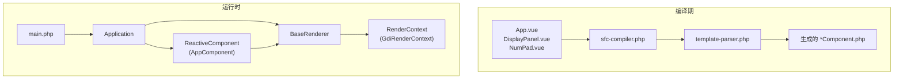
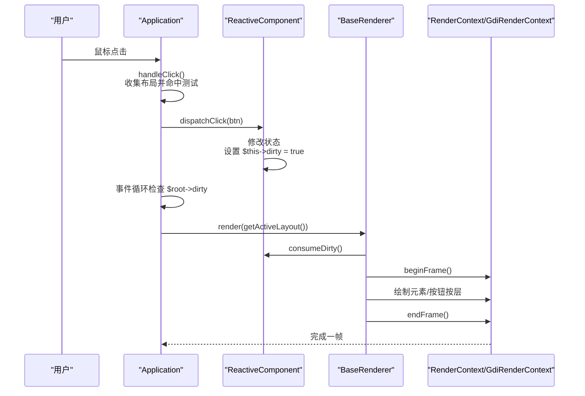
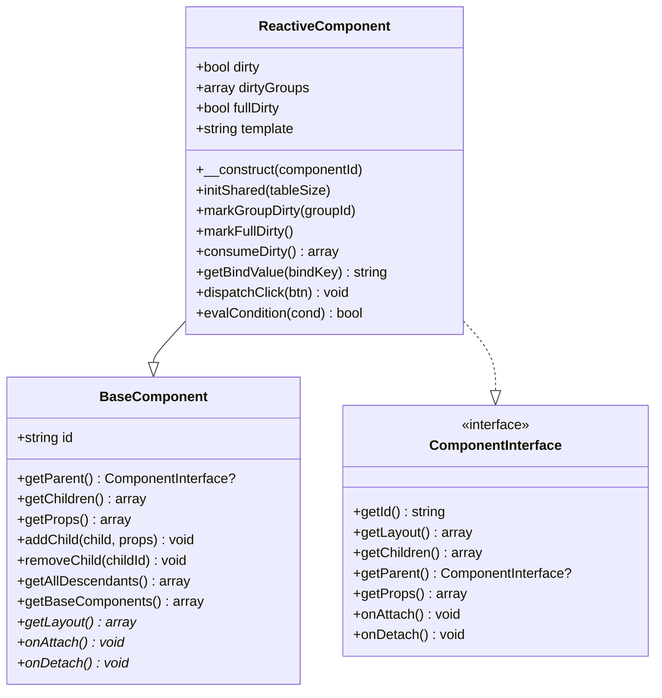
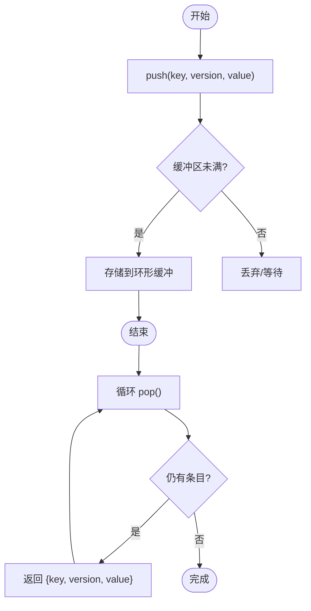
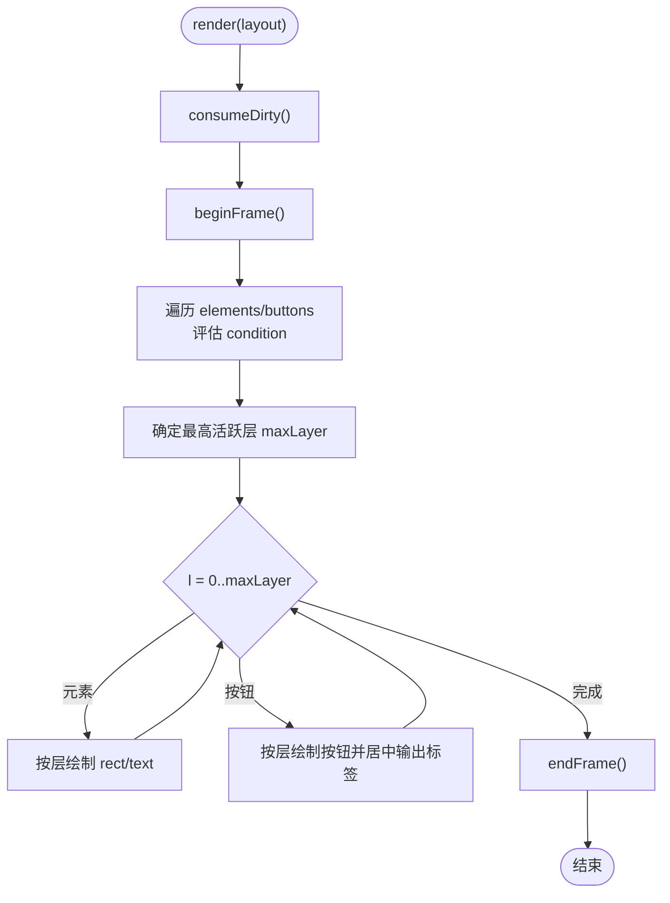
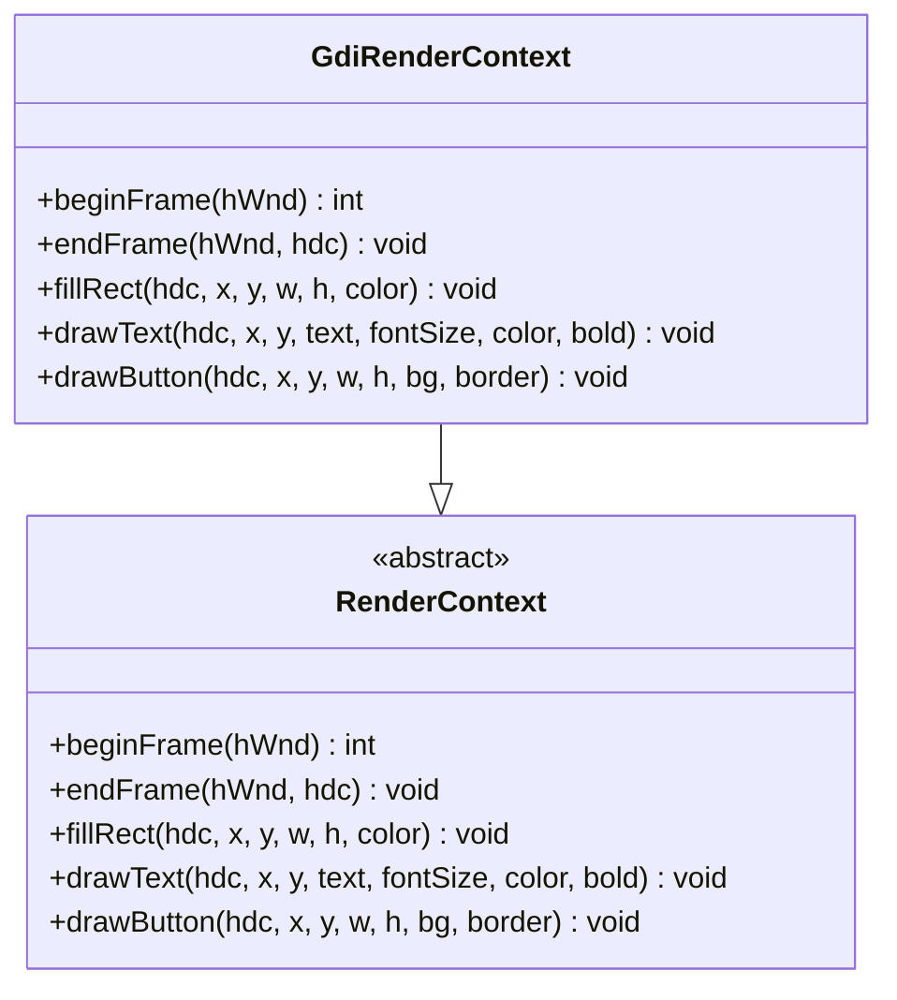
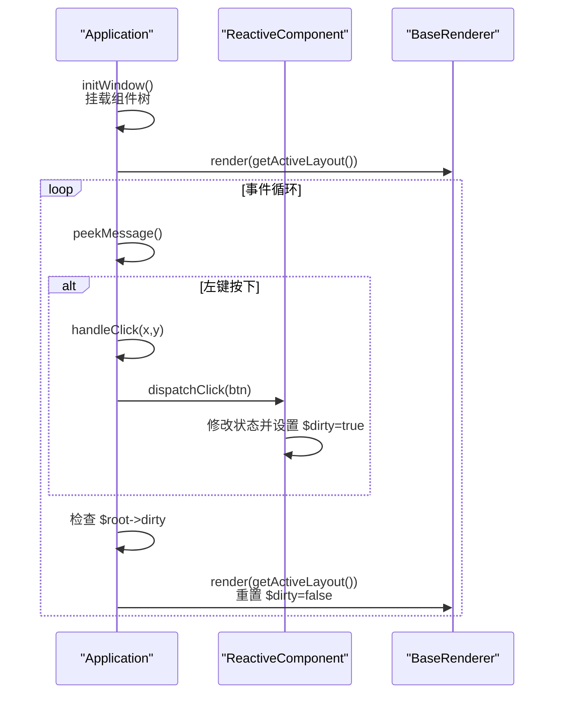
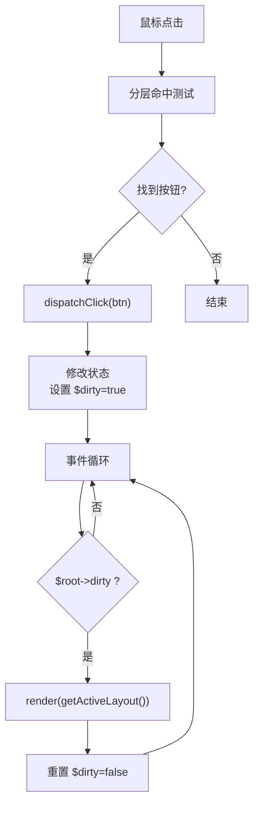
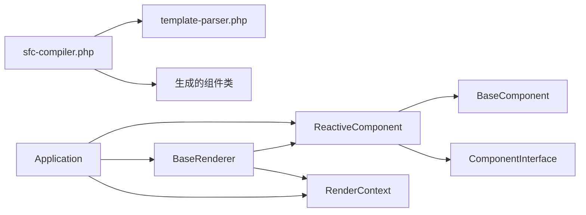

# 数据驱动渲染模型

<cite>
**本文引用的文件**
- [ReactiveComponent.php](file://framework/ReactiveComponent.php)
- [ChangeQueue.php](file://framework/ChangeQueue.php)
- [BaseComponent.php](file://framework/BaseComponent.php)
- [BaseRenderer.php](file://framework/BaseRenderer.php)
- [RenderContext.php](file://framework/rendering/RenderContext.php)
- [GdiRenderContext.php](file://framework/rendering/GdiRenderContext.php)
- [ComponentInterface.php](file://framework/interfaces/ComponentInterface.php)
- [Application.php](file://apps/calculator/Application.php)
- [main.php](file://apps/calculator/main.php)
- [App.vue](file://apps/calculator/App.vue)
- [DisplayPanel.vue](file://apps/calculator/components/DisplayPanel.vue)
- [NumPad.vue](file://apps/calculator/components/NumPad.vue)
- [sfc-compiler.php](file://framework/sfc-compiler.php)
- [template-parser.php](file://framework/compiler/template-parser.php)
</cite>

## 目录
1. [引言](#引言)
2. [项目结构](#项目结构)
3. [核心组件](#核心组件)
4. [架构总览](#架构总览)
5. [详细组件分析](#详细组件分析)
6. [依赖关系分析](#依赖关系分析)
7. [性能考量](#性能考量)
8. [故障排查指南](#故障排查指南)
9. [结论](#结论)
10. [附录](#附录)

## 引言
本文件围绕VueCalc项目的数据驱动渲染模型展开，系统阐述“UI = f(state)”理念在该项目中的实现方式：以响应式状态为核心，结合脏标记系统与增量渲染策略，实现高效、可维护的界面更新。文档重点覆盖以下主题：
- 响应式状态管理与变更检测
- 脏标记系统与分组级重绘控制
- 增量渲染与渲染上下文解耦
- 事件处理流程：从用户交互到状态更新再到界面刷新
- 渲染上下文如何协调不同组件的绘制需求
- 设计原则与实现技巧

## 项目结构
VueCalc采用“单文件组件（SFC）+ 编译器 + 响应式渲染”的架构。前端以.vue组件定义布局与行为，编译器将模板、脚本、样式转换为PHP组件类；运行时通过Application驱动事件循环与渲染，BaseRenderer负责按布局数据进行两阶段分层渲染。

**图表来源**
- [main.php:19-48](file://apps/calculator/main.php#L19-L48)
- [Application.php:32-76](file://apps/calculator/Application.php#L32-L76)
- [sfc-compiler.php:250-351](file://framework/sfc-compiler.php#L250-L351)
- [template-parser.php:88-105](file://framework/compiler/template-parser.php#L88-L105)

**章节来源**
- [main.php:19-48](file://apps/calculator/main.php#L19-L48)
- [Application.php:32-76](file://apps/calculator/Application.php#L32-L76)
- [sfc-compiler.php:250-351](file://framework/sfc-compiler.php#L250-L351)
- [template-parser.php:88-105](file://framework/compiler/template-parser.php#L88-L105)

## 核心组件
- ReactiveComponent：响应式组件基类，提供脏标记、分组级脏标记、全量脏标记与消费接口，并定义getBindValue、dispatchClick、evalCondition等抽象方法，用于数据绑定、事件分发与条件渲染。
- BaseComponent：组件树基础实现，支持父子引用、子组件管理、属性配置与后代收集。
- BaseRenderer：数据驱动渲染器，执行两阶段分层渲染，按条件与层级绘制元素与按钮。
- RenderContext/GdiRenderContext：渲染上下文抽象与Win32 GDI实现，封装底层绘制原语。
- Application：应用控制器，负责窗口初始化、事件循环、布局收集与渲染调度。
- 编译器：将.vue模板解析为AST，再下转为布局数组与组件类，自动生成getBindValue、dispatchClick、evalCondition等方法。

**章节来源**
- [ReactiveComponent.php:14-90](file://framework/ReactiveComponent.php#L14-L90)
- [BaseComponent.php:16-177](file://framework/BaseComponent.php#L16-L177)
- [BaseRenderer.php:15-197](file://framework/BaseRenderer.php#L15-L197)
- [RenderContext.php:13-30](file://framework/rendering/RenderContext.php#L13-L30)
- [GdiRenderContext.php:11-38](file://framework/rendering/GdiRenderContext.php#L11-L38)
- [Application.php:15-322](file://apps/calculator/Application.php#L15-L322)
- [sfc-compiler.php:360-581](file://framework/sfc-compiler.php#L360-L581)

## 架构总览
数据驱动渲染的关键在于“状态变更触发渲染”。Application在事件循环中检查根组件的脏标记，若为真则收集当前布局并交由BaseRenderer渲染；BaseRenderer根据布局数据与条件表达式进行两阶段分层渲染，最终通过RenderContext/GdiRenderContext完成绘制。

**图表来源**
- [Application.php:205-263](file://apps/calculator/Application.php#L205-L263)
- [Application.php:269-321](file://apps/calculator/Application.php#L269-L321)
- [BaseRenderer.php:98-196](file://framework/BaseRenderer.php#L98-L196)
- [ReactiveComponent.php:57-64](file://framework/ReactiveComponent.php#L57-L64)

## 详细组件分析

### ReactiveComponent：状态变更检测与自动重渲染
- 脏标记机制
  - $dirty：全局脏标记，任一状态变更后置为true，驱动渲染循环。
  - $dirtyGroups：分组级脏标记，支持按组选择性重绘，降低全量重绘成本。
  - $fullDirty：全量重绘标记，用于首帧或强制刷新场景。
  - consumeDirty()：渲染前消费脏状态，清空组级标记并复位全量标记。
- 抽象方法
  - getBindValue：根据绑定键返回文本值，供渲染器绘制文本。
  - dispatchClick：接收按钮点击事件，分发到具体处理方法。
  - evalCondition：评估v-if条件，决定元素/按钮是否可见。
- AOT兼容设计
  - 去除魔术方法，改为显式属性与手动脏标记，保证AOT编译兼容性。

**图表来源**
- [ReactiveComponent.php:14-90](file://framework/ReactiveComponent.php#L14-L90)
- [BaseComponent.php:16-177](file://framework/BaseComponent.php#L16-L177)
- [ComponentInterface.php:13-52](file://framework/interfaces/ComponentInterface.php#L13-L52)

**章节来源**
- [ReactiveComponent.php:14-90](file://framework/ReactiveComponent.php#L14-L90)

### ChangeQueue：变更通知队列
- 环形缓冲实现，支持高并发变更推送与消费。
- 提供push(key, version, value)与pop()接口，用于组件状态变更的异步通知。
- 适用于需要将变更事件化、批量处理的场景，减少渲染抖动。

**图表来源**
- [ChangeQueue.php:11-57](file://framework/ChangeQueue.php#L11-L57)

**章节来源**
- [ChangeQueue.php:11-57](file://framework/ChangeQueue.php#L11-L57)

### BaseRenderer：两阶段分层渲染
- 数据驱动渲染流程
  - 消费脏状态：调用consumeDirty()获取全量/分组重绘信息。
  - 收集布局：从组件树获取元素与按钮布局数据，应用偏移。
  - 分层渲染：先确定最高活跃层，再逐层绘制，确保按钮覆盖在上层。
  - 条件渲染：按evalCondition结果过滤不可见元素/按钮。
- 文本渲染增强
  - 自适应字号：根据文本长度动态调整字体大小。
  - 对齐策略：支持左对齐、右对齐与居中对齐，考虑容器边界。
- AOT兼容
  - 使用array_keys()+for循环避免foreach类型推断问题。
  - 对嵌套数组使用类型转换保持引用一致性。

**图表来源**
- [BaseRenderer.php:98-196](file://framework/BaseRenderer.php#L98-L196)

**章节来源**
- [BaseRenderer.php:98-196](file://framework/BaseRenderer.php#L98-L196)

### RenderContext/GdiRenderContext：渲染上下文
- RenderContext：定义与后端无关的绘制接口，包括开始/结束帧、填充矩形、绘制文本、绘制按钮等。
- GdiRenderContext：Win32 GDI实现，直接委托到C++扩展函数，封装常用原语，便于未来扩展至其他后端。

**图表来源**
- [RenderContext.php:13-30](file://framework/rendering/RenderContext.php#L13-L30)
- [GdiRenderContext.php:11-38](file://framework/rendering/GdiRenderContext.php#L11-L38)

**章节来源**
- [RenderContext.php:13-30](file://framework/rendering/RenderContext.php#L13-L30)
- [GdiRenderContext.php:11-38](file://framework/rendering/GdiRenderContext.php#L11-L38)

### Application：事件循环与渲染调度
- 窗口初始化：创建窗口、显示并挂载初始组件树。
- 事件循环：轮询消息，处理鼠标点击；命中测试后分发到根组件的dispatchClick。
- 渲染调度：仅在根组件dirty为真时重新收集布局并渲染；渲染完成后重置脏标记。
- 布局收集：递归遍历组件树，动态应用子组件props偏移，生成全局布局数据。

**图表来源**
- [Application.php:51-76](file://apps/calculator/Application.php#L51-L76)
- [Application.php:205-263](file://apps/calculator/Application.php#L205-L263)
- [Application.php:269-321](file://apps/calculator/Application.php#L269-L321)

**章节来源**
- [Application.php:51-76](file://apps/calculator/Application.php#L51-L76)
- [Application.php:205-263](file://apps/calculator/Application.php#L205-L263)
- [Application.php:269-321](file://apps/calculator/Application.php#L269-L321)

### 事件处理流程：从交互到渲染
- 用户交互：鼠标点击触发Application.handleClick，进行分层命中测试，定位最高层按钮。
- 状态更新：命中按钮后调用dispatchClick，根组件根据handler分发到具体方法，修改状态并设置$dirty=true。
- 界面刷新：事件循环检测到$dirty为真，重新收集布局并调用BaseRenderer.render，完成绘制。

**图表来源**
- [Application.php:269-321](file://apps/calculator/Application.php#L269-L321)
- [App.vue:168-193](file://apps/calculator/App.vue#L168-L193)

**章节来源**
- [Application.php:269-321](file://apps/calculator/Application.php#L269-L321)
- [App.vue:168-193](file://apps/calculator/App.vue#L168-L193)

### 渲染上下文与复杂组件层次
- 渲染上下文解耦：RenderContext抽象出绘制接口，GdiRenderContext实现具体绘制，便于扩展其他后端。
- 组件层次：BaseComponent支持多层嵌套，Application.getBaseComponents递归收集后代，配合BaseRenderer按层渲染，确保复杂布局正确叠加。
- 条件渲染：模板编译时生成evalCondition所需属性集合，运行时按条件过滤不可见元素/按钮，避免无效绘制。

**章节来源**
- [BaseComponent.php:137-170](file://framework/BaseComponent.php#L137-L170)
- [Application.php:120-200](file://apps/calculator/Application.php#L120-L200)
- [BaseRenderer.php:109-136](file://framework/BaseRenderer.php#L109-L136)

## 依赖关系分析
- ReactiveComponent依赖BaseComponent与ComponentInterface，提供响应式能力。
- BaseRenderer依赖ReactiveComponent与RenderContext，执行渲染。
- Application依赖ReactiveComponent、BaseRenderer与RenderContext，协调事件与渲染。
- 编译器依赖template-parser与sfc-compiler，生成组件类与布局数据。

**图表来源**
- [ReactiveComponent.php:14-90](file://framework/ReactiveComponent.php#L14-L90)
- [BaseRenderer.php:15-26](file://framework/BaseRenderer.php#L15-L26)
- [Application.php:15-36](file://apps/calculator/Application.php#L15-L36)
- [sfc-compiler.php:310-311](file://framework/sfc-compiler.php#L310-L311)
- [template-parser.php:88-105](file://framework/compiler/template-parser.php#L88-L105)

**章节来源**
- [ReactiveComponent.php:14-90](file://framework/ReactiveComponent.php#L14-L90)
- [BaseRenderer.php:15-26](file://framework/BaseRenderer.php#L15-L26)
- [Application.php:15-36](file://apps/calculator/Application.php#L15-L36)
- [sfc-compiler.php:310-311](file://framework/sfc-compiler.php#L310-L311)
- [template-parser.php:88-105](file://framework/compiler/template-parser.php#L88-L105)

## 性能考量
- 脏标记与增量渲染
  - 仅在$dirty为真时渲染，避免不必要的重绘。
  - 分组级脏标记支持局部重绘，减少全量绘制开销。
- 两阶段分层渲染
  - 先确定最高活跃层，再逐层绘制，避免深层元素被上层遮挡导致的无效绘制。
- 文本渲染优化
  - 根据文本长度动态调整字号，避免超长数字导致的过度绘制。
  - 对齐计算提前完成，减少渲染时的重复计算。
- AOT兼容与内存安全
  - 使用环形缓冲与固定大小数组，避免频繁分配。
  - 遍历关联数组时使用array_keys()+for循环，规避类型推断问题。

[本节为通用性能建议，不直接分析具体文件]

## 故障排查指南
- 渲染异常
  - 检查ReactiveComponent的$dirty是否被正确置位（例如切换对话框时设置$dirty=true）。
  - 确认BaseRenderer的evalCondition与getBindValue生成是否匹配模板中的v-if与:bind。
- 事件不生效
  - 确认按钮的@click处理器名称与参数在dispatchClick中生成。
  - 检查Application.handleClick的命中测试是否正确，注意按钮层与条件过滤。
- 编译错误
  - 模板解析错误会在编译期报告，关注template-parser的错误收集。
  - AOT验证失败时，检查生成的组件类是否满足AOT约束（如foreach类型推断、数组引用等）。

**章节来源**
- [App.vue:188-193](file://apps/calculator/App.vue#L188-L193)
- [Application.php:269-321](file://apps/calculator/Application.php#L269-L321)
- [template-parser.php:783-786](file://framework/compiler/template-parser.php#L783-L786)
- [sfc-compiler.php:586-597](file://framework/sfc-compiler.php#L586-L597)

## 结论
VueCalc通过“UI = f(state)”的数据驱动模型，将状态变更与渲染解耦：ReactiveComponent负责状态与脏标记，Application驱动事件循环与渲染调度，BaseRenderer执行两阶段分层渲染，RenderContext屏蔽后端差异。该设计在保证AOT兼容的同时，提供了清晰的职责划分与良好的扩展性，适合构建高性能的桌面响应式界面。

[本节为总结性内容，不直接分析具体文件]

## 附录
- 设计原则
  - 单向数据流：状态只在组件内部修改，渲染器只读取布局与绑定值。
  - 脏标记最小化：仅在必要时设置$dirty，避免频繁重绘。
  - 条件渲染与分层：利用v-if与层概念，减少无效绘制。
- 实现技巧
  - 编译期生成：将模板与脚本在编译期生成对应方法，降低运行时开销。
  - AOT友好：避免复杂类型推断，使用显式类型与安全遍历模式。
  - 渲染上下文抽象：统一绘制接口，便于移植与扩展。

[本节为通用指导，不直接分析具体文件]